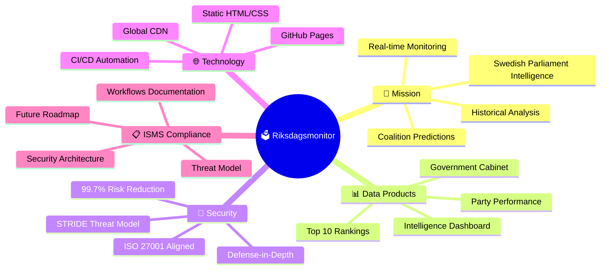
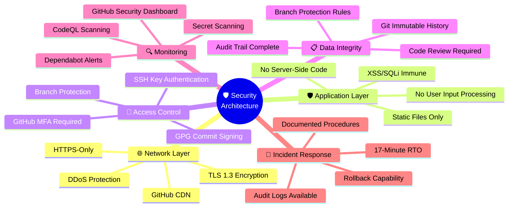
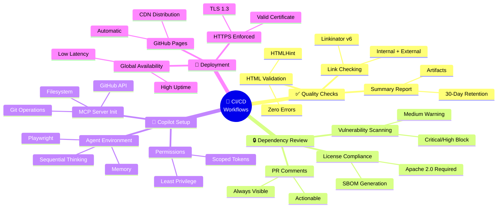
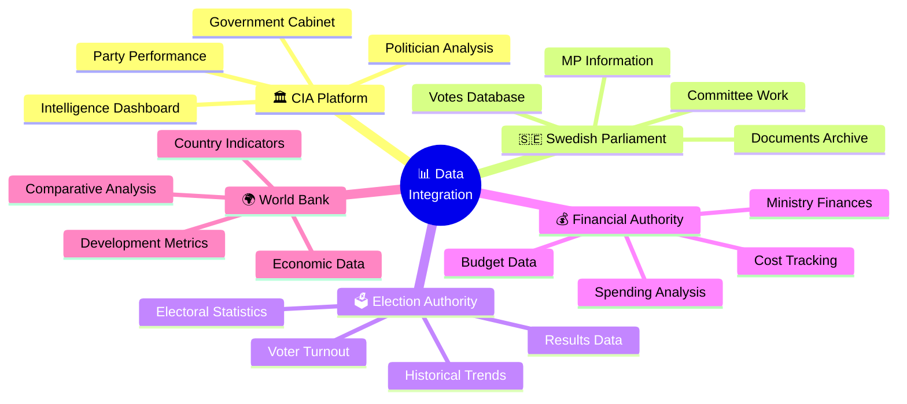
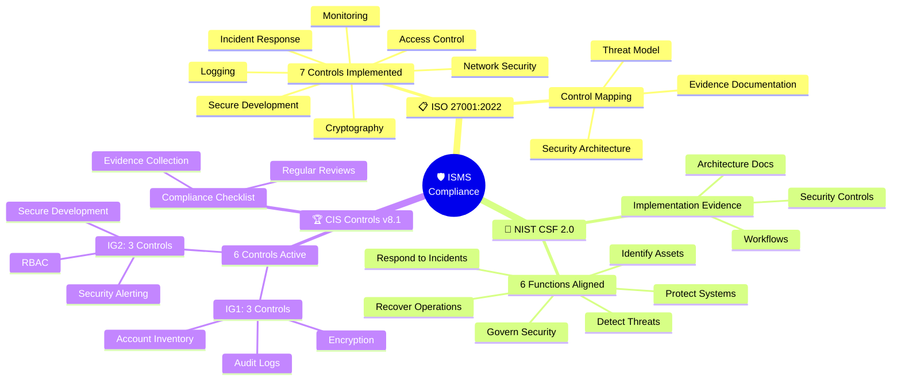
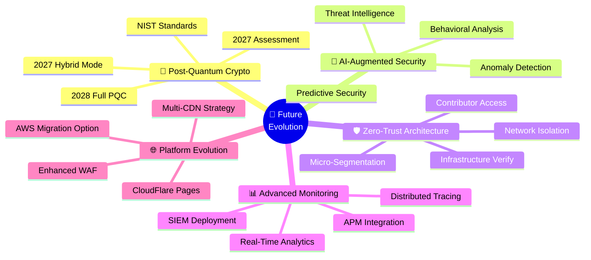
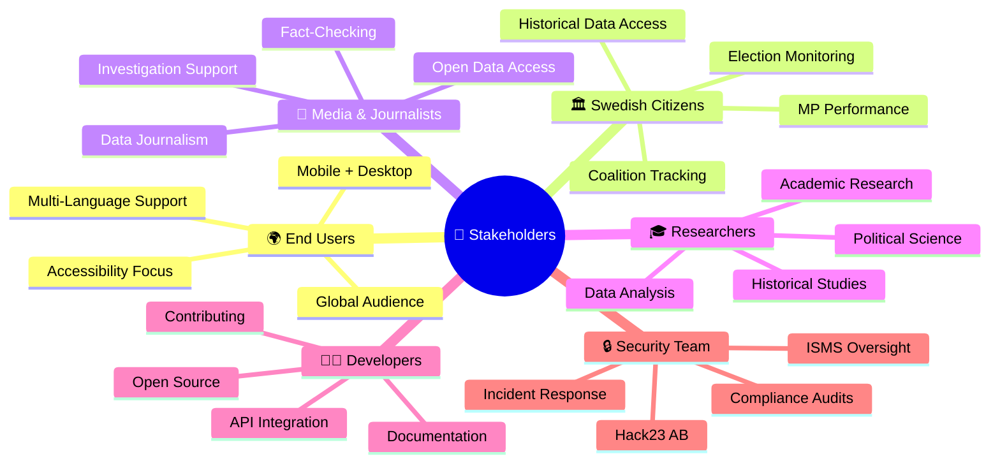
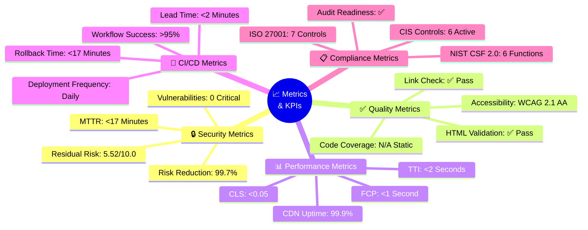
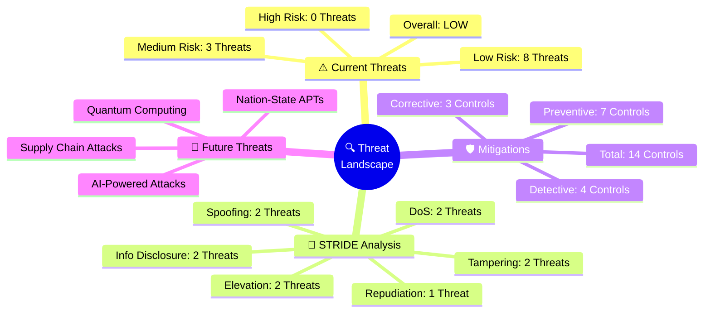
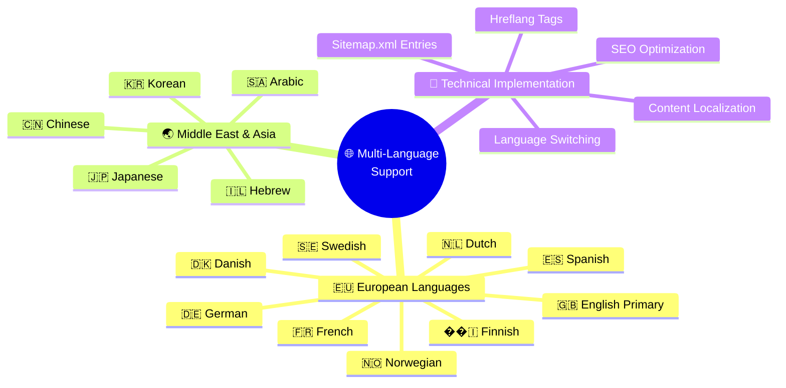

  

<h1 align="center">🗺️ Riksdagsmonitor — System Mindmaps</h1>

  <strong>🧠 Conceptual Maps for Democratic Intelligence Architecture</strong> 
  <em>🎯 System Overview · Security · CI/CD · Data Integration · Compliance</em>

  
  
  
  

**📋 Document Owner:** CEO | **📄 Version:** 1.1 | **📅 Last Updated:** 2026-02-20 (UTC)  
**🔄 Review Cycle:** Quarterly | **⏰ Next Review:** 2026-05-20  
**🏢 Owner:** Hack23 AB (Org.nr 5595347807) | **🏷️ Classification:** Public

---

## 🎯 Purpose

This document provides conceptual mindmaps for Riksdagsmonitor, offering intuitive visual representations of the system's organization, workflows, and architecture. These mindmaps complement the detailed technical documentation and serve as entry points for understanding the platform's structure.

## 📚 Architecture Documentation Map

| Document | Focus | Description |
|----------|-------|-------------|
| [🏛️ Architecture](ARCHITECTURE.md) | 🏗️ C4 Models | System context, containers, components |
| [📊 Data Model](DATA_MODEL.md) | 📊 Data | Entity relationships and data dictionary |
| [🔄 Flowchart](FLOWCHART.md) | 🔄 Processes | Business and data flow diagrams |
| [📈 State Diagram](STATEDIAGRAM.md) | 📈 States | System state transitions and lifecycles |
| **[🧠 Mindmap](MINDMAP.md)** | **🧠 Concepts** | **System conceptual relationships** |
| [💼 SWOT](SWOT.md) | 💼 Strategy | Strategic analysis and positioning |
| [🛡️ Security Architecture](SECURITY_ARCHITECTURE.md) | 🔒 Security | Current security controls and design |
| [🚀 Future Security](FUTURE_SECURITY_ARCHITECTURE.md) | 🔮 Security | Planned security improvements |
| [🎯 Threat Model](THREAT_MODEL.md) | 🎯 Threats | STRIDE/MITRE ATT&CK analysis |
| [🔧 Workflows](WORKFLOWS.md) | 🔧 DevOps | CI/CD automation and pipelines |
| [🛡️ CRA Assessment](CRA-ASSESSMENT.md) | ⚖️ Compliance | EU Cyber Resilience Act conformity |
| [🚀 Future Architecture](FUTURE_ARCHITECTURE.md) | 🔮 Evolution | Architectural evolution roadmap |
| [📊 Future Data Model](FUTURE_DATA_MODEL.md) | 🔮 Data | Enhanced data architecture plans |
| [🔄 Future Flowchart](FUTURE_FLOWCHART.md) | 🔮 Processes | Improved process workflows |
| [📈 Future State Diagram](FUTURE_STATEDIAGRAM.md) | 🔮 States | Advanced state management |
| [🧠 Future Mindmap](FUTURE_MINDMAP.md) | 🔮 Concepts | Capability expansion plans |
| [💼 Future SWOT](FUTURE_SWOT.md) | 🔮 Strategy | Future strategic opportunities |

---

## 1. 🏗️ System Overview Mindmap

```mermaid
mindmap
  root((🗳️ Riksdagsmonitor))
    🎯 Mission
      Swedish Parliament Intelligence
      Real-time Monitoring
      Historical Analysis
      Coalition Predictions
    📊 Data Products
      Intelligence Dashboard
      Party Performance
      Government Cabinet
      Top 10 Rankings
    🔐 Security
      ISO 27001 Aligned
      STRIDE Threat Model
      Defense-in-Depth
      99.7% Risk Reduction
    🌐 Technology
      Static HTML/CSS
      GitHub Pages
      CI/CD Automation
      Global CDN
    📋 ISMS Compliance
      Security Architecture
      Threat Model
      Workflows Documentation
      Future Roadmap
```

---

## 2. 🔐 Security Architecture Mindmap

```mermaid
mindmap
  root((🛡️ Security<br/>Architecture))
    🌐 Network Layer
      TLS 1.3 Encryption
      HTTPS-Only
      GitHub CDN
      DDoS Protection
    🛡️ Application Layer
      Static Files Only
      No Server-Side Code
      No User Input Processing
      XSS/SQLi Immune
    🔑 Access Control
      GitHub MFA Required
      SSH Key Authentication
      GPG Commit Signing
      Branch Protection
    📋 Data Integrity
      Git Immutable History
      Branch Protection Rules
      Code Review Required
      Audit Trail Complete
    🔍 Monitoring
      Dependabot Alerts
      CodeQL Scanning
      Secret Scanning
      GitHub Security Dashboard
    🚨 Incident Response
      Documented Procedures
      Rollback Capability
      17-Minute RTO
      Audit Logs Available
```

---

## 3. 🔄 CI/CD Workflows Mindmap

```mermaid
mindmap
  root((🔄 CI/CD<br/>Workflows))
    ✅ Quality Checks
      HTML Validation
        HTMLHint
        Zero Errors
      Link Checking
        Linkinator v6
        Internal + External
      Summary Report
        Artifacts
        30-Day Retention
    🔒 Dependency Review
      Vulnerability Scanning
        Critical/High Block
        Medium Warning
      License Compliance
        Apache 2.0 Required
        SBOM Generation
      PR Comments
        Always Visible
        Actionable
    🤖 Copilot Setup
      MCP Server Init
        Filesystem
        GitHub API
        Git Operations
      Agent Environment
        Memory
        Sequential Thinking
        Playwright
      Permissions
        Least Privilege
        Scoped Tokens
    🚀 Deployment
      GitHub Pages
        Automatic
        CDN Distribution
      HTTPS Enforced
        TLS 1.3
        Valid Certificate
      Global Availability
        Low Latency
        High Uptime
```

---

## 4. 📊 Data Integration Mindmap

```mermaid
mindmap
  root((📊 Data<br/>Integration))
    🏛️ CIA Platform
      Intelligence Dashboard
      Party Performance
      Government Cabinet
      Politician Analysis
    🇸🇪 Swedish Parliament
      Votes Database
      Documents Archive
      Committee Work
      MP Information
    🗳️ Election Authority
      Results Data
      Voter Turnout
      Electoral Statistics
      Historical Trends
    💰 Financial Authority
      Budget Data
      Spending Analysis
      Ministry Finances
      Cost Tracking
    🌍 World Bank
      Country Indicators
      Economic Data
      Development Metrics
      Comparative Analysis
```

---

## 5. 🛡️ ISMS Compliance Mindmap

```mermaid
mindmap
  root((🛡️ ISMS<br/>Compliance))
    📋 ISO 27001:2022
      7 Controls Implemented
        Access Control
        Cryptography
        Network Security
        Monitoring
        Incident Response
        Secure Development
        Logging
      Control Mapping
        Security Architecture
        Threat Model
        Evidence Documentation
    🎯 NIST CSF 2.0
      6 Functions Aligned
        Identify Assets
        Protect Systems
        Detect Threats
        Respond to Incidents
        Recover Operations
        Govern Security
      Implementation Evidence
        Workflows
        Architecture Docs
        Security Controls
    🏆 CIS Controls v8.1
      6 Controls Active
        IG1: 3 Controls
          Encryption
          Account Inventory
          Audit Logs
        IG2: 3 Controls
          RBAC
          Security Alerting
          Secure Development
      Compliance Checklist
        Regular Reviews
        Evidence Collection
```

---

## 6. 🚀 Future Evolution Mindmap

```mermaid
mindmap
  root((🚀 Future<br/>Evolution))
    🔐 Post-Quantum Crypto
      2027 Assessment
      2027 Hybrid Mode
      2028 Full PQC
      NIST Standards
    🤖 AI-Augmented Security
      Anomaly Detection
      Threat Intelligence
      Behavioral Analysis
      Predictive Security
    🛡️ Zero-Trust Architecture
      Contributor Access
      Infrastructure Verify
      Network Isolation
      Micro-Segmentation
    📊 Advanced Monitoring
      APM Integration
      SIEM Deployment
      Distributed Tracing
      Real-Time Analytics
    🌐 Platform Evolution
      CloudFlare Pages
      Multi-CDN Strategy
      AWS Migration Option
      Enhanced WAF
```

---

## 7. 👥 Stakeholder Interaction Mindmap

```mermaid
mindmap
  root((👥 Stakeholders))
    🌍 End Users
      Global Audience
      Multi-Language Support
      Mobile + Desktop
      Accessibility Focus
    🏛️ Swedish Citizens
      Election Monitoring
      MP Performance
      Coalition Tracking
      Historical Data Access
    📰 Media & Journalists
      Data Journalism
      Fact-Checking
      Investigation Support
      Open Data Access
    🎓 Researchers
      Academic Research
      Political Science
      Data Analysis
      Historical Studies
    👨‍💻 Developers
      Open Source
      API Integration
      Documentation
      Contributing
    🔒 Security Team
      Hack23 AB
      ISMS Oversight
      Incident Response
      Compliance Audits
```

---

## 8. 📈 Metrics & KPIs Mindmap

```mermaid
mindmap
  root((📈 Metrics<br/>& KPIs))
    🔒 Security Metrics
      Residual Risk: 5.52/10.0
      Risk Reduction: 99.7%
      Vulnerabilities: 0 Critical
      MTTR: <17 Minutes
    ✅ Quality Metrics
      HTML Validation: ✅ Pass
      Link Check: ✅ Pass
      Code Coverage: N/A Static
      Accessibility: WCAG 2.1 AA
    📊 Performance Metrics
      FCP: <1 Second
      TTI: <2 Seconds
      CLS: <0.05
      CDN Uptime: 99.9%
    🔄 CI/CD Metrics
      Workflow Success: >95%
      Deployment Frequency: Daily
      Lead Time: <2 Minutes
      Rollback Time: <17 Minutes
    📋 Compliance Metrics
      ISO 27001: 7 Controls
      NIST CSF 2.0: 6 Functions
      CIS Controls: 6 Active
      Audit Readiness: ✅
```

---

## 9. 🔍 Threat Landscape Mindmap

```mermaid
mindmap
  root((🔍 Threat<br/>Landscape))
    ⚠️ Current Threats
      Low Risk: 8 Threats
      Medium Risk: 3 Threats
      High Risk: 0 Threats
      Overall: LOW
    🎯 STRIDE Analysis
      Spoofing: 2 Threats
      Tampering: 2 Threats
      Repudiation: 1 Threat
      Info Disclosure: 2 Threats
      DoS: 2 Threats
      Elevation: 2 Threats
    🛡️ Mitigations
      Preventive: 7 Controls
      Detective: 4 Controls
      Corrective: 3 Controls
      Total: 14 Controls
    🚀 Future Threats
      Quantum Computing
      AI-Powered Attacks
      Supply Chain Attacks
      Nation-State APTs
```

---

## 10. 🌐 Multi-Language Support Mindmap

```mermaid
mindmap
  root((🌐 Multi-Language<br/>Support))
    🇪🇺 European Languages
      🇬🇧 English Primary
      🇸🇪 Swedish
      🇩🇰 Danish
      🇳🇴 Norwegian
      ��🇮 Finnish
      🇩🇪 German
      🇫🇷 French
      🇪🇸 Spanish
      🇳🇱 Dutch
    🌏 Middle East & Asia
      🇸🇦 Arabic
      🇮🇱 Hebrew
      🇯🇵 Japanese
      🇰🇷 Korean
      🇨🇳 Chinese
    🔧 Technical Implementation
      Hreflang Tags
      SEO Optimization
      Sitemap.xml Entries
      Language Switching
      Content Localization
```

---

## 📝 Using These Mindmaps

### For New Team Members
1. Start with **System Overview** to understand the platform
2. Review **Security Architecture** to grasp defense-in-depth
3. Study **CI/CD Workflows** to understand automation
4. Explore **Data Integration** to see external dependencies

### For Security Auditors
1. Begin with **ISMS Compliance** mindmap
2. Examine **Security Architecture** layers
3. Review **Threat Landscape** analysis
4. Check **Metrics & KPIs** for evidence

### For Stakeholders
1. Use **Stakeholder Interaction** to identify your role
2. Review **System Overview** for capabilities
3. Check **Metrics & KPIs** for performance
4. Explore **Future Evolution** for roadmap

### For Developers
1. Study **CI/CD Workflows** for contribution process
2. Review **Security Architecture** for constraints
3. Check **Data Integration** for external APIs
4. Explore **Technical Implementation** details

---

## 📚 Architecture Documentation Map

| Document | Focus | Description |
|----------|-------|-------------|
| [🏛️ Architecture](ARCHITECTURE.md) | 🏗️ C4 Models | System context, containers, components |
| [📊 Data Model](DATA_MODEL.md) | 📊 Data | Entity relationships and data dictionary |
| [🔄 Flowchart](FLOWCHART.md) | 🔄 Processes | Business and data flow diagrams |
| [📈 State Diagram](STATEDIAGRAM.md) | 📈 States | System state transitions and lifecycles |
| **[🧠 Mindmap](MINDMAP.md)** | **🧠 Concepts** | **System conceptual relationships** |
| [💼 SWOT](SWOT.md) | 💼 Strategy | Strategic analysis and positioning |
| [🛡️ Security Architecture](SECURITY_ARCHITECTURE.md) | 🔒 Security | Current security controls and design |
| [🚀 Future Security](FUTURE_SECURITY_ARCHITECTURE.md) | 🔮 Security | Planned security improvements |
| [🎯 Threat Model](THREAT_MODEL.md) | 🎯 Threats | STRIDE/MITRE ATT&CK analysis |
| [🔧 Workflows](WORKFLOWS.md) | 🔧 DevOps | CI/CD automation and pipelines |
| [🛡️ CRA Assessment](CRA-ASSESSMENT.md) | ⚖️ Compliance | EU Cyber Resilience Act conformity |
| [🚀 Future Architecture](FUTURE_ARCHITECTURE.md) | 🔮 Evolution | Architectural evolution roadmap |
| [📊 Future Data Model](FUTURE_DATA_MODEL.md) | 🔮 Data | Enhanced data architecture plans |
| [🔄 Future Flowchart](FUTURE_FLOWCHART.md) | 🔮 Processes | Improved process workflows |
| [📈 Future State Diagram](FUTURE_STATEDIAGRAM.md) | 🔮 States | Advanced state management |
| [🧠 Future Mindmap](FUTURE_MINDMAP.md) | 🔮 Concepts | Capability expansion plans |
| [💼 Future SWOT](FUTURE_SWOT.md) | 🔮 Strategy | Future strategic opportunities |

---

**📋 Document Control:**  
**✅ Approved by:** James Pether Sörling, CEO  
**📤 Distribution:** Public  
**🏷️ Classification:**   
**📅 Effective Date:** 2026-02-20  
**⏰ Next Review:** 2026-05-20  
**🎯 Framework Compliance:**   
