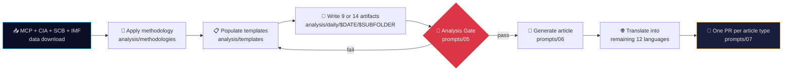
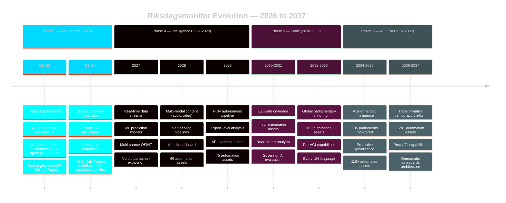
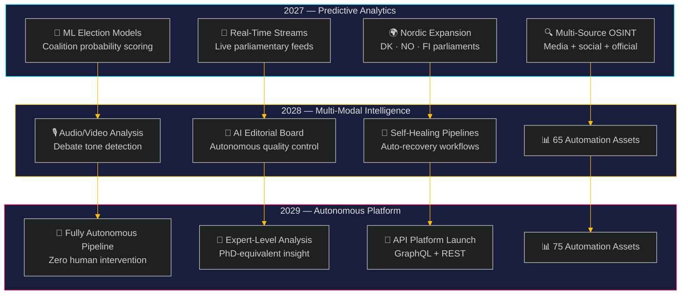
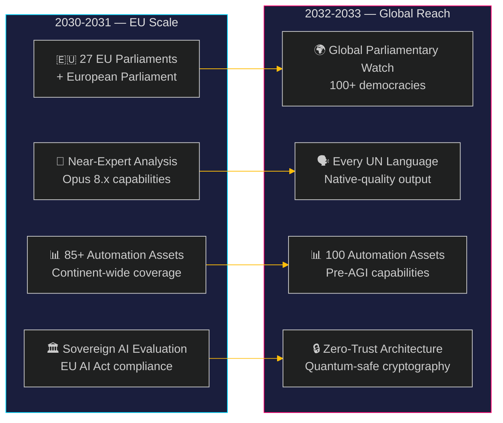
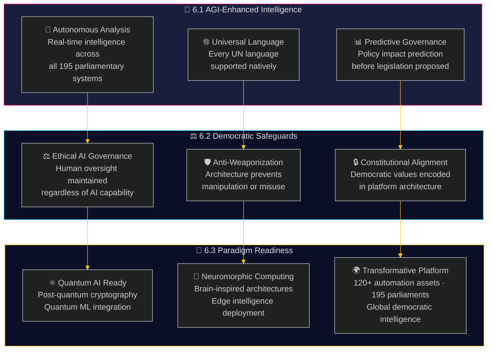
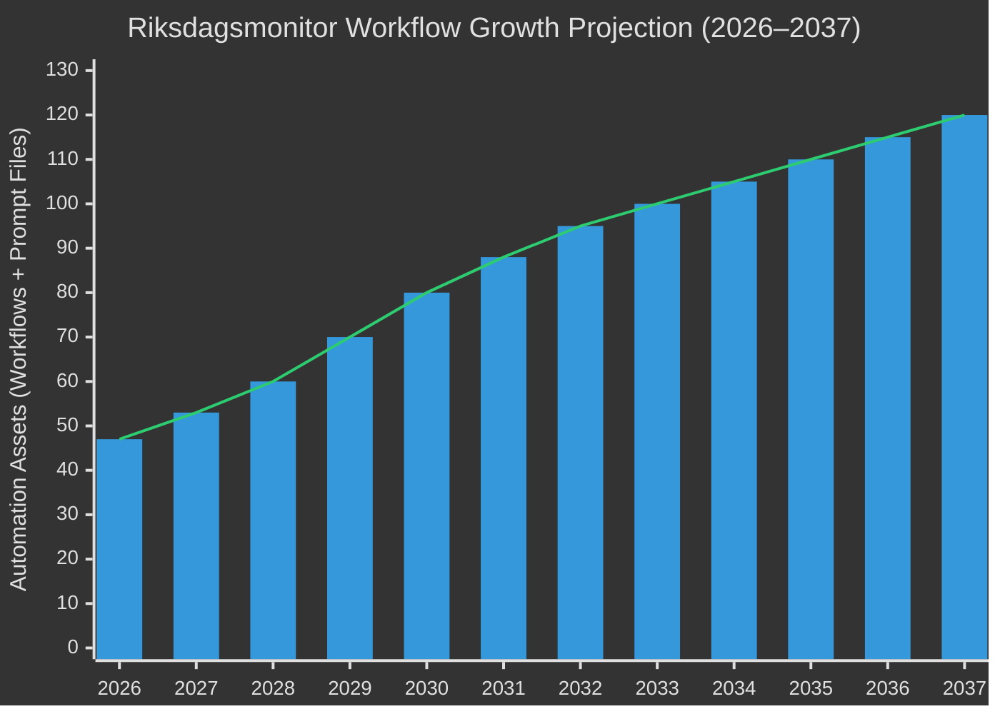

# 🗳️ Riksdagsmonitor

> Swedish Parliament Intelligence Platform - Monitor political activity with systematic transparency

## 🎯 Mission

Riksdagsmonitor is a comprehensive intelligence platform for monitoring political activity in Sweden's Riksdag (Parliament). Built on the [Citizen Intelligence Agency (CIA)](https://github.com/Hack23/cia) platform, we provide systematic transparency through real-time analysis and 50+ years of historical data.

<table>
  <tr>
    <td width="120" align="center">
      
      <div>
        <a href="https://riksdagsmonitor.com">
          
        </a>
      </div>
      <div>
        <a href="https://www.npmjs.com/package/riksdagsmonitor">
          
        </a>
      </div>
    </td>
    <td>
      <p><strong>Swedish Parliament Intelligence Platform</strong> monitoring political activity in Sweden's Riksdag with systematic transparency through real-time analysis and 50+ years of historical data (1971-2024).</p>
      <div>
        <a href="https://scorecard.dev/viewer/?uri=github.com/Hack23/riksdagsmonitor">
          
        </a>
        <a href="https://github.com/Hack23/riksdagsmonitor/actions/workflows/quality-checks.yml">
          
        </a>
        <a href="https://www.bestpractices.dev/projects/12069">
          
        </a>
        <a href="https://github.com/Hack23/riksdagsmonitor/license">
          
        </a>
      </div>
      <div>
        <a href="https://riksdagsmonitor.com"><strong>🌐 Official Website</strong></a> •
        <a href="https://github.com/Hack23/riksdagsmonitor"><strong>📂 Repository</strong></a> •
        <a href="https://hack23.com/riksdagsmonitor-features.html"><strong>✨ Features</strong></a> •
        <a href="https://hack23.com/riksdagsmonitor-docs.html"><strong>📚 Documentation</strong></a>
      </div>
    </td>
  </tr>
</table>

[](https://scorecard.dev/viewer/?uri=github.com/Hack23/riksdagsmonitor)
[](https://github.com/Hack23/riksdagsmonitor/actions/workflows/quality-checks.yml)
[](https://github.com/Hack23/riksdagsmonitor/actions/workflows/dependency-review.yml)
[](https://www.bestpractices.dev/projects/12069)
[](https://github.com/Hack23/riksdagsmonitor/blob/main/LICENSE)
[](https://github.com/Hack23/ISMS-PUBLIC)
[](https://deepwiki.com/Hack23/riksdagsmonitor)


## 📊 Quality Metrics

### CI/CD & Security
[](https://scorecard.dev/viewer/?uri=github.com/Hack23/riksdagsmonitor)
[](https://github.com/Hack23/riksdagsmonitor/actions/workflows/quality-checks.yml)
[](https://github.com/Hack23/riksdagsmonitor/actions/workflows/dependency-review.yml)
[](https://github.com/Hack23/riksdagsmonitor/actions/workflows/codeql.yml)

### Testing
[](https://github.com/Hack23/riksdagsmonitor/actions/workflows/javascript-testing.yml)
[](https://github.com/Hack23/riksdagsmonitor/actions/workflows/jsdoc-validation.yml)
[](https://github.com/Hack23/riksdagsmonitor/actions/workflows/translation-validation.yml)

### Documentation & Release
[](https://github.com/Hack23/riksdagsmonitor/actions/workflows/release.yml)
[](https://riksdagsmonitor.com/docs/api/)
[](https://riksdagsmonitor.com/docs/coverage/)
[](https://riksdagsmonitor.com/docs/cypress/)

### Compliance & Standards
[](LICENSE)
[](https://github.com/Hack23/ISMS-PUBLIC)
[](https://github.com/Hack23/ISMS-PUBLIC/blob/main/Secure_Development_Policy.md)
[](https://github.com/Hack23/ISMS-PUBLIC/blob/main/Secure_Development_Policy.md)
[](https://github.com/Hack23/ISMS-PUBLIC/blob/main/Secure_Development_Policy.md)
[](https://deepwiki.com/Hack23/riksdagsmonitor)

**Security Policy:** Per [Secure Development Policy](https://github.com/Hack23/ISMS-PUBLIC/blob/main/Secure_Development_Policy.md), we maintain defense-in-depth architecture with comprehensive security controls and documentation. See [WORKFLOWS.md](WORKFLOWS.md) for complete CI/CD pipeline documentation and [SECURITY_ARCHITECTURE.md](SECURITY_ARCHITECTURE.md) for security controls.

## 📊 Project Classification

Riksdagsmonitor follows Hack23 AB's comprehensive [Classification Framework](https://github.com/Hack23/ISMS-PUBLIC/blob/main/CLASSIFICATION.md) for security, business continuity, and impact analysis:

### 🎯 Project Classification
[](https://github.com/Hack23/ISMS-PUBLIC/blob/main/CLASSIFICATION.md#project-type-classifications)
[](https://github.com/Hack23/ISMS-PUBLIC/blob/main/CLASSIFICATION.md#project-type-classifications)

### 🔒 Security Classification (CIA Triad)
[](https://github.com/Hack23/ISMS-PUBLIC/blob/main/CLASSIFICATION.md#confidentiality-levels)
[](https://github.com/Hack23/ISMS-PUBLIC/blob/main/CLASSIFICATION.md#integrity-levels)
[](https://github.com/Hack23/ISMS-PUBLIC/blob/main/CLASSIFICATION.md#availability-levels)

**Confidentiality:** Public - All information intentionally disclosed (Swedish Riksdag open data, website content)  
**Integrity:** High - Automated validation, digital signatures (Git commits), accurate political data required  
**Availability:** High - 99.998% design availability target (underpinned by AWS CloudFront 99.9% SLA), automated failover (AWS multi-region, GitHub Pages DR)

### 🏷️ Privacy Classification
[](https://github.com/Hack23/ISMS-PUBLIC/blob/main/CLASSIFICATION.md#privacy-levels)

**Personal Data (Public Officials):** This project processes personal data about public officials (e.g., names, roles, voting records, person identifiers) sourced from Swedish Riksdag open data and the Citizen Intelligence Agency (CIA) datasets. Data relates only to MPs and other public figures acting in their official capacity; no special-category data or data about private individuals is processed. GDPR applies, with processing based on public-interest and legitimate-interest grounds for transparency and democratic accountability.

### ⏱️ Business Continuity Classification
[](https://github.com/Hack23/ISMS-PUBLIC/blob/main/CLASSIFICATION.md#rto-classifications)
[](https://github.com/Hack23/ISMS-PUBLIC/blob/main/CLASSIFICATION.md#rpo-classifications)

**RTO (Recovery Time Objective):** 1-4 hours - Automated multi-region failover (AWS CloudFront + S3 us-east-1 primary, eu-west-1 replica, GitHub Pages DR)  
**RPO (Recovery Point Objective):** 4-24 hours - Daily data pipeline updates, Git version control, S3 versioning

### 💰 Business Impact Analysis

| Impact Category | Level | Description |
|-----------------|-------|-------------|
| **Financial** | [](https://github.com/Hack23/ISMS-PUBLIC/blob/main/CLASSIFICATION.md#financial-impact-levels) | Minimal financial impact (<$500 daily) - Open-source project, no revenue dependency |
| **Operational** | [](https://github.com/Hack23/ISMS-PUBLIC/blob/main/CLASSIFICATION.md#operational-impact-levels) | Partial service impact - Swedish political transparency temporarily unavailable |
| **Reputational** | [](https://github.com/Hack23/ISMS-PUBLIC/blob/main/CLASSIFICATION.md#reputational-impact-levels) | Industry attention - Transparency advocates may notice outage |
| **Regulatory** | [](https://github.com/Hack23/ISMS-PUBLIC/blob/main/CLASSIFICATION.md#regulatory-impact-levels) | No regulatory impact - Public information dissemination only |

### 📋 Data Classification Levels

For operational data handling, we use a simplified 4-level scheme:

| Classification | Description | Examples | Handling Requirements |
|----------------|-------------|----------|----------------------|
| 🟢 **Public** | Information intended for public disclosure | Website content, Swedish Riksdag open data, documentation | No restrictions, published on GitHub Pages |
| 🟡 **Internal** | Information for internal use only | GitHub Actions secrets, deployment credentials | GitHub organization access only, MFA required |
| 🟠 **Confidential** | Sensitive business information | Not applicable to this project | N/A |
| 🔴 **Restricted** | Highly sensitive information | Not applicable to this project | N/A |

### 📦 Data Inventory

**Public Data (🟢):**
- All website HTML/CSS content (14 languages)
- Swedish Parliament data (MPs, votes, documents, committees)
- Election results and statistics
- Government budget and spending data
- All source code and documentation

**Internal Data (🟡):**
- GitHub Actions secrets (tokens if used; no long-lived PATs)
- AWS IAM credentials (ephemeral via OIDC)
- Deployment pipeline configurations

**No User or Confidential Data:**
- ❌ No user accounts or authentication
- ❌ No non-public or end-user personally identifiable information (PII)
- ✅ Only public-figure data from official Swedish Parliament records (MP names, roles, votes)
- ❌ No financial transactions or payment data
- ❌ No confidential government information

### 🔐 Data Handling Controls

**Public Data:**
- Published via GitHub Pages and AWS CloudFront
- TLS 1.3 encryption in transit
- No access controls required (intentionally public)
- Version controlled via Git

**Internal Data:**
- Stored in GitHub Secrets (encrypted at rest)
- AWS credentials via OIDC (no long-lived keys)
- Accessed only via secure GitHub Actions workflows
- Least privilege principle enforced
- Regular rotation and audit

### 📋 Compliance Alignment

- **ISO 27001:2022 A.8** - Asset Management
- **NIST CSF 2.0 PR.DS** - Data Security
- **CIS Controls v8.1 Control 3** - Data Protection
- **GDPR** - Applicable for public-official data processing (public interest and legitimate interest grounds)
- **Hack23 Classification Framework** - [Full framework documentation](https://github.com/Hack23/ISMS-PUBLIC/blob/main/CLASSIFICATION.md)

See [SECURITY_ARCHITECTURE.md](SECURITY_ARCHITECTURE.md) for detailed security controls.

## ✨ Features

- **349 Current MPs** - Individual MP tracking and performance metrics
- **2,494 Historical Politicians** - Complete database from 1971-2024 (50+ years)
- **8 Political Parties** - Party performance, coalition dynamics, voting patterns
- **45 Risk Rules** - Systematic transparency through behavioral analysis
- **3.5+ Million Votes** - Comprehensive voting record analysis
- **109,000+ Documents** - Parliamentary documents processed and analyzed

## 📦 npm Package

Install the shared TypeScript library for Swedish Parliament data visualization:

```bash
npm install riksdagsmonitor
```

### What's Included

- **Theme System** — Dark/light cyberpunk themes with WCAG AA contrast compliance
- **Chart Factory** — Pre-configured Chart.js creation with responsive breakpoints and keyboard navigation
- **Data Loader** — Resilient data fetching with retry logic, caching, and CSV/JSON parsing
- **DOM Utilities** — Loading states, error boundaries, screen reader announcements, locale-aware formatting
- **Type Definitions** — Full TypeScript interfaces for political data structures
- **Dashboard Modules** — 12 specialized intelligence dashboard components
- **CIA Intelligence Modules** — Data loaders, visualizations, and election prediction engine

### Usage

```typescript
// Core utilities (no dependencies required)
import { getActiveThemeColors, BREAKPOINTS, getPartyColor } from 'riksdagsmonitor';
import { loadJSON, loadCSV, createDataSource } from 'riksdagsmonitor';
import { showLoadingState, showErrorState, formatNumber, debounce } from 'riksdagsmonitor';

// Chart utilities (requires chart.js peer dependency)
import { createChart, getResponsiveOptions, initDashboardSection } from 'riksdagsmonitor/shared/chart-factory';

// Register Chart.js, D3.js, PapaParse as globals (requires peer dependencies)
import 'riksdagsmonitor/shared/register-globals';

// Individual dashboard modules
import { init as initPartyDashboard } from 'riksdagsmonitor/dashboards/party-dashboard';
import { init as initRiskDashboard } from 'riksdagsmonitor/dashboards/risk-dashboard';

// CIA intelligence modules
import { CIADataLoader } from 'riksdagsmonitor/cia/data-loader';
import { CIADashboardRenderer } from 'riksdagsmonitor/cia/visualizations';
```

### Peer Dependencies

The core shared utilities work without any dependencies. For visualization dashboards, install the optional peer dependencies:

```bash
npm install chart.js d3 papaparse                # Required for dashboard support
npm install chartjs-plugin-annotation             # Optional — for chart annotations
```

> **Note:** `chartjs-plugin-annotation` is loaded conditionally at runtime — dashboards work without it, but chart annotations will be unavailable.

## 🌐 Live Platform

**Website:** [riksdagsmonitor.com](https://riksdagsmonitor.com)

**Available in 14 Languages:**
- English, Swedish, Danish, Norwegian, Finnish
- German, French, Spanish, Dutch
- Arabic, Hebrew, Japanese, Korean, Chinese

## 📊 CIA Data Products Integration

Riksdagsmonitor integrates with the CIA platform through automated data pipelines, schema validation, and daily statistics updates.

### Production Database Statistics

**Live Statistics** (Updated Daily at 03:00 CET):
- **2,494 Politicians** - Complete historical database (1971-2024)
- **349 Current MPs** - Active Members of Parliament
- **3.5+ Million Votes** - Comprehensive voting records
- **109,000+ Documents** - Parliamentary documents processed
- **8,740 Committee Documents** - Committee work tracked
- **2,308 Rule Violations** - Transparency issues identified

**Data Source**: [extraction_summary_report.csv](https://github.com/Hack23/cia/blob/master/service.data.impl/sample-data/extraction_summary_report.csv)  
**Update Schedule**: Daily automated fetch via GitHub Actions  
**Last Extraction**: See `cia-data/production-stats.json` → `metadata.last_updated` (updated daily)

**Implementation**:
- `scripts/load-cia-stats.js` - Fetches and parses production statistics
- `scripts/update-stats-from-cia.js` - Updates website files
- `.github/workflows/update-cia-stats.yml` - Automated daily workflow
- `cia-data/production-stats.json` - Cached statistics (24-hour freshness)

### Schema Integration
- **Automated Validation** - All CIA exports validated against JSON schemas
- **Type Safety** - TypeScript type definitions for development
- **CI/CD Integration** - Daily validation checks in GitHub Actions
- **Update Detection** - Weekly checks for schema updates

See [CIA Schema Integration Documentation](docs/CIA_SCHEMA_INTEGRATION.md) for details.

### Data Products

Riksdagsmonitor leverages 19 comprehensive visualization products from the CIA platform:

### Intelligence Dashboards
- **Overview Dashboard** - Complete Riksdag intelligence snapshot
- **Party Performance** - Longitudinal party analysis and effectiveness metrics
- **Government Cabinet** - Ministry-level performance scorecards
- **Election Cycle Analysis** - Historical patterns and trend forecasting

### Top 10 Rankings
- Most Influential MPs (network analysis)
- Most Productive MPs (legislative output)
- Most Controversial MPs (voting patterns)
- Most Absent MPs (attendance tracking)
- Party Rebels (cross-party voting)
- Coalition Brokers (collaboration patterns)
- Rising Stars (emerging political figures)
- Electoral Risk (MPs at risk)
- Ethics Concerns (transparency issues)
- Media Presence (public visibility)

### Advanced Analytics
- **Committee Network Analysis** - Influence mapping and assignments
- **Politician Career Analysis** - Career trajectories and milestones
- **Party Longitudinal Analysis** - 50+ years of party evolution

## 📈 Implemented Dashboards

Riksdagsmonitor currently features 4 interactive intelligence dashboards built with Chart.js and D3.js:

### 1. 🌡️ Seasonal Activity Patterns Dashboard
- **Coverage**: 2002-2025 (quarterly data, 23+ years)
- **Visualizations**: Heat maps, time series, Z-score analysis
- **Purpose**: Track quarterly parliamentary activity patterns and detect seasonal trends
- **Data Source**: `cia-data/seasonal/view_riksdagen_seasonal_activity_patterns_sample.csv`

### 2. 👤 Politician Dashboard
- **Coverage**: 349 MPs with comprehensive risk and performance metrics
- **Visualizations**: Top 10 rankings, risk profiles, influence metrics
- **Purpose**: Individual MP tracking and transparency assessment
- **Data Source**: `cia-data/politician/*.csv`

### 3. 🗳️ Pre-Election Monitoring Dashboard
- **Coverage**: Q4 2023-2025 (12-15 months before 2026 election)
- **Visualizations**: Historical comparisons, election-year patterns
- **Purpose**: Track pre-election parliamentary activity and behavior changes
- **Data Source**: `cia-data/pre-election/*.csv`

### 4. 🗳️ Party Performance & Effectiveness Dashboard

**Coverage:** 1990-2026 (37 years)  
**Analysis:** Comprehensive party analytics across 8 Swedish political parties

**Key Features:**
- **Effectiveness Trends:** Historical legislative productivity and voting consistency
- **Comparative Analysis:** Party-by-party benchmarking
- **Coalition Patterns:** Party alignment visualization
- **Momentum Indicators:** Electoral trajectory with percentile benchmarks

### 5. 🚨 Anomaly Detection & Early Warning System
- **Coverage**: 2002-2026 (41 quarters analyzed)
- **Visualizations**: 6 interactive charts including timeline, Z-score distribution, heat map
- **Features**:
  - Real-time alert system for critical anomalies
  - Statistical Z-score analysis (|Z| ≥ 2.0 for anomalies)
  - Severity classification: CRITICAL (≥2.5), HIGH (≥2.0), MODERATE (≥1.5), LOW (<1.5)
  - Anomaly types: Ballot, Document, Attendance
  - Direction indicators: UNUSUALLY_HIGH, UNUSUALLY_LOW
- **Data Source**: `cia-data/seasonal/view_riksdagen_seasonal_anomaly_detection_sample.csv`

**Dashboard Features**:
- Local-first data loading (1-hour caching)
- WCAG 2.1 AA accessible
- 14-language support
- Responsive design (320px-1440px+)
- CSP-compliant (SRI hashes on all CDN resources)
## 🔗 Data Sources

Riksdagsmonitor integrates multiple authoritative Swedish open data sources:

- **[Swedish Parliament (Riksdagen)](http://data.riksdagen.se/)** - Votes, documents, committee work, MP information
- **[Swedish Election Authority](http://www.val.se/)** - Election results, voter turnout, electoral statistics
- **[Swedish Financial Management Authority](https://www.esv.se/psidata/)** - Government budget and spending data
- **[World Bank Open Data](http://data.worldbank.org/)** - Governance (WGI), environment, and long-horizon social/education indicators
- **[IMF Public Data](https://data.imf.org/)** - Macro, fiscal, monetary, and external-sector indicators (WEO, Fiscal Monitor, IFS) with T+5 projections — primary source for fresh macro/fiscal figures and forward-looking commentary (see `analysis/imf/README.md` and `docs/adr/0001-adopt-imf-data-alongside-world-bank.md`)

## 🏗️ Technical Architecture

### Stack
- **Frontend:** Static HTML/CSS with JavaScript dashboards
- **Build System:** Vite 8 (ES modules, code splitting)
- **Visualization:** Chart.js 4 + D3.js 7 hosted locally on CloudFront
- **Testing:** Vitest (unit), Cypress (E2E) - 2890 tests passing
- **Styling:** Custom CSS with cyberpunk theme, responsive design
- **Hosting:** GitHub Pages with CloudFront CDN
- **CI/CD:** GitHub Actions for automated testing and deployment
- **Data Platform:** CIA OSINT platform (Java/Spring Boot backend)
- **Runtime:** Node.js 25.x

### JavaScript Architecture
- **8 Dashboard Modules:**
  - party-dashboard.js (effectiveness analytics)
  - anomaly-detection-dashboard.js (statistical outliers)
  - seasonal-patterns-dashboard.js (temporal trends)
  - pre-election-dashboard.js (election monitoring)
  - politician-dashboard.js (MP tracking)
  - ministry-dashboard.js (cabinet analysis)
  - election-cycle-dashboard.js (cycle patterns)
  - back-to-top.js (navigation)

- **Data Loading:** Local-first with GitHub fallback
- **Caching:** LocalStorage with freshness checks (1-7 days)
- **Performance:** Code splitting, lazy loading, asset optimization
- **Security:** SRI hashes (sha384), CSP-compliant script loading

### Security
- **HTTPS-Only:** TLS 1.3 encryption enforced
- **Security Headers:** CSP, HSTS, X-Frame-Options, X-Content-Type-Options
- **Access Control:** GitHub MFA, SSH keys, GPG commit signing
- **Monitoring:** Dependabot, CodeQL, Secret Scanning
- **Documentation:** [SECURITY_ARCHITECTURE.md](SECURITY_ARCHITECTURE.md), [THREAT_MODEL.md](THREAT_MODEL.md)

## 🔐 Commitment to Transparency and Security

At Hack23 AB, we believe that true security comes through transparency and demonstrable practices. Our Information Security Management System (ISMS) is publicly available, showcasing our commitment to security excellence and organizational transparency.

<table>
  <tr>
    <td width="50%">
      <div align="center">
        <h3>📋 ISMS Compliance</h3>
        <p><strong>ISO 27001:2022 Aligned</strong></p>
        <ul align="left">
          <li><a href="https://github.com/Hack23/ISMS-PUBLIC">ISMS Repository</a></li>
          <li><a href="https://github.com/Hack23/ISMS-PUBLIC">Public ISMS</a></li>
          <li><a href="https://github.com/Hack23/ISMS-PUBLIC/blob/main/Secure_Development_Policy.md">Secure Development Policy</a></li>
          <li><a href="https://github.com/Hack23/ISMS-PUBLIC/blob/main/Threat_Modeling.md">Threat Modeling</a></li>
          <li><a href="https://github.com/Hack23/ISMS-PUBLIC/blob/main/Compliance_Checklist.md">Compliance Checklist</a></li>
        </ul>
      </div>
    </td>
    <td width="50%">
      <div align="center">
        <h3>🛡️ Security Documentation</h3>
        <p><strong>Defense-in-Depth Architecture</strong></p>
        <ul align="left">
          <li><a href="SECURITY_ARCHITECTURE.md">Security Architecture</a></li>
          <li><a href="THREAT_MODEL.md">Threat Model</a></li>
          <li><a href="WORKFLOWS.md">CI/CD Workflows</a></li>
          <li><a href="ARCHITECTURE.md">System Architecture</a></li>
          <li><a href="FUTURE_SECURITY_ARCHITECTURE.md">Future Security</a></li>
        </ul>
      </div>
    </td>
  </tr>
</table>

### Compliance Frameworks
- **ISO 27001:2022** - Information security management controls (7 controls implemented)
- **NIST CSF 2.0** - Cybersecurity framework (6 functions aligned)
- **CIS Controls v8.1** - Security best practices (6 controls implemented)

### Security Metrics

| Metric | Status | Details |
|--------|--------|---------|
| **Risk Level** | 🟢 LOW | 5.52/10.0 (99.7% risk reduction) |
| **HTML Validation** | ✅ PASSED | 0 errors (HTMLHint) |
| **Dependencies** | ✅ CLEAN | Dependabot monitoring |
| **Secrets** | ✅ SECURE | Secret scanning enabled |
| **Code Scanning** | ✅ ACTIVE | CodeQL analysis |

## 🚀 Development

### Prerequisites
- **Node.js**: 25.x or higher
- **npm**: 10.x or higher (comes with Node.js)
- Git with GPG signing configured
- GitHub account with MFA enabled
- SSH keys for GitHub authentication

### Local Development

```bash
# Clone repository
git clone git@github.com:Hack23/riksdagsmonitor.git
cd riksdagsmonitor

# Install dependencies
npm install

# Development server with Vite (hot reload)
npm run dev
# Opens http://localhost:8080

# OR serve statically
python3 -m http.server 8080
# or
npx http-server -p 8080

# Open in browser
open http://localhost:8080
```

### Testing

```bash
# Install dependencies (if not already done)
npm install

# Run unit tests (Vitest)
npm test

# Run tests in watch mode
npm run test:watch

# Run tests with coverage
npm run test:coverage

# Run tests with UI
npm run test:ui

# Run E2E tests (Cypress)
npm run cypress:open    # Interactive GUI
npm run cypress:run     # Headless

# Full E2E test suite
npm run e2e            # Builds, previews, and runs Cypress
```

### Building for Production

```bash
# Build with Vite
npm run build

# Preview production build
npm run preview
# Opens http://localhost:4173

# Build output in dist/
ls dist/
```

### Quality Checks

```bash
# HTML validation
npm run htmlhint

# Link checking
python3 -m http.server 8080 &
npm run linkcheck

# Run all quality checks
npm run htmlhint && npm test && npm run build
```

### CI/CD Pipeline

**Automated Checks:**
- HTML validation (HTMLHint)
- Link checking (linkinator)
- JavaScript testing (Vitest unit tests - 2890 tests)
- E2E testing (Cypress)
- Build validation (Vite)
- Dependency review (Dependabot)
- Security scanning (CodeQL, Secret Scanning)

**Workflows:**
- `.github/workflows/quality-checks.yml` - HTML/link validation
- `.github/workflows/javascript-testing.yml` - Vite build, Vitest, Cypress E2E
- `.github/workflows/dependency-review.yml` - Dependency security
- `.github/workflows/copilot-setup-steps.yml` - Copilot agent setup
- `.github/workflows/release.yml` - Release with attestations and documentation-as-code

**Test Results**:
- ✅ 2890/2890 unit tests passing (Vitest)
- ✅ 100% test pass rate
- ✅ Coverage: 70% lines, 70% functions, 60% branches

## 🚀 Release Process

Riksdagsmonitor follows a comprehensive release process with full supply chain security:

### Release Workflow

- **Trigger**: Manual (workflow_dispatch) or tag push (v*.*.*)
- **Duration**: ~20-30 minutes
- **Jobs**: Prepare → Build → Release

### Release Artifacts

Each release includes:
- ✅ Production build (`riksdagsmonitor-vX.Y.Z.zip`)
- ✅ SHA-256 checksum for verification
- ✅ SBOM in SPDX format (Software Bill of Materials)
- ✅ SLSA Build Provenance attestations (signed)

### Documentation as Code

Every release automatically generates and publishes:
- 📚 API Documentation (JSDoc)
- 📊 Test Coverage Report (Vitest)
- 🧪 E2E Test Reports (Cypress)
- 📦 Dependency Tree (npm)

**Documentation Hub**: [riksdagsmonitor.com/docs/](https://riksdagsmonitor.com/docs/)

### Dual Deployment

- **Primary**: AWS S3/CloudFront (https://riksdagsmonitor.com)
- **Backup**: GitHub Pages (disaster recovery)

### Security & Verification

Verify attestations using GitHub CLI:
```bash
gh attestation verify riksdagsmonitor-v1.0.0.zip -R Hack23/riksdagsmonitor
```

**Full Release Guide**: See [RELEASE_PROCESS.md](RELEASE_PROCESS.md)

## 📖 Documentation

### Project Documentation
- [README.md](README.md) - This file
- [RELEASE_PROCESS.md](RELEASE_PROCESS.md) - Comprehensive release guide with attestations ✨ **NEW**
- [TRANSLATION_GUIDE.md](TRANSLATION_GUIDE.md) - Multi-language translation standards and glossary
- [SECURITY.md](SECURITY.md) - Security policy and vulnerability reporting ✨ **NEW**
- [CONTRIBUTING.md](CONTRIBUTING.md) - Contribution guidelines ✨ **NEW**
- [CODE_OF_CONDUCT.md](CODE_OF_CONDUCT.md) - Community standards ✨ **NEW**
- [LICENSE](LICENSE) - Apache License 2.0

### Architecture Documentation Portfolio
| Current State | Future State |
|--------------|-------------|
| [🏗️ Architecture](ARCHITECTURE.md) | [🚀 Future Architecture](FUTURE_ARCHITECTURE.md) |
| [📊 Data Model](DATA_MODEL.md) | [📊 Future Data Model](FUTURE_DATA_MODEL.md) |
| [🔄 Flowcharts](FLOWCHART.md) | [🔄 Future Flowcharts](FUTURE_FLOWCHART.md) |
| [🔄 State Diagrams](STATEDIAGRAM.md) | [🔄 Future State Diagrams](FUTURE_STATEDIAGRAM.md) |
| [🗺️ Mindmap](MINDMAP.md) | [🗺️ Future Mindmap](FUTURE_MINDMAP.md) |
| [💼 SWOT](SWOT.md) | [💼 Future SWOT](FUTURE_SWOT.md) |

### Security Documentation
- [🛡️ Security Architecture](SECURITY_ARCHITECTURE.md) - Defense-in-depth security controls
- [🔮 Future Security Architecture](FUTURE_SECURITY_ARCHITECTURE.md) - Security roadmap
- [🎯 Threat Model](THREAT_MODEL.md) - STRIDE threat analysis and risk assessment
- [🛡️ CRA Assessment](CRA-ASSESSMENT.md) - EU Cyber Resilience Act conformity
- [🔧 Workflows](WORKFLOWS.md) - CI/CD workflows and automation
- [🔐 Security Policy](SECURITY.md) - Vulnerability reporting and disclosure

### ISMS Policy Alignment
- [🛡️ Secure Development Policy](https://github.com/Hack23/ISMS-PUBLIC/blob/main/Secure_Development_Policy.md) — Architecture documentation requirements
- [🔓 Open Source Policy](https://github.com/Hack23/ISMS-PUBLIC/blob/main/Open_Source_Policy.md) — OSS governance, license compliance, security posture evidence
- [🛡️ CRA Conformity Assessment Process](https://github.com/Hack23/ISMS-PUBLIC/blob/main/CRA_Conformity_Assessment_Process.md) — CRA self-assessment template and methodology
- [🎯 Threat Modeling Policy](https://github.com/Hack23/ISMS-PUBLIC/blob/main/Threat_Modeling.md) — STRIDE/MITRE ATT&CK methodology
- [🏷️ Classification Framework](https://github.com/Hack23/ISMS-PUBLIC/blob/main/CLASSIFICATION.md) — CIA triad, RTO/RPO, business impact

### GitHub Copilot Integration

Riksdagsmonitor uses **GitHub Copilot personas, skills, and agentic workflows** as first-class automation. The directory READMEs are the single source of truth; [`AGENTS.md`](AGENTS.md) and [`SKILLS.md`](SKILLS.md) are the long-form reference catalogs.

- [`.github/agents/README.md`](.github/agents/README.md) — **24 agent files** (14 persona agents + 9 workflow-specialist `.agent.md` + shared `developer.instructions.md`)
- [`.github/skills/README.md`](.github/skills/README.md) — **91 skills** grouped by 12 functional categories
- [`.github/prompts/README.md`](.github/prompts/README.md) — 8 bounded-context prompt modules + Tier-C extension, imported by every agentic news workflow
- [`.github/workflows/README.md`](.github/workflows/README.md) — 45 workflow files (standard + agentic)
- [AGENTS.md](AGENTS.md) — canonical persona catalog with skill-mapping tables and invocation examples
- [SKILLS.md](SKILLS.md) — canonical skill catalog with agent-skill mappings

**14 Persona Agents** (assignable via `assign_copilot_to_issue`):

- **security-architect** · **documentation-architect** · **quality-engineer** · **frontend-specialist** · **isms-compliance-manager** · **deployment-specialist** · **devops-engineer** · **intelligence-operative** · **news-journalist** · **content-generator** · **data-pipeline-specialist** · **data-visualization-specialist** · **task-agent** · **ui-enhancement-specialist**

**9 Workflow-Specialist Agents** (`.agent.md`, invoked by name from workflows): `agentic-workflows` · `ci-cleaner` · `contribution-checker` · `create-safe-output-type` · `custom-engine-implementation` · `grumpy-reviewer` · `interactive-agent-designer` · `technical-doc-writer` · `w3c-specification-writer`

**Available Skills (91)** — see [`.github/skills/README.md`](.github/skills/README.md) for the complete catalog across:

- 🛡️ Core Infrastructure & Governance (9) · 🕵️ Political Intelligence (11) · 🔐 ISMS & Security (14)
- ⚙️ Development & Operations (14) · 🧪 Testing & QA (2) · 🎨 UI/UX & Design (8)
- 📡 Data Integration (6) · 📰 Journalism & Media (5) · 🏛️ Government, Regulatory & Economics (7)
- 🗣️ Language & Localization (1) · 🤖 GitHub Agentic Workflows (13) · 📋 Copilot Patterns (1)

*Economic-Data Integrations (three primary sources, parity-treated):*
- **scb-mcp** (`@jarib/pxweb-mcp@2.0.0`) — official Swedish statistics via PxWebAPI 2.0 (1,200+ tables)
- **world-bank-mcp** (`worldbank-mcp@1.0.1`) + `scripts/world-bank-client.ts` — WGI governance, environment, long-horizon social/education
- **IMF TypeScript client** (`scripts/imf-client.ts`) — WEO, Fiscal Monitor, IFS, GFS_COFOG via Datamapper JSON + SDMX 3.0; macro/fiscal freshness + T+5 projections. **Intentionally not an MCP server** — pure-TS, fully covered by the npm SBOM (ADR 0001).

### External Documentation
- [CIA Platform Documentation](https://hack23.github.io/cia/)
- [CIA JSON Export Specifications](https://github.com/Hack23/cia/tree/master/json-export-specs/visualizations)
- [Hack23 ISMS](https://github.com/Hack23/ISMS)
- [Hack23 Public ISMS](https://github.com/Hack23/ISMS-PUBLIC)
- [Hack23 Secure Development Policy](https://github.com/Hack23/ISMS-PUBLIC/blob/main/Secure_Development_Policy.md)
- [Hack23 Blog](https://hack23.com/blog.html)

## 🔬 Political Intelligence Analysis & News Creation

Riksdagsmonitor is built around two tightly-coupled product lines: **deep political intelligence analysis** and **autonomous news article creation**. Every news article is backed by a reproducible analysis artifact trail on disk.

### End-to-end pipeline



### Vital documents

| Area | Document | What you'll find |
|------|----------|------------------|
| **Analysis framework** | [`analysis/README.md`](analysis/README.md) | Artifact taxonomy, 9-artifact / 14-artifact contract, daily-output layout |
| **Methodology library** | [`analysis/methodologies/README.md`](analysis/methodologies/README.md) | 11 methodology documents (AI-driven guide, per-document protocol, risk/SWOT/threat frameworks, synthesis, electoral, classification, style) |
| **Template library** | [`analysis/templates/README.md`](analysis/templates/README.md) | 23 templates — 8 core single-type (T1–T8) + 15 extended/Tier-C (scenario, executive-brief, coalition-mathematics, election-2026, historical-parallels, comparative-international, devil's advocate, etc.) |
| **News-generation contract** | [`.github/prompts/README.md`](.github/prompts/README.md) | 8 bounded-context prompt modules + Tier-C extension; single blocking analysis gate |
| **Workflow orchestration** | [`.github/workflows/README.md`](.github/workflows/README.md) + [`WORKFLOWS.md`](WORKFLOWS.md) §Stage 6.1 | How each `news-*.md` source compiles to a hardened `.lock.yml` with SHA-pinned actions, egress firewall, and five-layer safe-outputs |
| **Specialist personas** | [`.github/agents/README.md`](.github/agents/README.md) | `intelligence-operative`, `news-journalist`, `content-generator` — and 11 more |
| **Rules that guide the agents** | [`.github/skills/README.md`](.github/skills/README.md) | 11 political-intelligence skills + 5 journalism skills + 14 ISMS/security skills |

### Data sources used during analysis

- **Riksdagen & Regeringen** via `riksdag-regering-mcp` (32 tools): MPs, votes, documents, speeches, committees, government docs
- **Statistics Sweden (SCB)** via `@jarib/pxweb-mcp@2.0.0` (1 200+ PxWeb tables)
- **World Bank Open Data** via `worldbank-mcp@1.0.1` + `scripts/world-bank-client.ts` (WGI governance, environment, education)
- **IMF** via `scripts/imf-client.ts` (pure-TS, WEO + Fiscal Monitor + IFS + GFS_COFOG, T+5 projections)
- **CIA platform** (Hack23) — 19 visualisation products consumed nightly via `update-cia-csv-data.yml`

---

## 🤖 AI-Disrupted News Generation

> *"While traditional newsrooms debate whether AI will replace journalists, Riksdagsmonitor already runs a fully autonomous political intelligence newsroom — 12 agentic workflows, 14 languages, zero human editors, and a publication schedule that would bankrupt any legacy outlet trying to keep up."*

Riksdagsmonitor's **agentic news generation pipeline** is the world's first fully AI-driven political intelligence newsroom for parliamentary monitoring. Powered by Claude Opus (currently 4.7) via GitHub Copilot Coding Agent, our **12 specialized workflows** (11 scheduled + 1 on-demand, plus 1 dedicated translation workflow) autonomously produce deep political analysis — not shallow summaries, but structured intelligence products with source verification, multi-party balance, and GDPR-compliant OSINT methodology.

> 📚 **Directory-level catalogs** (single sources of truth):
> - [`.github/workflows/README.md`](.github/workflows/README.md) — 45 workflow files (21 standard `.yml` + 12 agentic `.md` sources + 12 compiled `.lock.yml`)
> - [`.github/prompts/README.md`](.github/prompts/README.md) — 8 bounded-context prompt modules + `ext/tier-c-aggregation.md`, imported by every news workflow
> - [`.github/agents/README.md`](.github/agents/README.md) — 24 Copilot agent files (14 personas + 9 workflow-specialists + 1 shared developer-instructions)
> - [`.github/skills/README.md`](.github/skills/README.md) — 91 skills grouped by 12 functional categories
> - [`analysis/README.md`](analysis/README.md) — on-disk artifact layout (`analysis/daily/$ARTICLE_DATE/$SUBFOLDER/`) with 9-artifact / 14-artifact contracts
> - [`analysis/methodologies/README.md`](analysis/methodologies/README.md) — 11 methodology documents
> - [`analysis/templates/README.md`](analysis/templates/README.md) — 23 canonical output templates (8 core single-type + 15 extended / Tier-C)
> - [`WORKFLOWS.md`](WORKFLOWS.md) — canonical end-to-end reference (v7.2, includes Stage 6.1 *Agentic Workflow Structure & Prompt Imports*)

### Autonomous Publication Schedule

Every day, the platform's AI operatives awaken on cron schedules, query the Swedish Parliament's open data via **32 MCP tools**, cross-reference government sources, and generate publication-ready intelligence articles in **14 languages** — including RTL support for Arabic and Hebrew.

| Time (UTC) | Workflow | Coverage | Frequency |
|:-----------:|:---------|:---------|:----------|
| 🌅 04:00 | **Committee Reports** | Utskottsbetänkanden analysis, voting breakdowns | Mon–Fri |
| 🌅 05:00 | **Propositions** | Government bills, legislative impact assessment | Mon–Fri |
| ☀️ 06:00 | **Motions** | Opposition proposals, party strategy decoding | Mon–Fri |
| ❓ 07:00 | **Interpellations** | Ministerial accountability, evasion detection | Mon–Fri |
| 🔮 07:00 | **Week Ahead** | Parliamentary calendar preview, agenda intelligence | Friday |
| 📅 08:00 | **Month Ahead** | Strategic outlook, coalition forecasting | 1st of month |
| 🔍 10:00 & 14:00 (Mon–Fri); 12:00 (Sat/Sun) | **Realtime Monitor** | Breaking political developments, flash analysis | Mon–Fri (×2) + weekends |
| 🌍 11:00 & 17:00 (Mon–Fri); 14:00 (Sat/Sun) | **Translate** | 12 additional languages from EN/SV cores | Daily |
| 🌆 18:00 (16:00 Sat) | **Evening Analysis** | Deep-dive intelligence synthesis | Mon–Sat |
| 📊 09:00 | **Weekly Review** | Week-in-review scorecard, party performance | Saturday |
| 📈 10:00 | **Monthly Review** | Comprehensive monthly intelligence assessment | 28th of month |
| 🔧 Manual | **Article Generator** | On-demand article generation / backfill | On-demand |

> _All times are **UTC** (GitHub Actions cron). For local time, convert to CET/CEST. Authoritative schedules defined in `.github/workflows/news-*.lock.yml` workflows — see [`.github/workflows/README.md`](.github/workflows/README.md) for the complete inventory._

> **Result**: Dozens of articles per week across 14 languages — delivering **hundreds of localized intelligence products each month**, generated autonomously with zero editorial intervention.

### 🧠 Why This Is Different

Traditional AI-generated news is shallow — it rewrites press releases. Riksdagsmonitor's agentic pipeline performs **deep political intelligence analysis**:

- 🔎 **Source verification**: Every claim traced to official Riksdag/Regering data via MCP
- ⚖️ **Multi-party balance**: Algorithmic fairness across all 8 parliamentary parties
- 📊 **Quantitative rigor**: Voting cohesion metrics, attendance scoring, legislative productivity indices
- 🌐 **14-language reach**: Native-quality political analysis — not machine translation, but culturally adapted intelligence
- 🛡️ **GDPR-compliant OSINT**: Only public parliamentary data, with privacy-by-design architecture
- 🧪 **Quality gates**: HTMLHint validation, link checking, accessibility compliance (WCAG 2.1 AA) — every article passes CI before publication

---

## 🔮 Future Roadmap: 2026–2037

> *From agentic news generation to AGI-powered democratic intelligence — the 11-year evolution of Riksdagsmonitor.*
>
> 📋 **Detailed planning**: [Future Workflows](FUTURE_WORKFLOWS.md) · [Future Mindmap](FUTURE_MINDMAP.md)

### Evolution Overview



### Phase 3: Agentic Intelligence Foundation (2026)

*Current phase — AI-disrupted news generation operational*

```mermaid
%%{init: {"theme": "dark", "themeVariables": {"primaryColor": "#00d9ff", "primaryTextColor": "#e0e0e0", "primaryBorderColor": "#ff006e", "lineColor": "#ffbe0b", "secondaryColor": "#1a1e3d", "tertiaryColor": "#0a0e27"}}}%%
graph LR
    subgraph SGCompleted["✅ Completed"]
        style SGCompleted fill:#006400,stroke:#00d9ff,color:#e0e0e0
        A[TypeScript Migration<br/>31 modules] --> B[Agentic News Gen<br/>12 workflows]
        B --> C[14 Languages<br/>RTL support]
        C --> D[Dual Deploy<br/>S3 + GitHub Pages]
    end
    subgraph SGProgress["🔄 In Progress"]
        style SGProgress fill:#1a1e3d,stroke:#ffbe0b,color:#e0e0e0
        E[CIA Data Pipeline<br/>19 products] --> F[Predictive Dashboards<br/>Chart.js/D3.js]
        F --> G[Content Expansion<br/>Hundreds of articles/month]
    end
    subgraph SGPlanned["📋 Planned"]
        style SGPlanned fill:#0a0e27,stroke:#ff006e,color:#e0e0e0
        H[API Platform<br/>GraphQL] --> I[Nordic Expansion<br/>Denmark, Norway, Finland]
    end
    D --> E
    G --> H
```



| Capability | Status | Details |
|:-----------|:------:|:--------|
| TypeScript migration | ✅ Done | 31 modules, 2890 Vitest tests |
| Agentic news generation | ✅ Live | 12 workflows (11 scheduled + 1 on-demand), 14 languages |
| 14-language support | ✅ Live | Including Arabic/Hebrew RTL |
| CIA data integration | 🔄 Active | 19 visualization products |
| Predictive dashboards | 📋 Planned | Chart.js/D3.js interactive displays |

### Phase 4: Predictive Intelligence & Nordic Expansion (2027–2029)



### Phase 5: EU-Wide Coverage & Pre-AGI (2030–2033)



### Phase 6: AGI Era & Transformative Democracy (2034–2037)

> *When AGI or near-AGI systems emerge, Riksdagsmonitor's modular architecture is designed with flexibility to adapt to future AI paradigm shifts — including potential AGI capabilities — while maintaining democratic safeguards.*



**Strategic Considerations for Phase 6:**
- 🤖 **Autonomous analysis**: AGI-powered real-time political intelligence across all 195 parliamentary systems
- 🌐 **Universal language support**: Every UN language supported natively
- 📊 **Predictive governance**: Policy impact prediction *before* legislation is proposed
- ⚖️ **Ethical AI governance**: Human oversight maintained regardless of AI capability level
- 🛡️ **Democratic safeguards**: Platform architecture prevents weaponization or manipulation

### 📈 AI Model Evolution Strategy

**Illustrative assumptions** *(high uncertainty — AI landscape evolves rapidly)*:
- Model updates assumed roughly quarterly; actual cadence will vary by vendor and paradigm
- Version numbers (Opus 5.x–12.x) are illustrative — actual products may differ significantly
- Competitors (OpenAI, Google, Meta, EU sovereign AI) evaluated at each major release cycle
- Architecture must accommodate potential paradigm shifts (quantum AI, neuromorphic computing, or entirely new approaches)

**Workflow Count Projection:**

| Year | Automation Assets | AI Model | Key Capability |
|:----:|:---------------:|:---------|:---------------|
| **2026** | 44→50 | Opus 4.7–4.9 | 🤖 Agentic news generation (current) |
| **2027** | 50–55 | Opus 5.x | 🔮 Predictive analytics & Nordic expansion |
| **2028** | 55–65 | Opus 6.x | 🎙️ Multi-modal content (audio/video) |
| **2029** | 65–75 | Opus 7.x | 🚀 Fully autonomous pipeline |
| **2030** | 75–85 | Opus 8.x | 🧠 Near-expert analysis |
| **2031–2033** | 85–100 | Opus 9–10.x / Pre-AGI | 🌍 Global parliamentary coverage |
| **2034–2037** | 100–120+ | AGI / Post-AGI | ⚡ Transformative democracy platform |



> Note: The chart values are midpoint estimates within the projected ranges in the table above and are illustrative, not exact counts.

### 📋 Detailed Future Planning

| Document | Description |
|:---------|:------------|
| 📋 [**Future Workflows**](FUTURE_WORKFLOWS.md) | Complete 11-year workflow evolution roadmap with architecture diagrams |
| 🗺️ [**Future Mindmap**](FUTURE_MINDMAP.md) | Capability expansion map from Swedish monitoring to global democratic intelligence |
| 🚀 [Future Architecture](FUTURE_ARCHITECTURE.md) | Architectural evolution from static site to AI-native platform |
| 🔒 [Future Security Architecture](FUTURE_SECURITY_ARCHITECTURE.md) | Security roadmap including post-quantum cryptography |
| 💼 [Future SWOT](FUTURE_SWOT.md) | Strategic opportunities in democratic technology |

---

## 🏢 About Hack23

**Hack23 AB (Org.nr 5595347807)** - Swedish cybersecurity and open-source intelligence consultancy

- 🌐 **Website**: [www.hack23.com](https://www.hack23.com)
- 💼 **LinkedIn**: [Company Profile](https://www.linkedin.com/company/hack23/)
- 👨‍💻 **Founder**: [James Pether Sörling, CISSP, CISM](https://www.linkedin.com/in/jamessorling/)
- 🔒 **ISMS**: [Public ISMS Repository](https://github.com/Hack23/ISMS-PUBLIC)

## 🤝 Contributing

Contributions welcome! Please follow Hack23's secure development standards:

1. **Fork** the repository
2. **Create** a feature branch with descriptive name
3. **Sign** commits with GPG key
4. **Test** changes locally (HTML validation, link checking)
5. **Submit** pull request with comprehensive description
6. **Address** code review feedback

**Requirements:**
- GitHub account with MFA enabled
- GPG-signed commits
- HTML validation passing
- No security vulnerabilities introduced

## 📜 License

Copyright © 2008-2026 Hack23 AB (Org.nr 5595347807)

Licensed under the Apache License, Version 2.0. See [LICENSE](LICENSE) file for details.

## 🔗 Links

- **Website:** [riksdagsmonitor.com](https://riksdagsmonitor.com)
- **CIA Platform:** [www.hack23.com/cia](https://www.hack23.com/cia)
- **GitHub:** [github.com/Hack23/riksdagsmonitor](https://github.com/Hack23/riksdagsmonitor)
- **Hack23:** [www.hack23.com](https://www.hack23.com)
- **ISMS:** [github.com/Hack23/ISMS](https://github.com/Hack23/ISMS)
- **LinkedIn:** [James Pether Sörling](https://www.linkedin.com/in/jamessorling/)

## 👨‍💻 Maintainer

**James Pether Sörling**  
CISSP, CISM  
CEO, Hack23 AB  
[LinkedIn](https://www.linkedin.com/in/jamessorling/) | [GitHub](https://github.com/pethers)

---

*Monitor political activity in Sweden with systematic transparency*

