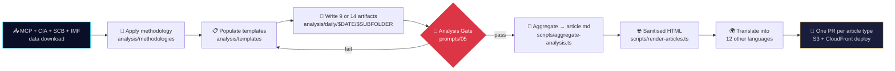
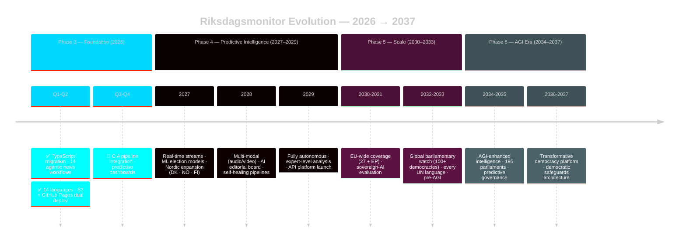

# 🗳️ Riksdagsmonitor

> **Swedish Political Intelligence Platform** — democratic transparency, evidence-based analysis and AI-generated political news, powered by official open data and a fully autonomous agentic newsroom.

<table>
  <tr>
    <td width="120" align="center">
      
      <div>
        <a href="https://riksdagsmonitor.com">
          
        </a>
      </div>
      <div>
        <a href="https://www.npmjs.com/package/riksdagsmonitor">
          
        </a>
      </div>
    </td>
    <td>
      <p><strong>🕵️ Political intelligence · 🔍 Democratic transparency · 🤖 AI-generated news · 📊 50+ years of evidence</strong></p>
      <p>Riksdagsmonitor monitors Sweden's Riksdag (Parliament), the Government (Regeringskansliet) and public agencies (Myndigheter) with structured intelligence techniques — ACH, SWOT, PESTLE, STRIDE, political-risk scoring and OSINT/INTOP tradecraft — applied to <strong>349 current MPs</strong>, <strong>2,494 historical politicians (1971–2024)</strong>, <strong>3.5M+ votes</strong> and <strong>109,000+ parliamentary documents</strong>.</p>
      <p>An autonomous AI newsroom — 14 agentic workflows, Claude Opus 4.8 (Claude Sonnet 4.6 for translation), zero human editors — turns this evidence into <strong>publication-ready intelligence articles in 14 languages, every day</strong>.</p>
      <div>
        <a href="https://scorecard.dev/viewer/?uri=github.com/Hack23/riksdagsmonitor">
          
        </a>
        <a href="https://github.com/Hack23/riksdagsmonitor/actions/workflows/quality-checks.yml">
          
        </a>
        <a href="https://www.bestpractices.dev/projects/12069">
          
        </a>
        <a href="https://github.com/Hack23/riksdagsmonitor/license">
          
        </a>
      </div>
      <div>
        <a href="https://riksdagsmonitor.com"><strong>🌐 Live Platform</strong></a> •
        <a href="https://riksdagsmonitor.com/political-intelligence.html"><strong>🕵️ Political Intelligence</strong></a> •
        <a href="https://riksdagsmonitor.com/news/index.html"><strong>📰 AI Newsroom</strong></a> •
        <a href="https://riksdagsmonitor.com/dashboard/index.html"><strong>📊 Intelligence Dashboard</strong></a> •
        <a href="https://riksdagsmonitor.com/sitemap.html"><strong>🗺️ Sitemap</strong></a>
      </div>
    </td>
  </tr>
</table>

[](https://scorecard.dev/viewer/?uri=github.com/Hack23/riksdagsmonitor)
[](https://github.com/Hack23/riksdagsmonitor/actions/workflows/quality-checks.yml)
[](https://github.com/Hack23/riksdagsmonitor/actions/workflows/dependency-review.yml)
[](https://github.com/Hack23/riksdagsmonitor/actions/workflows/codeql.yml)
[](https://github.com/Hack23/riksdagsmonitor/actions/workflows/javascript-testing.yml)
[](https://github.com/Hack23/riksdagsmonitor/actions/workflows/translation-validation.yml)
[](https://github.com/Hack23/riksdagsmonitor/actions/workflows/release.yml)
[](https://www.bestpractices.dev/projects/12069)
[](https://github.com/Hack23/riksdagsmonitor/blob/main/LICENSE)
[](https://github.com/Hack23/ISMS-PUBLIC)
[](https://github.com/Hack23/ISMS-PUBLIC/blob/main/Secure_Development_Policy.md)
[](https://github.com/Hack23/ISMS-PUBLIC/blob/main/Secure_Development_Policy.md)
[](https://github.com/Hack23/ISMS-PUBLIC/blob/main/Secure_Development_Policy.md)
[](https://deepwiki.com/Hack23/riksdagsmonitor)

---

## 🎯 Mission

> **Strengthen Swedish democracy through systematic transparency.**

Riksdagsmonitor exists to put **rigorous, evidence-based political intelligence** in the hands of every citizen, journalist, researcher and policymaker. We combine:

- 🕵️ **Structured intelligence tradecraft** — ACH, SWOT, PESTLE, STRIDE, political-risk scoring, OSINT/INTOP methodology, ICD-203 Key Judgments
- 🔍 **Democratic transparency** — every claim traceable to a primary source (`dok_id`, vote count, named MP, government document) or it does not get published
- 🤖 **AI-generated political news** — a fully autonomous newsroom turning open data into 14-language analysis articles, daily
- 📊 **50+ years of historical evidence** — 1971–2024 voting records, document corpus, and party-evolution analytics from the [Citizen Intelligence Agency (CIA)](https://github.com/Hack23/cia) platform
- ⚖️ **Neutrality & GDPR by design** — equal treatment of all 8 parliamentary parties, public-data only, privacy-by-design architecture, explicit democratic safeguards

The platform is **non-partisan, open-source (Apache-2.0), and operated under the [Hack23 ISMS](https://github.com/Hack23/ISMS-PUBLIC)** with full ISO 27001:2022 / NIST CSF 2.0 / CIS Controls v8.1 alignment. It does not collect user data, does not run ads, does not push narratives, and is architecturally designed so it cannot be weaponised for partisan influence.

---

## 🌐 Explore the Platform

Five flagship pages anchor the public site. Each is **multilingual (14 languages)**, **WCAG 2.1 AA accessible**, **SEO-optimised** with JSON-LD structured data and `hreflang` alternates, and **CSP-hardened** with Subresource Integrity (SRI) on every CDN asset.

<table>
<thead>
<tr><th width="80" align="center">Icon</th><th>Page</th><th>What it does</th></tr>
</thead>
<tbody>
<tr>
<td align="center">🌐</td>
<td><a href="https://riksdagsmonitor.com/"><strong>Live Platform — riksdagsmonitor.com</strong></a></td>
<td>
The public homepage and primary entry point. Front-loads the <strong>current coalition status</strong> (e.g. <em>Tidö Agreement</em> — 176/349 seats, fragility indicators, CIA risk alerts), then deep-dives into the full intelligence stack:
<ul>
<li>🗳️ <strong>Election-cycle intelligence</strong> — 40 years (1994–2034)</li>
<li>🏛️ <strong>Party performance &amp; effectiveness</strong> — 1990–2026, 8 parties</li>
<li>🤝 <strong>Committee networks &amp; productivity</strong> — 15 committees</li>
<li>📊 <strong>Coalition &amp; voting-pattern analysis</strong></li>
<li>🌡️ <strong>Seasonal activity with Z-score anomaly detection</strong> — 2002–2025</li>
<li>🔮 <strong>Pre-election monitoring</strong></li>
<li>🎖️ <strong>Ministry risk &amp; influence</strong></li>
<li>🚨 <strong>45-rule × 349-MP risk heat map</strong> (live)</li>
</ul>
Updated daily at 03:00 CET.
</td>
</tr>
<tr>
<td align="center">🕵️</td>
<td><a href="https://riksdagsmonitor.com/political-intelligence.html"><strong>Political Intelligence Index</strong></a></td>
<td>
The single canonical entry point for OSINT/INTOP researchers. Catalogues every <strong>methodology</strong> that governs analysis on the platform:
<ul>
<li>📐 AI-Driven Analysis Guide</li>
<li>🔍 OSINT Tradecraft Standards</li>
<li>⚠️ Political Risk Methodology</li>
<li>💼 Political SWOT Framework</li>
<li>🎯 Political Threat Framework</li>
<li>🏷️ Political Classification Guide</li>
<li>🗳️ Electoral Domain Methodology</li>
<li>🧬 Synthesis Methodology</li>
<li>📈 IMF &amp; 🌍 World Bank Indicator Mappings</li>
<li>📏 Reference-Quality Thresholds · ✍️ Political Style Guide</li>
</ul>
Plus the full daily artifact catalogue (Family A baseline · Family B · Family C synthesis · Family D extension). Each item links straight to the source-of-truth on GitHub. Available in 14 languages (append <code>_sv</code>, <code>_de</code>, <code>_ar</code>, …).
</td>
</tr>
<tr>
<td align="center">📰</td>
<td><a href="https://riksdagsmonitor.com/news/index.html"><strong>AI-Generated News &amp; Analysis</strong></a></td>
<td>
The world's first fully AI-driven political-intelligence newsroom for parliamentary monitoring. <strong>14 specialised agentic workflows</strong> (scheduled daily, also manually dispatchable, powered by Claude Opus 4.8 — Claude Sonnet 4.6 for the translation workflow — via GitHub Copilot Coding Agent) autonomously produce daily intelligence articles:
<ul>
<li>🌅 Committee reports · 🏛️ propositions · ✊ motions · ❓ interpellations</li>
<li>🔮 Week-ahead · 📅 month-ahead · 🔍 real-time monitor</li>
<li>🌆 Evening analysis · 📊 weekly review · 📈 monthly review</li>
</ul>
Source verification, multi-party balance and GDPR-compliant OSINT methodology baked in. Every article carries machine-readable provenance through JSON-LD <code>NewsArticle.isBasedOn</code>, links back to the analysis artifacts that produced it, and is published in 14 languages.
</td>
</tr>
<tr>
<td align="center">📊</td>
<td><a href="https://riksdagsmonitor.com/dashboard/index.html"><strong>CIA Intelligence Dashboard</strong></a></td>
<td>
Interactive Chart.js / D3.js intelligence dashboard powered by the <a href="https://github.com/Hack23/cia">Citizen Intelligence Agency (CIA)</a> data products:
<ul>
<li>📋 Overview metrics — MPs, parties, risk rules, coalition seats</li>
<li>🚨 Risk alerts — Critical / Major / Minor (last 90 days)</li>
<li>🏛️ Party performance analysis</li>
<li>🗳️ Swedish Election 2026 predictions — coalition scenarios &amp; key factors</li>
<li>👥 Top-10 most influential MPs — network analysis</li>
<li>🔥 Voting-patterns heat map</li>
<li>🤝 Committee network analysis</li>
<li>🎖️ Ministry performance</li>
<li>📊 Parliamentary demographics · 📄 document activity · 📉 risk-score evolution</li>
</ul>
Local-first data loading with 1-hour cache, keyboard navigable, CSP-compliant.
</td>
</tr>
<tr>
<td align="center">🗺️</td>
<td><a href="https://riksdagsmonitor.com/sitemap.html"><strong>Sitemap (Human + Machine)</strong></a></td>
<td>Human-readable navigation of every page on the platform plus the machine-readable <a href="https://riksdagsmonitor.com/sitemap.xml"><code>sitemap.xml</code></a> and <a href="https://riksdagsmonitor.com/rss.xml"><code>rss.xml</code></a> feeds. Daily refreshed; honours <code>robots.txt</code> and search-engine indexing best practices.</td>
</tr>
</tbody>
</table>

**🌍 14 supported languages:** English · Swedish · Danish · Norwegian · Finnish · German · French · Spanish · Dutch · Arabic (RTL) · Hebrew (RTL) · Japanese · Korean · Chinese.

---

## 🤖 AI-Generated Political Intelligence News

> *"While traditional newsrooms debate whether AI will replace journalists, Riksdagsmonitor already runs a fully autonomous political-intelligence newsroom — 14 agentic workflows, 14 languages, zero human editors, and a publication schedule that would bankrupt any legacy outlet trying to keep up."*

### What makes it different

Traditional AI-generated news is shallow — it rewrites press releases. Riksdagsmonitor's pipeline performs **deep political-intelligence analysis** before a single sentence of an article is written:

- 🔎 **Source verification** — every claim traced to official Riksdag/Regering data via the `riksdag-regering` MCP server (32+ tools)
- ⚖️ **Multi-party balance** — algorithmic fairness across all 8 parliamentary parties, no editorial bias possible
- 📊 **Quantitative rigor** — voting cohesion metrics, attendance scoring, legislative productivity indices, ICD-203 Key Judgments, 45-rule transparency scoring
- 🌐 **14-language reach** — culturally adapted political analysis with RTL support (Arabic / Hebrew), not machine translation
- 🛡️ **GDPR-compliant OSINT** — only public parliamentary data; political opinions are processed under GDPR Art. 9(2)(e) (manifestly made public) / 9(2)(g) (substantial public interest)
- 🔭 **Forward-look coverage** — week / month / quarter / year / election-cycle horizons with registry-driven horizon stratification (see [`analysis/article-types.json`](analysis/article-types.json))
- 🚦 **Hard analysis gate** — every news workflow MUST produce 9 (single-type) or 14 (Tier-C) analysis artifacts on disk before article generation; the gate at [`.github/prompts/05-analysis-gate.md`](.github/prompts/05-analysis-gate.md) is non-negotiable
- 🧪 **Quality gates** — HTMLHint validation, link checking, accessibility (WCAG 2.1 AA) and translation parity in CI before publication

### End-to-end pipeline



A new `.md` artifact written anywhere under `analysis/daily/$DATE/$SUB/` is enough to publish an English + Swedish HTML article on the next CI build — there is no manual scaffolding, no template fill-in, and no per-type generator class. The dedicated `news-translate` workflow then propagates to the remaining 12 languages out-of-band. See **[`Article-Generation.md`](Article-Generation.md)** for the full agentic-workflow contract.

### Autonomous publication schedule

| Time (UTC) | Workflow | Coverage | Frequency |
|:-----------|:---------|:---------|:----------|
| 🌅 04:00 | **Committee Reports** | Utskottsbetänkanden analysis, voting breakdowns | Mon–Fri |
| 🌅 05:00 | **Propositions** | Government bills, legislative impact assessment | Mon–Fri |
| ☀️ 06:00 | **Motions** | Opposition proposals, party-strategy decoding | Mon–Fri |
| ❓ 07:00 | **Interpellations** | Ministerial accountability, evasion detection | Mon–Fri |
| 🔮 07:00 | **Week Ahead** | Parliamentary calendar preview, agenda intelligence | Friday |
| 📅 08:00 | **Month Ahead** | Strategic outlook, coalition forecasting | 1st of month |
| 🔍 10:00 & 14:00 (Mon–Fri); 12:00 (Sat/Sun) | **Real-Time Monitor** | Breaking political developments, flash analysis | Mon–Fri (×2) + weekends |
| 🌍 11:00 & 17:00 (Mon–Fri); 14:00 (Sat/Sun) | **Translate** | 12 additional languages from EN/SV cores | Daily |
| 🌆 18:00 (16:00 Sat) | **Evening Analysis** | Deep-dive intelligence synthesis | Mon–Sat |
| 📊 09:00 | **Weekly Review** | Week-in-review scorecard, party performance | Saturday |
| 📈 10:00 | **Monthly Review** | Comprehensive monthly intelligence assessment | 28th of month |

> _Authoritative schedules defined in `.github/workflows/news-*.lock.yml` — see [`.github/workflows/README.md`](.github/workflows/README.md) for the complete inventory._

**Result:** dozens of articles per week across 14 languages — **hundreds of localised intelligence products each month**, generated autonomously with zero editorial intervention, every one of them auditable down to its source `dok_id`.

---

## 🕵️ Political Intelligence Methodology

Every analysis on the platform is governed by an explicit, version-controlled methodology. The full library is browseable at <https://riksdagsmonitor.com/political-intelligence.html>; the canonical sources live in [`analysis/`](analysis/).

| Layer | Document | What you'll find |
|:------|:---------|:-----------------|
| **🧭 Framework** | [`analysis/README.md`](analysis/README.md) | Artifact taxonomy, 9-artifact / 14-artifact contract, on-disk daily layout |
| **📐 Methodology library** | [`analysis/methodologies/README.md`](analysis/methodologies/README.md) | <strong>11 methodology documents</strong> — AI-Driven Analysis Guide · OSINT Tradecraft Standards · Political Risk Methodology · Political SWOT Framework · Political Threat Framework · Political Classification Guide · Electoral Domain Methodology · Synthesis Methodology · Per-Document & Per-Artifact Methodologies · Strategic Extensions (scenario / wildcard / long-horizon) · Structural Metadata · Political Style Guide |
| **📋 Template library** | [`analysis/templates/README.md`](analysis/templates/README.md) | <strong>23 templates</strong> — 8 core single-type (T1–T8) plus 15 extended / Tier-C (executive-brief, scenario-analysis, coalition-mathematics, election-2026, historical-parallels, comparative-international, devil's-advocate, intel-assessment / ICD-203 Key Judgments, …) |
| **🚦 News-generation contract** | [`.github/prompts/README.md`](.github/prompts/README.md) | 8 bounded-context prompt modules + Tier-C extension; the single blocking analysis gate |
| **⚙️ Workflow orchestration** | [`.github/workflows/README.md`](.github/workflows/README.md) + [`WORKFLOWS.md`](WORKFLOWS.md) | How each `news-*.md` source compiles to a hardened `.lock.yml` with SHA-pinned actions, egress firewall (Squid + iptables) and five-layer safe-outputs |
| **🔍 IMF integration** | [`analysis/imf/README.md`](analysis/imf/README.md) + [`.github/aw/ECONOMIC_DATA_CONTRACT.md`](.github/aw/ECONOMIC_DATA_CONTRACT.md) | Macro/fiscal/monetary/external context with T+5 projections; canonical pattern for every economic claim |
| **🏛️ Statskontoret integration** | [`analysis/statskontoret/README.md`](analysis/statskontoret/README.md) | Swedish agency structure and central-government budget execution (årsutfall / månadsutfall / tidsserier) |
| **🤖 Specialist personas** | [`.github/agents/README.md`](.github/agents/README.md) | 14 persona agents incl. `intelligence-operative`, `news-journalist`, `content-generator` + 9 workflow-specialist agents + shared `developer.instructions.md` |
| **🧠 Skills library** | [`.github/skills/README.md`](.github/skills/README.md) | <strong>91 skills</strong> across 12 functional categories — 11 political-intelligence, 5 journalism, 14 ISMS/security, 13 GitHub Agentic Workflows, … |

### Evidence standard

Every claim must tie to: **a `dok_id` citation, a named actor, a vote count, or a primary-source URL**. Generic statements without evidence are rejected by the analysis gate. AI is an accelerator — never an excuse for shallow output.

### AI-FIRST quality principle

Minimum **2 complete iterations** for every analysis. Pass 1 produces the artifact; Pass 2 reads everything back and improves every section (stronger evidence, deeper analytic rigor, broader stakeholder coverage, quantified risk). Workflows that complete in under 75 % of their allocated time are treated as failed. See [`AGENTS.md`](AGENTS.md) §AI-FIRST.

---

## 📊 Interactive Intelligence Dashboards

Five flagship Chart.js / D3.js dashboards on <https://riksdagsmonitor.com/> (and the consolidated [CIA Intelligence Dashboard](https://riksdagsmonitor.com/dashboard/index.html)):

| # | Dashboard | Coverage | Visualisations | Data |
|:-:|:----------|:---------|:---------------|:-----|
| 1 | 🌡️ **Seasonal Activity Patterns** | 2002–2025 quarterly (23+ years) | Heat maps, time series, Z-score anomaly detection (\|Z\| ≥ 2.0) | `cia-data/seasonal/` |
| 2 | 👤 **Politician Dashboard** | 349 current MPs | Top-10 rankings, 45-rule risk profiles, influence metrics | `cia-data/politician/` |
| 3 | 🗳️ **Pre-Election Monitoring** | Q4 2023 → 2025 | Historical comparisons, election-year vs non-election Q4 patterns, early-warning indicator matrix | `cia-data/pre-election/` |
| 4 | 🏛️ **Party Performance & Effectiveness** | 1990–2026 (37 years, 8 parties) | Effectiveness trends, comparative bars, coalition-alignment, momentum with P50/P90 percentiles | `cia-data/party/` |
| 5 | 🚨 **Anomaly Detection & Early Warning** | 2002–2026 (41 quarters) | Timeline · Z-score distribution · type breakdown · severity heat map · recent-anomaly feed | `cia-data/seasonal/` |

**Dashboard properties** — local-first data loading with 1-hour cache; WCAG 2.1 AA accessible (keyboard, screen reader, 4.5:1 contrast); 14-language; responsive 320 px → 1440 px+; CSP-compliant with SRI hashes (`sha384`) on all CDN resources.

---

## 🗳️ Transparency Statistics

Live numbers (updated daily at 03:00 CET via [`update-cia-csv-data.yml`](.github/workflows/update-cia-csv-data.yml)):

| Metric | Value | Note |
|:-------|:------|:-----|
| 👥 **Current MPs** | **349** | All active Members of Parliament |
| 📜 **Historical politicians** | **2,494** | 1971–2024 (50+ years) |
| 🗳️ **Votes analysed** | **3.5+ million** | Comprehensive voting-record corpus |
| 📄 **Documents processed** | **109,000+** | Parliamentary documents (motions, propositions, interpellations, …) |
| 🏛️ **Committee documents** | **8,740** | Committee work tracked |
| ⚠️ **Rule violations identified** | **2,308** | Across 45 transparency rules |
| 🇸🇪 **Political parties** | **8** | All Riksdag-represented parties |
| ⏱️ **CIA subsystems** | **15** | anomaly · coalition · committee · distribution · election · election-cycle · ministry · parties · party · percentile · politician · pre-election · risk · seasonal · voting |
| 📰 **News articles published** | **2,669+ files** under `news/` | 14 languages |

**Data source:** [extraction_summary_report.csv](https://github.com/Hack23/cia/blob/master/service.data.impl/sample-data/extraction_summary_report.csv) · cached in `cia-data/production-stats.json` (24 h freshness).

---

## 🔗 Authoritative Data Sources

Riksdagsmonitor uses a **provider-tiered** data architecture, with each provider chosen for its area of strength.

| Tier | Provider | Scope | Access |
|:-----|:---------|:------|:-------|
| 🏛️ **Parliamentary primary** | **[Riksdagen Open Data](http://data.riksdagen.se/)** | Documents, motions, votes, MPs, speeches, committees | `riksdag-regering` MCP server (32+ tools) |
| 🏢 **Government primary** | **[Regeringskansliet](https://www.regeringen.se/)** | Propositions, SOU, Ds, directives, press releases | `riksdag-regering` MCP server |
| 📈 **Primary economic** | **[IMF](https://data.imf.org/)** (Datamapper REST + SDMX 3.0) | GDP, growth, unemployment, inflation, fiscal balance, debt, current account, bilateral trade, commodity prices, exchange rates, government spending by COFOG function — **with T+5 projections** | Pure-TypeScript client `scripts/imf-client.ts` (intentionally non-MCP) |
| 🇸🇪 **Swedish ground truth** | **[SCB](https://www.scb.se/)** (PxWeb v2) | Swedish monthly labour (AKU), monthly inflation (KPI), regional/municipal, budget execution | `scb` MCP server (`@jarib/pxweb-mcp@2.0.0`, 1,200+ tables) |
| 🏛️ **Statskontoret** | [Statskontoret](https://www.statskontoret.se/) | Authority count, dept grouping, leadership form, FTE / headcount, central-government budget outturns | `scripts/statskontoret-client.ts` |
| 🌍 **Non-economic residue** | **[World Bank](http://data.worldbank.org/)** | Governance (WGI, `source=75`), environment, social/education residue, defence historicals | `world-bank` MCP server (`worldbank-mcp@1.0.1`) |
| 🗳️ **Election authority** | [Valmyndigheten](http://www.val.se/) | Election results, voter turnout, electoral statistics | Public datasets |
| 💰 **ESV** | [Ekonomistyrningsverket](https://www.esv.se/psidata/) | Government budget and spending data | Public datasets |
| 🕵️ **Citizen Intelligence Agency** | [Hack23/cia](https://github.com/Hack23/cia) | 15 CIA subsystems consumed nightly via [`update-cia-csv-data.yml`](.github/workflows/update-cia-csv-data.yml) | JSON / CSV exports |

**Why this split** — IMF uses uniform SNA 2008 / GFSM 2014 / BPM6 methodology across countries (essential for cross-country comparison), publishes T+5 projections (essential for look-ahead workflows), and has fresher data than World Bank's economic indicators. World Bank remains canonical for the classes IMF does not publish (WGI governance, environment). SCB is the Swedish-specific ground-truth layer. **Banned phrases** (e.g. *"the World Bank reports Swedish GDP growth of …"*) and **vintage discipline** (data > 6 months old → annotation required) are enforced by CI per [`.github/aw/ECONOMIC_DATA_CONTRACT.md`](.github/aw/ECONOMIC_DATA_CONTRACT.md) v2.1.

---

## 🏗️ Technical Architecture

> Full system architecture (C4 Context / Container / Component / Dynamic views) lives in **[`ARCHITECTURE.md`](ARCHITECTURE.md)** (v2.2).

### Stack

- **Frontend** — Static HTML5 / CSS3 with TypeScript-built Chart.js / D3.js dashboards (no SPA framework, mobile-first, cyberpunk theme)
- **Language** — TypeScript 6.0.2 compatibility package (`typescript`) plus TypeScript 7.0.1-rc (`typescript-7`) running side-by-side while the migration is underway
- **Build** — Vite 8.1.3 (ES modules, code splitting, SRI via `vite-plugin-sri-gen`)
- **Visualisation** — Chart.js 4.5.1 + D3.js 7.9.0, hosted locally on CloudFront
- **Testing** — Vitest 4.1.10 (2,890 unit tests, 100 % pass rate, 70 % line coverage) + Cypress 15.18.1 (E2E)
- **Hosting** — AWS CloudFront + S3 dual-region (us-east-1 primary, eu-west-1 replica) via OIDC; GitHub Pages as DR fallback
- **CI/CD** — 50 GitHub Actions workflow files (22 standard `.yml` + 14 agentic `.md` sources + 14 compiled `.lock.yml`); SHA-pinned, `step-security/harden-runner` everywhere
- **Data Platform** — Citizen Intelligence Agency (CIA) Java/Spring Boot backend + 15 CIA subsystems
- **Runtime** — Node.js 26.x

### Architecture documentation portfolio

| Current State | Future State |
|:--------------|:-------------|
| 🏗️ [Architecture](ARCHITECTURE.md) | 🚀 [Future Architecture](FUTURE_ARCHITECTURE.md) |
| 📊 [Data Model](DATA_MODEL.md) | 📊 [Future Data Model](FUTURE_DATA_MODEL.md) |
| 🔄 [Flowcharts](FLOWCHART.md) | 🔄 [Future Flowcharts](FUTURE_FLOWCHART.md) |
| 🔄 [State Diagrams](STATEDIAGRAM.md) | 🔄 [Future State Diagrams](FUTURE_STATEDIAGRAM.md) |
| 🗺️ [Mindmap](MINDMAP.md) | 🗺️ [Future Mindmap](FUTURE_MINDMAP.md) |
| 💼 [SWOT](SWOT.md) | 💼 [Future SWOT](FUTURE_SWOT.md) |

---

## 🔐 Security, Privacy & ISMS Compliance

> Full controls in **[`SECURITY_ARCHITECTURE.md`](SECURITY_ARCHITECTURE.md)** · threat model in **[`THREAT_MODEL.md`](THREAT_MODEL.md)** · CRA conformity in **[`CRA-ASSESSMENT.md`](CRA-ASSESSMENT.md)**.

### Classification (per [Hack23 Classification Framework](https://github.com/Hack23/ISMS-PUBLIC/blob/main/CLASSIFICATION.md))

| Dimension | Level | Note |
|:----------|:------|:-----|
| 🔒 **Confidentiality** | 🟢 Public | All data intentionally disclosed (Swedish open data + website content) |
| ✅ **Integrity** | 🟠 High | Automated validation, GPG-signed commits, SLSA build provenance |
| 🟢 **Availability** | 🟠 High | 99.998 % design target (CloudFront 99.9 % SLA + multi-region S3 + GitHub Pages DR) |
| 🏷️ **Privacy** | 🟠 Personal (public officials only) | GDPR Art. 6(1)(e/f); Art. 9(2)(e/g) for political opinions; **no end-user PII**, no accounts, no ads, no tracking |
| ⏱️ **RTO / RPO** | 1–4 h / 4–24 h | Automated multi-region failover, daily data refresh |
| 💰 **Business impact** | 🟢 Low (financial) · 🟡 Moderate (reputational) | Open-source project, no revenue dependency |

### Compliance frameworks

- **ISO 27001:2022** — 7 Annex A controls implemented · **NIST CSF 2.0** — 6 functions aligned · **CIS Controls v8.1** — 6 controls implemented
- **GDPR** — public-interest / legitimate-interest grounds for public-official data; political opinions under Art. 9(2)(e)/(g)
- **EU CRA** — self-assessment in [`CRA-ASSESSMENT.md`](CRA-ASSESSMENT.md)
- **OpenSSF Best Practices** — [Project #12069](https://www.bestpractices.dev/projects/12069)

### Defence-in-depth highlights

- 🔒 **HTTPS-only** — TLS 1.3, HSTS, CSP, X-Frame-Options, X-Content-Type-Options
- 🧱 **Five-layer agentic-workflow security** — read-only agent tokens, zero secrets in agent context, containerised + Squid/iptables egress firewall, safe-outputs validation, AI threat-detection scan
- 🔐 **SHA-pinned actions** + `step-security/harden-runner` + Dependabot + CodeQL + Secret Scanning + dependency-review + OIDC-only AWS deploy
- 📜 **Aligned ISMS policies** — [Information Security Policy](https://github.com/Hack23/ISMS-PUBLIC/blob/main/Information_Security_Policy.md) · [Secure Development Policy](https://github.com/Hack23/ISMS-PUBLIC/blob/main/Secure_Development_Policy.md) · [Threat Modeling](https://github.com/Hack23/ISMS-PUBLIC/blob/main/Threat_Modeling.md) · [AI Policy](https://github.com/Hack23/ISMS-PUBLIC/blob/main/AI_Policy.md) · [Vulnerability Management](https://github.com/Hack23/ISMS-PUBLIC/blob/main/Vulnerability_Management.md) · [Change Management](https://github.com/Hack23/ISMS-PUBLIC/blob/main/Change_Management.md) · [Incident Response Plan](https://github.com/Hack23/ISMS-PUBLIC/blob/main/Incident_Response_Plan.md) · [Open Source Policy](https://github.com/Hack23/ISMS-PUBLIC/blob/main/Open_Source_Policy.md)

| Metric | Status |
|:-------|:-------|
| **Risk level** | 🟢 LOW (5.52 / 10.0 — 99.7 % risk reduction) |
| **HTML validation** | ✅ 0 errors (HTMLHint) |
| **Dependencies** | ✅ Dependabot clean |
| **Secrets** | ✅ Secret Scanning enabled |
| **Code scanning** | ✅ CodeQL active |

---

## 📦 npm Package

The platform's reusable shared utilities are published as **[`riksdagsmonitor`](https://www.npmjs.com/package/riksdagsmonitor)** with SLSA build provenance.

```bash
npm install riksdagsmonitor
```

**Includes** — Theme System (cyberpunk, WCAG AA) · Chart Factory (Chart.js with responsive breakpoints + keyboard nav) · Resilient Data Loader (retry, cache, CSV/JSON) · DOM utilities · Full TypeScript types · 12 dashboard modules · CIA intelligence modules.

```typescript
import { getActiveThemeColors, BREAKPOINTS, getPartyColor } from 'riksdagsmonitor';
import { loadJSON, loadCSV, createDataSource } from 'riksdagsmonitor';
import { showLoadingState, formatNumber, debounce } from 'riksdagsmonitor';
import { createChart, initDashboardSection } from 'riksdagsmonitor/shared/chart-factory';
import { CIADataLoader } from 'riksdagsmonitor/cia/data-loader';
import { CIADashboardRenderer } from 'riksdagsmonitor/cia/visualizations';
```

**Peer dependencies** — `chart.js` `d3` `papaparse` (required for dashboards); `chartjs-plugin-annotation` (optional, loaded conditionally).

---

## 🚀 Development

### Prerequisites
Node.js ≥ 26 · npm ≥ 10 · Git with GPG signing · GitHub MFA + SSH keys.

### Quick start

```bash
git clone git@github.com:Hack23/riksdagsmonitor.git
cd riksdagsmonitor
npm install
npm run dev          # Vite dev server with hot reload → http://localhost:8080

# Tests
npm test                 # Vitest unit (2,890 tests)
npm run test:coverage    # with coverage
npm run cypress:open     # E2E interactive
npm run e2e              # full E2E (build + preview + Cypress)

# Quality
npm run htmlhint         # HTML5 validation
npm run linkcheck        # link integrity (linkinator)

# Production
npm run build            # Vite production build → dist/
npm run preview          # http://localhost:4173
```

### CI/CD

- HTMLHint validation · Linkinator · Vitest (2,890 tests) · Cypress · Vite build · Dependency review · CodeQL · Secret scanning · Translation validation
- Releases — workflow_dispatch or `v*.*.*` tag → SBOM (SPDX) + SHA-256 + SLSA Build Provenance attestations + dual deployment (S3/CloudFront primary, GitHub Pages DR)
- `gh attestation verify riksdagsmonitor-vX.Y.Z.zip -R Hack23/riksdagsmonitor`

See [`WORKFLOWS.md`](WORKFLOWS.md) and [`RELEASE_PROCESS.md`](RELEASE_PROCESS.md) for the canonical reference.

---

## 🤖 GitHub Copilot — Agents, Skills & Agentic Workflows

Riksdagsmonitor uses **GitHub Copilot personas, skills and agentic workflows** as first-class automation. Directory READMEs are the single source of truth; [`AGENTS.md`](AGENTS.md) and [`SKILLS.md`](SKILLS.md) are the long-form catalogs.

| Surface | Catalog | Count |
|:--------|:--------|:------|
| 🤖 **Custom agents** | [`.github/agents/README.md`](.github/agents/README.md) | **24** files (14 personas + 9 workflow-specialists + 1 shared developer-instructions) |
| 🧠 **Skills** | [`.github/skills/README.md`](.github/skills/README.md) | **91** skills across 12 functional categories |
| 📜 **Prompt modules** | [`.github/prompts/README.md`](.github/prompts/README.md) | 8 bounded-context modules + Tier-C extension |
| ⚙️ **Workflows** | [`.github/workflows/README.md`](.github/workflows/README.md) | **50** files (22 standard + 14 agentic sources + 14 compiled) |
| 🔌 **MCP servers** | [`.github/copilot-mcp.json`](.github/copilot-mcp.json) | **8** — `riksdag-regering`, `scb`, `world-bank`, `github` (insiders), `filesystem`, `memory`, `sequential-thinking`, `playwright` |

**14 persona agents** (assignable via `assign_copilot_to_issue`):
`security-architect` · `documentation-architect` · `quality-engineer` · `frontend-specialist` · `isms-compliance-manager` · `deployment-specialist` · `devops-engineer` · **`intelligence-operative`** · **`news-journalist`** · **`content-generator`** · `data-pipeline-specialist` · `data-visualization-specialist` · `task-agent` · `ui-enhancement-specialist`.

**9 workflow-specialist agents** (`.agent.md`, invoked from workflows):
`agentic-workflows` · `ci-cleaner` · `contribution-checker` · `create-safe-output-type` · `custom-engine-implementation` · `grumpy-reviewer` · `interactive-agent-designer` · `technical-doc-writer` · `w3c-specification-writer`.

---

## 📖 Documentation Index

### Project documentation
- [`Article-Generation.md`](Article-Generation.md) — **Canonical agentic-newsroom contract** (data → analysis → article → HTML → S3)
- [`AGENTS.md`](AGENTS.md) · [`SKILLS.md`](SKILLS.md) — Copilot persona & skill catalogs
- [`WORKFLOWS.md`](WORKFLOWS.md) — End-to-end CI/CD reference (v7.2)
- [`RELEASE_PROCESS.md`](RELEASE_PROCESS.md) — Release with attestations & docs-as-code
- [`TRANSLATION_GUIDE.md`](TRANSLATION_GUIDE.md) — 14-language standards & glossary
- [`SECURITY.md`](SECURITY.md) · [`CONTRIBUTING.md`](CONTRIBUTING.md) · [`CODE_OF_CONDUCT.md`](CODE_OF_CONDUCT.md) · [`LICENSE`](LICENSE)

### Future planning
- [`FUTURE_WORKFLOWS.md`](FUTURE_WORKFLOWS.md) · [`FUTURE_MINDMAP.md`](FUTURE_MINDMAP.md) · [`FUTURE_ARCHITECTURE.md`](FUTURE_ARCHITECTURE.md) · [`FUTURE_SECURITY_ARCHITECTURE.md`](FUTURE_SECURITY_ARCHITECTURE.md) · [`FUTURE_SWOT.md`](FUTURE_SWOT.md)

### External
- 📚 [API Documentation (JSDoc)](https://riksdagsmonitor.com/docs/api/) · [Test Coverage](https://riksdagsmonitor.com/docs/coverage/) · [Cypress E2E Reports](https://riksdagsmonitor.com/docs/cypress/)
- 🕵️ [CIA Platform](https://hack23.github.io/cia/) · [CIA JSON Export Specs](https://github.com/Hack23/cia/tree/master/json-export-specs/visualizations)
- 🛡️ [Hack23 ISMS-PUBLIC](https://github.com/Hack23/ISMS-PUBLIC) · 📰 [Hack23 Blog](https://hack23.com/blog.html)

---

## 🔮 Future Roadmap (2026 → 2037)

> *From agentic news generation to AGI-powered democratic intelligence — an 11-year evolution.*
>
> Detailed planning: [`FUTURE_WORKFLOWS.md`](FUTURE_WORKFLOWS.md) · [`FUTURE_MINDMAP.md`](FUTURE_MINDMAP.md) · [`FUTURE_ARCHITECTURE.md`](FUTURE_ARCHITECTURE.md)



| Year | Automation assets | AI model | Key capability |
|:----:|:----------------:|:---------|:---------------|
| **2026** | 44 → 50 | Opus 4.8–4.9 | 🤖 Agentic news generation (current) |
| **2027** | 50–55 | Opus 5.x | 🔮 Predictive analytics & Nordic expansion |
| **2028** | 55–65 | Opus 6.x | 🎙️ Multi-modal content |
| **2029** | 65–75 | Opus 7.x | 🚀 Fully autonomous pipeline |
| **2030–2033** | 75–100 | Opus 8–10.x / pre-AGI | 🌍 EU → Global coverage |
| **2034–2037** | 100–120+ | AGI / post-AGI | ⚡ Transformative democracy platform |

> *Version numbers are illustrative — actual products and paradigm shifts (quantum AI, neuromorphic computing) will vary. Architecture is designed for graceful adaptation while preserving democratic safeguards: human oversight maintained regardless of AI capability, anti-weaponisation by design, constitutional alignment encoded in platform architecture.*

---

## 🤝 Contributing

Contributions welcome under Hack23's secure-development standards.

1. Fork the repository and create a descriptive feature branch
2. **GPG-sign** every commit · enable **MFA** on your GitHub account
3. Run quality checks locally (`npm run htmlhint && npm test && npm run build`)
4. Submit a pull request with comprehensive description; address review feedback
5. Never introduce security vulnerabilities; follow [`CONTRIBUTING.md`](CONTRIBUTING.md) and [`CODE_OF_CONDUCT.md`](CODE_OF_CONDUCT.md)

---

## 🏢 About Hack23

**Hack23 AB** (Org.nr 559534-7807) — Swedish cybersecurity and open-source intelligence consultancy.

- 🌐 [www.hack23.com](https://www.hack23.com) · 📰 [Blog](https://hack23.com/blog.html)
- 💼 [LinkedIn — Hack23](https://www.linkedin.com/company/hack23/)
- 👨‍💻 Founder: [James Pether Sörling, CISSP, CISM](https://www.linkedin.com/in/jamessorling/)
- 🛡️ [Public ISMS](https://github.com/Hack23/ISMS-PUBLIC) · 🕵️ [CIA platform](https://github.com/Hack23/cia)

---

## 📜 License

Copyright © 2008–2026 **Hack23 AB** (Org.nr 559534-7807). Licensed under the **Apache License 2.0** — see [`LICENSE`](LICENSE).

---

<p align="center"><em>🗳️ Empower citizens · 🔍 Strengthen democratic accountability · 🕵️ Illuminate the political process</em></p>
