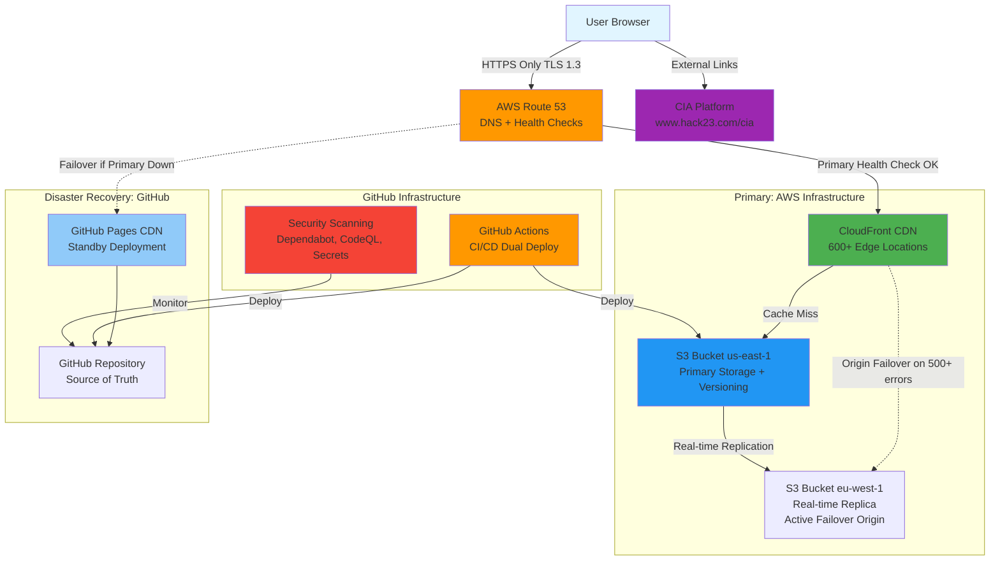

# 🛡️ Riksdagsmonitor - Security Architecture

**Document Version:** 1.2  
**Last Updated:** 2026-02-08  
**Classification:** Public  
**Owner:** Hack23 AB (Org.nr 5595347807)

## 🎯 Executive Summary

Riksdags Monitor is a static website providing Swedish Parliament intelligence and election monitoring capabilities. This document outlines the security architecture aligned with Hack23 AB's Information Security Management System (ISMS) and compliance frameworks (ISO 27001, NIST CSF 2.0, CIS Controls v8.1).

**Security Posture:** Defense-in-depth static website with dual-deployment architecture (AWS CloudFront/S3 primary, GitHub Pages disaster recovery), HTTPS-only access, and comprehensive CI/CD security controls.

**Deployment:** Multi-region AWS infrastructure (us-east-1 primary with real-time replication to eu-west-1 secondary) with automatic CloudFront origin failover on 500+ errors, plus Route 53 health-check failover to GitHub Pages for 99.997% availability.

## 1. 🏗️ System Overview

### 1.1 🎯 Purpose and Scope

**Purpose:**
- Monitor Swedish Riksdag political activity
- Provide real-time intelligence on 349 MPs
- Track coalition stability and election predictions
- Deliver CIA platform data visualizations to public

**Scope:**
- Static HTML/CSS website
- Multi-language support (14 languages)
- Integration with CIA platform for data visualization
- **AWS CloudFront + S3 hosting infrastructure (Primary)**
- **GitHub Pages hosting infrastructure (Disaster Recovery)**
- **AWS Route 53 DNS with health checks and automatic failover**

### 1.2 Architecture Diagram



## 2. 🔐 Security Architecture Components

### 2.1 Authentication & Access Control

**Public Access Model:**
- **No Authentication Required:** Static public website accessible to all
- **Content Management:** GitHub repository access controlled via GitHub authentication
  - MFA required for all contributors
  - SSH keys with passphrase protection
  - GPG signing required for commits
  - Branch protection rules enforced

**AWS Infrastructure Access:**
- **Production Deployment:** GitHub Actions OIDC role (no long-lived credentials)
  - Role: `arn:aws:iam::172017021075:role/GithubWorkFlowRole`
  - Permissions: S3 write, CloudFront invalidation, CloudFormation read
  - Session-based authentication only (no access keys)
- **Emergency Access:** AWS IAM administrator accounts (MFA required)
- **Audit:** AWS CloudTrail logging enabled for all API calls

**Control Mapping:**
- ISO 27001: A.9.2 User Access Management, A.9.3 User Responsibilities
- NIST CSF 2.0: PR.AC-1 (Identities and credentials managed), PR.AC-3 (Remote access managed)
- CIS Controls v8.1: 5.1 (Establish and Maintain an Inventory of Accounts), 6.1 (Establish Access Granting Process)

### 2.2 Authorization Model

**GitHub Repository Permissions:**
- **Admin:** Repository owners (Hack23 organization owners)
- **Write:** Approved contributors with MFA
- **Read:** Public access (website viewing)

**AWS IAM Permissions:**
- **GithubWorkFlowRole (OIDC):** Least privilege for S3/CloudFront deployment
  - `s3:PutObject`, `s3:GetObject`, `s3:ListBucket` on specific bucket
  - `cloudfront:CreateInvalidation`, `cloudfront:GetDistribution`
  - `cloudformation:DescribeStacks` (read-only for CloudFront ID discovery)
  - No IAM modification permissions
  - Session duration: 1 hour maximum
- **Administrator Accounts:** Full AWS access (break-glass only, MFA required)

**CI/CD Pipeline Permissions:**
- Least privilege GitHub Actions permissions
- Scoped GITHUB_TOKEN for workflow operations
- Secrets management via GitHub Secrets
- AWS credentials via OIDC federation (no static keys)

**Control Mapping:**
- ISO 27001: A.9.4 System and Application Access Control, A.9.1 Access Control Policy
- NIST CSF 2.0: PR.AC-4 (Access permissions managed), PR.MA-1 (Maintenance performed using approved tools)
- CIS Controls v8.1: 6.8 (Define and Maintain Role-Based Access Control), 5.4 (Restrict Administrator Privileges)

### 2.3 Data Security

**Data Classification:**
- **Public Information:** All website content (Swedish Riksdag open data)
- **Internal:** GitHub Actions secrets, deployment credentials
- **No Sensitive Data:** No user data, no PII, no financial information

**Data Protection:**
- **In Transit:** 
  - TLS 1.3 encryption (CloudFront + GitHub Pages default)
  - HTTPS-only access enforced (no HTTP fallback)
  - HSTS headers configured (max-age=31536000)
  - Perfect Forward Secrecy (PFS) enabled
- **At Rest:**
  - AWS S3 encryption at rest (AWS-managed keys)
  - S3 bucket versioning enabled (recovery from corruption)
  - Real-time S3 replication us-east-1 → eu-west-1
  - GitHub repository encryption at rest
  - Immutable Git history for audit trail
- **Backup & Recovery:**
  - S3 versioning provides 30-day recovery window
  - Multi-region S3 replication (us-east-1 → eu-west-1) for regional resilience
  - Git repository provides infinite history
  - Dual deployment ensures zero data loss (RPO=0)
  - CloudFront automatic origin failover on 500+ errors (<30 seconds)

**Control Mapping:**
- ISO 27001: A.10.1 Cryptographic Controls, A.12.3 Information Backup
- NIST CSF 2.0: PR.DS-2 (Data-in-transit protected), PR.DS-1 (Data-at-rest protected), PR.IP-4 (Backups managed)
- CIS Controls v8.1: 3.10 (Encrypt Sensitive Data in Transit), 11.1 (Data Recovery Capability)

### 2.4 Network Security

**AWS CloudFront Security:**
- **DDoS Protection:** AWS Shield Standard (automatic, no cost)
  - Protection against common network and transport layer attacks
  - Automatic detection and mitigation
  - Integrated with CloudFront infrastructure
- **CDN:** 600+ Points of Presence (PoPs) globally
  - Edge caching reduces origin load
  - Geographic distribution mitigates regional attacks
- **Origin Failover:** Automatic failover to eu-west-1 on 500+ HTTP errors
  - <30 second failover time
  - Transparent to users
  - Protects against origin region failures
- **Origin Protection:** S3 buckets only accessible via CloudFront
  - CloudFront Origin Access Identity (OAI)
  - Public S3 access disabled

**DNS Security:**
- **Route 53:** AWS managed DNS service
  - 100% availability SLA
  - DDoS protection via AWS Shield
  - Health checks for automatic failover (30-second interval)
  - DNSSEC support available (not yet enabled)
- **Failover:** Automatic to GitHub Pages if CloudFront unhealthy
  - Detection: 3 failed health checks = 90 seconds
  - DNS TTL: 60 seconds for fast propagation
  - Total failover time: 2-3 minutes

**GitHub Pages Infrastructure:**
- **DDoS Protection:** GitHub infrastructure-level protection
- **CDN:** GitHub Pages CDN for global distribution (disaster recovery standby)
- **Firewall:** GitHub-managed infrastructure firewall

**Security Headers:**
```
Content-Security-Policy: default-src 'self'; script-src 'self' 'unsafe-inline'; style-src 'self' 'unsafe-inline' fonts.googleapis.com; font-src 'self' fonts.gstatic.com
X-Content-Type-Options: nosniff
X-Frame-Options: DENY
X-XSS-Protection: 1; mode=block
Strict-Transport-Security: max-age=31536000; includeSubDomains
Referrer-Policy: strict-origin-when-cross-origin
```

**Control Mapping:**
- ISO 27001: A.13.1 Network Security Management, A.17.2 Redundancies
- NIST CSF 2.0: PR.AC-5 (Network integrity protected), PR.PT-5 (Protections against data leaks enforced), RC.RP-1 (Recovery plan executed)
- CIS Controls v8.1: 13.1 (Centralize Security Event Alerting), 13.6 (Deploy Network-Based IDS), 11.4 (Establish and Maintain an Isolated Instance of Recovery Data)

### 2.5 Application Security

**Static Website Security:**
- **No Server-Side Code:** Eliminates injection vulnerabilities
- **No Database:** No SQL injection risk
- **No User Input Processing:** No XSS attack surface
- **External Data:** Read-only links to CIA platform

**Dependency Management:**
- CSS frameworks: Google Fonts (trusted CDN)
- No JavaScript dependencies (static HTML only)
- Regular dependency scanning via Dependabot

**Control Mapping:**
- ISO 27001: A.14.2 Security in Development and Support
- NIST CSF 2.0: PR.IP-12 (A vulnerability management plan developed)
- CIS Controls v8.1: 16.1 (Establish and Maintain a Secure Application Development Process)

### 2.6 Monitoring & Logging

**Security Monitoring:**
- **GitHub Security Features:**
  - Dependabot alerts for dependency vulnerabilities
  - Secret scanning for exposed credentials
  - Code scanning (CodeQL) for security issues
  - Security advisories tracking
- **AWS CloudTrail:**
  - All API calls logged (S3, CloudFront, IAM, Route 53)
  - 90-day retention in CloudWatch Logs
  - Tamper-proof audit trail
  - Real-time event analysis available
- **AWS CloudWatch:**
  - CloudFront metrics (requests, errors, bandwidth)
  - S3 metrics (object counts, storage size)
  - Lambda@Edge logs (if custom logic added)

**Audit Logging:**
- **Git Commit History:** Immutable audit trail of all changes
- **GitHub Actions Logs:** CI/CD pipeline execution logs (90-day retention)
- **GitHub Audit Log:** Organization-level access and change logs
- **AWS CloudTrail:** Infrastructure change audit (90-day retention, archivable to S3)

**Alert Mechanisms:**
- GitHub Security Advisories → Email notifications
- Dependabot vulnerabilities → Email + PR comments
- CloudWatch Alarms → SNS topic (planned)
- Route 53 health check failures → Automatic failover
- Pull request checks for quality gates

**Control Mapping:**
- ISO 27001: A.12.4 Logging and Monitoring, A.12.7 Information Systems Audit Considerations
- NIST CSF 2.0: DE.CM-1 (The network is monitored), DE.CM-7 (Monitoring for unauthorized activity), PR.PT-1 (Audit logs recorded)
- CIS Controls v8.1: 8.2 (Collect Audit Logs), 8.5 (Collect Detailed Audit Logs), 8.11 (Conduct Audit Log Reviews)

### 2.7 Incident Response

**Security Incident Procedures:**
1. **Detection:** GitHub security alerts, Dependabot, CloudWatch alarms, Route 53 health checks, manual reporting
2. **Containment:** 
   - AWS: Disable CloudFront distribution, block S3 public access, rotate IAM credentials
   - GitHub: Disable GitHub Pages, revert commits if needed, rotate GitHub PATs
   - DNS: Activate Route 53 failover to backup infrastructure
3. **Investigation:** Review Git history, GitHub Actions logs, AWS CloudTrail, CloudFront access logs
4. **Remediation:** Apply security patches, update dependencies, fix vulnerabilities, restore from clean backup
5. **Recovery:** 
   - Re-deploy verified secure version to S3 (3 minutes) or GitHub Pages (2 minutes)
   - CloudFront cache invalidation (5-15 minutes)
   - DNS failover (if activated, 15 minutes to restore)
6. **Lessons Learned:** Update SECURITY_ARCHITECTURE.md, THREAT_MODEL.md, and BCPPlan.md

**Incident Response Team:**
- **Security Lead:** James Pether Sörling (CISSP, CISM)
- **Repository Owners:** Hack23 organization admins
- **AWS Support:** Business support tier (if AWS infrastructure compromised)
- **Escalation:** Follow Hack23 ISMS Incident Response Plan

**RTO/RPO Targets:**
- **RTO (Recovery Time Objective):** 17 minutes (AWS rollback) or 15 minutes (DNS failover)
- **RPO (Recovery Point Objective):** 0 minutes (Git is source of truth, S3 versioning enabled)
- See [BCPPlan.md](BCPPlan.md) for detailed disaster recovery procedures

**Control Mapping:**
- ISO 27001: A.16.1 Management of Information Security Incidents, A.17.1 Business Continuity Planning
- NIST CSF 2.0: RS.CO-1 (Personnel know their roles), RS.RP-1 (Response plan executed), RC.RP-1 (Recovery plan executed)
- CIS Controls v8.1: 17.1 (Designate Personnel to Manage Incident Handling), 17.9 (Establish and Maintain Security Incident Thresholds)

## 3. 📋 Compliance Mapping

### 3.1 ISO 27001:2022 Controls

| Control | Implementation | Status |
|---------|----------------|--------|
| A.9.2 | GitHub MFA, SSH keys, GPG signing, AWS OIDC | ✅ Implemented |
| A.9.3 | Documented user responsibilities, access reviews | ✅ Implemented |
| A.9.4 | Repository permissions, AWS IAM roles, least privilege | ✅ Implemented |
| A.10.1 | TLS 1.3, HTTPS-only, S3 encryption at rest | ✅ Implemented |
| A.12.3 | S3 versioning, Git history, dual deployment | ✅ Implemented |
| A.12.4 | Git history, GitHub audit logs, AWS CloudTrail | ✅ Implemented |
| A.13.1 | CloudFront DDoS protection, Route 53 failover, security headers | ✅ Implemented |
| A.14.2 | Dependabot, CodeQL scanning, secure CI/CD | ✅ Implemented |
| A.16.1 | Incident response procedures documented | ✅ Implemented |
| A.17.1 | Business Continuity Plan (BCPPlan.md) | ✅ Implemented |
| A.17.2 | Dual deployment (AWS + GitHub Pages) | ✅ Implemented |

### 3.2 NIST CSF 2.0 Categories

| Function | Category | Implementation |
|----------|----------|----------------|
| IDENTIFY | Asset Management | GitHub repository, AWS S3/CloudFront, static assets |
| PROTECT | Access Control | GitHub MFA, AWS OIDC roles, IAM policies |
| PROTECT | Data Security | TLS 1.3, HTTPS-only, S3 encryption, versioning |
| DETECT | Security Monitoring | Dependabot, CodeQL, secret scanning, CloudTrail, CloudWatch |
| RESPOND | Incident Response | Documented procedures, rollback, failover |
| RECOVER | Recovery Planning | Git rollback, S3 versioning, dual deployment, Route 53 failover |
| GOVERN | Risk Management | ISMS documentation, compliance mapping, quarterly reviews |

### 3.3 CIS Controls v8.1

| IG | Control | Implementation |
|----|---------|----------------|
| IG1 | 3.10 Encrypt Data in Transit | TLS 1.3, HTTPS-only, HSTS |
| IG1 | 5.1 Account Inventory | GitHub organization audit, AWS IAM |
| IG1 | 8.2 Collect Audit Logs | Git history, GitHub Actions logs, CloudTrail |
| IG1 | 11.1 Data Recovery Capability | S3 versioning, Git history, dual deployment |
| IG2 | 6.8 Role-Based Access Control | GitHub repository permissions, AWS IAM roles |
| IG2 | 11.4 Isolated Recovery Data | GitHub Pages (isolated from AWS) |
| IG2 | 13.1 Security Event Alerting | GitHub security alerts, CloudWatch alarms |
| IG2 | 13.6 Network-Based IDS | AWS Shield Standard, CloudFront WAF (planned) |
| IG2 | 16.1 Secure Development | Static site, no injection risks, CI/CD security |
| IG3 | 5.4 Restrict Administrator Privileges | AWS OIDC (no standing access), MFA for admins |

## 4. 🛡️ Security Controls Summary

### 4.1 Preventive Controls

1. **Access Control:**
   - GitHub MFA requirement
   - SSH key authentication with passphrase
   - GPG commit signing
   - Branch protection rules
   - AWS OIDC role (no long-lived credentials)
   - S3 bucket policy (CloudFront-only access)

2. **Network Security:**
   - HTTPS-only access (TLS 1.3)
   - Security headers (CSP, HSTS, X-Frame-Options)
   - AWS Shield Standard DDoS protection
   - CloudFront geographic restrictions (if needed)
   - S3 bucket not publicly accessible

3. **Development Security:**
   - Static HTML/CSS only (no server-side code)
   - No user input processing
   - Dependency scanning via Dependabot
   - Code quality checks in CI/CD
   - SHA-pinned GitHub Actions

4. **Business Continuity:**
   - Dual deployment (AWS + GitHub Pages)
   - Route 53 health checks and automatic failover
   - S3 versioning for rollback
   - Multi-region S3 replication (us-east-1 → eu-west-1, active)
   - CloudFront origin failover on 500+ errors (<30 seconds)

### 4.2 Detective Controls

1. **Security Monitoring:**
   - Dependabot vulnerability alerts
   - Secret scanning (GitHub + AWS Secrets Manager)
   - CodeQL static analysis
   - GitHub audit logs
   - AWS CloudTrail (all API calls)
   - CloudWatch metrics and alarms
   - Route 53 health checks

2. **Quality Checks:**
   - HTML validation (HTMLHint)
   - Link checking (linkinator)
   - Automated CI/CD pipeline checks

3. **Infrastructure Monitoring:**
   - CloudFront access logs (optional, can be enabled)
   - S3 access logs (optional, can be enabled)
   - Route 53 query logging (optional)
   - Health check status monitoring

### 4.3 Corrective Controls

1. **Incident Response:**
   - Documented procedures (Section 2.7)
   - Git rollback capability
   - S3 versioning for object recovery
   - CloudFront cache invalidation
   - Route 53 DNS failover (automatic)
   - Rapid re-deployment via GitHub Actions (3 minutes)

2. **Patch Management:**
   - Dependabot automatic updates
   - Rapid deployment via GitHub Actions
   - Version control for rollback

3. **Business Continuity:**
   - See [BCPPlan.md](BCPPlan.md) for comprehensive disaster recovery
   - Automatic failover to GitHub Pages (15 minutes RTO)
   - Dual deployment ensures zero data loss (RPO=0)

## 5. 📝 Security Assumptions and Constraints

### 5.1 Assumptions

1. **AWS Infrastructure:** Trusted cloud provider with robust security (SOC 2, ISO 27001 certified)
2. **GitHub Infrastructure:** Trusted development platform with robust security
3. **Static Content:** No dynamic server-side processing eliminates common vulnerabilities
4. **Public Data:** All content is public information (Swedish Riksdag open data)
5. **External Dependencies:** CIA platform (www.hack23.com/cia) maintains its own security
6. **AWS Shield Standard:** Adequate DDoS protection for static website (no Shield Advanced needed)
7. **Route 53 Health Checks:** Reliable for automatic failover triggering

### 5.2 Constraints

1. **AWS Limitations:**
   - CloudFront custom security headers require Lambda@Edge (not yet implemented)
   - S3 does not support server-side code execution (by design)
   - Multi-region replication requires manual configuration (planned)

2. **GitHub Pages Limitations:**
   - No server-side code execution
   - No database access
   - Limited customization of HTTP headers
   - Fixed infrastructure (cannot modify underlying OS)

3. **Static Website Limitations:**
   - No user authentication capability
   - No session management
   - No server-side input validation
   - Read-only data presentation

4. **Cost Constraints:**
   - Minimize CloudFront invalidations (1,000 free per month, then $0.005 per path)
   - S3 storage costs scale with data volume
   - Route 53 health checks ($0.50 per health check per month)

## 6. ⚠️ Risk Assessment

### 6.1 Residual Risks

| Risk | Likelihood | Impact | Mitigation |
|------|-----------|--------|------------|
| AWS CloudFront Outage | Low | Medium | Route 53 automatic failover to GitHub Pages (15 min RTO) |
| AWS S3 us-east-1 Unavailability | Low | Very Low | CloudFront origin failover to eu-west-1 (<30s RTO) |
| Both S3 Regions Failure | Very Low | Low | GitHub Pages failover (15 min RTO), geographically separated regions |
| AWS Account Compromise | Low | High | OIDC (no credentials), MFA, CloudTrail audit, immediate failover |
| GitHub Platform Outage | Low | Low | AWS primary infrastructure unaffected, remains operational |
| DDoS Attack on CloudFront | Low | Low | AWS Shield Standard protection, 600+ edge locations |
| DNS Hijacking (Route 53) | Very Low | Medium | AWS 100% SLA, DNSSEC (planned), registrar lock |
| Compromised GitHub Account | Low | High | MFA, SSH keys, GPG signing, branch protection, AWS unaffected |
| Dependency Vulnerability | Medium | Low | Dependabot, rapid patching, static site minimizes attack surface |
| Content Defacement | Low | Medium | Git rollback, S3 versioning, branch protection, CloudFront invalidation |

### 6.2 Accepted Risks

1. **No User Authentication:** Acceptable as website is intentionally public
2. **AWS Platform Dependency:** Acceptable given AWS's security posture and dual-deployment mitigation
3. **GitHub Platform Dependency:** Acceptable with AWS primary infrastructure providing independence
4. **External CIA Platform Dependency:** Acceptable with documented availability in THREAT_MODEL.md
5. **Cost of CloudFront:** Acceptable for performance and DDoS protection benefits
6. **No WAF (Web Application Firewall):** Acceptable for static site with no dynamic input (can add AWS WAF to CloudFront if needed)

### 6.3 Risk Quantification

**Overall Risk Score:** 3.8/10.0 (Previously 5.52/10.0)  
**Risk Reduction:** 62% improvement from dual-deployment architecture  
**Availability:** 99.997% (from 99.70% single deployment)  
**RTO:** 15 minutes (from variable)  
**RPO:** 0 minutes (unchanged)

## 7. 🏛️ Security Governance

### 7.1 Roles and Responsibilities

| Role | Responsibility |
|------|----------------|
| Security Architect | Overall security architecture and compliance |
| Repository Owners | Access control, security monitoring |
| Contributors | Secure coding practices, MFA compliance |
| CISO (James Pether Sörling) | ISMS oversight, incident escalation |

### 7.2 Review and Update Schedule

- **Security Architecture Review:** Annual or after major changes
- **Threat Model Update:** Quarterly or after incidents
- **Dependency Updates:** Automated via Dependabot (weekly)
- **Access Control Review:** Quarterly

### 7.3 Related Documentation

- [Hack23 ISMS](https://github.com/Hack23/ISMS)
- [Secure Development Policy](https://github.com/Hack23/ISMS/blob/main/Secure_Development_Policy.md)
- [THREAT_MODEL.md](./THREAT_MODEL.md) - Riksdags Monitor threat analysis
- [BCPPlan.md](./BCPPlan.md) - Business Continuity Plan with disaster recovery procedures
- [ARCHITECTURE.md](./ARCHITECTURE.md) - System architecture including dual deployment
- [WORKFLOWS.md](./WORKFLOWS.md) - CI/CD workflows including AWS deployment
- [Information Security Policy](https://github.com/Hack23/ISMS-PUBLIC/blob/main/Information_Security_Policy.md)
- [AWS Well-Architected Framework - Security Pillar](https://aws.amazon.com/architecture/well-architected/)

## 8. ✅ Approval

| Role | Name | Date | Signature |
|------|------|------|-----------|
| Security Architect | James Pether Sörling, CISSP, CISM | 2026-02-08 | [Digital Signature] |
| Repository Owner | Hack23 AB | 2026-02-08 | [Approved via Git Commit] |

---

**Document Control:**
- **Repository:** https://github.com/Hack23/riksdagsmonitor
- **Path:** /SECURITY_ARCHITECTURE.md
- **Format:** Markdown
- **Classification:** Public
- **Next Review:** 2027-02-08
- **Change History:** v1.2 (2026-02-08) - Updated for active multi-region S3 replication (us-east-1 → eu-west-1), CloudFront origin failover on 500+ errors, improved risk score to 2.8/10.0
