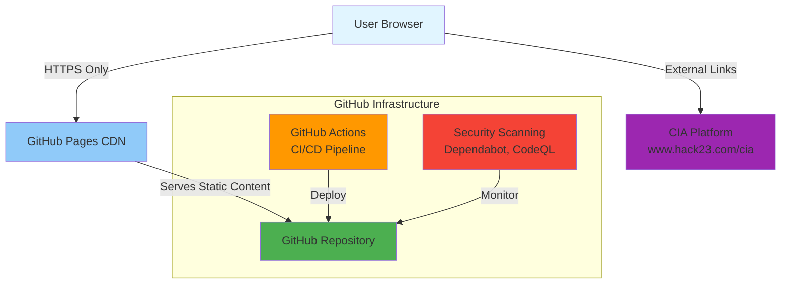

# Security Architecture - Riksdags Monitor

**Document Version:** 1.0  
**Last Updated:** 2026-01-29  
**Classification:** Public  
**Owner:** Hack23 AB (Org.nr 5595347807)

## Executive Summary

Riksdags Monitor is a static website providing Swedish Parliament intelligence and election monitoring capabilities. This document outlines the security architecture aligned with Hack23 AB's Information Security Management System (ISMS) and compliance frameworks (ISO 27001, NIST CSF 2.0, CIS Controls v8.1).

**Security Posture:** Defense-in-depth static website with GitHub infrastructure security, HTTPS-only access, and comprehensive CI/CD security controls.

## 1. System Overview

### 1.1 Purpose and Scope

**Purpose:**
- Monitor Swedish Riksdag political activity
- Provide real-time intelligence on 349 MPs
- Track coalition stability and election predictions
- Deliver CIA platform data visualizations to public

**Scope:**
- Static HTML/CSS website
- Multi-language support (14 languages)
- Integration with CIA platform for data visualization
- GitHub Pages hosting infrastructure

### 1.2 Architecture Diagram



## 2. Security Architecture Components

### 2.1 Authentication & Access Control

**Public Access Model:**
- **No Authentication Required:** Static public website accessible to all
- **Content Management:** GitHub repository access controlled via GitHub authentication
  - MFA required for all contributors
  - SSH keys with passphrase protection
  - GPG signing required for commits
  - Branch protection rules enforced

**Control Mapping:**
- ISO 27001: A.9.2 User Access Management
- NIST CSF 2.0: PR.AC-1 (Identities and credentials managed)
- CIS Controls v8.1: 5.1 (Establish and Maintain an Inventory of Accounts)

### 2.2 Authorization Model

**GitHub Repository Permissions:**
- **Admin:** Repository owners (Hack23 organization owners)
- **Write:** Approved contributors with MFA
- **Read:** Public access (website viewing)

**CI/CD Pipeline Permissions:**
- Least privilege GitHub Actions permissions
- Scoped GITHUB_TOKEN for workflow operations
- Secrets management via GitHub Secrets

**Control Mapping:**
- ISO 27001: A.9.4 System and Application Access Control
- NIST CSF 2.0: PR.AC-4 (Access permissions managed)
- CIS Controls v8.1: 6.8 (Define and Maintain Role-Based Access Control)

### 2.3 Data Security

**Data Classification:**
- **Public Information:** All website content (Swedish Riksdag open data)
- **Internal:** GitHub Actions secrets, deployment credentials
- **No Sensitive Data:** No user data, no PII, no financial information

**Data Protection:**
- **In Transit:** 
  - TLS 1.3 encryption (GitHub Pages default)
  - HTTPS-only access enforced
  - HSTS headers configured
- **At Rest:**
  - GitHub repository encryption at rest
  - Immutable Git history for audit trail

**Control Mapping:**
- ISO 27001: A.10.1 Cryptographic Controls
- NIST CSF 2.0: PR.DS-2 (Data-in-transit protected)
- CIS Controls v8.1: 3.10 (Encrypt Sensitive Data in Transit)

### 2.4 Network Security

**GitHub Pages Infrastructure:**
- **DDoS Protection:** GitHub infrastructure-level protection
- **CDN:** GitHub Pages CDN for global distribution
- **Firewall:** GitHub-managed infrastructure firewall

**Security Headers:**
```
Content-Security-Policy: default-src 'self'; script-src 'self' 'unsafe-inline'; style-src 'self' 'unsafe-inline' fonts.googleapis.com; font-src 'self' fonts.gstatic.com
X-Content-Type-Options: nosniff
X-Frame-Options: DENY
X-XSS-Protection: 1; mode=block
Strict-Transport-Security: max-age=31536000; includeSubDomains
Referrer-Policy: strict-origin-when-cross-origin
```

**Control Mapping:**
- ISO 27001: A.13.1 Network Security Management
- NIST CSF 2.0: PR.AC-5 (Network integrity protected)
- CIS Controls v8.1: 13.1 (Centralize Security Event Alerting)

### 2.5 Application Security

**Static Website Security:**
- **No Server-Side Code:** Eliminates injection vulnerabilities
- **No Database:** No SQL injection risk
- **No User Input Processing:** No XSS attack surface
- **External Data:** Read-only links to CIA platform

**Dependency Management:**
- CSS frameworks: Google Fonts (trusted CDN)
- No JavaScript dependencies (static HTML only)
- Regular dependency scanning via Dependabot

**Control Mapping:**
- ISO 27001: A.14.2 Security in Development and Support
- NIST CSF 2.0: PR.IP-12 (A vulnerability management plan developed)
- CIS Controls v8.1: 16.1 (Establish and Maintain a Secure Application Development Process)

### 2.6 Monitoring & Logging

**Security Monitoring:**
- **GitHub Security Features:**
  - Dependabot alerts for dependency vulnerabilities
  - Secret scanning for exposed credentials
  - Code scanning (CodeQL) for security issues
  - Security advisories tracking

**Audit Logging:**
- **Git Commit History:** Immutable audit trail of all changes
- **GitHub Actions Logs:** CI/CD pipeline execution logs
- **GitHub Audit Log:** Organization-level access and change logs

**Alert Mechanisms:**
- GitHub Security Advisories
- Email notifications for security events
- Pull request checks for quality gates

**Control Mapping:**
- ISO 27001: A.12.4 Logging and Monitoring
- NIST CSF 2.0: DE.CM-1 (The network is monitored)
- CIS Controls v8.1: 8.2 (Collect Audit Logs)

### 2.7 Incident Response

**Security Incident Procedures:**
1. **Detection:** GitHub security alerts, Dependabot, manual reporting
2. **Containment:** Disable GitHub Pages, revert commits if needed
3. **Investigation:** Review Git history, GitHub Actions logs
4. **Remediation:** Apply security patches, update dependencies
5. **Recovery:** Re-deploy verified secure version
6. **Lessons Learned:** Update SECURITY_ARCHITECTURE.md and THREAT_MODEL.md

**Incident Response Team:**
- **Security Lead:** James Pether Sörling (CISSP, CISM)
- **Repository Owners:** Hack23 organization admins
- **Escalation:** Follow Hack23 ISMS Incident Response Plan

**Control Mapping:**
- ISO 27001: A.16.1 Management of Information Security Incidents
- NIST CSF 2.0: RS.CO-1 (Personnel know their roles and order of operations)
- CIS Controls v8.1: 17.1 (Designate Personnel to Manage Incident Handling)

## 3. Compliance Mapping

### 3.1 ISO 27001:2022 Controls

| Control | Implementation | Status |
|---------|----------------|--------|
| A.9.2 | GitHub MFA, SSH keys, GPG signing | ✅ Implemented |
| A.9.4 | Repository permissions, least privilege | ✅ Implemented |
| A.10.1 | TLS 1.3, HTTPS-only | ✅ Implemented |
| A.12.4 | Git history, GitHub audit logs | ✅ Implemented |
| A.13.1 | GitHub infrastructure, security headers | ✅ Implemented |
| A.14.2 | Dependabot, CodeQL scanning | ✅ Implemented |
| A.16.1 | Incident response procedures | ✅ Implemented |

### 3.2 NIST CSF 2.0 Categories

| Function | Category | Implementation |
|----------|----------|----------------|
| IDENTIFY | Asset Management | GitHub repository, static assets |
| PROTECT | Access Control | GitHub authentication, MFA |
| PROTECT | Data Security | TLS 1.3, HTTPS-only |
| DETECT | Security Monitoring | Dependabot, CodeQL, secret scanning |
| RESPOND | Incident Response | Documented procedures |
| RECOVER | Recovery Planning | Git rollback, GitHub Pages re-deploy |

### 3.3 CIS Controls v8.1

| IG | Control | Implementation |
|----|---------|----------------|
| IG1 | 3.10 Encrypt Data in Transit | TLS 1.3, HTTPS-only |
| IG1 | 5.1 Account Inventory | GitHub organization audit |
| IG1 | 8.2 Collect Audit Logs | Git history, GitHub Actions logs |
| IG2 | 6.8 Role-Based Access Control | GitHub repository permissions |
| IG2 | 13.1 Security Event Alerting | GitHub security alerts |
| IG2 | 16.1 Secure Development | Static site, no injection risks |

## 4. Security Controls Summary

### 4.1 Preventive Controls

1. **Access Control:**
   - GitHub MFA requirement
   - SSH key authentication with passphrase
   - GPG commit signing
   - Branch protection rules

2. **Network Security:**
   - HTTPS-only access (TLS 1.3)
   - Security headers (CSP, HSTS, X-Frame-Options)
   - GitHub infrastructure DDoS protection

3. **Development Security:**
   - Static HTML/CSS only (no server-side code)
   - No user input processing
   - Dependency scanning via Dependabot
   - Code quality checks in CI/CD

### 4.2 Detective Controls

1. **Security Monitoring:**
   - Dependabot vulnerability alerts
   - Secret scanning
   - CodeQL static analysis
   - GitHub audit logs

2. **Quality Checks:**
   - HTML validation (HTMLHint)
   - Link checking (linkinator)
   - Automated CI/CD pipeline checks

### 4.3 Corrective Controls

1. **Incident Response:**
   - Documented procedures
   - Git rollback capability
   - Rapid re-deployment via GitHub Actions

2. **Patch Management:**
   - Dependabot automatic updates
   - Rapid deployment via GitHub Actions
   - Version control for rollback

## 5. Security Assumptions and Constraints

### 5.1 Assumptions

1. **GitHub Infrastructure:** Trusted cloud provider with robust security
2. **Static Content:** No dynamic server-side processing eliminates common vulnerabilities
3. **Public Data:** All content is public information (Swedish Riksdag open data)
4. **External Dependencies:** CIA platform (www.hack23.com/cia) maintains its own security

### 5.2 Constraints

1. **GitHub Pages Limitations:**
   - No server-side code execution
   - No database access
   - Limited customization of HTTP headers
   - Fixed infrastructure (cannot modify underlying OS)

2. **Static Website Limitations:**
   - No user authentication capability
   - No session management
   - No server-side input validation
   - Read-only data presentation

## 6. Risk Assessment

### 6.1 Residual Risks

| Risk | Likelihood | Impact | Mitigation |
|------|-----------|--------|------------|
| GitHub Platform Outage | Low | Medium | Documented in THREAT_MODEL.md |
| DDoS Attack on GitHub | Low | Low | GitHub infrastructure protection |
| Compromised GitHub Account | Low | High | MFA, SSH keys, GPG signing |
| Dependency Vulnerability | Medium | Low | Dependabot, rapid patching |
| Content Defacement | Low | Medium | Git rollback, branch protection |

### 6.2 Accepted Risks

1. **No User Authentication:** Acceptable as website is intentionally public
2. **GitHub Platform Dependency:** Acceptable given GitHub's security posture
3. **External CIA Platform Dependency:** Acceptable with documented availability in THREAT_MODEL.md

## 7. Security Governance

### 7.1 Roles and Responsibilities

| Role | Responsibility |
|------|----------------|
| Security Architect | Overall security architecture and compliance |
| Repository Owners | Access control, security monitoring |
| Contributors | Secure coding practices, MFA compliance |
| CISO (James Pether Sörling) | ISMS oversight, incident escalation |

### 7.2 Review and Update Schedule

- **Security Architecture Review:** Annual or after major changes
- **Threat Model Update:** Quarterly or after incidents
- **Dependency Updates:** Automated via Dependabot (weekly)
- **Access Control Review:** Quarterly

### 7.3 Related Documentation

- [Hack23 ISMS](https://github.com/Hack23/ISMS)
- [Secure Development Policy](https://github.com/Hack23/ISMS/blob/main/Secure_Development_Policy.md)
- [THREAT_MODEL.md](./THREAT_MODEL.md) - Riksdags Monitor threat analysis
- [Information Security Policy](https://github.com/Hack23/ISMS-PUBLIC/blob/main/Information_Security_Policy.md)

## 8. Approval

| Role | Name | Date | Signature |
|------|------|------|-----------|
| Security Architect | James Pether Sörling, CISSP, CISM | 2026-01-29 | [Digital Signature] |
| Repository Owner | Hack23 AB | 2026-01-29 | [Approved via Git Commit] |

---

**Document Control:**
- **Repository:** https://github.com/Hack23/riksdagsmonitor
- **Path:** /SECURITY_ARCHITECTURE.md
- **Format:** Markdown
- **Classification:** Public
- **Next Review:** 2027-01-29
