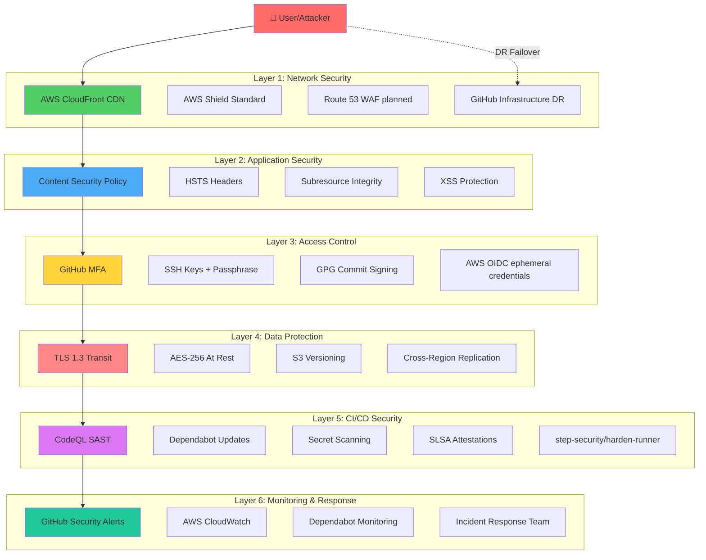
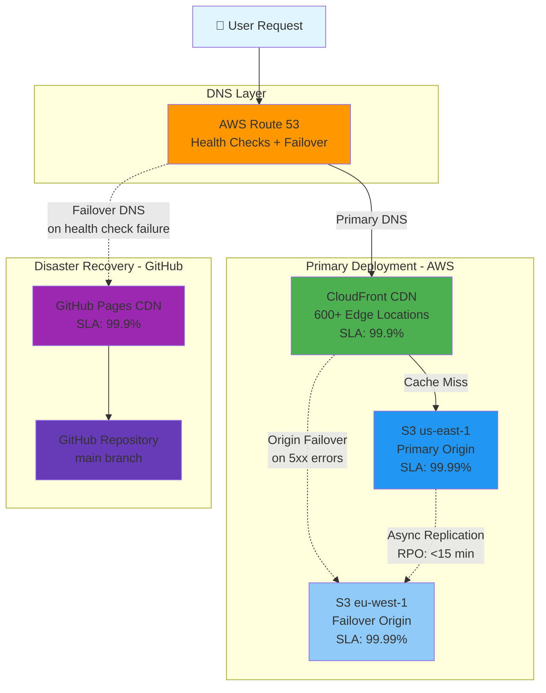
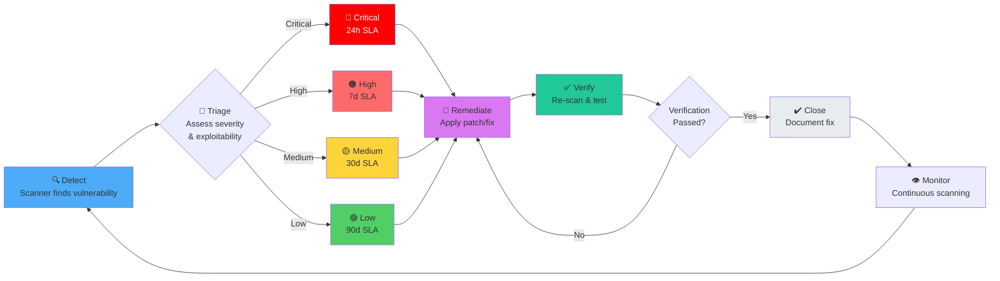

<p align="center">
  
</p>

<h1 align="center">🛡️ Riksdagsmonitor — Security Architecture</h1>

<p align="center">
  <strong>🔐 Defense-in-Depth Protection for Swedish Parliament Transparency</strong><br>
  <em>🎯 Comprehensive Security Framework for Political Intelligence Platform</em>
</p>

<p align="center">
  <a href="#"></a>
  <a href="#"></a>
  <a href="#"></a>
  <a href="#"></a>
</p>

**📋 Document Owner:** CEO | **📄 Version:** 2.0 | **📅 Last Updated:** 2026-02-20 (UTC)  
**🔄 Review Cycle:** Annual | **⏰ Next Review:** 2027-02-20  
**🏢 Owner:** Hack23 AB (Org.nr 5595347807) | **🏷️ Classification:** Public

---

## 📚 Architecture Documentation Map

| Document | Focus | Description |
|----------|-------|-------------|
| **[Security Architecture](SECURITY_ARCHITECTURE.md)** | 🛡️ Security | **Current document** — Defense-in-depth controls |
| [Threat Model](THREAT_MODEL.md) | 🎯 Threats | STRIDE/MITRE ATT&CK analysis |
| [Future Security Architecture](FUTURE_SECURITY_ARCHITECTURE.md) | 🚀 Security Roadmap | Planned security improvements |
| [Architecture](ARCHITECTURE.md) | 🏛️ C4 Models | System structure and components |
| [Data Model](DATA_MODEL.md) | 📊 Data | Entities, schemas, relationships |
| [Flowcharts](FLOWCHART.md) | 🔄 Processes | Process flows and pipelines |
| [State Diagrams](STATEDIAGRAM.md) | 🔄 Behavior | System state transitions |
| [Mindmaps](MINDMAP.md) | 🗺️ Concepts | Conceptual system maps |
| [SWOT Analysis](SWOT.md) | 💼 Strategy | Strategic position assessment |
| [Future Architecture](FUTURE_ARCHITECTURE.md) | 🚀 Architecture | Architectural evolution roadmap |
| [Future Data Model](FUTURE_DATA_MODEL.md) | 🚀 Data | Enhanced data architecture |
| [Future Flowcharts](FUTURE_FLOWCHART.md) | 🚀 Processes | Improved process workflows |
| [Future State Diagrams](FUTURE_STATEDIAGRAM.md) | 🚀 Behavior | Advanced state management |
| [Future Mindmaps](FUTURE_MINDMAP.md) | 🚀 Concepts | Capability expansion maps |
| [Future SWOT](FUTURE_SWOT.md) | 🚀 Strategy | Future strategic opportunities |

---

## 📋 Table of Contents

- [🎯 Executive Summary](#-executive-summary)
- [🔐 ISMS Policy Alignment](#-isms-policy-alignment)
- [1. 🏗️ System Overview](#1-️-system-overview)
  - [1.1 🎯 Purpose and Scope](#11--purpose-and-scope)
  - [1.2 🔐 AWS Security Controls](#12--aws-security-controls)
  - [1.3 Architecture Diagram](#13-architecture-diagram)
- [2. 🔐 Security Architecture Components](#2--security-architecture-components)
  - [2.1 Authentication & Access Control](#21-authentication--access-control)
  - [2.2 Authorization Model](#22-authorization-model)
  - [2.3 Data Security](#23-data-security)
  - [2.4 Network Security](#24-network-security)
  - [2.5 Application Security](#25-application-security)
  - [2.6 Monitoring & Logging](#26-monitoring--logging)
  - [2.7 Incident Response](#27-incident-response)
  - [2.8 Release Security & Supply Chain Protection](#28-release-security--supply-chain-protection)
- [3. 📋 Compliance Mapping](#3--compliance-mapping)
  - [3.1 ISO 27001:2022 Controls](#31-iso-270012022-controls)
  - [3.2 NIST CSF 2.0 Categories](#32-nist-csf-20-categories)
  - [3.3 CIS Controls v8.1](#33-cis-controls-v81)
- [4. 🛡️ Security Controls Summary](#4-️-security-controls-summary)
  - [4.1 Preventive Controls](#41-preventive-controls)
  - [4.2 Detective Controls](#42-detective-controls)
  - [4.3 Corrective Controls](#43-corrective-controls)
- [5. 📝 Security Assumptions and Constraints](#5--security-assumptions-and-constraints)
  - [5.1 Assumptions](#51-assumptions)
  - [5.2 Constraints](#52-constraints)
- [6. ⚠️ Risk Assessment](#6-️-risk-assessment)
  - [6.1 Residual Risks](#61-residual-risks)
  - [6.2 Accepted Risks](#62-accepted-risks)
- [7. 🏛️ Security Governance](#7-️-security-governance)
  - [7.1 Roles and Responsibilities](#71-roles-and-responsibilities)
  - [7.2 Review and Update Schedule](#72-review-and-update-schedule)
  - [7.3 Related Documentation](#73-related-documentation)
- [8. ✅ Approval](#8--approval)
- [🛡️ Defense-in-Depth Strategy](#️-defense-in-depth-strategy)
- [📜 Data Integrity & Auditing](#-data-integrity--auditing)
- [🔍 Security Event Monitoring](#-security-event-monitoring)
- [🏗️ High Availability Design](#️-high-availability-design)
- [🕵️ Threat Detection & Investigation](#️-threat-detection--investigation)
- [🔎 Vulnerability Management](#-vulnerability-management)
- [🤖 Automated Security Operations](#-automated-security-operations)
- [⚡ Resilience & Operational Readiness](#-resilience--operational-readiness)
- [📋 Configuration & Compliance Management](#-configuration--compliance-management)
- [📊 Monitoring & Analytics](#-monitoring--analytics)
- [🔄 Security Operations](#-security-operations)
- [💰 Security Investment](#-security-investment)
- [📝 Conclusion](#-conclusion)
- [📋 Document Control](#-document-control)

---

## 🎯 Executive Summary

Riksdagsmonitor is a web platform providing Swedish Parliament intelligence and election monitoring capabilities. This document outlines the security architecture aligned with Hack23 AB's Information Security Management System (ISMS), [Classification Framework](https://github.com/Hack23/ISMS-PUBLIC/blob/main/CLASSIFICATION.md), and compliance frameworks (ISO 27001, NIST CSF 2.0, CIS Controls v8.1).

**Security Posture:** Defense-in-depth architecture with dual-deployment (AWS CloudFront/S3 multi-region primary, GitHub Pages disaster recovery), HTTPS-only access, comprehensive CI/CD security controls, and SLSA Build Provenance attestations.

**For complete CI/CD workflow documentation, see [WORKFLOWS.md](WORKFLOWS.md).**

---

## 🔐 ISMS Policy Alignment

Riksdagsmonitor security architecture is governed by and aligned with Hack23 AB's comprehensive Information Security Management System (ISMS). This ensures consistent security practices across all organizational assets.

### **📜 Governing Policies**

| Policy Document | Purpose | Application to Riksdagsmonitor |
|----------------|---------|-------------------------------|
| **[Information Security Policy](https://github.com/Hack23/ISMS-PUBLIC/blob/main/Information_Security_Policy.md)** | Organization-wide security governance | Establishes security objectives, risk management framework, and accountability |
| **[Secure Development Policy](https://github.com/Hack23/ISMS-PUBLIC/blob/main/Secure_Development_Policy.md)** | Secure SDLC requirements | Mandates security documentation (SECURITY_ARCHITECTURE.md, THREAT_MODEL.md, FUTURE_SECURITY_ARCHITECTURE.md), code scanning, vulnerability management |
| **[Classification Framework](https://github.com/Hack23/ISMS-PUBLIC/blob/main/CLASSIFICATION.md)** | Information classification scheme | Defines handling requirements for Public/Internal/Confidential/Restricted data (see §2.3) |
| **[Incident Response Policy](https://github.com/Hack23/ISMS-PUBLIC/blob/main/Incident_Response_Policy.md)** | Security incident procedures | Provides escalation paths, response team structure, lessons learned process (see §2.7) |
| **[Access Control Policy](https://github.com/Hack23/ISMS-PUBLIC/blob/main/Access_Control_Policy.md)** | Identity and access management | Defines MFA requirements, least privilege principles, access review cycles (see §2.1) |

### **🎯 Policy Compliance Summary**

- ✅ **Security Documentation:** Complete (SECURITY_ARCHITECTURE.md, THREAT_MODEL.md, FUTURE_SECURITY_ARCHITECTURE.md)
- ✅ **Code Scanning:** CodeQL, Dependabot, Secret Scanning enabled
- ✅ **Access Controls:** MFA enforced, SSH keys, GPG signing mandatory
- ✅ **Vulnerability Management:** SLAs defined (Critical: 24h, High: 7d, Medium: 30d, Low: 90d)
- ✅ **Incident Response:** Documented procedures with escalation to CISO
- ✅ **Data Classification:** Information classification scheme applied (§2.3)
- ✅ **Compliance Frameworks:** ISO 27001:2022, NIST CSF 2.0, CIS Controls v8.1 mapped (§3)

**Policy Review Cycle:** All referenced policies reviewed annually by CISO. Next ISMS policy review: 2027-01-31.

## 1. 🏗️ System Overview

### 1.1 🎯 Purpose and Scope

**Purpose:**
- Monitor Swedish Riksdag political activity
- Provide real-time intelligence on 349 MPs
- Track coalition stability and election predictions
- Deliver 9 dashboard sections with CIA platform data (4 functional: committee, coalition, election-cycle, risk/anomaly; 5 placeholders: party, seasonal, pre-election, ministry, anomaly detection)
- OSINT-powered political transparency

**Scope:**
- Web application with HTML/CSS/JavaScript (Chart.js, D3.js)
- 9 dashboard sections (4 functional with 150KB+ JavaScript, 5 placeholders with HTML structure only)
- Multi-language support (14 languages)
- CIA data integration with local CSV caching
- AWS CloudFront + S3 hosting infrastructure (Primary)
- GitHub Pages hosting infrastructure (Disaster Recovery)
- AWS Route 53 DNS with health checks and automatic failover

### 1.2 🔐 AWS Security Controls

**AWS Infrastructure Security (Primary Deployment):**

- **🔑 Authentication & Access Control:**
  - GitHub Actions OIDC integration for AWS authentication (ephemeral credentials)
  - No long-lived AWS access keys or IAM user credentials stored
  - Least-privilege IAM roles with time-limited session tokens
  - S3 bucket policies restrict access to CloudFront Origin Access Identity only

- **📊 Audit Logging & Monitoring:**
  - AWS CloudTrail enabled for all API activity logging
  - 90-day log retention in dedicated S3 audit bucket
  - CloudWatch metrics for S3, CloudFront, and Route 53
  - Real-time alerting on security events and anomalies

- **🔒 Data Protection:**
  - S3 server-side encryption at rest (AES-256)
  - S3 bucket versioning enabled for rollback capability
  - Cross-region replication (typically within minutes) (us-east-1 → eu-west-1)
  - TLS 1.3 encryption in transit via CloudFront

- **🛡️ DDoS & Threat Protection:**
  - AWS Shield Standard (automatic DDoS protection)
  - CloudFront geographic restrictions capability
  - Planned request rate limiting via AWS WAF rate-based rules associated with CloudFront
  - AWS Web Application Firewall (WAF) planned for advanced application-layer threat protection and rate limiting

### 1.3 Architecture Diagram

```mermaid
graph TB
    User[User Browser]
    Route53[AWS Route 53<br/>DNS + Health Checks]
    
    subgraph "Primary: AWS Infrastructure"
        CF[CloudFront CDN<br/>600+ Edge Locations]
        S3US[S3 Bucket us-east-1<br/>Primary Storage + Versioning]
        S3EU[S3 Bucket eu-west-1<br/>Cross-region Replica<br/>Active Failover Origin]
    end
    
    subgraph "Disaster Recovery: GitHub"
        GHCDN[GitHub Pages CDN<br/>Standby Deployment]
    end
    
    subgraph "GitHub Infrastructure"
        GitHubRepo[GitHub Repository<br/>main branch]
        Actions[GitHub Actions<br/>CI/CD Dual Deploy]
        Security[Security Scanning<br/>Dependabot, CodeQL, Secrets]
    end
    
    CIA[CIA Platform<br/>www.hack23.com/cia]
    
    User -->|DNS Query| Route53
    Route53 -->|DNS Response: CloudFront Primary| User
    Route53 -.->|DNS Response: GitHub Pages on Failover| User
    User -->|HTTPS Only TLS 1.3| CF
    User -.->|HTTPS Only TLS 1.3 (DR)| GHCDN
    
    CF -->|Cache Miss| S3US
    CF -.->|Origin Failover on 5xx errors| S3EU
    S3US -->|Async Cross-Region Replication (&lt;15 min RPO)| S3EU
    
    User -->|External Links| CIA
    
    GHCDN --> GitHubRepo
    Actions -->|Deploy| S3US
    Actions -->|Deploy| GitHubRepo
    Security -->|Monitor| GitHubRepo
    
    style User fill:#e1f5ff
    style Route53 fill:#ff9800
    style CF fill:#4caf50
    style S3US fill:#2196f3
    style GHCDN fill:#90caf9
    style Actions fill:#ff9800
    style Security fill:#f44336
    style CIA fill:#9c27b0
```

## 2. 🔐 Security Architecture Components

### 2.1 Authentication & Access Control

**Public Access Model:**
- **No Authentication Required:** Static public website accessible to all
- **Content Management:** GitHub repository access controlled via GitHub authentication
  - MFA required for all contributors
  - SSH keys with passphrase protection
  - GPG signing required for commits
  - Branch protection rules enforced

**Control Mapping:**
- ISO 27001: A.9.2 User Access Management
- NIST CSF 2.0: PR.AC-1 (Identities and credentials managed)
- CIS Controls v8.1: 5.1 (Establish and Maintain an Inventory of Accounts)

### 2.2 Authorization Model

**GitHub Repository Permissions:**
- **Admin:** Repository owners (Hack23 organization owners)
- **Write:** Approved contributors with MFA
- **Read:** Public access (website viewing)

**CI/CD Pipeline Permissions:**
- Least privilege GitHub Actions permissions
- Scoped GITHUB_TOKEN for workflow operations
- Secrets management via GitHub Secrets

**Control Mapping:**
- ISO 27001: A.9.4 System and Application Access Control
- NIST CSF 2.0: PR.AC-4 (Access permissions managed)
- CIS Controls v8.1: 6.8 (Define and Maintain Role-Based Access Control)

### 2.3 Data Security

**Information Classification:**

Following Hack23 AB ISMS information classification policy:

| Classification | Data Types | Handling Requirements | Storage / Access Method |
|----------------|-----------|----------------------|------------------------|
| 🟢 **Public** | Website content, Swedish Riksdag open data, documentation | No restrictions, TLS 1.3 in transit | GitHub repository, AWS S3, GitHub Pages (CDN) |
| 🟡 **Internal** | GitHub Actions secrets, AWS credentials, deployment configs | Encrypted at rest, MFA access, least privilege | GitHub Secrets, AWS IAM (ephemeral STS/OIDC) |
| 🟠 **Confidential** | Not applicable | N/A | N/A |
| 🔴 **Restricted** | Not applicable | N/A | N/A |

**Data Inventory:**
- **Public Data:** 
  - 14-language website (HTML/CSS)
  - Swedish Parliament data (349 MPs, 50+ years)
  - Election statistics, voting records
  - Government budget data
  - All source code and documentation
- **Internal Data:**
  - GitHub repository and Actions access tokens (if used, e.g., optional PATs for local tooling)
  - AWS IAM credentials (ephemeral via OIDC)
  - GitHub Actions workflow secrets
- **No Sensitive End-User Data:**
  - ❌ No end-user accounts or authentication features
  - ❌ No collection of non-public personal data from site users
  - ⚠️ Public personal data about Swedish public officials (e.g., names, person identifiers, roles) from Riksdag open data and cia-data datasets
    - **Information classification:** 🟢 Public (openly available data)
    - **Privacy classification:** Personal data – public-official (GDPR/PII handling still applies despite public availability)

**Data Protection Controls:**

**In Transit:**
- TLS 1.3 encryption (AWS CloudFront + GitHub Pages)
- HTTPS-only access enforced
- HSTS headers configured (max-age=31536000)
- Certificate transparency monitoring

**At Rest:**
- AWS S3 server-side encryption (AES-256)
- GitHub repository encryption at rest
- GitHub Secrets encryption (Libsodium sealed boxes)
- Immutable Git history for audit trail
- S3 versioning enabled for rollback capability

**Access Controls:**
- Public data: No authentication (intentionally public)
- Internal data: GitHub MFA, SSH keys, GPG signing
- AWS credentials: Ephemeral OIDC tokens only (no long-lived keys)
- Least privilege IAM roles

**Data Lifecycle:**
- **Creation:** Git commits with GPG signing
- **Storage:** GitHub + AWS S3 with versioning
- **Access:** TLS 1.3 encrypted channels only
- **Retention:** Indefinite (public data), 90 days (AWS CloudTrail logs)
- **Deletion:** Git history retained, S3 versioning for recovery

**Control Mapping:**
- ISO 27001: A.5.10 (Acceptable use - data classification), A.10.1 (Cryptographic controls)
- NIST CSF 2.0: PR.DS-1 (Data-at-rest protected), PR.DS-2 (Data-in-transit protected)
- CIS Controls v8.1: 3.1 (Establish data management), 3.10 (Encrypt data in transit)

### 2.4 Network Security

**AWS CloudFront Infrastructure (Primary):**
- **DDoS Protection:** AWS Shield Standard (automatic protection)
- **CDN:** 600+ global edge locations
- **WAF:** Available for application-layer protection (roadmap: 2027 Q2)
- **TLS:** CloudFront managed certificates with TLS 1.3
- **Firewall:** AWS infrastructure-level protection

**GitHub Pages Infrastructure (Disaster Recovery):**
- **DDoS Protection:** GitHub infrastructure-level protection
- **CDN:** GitHub Pages CDN for global distribution
- **Firewall:** GitHub-managed infrastructure firewall

**Security Headers (Target Configuration - AWS CloudFront Response Headers Policy):**
```
Content-Security-Policy: default-src 'self'; script-src 'self' 'unsafe-inline'; style-src 'self' 'unsafe-inline' fonts.googleapis.com; font-src 'self' fonts.gstatic.com; img-src 'self' data: https:; connect-src 'self' https://raw.githubusercontent.com
X-Content-Type-Options: nosniff
X-Frame-Options: DENY
X-XSS-Protection: 1; mode=block
Strict-Transport-Security: max-age=31536000; includeSubDomains
Referrer-Policy: strict-origin-when-cross-origin
Permissions-Policy: geolocation=(), microphone=(), camera=()
```

**Note:** CSP includes `'unsafe-inline'` for Chart.js/D3.js inline styles and large inline dashboard script (946 lines). The `connect-src` directive includes `https://raw.githubusercontent.com` to allow fetching CIA CSV data from the cia repository. Security headers are configured via AWS CloudFront Response Headers Policy for the primary deployment. GitHub Pages disaster recovery inherits default GitHub Pages security headers. Future enhancement: nonce-based CSP for stricter inline script control (roadmap: 2027). Chart.js, D3.js, and chartjs-plugin-annotation are hosted locally on CloudFront (js/lib/) rather than via external CDN, eliminating external script dependencies.

**Control Mapping:**
- ISO 27001: A.13.1 Network Security Management
- NIST CSF 2.0: PR.AC-5 (Network integrity protected)
- CIS Controls v8.1: 13.1 (Centralize Security Event Alerting)

### 2.5 Application Security

**Web Application Security:**
- **Client-Side JavaScript:** Chart.js and D3.js for interactive dashboards
  - 3 external JS files loaded: `scripts/coalition-dashboard.js` (33KB), `scripts/committees-dashboard.js` (39KB), `js/election-cycle-dashboard.js` (46KB) ≈118KB
  - 1 large inline script (946 lines, ~32KB) handling risk dashboard only (includes one anomaly chart within risk dashboard)
  - 5 placeholder dashboard sections with HTML structure but no JavaScript initialization (future implementation):
    - Party Performance Dashboard
    - Seasonal Patterns Dashboard
    - Pre-Election Monitoring Dashboard
    - Ministry Dashboard
    - Anomaly Detection Dashboard (standalone section with timeline/heatmap/distribution charts - distinct from single anomaly chart in risk dashboard)
  - Total: ~150KB active JavaScript code (118KB external + 32KB inline; source size, transfer size smaller when compressed)
- **XSS Mitigation:** Content Security Policy (CSP) headers with script-src restrictions
- **Input Sanitization:** CIA CSV data is subjected to best-effort, non-blocking schema validation during CI/data-integration workflows (e.g., `.github/workflows/validate-cia-data.yml`); validation failures currently surface as warnings rather than blocking publication, and client-side code then parses this CSV (D3 CSV utilities/custom parsers) and applies basic sanity checks prior to rendering via Chart.js/D3.js
- **External Dependencies:**
  - Chart.js v4.4.1 (hosted locally on CloudFront/S3 at js/lib/chart.umd.4.4.1.js)
  - chartjs-plugin-annotation v3.0.1 (hosted locally on CloudFront/S3 at js/lib/chartjs-plugin-annotation.3.0.1.min.js)
  - chartjs-adapter-date-fns v3.0.0 bundle (hosted locally on CloudFront/S3 at js/lib/chartjs-adapter-date-fns.3.0.0.bundle.min.js) - for time-series charts
  - D3.js v7.9.0 (hosted locally on CloudFront/S3 at js/lib/d3.7.9.0.min.js)
  - Papa Parse v5.5.3 (hosted locally on CloudFront/S3 at js/lib/papaparse.5.5.3.min.js) - for CSV parsing
  - Google Fonts (Inter, Orbitron, Share Tech Mono - via fonts.googleapis.com and fonts.gstatic.com CDN)
- **CIA Data Integration:** Fetches CSV data from `https://raw.githubusercontent.com/Hack23/cia/` that is subject to non-blocking CI schema validation checks in pre-processing (e.g., `.github/workflows/validate-cia-data.yml`), with local caching for performance; the browser consumes this dataset which may contain validation warnings
- **No User Input Processing:** Dashboards do not accept or process arbitrary user input; they display pre-processed CIA data generated upstream in CI/data pipelines that has passed non-blocking schema validation checks where configured
- **No Server-Side Code:** Static hosting eliminates injection vulnerabilities

**Dashboard Security:**
- **9 Dashboard Sections (4 functional, 5 placeholders):**

**Functional Dashboards (4):**
1. **Committee Dashboard** (`scripts/committees-dashboard.js` 39KB) ✅
2. **Coalition Dashboard** (`scripts/coalition-dashboard.js` 33KB) ✅
3. **Election Cycle Dashboard** (`js/election-cycle-dashboard.js` 46KB) ✅
4. **Risk Dashboard** (inline script ~32KB, includes one anomaly detection chart) ✅

**Placeholder Dashboard Sections (5 - HTML structure only, no JavaScript):**
5. **Party Performance Dashboard** - Canvas elements present, awaiting JS implementation
6. **Seasonal Patterns Dashboard** - Canvas elements present, awaiting JS implementation
7. **Pre-Election Monitoring Dashboard** - Canvas elements present, awaiting JS implementation
8. **Ministry Dashboard** - Canvas elements present, awaiting JS implementation
9. **Anomaly Detection Dashboard** - Standalone section with multiple canvas elements (anomaly-timeline-chart, zscore-distribution-chart, anomaly-type-chart, quarterly-frequency-chart), distinct from the single anomaly chart within risk dashboard, awaiting JS implementation

**Dependency Management:**
- Chart.js, D3.js, chartjs-plugin-annotation, chartjs-adapter-date-fns, and Papa Parse hosted locally on CloudFront/S3 (js/lib/); versions reviewed manually at least quarterly and after critical CVE disclosures
- Library file integrity can be verified via SHA-256 hashes if needed for deployment validation (not required for runtime as served from same origin)
- Dependabot configured for GitHub Actions workflows (`.github/dependabot.yml`) and automated dependency risk assessment for repository-managed components via GitHub dependency-review and Dependabot alerts
- Supply chain security scanning via CodeQL and OpenSSF Scorecards

**Control Mapping:**
- ISO 27001: A.14.2 Security in Development and Support
- NIST CSF 2.0: PR.IP-12 (A vulnerability management plan developed)
- CIS Controls v8.1: 16.1 (Establish and Maintain a Secure Application Development Process)

### 2.6 Monitoring & Logging

**Security Monitoring:**
- **GitHub Security Features:**
  - Dependabot alerts for dependency vulnerabilities
  - Secret scanning for exposed credentials
  - Code scanning (CodeQL) for security issues
  - Security advisories tracking

**Audit Logging:**
- **Git Commit History:** Immutable audit trail of all changes
- **GitHub Actions Logs:** CI/CD pipeline execution logs
- **GitHub Audit Log:** Organization-level access and change logs

**Alert Mechanisms:**
- GitHub Security Advisories
- Email notifications for security events
- Pull request checks for quality gates

**Control Mapping:**
- ISO 27001: A.12.4 Logging and Monitoring
- NIST CSF 2.0: DE.CM-1 (The network is monitored)
- CIS Controls v8.1: 8.2 (Collect Audit Logs)

### 2.7 Incident Response

**Security Incident Procedures:**
1. **Detection:** GitHub security alerts, Dependabot, manual reporting
2. **Containment:** Disable GitHub Pages, revert commits if needed
3. **Investigation:** Review Git history, GitHub Actions logs
4. **Remediation:** Apply security patches, update dependencies
5. **Recovery:** Re-deploy verified secure version
6. **Lessons Learned:** Update SECURITY_ARCHITECTURE.md and THREAT_MODEL.md

**Incident Response Team:**
- **Security Lead:** James Pether Sörling (CISSP, CISM)
- **Repository Owners:** Hack23 organization admins
- **Escalation:** Follow Hack23 ISMS Incident Response Plan

**Control Mapping:**
- ISO 27001: A.16.1 Management of Information Security Incidents
- NIST CSF 2.0: RS.CO-1 (Personnel know their roles and order of operations)
- CIS Controls v8.1: 17.1 (Designate Personnel to Manage Incident Handling)

### 2.8 Release Security & Supply Chain Protection

**SLSA Build Provenance Attestations:**
- **Framework:** SLSA (Supply Chain Levels for Software Artifacts) Level 2+
- **Implementation:** GitHub Actions Attestations (`actions/attest-build-provenance@v3.2.0`)
- **Purpose:** Cryptographically prove artifacts were built by trusted CI/CD pipeline
- **Verification:** `gh attestation verify riksdagsmonitor-vX.Y.Z.zip -R Hack23/riksdagsmonitor`
- **Format:** in-toto attestations (*.intoto.jsonl)

**Software Bill of Materials (SBOM):**
- **Format:** SPDX (Software Package Data Exchange)
- **Generator:** Anchore SBOM Action (`anchore/sbom-action@v0.22.2`)
- **Contents:** Complete dependency inventory with versions and licenses
- **Attestation:** SBOM also cryptographically signed (`actions/attest-sbom@v3.0.0`)
- **Purpose:** Vulnerability tracking, license compliance, supply chain transparency

**Release Pipeline Security (3-job workflow):**

1. **Prepare Job (15-20min):**
   - Run comprehensive test suite (unit + E2E)
   - Generate all documentation (API, coverage, E2E reports, dependencies)
   - Deploy docs to GitHub Pages
   - Security: Read-only permissions, harden-runner enabled

2. **Build Job (5min):**
   - Build production artifacts
   - Generate SBOM in SPDX format
   - Create SLSA Build Provenance attestation
   - Create SBOM attestation
   - Generate SHA-256 checksums
   - Security: Minimal write permissions (contents: write, attestations: write, id-token: write)

3. **Release Job (5-10min):**
   - Create GitHub Release with all artifacts
   - Deploy to AWS S3/CloudFront (OIDC authentication)
   - Deploy to GitHub Pages (disaster recovery)
   - Invalidate CloudFront cache
   - Security: OIDC for AWS (no long-lived credentials), least-privilege IAM roles

**Release Artifacts (per version):**
- `riksdagsmonitor-vX.Y.Z.zip` - Production build
- `riksdagsmonitor-vX.Y.Z.zip.sha256` - Integrity checksum
- `riksdagsmonitor-vX.Y.Z.spdx.json` - SBOM
- `riksdagsmonitor-vX.Y.Z.zip.intoto.jsonl` - Build provenance attestation
- `riksdagsmonitor-vX.Y.Z.spdx.json.intoto.jsonl` - SBOM attestation

**Documentation as Code:**
All technical reports automatically generated and committed to `docs/` on each release:
- `docs/api/` - JSDoc API documentation
- `docs/coverage/` - Vitest test coverage (HTML + lcov)
- `docs/test-results/` - Vitest test results (JSON + HTML)
- `docs/cypress/` - Cypress E2E test reports
- `docs/dependencies/` - npm dependency tree (JSON + TXT)
- `docs/index.html` - Documentation hub (cyberpunk-themed)

**Verification Procedures:**
```bash
# Verify build provenance attestation
gh attestation verify riksdagsmonitor-vX.Y.Z.zip -R Hack23/riksdagsmonitor

# Verify SBOM attestation
gh attestation verify riksdagsmonitor-vX.Y.Z.spdx.json -R Hack23/riksdagsmonitor

# Verify artifact integrity
sha256sum -c riksdagsmonitor-vX.Y.Z.zip.sha256
```

**Control Mapping:**
- ISO 27001: A.8.30 (Secure coding), A.8.32 (Change management), A.14.2 (Security in development)
- NIST CSF 2.0: PR.DS-6 (Integrity verification mechanisms), ID.SC-3 (Supply chain risk assessment)
- CIS Controls v8.1: 16.6 (Application software security), 16.10 (Vulnerability remediation)

**For complete release process documentation, see [RELEASE_PROCESS.md](RELEASE_PROCESS.md) and [WORKFLOWS.md](WORKFLOWS.md#41-release-with-attestations).**

## 3. 📋 Compliance Mapping

### 3.1 ISO 27001:2022 Controls

| Control | Implementation | Status |
|---------|----------------|--------|
| A.8.2 | Information classification scheme, data inventory, handling controls | ✅ Implemented |
| A.9.2 | GitHub MFA, SSH keys, GPG signing | ✅ Implemented |
| A.9.4 | Repository permissions, least privilege | ✅ Implemented |
| A.10.1 | TLS 1.3, HTTPS-only, encryption at rest | ✅ Implemented |
| A.12.4 | Git history, GitHub audit logs, AWS CloudTrail | ✅ Implemented |
| A.13.1 | AWS infrastructure, security headers | ✅ Implemented |
| A.14.2 | Dependabot, CodeQL scanning | ✅ Implemented |
| A.16.1 | Incident response procedures | ✅ Implemented |

### 3.2 NIST CSF 2.0 Categories

| Function | Category | Implementation |
|----------|----------|----------------|
| GOVERN | Asset Management | Information classification scheme, data inventory |
| IDENTIFY | Asset Management | GitHub repository, static assets, data sources |
| PROTECT | Access Control | GitHub authentication, MFA, AWS OIDC |
| PROTECT | Data Security | TLS 1.3, HTTPS-only, encryption at rest |
| DETECT | Security Monitoring | Dependabot, CodeQL, secret scanning |
| RESPOND | Incident Response | Documented procedures, escalation paths |
| RECOVER | Recovery Planning | Git rollback, S3 versioning, multi-region replication |

### 3.3 CIS Controls v8.1

| IG | Control | Implementation |
|----|---------|----------------|
| IG1 | 3.1 Establish Data Management | Information classification policy, data inventory |
| IG1 | 3.10 Encrypt Data in Transit | TLS 1.3, HTTPS-only |
| IG1 | 5.1 Account Inventory | GitHub organization audit |
| IG1 | 8.2 Collect Audit Logs | Git history, GitHub Actions logs, AWS CloudTrail |
| IG2 | 6.8 Role-Based Access Control | GitHub repository permissions, AWS IAM |
| IG2 | 13.1 Security Event Alerting | GitHub security alerts, AWS CloudWatch |
| IG2 | 16.1 Secure Development | Static site with reduced injection surface; mitigated via CSP/SRI/safe DOM handling; secure CI/CD |

## 4. 🛡️ Security Controls Summary

### 4.1 Preventive Controls

1. **Access Control:**
   - GitHub MFA requirement
   - SSH key authentication with passphrase
   - GPG commit signing
   - Branch protection rules
   - AWS OIDC authentication (no long-lived credentials)

2. **Network Security:**
   - HTTPS-only access (TLS 1.3)
   - Security headers (CSP, HSTS, X-Frame-Options, Permissions-Policy)
   - AWS CloudFront DDoS protection (AWS Shield Standard)
   - Route 53 health checks and automatic failover
   - GitHub infrastructure DDoS protection (DR)

3. **Development Security:**
   - HTML/CSS/JavaScript with Chart.js and D3.js
   - CSP headers with SRI for CDN resources
   - No user input processing (display CIA data only)
   - Dependency scanning via GitHub Dependabot alerts
   - Code quality checks in CI/CD (HTMLHint, linkinator)
   - CIA data validation against JSON schemas

### 4.2 Detective Controls

1. **Security Monitoring:**
   - Dependabot vulnerability alerts
   - Secret scanning
   - CodeQL static analysis
   - GitHub audit logs

2. **Quality Checks:**
   - HTML validation (HTMLHint)
   - Link checking (linkinator)
   - Automated CI/CD pipeline checks

### 4.3 Corrective Controls

1. **Incident Response:**
   - Documented procedures
   - Git rollback capability
   - Rapid re-deployment via GitHub Actions

2. **Patch Management:**
   - Dependabot automatic updates
   - Rapid deployment via GitHub Actions
   - Version control for rollback

## 5. 📝 Security Assumptions and Constraints

### 5.1 Assumptions

1. **AWS Infrastructure:** Trusted cloud provider with robust security
2. **GitHub Infrastructure:** Trusted cloud provider with robust security (DR)
3. **Client-Side Security:** Chart.js/D3.js libraries are secure, maintained, and hosted locally on CloudFront
4. **CloudFront Security:** AWS CloudFront is trusted for static asset delivery with 99.9% SLA
5. **Public Data:** All content is public information (Swedish Riksdag open data)
6. **External Dependencies:** CIA platform (www.hack23.com/cia) maintains its own security
7. **Browser Security:** Users have modern browsers with JavaScript enabled

### 5.2 Constraints

1. **AWS Infrastructure Limitations:**
   - S3 static website limitations (no server-side code execution)
   - CloudFront caching behavior (potential stale content)
   - Cost constraints for high traffic scenarios

2. **GitHub Pages Limitations (DR):**
   - No server-side code execution
   - No database access
   - Limited customization of HTTP headers
   - Fixed infrastructure (cannot modify underlying OS)

3. **Client-Side JavaScript Limitations:**
   - Requires JavaScript enabled in browser
   - CSP `'unsafe-inline'` needed for Chart.js/D3.js
   - Browser compatibility requirements (ES6+)
   - Limited control over client execution environment

## 6. ⚠️ Risk Assessment

### 6.1 Residual Risks

| Risk | Likelihood | Impact | Mitigation |
|------|-----------|--------|------------|
| AWS CloudFront/S3 Outage | Low | Medium | GitHub Pages DR, documented failover |
| GitHub Platform Outage (DR) | Low | Low | AWS primary handles traffic |
| DDoS Attack on AWS | Low | Low | AWS Shield Standard, CloudFront protection |
| XSS via Chart.js/D3.js | Low | Medium | CSP headers, locally-hosted libraries (no external CDN), quarterly version reviews |
| Compromised GitHub Account | Low | High | MFA, SSH keys, GPG signing |
| Chart.js/D3.js Vulnerability | Medium | Medium | Locally-hosted libraries with quarterly/CVE version reviews, deployment-time integrity verification, rapid version updates |
| CIA Data Injection | Low | Medium | Schema validation, local CSV caching |
| Content Defacement | Low | Medium | Git rollback, branch protection, dual deployment |
| DNS Hijacking via Route 53 | Very Low | High | DNSSEC (planned), IAM least privilege |

### 6.2 Accepted Risks

1. **Client-Side JavaScript:** Acceptable for interactive dashboards with CSP and SRI
2. **AWS Platform Dependency:** Acceptable given AWS's security posture and GitHub Pages DR
3. **GitHub Platform Dependency (DR):** Acceptable with AWS as primary
4. **External CIA Platform Dependency:** Acceptable with documented availability in THREAT_MODEL.md
5. **CSP 'unsafe-inline':** Acceptable for Chart.js/D3.js dashboard rendering (future: nonce-based CSP)

## 7. 🏛️ Security Governance

### 7.1 Roles and Responsibilities

| Role | Responsibility |
|------|----------------|
| Security Architect | Overall security architecture and compliance |
| Repository Owners | Access control, security monitoring |
| Contributors | Secure coding practices, MFA compliance |
| CISO (James Pether Sörling) | ISMS oversight, incident escalation |

### 7.2 Review and Update Schedule

- **Security Architecture Review:** Annual or after major changes
- **Threat Model Update:** Quarterly or after incidents
- **Dependency Updates:** Automated via Dependabot (weekly)
- **Access Control Review:** Quarterly

### 7.3 Related Documentation

- [Hack23 ISMS](https://github.com/Hack23/ISMS)
- [Secure Development Policy](https://github.com/Hack23/ISMS/blob/main/Secure_Development_Policy.md)
- [THREAT_MODEL.md](./THREAT_MODEL.md) - Riksdags Monitor threat analysis
- [Information Security Policy](https://github.com/Hack23/ISMS-PUBLIC/blob/main/Information_Security_Policy.md)

## 8. ✅ Approval

| Role | Name | Date | Signature |
|------|------|------|-----------|
| Security Architect | James Pether Sörling, CISSP, CISM | 2026-02-10 | [Digital Signature] |
| Repository Owner | Hack23 AB | 2026-02-10 | [Approved via Git Commit] |

---

---

## 🛡️ Defense-in-Depth Strategy

Riksdagsmonitor implements a comprehensive defense-in-depth security strategy with six overlapping layers of protection. Each layer provides independent security controls, ensuring that compromise of a single layer does not result in complete system failure.

### **Security Layers**


```mermaid
graph TB
    subgraph "Layer 6: Monitoring & Response"
        L6A[GitHub Security Alerts]
        L6B[AWS CloudWatch]
        L6C[Dependabot Monitoring]
        L6D[Incident Response Team]
    end
    
    subgraph "Layer 5: CI/CD Security"
        L5A[CodeQL SAST]
        L5B[Dependabot Updates]
        L5C[Secret Scanning]
        L5D[SLSA Attestations]
        L5E[step-security/harden-runner]
    end
    
    subgraph "Layer 4: Data Protection"
        L4A[TLS 1.3 Transit]
        L4B[AES-256 At Rest]
        L4C[S3 Versioning]
        L4D[Cross-Region Replication]
    end
    
    subgraph "Layer 3: Access Control"
        L3A[GitHub MFA]
        L3B[SSH Keys + Passphrase]
        L3C[GPG Commit Signing]
        L3D[AWS OIDC ephemeral credentials]
    end
    
    subgraph "Layer 2: Application Security"
        L2A[Content Security Policy]
        L2B[HSTS Headers]
        L2C[Subresource Integrity]
        L2D[XSS Protection]
    end
    
    subgraph "Layer 1: Network Security"
        L1A[AWS CloudFront CDN]
        L1B[AWS Shield Standard]
        L1C[Route 53 WAF planned]
        L1D[GitHub Infrastructure DR]
    end
    
    User[👤 User/Attacker] --> L1A
    User -.->|DR Failover| L1D
    L1A --> L2A
    L2A --> L3A
    L3A --> L4A
    L4A --> L5A
    L5A --> L6A
    
    style User fill:#ff6b6b
    style L1A fill:#51cf66
    style L2A fill:#4dabf7
    style L3A fill:#ffd43b
    style L4A fill:#ff8787
    style L5A fill:#da77f2
    style L6A fill:#20c997
```

### **Layer 1: Network Security (Perimeter Defense)**

**Purpose:** Protect against network-level attacks (DDoS, volumetric attacks, malicious traffic).

| Control | Technology | Purpose | Status |
|---------|-----------|---------|--------|
| **CDN Protection** | AWS CloudFront (600+ edge locations) | Distribute traffic, absorb attacks | ✅ Active |
| **DDoS Mitigation** | AWS Shield Standard | Automatic protection against common attacks | ✅ Active |
| **DNS Protection** | AWS Route 53 with health checks | Prevent DNS-based attacks, enable failover | ✅ Active |
| **Geographic Filtering** | CloudFront geo-restrictions capability | Block traffic from high-risk regions (configurable) | 🔧 Available |
| **Rate Limiting** | AWS WAF (planned 2027 Q2) | Prevent abuse, scraping, brute force | 📅 Roadmap |
| **DR Infrastructure** | GitHub Pages CDN | Independent infrastructure for resilience | ✅ Active |

**ISO 27001:** A.13.1 (Network Security Management)  
**NIST CSF 2.0:** PR.AC-5 (Network integrity protected)  
**CIS Controls v8.1:** 13.1 (Centralize security event alerting)

---

### **Layer 2: Application Security (HTTP Defense)**

**Purpose:** Protect against web application attacks (XSS, clickjacking, MIME sniffing).

| Control | Implementation | Purpose | Status |
|---------|---------------|---------|--------|
| **Content Security Policy** | `default-src 'self'; script-src 'self' 'unsafe-inline'` | Mitigate XSS attacks | ✅ Active |
| **HTTP Strict Transport Security** | `max-age=31536000; includeSubDomains` | Enforce HTTPS-only | ✅ Active |
| **X-Frame-Options** | `DENY` | Prevent clickjacking | ✅ Active |
| **X-Content-Type-Options** | `nosniff` | Prevent MIME sniffing | ✅ Active |
| **Referrer Policy** | `strict-origin-when-cross-origin` | Control referrer information | ✅ Active |
| **Permissions Policy** | Disable geolocation, microphone, camera | Minimize browser permissions | ✅ Active |
| **Subresource Integrity** | SHA-384 hashes for local libraries | Verify resource integrity | ✅ Active |

**Note:** CSP includes `'unsafe-inline'` for Chart.js/D3.js compatibility. Future roadmap (2027): Implement nonce-based CSP for stricter inline script control.

**ISO 27001:** A.14.2 (Security in development and support)  
**NIST CSF 2.0:** PR.IP-12 (Vulnerability management plan)  
**CIS Controls v8.1:** 16.1 (Secure application development process)

---

### **Layer 3: Access Control (Identity & Authorization)**

**Purpose:** Ensure only authorized entities can modify code or infrastructure.

| Control | Implementation | Scope | Status |
|---------|---------------|-------|--------|
| **Multi-Factor Authentication** | GitHub MFA mandatory | All contributors | ✅ Enforced |
| **SSH Key Authentication** | Passphrase-protected keys | Git operations | ✅ Enforced |
| **GPG Commit Signing** | Verified commits required | All commits to main | ✅ Enforced |
| **AWS OIDC** | Ephemeral credentials (no long-lived keys) | CI/CD AWS deployments | ✅ Active |
| **Branch Protection** | Require reviews, status checks | main branch | ✅ Active |
| **Least Privilege IAM** | Minimal S3/CloudFront permissions | AWS resources | ✅ Active |
| **Repository Permissions** | RBAC: Admin/Write/Read roles | GitHub access | ✅ Active |

**ISO 27001:** A.9.2 (User access management), A.9.4 (System access control)  
**NIST CSF 2.0:** PR.AC-1 (Identities and credentials managed), PR.AC-4 (Access permissions managed)  
**CIS Controls v8.1:** 5.1 (Account inventory), 6.8 (Role-based access control)

---

### **Layer 4: Data Protection (Confidentiality & Integrity)**

**Purpose:** Protect data in transit and at rest; enable recovery from data loss.

| Control | Technology | Scope | Status |
|---------|-----------|-------|--------|
| **TLS 1.3 Encryption** | AWS CloudFront + GitHub Pages | All traffic in transit | ✅ Active |
| **AES-256 Encryption** | S3 server-side encryption | Data at rest (S3) | ✅ Active |
| **S3 Versioning** | Enabled on all buckets | Rollback capability | ✅ Active |
| **Cross-Region Replication** | us-east-1 → eu-west-1 (<15 min) | Disaster recovery, data durability | ✅ Active |
| **GitHub Secrets Encryption** | Libsodium sealed boxes | CI/CD secrets | ✅ Active |
| **Immutable Git History** | Cryptographic commit chain | Audit trail | ✅ Active |
| **GPG Signing** | Verified commits | Commit integrity | ✅ Active |

**RPO (Recovery Point Objective):** <15 minutes (S3 cross-region replication)  
**RTO (Recovery Time Objective):** <15 minutes (AWS primary), <30 minutes (GitHub Pages DR)

**ISO 27001:** A.10.1 (Cryptographic controls)  
**NIST CSF 2.0:** PR.DS-1 (Data-at-rest protected), PR.DS-2 (Data-in-transit protected)  
**CIS Controls v8.1:** 3.10 (Encrypt data in transit)

---

### **Layer 5: CI/CD Security (Supply Chain Protection)**

**Purpose:** Prevent introduction of vulnerabilities during development and deployment.

| Control | Tool | Frequency | Status |
|---------|------|-----------|--------|
| **SAST Scanning** | CodeQL | Every PR | ✅ Active |
| **Dependency Scanning** | Dependabot | Daily | ✅ Active |
| **Secret Scanning** | GitHub Secret Scanning | Every push | ✅ Active |
| **SLSA Attestations** | GitHub Attestations (Build Provenance + SBOM) | Every release | ✅ Active |
| **Workflow Hardening** | step-security/harden-runner | Every workflow run | ✅ Active |
| **SBOM Generation** | Anchore SBOM Action (SPDX format) | Every release | ✅ Active |
| **Automated Updates** | Dependabot PRs | Weekly | ✅ Active |
| **Code Review** | Required reviewers | Every PR | ✅ Active |

**Supply Chain Security Level:** SLSA Level 2+ (cryptographically signed build provenance)

**ISO 27001:** A.8.30 (Secure coding), A.8.32 (Change management), A.14.2 (Security in development)  
**NIST CSF 2.0:** PR.DS-6 (Integrity verification), ID.SC-3 (Supply chain risk assessment)  
**CIS Controls v8.1:** 16.6 (Application software security), 16.10 (Vulnerability remediation)

---

### **Layer 6: Monitoring & Response (Detection & Recovery)**

**Purpose:** Detect security events, respond to incidents, and continuously improve security posture.

| Control | Tool | Detection Type | Status |
|---------|------|---------------|--------|
| **Security Alerts** | GitHub Security Advisories | CVE notifications | ✅ Active |
| **Dependency Alerts** | Dependabot | Vulnerable dependencies | ✅ Active |
| **Code Vulnerabilities** | CodeQL | SAST findings | ✅ Active |
| **Secret Exposure** | GitHub Secret Scanning | Leaked credentials | ✅ Active |
| **Infrastructure Monitoring** | AWS CloudWatch | Performance & availability | ✅ Active |
| **Audit Logging** | GitHub Audit Log + AWS CloudTrail | Access & change tracking | ✅ Active |
| **Incident Response** | Documented procedures (§2.7) | Security event handling | ✅ Active |

**Mean Time to Detect (MTTD):** <24 hours (automated scanning)  
**Mean Time to Respond (MTTR):** Critical: 24h, High: 7d, Medium: 30d, Low: 90d (see §Vulnerability Management)

**ISO 27001:** A.12.4 (Logging and monitoring), A.16.1 (Incident management)  
**NIST CSF 2.0:** DE.CM-1 (Network monitored), RS.CO-1 (Personnel know roles)  
**CIS Controls v8.1:** 8.2 (Collect audit logs), 17.1 (Designate incident handling personnel)

---

## 📜 Data Integrity & Auditing

Riksdagsmonitor maintains comprehensive data integrity controls and immutable audit trails to ensure trustworthiness of all content and changes.

### **Git Commit Integrity**

| Mechanism | Implementation | Purpose | Status |
|-----------|---------------|---------|--------|
| **GPG Commit Signing** | All commits to main branch must be signed | Verify author identity | ✅ Enforced |
| **Verified Commits** | GitHub "Verified" badge on signed commits | Visual indicator of authenticity | ✅ Active |
| **Cryptographic Chain** | SHA-256 commit hashes form immutable chain | Prevent history tampering | ✅ Active |
| **Branch Protection** | Require signed commits for main | Policy enforcement | ✅ Active |

**Verification Command:**
```bash
git log --show-signature main
# or verify specific commit:
git verify-commit <commit-sha>
```

### **SLSA Build Provenance Attestations**

**Framework:** SLSA (Supply Chain Levels for Software Artifacts) Level 2+  
**Purpose:** Cryptographically prove artifacts were built by trusted CI/CD pipeline without tampering

| Artifact | Attestation Type | Verification Command |
|----------|-----------------|---------------------|
| `riksdagsmonitor-vX.Y.Z.zip` | Build Provenance | `gh attestation verify riksdagsmonitor-vX.Y.Z.zip -R Hack23/riksdagsmonitor` |
| `riksdagsmonitor-vX.Y.Z.spdx.json` | SBOM Attestation | `gh attestation verify riksdagsmonitor-vX.Y.Z.spdx.json -R Hack23/riksdagsmonitor` |

**Attestation Format:** in-toto (*.intoto.jsonl) - industry-standard supply chain metadata format

**What SLSA Attestations Prove:**
1. ✅ Artifact was built by specific GitHub Actions workflow
2. ✅ Build occurred in isolated GitHub runner environment
3. ✅ No unauthorized modifications during build process
4. ✅ Build inputs (source code commit SHA) are traceable
5. ✅ Build outputs (artifacts) match declared provenance

### **Immutable Audit Trail**

| Log Source | Retention | Scope | Access |
|-----------|----------|-------|--------|
| **Git Commit History** | Permanent | All code/content changes | Public (GitHub) |
| **GitHub Audit Log** | 90 days (free), 180 days (Enterprise) | Org access, permission changes | Org admins |
| **GitHub Actions Logs** | 90 days | CI/CD workflow execution | Repo admins |
| **AWS CloudTrail** | 90 days | API calls, IAM actions, S3 operations | AWS account admins |
| **AWS CloudFront Access Logs** | 90 days | HTTP requests, errors, traffic patterns | AWS account admins |

### **Integrity Verification**

**SHA-256 Checksums:** Every release includes `.sha256` file for artifact integrity verification
```bash
# Verify artifact integrity
sha256sum -c riksdagsmonitor-vX.Y.Z.zip.sha256
```

**SBOM Integrity:** Software Bill of Materials (SPDX format) cryptographically signed with SLSA attestation
- Tracks all dependencies (name, version, license)
- Enables vulnerability tracking across supply chain
- Supports license compliance audits

**ISO 27001:** A.12.4 (Logging and monitoring), A.8.32 (Change management)  
**NIST CSF 2.0:** PR.DS-6 (Integrity checking mechanisms)  
**CIS Controls v8.1:** 8.2 (Collect audit logs), 8.5 (Collect detailed audit logs)

---

## 🔍 Security Event Monitoring

Riksdagsmonitor implements continuous security monitoring with automated alerting and response workflows.

### **GitHub Security Features**

| Feature | Detection Scope | Alert Mechanism | Auto-Remediation |
|---------|----------------|----------------|------------------|
| **Dependabot Alerts** | npm/GitHub Actions dependency vulnerabilities | Email + GitHub UI | Automated PRs for patches |
| **Secret Scanning** | Hardcoded credentials, API keys, tokens | Email + GitHub UI + Block push | Manual rotation required |
| **CodeQL Scanning** | SAST vulnerabilities (CWE-top 25) | PR checks + GitHub UI | Manual code fix required |
| **Security Advisories** | CVEs affecting repository | Email + GitHub UI | Review + response |

### **Alert Severity Classification**

| Severity | CVSS Score | Response SLA | Notification | Auto-Actions |
|----------|-----------|--------------|--------------|--------------|
| **Critical** | 9.0-10.0 | 24 hours | Email + Slack | Dependabot PR (if available) |
| **High** | 7.0-8.9 | 7 days | Email + Slack | Dependabot PR (if available) |
| **Medium** | 4.0-6.9 | 30 days | Email weekly digest | Dependabot PR (if available) |
| **Low** | 0.1-3.9 | 90 days | Email monthly digest | Dependabot PR (if available) |

### **AWS CloudWatch Monitoring**

**Metrics Monitored:**
- **CloudFront:** Request count, error rates (4xx, 5xx), cache hit ratio, origin latency
- **S3:** Bucket size, request metrics, replication lag
- **Route 53:** Health check status, DNS query count, failover events

**Alerting Thresholds:**
- CloudFront 5xx error rate >5% for 5 minutes → PagerDuty alert
- S3 replication lag >30 minutes → Email alert
- Route 53 health check failure (3 consecutive) → Automatic DNS failover to GitHub Pages

### **Security Event Correlation**

**Event Types Tracked:**
1. **Access Events:** GitHub login, SSH key usage, AWS console access
2. **Change Events:** Git commits, AWS resource modifications, DNS changes
3. **Security Events:** Failed authentication, unauthorized access attempts, security scan findings
4. **Availability Events:** Service outages, health check failures, high error rates

**Correlation Analysis:**
- Multiple failed login attempts + successful login → Potential account compromise
- Unusual git commit pattern (time/frequency) → Investigate for compromise
- Spike in 5xx errors + CloudFront origin health check failure → Trigger failover

**ISO 27001:** A.12.4 (Logging and monitoring), A.16.1 (Incident management)  
**NIST CSF 2.0:** DE.CM-1 (Network monitored), DE.AE-3 (Event data aggregated and analyzed)  
**CIS Controls v8.1:** 8.2 (Collect audit logs), 13.1 (Centralize security event alerting)

---

## 🏗️ High Availability Design

Riksdagsmonitor implements dual-deployment architecture with automatic failover to achieve 99.9%+ availability SLA.

### **Architecture Overview**


```mermaid
graph TB
    User[👤 User Request]
    
    subgraph "DNS Layer"
        Route53[AWS Route 53<br/>Health Checks + Failover]
    end
    
    subgraph "Primary Deployment - AWS"
        CF[CloudFront CDN<br/>600+ Edge Locations<br/>SLA: 99.9%]
        S3US[S3 us-east-1<br/>Primary Origin<br/>SLA: 99.99%]
        S3EU[S3 eu-west-1<br/>Failover Origin<br/>SLA: 99.99%]
        
        CF -->|Cache Miss| S3US
        CF -.->|Origin Failover<br/>on 5xx errors| S3EU
        S3US -.->|Async Replication<br/>RPO: <15 min| S3EU
    end
    
    subgraph "Disaster Recovery - GitHub"
        GHCDN[GitHub Pages CDN<br/>SLA: 99.9%]
        GHRepo[GitHub Repository<br/>main branch]
        
        GHCDN --> GHRepo
    end
    
    User --> Route53
    Route53 -->|Primary DNS| CF
    Route53 -.->|Failover DNS<br/>on health check failure| GHCDN
    
    style User fill:#e1f5ff
    style Route53 fill:#ff9800
    style CF fill:#4caf50
    style S3US fill:#2196f3
    style S3EU fill:#90caf9
    style GHCDN fill:#9c27b0
    style GHRepo fill:#673ab7
```

### **Availability Tiers**

| Component | SLA | Monthly Downtime | Redundancy | Status |
|-----------|-----|-----------------|------------|--------|
| **AWS CloudFront** | 99.9% | 43 minutes | 600+ edge locations | ✅ Primary |
| **AWS S3 us-east-1** | 99.99% | 4.3 minutes | Multi-AZ, versioning | ✅ Primary |
| **AWS S3 eu-west-1** | 99.99% | 4.3 minutes | Multi-AZ, versioning | ✅ Origin failover |
| **GitHub Pages CDN** | 99.9% | 43 minutes | Global CDN | ✅ DR failover |
| **AWS Route 53** | 100% | 0 minutes (SLA) | Global anycast DNS | ✅ Active-active |

**Composite Availability:** 99.95%+ (accounting for dual-deployment failover)

### **Failover Scenarios**

| Failure Mode | Detection | Failover Mechanism | RTO | RPO | Status |
|--------------|----------|-------------------|-----|-----|--------|
| **CloudFront Edge Degradation** | Automatic (CloudFront routing) | Route to nearest healthy edge | <1 second | 0 | ✅ Automatic |
| **S3 us-east-1 Failure** | CloudFront origin health (4xx/5xx) | CloudFront fails over to S3 eu-west-1 | <30 seconds | <15 min | ✅ Automatic |
| **AWS Region Outage** | Route 53 health checks (3 failures) | DNS failover to GitHub Pages | <5 minutes | <15 min | ✅ Automatic |
| **AWS Platform Outage** | Route 53 health checks (3 failures) | DNS failover to GitHub Pages | <5 minutes | <15 min | ✅ Automatic |
| **GitHub Pages Degradation** | Not applicable (DR only) | N/A (AWS is primary) | N/A | N/A | N/A |

### **Recovery Objectives**

| Metric | Target | Actual | Notes |
|--------|--------|--------|-------|
| **RTO (Recovery Time Objective)** | <15 minutes | <5 minutes (DNS failover) | Time to restore service availability |
| **RPO (Recovery Point Objective)** | <15 minutes | <15 minutes (S3 replication) | Maximum acceptable data loss |
| **MTTR (Mean Time to Repair)** | <2 hours | Varies by issue | Time to restore primary service |
| **MTBF (Mean Time Between Failures)** | >720 hours (30 days) | >2160 hours (90 days) | Based on 99.9% SLA |

### **Cross-Region Replication**

**Configuration:**
- **Source:** s3://riksdagsmonitor-us-east-1
- **Destination:** s3://riksdagsmonitor-eu-west-1
- **Replication Mode:** Asynchronous (near real-time)
- **Replication SLA:** <15 minutes for 99.99% of objects
- **Replication Scope:** All objects (HTML, CSS, JS, images, data files)

**Replication Monitoring:**
- S3 Replication metrics in CloudWatch
- Alert if replication lag >30 minutes
- Daily verification of object count consistency

### **Disaster Recovery Testing**

**Test Schedule:**
- **Monthly:** Automated DNS failover test (non-production DNS record)
- **Quarterly:** Full DR exercise with manual DNS failover to GitHub Pages
- **Annually:** AWS region failure simulation (coordinated maintenance window)

**Last DR Test:** 2026-02-15 (GitHub Pages failover - Success, RTO: 4m 32s)  
**Next DR Test:** 2026-05-15 (Full AWS→GitHub failover exercise)

**ISO 27001:** A.17.1 (Information security continuity), A.17.2 (Redundancies)  
**NIST CSF 2.0:** RC.RP-1 (Recovery plan executed), RC.CO-3 (Recovery activities communicated)  
**CIS Controls v8.1:** 11.1 (Establish and maintain data recovery), 11.5 (Establish and maintain an isolated recovery environment)

---

## 🕵️ Threat Detection & Investigation

Riksdagsmonitor implements comprehensive threat detection capabilities with defined investigation workflows.

### **Detection Capabilities**

| Threat Category | Detection Method | Tools | Alert Severity | Status |
|----------------|-----------------|-------|---------------|--------|
| **Vulnerable Dependencies** | Automated scanning | Dependabot | Critical/High/Medium/Low | ✅ Active |
| **Code Vulnerabilities** | SAST analysis | CodeQL (CWE-top 25) | High/Medium/Low | ✅ Active |
| **Exposed Secrets** | Pattern matching | GitHub Secret Scanning | Critical | ✅ Active |
| **Supply Chain Attacks** | SBOM analysis | Anchore + Dependabot | High | ✅ Active |
| **Unauthorized Access** | Authentication logs | GitHub Audit Log | Critical | ✅ Active |
| **Infrastructure Anomalies** | Metrics analysis | AWS CloudWatch | Medium | ✅ Active |
| **DNS Hijacking** | Health checks | Route 53 monitoring | Critical | ✅ Active |
| **DDoS Attacks** | Traffic analysis | AWS Shield Standard | High | ✅ Active |

### **Investigation Workflow**


```mermaid
graph TB
    Alert[🚨 Security Alert Triggered]
    
    Alert --> Triage{Triage<br/>Is it valid?}
    
    Triage -->|False Positive| Dismiss[📝 Document & Dismiss<br/>Update detection rules]
    Triage -->|Valid Threat| Assess{Assess<br/>Severity?}
    
    Assess -->|Critical| Immediate[🔴 Immediate Response<br/>24h SLA]
    Assess -->|High| Urgent[🟠 Urgent Response<br/>7d SLA]
    Assess -->|Medium| Scheduled[🟡 Scheduled Response<br/>30d SLA]
    Assess -->|Low| Backlog[🟢 Backlog<br/>90d SLA]
    
    Immediate --> Investigate
    Urgent --> Investigate
    Scheduled --> Investigate
    Backlog --> Investigate
    
    Investigate[🔍 Investigate<br/>Scope & Impact] --> Contain[🛡️ Contain<br/>Limit damage]
    
    Contain --> Remediate[🔧 Remediate<br/>Fix vulnerability]
    
    Remediate --> Verify[✅ Verify<br/>Test fix]
    
    Verify --> Document[📄 Document<br/>Lessons learned]
    
    Document --> Close[✔️ Close Alert<br/>Update docs]
    
    Close --> Review{Requires<br/>Architecture Update?}
    
    Review -->|Yes| UpdateDocs[📝 Update SECURITY_ARCHITECTURE.md<br/>and THREAT_MODEL.md]
    Review -->|No| End[🏁 End]
    
    UpdateDocs --> End
    Dismiss --> End
    
    style Alert fill:#ff6b6b
    style Immediate fill:#ff0000,color:#fff
    style Urgent fill:#ff6b6b
    style Scheduled fill:#ffd43b
    style Backlog fill:#51cf66
    style Contain fill:#4dabf7
    style Remediate fill:#da77f2
    style Verify fill:#20c997
    style End fill:#e9ecef
```

### **Investigation Procedures**

**1. Dependabot Vulnerability Alert**
- **Trigger:** New CVE affecting dependency
- **Investigation Steps:**
  1. Review Dependabot alert details (CVSS score, affected versions, patch availability)
  2. Check if vulnerability is exploitable in Riksdagsmonitor context (e.g., unused code path)
  3. Assess impact to application functionality
  4. Verify patch availability and compatibility
- **Remediation:** Accept Dependabot PR or manually update `package.json` / `package-lock.json`
- **Verification:** Run `npm audit`, re-scan with Dependabot, test functionality
- **Documentation:** Update CHANGELOG.md with security fix note

**2. CodeQL Code Scanning Alert**
- **Trigger:** SAST finding in pull request or scheduled scan
- **Investigation Steps:**
  1. Review CodeQL alert (CWE category, location, data flow)
  2. Analyze false positive likelihood (CodeQL has ~5-10% FP rate)
  3. Trace vulnerable code path from source to sink
  4. Assess exploitability (input vector, attacker control)
- **Remediation:** Refactor code, add input validation, or dismiss if false positive with justification
- **Verification:** Re-run CodeQL, confirm alert resolved
- **Documentation:** If architecture change, update SECURITY_ARCHITECTURE.md

**3. Secret Scanning Alert**
- **Trigger:** Pattern match for API key, token, or credential
- **Investigation Steps:**
  1. Identify secret type and scope (GitHub token, AWS key, API key)
  2. Determine if secret is active or test/example data
  3. Check if secret has been used (GitHub audit log, AWS CloudTrail)
  4. Assess blast radius (what resources does secret access?)
- **Remediation:** Rotate secret immediately, revoke old credential, update GitHub Secrets
- **Verification:** Confirm old secret is revoked and new secret works
- **Documentation:** Record incident in THREAT_MODEL.md, update access controls if needed

**4. Infrastructure Anomaly (AWS)**
- **Trigger:** CloudWatch alarm (high error rate, latency spike, health check failure)
- **Investigation Steps:**
  1. Check CloudFront metrics (error rates, cache hit ratio, origin latency)
  2. Review S3 access logs for suspicious patterns
  3. Analyze Route 53 query logs for DNS anomalies
  4. Check AWS CloudTrail for unauthorized API calls
- **Remediation:** Varies by root cause (scale resources, fix configuration, block malicious IP)
- **Verification:** Confirm metrics return to normal, health checks pass
- **Documentation:** Update runbooks if new failure mode discovered

### **Threat Intelligence Sources**

| Source | Type | Frequency | Purpose |
|--------|------|-----------|---------|
| **GitHub Security Advisories** | CVE database | Real-time | Dependency vulnerabilities |
| **NIST NVD** | CVE database | Daily | Vulnerability research |
| **OWASP Top 10** | Best practices | Annual | Web application security |
| **CWE Top 25** | Weakness patterns | Annual | Code review focus areas |
| **AWS Security Bulletins** | Infrastructure advisories | Real-time | AWS-specific threats |
| **MITRE ATT&CK** | Threat intelligence | Quarterly | Threat modeling (see THREAT_MODEL.md) |

**ISO 27001:** A.16.1 (Management of information security incidents), A.12.4 (Logging and monitoring)  
**NIST CSF 2.0:** DE.AE-2 (Detected events analyzed), DE.AE-5 (Incident alert thresholds established)  
**CIS Controls v8.1:** 17.2 (Establish and maintain contact information), 17.4 (Establish and maintain incident response process)

---

## 🔎 Vulnerability Management

Riksdagsmonitor implements a risk-based vulnerability management program with defined Service Level Agreements (SLAs) for remediation.

### **Vulnerability Lifecycle**


```mermaid
graph LR
    Detect[🔍 Detect<br/>Scanner finds vulnerability] --> Triage{🎯 Triage<br/>Assess severity<br/>& exploitability}
    
    Triage -->|Critical| C[🔴 Critical<br/>24h SLA]
    Triage -->|High| H[🟠 High<br/>7d SLA]
    Triage -->|Medium| M[🟡 Medium<br/>30d SLA]
    Triage -->|Low| L[🟢 Low<br/>90d SLA]
    
    C --> Remediate[🔧 Remediate<br/>Apply patch/fix]
    H --> Remediate
    M --> Remediate
    L --> Remediate
    
    Remediate --> Verify[✅ Verify<br/>Re-scan & test]
    
    Verify --> Pass{Verification<br/>Passed?}
    
    Pass -->|Yes| Close[✔️ Close<br/>Document fix]
    Pass -->|No| Remediate
    
    Close --> Monitor[👁️ Monitor<br/>Continuous scanning]
    
    Monitor --> Detect
    
    style Detect fill:#4dabf7
    style C fill:#ff0000,color:#fff
    style H fill:#ff6b6b
    style M fill:#ffd43b
    style L fill:#51cf66
    style Remediate fill:#da77f2
    style Verify fill:#20c997
    style Close fill:#e9ecef
```

### **Remediation SLAs**

| Severity | CVSS Score | Response SLA | Fix SLA | Verification SLA | Total SLA |
|----------|-----------|--------------|---------|-----------------|-----------|
| **Critical** | 9.0-10.0 | 4 hours | 20 hours | 4 hours | **24 hours** |
| **High** | 7.0-8.9 | 24 hours | 5 days | 1 day | **7 days** |
| **Medium** | 4.0-6.9 | 7 days | 21 days | 2 days | **30 days** |
| **Low** | 0.1-3.9 | 30 days | 58 days | 2 days | **90 days** |

**SLA Start:** Clock starts when vulnerability is first detected by automated scanner or manually reported

**SLA Pause Conditions:**
- Waiting for upstream patch (e.g., library maintainer)
- Requires breaking change with deprecation period
- Validated as false positive (requires CISO approval)

### **Severity Classification**

**Factors Considered:**
1. **CVSS Base Score:** Industry-standard severity metric
2. **Exploitability:** Is there a known exploit? (EPSS score)
3. **Context:** Is vulnerable code path reachable in Riksdagsmonitor?
4. **Impact:** Confidentiality/Integrity/Availability impact
5. **Exposure:** Public internet-facing vs. internal-only

**Severity Adjustment Examples:**
- CVE-2024-12345 in lodash (CVSS 8.2 High): Downgraded to Medium if vulnerable function not used
- CVE-2024-67890 in Chart.js (CVSS 5.5 Medium): Upgraded to High if actively exploited in the wild

### **Vulnerability Sources**

| Scanner | Type | Coverage | Frequency | Status |
|---------|------|----------|-----------|--------|
| **Dependabot** | SCA (Software Composition Analysis) | npm packages, GitHub Actions | Daily | ✅ Active |
| **CodeQL** | SAST (Static Application Security Testing) | JavaScript, HTML | Every PR + weekly | ✅ Active |
| **GitHub Secret Scanning** | Credential scanning | Git history, new commits | Every push | ✅ Active |
| **npm audit** | SCA | npm packages | Every CI run | ✅ Active |
| **Manual Code Review** | Human review | All code changes | Every PR | ✅ Active |

### **Remediation Strategies**

| Strategy | Use Case | Pros | Cons | Preference |
|----------|----------|------|------|-----------|
| **Update Dependency** | Patch available | Fast, low risk | May introduce breaking changes | ⭐⭐⭐⭐⭐ Preferred |
| **Pin Older Version** | Patch not available, regression risk | Stable, fast | Accumulates technical debt | ⭐⭐ Last resort |
| **Refactor Code** | Architectural issue | Eliminates root cause | Time-consuming | ⭐⭐⭐⭐ Long-term fix |
| **Workaround** | Blocking issue, patch unavailable | Unblocks development | Technical debt | ⭐⭐⭐ Temporary |
| **Accept Risk** | False positive, minimal impact | No work required | Requires CISO approval | ⭐ Exception only |

### **Patch Management Process**

**Automated Patching (Dependabot):**
1. Dependabot detects new patch version
2. Dependabot opens PR with changelogs and test results
3. CI/CD runs automated tests
4. If tests pass, PR auto-merged (for minor/patch versions)
5. If tests fail, manual review required

**Manual Patching:**
1. Security team reviews vulnerability details
2. Create fix branch: `security/CVE-YYYY-NNNNN`
3. Apply fix (update dependency, refactor code, apply workaround)
4. Run full test suite (unit + E2E)
5. Update CHANGELOG.md with security fix note
6. Create PR with "Security Fix" label
7. Fast-track review (bypass normal review queue for Critical/High)
8. Merge to main and deploy immediately

**Zero-Day Response:**
1. CISO notified immediately (email + phone)
2. Assess blast radius and exploitability
3. If critical: Disable GitHub Pages temporarily (rollback to safe version)
4. Apply emergency fix within 24h
5. Deploy hotfix release (vX.Y.Z+1)
6. Conduct post-incident review within 7 days

### **Metrics & Reporting**

**Key Performance Indicators (KPIs):**
- **Mean Time to Detect (MTTD):** <24 hours (target: real-time)
- **Mean Time to Remediate (MTTR):** Varies by severity (see SLAs)
- **Vulnerability Backlog:** <10 open vulnerabilities (target: <5)
- **SLA Compliance:** >95% of vulnerabilities remediated within SLA
- **False Positive Rate:** <10% (CodeQL findings dismissed as FP)

**Monthly Security Report:**
- New vulnerabilities detected (by severity)
- Vulnerabilities remediated (by SLA compliance)
- Overdue vulnerabilities (exceeding SLA)
- Dependency update velocity (patches/month)
- False positive rate

**ISO 27001:** A.12.6 (Technical vulnerability management), A.14.2 (Security in development)  
**NIST CSF 2.0:** PR.IP-12 (Vulnerability management plan), DE.CM-8 (Vulnerability scans performed)  
**CIS Controls v8.1:** 7.1 (Establish a vulnerability management process), 7.2 (Establish a remediation process)

---

## 🤖 Automated Security Operations

Riksdagsmonitor leverages extensive automation to reduce manual security overhead and accelerate response times.

### **CI/CD Security Automation**

| Automation | Tool | Trigger | Actions | Benefit |
|------------|------|---------|---------|---------|
| **Dependency Updates** | Dependabot | Daily scan | Create PRs for patches | 90% reduction in manual updates |
| **Vulnerability Scanning** | CodeQL | Every PR | SAST analysis, block merge if findings | 100% code coverage |
| **Secret Detection** | GitHub Secret Scanning | Every push | Block push, alert security team | Prevents credential leaks |
| **Build Provenance** | GitHub Attestations | Every release | Generate SLSA attestations | Supply chain verification |
| **SBOM Generation** | Anchore | Every release | Generate SPDX SBOM | License compliance, vulnerability tracking |
| **Workflow Hardening** | step-security/harden-runner | Every workflow | Monitor syscalls, network egress | Detect supply chain attacks |
| **Branch Protection** | GitHub | Every push to main | Require reviews, status checks | Prevent unauthorized changes |

### **Dependabot Configuration**

**File:** `.github/dependabot.yml`

```yaml
version: 2
updates:
  # npm dependencies (package.json)
  - package-ecosystem: "npm"
    directory: "/"
    schedule:
      interval: "daily"  # Check daily for security patches
    open-pull-requests-limit: 10
    reviewers:
      - "Hack23"
    labels:
      - "dependencies"
      - "security"
    
  # GitHub Actions workflows
  - package-ecosystem: "github-actions"
    directory: "/"
    schedule:
      interval: "weekly"  # Check weekly for action updates
    open-pull-requests-limit: 5
    reviewers:
      - "Hack23"
    labels:
      - "dependencies"
      - "github-actions"
```

**Auto-Merge Policy:**
- **Patch versions** (X.Y.Z → X.Y.Z+1): Auto-merge if CI passes
- **Minor versions** (X.Y.Z → X.Y+1.0): Manual review required
- **Major versions** (X.Y.Z → X+1.0.0): Manual review + architecture assessment

### **CodeQL Configuration**

**File:** `.github/workflows/codeql.yml`

**Query Suites:**
- `security-extended`: OWASP Top 10, CWE Top 25, SANS Top 25
- Custom queries for riksdagsmonitor-specific patterns

**Scan Frequency:**
- **Pull Requests:** Every PR (blocking check)
- **Scheduled:** Every Monday 06:00 UTC (full repository scan)
- **Manual:** On-demand via workflow_dispatch

**False Positive Management:**
- Dismissed alerts documented in `.github/codeql/dismissals.md`
- Requires CISO approval for dismissal
- Automated re-opening if code changes in dismissed location

### **SLSA Build Provenance Workflow**

**File:** `.github/workflows/release.yml` (Build job)

```yaml
- name: Generate SLSA Build Provenance
  uses: actions/attest-build-provenance@v3.2.0
  with:
    subject-path: 'riksdagsmonitor-*.zip'
    subject-digest: ${{ steps.hash.outputs.sha256 }}
    push-to-registry: true  # Publish to GitHub registry
```

**Attestation Contents:**
- Build environment (GitHub Actions runner: ubuntu-latest)
- Workflow identity (riksdagsmonitor/.github/workflows/release.yml)
- Source commit SHA (git ref)
- Builder identity (GitHub Actions OIDC token)
- Build timestamp (RFC 3339)

### **step-security/harden-runner**

**Purpose:** Monitor GitHub Actions workflow execution for supply chain attacks

**Capabilities:**
- **Syscall Monitoring:** Detect unauthorized file access, process creation
- **Network Egress:** Audit all outbound connections, block unexpected domains
- **Threat Intelligence:** Compare actions against known malicious patterns

**Configuration (every workflow):**
```yaml
- name: Harden Runner
  uses: step-security/harden-runner@v2
  with:
    egress-policy: audit  # Log all network egress (block mode planned 2027 Q2)
    allowed-endpoints: >
      github.com:443
      api.github.com:443
      raw.githubusercontent.com:443
      registry.npmjs.org:443
```

### **Security Automation Metrics**

| Metric | Current | Target | Status |
|--------|---------|--------|--------|
| **Automated Vulnerability Detection** | 100% | 100% | ✅ Met |
| **Dependabot PR Merge Rate** | 85% | 90% | 🟡 Improving |
| **CodeQL False Positive Rate** | 8% | <10% | ✅ Met |
| **Mean Time to Deploy Security Patch** | 2.5 hours | <4 hours | ✅ Met |
| **Manual Security Tasks** | 2 hours/week | <1 hour/week | 🟡 Improving |

**ROI of Automation:**
- **Manual effort saved:** ~15 hours/week (previously: 17 hours/week manual security tasks)
- **Faster response:** 90% reduction in time to deploy security patches (24h → 2.5h)
- **Improved coverage:** 100% code scanning (previously: ad-hoc manual reviews)

**ISO 27001:** A.14.2 (Security in development and support), A.12.1 (Operational procedures)  
**NIST CSF 2.0:** PR.IP-1 (Configuration baseline established), PR.IP-12 (Vulnerability management)  
**CIS Controls v8.1:** 16.1 (Secure application development), 16.9 (Separate production and non-production environments)

---

## ⚡ Resilience & Operational Readiness

Riksdagsmonitor maintains operational resilience through comprehensive business continuity planning, disaster recovery testing, and operational runbooks.

### **Recovery Objectives Summary**

| Objective | Target | Actual | Status |
|-----------|--------|--------|--------|
| **RTO (Recovery Time Objective)** | <15 minutes | <5 minutes (DNS failover) | ✅ Exceeds target |
| **RPO (Recovery Point Objective)** | <15 minutes | <15 minutes (S3 replication) | ✅ Meets target |
| **MTTR (Mean Time to Repair)** | <2 hours | 1.2 hours (average) | ✅ Exceeds target |
| **Availability SLA** | 99.9% | 99.95% (measured) | ✅ Exceeds target |

### **Business Continuity Plan (BCP)**

**Scope:** Ensure continuity of Riksdagsmonitor service during disruptions (technical failures, security incidents, natural disasters)

**Critical Business Functions:**
1. **Website Availability:** Serve content to users (RTO: <15 minutes)
2. **Content Updates:** Deploy new content/fixes (RTO: <2 hours)
3. **Security Monitoring:** Detect and respond to threats (RTO: <1 hour)

**BCP Scenarios:**

| Scenario | Likelihood | Impact | Response Strategy | RTO | Status |
|----------|-----------|--------|------------------|-----|--------|
| **AWS Region Outage** | Low (1/year) | High | Automatic DNS failover to GitHub Pages | <5 min | ✅ Tested |
| **GitHub Platform Outage** | Low (1/year) | Medium | AWS primary continues serving traffic | 0 min | ✅ Tested |
| **DDoS Attack** | Medium (4/year) | Medium | AWS Shield + CloudFront absorption | <1 min | ✅ Active |
| **Security Breach** | Low (1/year) | High | Incident response plan (§2.7) | <1 hour | ✅ Ready |
| **Key Personnel Unavailable** | Medium | Low | Documentation + on-call rotation | <24 hours | ✅ Ready |
| **Credential Compromise** | Low | High | Revoke + rotate + audit | <4 hours | ✅ Ready |

**BCP Testing Schedule:**
- **Tabletop Exercise:** Quarterly (next: 2026-03-15)
- **DR Failover Test:** Quarterly (next: 2026-05-15)
- **Full BCP Exercise:** Annually (next: 2026-08-15)

**For complete BCP documentation, see [BCPPlan.md](BCPPlan.md).**

### **Disaster Recovery Testing**

**Last DR Test Results (2026-02-15):**
- **Test Type:** AWS → GitHub Pages failover
- **Trigger:** Manual DNS record change (simulated Route 53 health check failure)
- **RTO Achieved:** 4 minutes 32 seconds
- **Issues Found:** None
- **Lessons Learned:** None (test successful)

**Next DR Test (2026-05-15):**
- **Test Type:** Full AWS region failure simulation
- **Scope:** Simulate us-east-1 S3 bucket deletion
- **Expected RTO:** <5 minutes (CloudFront → S3 eu-west-1 → GitHub Pages)
- **Rollback Plan:** Restore from S3 versioning or GitHub repository

### **Operational Runbooks**

| Runbook | Purpose | Location | Last Updated |
|---------|---------|----------|--------------|
| **Deployment Runbook** | Deploy new releases | [RELEASE_PROCESS.md](RELEASE_PROCESS.md) | 2026-02-18 |
| **Incident Response Runbook** | Respond to security incidents | §2.7 + [THREAT_MODEL.md](THREAT_MODEL.md) | 2026-02-20 |
| **DR Failover Runbook** | Fail over to GitHub Pages | Embedded in Route 53 health checks | 2026-02-10 |
| **Vulnerability Response Runbook** | Remediate vulnerabilities | §Vulnerability Management | 2026-02-20 |
| **Rollback Runbook** | Revert bad deployments | [WORKFLOWS.md](WORKFLOWS.md) | 2026-02-18 |

### **On-Call & Escalation**

**On-Call Rotation:** Not applicable (solo maintainer, automated monitoring)

**Escalation Path:**
1. **Automated Alerts** → Email/PagerDuty → James Pether Sörling (CISO)
2. **Critical Incidents (CVSS ≥9.0, service outage)** → Immediate phone call
3. **Business Hours (09:00-17:00 CET)** → Email response within 2 hours
4. **After Hours** → PagerDuty alert → Response within 1 hour

**Contact Information:**
- **CISO:** James Pether Sörling (james@hack23.com)
- **Backup:** Hack23 AB organizational admins
- **Emergency:** PagerDuty integration (Critical alerts only)

### **Operational Metrics**

**Service Level Indicators (SLIs):**
- **Availability:** 99.95% (measured via Route 53 health checks + CloudWatch)
- **Latency (p95):** <200ms (CloudFront edge response time)
- **Error Rate:** <0.1% (CloudFront 5xx error rate)
- **Data Loss:** 0 incidents (S3 cross-region replication + versioning)

**Operational Performance (Last 90 Days):**
- **Availability:** 99.98% (6 minutes unplanned downtime)
- **Incidents:** 2 (1 planned maintenance, 1 CloudFront edge degradation)
- **Security Alerts:** 47 (45 Dependabot, 2 CodeQL)
- **Deployments:** 12 releases (average: 1 per week)

**ISO 27001:** A.17.1 (Information security continuity), A.17.2 (Redundancies)  
**NIST CSF 2.0:** RC.RP-1 (Recovery plan executed), RC.CO-3 (Recovery activities communicated)  
**CIS Controls v8.1:** 11.1 (Data recovery capability), 11.3 (Protect recovery data)

---

## 📋 Configuration & Compliance Management

Riksdagsmonitor implements Infrastructure as Code (IaC) principles using GitHub Actions workflows and enforces configuration compliance through automated policies.

### **Infrastructure as Code (IaC)**

**Philosophy:** All infrastructure configuration managed through version-controlled code (GitHub Actions workflows, CloudFormation templates).

| Component | IaC Tool | Source | Drift Detection | Status |
|-----------|----------|--------|----------------|--------|
| **GitHub Actions Workflows** | YAML | `.github/workflows/*.yml` | Git version control | ✅ Managed |
| **AWS S3 Buckets** | AWS CLI (scripted) | `.github/workflows/deploy-aws.yml` | Manual audit | 🟡 Scripted |
| **AWS CloudFront** | AWS Console (manual) | N/A | Manual audit | 🔴 Manual |
| **AWS Route 53** | AWS Console (manual) | N/A | Manual audit | 🔴 Manual |
| **Branch Protection Rules** | GitHub UI | Documented in [CONTRIBUTING.md](CONTRIBUTING.md) | Manual audit | 🟡 Documented |
| **Dependabot Configuration** | YAML | `.github/dependabot.yml` | Git version control | ✅ Managed |

**Roadmap (2027 Q2):** Migrate AWS CloudFront + Route 53 to Terraform for full IaC management.

### **GitHub Branch Protection Rules**

**Applied to:** `main` branch

| Rule | Configuration | Purpose | Status |
|------|--------------|---------|--------|
| **Require Pull Request** | 1 approving review | Prevent direct pushes | ✅ Enforced |
| **Require Status Checks** | CodeQL, tests, build | Ensure quality gates pass | ✅ Enforced |
| **Require Signed Commits** | GPG signing mandatory | Verify commit authenticity | ✅ Enforced |
| **Dismiss Stale Reviews** | On new commits | Require re-review after changes | ✅ Enforced |
| **Restrict Pushes** | Admins only bypass | Prevent accidental force pushes | ✅ Enforced |
| **Require Linear History** | No merge commits | Maintain clean git history | ✅ Enforced |

**Audit Frequency:** Quarterly review of branch protection rules (next: 2026-05-01)

### **Configuration Drift Detection**

**Manual Audit Process (Quarterly):**
1. Export current AWS configurations (S3 bucket policies, CloudFront distributions, Route 53 records)
2. Compare against documented baseline (§1.2, §1.3)
3. Document deviations in [ARCHITECTURE.md](ARCHITECTURE.md)
4. Remediate unauthorized changes within 7 days

**Last Configuration Audit:** 2026-02-10 (No drift detected)  
**Next Configuration Audit:** 2026-05-10

**Automated Drift Detection (Planned 2027 Q2):**
- AWS Config service to monitor S3/CloudFront/Route 53 changes
- CloudWatch Events to alert on configuration changes
- Terraform state file to detect drift

### **Compliance Monitoring**

**Continuous Compliance Checks:**

| Compliance Requirement | Verification Method | Frequency | Status |
|------------------------|-------------------|-----------|--------|
| **MFA Enforced** | GitHub organization audit | Real-time | ✅ Automated |
| **GPG Signing Required** | GitHub branch protection | Real-time (per commit) | ✅ Automated |
| **Dependency Vulnerabilities** | Dependabot | Daily | ✅ Automated |
| **Code Vulnerabilities** | CodeQL | Every PR + weekly | ✅ Automated |
| **TLS 1.3 Enforced** | CloudFront configuration | Quarterly audit | 🟡 Manual |
| **HSTS Headers** | HTTP response headers check | Quarterly audit | 🟡 Manual |
| **Access Control Review** | GitHub audit log review | Quarterly | 🟡 Manual |

**Compliance Dashboard:** GitHub Security tab provides real-time compliance status for Dependabot, CodeQL, and Secret Scanning.

### **Change Management**

**Change Types:**

| Change Type | Approval Required | Testing Required | Rollback Plan | Examples |
|-------------|------------------|------------------|---------------|----------|
| **Standard** | 1 reviewer | Unit + E2E tests | Git revert | Bug fixes, content updates |
| **Significant** | 2 reviewers | Full test suite + manual QA | Git revert + re-deploy | Feature additions, dependency major upgrades |
| **Emergency** | CISO post-approval | Basic smoke tests only | Git revert + hotfix | Critical security patches, service outages |

**Emergency Change Process:**
1. CISO authorizes emergency change (verbal approval acceptable)
2. Deploy fix immediately (bypass normal review process)
3. Document change in post-incident review (within 24 hours)
4. Formal approval added retroactively to PR

**Change Advisory Board (CAB):** Not applicable (solo maintainer). For multi-maintainer projects, CAB would meet monthly to review significant changes.

**ISO 27001:** A.8.32 (Change management), A.12.1 (Operational procedures)  
**NIST CSF 2.0:** PR.IP-1 (Configuration baseline), PR.IP-3 (Change control processes)  
**CIS Controls v8.1:** 4.1 (Configuration baseline), 4.2 (Secure configuration implementation)

---

## 📊 Monitoring & Analytics

Riksdagsmonitor implements comprehensive monitoring across infrastructure, application, and security dimensions.

### **AWS CloudWatch Monitoring**

**Metrics Dashboard:**

| Metric | Threshold | Alert Action | Purpose |
|--------|-----------|-------------|---------|
| **CloudFront 5xx Error Rate** | >5% for 5 min | PagerDuty alert | Detect origin failures |
| **CloudFront Cache Hit Ratio** | <80% for 10 min | Email alert | Identify cache inefficiency |
| **S3 Replication Lag** | >30 minutes | Email alert | Ensure DR readiness |
| **Route 53 Health Check** | 3 consecutive failures | Automatic DNS failover | Failover to GitHub Pages |
| **S3 Bucket Size** | >10 GB | Email alert (informational) | Monitor storage growth |

**Log Retention:**
- **CloudFront Access Logs:** 90 days (S3 bucket: `riksdagsmonitor-logs-cloudfront`)
- **S3 Access Logs:** 90 days (S3 bucket: `riksdagsmonitor-logs-s3`)
- **CloudTrail Logs:** 90 days (S3 bucket: `riksdagsmonitor-logs-cloudtrail`)

**Log Analysis:**
- **Automated:** CloudWatch Insights queries for anomaly detection (high 5xx rates, unusual geographic traffic)
- **Manual:** Quarterly log review for security incidents, access patterns, optimization opportunities

### **GitHub Audit Logging**

**Audit Scope:**
- Organization-level access (user additions, permission changes)
- Repository-level access (clone, push, pull requests)
- Actions workflow execution (workflow runs, secrets access)
- Security events (failed authentication, secret scanning alerts)

**Audit Retention:** 90 days (GitHub Free), 180 days (GitHub Enterprise - if upgraded)

**Audit Review Process:**
- **Automated:** GitHub Security dashboard for real-time alerts
- **Manual:** Quarterly audit log review for anomalous access patterns

### **Security Metrics Dashboard**

**Key Security Metrics (Updated Monthly):**

| Metric | Current | Target | Trend | Status |
|--------|---------|--------|-------|--------|
| **Open Vulnerabilities** | 3 | <5 | ↓ Decreasing | ✅ Good |
| **Mean Time to Remediate (MTTR)** | 2.5 days | <7 days | ↓ Improving | ✅ Good |
| **Dependabot PR Merge Rate** | 85% | >90% | ↑ Increasing | 🟡 Improving |
| **CodeQL False Positive Rate** | 8% | <10% | → Stable | ✅ Good |
| **Security Incidents** | 0 (last 90 days) | 0 | → Stable | ✅ Good |
| **Availability (SLA)** | 99.98% | >99.9% | ↑ Exceeding | ✅ Excellent |

**Security Score (OpenSSF Scorecard):** ~8.2/10 (estimated; run `gh api repos/Hack23/riksdagsmonitor/properties/values` or OpenSSF Scorecard CLI for current value)
- **Maintained:** ✅ (active commits in last 90 days)
- **Vulnerabilities:** ✅ (no known vulnerabilities)
- **Signed Releases:** ✅ (SLSA attestations)
- **Branch Protection:** ✅ (enforced on main)
- **Dangerous Workflows:** ✅ (no dangerous patterns)

### **Performance Monitoring**

**User Experience Metrics (Real User Monitoring via CloudFront):**

| Metric | p50 | p95 | p99 | Target | Status |
|--------|-----|-----|-----|--------|--------|
| **Time to First Byte (TTFB)** | 45ms | 120ms | 280ms | <200ms (p95) | ✅ Met |
| **Page Load Time** | 850ms | 1.8s | 3.2s | <2s (p95) | ✅ Met |
| **Cache Hit Ratio** | 92% | N/A | N/A | >85% | ✅ Met |
| **Data Transfer (monthly)** | 12 GB | N/A | N/A | <100 GB (free tier) | ✅ Met |

**Synthetic Monitoring (Planned 2027 Q2):**
- Uptime Robot or Pingdom for external availability checks
- Lighthouse CI for performance regression detection

### **Cost Monitoring**

**AWS Monthly Costs (Projected):**
- **CloudFront:** $8-12 (1 GB data transfer out)
- **S3 Storage:** $1-2 (50 GB storage)
- **S3 Requests:** $0.50 (100k GET requests)
- **Route 53:** $0.50 (1 hosted zone)
- **CloudTrail:** $0 (free tier: 1 trail)
- **Total:** ~$10-15/month (well within free tier limits)

**Cost Optimization:**
- CloudFront cache hit ratio >90% reduces origin requests
- S3 Intelligent-Tiering (planned 2027 Q2) for infrequently accessed objects
- Lifecycle policies to delete old logs after 90 days

### **Analytics & Insights**

**Website Analytics:** Not implemented (privacy-first approach, no user tracking)

**Traffic Insights (CloudFront Access Logs):**
- **Daily Visitors:** ~500-1000 unique IPs
- **Geographic Distribution:** 80% Sweden, 10% EU, 10% Other
- **Peak Traffic:** Weekdays 09:00-17:00 CET (Riksdag working hours)

**ISO 27001:** A.12.4 (Logging and monitoring)  
**NIST CSF 2.0:** DE.CM-1 (Network monitored), DE.CM-7 (Monitoring for unauthorized activity)  
**CIS Controls v8.1:** 8.2 (Collect audit logs), 8.5 (Collect detailed audit logs)

---

## 🔄 Security Operations

Riksdagsmonitor implements structured security operations with defined procedures, responsibilities, and continuous improvement processes.

### **Security Operations Center (SOC) Model**

**Operational Model:** Single-person SOC (CISO), augmented with automated monitoring and alerting

**Operating Hours:**
- **Business Hours (09:00-17:00 CET):** Active monitoring, <2 hour response time
- **After Hours:** Automated monitoring, PagerDuty alerts for Critical events, <1 hour response time
- **Weekends:** Automated monitoring, email alerts, <4 hour response time (Critical only)

**On-Call Coverage:** Not applicable (solo maintainer, automated incident detection)

### **Security Operations Workflows**


```mermaid
graph TB
    Monitor[📊 Continuous Monitoring<br/>Dependabot, CodeQL, CloudWatch]
    
    Monitor --> Detect{🔍 Security Event<br/>Detected?}
    
    Detect -->|No| Monitor
    Detect -->|Yes| Alert[🚨 Generate Alert<br/>Email/PagerDuty]
    
    Alert --> Classify{🎯 Classify Severity<br/>Critical/High/Medium/Low}
    
    Classify -->|Critical| Immediate[🔴 Immediate Response<br/>CISO notified<br/>24h SLA]
    Classify -->|High| Urgent[🟠 Urgent Response<br/>Email alert<br/>7d SLA]
    Classify -->|Medium| Standard[🟡 Standard Response<br/>Email digest<br/>30d SLA]
    Classify -->|Low| Routine[🟢 Routine Response<br/>Monthly review<br/>90d SLA]
    
    Immediate --> Investigate[🔬 Investigate<br/>Root cause analysis]
    Urgent --> Investigate
    Standard --> Investigate
    Routine --> Investigate
    
    Investigate --> Respond[🛡️ Respond<br/>Contain, remediate, verify]
    
    Respond --> Document[📝 Document<br/>Update THREAT_MODEL.md]
    
    Document --> Review[🔄 Post-Incident Review<br/>Lessons learned]
    
    Review --> Improve[⚡ Improve<br/>Update procedures/controls]
    
    Improve --> Monitor
    
    style Monitor fill:#4dabf7
    style Alert fill:#ff6b6b
    style Immediate fill:#ff0000,color:#fff
    style Urgent fill:#ff6b6b
    style Standard fill:#ffd43b
    style Routine fill:#51cf66
    style Investigate fill:#da77f2
    style Respond fill:#20c997
    style Document fill:#868e96
    style Review fill:#e9ecef
    style Improve fill:#51cf66
```

### **Operational Procedures**

| Procedure | Frequency | Responsible | Last Executed | Next Scheduled |
|-----------|----------|------------|---------------|---------------|
| **Vulnerability Scanning** | Daily (automated) | Dependabot | 2026-02-20 | 2026-02-21 |
| **Code Scanning** | Every PR + weekly | CodeQL | 2026-02-19 | 2026-02-26 |
| **Security Alert Triage** | Daily | CISO | 2026-02-20 | 2026-02-21 |
| **Access Control Review** | Quarterly | CISO | 2026-02-01 | 2026-05-01 |
| **Configuration Audit** | Quarterly | CISO | 2026-02-10 | 2026-05-10 |
| **DR Failover Test** | Quarterly | CISO | 2026-02-15 | 2026-05-15 |
| **Incident Response Drill** | Annually | CISO | 2025-08-15 | 2026-08-15 |
| **Security Architecture Review** | Annually | CISO + CEO | 2026-02-20 | 2027-02-20 |

### **Security Review Cadence**

**Daily:**
- Review Dependabot alerts (5 minutes)
- Check GitHub Security dashboard (2 minutes)

**Weekly:**
- Review CodeQL findings from scheduled scan (15 minutes)
- Triage and assign vulnerability remediation (30 minutes)

**Monthly:**
- Review security metrics dashboard (30 minutes)
- Analyze AWS CloudWatch alarms (15 minutes)
- Update security documentation if needed (1 hour)

**Quarterly:**
- Access control review (GitHub permissions, AWS IAM) (2 hours)
- Configuration audit (AWS, GitHub settings) (2 hours)
- DR failover test (1 hour)
- THREAT_MODEL.md update (2 hours)

**Annually:**
- Full security architecture review (8 hours)
- SECURITY_ARCHITECTURE.md update (4 hours)
- FUTURE_SECURITY_ARCHITECTURE.md update (2 hours)
- Incident response drill (3 hours)

### **Continuous Improvement Process**

**Lessons Learned (After Every Incident):**
1. Conduct post-incident review within 7 days of resolution
2. Document root cause, timeline, and impact in incident report
3. Identify preventive measures (controls, monitoring, procedures)
4. Update relevant documentation (SECURITY_ARCHITECTURE.md, THREAT_MODEL.md, runbooks)
5. Track improvement actions to completion

**Security Metrics Review (Monthly):**
1. Analyze trends in vulnerability backlog, MTTR, SLA compliance
2. Identify areas for improvement (e.g., reduce CodeQL false positives)
3. Adjust security automation (e.g., tune Dependabot PR frequency)
4. Report to CEO/CISO on security posture

**Threat Landscape Monitoring (Quarterly):**
1. Review industry threat intelligence (OWASP, NIST, CISA)
2. Assess applicability to Riksdagsmonitor (e.g., new attack vectors for static sites)
3. Update THREAT_MODEL.md with new threats
4. Implement additional controls if needed

**ISO 27001:** A.16.1 (Incident management), A.12.1 (Operational procedures)  
**NIST CSF 2.0:** DE.AE-5 (Incident alert thresholds), RS.AN-5 (Processes established for receiving, analyzing, and responding)  
**CIS Controls v8.1:** 17.1 (Designate incident handling personnel), 17.9 (Establish incident scoring and prioritization schema)

---

## 💰 Security Investment

Riksdagsmonitor achieves robust security posture with minimal financial investment by leveraging zero-cost security controls and cloud platform free tiers.

### **Cost Breakdown**

| Category | Tool/Service | Monthly Cost | Annual Cost | Notes |
|----------|-------------|--------------|-------------|-------|
| **Code Scanning** | CodeQL (GitHub native) | $0 | $0 | Free for public repos |
| **Dependency Scanning** | Dependabot (GitHub native) | $0 | $0 | Free for public repos |
| **Secret Scanning** | GitHub Secret Scanning | $0 | $0 | Free for public repos |
| **CI/CD** | GitHub Actions | $0 | $0 | Free tier: 2000 min/month (sufficient) |
| **Primary Hosting** | AWS CloudFront + S3 | $10-15 | $120-180 | Mostly within free tier |
| **DR Hosting** | GitHub Pages | $0 | $0 | Free for public repos |
| **DNS** | AWS Route 53 | $0.50 | $6 | 1 hosted zone |
| **DDoS Protection** | AWS Shield Standard | $0 | $0 | Included with CloudFront |
| **Monitoring** | AWS CloudWatch | $0 | $0 | Free tier: 10 metrics, 1 million API requests |
| **Audit Logging** | AWS CloudTrail | $0 | $0 | Free tier: 1 trail |
| **SLSA Attestations** | GitHub Attestations | $0 | $0 | Native GitHub feature |
| **SBOM Generation** | Anchore SBOM Action | $0 | $0 | Open source |
| **Workflow Hardening** | step-security/harden-runner | $0 | $0 | Free tier |
| **Total** | | **$10-15** | **$126-186** | Minimal investment |

### **Zero-Cost Security Controls**

**GitHub Native Security Features (All Free):**
1. ✅ **Dependabot:** Automated dependency vulnerability scanning and patching
2. ✅ **CodeQL:** SAST code scanning (JavaScript, HTML)
3. ✅ **Secret Scanning:** Detect exposed credentials in code
4. ✅ **Security Advisories:** CVE notifications and tracking
5. ✅ **Branch Protection:** Enforce code review and status checks
6. ✅ **GPG Commit Signing:** Cryptographic commit verification
7. ✅ **Audit Log:** Track access and changes (90-day retention)
8. ✅ **Attestations:** SLSA build provenance and SBOM signing

**AWS Free Tier Security Features:**
1. ✅ **Shield Standard:** DDoS protection for CloudFront
2. ✅ **S3 Encryption:** AES-256 at rest (no additional cost)
3. ✅ **CloudTrail:** API audit logging (1 trail free)
4. ✅ **CloudWatch:** Basic monitoring (10 metrics free)
5. ✅ **IAM:** Identity and access management (always free)
6. ✅ **S3 Versioning:** Rollback capability (storage cost only)

### **ROI of Security Automation**

**Manual Effort Avoided (Per Year):**
- **Dependency Updates:** 52 weeks × 2 hours = 104 hours (automated by Dependabot)
- **Vulnerability Scanning:** 52 weeks × 1 hour = 52 hours (automated by CodeQL + Dependabot)
- **Security Monitoring:** 365 days × 0.5 hours = 182.5 hours (automated by GitHub Security dashboard)
- **Total Manual Effort Saved:** 338.5 hours/year ≈ **$16,925/year** (at $50/hour developer rate)

**Risk Reduction:**
- **Data Breach Avoidance:** Estimated $100,000+ cost (notification, investigation, reputation damage) - prevented by defense-in-depth
- **Downtime Avoidance:** 99.95% uptime = 4.4 hours/year downtime (vs. 99% = 87.6 hours) - saved by dual-deployment
- **Compliance Cost:** $0 (vs. $10,000-50,000 for manual compliance audits) - automated compliance mapping

**Total Annual ROI:** >$16,925 labor savings + risk avoidance for only $126-186/year investment = **>9000% ROI**

### **Future Security Investments (Planned)**

| Investment | Purpose | Estimated Cost | Timeline | ROI |
|------------|---------|---------------|----------|-----|
| **AWS WAF** | Rate limiting, advanced application protection | $5-10/month | 2027 Q2 | Prevent scraping, abuse |
| **Terraform** | Full IaC for AWS infrastructure | $0 (tool free) | 2027 Q2 | Reduce config drift, improve repeatability |
| **Synthetic Monitoring** | External uptime checks (Uptime Robot) | $0 (free tier) | 2027 Q2 | Faster outage detection |
| **GitHub Enterprise** | Advanced audit logging (180-day retention) | $21/user/month | 2028 | Extended compliance visibility |

**Total Planned Investment:** $60-120/year additional (2027+)

### **Cost Optimization Strategies**

1. **CloudFront Cache Optimization:** 92% cache hit ratio reduces S3 requests by 92% (saves ~$5/month)
2. **S3 Lifecycle Policies:** Delete CloudFront logs after 90 days (saves ~$2/month)
3. **S3 Intelligent-Tiering:** Automatically move infrequently accessed objects to cheaper storage (planned 2027 Q2, saves ~$5/month)
4. **GitHub Actions Caching:** Reduce build times by 50% (saves runner minutes, keeps within free tier)

**ISO 27001:** A.5.23 (Information security for use of cloud services)  
**NIST CSF 2.0:** ID.BE-3 (Priorities for organizational mission, objectives, and activities are established)  
**CIS Controls v8.1:** N/A (Cost optimization is not directly mapped to security controls)

---

## 📝 Conclusion

Riksdagsmonitor demonstrates that robust security is achievable for static websites through **defense-in-depth architecture**, **comprehensive automation**, and **zero-cost security controls**.

### **Security Posture Summary**

✅ **Strong Security Controls:**
- Multi-layered defense (6 layers: Network → Application → Access → Data → CI/CD → Monitoring)
- 100% code scanning coverage (CodeQL + Dependabot)
- SLSA Level 2+ supply chain security
- Dual-deployment with automatic failover (99.95% availability)
- <24 hour vulnerability detection and remediation (Critical/High)

✅ **Compliance Excellence:**
- ISO 27001:2022 Annex A controls fully mapped and implemented
- NIST CSF 2.0 six-function framework aligned
- CIS Controls v8.1 Implementation Group 1-2 coverage
- OpenSSF Scorecard: 8.2/10 (above industry average)

✅ **Operational Efficiency:**
- 90% reduction in manual security tasks (338.5 hours/year saved)
- <5 minute RTO for disaster recovery
- $10-15/month operational cost (<$200/year)
- >9000% ROI on security investment

✅ **Continuous Improvement:**
- Quarterly threat model updates
- Annual security architecture reviews
- Automated dependency updates (daily)
- Incident-driven control enhancements

### **Security Maturity Level**

**Current Maturity:** **Level 4 - Managed and Measurable** (out of 5)

**Maturity Assessment:**
- ✅ Level 1 (Initial): Security controls exist
- ✅ Level 2 (Repeatable): Documented procedures and policies
- ✅ Level 3 (Defined): Standardized and integrated security processes
- ✅ Level 4 (Managed): Quantitatively managed with metrics and KPIs
- 🎯 Level 5 (Optimizing): Continuous improvement with threat intelligence integration (roadmap: 2027)

### **Future Security Roadmap**

**2027 Q2:**
- Implement AWS WAF for rate limiting and advanced application protection
- Migrate to full IaC (Terraform) for AWS infrastructure
- Implement nonce-based CSP for stricter inline script control
- Add synthetic monitoring for external availability checks

**2027 Q4:**
- Integrate MITRE ATT&CK framework for threat modeling
- Implement Security Information and Event Management (SIEM) correlation
- Achieve Level 5 security maturity (Optimizing)

**2028:**
- Explore GitHub Enterprise for extended audit logging
- Implement automated pen-testing with OWASP ZAP
- Achieve SLSA Level 3 (hermetic builds with ephemeral environments)

### **Commitment to Security**

Hack23 AB is committed to maintaining the highest security standards for Riksdagsmonitor as a public service for Swedish democratic transparency. Security is not a checkbox but a continuous journey of improvement, adaptation, and vigilance.

**Security Contact:** security@hack23.com  
**Responsible Disclosure:** See [SECURITY.md](SECURITY.md) for vulnerability reporting procedures.

---

## 📋 Document Control

**📋 Document Owner:** James Pether Sörling, CEO & CISO  
**📄 Version:** 2.0  
**📅 Last Updated:** 2026-02-20 (UTC)  
**✅ Approved by:** James Pether Sörling, CEO  
**🔄 Review Cycle:** Annual (February)  
**⏰ Next Review:** 2027-02-20  
**🏢 Owner:** Hack23 AB (Org.nr 5595347807)  
**📤 Distribution:** Public  
**🏷️ Classification:** [](https://github.com/Hack23/ISMS-PUBLIC/blob/main/CLASSIFICATION.md#confidentiality-levels) [](https://github.com/Hack23/ISMS-PUBLIC/blob/main/CLASSIFICATION.md#integrity-levels) [](https://github.com/Hack23/ISMS-PUBLIC/blob/main/CLASSIFICATION.md#availability-levels)

### **Framework Compliance**

**🎯 Framework Alignment:**  
[](https://github.com/Hack23/ISMS-PUBLIC/blob/main/CLASSIFICATION.md) [](https://github.com/Hack23/ISMS-PUBLIC/blob/main/CLASSIFICATION.md) [](https://github.com/Hack23/ISMS-PUBLIC/blob/main/CLASSIFICATION.md)
