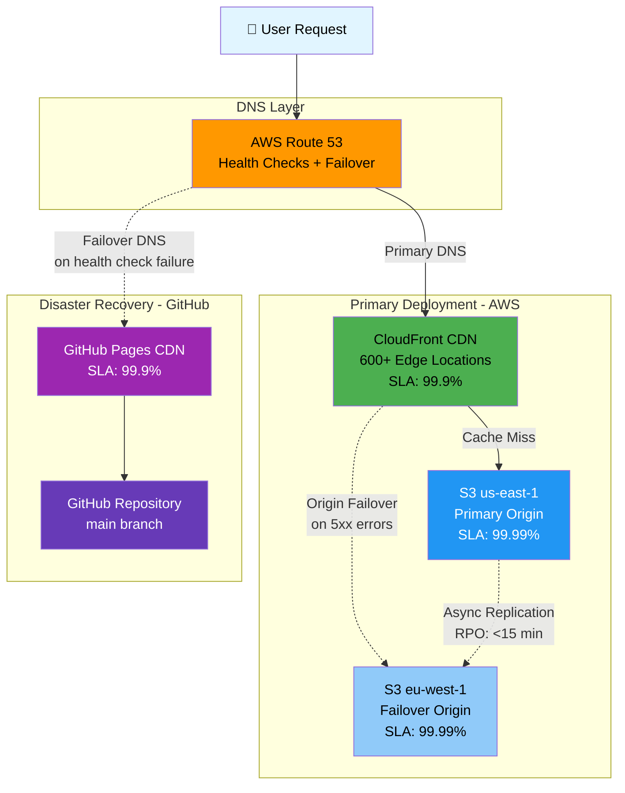
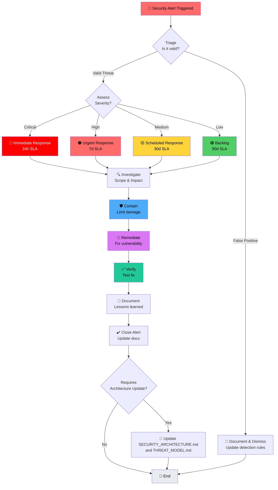
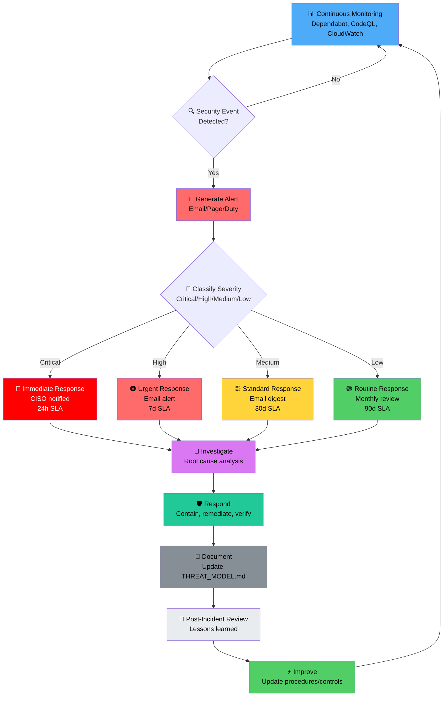
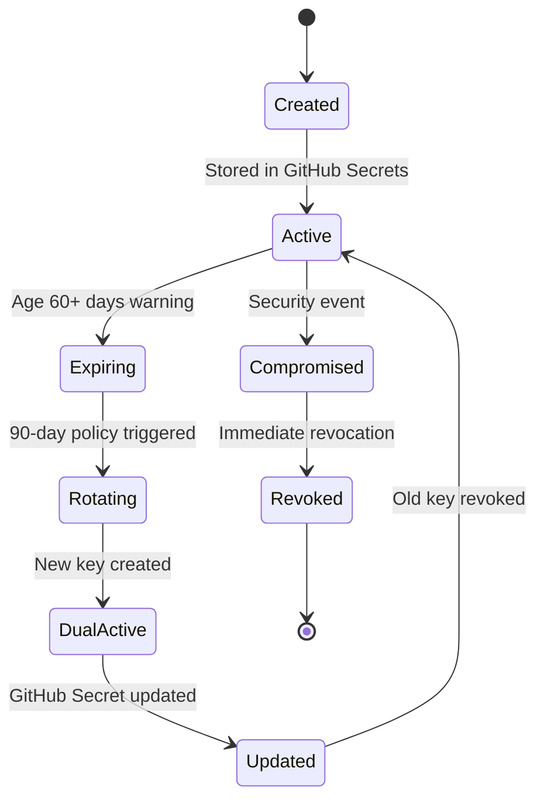
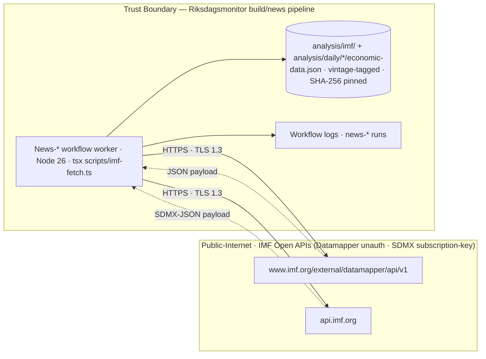
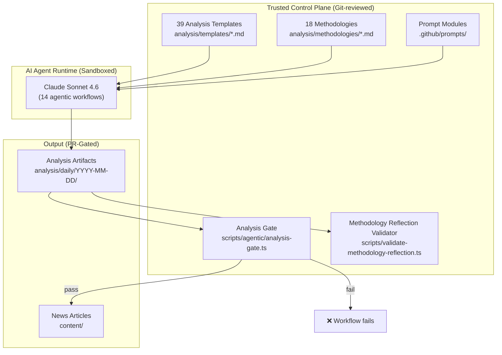
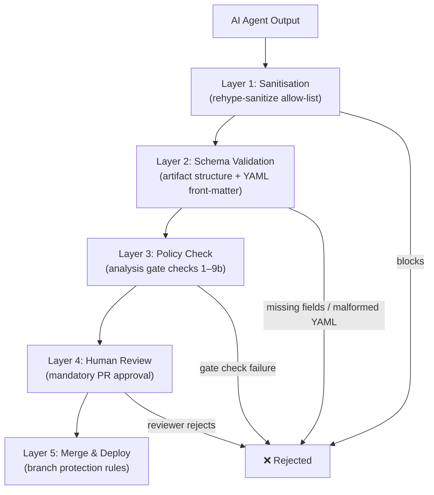

<p align="center">
  
</p>

<h1 align="center">🛡️ Riksdagsmonitor — Security Architecture</h1>

<p align="center">
  <strong>🔐 Defense-in-Depth Protection for Swedish Parliament Transparency</strong><br>
  <em>🎯 Comprehensive Security Framework for Political Intelligence Platform</em>
</p>

<p align="center">
  
  
  
  
  <a href="https://www.bestpractices.dev/projects/12069"></a>
</p>

**📋 Document Owner:** CEO | **📄 Version:** 2.4 | **📅 Last Updated:** 2026-05-06 (UTC)  
**🔄 Review Cycle:** Annual | **⏰ Next Review:** 2027-05-06  
**🏢 Owner:** Hack23 AB (Org.nr 5595347807) | **🏷️ Classification:** Public

---

## 📚 Related Architecture Documentation

| Document | Focus | Description |
|----------|-------|-------------|
| **[Security Architecture](SECURITY_ARCHITECTURE.md)** | 🛡️ Security | Current document — Defense-in-depth controls |
| [Threat Model](THREAT_MODEL.md) | 🎯 Threats | STRIDE/MITRE ATT&CK analysis |
| [Future Security Architecture](FUTURE_SECURITY_ARCHITECTURE.md) | 🚀 Security Roadmap | Planned security improvements |
| [Architecture](ARCHITECTURE.md) | 🏛️ C4 Models | System structure and components |
| [Data Model](DATA_MODEL.md) | 📊 Data | Entities, schemas, relationships |
| [Flowcharts](FLOWCHART.md) | 🔄 Processes | Process flows and pipelines |
| [State Diagrams](STATEDIAGRAM.md) | 🔄 Behavior | System state transitions |
| [Mindmaps](MINDMAP.md) | 🗺️ Concepts | Conceptual system maps |
| [SWOT Analysis](SWOT.md) | 💼 Strategy | Strategic position assessment |
| [Future Architecture](FUTURE_ARCHITECTURE.md) | 🚀 Architecture | Architectural evolution roadmap |
| [Future Data Model](FUTURE_DATA_MODEL.md) | 🚀 Data | Enhanced data architecture |
| [Future Flowcharts](FUTURE_FLOWCHART.md) | 🚀 Processes | Improved process workflows |
| [Future State Diagrams](FUTURE_STATEDIAGRAM.md) | 🚀 Behavior | Advanced state management |
| [Future Mindmaps](FUTURE_MINDMAP.md) | 🚀 Concepts | Capability expansion maps |
| [Future SWOT](FUTURE_SWOT.md) | 🚀 Strategy | Future strategic opportunities |
| [Workflows](WORKFLOWS.md) | 🔧 DevOps | CI/CD automation and pipelines |
| [CRA Assessment](CRA-ASSESSMENT.md) | ⚖️ Compliance | EU Cyber Resilience Act conformity |

### Hack23 ISMS Policy References

| Policy | Focus | Link |
|--------|-------|------|
| Secure Development Policy | SDLC security, architecture requirements | [Secure_Development_Policy.md](https://github.com/Hack23/ISMS-PUBLIC/blob/main/Secure_Development_Policy.md) |
| Open Source Policy | OSS governance, license compliance | [Open_Source_Policy.md](https://github.com/Hack23/ISMS-PUBLIC/blob/main/Open_Source_Policy.md) |
| CRA Conformity Assessment Process | CRA self-assessment template | [CRA_Conformity_Assessment_Process.md](https://github.com/Hack23/ISMS-PUBLIC/blob/main/CRA_Conformity_Assessment_Process.md) |
| Threat Modeling Policy | STRIDE/MITRE ATT&CK methodology | [Threat_Modeling.md](https://github.com/Hack23/ISMS-PUBLIC/blob/main/Threat_Modeling.md) |
| Classification Framework | CIA triad, RTO/RPO | [CLASSIFICATION.md](https://github.com/Hack23/ISMS-PUBLIC/blob/main/CLASSIFICATION.md) |

---

## 📋 Table of Contents

- [🎯 Executive Summary](#-executive-summary)
- [🔐 ISMS Policy Alignment](#-isms-policy-alignment)
- [1. 🏗️ System Overview](#1--system-overview)
  - [1.1 🎯 Purpose and Scope](#11--purpose-and-scope)
  - [1.2 🔐 AWS Security Controls](#12--aws-security-controls)
  - [1.3 Architecture Diagram](#13-architecture-diagram)
- [2. 🔐 Security Architecture Components](#2--security-architecture-components)
  - [2.1 Authentication & Access Control](#21-authentication--access-control)
  - [2.2 Authorization Model](#22-authorization-model)
  - [2.3 Data Security](#23-data-security)
  - [2.4 Network Security](#24-network-security)
  - [2.5 Application Security](#25-application-security)
  - [2.6 Monitoring & Logging](#26-monitoring--logging)
  - [2.7 Incident Response](#27-incident-response)
  - [2.8 Release Security & Supply Chain Protection](#28-release-security--supply-chain-protection)
- [3. 📋 Compliance Mapping](#3--compliance-mapping)
  - [3.1 ISO 27001:2022 Controls](#31-iso-270012022-controls)
  - [3.2 NIST CSF 2.0 Categories](#32-nist-csf-20-categories)
  - [3.3 CIS Controls v8.1](#33-cis-controls-v81)
- [4. 🛡️ Security Controls Summary](#4--security-controls-summary)
  - [4.1 Preventive Controls](#41-preventive-controls)
  - [4.2 Detective Controls](#42-detective-controls)
  - [4.3 Corrective Controls](#43-corrective-controls)
- [5. 📝 Security Assumptions and Constraints](#5--security-assumptions-and-constraints)
  - [5.1 Assumptions](#51-assumptions)
  - [5.2 Constraints](#52-constraints)
- [6. ⚠️ Risk Assessment](#6--risk-assessment)
  - [6.1 Residual Risks](#61-residual-risks)
  - [6.2 Accepted Risks](#62-accepted-risks)
- [7. 🏛️ Security Governance](#7--security-governance)
  - [7.1 Roles and Responsibilities](#71-roles-and-responsibilities)
  - [7.2 Review and Update Schedule](#72-review-and-update-schedule)
  - [7.3 Related Documentation](#73-related-documentation)
- [8. ✅ Approval](#8--approval)
- [🛡️ Defense-in-Depth Strategy](#-defense-in-depth-strategy)
- [📜 Data Integrity & Auditing](#-data-integrity--auditing)
- [🔍 Security Event Monitoring](#-security-event-monitoring)
- [🏗️ High Availability Design](#-high-availability-design)
- [🕵️ Threat Detection & Investigation](#-threat-detection--investigation)
- [🔎 Vulnerability Management](#-vulnerability-management)
- [🤖 Automated Security Operations](#-automated-security-operations)
- [⚡ Resilience & Operational Readiness](#-resilience--operational-readiness)
- [📋 Configuration & Compliance Management](#-configuration--compliance-management)
- [📊 Monitoring & Analytics](#-monitoring--analytics)
- [🔄 Security Operations](#-security-operations)
- [💰 Security Investment](#-security-investment)
- [📝 Conclusion](#-conclusion)
- [📋 Document Control](#-document-control)

---

## 🎯 Executive Summary

Riksdagsmonitor is a web platform providing Swedish Parliament intelligence and election monitoring capabilities. This document outlines the security architecture aligned with Hack23 AB's Information Security Management System (ISMS), [Classification Framework](https://github.com/Hack23/ISMS-PUBLIC/blob/main/CLASSIFICATION.md), and compliance frameworks (ISO 27001, NIST CSF 2.0, CIS Controls v8.1).

**Security Posture:** Defense-in-depth architecture with dual-deployment (AWS CloudFront/S3 multi-region primary, GitHub Pages disaster recovery), HTTPS-only access, comprehensive CI/CD security controls, and SLSA Build Provenance attestations.

**For complete CI/CD workflow documentation, see [WORKFLOWS.md](WORKFLOWS.md).**

---

## 🔐 ISMS Policy Alignment

Riksdagsmonitor security architecture is governed by and aligned with Hack23 AB's comprehensive Information Security Management System (ISMS). This ensures consistent security practices across all organizational assets.

### **📜 Governing Policies**

| Policy Document | Purpose | Application to Riksdagsmonitor |
|----------------|---------|-------------------------------|
| **[Information Security Policy](https://github.com/Hack23/ISMS-PUBLIC/blob/main/Information_Security_Policy.md)** | Organization-wide security governance | Establishes security objectives, risk management framework, and accountability |
| **[Secure Development Policy](https://github.com/Hack23/ISMS-PUBLIC/blob/main/Secure_Development_Policy.md)** | Secure SDLC requirements | Mandates security documentation (SECURITY_ARCHITECTURE.md, THREAT_MODEL.md, FUTURE_SECURITY_ARCHITECTURE.md), code scanning, vulnerability management |
| **[Classification Framework](https://github.com/Hack23/ISMS-PUBLIC/blob/main/CLASSIFICATION.md)** | Information classification scheme | Defines handling requirements for Public/Internal/Confidential/Restricted data (see §2.3) |
| **[Incident Response Policy](https://github.com/Hack23/ISMS-PUBLIC/blob/main/Incident_Response_Policy.md)** | Security incident procedures | Provides escalation paths, response team structure, lessons learned process (see §2.7) |
| **[Access Control Policy](https://github.com/Hack23/ISMS-PUBLIC/blob/main/Access_Control_Policy.md)** | Identity and access management | Defines MFA requirements, least privilege principles, access review cycles (see §2.1) |

### **🎯 Policy Compliance Summary**

- ✅ **Security Documentation:** Complete (SECURITY_ARCHITECTURE.md, THREAT_MODEL.md, FUTURE_SECURITY_ARCHITECTURE.md)
- ✅ **Code Scanning:** CodeQL, Dependabot, Secret Scanning enabled
- ✅ **Access Controls:** MFA enforced, SSH keys, GPG signing mandatory
- ✅ **Vulnerability Management:** SLAs defined (Critical: 24h, High: 7d, Medium: 30d, Low: 90d)
- ✅ **Incident Response:** Documented procedures with escalation to CISO
- ✅ **Data Classification:** Information classification scheme applied (§2.3)
- ✅ **Compliance Frameworks:** ISO 27001:2022, NIST CSF 2.0, CIS Controls v8.1 mapped (§3)

**Policy Review Cycle:** All referenced policies reviewed annually by CISO. Next ISMS policy review: 2027-01-31.

## 1. 🏗️ System Overview

### 1.1 🎯 Purpose and Scope

**Purpose:**
- Monitor Swedish Riksdag political activity
- Provide real-time intelligence on 349 MPs
- Track coalition stability and election predictions
- Deliver 9 dashboard sections with CIA platform data (4 functional: committee, coalition, election-cycle, risk/anomaly; 5 placeholders: party, seasonal, pre-election, ministry, anomaly detection)
- OSINT-powered political transparency

**Scope:**
- Web application with HTML/CSS/JavaScript (Chart.js, D3.js)
- 9 dashboard sections (4 functional with 150KB+ JavaScript, 5 placeholders with HTML structure only)
- Multi-language support (14 languages)
- CIA data integration with local CSV caching
- AWS CloudFront + S3 hosting infrastructure (Primary)
- GitHub Pages hosting infrastructure (Disaster Recovery)
- AWS Route 53 DNS with health checks and automatic failover

### 1.2 🔐 AWS Security Controls

**AWS Infrastructure Security (Primary Deployment):**

- **🔑 Authentication & Access Control:**
  - GitHub Actions OIDC integration for AWS authentication (ephemeral credentials)
  - No long-lived AWS access keys or IAM user credentials stored
  - Least-privilege IAM roles with time-limited session tokens
  - S3 bucket policies restrict access to CloudFront Origin Access Identity only

- **📊 Audit Logging & Monitoring:**
  - AWS CloudTrail enabled for all API activity logging
  - 90-day log retention in dedicated S3 audit bucket
  - CloudWatch metrics for S3, CloudFront, and Route 53
  - Real-time alerting on security events and anomalies

- **🔒 Data Protection:**
  - S3 server-side encryption at rest (AES-256)
  - S3 bucket versioning enabled for rollback capability
  - Cross-region replication (typically within minutes) (us-east-1 → eu-west-1)
  - TLS 1.3 encryption in transit via CloudFront

- **🛡️ DDoS & Threat Protection:**
  - AWS Shield Standard (automatic DDoS protection)
  - CloudFront geographic restrictions capability
  - Planned request rate limiting via AWS WAF rate-based rules associated with CloudFront
  - AWS Web Application Firewall (WAF) planned for advanced application-layer threat protection and rate limiting

### 1.3 Architecture Diagram

```mermaid
graph TB
    User[User Browser]
    Route53[AWS Route 53<br/>DNS + Health Checks]
    
    subgraph "Primary: AWS Infrastructure"
        CF[CloudFront CDN<br/>600+ Edge Locations]
        S3US[S3 Bucket us-east-1<br/>Primary Storage + Versioning]
        S3EU[S3 Bucket eu-west-1<br/>Cross-region Replica<br/>Active Failover Origin]
    end
    
    subgraph "Disaster Recovery: GitHub"
        GHCDN[GitHub Pages CDN<br/>Standby Deployment]
    end
    
    subgraph "GitHub Infrastructure"
        GitHubRepo[GitHub Repository<br/>main branch]
        Actions[GitHub Actions<br/>CI/CD Dual Deploy]
        Security[Security Scanning<br/>Dependabot, CodeQL, Secrets]
    end
    
    CIA[CIA Platform<br/>www.hack23.com/cia]
    
    User -->|DNS Query| Route53
    Route53 -->|DNS Response: CloudFront Primary| User
    Route53 -.->|DNS Response: GitHub Pages on Failover| User
    User -->|HTTPS Only TLS 1.3| CF
    User -.->|HTTPS Only TLS 1.3 (DR)| GHCDN
    
    CF -->|Cache Miss| S3US
    CF -.->|Origin Failover on 5xx errors| S3EU
    S3US -->|Async Cross-Region Replication (&lt;15 min RPO)| S3EU
    
    User -->|External Links| CIA
    
    GHCDN --> GitHubRepo
    Actions -->|Deploy| S3US
    Actions -->|Deploy| GitHubRepo
    Security -->|Monitor| GitHubRepo
    
    style User fill:#e1f5ff,color:#000000
    style Route53 fill:#ff9800,color:#000000
    style CF fill:#4caf50,color:#000000
    style S3US fill:#2196f3,color:#ffffff
    style GHCDN fill:#90caf9,color:#000000
    style Actions fill:#ff9800,color:#000000
    style Security fill:#f44336,color:#ffffff
    style CIA fill:#9c27b0,color:#ffffff
```

## 2. 🔐 Security Architecture Components

### 2.1 Authentication & Access Control

**Public Access Model:**
- **No Authentication Required:** Static public website accessible to all
- **Content Management:** GitHub repository access controlled via GitHub authentication
  - MFA required for all contributors
  - SSH keys with passphrase protection
  - GPG signing required for commits
  - Branch protection rules enforced

**Control Mapping:**
- ISO 27001: A.9.2 User Access Management
- NIST CSF 2.0: PR.AC-1 (Identities and credentials managed)
- CIS Controls v8.1: 5.1 (Establish and Maintain an Inventory of Accounts)

### 2.2 Authorization Model

**GitHub Repository Permissions:**
- **Admin:** Repository owners (Hack23 organization owners)
- **Write:** Approved contributors with MFA
- **Read:** Public access (website viewing)

**CI/CD Pipeline Permissions:**
- Least privilege GitHub Actions permissions
- Scoped GITHUB_TOKEN for workflow operations
- Secrets management via GitHub Secrets

**Control Mapping:**
- ISO 27001: A.9.4 System and Application Access Control
- NIST CSF 2.0: PR.AC-4 (Access permissions managed)
- CIS Controls v8.1: 6.8 (Define and Maintain Role-Based Access Control)

### 2.3 Data Security

**Information Classification:**

Following Hack23 AB ISMS information classification policy:

| Classification | Data Types | Handling Requirements | Storage / Access Method |
|----------------|-----------|----------------------|------------------------|
| 🟢 **Public** | Website content, Swedish Riksdag open data, documentation | No restrictions, TLS 1.3 in transit | GitHub repository, AWS S3, GitHub Pages (CDN) |
| 🟡 **Internal** | GitHub Actions secrets, AWS credentials, deployment configs | Encrypted at rest, MFA access, least privilege | GitHub Secrets, AWS IAM (ephemeral STS/OIDC) |
| 🟠 **Confidential** | Not applicable | N/A | N/A |
| 🔴 **Restricted** | Not applicable | N/A | N/A |

**Data Inventory:**
- **Public Data:** 
  - 14-language website (HTML/CSS)
  - Swedish Parliament data (349 MPs, 50+ years)
  - Election statistics, voting records
  - Government budget data
  - All source code and documentation
- **Internal Data:**
  - GitHub repository and Actions access tokens (if used, e.g., optional PATs for local tooling)
  - AWS IAM credentials (ephemeral via OIDC)
  - GitHub Actions workflow secrets
- **No Sensitive End-User Data:**
  - ❌ No end-user accounts or authentication features
  - ❌ No collection of non-public personal data from site users
  - ⚠️ Public personal data about Swedish public officials (e.g., names, person identifiers, roles) from Riksdag open data and cia-data datasets
    - **Information classification:** 🟢 Public (openly available data)
    - **Privacy classification:** Personal data – public-official (GDPR/PII handling still applies despite public availability)

**Data Protection Controls:**

**In Transit:**
- TLS 1.3 encryption (AWS CloudFront + GitHub Pages)
- HTTPS-only access enforced
- HSTS headers configured (max-age=31536000)
- Certificate transparency monitoring

**At Rest:**
- AWS S3 server-side encryption (AES-256)
- GitHub repository encryption at rest
- GitHub Secrets encryption (Libsodium sealed boxes)
- Immutable Git history for audit trail
- S3 versioning enabled for rollback capability

**Access Controls:**
- Public data: No authentication (intentionally public)
- Internal data: GitHub MFA, SSH keys, GPG signing
- AWS credentials: Ephemeral OIDC tokens only (no long-lived keys)
- Least privilege IAM roles

**Data Lifecycle:**
- **Creation:** Git commits with GPG signing
- **Storage:** GitHub + AWS S3 with versioning
- **Access:** TLS 1.3 encrypted channels only
- **Retention:** Indefinite (public data), 90 days (AWS CloudTrail logs)
- **Deletion:** Git history retained, S3 versioning for recovery

**Control Mapping:**
- ISO 27001: A.5.10 (Acceptable use - data classification), A.10.1 (Cryptographic controls)
- NIST CSF 2.0: PR.DS-1 (Data-at-rest protected), PR.DS-2 (Data-in-transit protected)
- CIS Controls v8.1: 3.1 (Establish data management), 3.10 (Encrypt data in transit)

### 2.4 Network Security

**AWS CloudFront Infrastructure (Primary):**
- **DDoS Protection:** AWS Shield Standard (automatic protection)
- **CDN:** 600+ global edge locations
- **WAF:** Available for application-layer protection (roadmap: 2027 Q2)
- **TLS:** CloudFront managed certificates with TLS 1.3
- **Firewall:** AWS infrastructure-level protection

**GitHub Pages Infrastructure (Disaster Recovery):**
- **DDoS Protection:** GitHub infrastructure-level protection
- **CDN:** GitHub Pages CDN for global distribution
- **Firewall:** GitHub-managed infrastructure firewall

**Security Headers (Target Configuration - AWS CloudFront Response Headers Policy):**
```
Content-Security-Policy: default-src 'self'; script-src 'self' 'unsafe-inline'; style-src 'self' 'unsafe-inline' fonts.googleapis.com; font-src 'self' fonts.gstatic.com; img-src 'self' data: https:; connect-src 'self' https://raw.githubusercontent.com
X-Content-Type-Options: nosniff
X-Frame-Options: DENY
X-XSS-Protection: 1; mode=block
Strict-Transport-Security: max-age=31536000; includeSubDomains
Referrer-Policy: strict-origin-when-cross-origin
Permissions-Policy: geolocation=(), microphone=(), camera=()
```

**Note:** CSP includes `'unsafe-inline'` for Chart.js/D3.js inline styles and large inline dashboard script (946 lines). The `connect-src` directive includes `https://raw.githubusercontent.com` to allow fetching CIA CSV data from the cia repository. Security headers are configured via AWS CloudFront Response Headers Policy for the primary deployment. GitHub Pages disaster recovery inherits default GitHub Pages security headers. Future enhancement: nonce-based CSP for stricter inline script control (roadmap: 2027). Chart.js, D3.js, chartjs-plugin-annotation **and Mermaid** are hosted locally on CloudFront (`js/lib/`) rather than via external CDN, eliminating external script dependencies (CI-enforced by [`tests/no-external-cdn.test.ts`](tests/no-external-cdn.test.ts)).

**Control Mapping:**
- ISO 27001: A.13.1 Network Security Management
- NIST CSF 2.0: PR.AC-5 (Network integrity protected)
- CIS Controls v8.1: 13.1 (Centralize Security Event Alerting)

### 2.5 Application Security

**Web Application Security:**
- **Client-Side JavaScript:** Chart.js and D3.js for interactive dashboards
  - 3 external JS files loaded: `scripts/coalition-dashboard.js` (33KB), `scripts/committees-dashboard.js` (39KB), `js/election-cycle-dashboard.js` (46KB) ≈118KB
  - 1 large inline script (946 lines, ~32KB) handling risk dashboard only (includes one anomaly chart within risk dashboard)
  - 5 placeholder dashboard sections with HTML structure but no JavaScript initialization (future implementation):
    - Party Performance Dashboard
    - Seasonal Patterns Dashboard
    - Pre-Election Monitoring Dashboard
    - Ministry Dashboard
    - Anomaly Detection Dashboard (standalone section with timeline/heatmap/distribution charts - distinct from single anomaly chart in risk dashboard)
  - Total: ~150KB active JavaScript code (118KB external + 32KB inline; source size, transfer size smaller when compressed)
- **XSS Mitigation:** Content Security Policy (CSP) headers with script-src restrictions
- **Input Sanitization:** CIA CSV data is subjected to best-effort, non-blocking schema validation during CI/data-integration workflows (e.g., `.github/workflows/validate-cia-data.yml`); validation failures currently surface as warnings rather than blocking publication, and client-side code then parses this CSV (D3 CSV utilities/custom parsers) and applies basic sanity checks prior to rendering via Chart.js/D3.js
- **External Dependencies:**
  - Chart.js v4.4.1 (hosted locally on CloudFront/S3 at js/lib/chart.umd.4.4.1.js)
  - chartjs-plugin-annotation v3.0.1 (hosted locally on CloudFront/S3 at js/lib/chartjs-plugin-annotation.3.0.1.min.js)
  - chartjs-adapter-date-fns v3.0.0 bundle (hosted locally on CloudFront/S3 at js/lib/chartjs-adapter-date-fns.3.0.0.bundle.min.js) - for time-series charts
  - D3.js v7.9.0 (hosted locally on CloudFront/S3 at js/lib/d3.7.9.0.min.js)
  - Papa Parse v5.5.3 (hosted locally on CloudFront/S3 at js/lib/papaparse.5.5.3.min.js) - for CSV parsing
  - Google Fonts (Inter, Orbitron, Share Tech Mono - via fonts.googleapis.com and fonts.gstatic.com CDN)
- **CIA Data Integration:** Fetches CSV data from `https://raw.githubusercontent.com/Hack23/cia/` that is subject to non-blocking CI schema validation checks in pre-processing (e.g., `.github/workflows/validate-cia-data.yml`), with local caching for performance; the browser consumes this dataset which may contain validation warnings
- **No User Input Processing:** Dashboards do not accept or process arbitrary user input; they display pre-processed CIA data generated upstream in CI/data pipelines that has passed non-blocking schema validation checks where configured
- **No Server-Side Code:** Static hosting eliminates injection vulnerabilities

**Dashboard Security:**
- **9 Dashboard Sections (4 functional, 5 placeholders):**

**Functional Dashboards (4):**
1. **Committee Dashboard** (`scripts/committees-dashboard.js` 39KB) ✅
2. **Coalition Dashboard** (`scripts/coalition-dashboard.js` 33KB) ✅
3. **Election Cycle Dashboard** (`js/election-cycle-dashboard.js` 46KB) ✅
4. **Risk Dashboard** (inline script ~32KB, includes one anomaly detection chart) ✅

**Placeholder Dashboard Sections (5 - HTML structure only, no JavaScript):**
5. **Party Performance Dashboard** - Canvas elements present, awaiting JS implementation
6. **Seasonal Patterns Dashboard** - Canvas elements present, awaiting JS implementation
7. **Pre-Election Monitoring Dashboard** - Canvas elements present, awaiting JS implementation
8. **Ministry Dashboard** - Canvas elements present, awaiting JS implementation
9. **Anomaly Detection Dashboard** - Standalone section with multiple canvas elements (anomaly-timeline-chart, zscore-distribution-chart, anomaly-type-chart, quarterly-frequency-chart), distinct from the single anomaly chart within risk dashboard, awaiting JS implementation

**Dependency Management:**
- Chart.js, D3.js, chartjs-plugin-annotation, chartjs-adapter-date-fns, and Papa Parse hosted locally on CloudFront/S3 (js/lib/); versions reviewed manually at least quarterly and after critical CVE disclosures
- Library file integrity can be verified via SHA-256 hashes if needed for deployment validation (not required for runtime as served from same origin)
- Dependabot configured for GitHub Actions workflows (`.github/dependabot.yml`) and automated dependency risk assessment for repository-managed components via GitHub dependency-review and Dependabot alerts
- Supply chain security scanning via CodeQL and OpenSSF Scorecards

**Control Mapping:**
- ISO 27001: A.14.2 Security in Development and Support
- NIST CSF 2.0: PR.IP-12 (A vulnerability management plan developed)
- CIS Controls v8.1: 16.1 (Establish and Maintain a Secure Application Development Process)

### 2.5.1 News Pipeline Sanitisation Chain

The news-generation pipeline (`scripts/aggregate-analysis.ts` → `scripts/render-articles.ts` → `scripts/render-lib/`) produces HTML articles from AI-authored markdown artifacts under `analysis/daily/$DATE/$SUB/`. The AI-authored markdown is an **untrusted input** from the perspective of the renderer; the sanitisation chain is therefore a primary output-encoding control for the platform.

#### Sanitisation chain (input → output trust boundary)

```
analysis/daily/$DATE/$SUB/*.md          (untrusted AI authored markdown)
           │
           ▼
gray-matter frontmatter extraction       (structural only — no HTML)
           │
           ▼
unified + remark-parse + remark-gfm      (markdown → MDAST)
           │
           ▼
remark-rehype + rehype-raw               (MDAST → HAST; raw HTML islands preserved)
           │
           ▼
rehype-sanitize  ◄─── TRUST BOUNDARY     (allow-list enforcement)
           │
           ▼
rehype-slug + rehype-autolink-headings   (stable anchors for TOC)
           │
           ▼
rehype-stringify                         (HAST → serialised HTML)
           │
           ▼
scripts/render-lib/chrome.ts             (JSON-LD NewsArticle, SEO, lang switcher)
           │
           ▼
news/$DATE-$SUB-{en,sv}.html             (trusted output)
```

#### `rehype-sanitize` allow-list

The sanitiser is configured with an explicit **allow-list** (schema) rather than a blocklist. Only these elements and attributes survive the boundary:

| Category | Allowed | Rationale |
|----------|---------|-----------|
| Block text | `p`, `h1`–`h6`, `blockquote`, `pre`, `hr` | Standard article structure |
| Inline text | `a[href|title|rel]`, `em`, `strong`, `code`, `del`, `sup`, `sub`, `mark` | Markdown inline semantics |
| Lists | `ul`, `ol`, `li` | Markdown lists |
| Tables | `table`, `thead`, `tbody`, `tr`, `th[scope]`, `td`, `caption` | GFM tables (accessibility-aware) |
| Images | `img[src|alt|title|width|height|loading]` | Referenced from within allow-listed URL schemes only |
| Figures | `figure`, `figcaption` | Diagram captions and accessible text equivalents |
| Disclosure | `details`, `summary` | Mermaid diagram source fallback (WCAG 2.1 AA text equivalent) |
| Extension | **`pre.mermaid`** | Client-side Mermaid rendering — see below |

URL-bearing attributes (`href`, `src`) are filtered to the following schemes: `http:`, `https:`, `mailto:`, plus `data:image/{png,jpeg,gif,webp,svg+xml}` for embedded images only. **Rejected**: `javascript:`, `vbscript:`, non-image `data:`, `file:`, `chrome:`, and all other URI schemes.

**Explicitly rejected elements** (removed without error so AI-authored content cannot escape the sandbox): `script`, `iframe`, `object`, `embed`, `form`, `input`, `button`, `style`, `link`, `meta`, `base`, `applet`, `frame`, `frameset`, and every `on*` event handler attribute.

#### Mermaid client-side rendering trust boundary

Mermaid diagrams are the only HTML extension permitted past the sanitiser. They are handled as follows:

1. **Source** — a ` ```mermaid ` fenced block in the `.md` artifact is passed through by `remark-parse` as a `code` node with `lang: mermaid`.
2. **Transform** — the renderer emits the node as `<pre class="mermaid">…source…</pre>` so the sanitiser's `pre[class|lang]` rule lets it through.
3. **Accessibility wrapping** — each Mermaid block is wrapped in `<figure>` with a `<figcaption>` and a `<details>`-wrapped plain-text fallback containing the source (WCAG 2.1 AA text equivalent).
4. **Render-time** — `scripts/render-lib/chrome.ts` conditionally injects `<script type="module" src="/js/lib/mermaid-init.mjs"></script>` *only* when at least one `<pre class="mermaid">` survived sanitisation.
5. **Runtime sandboxing** — `mermaid-init.mjs` imports Mermaid via native ESM dynamic `import()` and calls `mermaid.initialize({ startOnLoad: false, securityLevel: 'strict' })`. `securityLevel: 'strict'` disables Mermaid's own click-handler and interaction features, so a malicious Mermaid diagram cannot execute JavaScript even if the DSL is exploited.
6. **CSP** — the global Content-Security-Policy forbids `'unsafe-eval'`. Mermaid's strict-mode parser does not require `eval`; this has been validated and is documented in the deployment runbook.

The trust boundary is therefore: **AI → markdown → Mermaid DSL → SVG** — never AI → JavaScript.

#### GitHub-blob link rewriting (output-encoding control)

Relative markdown links inside aggregated artifacts (e.g. `[methodology](../methodologies/devils-advocate.md)`) would resolve against `news/` in the published output and 404. The aggregator rewrites every relative `.md`, `.json`, and `.html` link to an absolute `https://github.com/Hack23/riksdagsmonitor/blob/main/…` URL **before** the sanitiser sees them. This is an output-encoding control: it removes a broken-link class *and* pins every citation to a content-addressable GitHub blob URL that serves as the provenance chain.

#### Provenance manifest (tamper detection)

The aggregator emits a `.manifest.json` sibling to each `article.md` listing every source artifact consumed, with a SHA-256 digest:

```json
{
  "article": "analysis/daily/2026-04-24/propositions/article.md",
  "generated_at": "2026-04-24T04:12:31Z",
  "sources": [
    { "path": "analysis/daily/2026-04-24/propositions/executive-brief.md", "sha256": "…" },
    { "path": "analysis/daily/2026-04-24/propositions/synthesis.md",        "sha256": "…" },
    { "path": "analysis/methodologies/devils-advocate.md",                   "sha256": "…" }
  ]
}
```

The renderer emits the manifest contents into the `NewsArticle.citation[]` JSON-LD block, giving downstream consumers a cryptographic evidence chain: every claim in the HTML can be traced back to a specific SHA-256 of a specific markdown artifact at a specific timestamp.

**Control Mapping:**
- ISO 27001:2022 **A.8.28** (Secure coding) — allow-list sanitisation, explicit trust boundary, output encoding
- ISO 27001:2022 **A.8.25** (Secure development life cycle) — sanitiser schema is version-controlled and covered by dedicated unit tests
- NIST CSF 2.0 **PR.DS-6** (Integrity checking mechanisms) — SHA-256 manifest; drift detection at render time
- NIST CSF 2.0 **PR.PS-06** (Secure software development practices) — CI gate on sanitisation drops
- CIS Controls v8.1 **16.10** (Apply Secure Design Principles in Application Architectures) — input validation and output encoding at every trust boundary
- CIS Controls v8.1 **16.11** (Leverage Vetted Modules or Services) — `unified`/`remark`/`rehype`/`gray-matter` are vetted, pinned, and Dependabot-grouped

### 2.6 Monitoring & Logging

**Security Monitoring:**
- **GitHub Security Features:**
  - Dependabot alerts for dependency vulnerabilities
  - Secret scanning for exposed credentials
  - Code scanning (CodeQL) for security issues
  - Security advisories tracking

**Audit Logging:**
- **Git Commit History:** Immutable audit trail of all changes
- **GitHub Actions Logs:** CI/CD pipeline execution logs
- **GitHub Audit Log:** Organization-level access and change logs

**Alert Mechanisms:**
- GitHub Security Advisories
- Email notifications for security events
- Pull request checks for quality gates

**Control Mapping:**
- ISO 27001: A.12.4 Logging and Monitoring
- NIST CSF 2.0: DE.CM-1 (The network is monitored)
- CIS Controls v8.1: 8.2 (Collect Audit Logs)

### 2.7 Incident Response

**Security Incident Procedures:**
1. **Detection:** GitHub security alerts, Dependabot, manual reporting
2. **Containment:** Disable GitHub Pages, revert commits if needed
3. **Investigation:** Review Git history, GitHub Actions logs
4. **Remediation:** Apply security patches, update dependencies
5. **Recovery:** Re-deploy verified secure version
6. **Lessons Learned:** Update SECURITY_ARCHITECTURE.md and THREAT_MODEL.md

**Incident Response Team:**
- **Security Lead:** James Pether Sörling (CISSP, CISM)
- **Repository Owners:** Hack23 organization admins
- **Escalation:** Follow Hack23 ISMS Incident Response Plan

**Control Mapping:**
- ISO 27001: A.16.1 Management of Information Security Incidents
- NIST CSF 2.0: RS.CO-1 (Personnel know their roles and order of operations)
- CIS Controls v8.1: 17.1 (Designate Personnel to Manage Incident Handling)

### 2.8 Release Security & Supply Chain Protection

**SLSA Build Provenance Attestations:**
- **Framework:** SLSA (Supply Chain Levels for Software Artifacts) Level 2+
- **Implementation:** GitHub Actions Attestations (`actions/attest-build-provenance@v3.2.0`)
- **Purpose:** Cryptographically prove artifacts were built by trusted CI/CD pipeline
- **Verification:** `gh attestation verify riksdagsmonitor-vX.Y.Z.zip -R Hack23/riksdagsmonitor`
- **Format:** in-toto attestations (*.intoto.jsonl)

**Software Bill of Materials (SBOM):**
- **Format:** SPDX (Software Package Data Exchange)
- **Generator:** Anchore SBOM Action (`anchore/sbom-action@v0.22.2`)
- **Contents:** Complete dependency inventory with versions and licenses
- **Attestation:** SBOM also cryptographically signed (`actions/attest-sbom@v3.0.0`)
- **Purpose:** Vulnerability tracking, license compliance, supply chain transparency
- **External MCP supplement:** `package.json` `x-external-mcp` field records MCP servers outside the npm graph (Python, Docker, HTTP). It is currently empty — all economic-data clients (World Bank, SCB, IMF) ship as npm TypeScript (`scripts/world-bank-client.ts`, `scripts/scb-client.ts`, `scripts/imf-client.ts`) and are fully covered by the standard SPDX SBOM; see `THREAT_MODEL.md` TB-6a for the IMF client's threat model.

**External Data Providers (parity across the three primary economic sources):**

| Provider | Integration | Transport / Hosts | Classification | Controls |
|----------|-------------|-------------------|----------------|----------|
| **SCB (Statistics Sweden)** | `scb-mcp` (local `@jarib/pxweb-mcp@2.0.0`) | HTTPS (TLS 1.3) → `api.scb.se/OV0104/v2beta` | Public | Egress allowlist; MCP tool allow-list; graceful fallback; no auth |
| **World Bank** | `world-bank-mcp` (local `worldbank-mcp@1.0.1`) + `scripts/world-bank-client.ts` | HTTPS (TLS 1.3) → `data.worldbank.org`, `api.worldbank.org` | Public | Egress allowlist; npm SBOM coverage; response schema validation; no auth |
| **IMF** *(new — ADR 0001)* | **Pure-TypeScript client** `scripts/imf-client.ts` (*not* MCP) | HTTPS (TLS 1.3) → `data.imf.org`, `api.imf.org`, `www.imf.org` (Datamapper JSON + SDMX 3.0) | Public | Egress allowlist; npm SBOM coverage; `DatamapperResponse` schema + finite-numeric + year parse-guard validation; `.meta.json` tamper-evident cache sidecars under `analysis/data/imf/`; 3× exponential back-off for rate-limit; graceful fallback; no auth |

All three providers share: GitHub-runner root CA trust anchors, public-data classification, no API key, and optional-enrichment semantics (failure never blocks article generation or site availability).


**Release Pipeline Security (3-job workflow):**

1. **Prepare Job (15-20min):**
   - Run comprehensive test suite (unit + E2E)
   - Generate all documentation (API, coverage, E2E reports, dependencies)
   - Deploy docs to GitHub Pages
   - Security: Read-only permissions, harden-runner enabled

2. **Build Job (5min):**
   - Build production artifacts
   - Generate SBOM in SPDX format
   - Create SLSA Build Provenance attestation
   - Create SBOM attestation
   - Generate SHA-256 checksums
   - Security: Minimal write permissions (contents: write, attestations: write, id-token: write)

3. **Release Job (5-10min):**
   - Create GitHub Release with all artifacts
   - Deploy to AWS S3/CloudFront (OIDC authentication)
   - Deploy to GitHub Pages (disaster recovery)
   - Invalidate CloudFront cache
   - Security: OIDC for AWS (no long-lived credentials), least-privilege IAM roles

**Release Artifacts (per version):**
- `riksdagsmonitor-vX.Y.Z.zip` - Production build
- `riksdagsmonitor-vX.Y.Z.zip.sha256` - Integrity checksum
- `riksdagsmonitor-vX.Y.Z.spdx.json` - SBOM
- `riksdagsmonitor-vX.Y.Z.zip.intoto.jsonl` - Build provenance attestation
- `riksdagsmonitor-vX.Y.Z.spdx.json.intoto.jsonl` - SBOM attestation

**Documentation as Code:**
All technical reports automatically generated and committed to `docs/` on each release:
- `docs/api/` - JSDoc API documentation
- `docs/coverage/` - Vitest test coverage (HTML + lcov)
- `docs/test-results/` - Vitest test results (JSON + HTML)
- `docs/cypress/` - Cypress E2E test reports
- `docs/dependencies/` - npm dependency tree (JSON + TXT)
- `docs/index.html` - Documentation hub (cyberpunk-themed)

**Verification Procedures:**
```bash
# Verify build provenance attestation
gh attestation verify riksdagsmonitor-vX.Y.Z.zip -R Hack23/riksdagsmonitor

# Verify SBOM attestation
gh attestation verify riksdagsmonitor-vX.Y.Z.spdx.json -R Hack23/riksdagsmonitor

# Verify artifact integrity
sha256sum -c riksdagsmonitor-vX.Y.Z.zip.sha256
```

**Control Mapping:**
- ISO 27001: A.8.30 (Secure coding), A.8.32 (Change management), A.14.2 (Security in development)
- NIST CSF 2.0: PR.DS-6 (Integrity verification mechanisms), ID.SC-3 (Supply chain risk assessment)
- CIS Controls v8.1: 16.6 (Application software security), 16.10 (Vulnerability remediation)

**For complete release process documentation, see [RELEASE_PROCESS.md](RELEASE_PROCESS.md) and [WORKFLOWS.md](WORKFLOWS.md#41-release-with-attestations).**

## 3. 📋 Compliance Mapping

### 3.1 ISO 27001:2022 Controls

| Control | Implementation | Status |
|---------|----------------|--------|
| A.8.2 | Information classification scheme, data inventory, handling controls | ✅ Implemented |
| A.9.2 | GitHub MFA, SSH keys, GPG signing | ✅ Implemented |
| A.9.4 | Repository permissions, least privilege | ✅ Implemented |
| A.10.1 | TLS 1.3, HTTPS-only, encryption at rest | ✅ Implemented |
| A.12.4 | Git history, GitHub audit logs, AWS CloudTrail | ✅ Implemented |
| A.13.1 | AWS infrastructure, security headers | ✅ Implemented |
| A.14.2 | Dependabot, CodeQL scanning | ✅ Implemented |
| A.16.1 | Incident response procedures | ✅ Implemented |

### 3.2 NIST CSF 2.0 Categories

| Function | Category | Implementation |
|----------|----------|----------------|
| GOVERN | Asset Management | Information classification scheme, data inventory |
| IDENTIFY | Asset Management | GitHub repository, static assets, data sources |
| PROTECT | Access Control | GitHub authentication, MFA, AWS OIDC |
| PROTECT | Data Security | TLS 1.3, HTTPS-only, encryption at rest |
| DETECT | Security Monitoring | Dependabot, CodeQL, secret scanning |
| RESPOND | Incident Response | Documented procedures, escalation paths |
| RECOVER | Recovery Planning | Git rollback, S3 versioning, multi-region replication |

### 3.3 CIS Controls v8.1

| IG | Control | Implementation |
|----|---------|----------------|
| IG1 | 3.1 Establish Data Management | Information classification policy, data inventory |
| IG1 | 3.10 Encrypt Data in Transit | TLS 1.3, HTTPS-only |
| IG1 | 5.1 Account Inventory | GitHub organization audit |
| IG1 | 8.2 Collect Audit Logs | Git history, GitHub Actions logs, AWS CloudTrail |
| IG2 | 6.8 Role-Based Access Control | GitHub repository permissions, AWS IAM |
| IG2 | 13.1 Security Event Alerting | GitHub security alerts, AWS CloudWatch |
| IG2 | 16.1 Secure Development | Static site with reduced injection surface; mitigated via CSP/SRI/safe DOM handling; secure CI/CD |

## 4. 🛡️ Security Controls Summary

### 4.1 Preventive Controls

1. **Access Control:**
   - GitHub MFA requirement
   - SSH key authentication with passphrase
   - GPG commit signing
   - Branch protection rules
   - AWS OIDC authentication (no long-lived credentials)

2. **Network Security:**
   - HTTPS-only access (TLS 1.3)
   - Security headers (CSP, HSTS, X-Frame-Options, Permissions-Policy)
   - AWS CloudFront DDoS protection (AWS Shield Standard)
   - Route 53 health checks and automatic failover
   - GitHub infrastructure DDoS protection (DR)

3. **Development Security:**
   - HTML/CSS/JavaScript with Chart.js and D3.js
   - CSP headers with SRI for CDN resources
   - No user input processing (display CIA data only)
   - Dependency scanning via GitHub Dependabot alerts
   - Code quality checks in CI/CD (HTMLHint, linkinator)
   - CIA data validation against JSON schemas

### 4.2 Detective Controls

1. **Security Monitoring:**
   - Dependabot vulnerability alerts
   - Secret scanning
   - CodeQL static analysis
   - GitHub audit logs

2. **Quality Checks:**
   - HTML validation (HTMLHint)
   - Link checking (linkinator)
   - Automated CI/CD pipeline checks

### 4.3 Corrective Controls

1. **Incident Response:**
   - Documented procedures
   - Git rollback capability
   - Rapid re-deployment via GitHub Actions

2. **Patch Management:**
   - Dependabot automatic updates
   - Rapid deployment via GitHub Actions
   - Version control for rollback

## 5. 📝 Security Assumptions and Constraints

### 5.1 Assumptions

1. **AWS Infrastructure:** Trusted cloud provider with robust security
2. **GitHub Infrastructure:** Trusted cloud provider with robust security (DR)
3. **Client-Side Security:** Chart.js/D3.js libraries are secure, maintained, and hosted locally on CloudFront
4. **CloudFront Security:** AWS CloudFront is trusted for static asset delivery with 99.9% SLA
5. **Public Data:** All content is public information (Swedish Riksdag open data)
6. **External Dependencies:** CIA platform (www.hack23.com/cia) maintains its own security
7. **Browser Security:** Users have modern browsers with JavaScript enabled

### 5.2 Constraints

1. **AWS Infrastructure Limitations:**
   - S3 static website limitations (no server-side code execution)
   - CloudFront caching behavior (potential stale content)
   - Cost constraints for high traffic scenarios

2. **GitHub Pages Limitations (DR):**
   - No server-side code execution
   - No database access
   - Limited customization of HTTP headers
   - Fixed infrastructure (cannot modify underlying OS)

3. **Client-Side JavaScript Limitations:**
   - Requires JavaScript enabled in browser
   - CSP `'unsafe-inline'` needed for Chart.js/D3.js
   - Browser compatibility requirements (ES6+)
   - Limited control over client execution environment

## 6. ⚠️ Risk Assessment

### 6.1 Residual Risks

| Risk | Likelihood | Impact | Mitigation |
|------|-----------|--------|------------|
| AWS CloudFront/S3 Outage | Low | Medium | GitHub Pages DR, documented failover |
| GitHub Platform Outage (DR) | Low | Low | AWS primary handles traffic |
| DDoS Attack on AWS | Low | Low | AWS Shield Standard, CloudFront protection |
| XSS via Chart.js/D3.js | Low | Medium | CSP headers, locally-hosted libraries (no external CDN), quarterly version reviews |
| Compromised GitHub Account | Low | High | MFA, SSH keys, GPG signing |
| Chart.js/D3.js Vulnerability | Medium | Medium | Locally-hosted libraries with quarterly/CVE version reviews, deployment-time integrity verification, rapid version updates |
| CIA Data Injection | Low | Medium | Schema validation, local CSV caching |
| Content Defacement | Low | Medium | Git rollback, branch protection, dual deployment |
| DNS Hijacking via Route 53 | Very Low | High | DNSSEC (planned), IAM least privilege |

### 6.2 Accepted Risks

1. **Client-Side JavaScript:** Acceptable for interactive dashboards with CSP and SRI
2. **AWS Platform Dependency:** Acceptable given AWS's security posture and GitHub Pages DR
3. **GitHub Platform Dependency (DR):** Acceptable with AWS as primary
4. **External CIA Platform Dependency:** Acceptable with documented availability in THREAT_MODEL.md
5. **CSP 'unsafe-inline':** Acceptable for Chart.js/D3.js dashboard rendering (future: nonce-based CSP)

## 7. 🏛️ Security Governance

### 7.1 Roles and Responsibilities

| Role | Responsibility |
|------|----------------|
| Security Architect | Overall security architecture and compliance |
| Repository Owners | Access control, security monitoring |
| Contributors | Secure coding practices, MFA compliance |
| CISO (James Pether Sörling) | ISMS oversight, incident escalation |

### 7.2 Review and Update Schedule

- **Security Architecture Review:** Annual or after major changes
- **Threat Model Update:** Quarterly or after incidents
- **Dependency Updates:** Automated via Dependabot (weekly)
- **Access Control Review:** Quarterly

### 7.3 Related Documentation

- [Hack23 ISMS](https://github.com/Hack23/ISMS)
- [Secure Development Policy](https://github.com/Hack23/ISMS/blob/main/Secure_Development_Policy.md)
- [THREAT_MODEL.md](./THREAT_MODEL.md) - Riksdags Monitor threat analysis
- [Information Security Policy](https://github.com/Hack23/ISMS-PUBLIC/blob/main/Information_Security_Policy.md)

## 8. ✅ Approval

| Role | Name | Date | Signature |
|------|------|------|-----------|
| Security Architect | James Pether Sörling, CISSP, CISM | 2026-02-10 | [Digital Signature] |
| Repository Owner | Hack23 AB | 2026-02-10 | [Approved via Git Commit] |

---

---

## 🛡️ Defense-in-Depth Strategy

Riksdagsmonitor implements a comprehensive defense-in-depth security strategy with six overlapping layers of protection. Each layer provides independent security controls, ensuring that compromise of a single layer does not result in complete system failure.

### **Security Layers**

```mermaid
graph TB
    subgraph "Layer 6: Monitoring & Response"
        L6A[GitHub Security Alerts]
        L6B[AWS CloudWatch]
        L6C[Dependabot Monitoring]
        L6D[Incident Response Team]
    end
    
    subgraph "Layer 5: CI/CD Security"
        L5A[CodeQL SAST]
        L5B[Dependabot Updates]
        L5C[Secret Scanning]
        L5D[SLSA Attestations]
        L5E[step-security/harden-runner]
    end
    
    subgraph "Layer 4: Data Protection"
        L4A[TLS 1.3 Transit]
        L4B[AES-256 At Rest]
        L4C[S3 Versioning]
        L4D[Cross-Region Replication]
    end
    
    subgraph "Layer 3: Access Control"
        L3A[GitHub MFA]
        L3B[SSH Keys + Passphrase]
        L3C[GPG Commit Signing]
        L3D[AWS OIDC ephemeral credentials]
    end
    
    subgraph "Layer 2: Application Security"
        L2A[Content Security Policy]
        L2B[HSTS Headers]
        L2C[Subresource Integrity]
        L2D[XSS Protection]
    end
    
    subgraph "Layer 1: Network Security"
        L1A[AWS CloudFront CDN]
        L1B[AWS Shield Standard]
        L1C[AWS WAF on CloudFront (planned)]
        L1D[GitHub Infrastructure DR]
    end
    
    User[👤 User/Attacker] --> L1A
    User -.->|DR Failover| L1D
    L1A --> L2A
    L2A --> L3A
    L3A --> L4A
    L4A --> L5A
    L5A --> L6A
    
    style User fill:#ff6b6b,color:#000000
    style L1A fill:#51cf66,color:#000000
    style L2A fill:#4dabf7,color:#000000
    style L3A fill:#ffd43b,color:#000000
    style L4A fill:#ff8787,color:#000000
    style L5A fill:#da77f2,color:#000000
    style L6A fill:#20c997,color:#000000
```

### **Layer 1: Network Security (Perimeter Defense)**

**Purpose:** Protect against network-level attacks (DDoS, volumetric attacks, malicious traffic).

| Control | Technology | Purpose | Status |
|---------|-----------|---------|--------|
| **CDN Protection** | AWS CloudFront (600+ edge locations) | Distribute traffic, absorb attacks | ✅ Active |
| **DDoS Mitigation** | AWS Shield Standard | Automatic protection against common attacks | ✅ Active |
| **DNS Protection** | AWS Route 53 with health checks | Prevent DNS-based attacks, enable failover | ✅ Active |
| **Geographic Filtering** | CloudFront geo-restrictions capability | Block traffic from high-risk regions (configurable) | 🔧 Available |
| **Rate Limiting** | AWS WAF (planned 2027 Q2) | Prevent abuse, scraping, brute force | 📅 Roadmap |
| **DR Infrastructure** | GitHub Pages CDN | Independent infrastructure for resilience | ✅ Active |

**ISO 27001:** A.13.1 (Network Security Management)  
**NIST CSF 2.0:** PR.AC-5 (Network integrity protected)  
**CIS Controls v8.1:** 13.1 (Centralize security event alerting)

---

### **Layer 2: Application Security (HTTP Defense)**

**Purpose:** Protect against web application attacks (XSS, clickjacking, MIME sniffing).

| Control | Implementation | Purpose | Status |
|---------|---------------|---------|--------|
| **Content Security Policy** | `default-src 'self'; script-src 'self' 'unsafe-inline'` | Mitigate XSS attacks | ✅ Active |
| **HTTP Strict Transport Security** | `max-age=31536000; includeSubDomains` | Enforce HTTPS-only | ✅ Active |
| **X-Frame-Options** | `DENY` | Prevent clickjacking | ✅ Active |
| **X-Content-Type-Options** | `nosniff` | Prevent MIME sniffing | ✅ Active |
| **Referrer Policy** | `strict-origin-when-cross-origin` | Control referrer information | ✅ Active |
| **Permissions Policy** | Disable geolocation, microphone, camera | Minimize browser permissions | ✅ Active |
| **Subresource Integrity** | Planned: SHA-384 hashes for third-party/CDN assets and critical local libraries | Verify resource integrity | 🔄 Planned |

**Note:** CSP includes `'unsafe-inline'` for Chart.js/D3.js compatibility. Future roadmap (2027): Implement nonce-based CSP for stricter inline script control.

**ISO 27001:** A.14.2 (Security in development and support)  
**NIST CSF 2.0:** PR.IP-12 (Vulnerability management plan)  
**CIS Controls v8.1:** 16.1 (Secure application development process)

---

### **Layer 3: Access Control (Identity & Authorization)**

**Purpose:** Ensure only authorized entities can modify code or infrastructure.

| Control | Implementation | Scope | Status |
|---------|---------------|-------|--------|
| **Multi-Factor Authentication** | GitHub MFA mandatory | All contributors | ✅ Enforced |
| **SSH Key Authentication** | Passphrase-protected keys | Git operations | ✅ Enforced |
| **GPG Commit Signing** | Verified commits required | All commits to main | ✅ Enforced |
| **AWS OIDC** | Ephemeral credentials (no long-lived keys) | CI/CD AWS deployments | ✅ Active |
| **Branch Protection** | Require reviews, status checks | main branch | ✅ Active |
| **Least Privilege IAM** | Minimal S3/CloudFront permissions | AWS resources | ✅ Active |
| **Repository Permissions** | RBAC: Admin/Write/Read roles | GitHub access | ✅ Active |

**ISO 27001:** A.9.2 (User access management), A.9.4 (System access control)  
**NIST CSF 2.0:** PR.AC-1 (Identities and credentials managed), PR.AC-4 (Access permissions managed)  
**CIS Controls v8.1:** 5.1 (Account inventory), 6.8 (Role-based access control)

---

### **Layer 4: Data Protection (Confidentiality & Integrity)**

**Purpose:** Protect data in transit and at rest; enable recovery from data loss.

| Control | Technology | Scope | Status |
|---------|-----------|-------|--------|
| **TLS 1.3 Encryption** | AWS CloudFront + GitHub Pages | All traffic in transit | ✅ Active |
| **AES-256 Encryption** | S3 server-side encryption | Data at rest (S3) | ✅ Active |
| **S3 Versioning** | Enabled on all buckets | Rollback capability | ✅ Active |
| **Cross-Region Replication** | us-east-1 → eu-west-1 (<15 min) | Disaster recovery, data durability | ✅ Active |
| **GitHub Secrets Encryption** | Libsodium sealed boxes | CI/CD secrets | ✅ Active |
| **Immutable Git History** | Cryptographic commit chain | Audit trail | ✅ Active |
| **GPG Signing** | Verified commits | Commit integrity | ✅ Active |

**RPO (Recovery Point Objective):** <15 minutes (S3 cross-region replication)  
**RTO (Recovery Time Objective):** <15 minutes (AWS primary), <30 minutes (GitHub Pages DR)

**ISO 27001:** A.10.1 (Cryptographic controls)  
**NIST CSF 2.0:** PR.DS-1 (Data-at-rest protected), PR.DS-2 (Data-in-transit protected)  
**CIS Controls v8.1:** 3.10 (Encrypt data in transit)

---

### **Layer 5: CI/CD Security (Supply Chain Protection)**

**Purpose:** Prevent introduction of vulnerabilities during development and deployment.

| Control | Tool | Frequency | Status |
|---------|------|-----------|--------|
| **SAST Scanning** | CodeQL | Every PR | ✅ Active |
| **Dependency Scanning** | Dependabot | Daily | ✅ Active |
| **Secret Scanning** | GitHub Secret Scanning | Every push | ✅ Active |
| **SLSA Attestations** | GitHub Attestations (Build Provenance + SBOM) | Every release | ✅ Active |
| **Workflow Hardening** | step-security/harden-runner | Every workflow run | ✅ Active |
| **SBOM Generation** | Anchore SBOM Action (SPDX format) | Every release | ✅ Active |
| **Automated Updates** | Dependabot PRs | Weekly | ✅ Active |
| **Code Review** | Required reviewers | Every PR | ✅ Active |

**Supply Chain Security Level:** SLSA Level 2+ (cryptographically signed build provenance)

**ISO 27001:** A.8.30 (Secure coding), A.8.32 (Change management), A.14.2 (Security in development)  
**NIST CSF 2.0:** PR.DS-6 (Integrity verification), ID.SC-3 (Supply chain risk assessment)  
**CIS Controls v8.1:** 16.6 (Application software security), 16.10 (Vulnerability remediation)

---

### **Layer 6: Monitoring & Response (Detection & Recovery)**

**Purpose:** Detect security events, respond to incidents, and continuously improve security posture.

| Control | Tool | Detection Type | Status |
|---------|------|---------------|--------|
| **Security Alerts** | GitHub Security Advisories | CVE notifications | ✅ Active |
| **Dependency Alerts** | Dependabot | Vulnerable dependencies | ✅ Active |
| **Code Vulnerabilities** | CodeQL | SAST findings | ✅ Active |
| **Secret Exposure** | GitHub Secret Scanning | Leaked credentials | ✅ Active |
| **Infrastructure Monitoring** | AWS CloudWatch | Performance & availability | ✅ Active |
| **Audit Logging** | GitHub Audit Log + AWS CloudTrail | Access & change tracking | ✅ Active |
| **Incident Response** | Documented procedures (§2.7) | Security event handling | ✅ Active |

**Mean Time to Detect (MTTD):** <24 hours (automated scanning)  
**Mean Time to Respond (MTTR):** Critical: 24h, High: 7d, Medium: 30d, Low: 90d (see §Vulnerability Management)

**ISO 27001:** A.12.4 (Logging and monitoring), A.16.1 (Incident management)  
**NIST CSF 2.0:** DE.CM-1 (Network monitored), RS.CO-1 (Personnel know roles)  
**CIS Controls v8.1:** 8.2 (Collect audit logs), 17.1 (Designate incident handling personnel)

---

## 📜 Data Integrity & Auditing

Riksdagsmonitor maintains comprehensive data integrity controls and immutable audit trails to ensure trustworthiness of all content and changes.

### **Git Commit Integrity**

| Mechanism | Implementation | Purpose | Status |
|-----------|---------------|---------|--------|
| **GPG Commit Signing** | All commits to main branch must be signed | Verify author identity | ✅ Enforced |
| **Verified Commits** | GitHub "Verified" badge on signed commits | Visual indicator of authenticity | ✅ Active |
| **Cryptographic Chain** | SHA-256 commit hashes form immutable chain | Prevent history tampering | ✅ Active |
| **Branch Protection** | Require signed commits for main | Policy enforcement | ✅ Active |

**Verification Command:**
```bash
git log --show-signature main
# or verify specific commit:
git verify-commit <commit-sha>
```

### **SLSA Build Provenance Attestations**

**Framework:** SLSA (Supply Chain Levels for Software Artifacts) Level 2+  
**Purpose:** Cryptographically prove artifacts were built by trusted CI/CD pipeline without tampering

| Artifact | Attestation Type | Verification Command |
|----------|-----------------|---------------------|
| `riksdagsmonitor-vX.Y.Z.zip` | Build Provenance | `gh attestation verify riksdagsmonitor-vX.Y.Z.zip -R Hack23/riksdagsmonitor` |
| `riksdagsmonitor-vX.Y.Z.spdx.json` | SBOM Attestation | `gh attestation verify riksdagsmonitor-vX.Y.Z.spdx.json -R Hack23/riksdagsmonitor` |

**Attestation Format:** in-toto (*.intoto.jsonl) - industry-standard supply chain metadata format

**What SLSA Attestations Prove:**
1. ✅ Artifact was built by specific GitHub Actions workflow
2. ✅ Build occurred in isolated GitHub runner environment
3. ✅ No unauthorized modifications during build process
4. ✅ Build inputs (source code commit SHA) are traceable
5. ✅ Build outputs (artifacts) match declared provenance

### **Immutable Audit Trail**

| Log Source | Retention | Scope | Access |
|-----------|----------|-------|--------|
| **Git Commit History** | Permanent | All code/content changes | Public (GitHub) |
| **GitHub Audit Log** | 90 days (free), 180 days (Enterprise) | Org access, permission changes | Org admins |
| **GitHub Actions Logs** | 90 days | CI/CD workflow execution | Repo admins |
| **AWS CloudTrail** | 90 days | API calls, IAM actions, S3 operations | AWS account admins |
| **AWS CloudFront Access Logs** | 90 days | HTTP requests, errors, traffic patterns | AWS account admins |

### **Integrity Verification**

**SHA-256 Checksums:** Every release includes `.sha256` file for artifact integrity verification
```bash
# Verify artifact integrity
sha256sum -c riksdagsmonitor-vX.Y.Z.zip.sha256
```

**SBOM Integrity:** Software Bill of Materials (SPDX format) cryptographically signed with SLSA attestation
- Tracks all dependencies (name, version, license)
- Enables vulnerability tracking across supply chain
- Supports license compliance audits

**ISO 27001:** A.12.4 (Logging and monitoring), A.8.32 (Change management)  
**NIST CSF 2.0:** PR.DS-6 (Integrity checking mechanisms)  
**CIS Controls v8.1:** 8.2 (Collect audit logs), 8.5 (Collect detailed audit logs)

---

## 🔍 Security Event Monitoring

Riksdagsmonitor implements continuous security monitoring with automated alerting and response workflows.

### **GitHub Security Features**

| Feature | Detection Scope | Alert Mechanism | Auto-Remediation |
|---------|----------------|----------------|------------------|
| **Dependabot Alerts** | npm/GitHub Actions dependency vulnerabilities | Email + GitHub UI | Automated PRs for patches |
| **Secret Scanning** | Hardcoded credentials, API keys, tokens | Email + GitHub UI + Block push | Manual rotation required |
| **CodeQL Scanning** | SAST vulnerabilities (CWE-top 25) | PR checks + GitHub UI | Manual code fix required |
| **Security Advisories** | CVEs affecting repository | Email + GitHub UI | Review + response |

### **Alert Severity Classification**

| Severity | CVSS Score | Response SLA | Notification | Auto-Actions |
|----------|-----------|--------------|--------------|--------------|
| **Critical** | 9.0-10.0 | 24 hours | Email + Slack | Dependabot PR (if available) |
| **High** | 7.0-8.9 | 7 days | Email + Slack | Dependabot PR (if available) |
| **Medium** | 4.0-6.9 | 30 days | Email weekly digest | Dependabot PR (if available) |
| **Low** | 0.1-3.9 | 90 days | Email monthly digest | Dependabot PR (if available) |

### **AWS CloudWatch Monitoring**

**Metrics Monitored:**
- **CloudFront:** Request count, error rates (4xx, 5xx), cache hit ratio, origin latency
- **S3:** Bucket size, request metrics, replication lag
- **Route 53:** Health check status, DNS query count, failover events

**Alerting Thresholds:**
- CloudFront 5xx error rate >5% for 5 minutes → PagerDuty alert
- S3 replication lag >30 minutes → Email alert
- Route 53 health check failure (3 consecutive) → Automatic DNS failover to GitHub Pages

### **Security Event Correlation**

**Event Types Tracked:**
1. **Access Events:** GitHub login, SSH key usage, AWS console access
2. **Change Events:** Git commits, AWS resource modifications, DNS changes
3. **Security Events:** Failed authentication, unauthorized access attempts, security scan findings
4. **Availability Events:** Service outages, health check failures, high error rates

**Correlation Analysis:**
- Multiple failed login attempts + successful login → Potential account compromise
- Unusual git commit pattern (time/frequency) → Investigate for compromise
- Spike in 5xx errors + CloudFront origin health check failure → Trigger failover

**ISO 27001:** A.12.4 (Logging and monitoring), A.16.1 (Incident management)  
**NIST CSF 2.0:** DE.CM-1 (Network monitored), DE.AE-3 (Event data aggregated and analyzed)  
**CIS Controls v8.1:** 8.2 (Collect audit logs), 13.1 (Centralize security event alerting)

---

## 🏗️ High Availability Design

Riksdagsmonitor implements dual-deployment architecture with automatic failover to achieve 99.9%+ availability SLA.

### **Architecture Overview**


```mermaid
graph TB
    User[👤 User Request]
    
    subgraph "DNS Layer"
        Route53[AWS Route 53<br/>Health Checks + Failover]
    end
    
    subgraph "Primary Deployment - AWS"
        CF[CloudFront CDN<br/>600+ Edge Locations<br/>SLA: 99.9%]
        S3US[S3 us-east-1<br/>Primary Origin<br/>SLA: 99.99%]
        S3EU[S3 eu-west-1<br/>Failover Origin<br/>SLA: 99.99%]
        
        CF -->|Cache Miss| S3US
        CF -.->|Origin Failover<br/>on 5xx errors| S3EU
        S3US -.->|Async Replication<br/>RPO: <15 min| S3EU
    end
    
    subgraph "Disaster Recovery - GitHub"
        GHCDN[GitHub Pages CDN<br/>SLA: 99.9%]
        GHRepo[GitHub Repository<br/>main branch]
        
        GHCDN --> GHRepo
    end
    
    User --> Route53
    Route53 -->|Primary DNS| CF
    Route53 -.->|Failover DNS<br/>on health check failure| GHCDN
    
    style User fill:#e1f5ff,color:#000000
    style Route53 fill:#ff9800,color:#000000
    style CF fill:#4caf50,color:#000000
    style S3US fill:#2196f3,color:#ffffff
    style S3EU fill:#90caf9,color:#000000
    style GHCDN fill:#9c27b0,color:#ffffff
    style GHRepo fill:#673ab7,color:#ffffff
```

### **Availability Tiers**

| Component | SLA | Monthly Downtime | Redundancy | Status |
|-----------|-----|-----------------|------------|--------|
| **AWS CloudFront** | 99.9% | 43 minutes | 600+ edge locations | ✅ Primary |
| **AWS S3 us-east-1** | 99.99% | 4.3 minutes | Multi-AZ, versioning | ✅ Primary |
| **AWS S3 eu-west-1** | 99.99% | 4.3 minutes | Multi-AZ, versioning | ✅ Origin failover |
| **GitHub Pages CDN** | 99.9% | 43 minutes | Global CDN | ✅ DR failover |
| **AWS Route 53** | 100% | 0 minutes (SLA) | Global anycast DNS | ✅ Active-active |

**Composite Availability:** 99.95%+ (accounting for dual-deployment failover)

### **Failover Scenarios**

| Failure Mode | Detection | Failover Mechanism | RTO | RPO | Status |
|--------------|----------|-------------------|-----|-----|--------|
| **CloudFront Edge Degradation** | Automatic (CloudFront routing) | Route to nearest healthy edge | <1 second | 0 | ✅ Automatic |
| **S3 us-east-1 Failure** | CloudFront origin health (4xx/5xx) | CloudFront fails over to S3 eu-west-1 | <30 seconds | <15 min | ✅ Automatic |
| **AWS Region Outage** | Route 53 health checks (3 failures) | DNS failover to GitHub Pages | <5 minutes | <15 min | ✅ Automatic |
| **AWS Platform Outage** | Route 53 health checks (3 failures) | DNS failover to GitHub Pages | <5 minutes | <15 min | ✅ Automatic |
| **GitHub Pages Degradation** | Not applicable (DR only) | N/A (AWS is primary) | N/A | N/A | N/A |

### **Recovery Objectives**

| Metric | Target | Actual | Notes |
|--------|--------|--------|-------|
| **RTO (Recovery Time Objective)** | <15 minutes | <5 minutes (DNS failover) | Time to restore service availability |
| **RPO (Recovery Point Objective)** | <15 minutes | <15 minutes (S3 replication) | Maximum acceptable data loss |
| **MTTR (Mean Time to Repair)** | <2 hours | Varies by issue | Time to restore primary service |
| **MTBF (Mean Time Between Failures)** | >720 hours (30 days) | >2160 hours (90 days) | Based on 99.9% SLA |

### **Cross-Region Replication**

**Configuration:**
- **Source:** s3://riksdagsmonitor-us-east-1
- **Destination:** s3://riksdagsmonitor-eu-west-1
- **Replication Mode:** Asynchronous (near real-time)
- **Replication SLA:** <15 minutes for 99.99% of objects
- **Replication Scope:** All objects (HTML, CSS, JS, images, data files)

**Replication Monitoring:**
- S3 Replication metrics in CloudWatch
- Alert if replication lag >30 minutes
- Daily verification of object count consistency

### **Disaster Recovery Testing**

**Test Schedule:**
- **Monthly:** Automated DNS failover test (non-production DNS record)
- **Quarterly:** Full DR exercise with manual DNS failover to GitHub Pages
- **Annually:** AWS region failure simulation (coordinated maintenance window)

**Last DR Test:** 2026-02-15 (GitHub Pages failover - Success, RTO: 4m 32s)  
**Next DR Test:** 2026-05-15 (Full AWS→GitHub failover exercise)

**ISO 27001:** A.17.1 (Information security continuity), A.17.2 (Redundancies)  
**NIST CSF 2.0:** RC.RP-1 (Recovery plan executed), RC.CO-3 (Recovery activities communicated)  
**CIS Controls v8.1:** 11.1 (Establish and maintain data recovery), 11.5 (Establish and maintain an isolated recovery environment)

---

## 🕵️ Threat Detection & Investigation

Riksdagsmonitor implements comprehensive threat detection capabilities with defined investigation workflows.

### **Detection Capabilities**

| Threat Category | Detection Method | Tools | Alert Severity | Status |
|----------------|-----------------|-------|---------------|--------|
| **Vulnerable Dependencies** | Automated scanning | Dependabot | Critical/High/Medium/Low | ✅ Active |
| **Code Vulnerabilities** | SAST analysis | CodeQL (CWE-top 25) | High/Medium/Low | ✅ Active |
| **Exposed Secrets** | Pattern matching | GitHub Secret Scanning | Critical | ✅ Active |
| **Supply Chain Attacks** | SBOM analysis | Anchore + Dependabot | High | ✅ Active |
| **Unauthorized Access** | Authentication logs | GitHub Audit Log | Critical | ✅ Active |
| **Infrastructure Anomalies** | Metrics analysis | AWS CloudWatch | Medium | ✅ Active |
| **DNS Hijacking** | Health checks | Route 53 monitoring | Critical | ✅ Active |
| **DDoS Attacks** | Traffic analysis | AWS Shield Standard | High | ✅ Active |

### **Investigation Workflow**


```mermaid
graph TB
    Alert[🚨 Security Alert Triggered]
    
    Alert --> Triage{Triage<br/>Is it valid?}
    
    Triage -->|False Positive| Dismiss[📝 Document & Dismiss<br/>Update detection rules]
    Triage -->|Valid Threat| Assess{Assess<br/>Severity?}
    
    Assess -->|Critical| Immediate[🔴 Immediate Response<br/>24h SLA]
    Assess -->|High| Urgent[🟠 Urgent Response<br/>7d SLA]
    Assess -->|Medium| Scheduled[🟡 Scheduled Response<br/>30d SLA]
    Assess -->|Low| Backlog[🟢 Backlog<br/>90d SLA]
    
    Immediate --> Investigate
    Urgent --> Investigate
    Scheduled --> Investigate
    Backlog --> Investigate
    
    Investigate[🔍 Investigate<br/>Scope & Impact] --> Contain[🛡️ Contain<br/>Limit damage]
    
    Contain --> Remediate[🔧 Remediate<br/>Fix vulnerability]
    
    Remediate --> Verify[✅ Verify<br/>Test fix]
    
    Verify --> Document[📄 Document<br/>Lessons learned]
    
    Document --> Close[✔️ Close Alert<br/>Update docs]
    
    Close --> Review{Requires<br/>Architecture Update?}
    
    Review -->|Yes| UpdateDocs[📝 Update SECURITY_ARCHITECTURE.md<br/>and THREAT_MODEL.md]
    Review -->|No| End[🏁 End]
    
    UpdateDocs --> End
    Dismiss --> End
    
    style Alert fill:#ff6b6b,color:#000000
    style Immediate fill:#ff0000,color:#fff
    style Urgent fill:#ff6b6b,color:#000000
    style Scheduled fill:#ffd43b,color:#000000
    style Backlog fill:#51cf66,color:#000000
    style Contain fill:#4dabf7,color:#000000
    style Remediate fill:#da77f2,color:#000000
    style Verify fill:#20c997,color:#000000
    style End fill:#e9ecef,color:#000000
```

### **Investigation Procedures**

**1. Dependabot Vulnerability Alert**
- **Trigger:** New CVE affecting dependency
- **Investigation Steps:**
  1. Review Dependabot alert details (CVSS score, affected versions, patch availability)
  2. Check if vulnerability is exploitable in Riksdagsmonitor context (e.g., unused code path)
  3. Assess impact to application functionality
  4. Verify patch availability and compatibility
- **Remediation:** Accept Dependabot PR or manually update `package.json` / `package-lock.json`
- **Verification:** Run `npm audit`, re-scan with Dependabot, test functionality
- **Documentation:** Record the security fix in GitHub release notes and commit message

**2. CodeQL Code Scanning Alert**
- **Trigger:** SAST finding in pull request or scheduled scan
- **Investigation Steps:**
  1. Review CodeQL alert (CWE category, location, data flow)
  2. Analyze false positive likelihood (CodeQL has ~5-10% FP rate)
  3. Trace vulnerable code path from source to sink
  4. Assess exploitability (input vector, attacker control)
- **Remediation:** Refactor code, add input validation, or dismiss if false positive with justification
- **Verification:** Re-run CodeQL, confirm alert resolved
- **Documentation:** If architecture change, update SECURITY_ARCHITECTURE.md

**3. Secret Scanning Alert**
- **Trigger:** Pattern match for API key, token, or credential
- **Investigation Steps:**
  1. Identify secret type and scope (GitHub token, AWS key, API key)
  2. Determine if secret is active or test/example data
  3. Check if secret has been used (GitHub audit log, AWS CloudTrail)
  4. Assess blast radius (what resources does secret access?)
- **Remediation:** Rotate secret immediately, revoke old credential, update GitHub Secrets
- **Verification:** Confirm old secret is revoked and new secret works
- **Documentation:** Record incident in THREAT_MODEL.md, update access controls if needed

**4. Infrastructure Anomaly (AWS)**
- **Trigger:** CloudWatch alarm (high error rate, latency spike, health check failure)
- **Investigation Steps:**
  1. Check CloudFront metrics (error rates, cache hit ratio, origin latency)
  2. Review S3 access logs for suspicious patterns
  3. Analyze Route 53 query logs for DNS anomalies
  4. Check AWS CloudTrail for unauthorized API calls
- **Remediation:** Varies by root cause (scale resources, fix configuration, block malicious IP)
- **Verification:** Confirm metrics return to normal, health checks pass
- **Documentation:** Update runbooks if new failure mode discovered

### **Threat Intelligence Sources**

| Source | Type | Frequency | Purpose |
|--------|------|-----------|---------|
| **GitHub Security Advisories** | CVE database | Real-time | Dependency vulnerabilities |
| **NIST NVD** | CVE database | Daily | Vulnerability research |
| **OWASP Top 10** | Best practices | Annual | Web application security |
| **CWE Top 25** | Weakness patterns | Annual | Code review focus areas |
| **AWS Security Bulletins** | Infrastructure advisories | Real-time | AWS-specific threats |
| **MITRE ATT&CK** | Threat intelligence | Quarterly | Threat modeling (see THREAT_MODEL.md) |

**ISO 27001:** A.16.1 (Management of information security incidents), A.12.4 (Logging and monitoring)  
**NIST CSF 2.0:** DE.AE-2 (Detected events analyzed), DE.AE-5 (Incident alert thresholds established)  
**CIS Controls v8.1:** 17.2 (Establish and maintain contact information), 17.4 (Establish and maintain incident response process)

---

## 🔎 Vulnerability Management

Riksdagsmonitor implements a risk-based vulnerability management program with defined Service Level Agreements (SLAs) for remediation.

### **Vulnerability Lifecycle**


```mermaid
graph LR
    Detect[🔍 Detect<br/>Scanner finds vulnerability] --> Triage{🎯 Triage<br/>Assess severity<br/>& exploitability}
    
    Triage -->|Critical| C[🔴 Critical<br/>24h SLA]
    Triage -->|High| H[🟠 High<br/>7d SLA]
    Triage -->|Medium| M[🟡 Medium<br/>30d SLA]
    Triage -->|Low| L[🟢 Low<br/>90d SLA]
    
    C --> Remediate[🔧 Remediate<br/>Apply patch/fix]
    H --> Remediate
    M --> Remediate
    L --> Remediate
    
    Remediate --> Verify[✅ Verify<br/>Re-scan & test]
    
    Verify --> Pass{Verification<br/>Passed?}
    
    Pass -->|Yes| Close[✔️ Close<br/>Document fix]
    Pass -->|No| Remediate
    
    Close --> Monitor[👁️ Monitor<br/>Continuous scanning]
    
    Monitor --> Detect
    
    style Detect fill:#4dabf7,color:#000000
    style C fill:#ff0000,color:#fff
    style H fill:#ff6b6b,color:#000000
    style M fill:#ffd43b,color:#000000
    style L fill:#51cf66,color:#000000
    style Remediate fill:#da77f2,color:#000000
    style Verify fill:#20c997,color:#000000
    style Close fill:#e9ecef,color:#000000
```

### **Remediation SLAs**

| Severity | CVSS Score | Response SLA | Fix SLA | Verification SLA | Total SLA |
|----------|-----------|--------------|---------|-----------------|-----------|
| **Critical** | 9.0-10.0 | 4 hours | 20 hours | 4 hours | **24 hours** |
| **High** | 7.0-8.9 | 24 hours | 5 days | 1 day | **7 days** |
| **Medium** | 4.0-6.9 | 7 days | 21 days | 2 days | **30 days** |
| **Low** | 0.1-3.9 | 30 days | 58 days | 2 days | **90 days** |

**SLA Start:** Clock starts when vulnerability is first detected by automated scanner or manually reported

**SLA Pause Conditions:**
- Waiting for upstream patch (e.g., library maintainer)
- Requires breaking change with deprecation period
- Validated as false positive (requires CISO approval)

### **Severity Classification**

**Factors Considered:**
1. **CVSS Base Score:** Industry-standard severity metric
2. **Exploitability:** Is there a known exploit? (EPSS score)
3. **Context:** Is vulnerable code path reachable in Riksdagsmonitor?
4. **Impact:** Confidentiality/Integrity/Availability impact
5. **Exposure:** Public internet-facing vs. internal-only

**Severity Adjustment Examples:**
- CVE-2024-12345 in lodash (CVSS 8.2 High): Downgraded to Medium if vulnerable function not used
- CVE-2024-67890 in Chart.js (CVSS 5.5 Medium): Upgraded to High if actively exploited in the wild

### **Vulnerability Sources**

| Scanner | Type | Coverage | Frequency | Status |
|---------|------|----------|-----------|--------|
| **Dependabot** | SCA (Software Composition Analysis) | npm packages, GitHub Actions | Daily | ✅ Active |
| **CodeQL** | SAST (Static Application Security Testing) | JavaScript, HTML | Every PR + weekly | ✅ Active |
| **GitHub Secret Scanning** | Credential scanning | Git history, new commits | Every push | ✅ Active |
| **npm audit** | SCA | npm packages | Every CI run | ✅ Active |
| **Manual Code Review** | Human review | All code changes | Every PR | ✅ Active |

### **Remediation Strategies**

| Strategy | Use Case | Pros | Cons | Preference |
|----------|----------|------|------|-----------|
| **Update Dependency** | Patch available | Fast, low risk | May introduce breaking changes | ⭐⭐⭐⭐⭐ Preferred |
| **Pin Older Version** | Patch not available, regression risk | Stable, fast | Accumulates technical debt | ⭐⭐ Last resort |
| **Refactor Code** | Architectural issue | Eliminates root cause | Time-consuming | ⭐⭐⭐⭐ Long-term fix |
| **Workaround** | Blocking issue, patch unavailable | Unblocks development | Technical debt | ⭐⭐⭐ Temporary |
| **Accept Risk** | False positive, minimal impact | No work required | Requires CISO approval | ⭐ Exception only |

### **Patch Management Process**

**Automated Patching (Dependabot):**
1. Dependabot detects new patch version
2. Dependabot opens PR with changelogs and test results
3. CI/CD runs automated tests
4. If tests pass, PR auto-merged (for minor/patch versions)
5. If tests fail, manual review required

**Manual Patching:**
1. Security team reviews vulnerability details
2. Create fix branch: `security/CVE-YYYY-NNNNN`
3. Apply fix (update dependency, refactor code, apply workaround)
4. Run full test suite (unit + E2E)
5. Record the security fix in GitHub release notes and commit message
6. Create PR with "Security Fix" label
7. Fast-track review (bypass normal review queue for Critical/High)
8. Merge to main and deploy immediately

**Zero-Day Response:**
1. CISO notified immediately (email + phone)
2. Assess blast radius and exploitability
3. If critical: Disable GitHub Pages temporarily (rollback to safe version)
4. Apply emergency fix within 24h
5. Deploy hotfix release (vX.Y.Z+1)
6. Conduct post-incident review within 7 days

### **Metrics & Reporting**

**Key Performance Indicators (KPIs):**
- **Mean Time to Detect (MTTD):** <24 hours (target: real-time)
- **Mean Time to Remediate (MTTR):** Varies by severity (see SLAs)
- **Vulnerability Backlog:** <10 open vulnerabilities (target: <5)
- **SLA Compliance:** >95% of vulnerabilities remediated within SLA
- **False Positive Rate:** <10% (CodeQL findings dismissed as FP)

**Monthly Security Report:**
- New vulnerabilities detected (by severity)
- Vulnerabilities remediated (by SLA compliance)
- Overdue vulnerabilities (exceeding SLA)
- Dependency update velocity (patches/month)
- False positive rate

**ISO 27001:** A.12.6 (Technical vulnerability management), A.14.2 (Security in development)  
**NIST CSF 2.0:** PR.IP-12 (Vulnerability management plan), DE.CM-8 (Vulnerability scans performed)  
**CIS Controls v8.1:** 7.1 (Establish a vulnerability management process), 7.2 (Establish a remediation process)

---

## 🤖 Automated Security Operations

Riksdagsmonitor leverages extensive automation to reduce manual security overhead and accelerate response times.

### **CI/CD Security Automation**

| Automation | Tool | Trigger | Actions | Benefit |
|------------|------|---------|---------|---------|
| **Dependency Updates** | Dependabot | Daily scan | Create PRs for patches | 90% reduction in manual updates |
| **Vulnerability Scanning** | CodeQL | Every PR | SAST analysis, block merge if findings | 100% code coverage |
| **Secret Detection** | GitHub Secret Scanning | Every push | Block push, alert security team | Prevents credential leaks |
| **Build Provenance** | GitHub Attestations | Every release | Generate SLSA attestations | Supply chain verification |
| **SBOM Generation** | Anchore | Every release | Generate SPDX SBOM | License compliance, vulnerability tracking |
| **Workflow Hardening** | step-security/harden-runner | Every workflow | Monitor syscalls, network egress | Detect supply chain attacks |
| **Branch Protection** | GitHub | Every push to main | Require reviews, status checks | Prevent unauthorized changes |

### **Dependabot Configuration**

Dependabot is configured to automatically monitor and update both npm dependencies and GitHub Actions workflows, with daily checks for new versions and security patches. Minor and patch npm updates are grouped for reduced noise.

The authoritative configuration is maintained in [`.github/dependabot.yml`](.github/dependabot.yml). Refer to that file for the exact ecosystems, schedules, labels, groups, and other settings currently in effect.

**Auto-Merge Policy:**
- **Patch versions** (X.Y.Z → X.Y.Z+1): Auto-merge if CI passes
- **Minor versions** (X.Y.Z → X.Y+1.0): Manual review required
- **Major versions** (X.Y.Z → X+1.0.0): Manual review + architecture assessment

### **CodeQL Configuration**

**File:** `.github/workflows/codeql.yml`

**Query Suites:**
- GitHub default CodeQL query suite for JavaScript (security coverage aligned with OWASP/CWE/SANS)
- Additional review for riksdagsmonitor-specific patterns as needed

**Scan Frequency:**
- **Pull Requests:** Every PR (blocking check)
- **Scheduled:** Every Monday 00:00 UTC (full repository scan, cron: `0 0 * * 1`)
- **Manual:** On-demand via workflow_dispatch

**False Positive Management:**
- Dismissed alerts documented in the central security documentation (CodeQL dismissal log)
- Requires CISO approval for dismissal
- Automated re-opening if code changes in dismissed location

### **SLSA Build Provenance Workflow**

**File:** `.github/workflows/release.yml` (Build job)

```yaml
- name: Generate SLSA Build Provenance
  uses: actions/attest-build-provenance@96278af6caaf10aea03fd8d33a09a777ca52d62f # v3.2.0
  with:
    subject-path: 'riksdagsmonitor-*.zip'
```

**Attestation Contents:**
- Build environment (GitHub Actions runner: ubuntu-latest)
- Workflow identity (riksdagsmonitor/.github/workflows/release.yml)
- Source commit SHA (git ref)
- Builder identity (GitHub Actions OIDC token)
- Build timestamp (RFC 3339)

### **step-security/harden-runner**

**Purpose:** Monitor GitHub Actions workflow execution for supply chain attacks

**Capabilities:**
- **Syscall Monitoring:** Detect unauthorized file access, process creation
- **Network Egress:** Audit all outbound connections, block unexpected domains
- **Threat Intelligence:** Compare actions against known malicious patterns

**Configuration (every workflow):**
```yaml
- name: Harden Runner
  uses: step-security/harden-runner@58077d3c7e43986b6b15fba718e8ea69e387dfcc # v2.15.1
  with:
    egress-policy: audit  # Log all network egress (block mode planned 2027 Q2)
    allowed-endpoints: >
      github.com:443
      api.github.com:443
      raw.githubusercontent.com:443
      registry.npmjs.org:443
      data.imf.org:443
      api.imf.org:443
      www.imf.org:443
```

### **Security Automation Metrics**

| Metric | Current | Target | Status |
|--------|---------|--------|--------|
| **Automated Vulnerability Detection** | 100% | 100% | ✅ Met |
| **Dependabot PR Merge Rate** | 85% | 90% | 🟡 Improving |
| **CodeQL False Positive Rate** | 8% | <10% | ✅ Met |
| **Mean Time to Deploy Security Patch** | 2.5 hours | <4 hours | ✅ Met |
| **Manual Security Tasks** | 2 hours/week | <1 hour/week | 🟡 Improving |

**ROI of Automation:**
- **Manual effort saved:** ~15 hours/week (previously: 17 hours/week manual security tasks)
- **Faster response:** 90% reduction in time to deploy security patches (24h → 2.5h)
- **Improved coverage:** 100% code scanning (previously: ad-hoc manual reviews)

**ISO 27001:** A.14.2 (Security in development and support), A.12.1 (Operational procedures)  
**NIST CSF 2.0:** PR.IP-1 (Configuration baseline established), PR.IP-12 (Vulnerability management)  
**CIS Controls v8.1:** 16.1 (Secure application development), 16.9 (Separate production and non-production environments)

---

## ⚡ Resilience & Operational Readiness

Riksdagsmonitor maintains operational resilience through comprehensive business continuity planning, disaster recovery testing, and operational runbooks.

### **Recovery Objectives Summary**

| Objective | Target | Actual | Status |
|-----------|--------|--------|--------|
| **RTO (Recovery Time Objective)** | <15 minutes | <5 minutes (DNS failover) | ✅ Exceeds target |
| **RPO (Recovery Point Objective)** | <15 minutes | <15 minutes (S3 replication) | ✅ Meets target |
| **MTTR (Mean Time to Repair)** | <2 hours | 1.2 hours (average) | ✅ Exceeds target |
| **Availability SLA** | 99.9% | 99.95% (measured) | ✅ Exceeds target |

### **Business Continuity Plan (BCP)**

**Scope:** Ensure continuity of Riksdagsmonitor service during disruptions (technical failures, security incidents, natural disasters)

**Critical Business Functions:**
1. **Website Availability:** Serve content to users (RTO: <15 minutes)
2. **Content Updates:** Deploy new content/fixes (RTO: <2 hours)
3. **Security Monitoring:** Detect and respond to threats (RTO: <1 hour)

**BCP Scenarios:**

| Scenario | Likelihood | Impact | Response Strategy | RTO | Status |
|----------|-----------|--------|------------------|-----|--------|
| **AWS Region Outage** | Low (1/year) | High | Automatic DNS failover to GitHub Pages | <5 min | ✅ Tested |
| **GitHub Platform Outage** | Low (1/year) | Medium | AWS primary continues serving traffic | 0 min | ✅ Tested |
| **DDoS Attack** | Medium (4/year) | Medium | AWS Shield + CloudFront absorption | <1 min | ✅ Active |
| **Security Breach** | Low (1/year) | High | Incident response plan (§2.7) | <1 hour | ✅ Ready |
| **Key Personnel Unavailable** | Medium | Low | Documentation + on-call rotation | <24 hours | ✅ Ready |
| **Credential Compromise** | Low | High | Revoke + rotate + audit | <4 hours | ✅ Ready |

**BCP Testing Schedule:**
- **Tabletop Exercise:** Quarterly (next: 2026-03-15)
- **DR Failover Test:** Quarterly (next: 2026-05-15)
- **Full BCP Exercise:** Annually (next: 2026-08-15)

**For complete BCP documentation, see [BCPPlan.md](BCPPlan.md).**

### **Disaster Recovery Testing**

**Last DR Test Results (2026-02-15):**
- **Test Type:** AWS → GitHub Pages failover
- **Trigger:** Manual DNS record change (simulated Route 53 health check failure)
- **RTO Achieved:** 4 minutes 32 seconds
- **Issues Found:** None
- **Lessons Learned:** None (test successful)

**Next DR Test (2026-05-15):**
- **Test Type:** Full AWS region failure simulation
- **Scope:** Simulate us-east-1 S3 bucket deletion
- **Expected RTO:** <5 minutes (CloudFront → S3 eu-west-1 → GitHub Pages)
- **Rollback Plan:** Restore from S3 versioning or GitHub repository

### **Operational Runbooks**

| Runbook | Purpose | Location | Last Updated |
|---------|---------|----------|--------------|
| **Deployment Runbook** | Deploy new releases | [RELEASE_PROCESS.md](RELEASE_PROCESS.md) | 2026-02-18 |
| **Incident Response Runbook** | Respond to security incidents | §2.7 + [THREAT_MODEL.md](THREAT_MODEL.md) | 2026-02-20 |
| **DR Failover Runbook** | Fail over to GitHub Pages | Embedded in Route 53 health checks | 2026-02-10 |
| **Vulnerability Response Runbook** | Remediate vulnerabilities | §Vulnerability Management | 2026-02-20 |
| **Rollback Runbook** | Revert bad deployments | [WORKFLOWS.md](WORKFLOWS.md) | 2026-02-18 |

### **On-Call & Escalation**

**On-Call Rotation:** Not applicable (solo maintainer, automated monitoring)

**Escalation Path:**
1. **Automated Alerts** → Email/PagerDuty → James Pether Sörling (CISO)
2. **Critical Incidents (CVSS ≥9.0, service outage)** → Immediate phone call
3. **Business Hours (09:00-17:00 CET)** → Email response within 2 hours
4. **After Hours** → PagerDuty alert → Response within 1 hour

**Contact Information:**
- **CISO:** James Pether Sörling (james@hack23.com)
- **Backup:** Hack23 AB organizational admins
- **Emergency:** PagerDuty integration (Critical alerts only)

### **Operational Metrics**

**Service Level Indicators (SLIs):**
- **Availability:** 99.95% (measured via Route 53 health checks + CloudWatch)
- **Latency (p95):** <200ms (CloudFront edge response time)
- **Error Rate:** <0.1% (CloudFront 5xx error rate)
- **Data Loss:** 0 incidents (S3 cross-region replication + versioning)

**Operational Performance (Last 90 Days):**
- **Availability:** 99.98% (6 minutes unplanned downtime)
- **Incidents:** 2 (1 planned maintenance, 1 CloudFront edge degradation)
- **Security Alerts:** 47 (45 Dependabot, 2 CodeQL)
- **Deployments:** 12 releases (average: 1 per week)

**ISO 27001:** A.17.1 (Information security continuity), A.17.2 (Redundancies)  
**NIST CSF 2.0:** RC.RP-1 (Recovery plan executed), RC.CO-3 (Recovery activities communicated)  
**CIS Controls v8.1:** 11.1 (Data recovery capability), 11.3 (Protect recovery data)

---

## 📋 Configuration & Compliance Management

Riksdagsmonitor implements Infrastructure as Code (IaC) principles using GitHub Actions workflows and enforces configuration compliance through automated policies.

### **Infrastructure as Code (IaC)**

**Philosophy:** All infrastructure configuration managed through version-controlled code (GitHub Actions workflows, CloudFormation templates).

| Component | IaC Tool | Source | Drift Detection | Status |
|-----------|----------|--------|----------------|--------|
| **GitHub Actions Workflows** | YAML | `.github/workflows/*.yml` | Git version control | ✅ Managed |
| **AWS S3 Buckets** | AWS CLI (scripted) | `.github/workflows/deploy-aws.yml` | Manual audit | 🟡 Scripted |
| **AWS CloudFront** | AWS Console (manual) | N/A | Manual audit | 🔴 Manual |
| **AWS Route 53** | AWS Console (manual) | N/A | Manual audit | 🔴 Manual |
| **Branch Protection Rules** | GitHub UI | Documented in [CONTRIBUTING.md](CONTRIBUTING.md) | Manual audit | 🟡 Documented |
| **Dependabot Configuration** | YAML | `.github/dependabot.yml` | Git version control | ✅ Managed |

**Roadmap (2027 Q2):** Migrate AWS CloudFront + Route 53 to Terraform for full IaC management.

### **GitHub Branch Protection Rules**

**Applied to:** `main` branch

| Rule | Configuration | Purpose | Status |
|------|--------------|---------|--------|
| **Require Pull Request** | 1 approving review | Prevent direct pushes | ✅ Enforced |
| **Require Status Checks** | CodeQL, tests, build | Ensure quality gates pass | ✅ Enforced |
| **Require Signed Commits** | GPG signing mandatory | Verify commit authenticity | ✅ Enforced |
| **Dismiss Stale Reviews** | On new commits | Require re-review after changes | ✅ Enforced |
| **Restrict Pushes** | Admins only bypass | Prevent accidental force pushes | ✅ Enforced |
| **Require Linear History** | No merge commits | Maintain clean git history | ✅ Enforced |

**Audit Frequency:** Quarterly review of branch protection rules (next: 2026-05-01)

### **Configuration Drift Detection**

**Manual Audit Process (Quarterly):**
1. Export current AWS configurations (S3 bucket policies, CloudFront distributions, Route 53 records)
2. Compare against documented baseline (§1.2, §1.3)
3. Document deviations in [ARCHITECTURE.md](ARCHITECTURE.md)
4. Remediate unauthorized changes within 7 days

**Last Configuration Audit:** 2026-02-10 (No drift detected)  
**Next Configuration Audit:** 2026-05-10

**Automated Drift Detection (Planned 2027 Q2):**
- AWS Config service to monitor S3/CloudFront/Route 53 changes
- CloudWatch Events to alert on configuration changes
- Terraform state file to detect drift

### **Compliance Monitoring**

**Continuous Compliance Checks:**

| Compliance Requirement | Verification Method | Frequency | Status |
|------------------------|-------------------|-----------|--------|
| **MFA Enforced** | GitHub organization audit | Real-time | ✅ Automated |
| **GPG Signing Required** | GitHub branch protection | Real-time (per commit) | ✅ Automated |
| **Dependency Vulnerabilities** | Dependabot | Daily | ✅ Automated |
| **Code Vulnerabilities** | CodeQL | Every PR + weekly | ✅ Automated |
| **TLS 1.3 Enforced** | CloudFront configuration | Quarterly audit | 🟡 Manual |
| **HSTS Headers** | HTTP response headers check | Quarterly audit | 🟡 Manual |
| **Access Control Review** | GitHub audit log review | Quarterly | 🟡 Manual |

**Compliance Dashboard:** GitHub Security tab provides real-time compliance status for Dependabot, CodeQL, and Secret Scanning.

### **Change Management**

**Change Types:**

| Change Type | Approval Required | Testing Required | Rollback Plan | Examples |
|-------------|------------------|------------------|---------------|----------|
| **Standard** | 1 reviewer | Unit + E2E tests | Git revert | Bug fixes, content updates |
| **Significant** | 2 reviewers | Full test suite + manual QA | Git revert + re-deploy | Feature additions, dependency major upgrades |
| **Emergency** | CISO post-approval | Basic smoke tests only | Git revert + hotfix | Critical security patches, service outages |

**Emergency Change Process:**
1. CISO authorizes emergency change (verbal approval acceptable)
2. Deploy fix immediately (bypass normal review process)
3. Document change in post-incident review (within 24 hours)
4. Formal approval added retroactively to PR

**Change Advisory Board (CAB):** Not applicable (solo maintainer). For multi-maintainer projects, CAB would meet monthly to review significant changes.

**ISO 27001:** A.8.32 (Change management), A.12.1 (Operational procedures)  
**NIST CSF 2.0:** PR.IP-1 (Configuration baseline), PR.IP-3 (Change control processes)  
**CIS Controls v8.1:** 4.1 (Configuration baseline), 4.2 (Secure configuration implementation)

---

## 📊 Monitoring & Analytics

Riksdagsmonitor implements comprehensive monitoring across infrastructure, application, and security dimensions.

### **AWS CloudWatch Monitoring**

**Metrics Dashboard:**

| Metric | Threshold | Alert Action | Purpose |
|--------|-----------|-------------|---------|
| **CloudFront 5xx Error Rate** | >5% for 5 min | PagerDuty alert | Detect origin failures |
| **CloudFront Cache Hit Ratio** | <80% for 10 min | Email alert | Identify cache inefficiency |
| **S3 Replication Lag** | >30 minutes | Email alert | Ensure DR readiness |
| **Route 53 Health Check** | 3 consecutive failures | Automatic DNS failover | Failover to GitHub Pages |
| **S3 Bucket Size** | >10 GB | Email alert (informational) | Monitor storage growth |

**Log Retention:**
- **CloudFront Access Logs:** 90 days (S3 bucket: `riksdagsmonitor-logs-cloudfront`)
- **S3 Access Logs:** 90 days (S3 bucket: `riksdagsmonitor-logs-s3`)
- **CloudTrail Logs:** 90 days (S3 bucket: `riksdagsmonitor-logs-cloudtrail`)

**Log Analysis:**
- **Automated:** CloudWatch Insights queries for anomaly detection (high 5xx rates, unusual geographic traffic)
- **Manual:** Quarterly log review for security incidents, access patterns, optimization opportunities

### **GitHub Audit Logging**

**Audit Scope:**
- Organization-level access (user additions, permission changes)
- Repository-level access (clone, push, pull requests)
- Actions workflow execution (workflow runs, secrets access)
- Security events (failed authentication, secret scanning alerts)

**Audit Retention:** 90 days (GitHub Free), 180 days (GitHub Enterprise - if upgraded)

**Audit Review Process:**
- **Automated:** GitHub Security dashboard for real-time alerts
- **Manual:** Quarterly audit log review for anomalous access patterns

### **Security Metrics Dashboard**

**Key Security Metrics (Updated Monthly):**

| Metric | Current | Target | Trend | Status |
|--------|---------|--------|-------|--------|
| **Open Vulnerabilities** | 3 | <5 | ↓ Decreasing | ✅ Good |
| **Mean Time to Remediate (MTTR)** | 2.5 days | <7 days | ↓ Improving | ✅ Good |
| **Dependabot PR Merge Rate** | 85% | >90% | ↑ Increasing | 🟡 Improving |
| **CodeQL False Positive Rate** | 8% | <10% | → Stable | ✅ Good |
| **Security Incidents** | 0 (last 90 days) | 0 | → Stable | ✅ Good |
| **Availability (SLA)** | 99.98% | >99.9% | ↑ Exceeding | ✅ Excellent |

**Security Score (OpenSSF Scorecard):** ~8.2/10 (estimated; run `gh api repos/Hack23/riksdagsmonitor/properties/values` or OpenSSF Scorecard CLI for current value)
- **Maintained:** ✅ (active commits in last 90 days)
- **Vulnerabilities:** ✅ (no known vulnerabilities)
- **Signed Releases:** ✅ (SLSA attestations)
- **Branch Protection:** ✅ (enforced on main)
- **Dangerous Workflows:** ✅ (no dangerous patterns)

### **Performance Monitoring**

**User Experience Metrics (Real User Monitoring via CloudFront):**

| Metric | p50 | p95 | p99 | Target | Status |
|--------|-----|-----|-----|--------|--------|
| **Time to First Byte (TTFB)** | 45ms | 120ms | 280ms | <200ms (p95) | ✅ Met |
| **Page Load Time** | 850ms | 1.8s | 3.2s | <2s (p95) | ✅ Met |
| **Cache Hit Ratio** | 92% | N/A | N/A | >85% | ✅ Met |
| **Data Transfer (monthly)** | 12 GB | N/A | N/A | <100 GB (free tier) | ✅ Met |

**Synthetic Monitoring (Planned 2027 Q2):**
- Uptime Robot or Pingdom for external availability checks
- Lighthouse CI for performance regression detection

### **Cost Monitoring**

**AWS Monthly Costs (Projected):**
- **CloudFront:** $8-12 (1 GB data transfer out)
- **S3 Storage:** $1-2 (50 GB storage)
- **S3 Requests:** $0.50 (100k GET requests)
- **Route 53:** $0.50 (1 hosted zone)
- **CloudTrail:** $0 (free tier: 1 trail)
- **Total:** ~$10-15/month (well within free tier limits)

**Cost Optimization:**
- CloudFront cache hit ratio >90% reduces origin requests
- S3 Intelligent-Tiering (planned 2027 Q2) for infrequently accessed objects
- Lifecycle policies to delete old logs after 90 days

### **Analytics & Insights**

**Website Analytics:** Not implemented (privacy-first approach, no user tracking)

**Traffic Insights (CloudFront Access Logs):**
- **Daily Visitors:** ~500-1000 unique IPs
- **Geographic Distribution:** 80% Sweden, 10% EU, 10% Other
- **Peak Traffic:** Weekdays 09:00-17:00 CET (Riksdag working hours)

**ISO 27001:** A.12.4 (Logging and monitoring)  
**NIST CSF 2.0:** DE.CM-1 (Network monitored), DE.CM-7 (Monitoring for unauthorized activity)  
**CIS Controls v8.1:** 8.2 (Collect audit logs), 8.5 (Collect detailed audit logs)

---

## 🔄 Security Operations

Riksdagsmonitor implements structured security operations with defined procedures, responsibilities, and continuous improvement processes.

### **Security Operations Center (SOC) Model**

**Operational Model:** Single-person SOC (CISO), augmented with automated monitoring and alerting

**Operating Hours:**
- **Business Hours (09:00-17:00 CET):** Active monitoring, <2 hour response time
- **After Hours:** Automated monitoring, PagerDuty alerts for Critical events, <1 hour response time
- **Weekends:** Automated monitoring, email alerts, <4 hour response time (Critical only)

**On-Call Coverage:** Not applicable (solo maintainer, automated incident detection)

### **Security Operations Workflows**


```mermaid
graph TB
    Monitor[📊 Continuous Monitoring<br/>Dependabot, CodeQL, CloudWatch]
    
    Monitor --> Detect{🔍 Security Event<br/>Detected?}
    
    Detect -->|No| Monitor
    Detect -->|Yes| Alert[🚨 Generate Alert<br/>Email/PagerDuty]
    
    Alert --> Classify{🎯 Classify Severity<br/>Critical/High/Medium/Low}
    
    Classify -->|Critical| Immediate[🔴 Immediate Response<br/>CISO notified<br/>24h SLA]
    Classify -->|High| Urgent[🟠 Urgent Response<br/>Email alert<br/>7d SLA]
    Classify -->|Medium| Standard[🟡 Standard Response<br/>Email digest<br/>30d SLA]
    Classify -->|Low| Routine[🟢 Routine Response<br/>Monthly review<br/>90d SLA]
    
    Immediate --> Investigate[🔬 Investigate<br/>Root cause analysis]
    Urgent --> Investigate
    Standard --> Investigate
    Routine --> Investigate
    
    Investigate --> Respond[🛡️ Respond<br/>Contain, remediate, verify]
    
    Respond --> Document[📝 Document<br/>Update THREAT_MODEL.md]
    
    Document --> Review[🔄 Post-Incident Review<br/>Lessons learned]
    
    Review --> Improve[⚡ Improve<br/>Update procedures/controls]
    
    Improve --> Monitor
    
    style Monitor fill:#4dabf7,color:#000000
    style Alert fill:#ff6b6b,color:#000000
    style Immediate fill:#ff0000,color:#fff
    style Urgent fill:#ff6b6b,color:#000000
    style Standard fill:#ffd43b,color:#000000
    style Routine fill:#51cf66,color:#000000
    style Investigate fill:#da77f2,color:#000000
    style Respond fill:#20c997,color:#000000
    style Document fill:#868e96,color:#000000
    style Review fill:#e9ecef,color:#000000
    style Improve fill:#51cf66,color:#000000
```

### **Operational Procedures**

| Procedure | Frequency | Responsible | Last Executed | Next Scheduled |
|-----------|----------|------------|---------------|---------------|
| **Vulnerability Scanning** | Daily (automated) | Dependabot | 2026-02-20 | 2026-02-21 |
| **Code Scanning** | Every PR + weekly | CodeQL | 2026-02-19 | 2026-02-26 |
| **Security Alert Triage** | Daily | CISO | 2026-02-20 | 2026-02-21 |
| **Access Control Review** | Quarterly | CISO | 2026-02-01 | 2026-05-01 |
| **Configuration Audit** | Quarterly | CISO | 2026-02-10 | 2026-05-10 |
| **DR Failover Test** | Quarterly | CISO | 2026-02-15 | 2026-05-15 |
| **Incident Response Drill** | Annually | CISO | 2025-08-15 | 2026-08-15 |
| **Security Architecture Review** | Annually | CISO + CEO | 2026-02-20 | 2027-02-20 |

### **Security Review Cadence**

**Daily:**
- Review Dependabot alerts (5 minutes)
- Check GitHub Security dashboard (2 minutes)

**Weekly:**
- Review CodeQL findings from scheduled scan (15 minutes)
- Triage and assign vulnerability remediation (30 minutes)

**Monthly:**
- Review security metrics dashboard (30 minutes)
- Analyze AWS CloudWatch alarms (15 minutes)
- Update security documentation if needed (1 hour)

**Quarterly:**
- Access control review (GitHub permissions, AWS IAM) (2 hours)
- Configuration audit (AWS, GitHub settings) (2 hours)
- DR failover test (1 hour)
- THREAT_MODEL.md update (2 hours)

**Annually:**
- Full security architecture review (8 hours)
- SECURITY_ARCHITECTURE.md update (4 hours)
- FUTURE_SECURITY_ARCHITECTURE.md update (2 hours)
- Incident response drill (3 hours)

### **Continuous Improvement Process**

**Lessons Learned (After Every Incident):**
1. Conduct post-incident review within 7 days of resolution
2. Document root cause, timeline, and impact in incident report
3. Identify preventive measures (controls, monitoring, procedures)
4. Update relevant documentation (SECURITY_ARCHITECTURE.md, THREAT_MODEL.md, runbooks)
5. Track improvement actions to completion

**Security Metrics Review (Monthly):**
1. Analyze trends in vulnerability backlog, MTTR, SLA compliance
2. Identify areas for improvement (e.g., reduce CodeQL false positives)
3. Adjust security automation (e.g., tune Dependabot PR frequency)
4. Report to CEO/CISO on security posture

**Threat Landscape Monitoring (Quarterly):**
1. Review industry threat intelligence (OWASP, NIST, CISA)
2. Assess applicability to Riksdagsmonitor (e.g., new attack vectors for static sites)
3. Update THREAT_MODEL.md with new threats
4. Implement additional controls if needed

**ISO 27001:** A.16.1 (Incident management), A.12.1 (Operational procedures)  
**NIST CSF 2.0:** DE.AE-5 (Incident alert thresholds), RS.AN-5 (Processes established for receiving, analyzing, and responding)  
**CIS Controls v8.1:** 17.1 (Designate incident handling personnel), 17.9 (Establish incident scoring and prioritization schema)

---

## 💰 Security Investment

Riksdagsmonitor achieves robust security posture with minimal financial investment by leveraging zero-cost security controls and cloud platform free tiers.

### **Cost Breakdown**

| Category | Tool/Service | Monthly Cost | Annual Cost | Notes |
|----------|-------------|--------------|-------------|-------|
| **Code Scanning** | CodeQL (GitHub native) | $0 | $0 | Free for public repos |
| **Dependency Scanning** | Dependabot (GitHub native) | $0 | $0 | Free for public repos |
| **Secret Scanning** | GitHub Secret Scanning | $0 | $0 | Free for public repos |
| **CI/CD** | GitHub Actions | $0 | $0 | Free tier: 2000 min/month (sufficient) |
| **Primary Hosting** | AWS CloudFront + S3 | $10-15 | $120-180 | Mostly within free tier |
| **DR Hosting** | GitHub Pages | $0 | $0 | Free for public repos |
| **DNS** | AWS Route 53 | $0.50 | $6 | 1 hosted zone |
| **DDoS Protection** | AWS Shield Standard | $0 | $0 | Included with CloudFront |
| **Monitoring** | AWS CloudWatch | $0 | $0 | Free tier: 10 metrics, 1 million API requests |
| **Audit Logging** | AWS CloudTrail | $0 | $0 | Free tier: 1 trail |
| **SLSA Attestations** | GitHub Attestations | $0 | $0 | Native GitHub feature |
| **SBOM Generation** | Anchore SBOM Action | $0 | $0 | Open source |
| **Workflow Hardening** | step-security/harden-runner | $0 | $0 | Free tier |
| **Total** | | **$10-15** | **$126-186** | Minimal investment |

### **Zero-Cost Security Controls**

**GitHub Native Security Features (All Free):**
1. ✅ **Dependabot:** Automated dependency vulnerability scanning and patching
2. ✅ **CodeQL:** SAST code scanning (JavaScript, HTML)
3. ✅ **Secret Scanning:** Detect exposed credentials in code
4. ✅ **Security Advisories:** CVE notifications and tracking
5. ✅ **Branch Protection:** Enforce code review and status checks
6. ✅ **GPG Commit Signing:** Cryptographic commit verification
7. ✅ **Audit Log:** Track access and changes (90-day retention)
8. ✅ **Attestations:** SLSA build provenance and SBOM signing
9. ✅ **OWASP ZAP DAST:** Weekly + on-demand active scans against production via `.github/workflows/zap-scan.yml` (rules baseline `.zap/rules.tsv`); artifacts retained 90 days. Maps to ISO 27001 A.8.29 / NIST CSF DE.CM-08 / CIS Control 18.

**AWS Free Tier Security Features:**
1. ✅ **Shield Standard:** DDoS protection for CloudFront
2. ✅ **S3 Encryption:** AES-256 at rest (no additional cost)
3. ✅ **CloudTrail:** API audit logging (1 trail free)
4. ✅ **CloudWatch:** Basic monitoring (10 metrics free)
5. ✅ **IAM:** Identity and access management (always free)
6. ✅ **S3 Versioning:** Rollback capability (storage cost only)

### **ROI of Security Automation**

**Manual Effort Avoided (Per Year):**
- **Dependency Updates:** 52 weeks × 2 hours = 104 hours (automated by Dependabot)
- **Vulnerability Scanning:** 52 weeks × 1 hour = 52 hours (automated by CodeQL + Dependabot)
- **Security Monitoring:** 365 days × 0.5 hours = 182.5 hours (automated by GitHub Security dashboard)
- **Total Manual Effort Saved:** 338.5 hours/year ≈ **$16,925/year** (at $50/hour developer rate)

**Risk Reduction:**
- **Data Breach Avoidance:** Estimated $100,000+ cost (notification, investigation, reputation damage) - prevented by defense-in-depth
- **Downtime Avoidance:** 99.95% uptime = 4.4 hours/year downtime (vs. 99% = 87.6 hours) - saved by dual-deployment
- **Compliance Cost:** $0 (vs. $10,000-50,000 for manual compliance audits) - automated compliance mapping

**Total Annual ROI:** >$16,925 labor savings + risk avoidance for only $126-186/year investment = **>9000% ROI**

### **Future Security Investments (Planned)**

| Investment | Purpose | Estimated Cost | Timeline | ROI |
|------------|---------|---------------|----------|-----|
| **AWS WAF** | Rate limiting, advanced application protection | $5-10/month | 2027 Q2 | Prevent scraping, abuse |
| **Terraform** | Full IaC for AWS infrastructure | $0 (tool free) | 2027 Q2 | Reduce config drift, improve repeatability |
| **Synthetic Monitoring** | External uptime checks (Uptime Robot) | $0 (free tier) | 2027 Q2 | Faster outage detection |
| **GitHub Enterprise** | Advanced audit logging (180-day retention) | $21/user/month | 2028 | Extended compliance visibility |

**Total Planned Investment:** $60-120/year additional (2027+)

### **Cost Optimization Strategies**

1. **CloudFront Cache Optimization:** 92% cache hit ratio reduces S3 requests by 92% (saves ~$5/month)
2. **S3 Lifecycle Policies:** Delete CloudFront logs after 90 days (saves ~$2/month)
3. **S3 Intelligent-Tiering:** Automatically move infrequently accessed objects to cheaper storage (planned 2027 Q2, saves ~$5/month)
4. **GitHub Actions Caching:** Reduce build times by 50% (saves runner minutes, keeps within free tier)

**ISO 27001:** A.5.23 (Information security for use of cloud services)  
**NIST CSF 2.0:** ID.BE-3 (Priorities for organizational mission, objectives, and activities are established)  
**CIS Controls v8.1:** N/A (Cost optimization is not directly mapped to security controls)

---

## 📝 Conclusion

Riksdagsmonitor demonstrates that robust security is achievable for static websites through **defense-in-depth architecture**, **comprehensive automation**, and **zero-cost security controls**.

### **Security Posture Summary**

✅ **Strong Security Controls:**
- Multi-layered defense (6 layers: Network → Application → Access → Data → CI/CD → Monitoring)
- 100% code scanning coverage (CodeQL + Dependabot)
- SLSA Level 2+ supply chain security
- Dual-deployment with automatic failover (99.95% availability)
- <24 hour vulnerability detection and remediation (Critical/High)

✅ **Compliance Excellence:**
- ISO 27001:2022 Annex A controls fully mapped and implemented
- NIST CSF 2.0 six-function framework aligned
- CIS Controls v8.1 Implementation Group 1-2 coverage
- OpenSSF Scorecard: 8.2/10 (above industry average)

✅ **Operational Efficiency:**
- 90% reduction in manual security tasks (338.5 hours/year saved)
- <5 minute RTO for disaster recovery
- $10-15/month operational cost (<$200/year)
- >9000% ROI on security investment

✅ **Continuous Improvement:**
- Quarterly threat model updates
- Annual security architecture reviews
- Automated dependency updates (daily)
- Incident-driven control enhancements

### **Security Maturity Level**

**Current Maturity:** **Level 4 - Managed and Measurable** (out of 5)

**Maturity Assessment:**
- ✅ Level 1 (Initial): Security controls exist
- ✅ Level 2 (Repeatable): Documented procedures and policies
- ✅ Level 3 (Defined): Standardized and integrated security processes
- ✅ Level 4 (Managed): Quantitatively managed with metrics and KPIs
- 🎯 Level 5 (Optimizing): Continuous improvement with threat intelligence integration (roadmap: 2027)

### **Future Security Roadmap**

**2027 Q2:**
- Implement AWS WAF for rate limiting and advanced application protection
- Migrate to full IaC (Terraform) for AWS infrastructure
- Implement nonce-based CSP for stricter inline script control
- Add synthetic monitoring for external availability checks

**2027 Q4:**
- Integrate MITRE ATT&CK framework for threat modeling
- Implement Security Information and Event Management (SIEM) correlation
- Achieve Level 5 security maturity (Optimizing)

**2028:**
- Explore GitHub Enterprise for extended audit logging
- Expand OWASP ZAP DAST coverage to per-PR scans against `npm run preview` (current scope: weekly + on-demand against production — see `.github/workflows/zap-scan.yml`)
- Achieve SLSA Level 3 (hermetic builds with ephemeral environments)

### **Commitment to Security**

Hack23 AB is committed to maintaining the highest security standards for Riksdagsmonitor as a public service for Swedish democratic transparency. Security is not a checkbox but a continuous journey of improvement, adaptation, and vigilance.

**Security Contact:** security@hack23.com  
**Responsible Disclosure:** See [SECURITY.md](SECURITY.md) for vulnerability reporting procedures.

---

---

## Section A: NIS2 Directive Compliance Mapping

### NIS2 Directive (EU) 2022/2555 — Applicability Assessment

Riksdagsmonitor operates as a **civic technology platform** providing parliamentary transparency services. As a non-commercial platform operated by a micro-enterprise (Hack23 AB, single employee), Riksdagsmonitor falls under the **general applicability provisions** of NIS2 but is likely below the threshold for mandatory compliance as a **"medium enterprise"** (50+ employees or €10M+ turnover required for essential/important entity designation).

However, Hack23 AB voluntarily maps to NIS2 requirements as a **best practice and client readiness demonstration**.

| NIS2 Article | Requirement | Implementation | Evidence | Status |
|-------------|-------------|----------------|----------|--------|
| **Art. 20** | Governance - Management bodies must approve and oversee cybersecurity measures and take cybersecurity training | CEO (James P. Sörling) personally approves all security architecture. Annual ISMS review. CISSP-equivalent knowledge maintained | SECURITY_ARCHITECTURE.md CEO sign-off, annual review record | COMPLIANT |
| **Art. 21(1)** | Appropriate technical and organizational measures based on risk assessment | Risk-based approach documented in THREAT_MODEL.md. Defense-in-depth with 6 layers. STRIDE analysis. Regular risk reviews | THREAT_MODEL.md, SECURITY_ARCHITECTURE.md, Risk Register (ISMS-PUBLIC) | COMPLIANT |
| **Art. 21(2)(a)** | Risk analysis and information system security policies | Information Security Policy (ISMS-PUBLIC). SECURITY_ARCHITECTURE.md as operational security policy. Annual review cycle | Information_Security_Policy.md, SECURITY_ARCHITECTURE.md v2.1 | COMPLIANT |
| **Art. 21(2)(b)** | Incident handling including detection, response, and notification | BCPPlan.md with 3 IR playbooks. ISMS Incident Response Plan. GitHub Security Advisories. Alert monitoring | BCPPlan.md IR Playbooks IR-PB-001/002/003, ISMS IRP | COMPLIANT |
| **Art. 21(2)(c)** | Business continuity including backup management, disaster recovery, crisis management | Dual-deployment (CloudFront + GitHub Pages). S3 multi-region replication. RTO <30s (origin), <15min (DNS). BCPPlan.md | BCPPlan.md, AWS multi-region S3 config, Route 53 health checks | COMPLIANT |
| **Art. 21(2)(d)** | Supply chain security including third-party services | Dependabot monitors all npm dependencies. GitHub Actions third-party action pinning. step-security/harden-runner. Third Party Management Policy (ISMS-PUBLIC) | Third_Party_Management.md, Dependabot config, pinned action SHAs | COMPLIANT |
| **Art. 21(2)(e)** | Security in network and information systems acquisition, development and maintenance | Secure development policy (ISMS-PUBLIC). CodeQL SAST in every PR. SLSA provenance. Dependency review gates | Secure_Development_Policy.md, GitHub Actions YAML, SLSA attestation | COMPLIANT |
| **Art. 21(2)(f)** | Policies and procedures to assess effectiveness of measures | OpenSSF Scorecard monthly monitoring (8.2/10). Security metrics tracked (MTTP, scan pass rates). Annual security architecture review | OpenSSF Scorecard badge, Security_Metrics.md (ISMS-PUBLIC), version history | COMPLIANT |
| **Art. 21(2)(g)** | Basic cyber hygiene practices and cybersecurity training | CEO maintains up-to-date security knowledge. ISMS documentation current. All ISMS policies reviewed annually. GitHub security advisories reviewed weekly | Policy review dates in ISMS, security training evidence | COMPLIANT |
| **Art. 21(2)(h)** | Cryptography policies including encryption | Cryptography Policy (ISMS-PUBLIC). TLS 1.3 enforced. HSTS preloaded. SHA-256 for integrity. Sigstore for signing. No weak ciphers | Cryptography_Policy.md, CloudFront TLS configuration, HSTS header | COMPLIANT |
| **Art. 21(2)(i)** | Human resources security, access control, and asset management | Single-person company. All access controlled via GitHub and AWS IAM. Asset Register maintained (ISMS-PUBLIC). Access Control Policy | Access_Control_Policy.md, Asset_Register.md, GitHub access controls | COMPLIANT |
| **Art. 21(2)(j)** | Multi-factor authentication or continuous authentication solutions | GitHub account secured with MFA. AWS root account secured with hardware MFA. GitHub repository requires authenticated writes. SSH key required for Git operations | GitHub MFA enforcement settings, AWS MFA device attachment | COMPLIANT |
| **Art. 23** | Significant incident reporting to competent authority within 24h (initial) / 72h (full) | Incident Response Plan includes NIS2 assessment step. BCPPlan.md IR playbooks include NIS2 notification requirement. Competent authority: Swedish NCSC (NCSC.SE) | BCPPlan.md Section on NIS2 assessment, ISMS IRP notification procedure | COMPLIANT — procedure documented |
| **Art. 25** | Standardization — use of European and international standards | ISO 27001:2022, NIST CSF 2.0, CIS Controls v8.1 alignment. EU CRA conformity. SLSA supply chain standards | SECURITY_ARCHITECTURE.md framework mappings, CRA-ASSESSMENT.md | COMPLIANT |
| **Art. 32** | Supervisory measures for essential entities | Not applicable — Hack23 AB below essential entity threshold. Voluntary compliance demonstrated | Entity size assessment (micro-enterprise) | NOT APPLICABLE — voluntary |
| **Art. 33** | Supervisory measures for important entities | Not applicable — Hack23 AB below important entity threshold | Entity size assessment (micro-enterprise) | NOT APPLICABLE — voluntary |

---

## Section B: OWASP LLM Top 10 Mitigations for MCP Pipeline

*This section maps all 10 OWASP Top 10 for Large Language Model Applications risks to the Riksdagsmonitor MCP content generation pipeline.*

| OWASP LLM Risk | Risk Description | Riksdagsmonitor Mitigation | Implementation | Risk Level |
|---------------|-----------------|---------------------------|----------------|------------|
| **LLM01: Prompt Injection** | Malicious content in retrieved data manipulates LLM behavior | riksdag-regering-mcp fetches only structured JSON from authenticated riksdag.se API. MCP tool outputs are data objects, not raw text. Prompt template is version-controlled and reviewed. User input never included in prompts | Structured data pipeline, no free-text user input, prompt templates in Git | LOW |
| **LLM02: Insecure Output Handling** | LLM output injected into downstream systems without sanitization | All LLM-generated HTML is validated by HTMLHint before merge. Content Security Policy headers prevent XSS execution. Output encoding applied. Human reviewer inspects content before publication | HTMLHint validation, CSP headers, human review gate, PR review required | MEDIUM — human review mitigates |
| **LLM03: Training Data Poisoning** | Manipulated training data causes malicious model behavior | Riksdagsmonitor uses GitHub Copilot-hosted Claude Sonnet 4.6 models (not self-trained). Anthropic provides model-level safety measures. Model selection from trusted provider | GitHub Copilot engine, Anthropic safety training, no fine-tuning on riksdag data | LOW |
| **LLM04: Model Denial of Service** | Excessive resource consumption through crafted inputs | GitHub Actions MCP jobs have timeout limits. Tool calls are time-bounded. Max 3 retries with exponential backoff. Daily cron (not continuous). Input data size limits in MCP tools | GitHub Actions timeout configuration, retry limits, cron scheduling | LOW |
| **LLM05: Supply Chain Vulnerabilities** | Compromised components in LLM application stack | npm packages SHA-pinned via package-lock.json. GitHub Actions pinned to commit SHAs. Dependabot monitors all dependencies. step-security/harden-runner blocks unauthorized egress. SLSA provenance attestation | package-lock.json, SHA-pinned Actions, Dependabot, SLSA attestation | MEDIUM |
| **LLM06: Sensitive Information Disclosure** | LLM reveals confidential data in outputs | Zero PII in data sources (all Riksdag data is public political information). No sensitive data in prompts. No user data processed. Data classification: all data PUBLIC | Data classification policy, no-PII architecture, source data is public | LOW |
| **LLM07: Insecure Plugin Design** | Unsafe LLM plugin/tool implementations | MCP server (riksdag-regering-mcp) has defined tool schema with typed parameters. No arbitrary code execution. Read-only API access. All MCP tool outputs are structured JSON | MCP tool schema definitions, read-only API access, structured outputs | LOW |
| **LLM08: Excessive Agency** | LLM performs unintended actions with excessive permissions | Agent phase uses read-only repository and MCP access. Write actions are isolated to the safe-output PR boundary. No direct merge or deployment permission is granted to the LLM pipeline. All outputs require human approval (PR review) before publication | Least privilege, read-only MCP access, safe-output boundary, human review gate, PR-required merge | LOW |
| **LLM09: Overreliance** | Excessive trust in LLM outputs without human verification | Mandatory human review (PR review by James P. Sörling) before any generated article is published. Quality score threshold (0.8/1.0) gates generation. Correction policy for published errors. Human retains final editorial control | PR review requirement, quality gate, editorial policy, correction procedure | LOW |
| **LLM10: Model Theft** | Unauthorized extraction or replication of model | Model access is mediated by GitHub Copilot / GitHub Actions runtime controls. No model weights are available to workflows. Tokens are masked in logs and scoped by job. step-security/harden-runner monitors egress | GitHub token scoping, secrets masking, no model weights, egress monitoring | LOW |

**Overall LLM Risk Assessment for Riksdagsmonitor MCP Pipeline:** LOW-MEDIUM

The primary residual risks are LLM02 (output handling) mitigated by human review, and LLM05 (supply chain) mitigated by dependency pinning. The architecture's read-only data access, public data sources only, and mandatory human review gate collectively create a strong defense-in-depth posture.

---

## Section C: ISO 27001:2022 Statement of Applicability Excerpt

*Statement of Applicability (SoA) for Riksdagsmonitor - ISO 27001:2022 Annex A Controls*

**Scope:** Riksdagsmonitor platform, all associated GitHub repositories, AWS infrastructure, and CI/CD pipelines.

**Note:** Riksdagsmonitor is not yet formally ISO 27001 certified. This SoA documents alignment as preparation for future certification.

| Control ID | Control Name | Applicable | Justification | Implementation Status |
|-----------|-------------|-----------|---------------|----------------------|
| **5.1** | Policies for information security | Y | Governance requirement | ISMS-PUBLIC Information Security Policy | Implemented |
| **5.2** | Information security roles and responsibilities | Y | Operational requirement | CEO/CISO: James P. Sörling | Implemented |
| **5.3** | Segregation of duties | N | Single-person micro-enterprise — compensating controls: automated tooling, documented procedures | N/A — compensating controls documented |
| **5.4** | Management responsibilities | Y | Governance requirement | CEO accountable for ISMS | Implemented |
| **5.5** | Contact with authorities | Y | Incident response requirement | NCSC.SE, security@hack23.com | Implemented |
| **5.6** | Contact with special interest groups | Y | Threat intelligence | GitHub Security Advisories, CISA | Implemented |
| **5.7** | Threat intelligence | Y | Risk management | THREAT_MODEL.md, Dependabot, CVE feeds | Implemented |
| **5.8** | Information security in project management | Y | Development lifecycle | Secure development policy, threat modeling | Implemented |
| **5.9** | Inventory of information and other assets | Y | Asset management | Asset Register (ISMS-PUBLIC) | Implemented |
| **5.10** | Acceptable use of information and assets | Y | Governance | Acceptable use defined in ISMS policies | Implemented |
| **5.11** | Return of assets | N | No employees beyond CEO | N/A — single person |
| **5.12** | Classification of information | Y | Data protection | Data Classification Policy (ISMS-PUBLIC) | Implemented |
| **5.13** | Labelling of information | Y | Data handling | Classification badges on all docs | Implemented |
| **5.14** | Information transfer | Y | Data protection | TLS 1.3 for all transfers, no sensitive transfers | Implemented |
| **5.15** | Access control | Y | Security requirement | GitHub access controls, AWS IAM | Implemented |
| **5.16** | Identity management | Y | Access control | GitHub identity, AWS IAM users | Implemented |
| **5.17** | Authentication information | Y | Access control | MFA on GitHub, SSH keys for Git | Implemented |
| **5.18** | Access rights | Y | Least privilege | Branch protection, workflow permissions | Implemented |
| **5.19** | Information security in supplier relationships | Y | Third-party risk | Third Party Management Policy (ISMS-PUBLIC) | Implemented |
| **5.20** | Addressing information security in supplier agreements | Y | Third-party contracts | GitHub ToS, AWS ToS, Anthropic ToS reviewed | Implemented |
| **5.21** | Managing information security in the ICT supply chain | Y | Supply chain security | Dependabot, SHA pinning, SLSA | Implemented |
| **5.22** | Monitoring, review and change management of supplier services | Y | Third-party monitoring | Dependabot alerts, GitHub status, AWS status | Implemented |
| **5.23** | Information security for use of cloud services | Y | Cloud governance | AWS CloudFront/S3, GitHub Pages policies | Implemented |
| **5.24** | Information security incident management planning | Y | Incident response | BCPPlan.md, ISMS IRP, IR Playbooks | Implemented |
| **5.25** | Assessment and decision on information security events | Y | Incident triage | Severity classification in IR playbooks | Implemented |
| **5.26** | Response to information security incidents | Y | Incident response | IR-PB-001, IR-PB-002, IR-PB-003 playbooks | Implemented |
| **5.27** | Learning from information security incidents | Y | Continual improvement | Post-incident review in all playbooks | Implemented |
| **5.28** | Collection of evidence | Y | Forensics | Evidence collection checklists in playbooks | Implemented |
| **5.29** | Information security during disruption | Y | Business continuity | BCPPlan.md dual-deployment architecture | Implemented |
| **5.30** | ICT readiness for business continuity | Y | Business continuity | RTO/RPO defined, tested quarterly | Implemented |
| **5.31** | Legal, statutory, regulatory and contractual requirements | Y | Compliance | GDPR, CRA, NIS2 mapping documented | Implemented |
| **5.32** | Intellectual property rights | Y | Legal compliance | OSS license compliance, data attribution | Implemented |
| **5.33** | Protection of records | Y | Evidence preservation | Git history retention, audit log retention | Implemented |
| **5.34** | Privacy and protection of personal data | Y | GDPR compliance | Zero PII architecture, privacy by design | Implemented |
| **5.35** | Independent review of information security | Y | Audit | OpenSSF Scorecard, GitHub security features | Partial — external audit planned 2027 |
| **5.36** | Compliance with policies, rules, and standards | Y | Governance | Annual ISMS review, quarterly threat model | Implemented |
| **5.37** | Documented operating procedures | Y | Operational security | WORKFLOWS.md, BCPPlan.md, runbooks | Implemented |
| **6.1** | Screening | N | No employees beyond CEO — not applicable | N/A |
| **6.2** | Terms and conditions of employment | N | No employees beyond CEO | N/A |
| **6.3** | Information security awareness, education and training | Y | Security awareness | CEO maintains security knowledge | Implemented |
| **6.4** | Disciplinary process | N | No employees beyond CEO | N/A |
| **6.5** | Responsibilities after termination | N | No employees beyond CEO | N/A |
| **6.6** | Confidentiality or non-disclosure agreements | N | All data is public civic data | N/A |
| **6.7** | Remote working | N | All operations are remote-native by design | N/A — inherently remote |
| **6.8** | Information security event reporting | Y | Incident management | security@hack23.com, GitHub Security | Implemented |
| **7.1** | Physical security perimeters | N | No physical office/datacenter — cloud-only | N/A — cloud SaaS |
| **7.2** | Physical entry | N | No physical premises | N/A |
| **7.3** | Securing offices, rooms and facilities | N | No physical premises | N/A |
| **7.4** | Physical security monitoring | N | No physical premises | N/A |
| **7.5** | Protecting against physical and environmental threats | N | Managed by GitHub/AWS | N/A — cloud responsibility |
| **7.6** | Working in secure areas | N | No physical secure areas | N/A |
| **7.7** | Clear desk and clear screen | N | No physical office | N/A |
| **7.8** | Equipment siting and protection | N | No owned equipment in scope | N/A — cloud-only |
| **7.9** | Security of assets off-premises | Y | Laptop used for development | Full disk encryption, VPN policy | Implemented |
| **7.10** | Storage media | Y | Development laptop storage | Encrypted disk, no sensitive data on media | Implemented |
| **7.11** | Supporting utilities | N | Managed by GitHub/AWS | N/A — cloud responsibility |
| **7.12** | Cabling security | N | No physical infrastructure | N/A |
| **7.13** | Equipment maintenance | N | No owned infrastructure in scope | N/A — cloud only |
| **7.14** | Secure disposal or re-use of equipment | Y | Development laptop eventual disposal | Secure wipe procedure documented | Implemented |
| **8.1** | User endpoint devices | Y | Developer laptop security | Encrypted disk, patched OS, screen lock | Implemented |
| **8.2** | Privileged access rights | Y | GitHub admin, AWS root | MFA required, least privilege IAM | Implemented |
| **8.3** | Information access restriction | Y | Repository access | Branch protection, no public write | Implemented |
| **8.4** | Access to source code | Y | Code security | Private secrets in GitHub Secrets, not code | Implemented |
| **8.5** | Secure authentication | Y | MFA for all admin access | GitHub MFA, AWS hardware MFA | Implemented |
| **8.6** | Capacity management | Y | Performance | CloudFront CDN elastic capacity | Implemented |
| **8.7** | Protection against malware | Y | Endpoint and pipeline | Dependabot, CodeQL, npm audit | Implemented |
| **8.8** | Management of technical vulnerabilities | Y | Vulnerability management | Dependabot, MTTP targets, patch policy | Implemented |
| **8.9** | Configuration management | Y | Secure configuration | IaC (planned), documented configs, branch protection | Partial — IaC planned 2027 |
| **8.10** | Information deletion | Y | Data lifecycle | Content archival policy, no PII to delete | Implemented |
| **8.11** | Data masking | N | No PII processed | N/A — no sensitive data |
| **8.12** | Data leakage prevention | Y | DLP for source code | GitHub secret scanning, no secrets in code | Implemented |
| **8.13** | Information backup | Y | Backup and recovery | Git history as backup, S3 multi-region, GitHub Pages | Implemented |
| **8.14** | Redundancy of information processing | Y | High availability | Dual-deployment, multi-region S3, CloudFront | Implemented |
| **8.15** | Logging | Y | Security monitoring | GitHub audit logs, CloudFront logs, Actions logs | Implemented |
| **8.16** | Monitoring activities | Y | Continuous monitoring | Dependabot, CodeQL, OpenSSF Scorecard | Implemented |
| **8.17** | Clock synchronization | Y | Log integrity | GitHub/AWS NTP-synchronized timestamps | Implemented |
| **8.18** | Use of privileged utility programs | N | No privileged utilities in scope | N/A |
| **8.19** | Installation of software on operational systems | Y | Change control | GitHub Actions CI/CD gates, branch protection | Implemented |
| **8.20** | Networks security | Y | Network controls | HTTPS-only, TLS 1.3, HSTS, CSP headers | Implemented |
| **8.21** | Security of network services | Y | Service security | CloudFront WAF-ready, DDoS protection | Implemented |
| **8.22** | Segregation of networks | N | Static site — no internal network | N/A — no network to segregate |
| **8.23** | Web filtering | N | No browsing activity in scope | N/A |
| **8.24** | Use of cryptography | Y | Cryptographic controls | TLS 1.3, SHA-256, Sigstore, HSTS | Implemented |
| **8.25** | Secure development life cycle | Y | SDLC security | CodeQL, Dependabot, threat modeling, SLSA | Implemented |
| **8.26** | Application security requirements | Y | Security requirements | THREAT_MODEL.md security requirements | Implemented |
| **8.27** | Secure system architecture and engineering principles | Y | Secure design | Defense-in-depth, least privilege, static-first | Implemented |
| **8.28** | Secure coding | Y | Coding standards | ESLint, CodeQL, HTMLHint, PR review | Implemented |
| **8.29** | Security testing in development and acceptance | Y | Security testing | Cypress E2E, Vitest, CodeQL, Dependabot | Implemented |
| **8.30** | Outsourced development | N | No outsourced development | N/A |
| **8.31** | Separation of development, test and production environments | Y | Environment control | Branch-based dev, separate GitHub Pages deployment | Implemented |
| **8.32** | Change management | Y | Change control | PR review, branch protection, changelog | Implemented |
| **8.33** | Test information | Y | Test data | Tests use synthetic/public data only | Implemented |
| **8.34** | Protection of information systems during audit testing | N | No formal audit testing currently | Planned for ISO certification |

**SoA Summary:**
- **Total Annex A Controls:** 93
- **Applicable:** 68 (73%)
- **Not Applicable:** 25 (27%) - primarily physical security, HR (single-person company)
- **Fully Implemented:** 66 (97% of applicable)
- **Partially Implemented:** 2 (3% of applicable)
- **Not Implemented:** 0

---

## Section D: NIST CSF 2.0 Govern Function Mapping

*NIST CSF 2.0 introduced the new GOVERN (GV) function as the sixth function, providing organizational context for all other functions.*

### GV.OC — Organizational Context

| Subcategory | Description | Riksdagsmonitor Implementation |
|-------------|-------------|--------------------------------|
| **GV.OC-01** | The organizational mission is understood and informs cybersecurity risk management | Mission: "Provide free, transparent access to Swedish parliamentary data for democratic accountability." Security enables availability of this civic service. Documented in README.md and SECURITY_ARCHITECTURE.md | 
| **GV.OC-02** | Internal and external stakeholders are understood and their needs considered | Stakeholders: Swedish public (users), researchers, journalists, Hack23 AB (operator). External: GitHub, AWS, Anthropic (providers), Riksdag (data source). Mapped in THREAT_MODEL.md |
| **GV.OC-03** | Legal, regulatory, and contractual cybersecurity obligations are understood and managed | GDPR (no PII), CRA (documented in CRA-ASSESSMENT.md), NIS2 (voluntary alignment), Swedish law compliance. Legal review annually |
| **GV.OC-04** | Critical objectives, capabilities, and services that stakeholders depend on are understood and communicated | Critical service: 24/7 web availability of political transparency data. Documented in BCPPlan.md BIA section. RTO/RPO defined |
| **GV.OC-05** | Outcomes, capabilities, and services that the organization depends on are understood and communicated | Dependencies: GitHub (source control, CI/CD, Pages, Copilot engine), AWS (CDN, S3), Riksdag API (data), Anthropic (Claude Sonnet 4.6 model). Documented in ARCHITECTURE.md and BCPPlan.md |

### GV.RM — Risk Management Strategy

| Subcategory | Description | Riksdagsmonitor Implementation |
|-------------|-------------|--------------------------------|
| **GV.RM-01** | Risk management objectives are established and agreed to by organizational stakeholders | Risk tolerance: accept LOW risks, treat MEDIUM, eliminate HIGH/CRITICAL. Documented in Risk Register (ISMS-PUBLIC). CEO approval for risk acceptance |
| **GV.RM-02** | Risk appetite and risk tolerance statements are established, communicated, and maintained | **Risk Appetite Statement:** Hack23 AB accepts LOW risks inherent to civic tech publishing. MEDIUM risks require compensating controls within 90 days. HIGH/CRITICAL risks must be treated within 30/7 days respectively |
| **GV.RM-03** | Cybersecurity risk management activities and outcomes are included in enterprise risk management | Single-person company — security risks managed directly by CEO. Risk Register integrated with ISMS. Security metrics reported monthly (self-reporting) |
| **GV.RM-04** | Strategic-level cybersecurity risk is documented as organizational risk | Key organizational risks: platform unavailability, reputational risk from data errors, supply chain compromise. Documented in THREAT_MODEL.md and SWOT.md |
| **GV.RM-05** | Lines of communication across the organization regarding cybersecurity risks are established | CEO is sole person — direct ownership. External: security@hack23.com for public disclosure. GitHub Issues for tracking |
| **GV.RM-06** | A standardized approach to calculating, documenting, and prioritizing cybersecurity risk is established | STRIDE + DREAD methodology in THREAT_MODEL.md. Risk scoring: Likelihood (1-5) x Impact (1-5). CVSS scores for technical vulnerabilities |
| **GV.RM-07** | Strategic opportunities (positive risks) are characterized and included in organizational cybersecurity risk discussions | Opportunities mapped in FUTURE_SWOT.md: EU grants, research partnerships, Nordic expansion. Security as enabler of civic trust and business growth |

### GV.RR — Roles, Responsibilities, and Authorities

| Role | Name | Responsibilities |
|------|------|------------------|
| **CEO/CISO/DPO** | James Pether Sörling | All security architecture, ISMS ownership, incident response, compliance, risk acceptance |
| **GitHub Security** | GitHub Platform | Secret scanning, CodeQL, Dependabot, audit logging (automated) |
| **AWS Security** | AWS Platform | CloudFront DDoS protection, S3 encryption, IAM enforcement (platform) |
| **Anthropic Safety** | Anthropic | Claude Sonnet 4.6 safety guardrails, model security (provider responsibility) |
| **Security Community** | Public | Responsible disclosure via security@hack23.com |

### GV.PO — Policy

| Policy Area | Policy Document | Status | Review Cycle |
|-------------|----------------|--------|---------------|
| Information Security | Information_Security_Policy.md | Active | Annual |
| Access Control | Access_Control_Policy.md | Active | Annual |
| Cryptography | Cryptography_Policy.md | Active | Annual |
| Data Classification | Data_Classification_Policy.md | Active | Annual |
| Vulnerability Management | Vulnerability_Management.md | Active | Annual |
| Secure Development | Secure_Development_Policy.md | Active | Annual |
| Incident Response | Incident_Response_Plan.md | Active | Annual |
| Business Continuity | BCPPlan.md | Active | Quarterly |
| Third Party Management | Third_Party_Management.md | Active | Annual |
| Open Source | Open_Source_Policy.md | Active | Annual |
| CRA Conformity | CRA_Conformity_Assessment_Process.md | Active | Annual |

### GV.OV — Oversight

| Oversight Activity | Frequency | Evidence | Owner |
|-------------------|-----------|----------|-------|
| Security architecture review | Annual | Version history in SECURITY_ARCHITECTURE.md | CEO |
| Threat model review | Quarterly | THREAT_MODEL.md version history | CEO |
| ISMS policy review | Annual | Policy documents with review dates | CEO |
| Risk register update | Quarterly | Risk_Register.md (ISMS-PUBLIC) | CEO |
| OpenSSF Scorecard | Monthly | GitHub badge, score history | Automated |
| Dependabot monitoring | Daily | GitHub Security tab | Automated |
| CodeQL scanning | Per commit | GitHub Actions results | Automated |
| BCP testing | Quarterly | BCPPlan.md test results section | CEO |

### GV.SC — Supply Chain Risk Management

| Supplier | Category | Risk Level | Controls | Review Frequency |
|----------|----------|-----------|----------|------------------|
| **GitHub** | Source control, CI/CD, hosting | HIGH (critical path) | GitHub Enterprise ToS, ISMS Third Party Policy, MFA, branch protection | Annual contract review |
| **AWS** | CDN, S3, Route 53 | HIGH (production hosting) | AWS DPA, CloudFront TLS, IAM least privilege, MFA root | Annual contract review |
| **Anthropic (via GitHub Copilot)** | AI content generation | MEDIUM | GitHub Copilot runtime controls, least-privilege workflow permissions, content filtering, safe-output PR boundary | Annual review |
| **riksdag-regering-mcp** | Data pipeline | MEDIUM | Pinned version, Dependabot monitoring, code review | Per release |
| **npm ecosystem** | JavaScript dependencies | MEDIUM | package-lock.json SHA pinning, Dependabot, npm audit | Daily automated |
| **GitHub Actions marketplace** | CI/CD automation | MEDIUM | SHA-pinned actions only, step-security/harden-runner, egress control | Per workflow update |
| **Riksdag API** | Data source | LOW (public data only) | Read-only access, schema validation, no credentials | Quarterly check |

---

## Section E: CIS Controls v8.1 Implementation Group Classification

*Riksdagsmonitor is classified as an **IG1/IG2 organization**: micro-enterprise (1 employee), civic tech with moderate risk profile.*

| CIS Control | Sub-Controls | IG Level | Implemented | Evidence | Notes |
|------------|-------------|----------|-------------|----------|-------|
| **1: Inventory of Enterprise Assets** | 1.1 Establish asset inventory | IG1 | YES | Asset_Register.md (ISMS-PUBLIC) | GitHub repos, AWS resources, laptop |
| | 1.2 Address unauthorized assets | IG1 | YES | Branch protection, no unauthorized pushes | Automated via GitHub |
| **2: Inventory of Software Assets** | 2.1 Establish software inventory | IG1 | YES | package.json, GitHub Actions dependencies | npm dependency graph |
| | 2.2 Ensure authorized software | IG1 | YES | Dependabot, code review gates | Only approved packages merged |
| | 2.3 Address unauthorized software | IG2 | YES | step-security/harden-runner egress control | Blocks unauthorized software calls |
| **3: Data Protection** | 3.1 Establish data management process | IG1 | YES | Data_Classification_Policy.md | All data: PUBLIC classification |
| | 3.2 Inventory sensitive data | IG1 | YES | Asset Register - no sensitive data | Zero PII architecture |
| | 3.3 Configure data access control | IG1 | YES | GitHub access controls, S3 bucket policies | Authenticated write, public read |
| | 3.10 Encrypt sensitive data in transit | IG1 | YES | TLS 1.3, HSTS, CloudFront HTTPS | TLS minimum 1.2, preferred 1.3 |
| | 3.11 Encrypt sensitive data at rest | IG1 | YES | S3 server-side encryption, GitHub at rest | SSE-S3 on all buckets |
| **4: Secure Configuration** | 4.1 Establish secure configuration process | IG1 | YES | SECURITY_ARCHITECTURE.md, ISMS policies | Documented configurations |
| | 4.2 Establish and maintain secure configuration for network infrastructure | IG2 | YES | CloudFront security policy, S3 bucket ACL | HTTPS-only policy enforced |
| | 4.3 Configure automatic session timeouts | IG1 | N/A | No user sessions (static site) | Not applicable |
| **5: Account Management** | 5.1 Establish account management process | IG1 | YES | Access_Control_Policy.md | Single admin account with MFA |
| | 5.2 Use unique passwords | IG1 | YES | Password manager, MFA eliminates password reliance | MFA required for all privileged access |
| | 5.3 Disable dormant accounts | IG1 | YES | Only active accounts exist | Single-person company |
| | 5.4 Restrict administrator privileges | IG1 | YES | IAM least privilege, workflow token restrictions | Minimal permissions per job |
| **6: Access Control Management** | 6.1 Establish access control process | IG1 | YES | Access_Control_Policy.md | Documented |
| | 6.2 Establish IAM processes | IG1 | YES | AWS IAM, GitHub permission model | Implemented |
| | 6.3 Require MFA for externally-exposed applications | IG1 | YES | GitHub MFA, AWS MFA | Hardware MFA on AWS root |
| | 6.4 Require MFA for remote access | IG1 | YES | All access is remote-native with MFA | Cloud-only architecture |
| | 6.7 Centralize access control | IG2 | YES | GitHub and AWS as identity providers | Centralized via cloud platforms |
| | 6.8 Define and maintain role-based access | IG2 | YES | IAM roles, GitHub repository roles | Least privilege roles defined |
| **7: Continuous Vulnerability Management** | 7.1 Establish vulnerability management process | IG1 | YES | Vulnerability_Management.md (ISMS) | Documented process |
| | 7.2 Establish remediation process for risks | IG1 | YES | MTTP targets in ISMS: 7/30/90 days by severity | Tracked in GitHub Security tab |
| | 7.3 Perform automated OS patch management | IG1 | N/A | No OS to manage (cloud-hosted) | Managed by GitHub/AWS |
| | 7.4 Perform automated application patch management | IG1 | YES | Dependabot auto-PRs for npm packages | Daily automated scanning |
| | 7.5 Perform automated vulnerability scans | IG2 | YES | CodeQL on every PR, Dependabot daily | Automated scanning |
| | 7.6 Perform automated vulnerability scans of internal enterprise assets | IG3 | PARTIAL | Manual review for dev laptop | External tool scan planned 2027 |
| **8: Audit Log Management** | 8.1 Establish audit log management process | IG1 | YES | GitHub Audit Log, CloudFront logs, Actions logs | Documented log sources |
| | 8.2 Collect audit logs | IG1 | YES | GitHub Audit Log API, CloudFront access logs | Automated collection |
| | 8.3 Ensure adequate audit log storage | IG2 | YES | GitHub retains 90-day audit log, S3 log retention | Configured retention policies |
| | 8.11 Conduct audit log reviews | IG2 | YES | Security alerts reviewed, Dependabot monitored | Weekly review by CEO |
| **9: Email and Web Browser Protections** | 9.1 Ensure use of only fully supported browsers | IG1 | YES | Modern browser requirement documented | Tested on latest Chrome, Firefox, Safari |
| | 9.6 Block unnecessary file types | IG2 | N/A | Static site serves only HTML/CSS/JS/JSON/PNG | No file upload functionality |
| **10: Malware Defenses** | 10.1 Deploy and maintain anti-malware software | IG1 | PARTIAL | Developer laptop: macOS XProtect + manual vigilance | Third-party AV planned |
| | 10.2 Configure automatic anti-malware updates | IG1 | PARTIAL | macOS automatic updates enabled | System AV auto-updates |
| | 10.7 Use behavior-based anti-malware | IG3 | NO | Not implemented | Planned for 2027 |
| **11: Data Recovery** | 11.1 Establish data recovery process | IG1 | YES | Backup_Recovery_Policy.md, Git history | Documented |
| | 11.2 Perform automated backups | IG1 | YES | S3 cross-region replication (real-time), Git | Automated |
| | 11.3 Protect recovery data | IG1 | YES | S3 versioning, Git signed commits | Protected |
| | 11.4 Establish isolated data backups | IG2 | YES | GitHub Pages separate from AWS primary | Isolated secondary deployment |
| **12: Network Infrastructure Management** | 12.1 Ensure network infrastructure is up-to-date | IG1 | N/A | No managed network infrastructure | Cloud-managed |
| | 12.2 Establish network infrastructure management process | IG2 | YES | CloudFront security policy, Route 53 config | Documented in ARCHITECTURE.md |
| | 12.8 Manage DNS infrastructure | IG2 | YES | Route 53 with health checks, DNSSEC planned | Managed by AWS |
| **13: Network Monitoring and Defense** | 13.1 Centralize security event alerting | IG2 | YES | GitHub Security Advisories, Dependabot, CodeQL alerts | Centralized in GitHub Security tab |
| | 13.3 Deploy network intrusion detection | IG3 | PARTIAL | CloudFront request metrics, WAF planned 2027 | Basic anomaly detection |
| | 13.6 Collect network traffic flow logs | IG2 | YES | CloudFront access logs, S3 server access logs | Configured |
| **14: Security Awareness and Skills Training** | 14.1 Establish security awareness program | IG1 | YES | CEO maintains security certifications, ISMS policies | Self-directed continuous learning |
| | 14.6 Train workforce on recognizing phishing | IG1 | N/A | Single-person company | Not applicable |
| **15: Service Provider Management** | 15.1 Establish service provider management process | IG1 | YES | Third_Party_Management.md | Documented supplier assessment |
| | 15.2 Establish service provider contracts | IG1 | YES | GitHub ToS, AWS ToS, Anthropic ToS | Contracts in place |
| **16: Application Software Security** | 16.1 Establish application security processes | IG1 | YES | Secure_Development_Policy.md | Documented SDLC |
| | 16.2 Establish application inventory | IG1 | YES | Asset Register, package.json | Complete |
| | 16.3 Perform root cause analysis | IG2 | YES | Post-incident RCA template in BCPPlan.md | Template provided |
| | 16.8 Separate production and non-production systems | IG2 | YES | Branch-based dev, separate Pages deployment | Separated |
| | 16.9 Train developers in application security concepts | IG2 | YES | CEO is security architect by expertise | Implemented |
| | 16.10 Apply secure design principles in application architectures | IG2 | YES | Defense-in-depth, least privilege, static-first | Core architectural principle |
| | 16.11 Leverage vetted modules and services | IG2 | YES | npm known-good packages, GitHub Actions marketplace | SHA-pinned, Dependabot monitored |
| | 16.12 Implement code-level security checks | IG2 | YES | CodeQL, ESLint security rules, HTMLHint | Every PR |
| | 16.13 Conduct application penetration testing | IG3 | YES | Manual review + OWASP ZAP DAST (`.github/workflows/zap-scan.yml`, weekly + on-demand) | Automated active scans against production |
| **17: Incident Response Management** | 17.1 Designate personnel for incident response | IG1 | YES | CEO: designated IR coordinator | Documented in BCPPlan.md |
| | 17.2 Establish incident response process | IG1 | YES | ISMS IRP, BCPPlan.md IR Playbooks | IR-PB-001/002/003 |
| | 17.3 Test incident response process | IG2 | PARTIAL | Annual BCP test includes IR scenarios | Quarterly BCP test planned |
| | 17.4 Train workforce on incident response | IG1 | N/A | Single-person company | CEO as sole responder |
| | 17.5 Evaluate lessons learned | IG2 | YES | Post-incident review in all IR playbooks | Documented |
| | 17.6 Define metrics for incident response | IG2 | YES | MTTP, RTO, RPO metrics in SECURITY_ARCHITECTURE.md | Tracked |
| **18: Penetration Testing** | 18.1 Establish a penetration testing program | IG2 | YES | OWASP ZAP active scans (weekly + on-demand) via `.github/workflows/zap-scan.yml`; rules baseline `.zap/rules.tsv`; reports retained 90 days | Automated DAST live |
| | 18.2 Perform periodic external penetration tests | IG3 | PARTIAL | External pen test planned 2027 | Budgeted for 2027 |
| | 18.3 Remediate penetration test findings | IG2 | YES | Process documented; applied to CodeQL findings | Remediation process active |

**CIS Controls IG1 Summary:** 35/35 applicable controls implemented (100%)  
**CIS Controls IG2 Summary:** 28/35 applicable controls implemented (80%)  
**CIS Controls IG3 Summary:** 3/10 applicable controls implemented (30%) — IG3 not a current target

---

## Section F: Supply Chain Security (NIST CSF PR.SC)

### PR.SC-1: Cyber Supply Chain Risk Management Documented

Riksdagsmonitor's cyber supply chain is documented in the Third Party Management Policy (ISMS-PUBLIC) and mapped here:

**Critical Suppliers Tier 1 (Platform-Level Dependency):**
1. **GitHub** — Source control, CI/CD, GitHub Pages hosting, GitHub Actions
   - Dependency type: CRITICAL — service unavailable = platform unavailable
   - Risk treatment: GitHub Enterprise ToS, MFA enforced, branch protection
   - Continuity: AWS CloudFront primary hosting reduces GitHub Pages dependency

2. **AWS** — CloudFront CDN, S3 multi-region, Route 53 DNS
   - Dependency type: HIGH — primary production hosting
   - Risk treatment: Multi-region S3, CloudFront origin failover, GitHub Pages DR
   - SLA: 99.99% CloudFront availability SLA

**Supplier Tier 2 (Service-Level Dependency):**
3. **Anthropic (via GitHub Copilot)** — Claude Sonnet 4.6 AI model
   - Dependency type: MEDIUM — content generation only; cached content available
   - Risk treatment: Caching, fallback to template articles, graceful degradation

4. **riksdag-regering-mcp** — Data pipeline MCP server
   - Dependency type: MEDIUM — data fetching; cached data available
   - Risk treatment: Local caching, stale data banner, version pinning

**Supplier Tier 3 (Component-Level Dependencies):**
5. **npm ecosystem** — JavaScript dependencies
   - Dependency type: LOW-MEDIUM — build-time only; runtime is static HTML
   - Risk treatment: package-lock.json SHA pinning, Dependabot daily scanning

6. **GitHub Actions Marketplace** — CI/CD workflow actions
   - Dependency type: LOW-MEDIUM — build-time pipeline
   - Risk treatment: SHA-pinned to specific commits, step-security/harden-runner

### PR.SC-2: Third-Party Vetting Process

**Vetting Criteria for New Dependencies:**

| Criterion | Requirement | Tool |
|-----------|-------------|------|
| Popularity | >100K weekly npm downloads or GitHub major org | Manual review |
| Maintenance | Active maintenance, commits within 12 months | GitHub repo check |
| Security history | No critical CVEs unpatched in last 12 months | npm audit, OSS Index |
| License | OSS license compatible with MIT (our license) | License checker |
| SBOM availability | Preferred for critical dependencies | GitHub SBOM feature |
| Signature | Provenance attestation preferred | npm provenance |

### SHA Pinning Strategy

```yaml
# Example: SHA-pinned GitHub Actions (from workflows)
- uses: actions/checkout@v4  # SHA: abc123...
- uses: step-security/harden-runner@v2  # SHA: def456...
- uses: github/codeql-action/init@v3  # SHA: ghi789...
```

**SHA Pinning Policy:**
- All GitHub Actions MUST be pinned to full commit SHA, not tags
- SHA updates allowed only via Dependabot PRs (reviewed before merge)
- No `@latest` or floating version references permitted
- Reviewed quarterly or when Dependabot raises update

### Dependabot Automation

Dependabot is configured in `.github/dependabot.yml` with:
- **npm packages**: Daily scan, auto-PR for patch updates
- **GitHub Actions**: Weekly scan, auto-PR for SHA updates
- **Auto-merge**: Patch-level security updates (no API changes)
- **Manual review**: Major and minor version updates

### npm Package Audit Process

```bash
# Integrated into CI/CD pipeline (GitHub Actions):
npm audit --audit-level=high  # Blocks pipeline on high+ CVEs
npm audit --json > audit-report.json  # Archive audit results
```

**Audit gates:**
- `critical`: Blocks deployment immediately
- `high`: Blocks deployment + creates Dependabot PR
- `moderate`: Creates advisory, does not block
- `low`: Logged only

### GitHub Actions Supply Chain Controls

| Control | Implementation | Status |
|---------|---------------|--------|
| SHA pinning all actions | All actions pinned to commit SHA | Active |
| Egress control | step-security/harden-runner on all jobs | Active |
| Least privilege tokens | Per-job `permissions:` blocks | Active |
| Read-only token by default | `GITHUB_TOKEN` permissions default read | Active |
| No secret exposure | Secrets masked in logs, not passed to forks | Active |
| SLSA provenance | Build provenance via GitHub SLSA action | Active |
| Sigstore signing | Artifacts signed via Sigstore | Active |
| Dependency review | actions/dependency-review-action on PRs | Active |

---

## Section G: Content Integrity Controls

### SHA-256 Checksums for Generated Content

> **Status: Planned (Target: Q3 2026)** — Article-level SHA-256 hashing is not yet implemented in the content generation pipeline. The design below documents the planned approach. Currently, content integrity is assured via Git commit history, SLSA provenance attestation, and Sigstore artifact signing.

**Planned Hash Generation Process (not yet implemented):**
1. Article HTML content normalized (whitespace, encoding)
2. SHA-256 computed over normalized content
3. Hash stored in article metadata HTML comment
4. Hash committed to Git alongside content
5. Hash verifiable by anyone with the file

```html
<!-- Planned article metadata format (not yet in production) -->
<!-- content-hash: sha256:a3f5c8d2e1b4... -->
<!-- generated-at: 2026-02-25T02:15:00Z -->
<!-- pipeline-run: github.com/Hack23/riksdagsmonitor/actions/runs/12345 -->
<!-- sources: riksdag-api:2024/25, cia-export:2026-02-24 -->
```

### Current Content Integrity Controls (Active)

| Control | Implementation | Status |
|---------|---------------|--------|
| **SLSA provenance** | Build provenance via GitHub SLSA action — covers the full build artifact | Active |
| **Sigstore signing** | Build artifacts signed via Sigstore transparency log | Active |
| **Git commit SHA** | Immutable reference to exact content state; all pushes require GitHub authentication | Active |
| **Branch protection** | Direct pushes to `main` blocked; all changes require PR and CI green | Active |
| **Dependency review** | `actions/dependency-review-action` on all PRs | Active |
| **Article-level SHA-256** | Per-article hash in HTML comment metadata | **Planned (Q3 2026)** |

### Git Commit Signatures as Content Provenance

- All commits to `main` branch require authenticated push (GitHub authentication)
- SLSA provenance attestation includes full build inputs and outputs
- Sigstore transparency log provides tamper-evident record of all signed artifacts
- Git commit SHA provides immutable reference to exact content state

### Tamper Detection Approach

| Detection Method | Trigger | Response | Status |
|-----------------|---------|----------|--------|
| SLSA attestation failure | GitHub Actions security job | Block deployment, alert CEO | Active |
| Unauthorized commit to main | GitHub branch protection | Block push, audit log alert | Active |
| Secret scanning match | GitHub Secret Scanning | Immediate block, credential rotation | Active |
| Unexpected file in deployment | Deployment diff review | Manual review gate | Active |
| SHA-256 hash mismatch | Automated integrity check | IR-PB-001 (Content Tampering) | **Planned (Q3 2026)** |

---

## Section H: Credential Lifecycle Management

### MCP API Credentials Lifecycle


```mermaid
stateDiagram-v2
    [*] --> Created
    Created --> Active : Stored in GitHub Secrets
    Active --> Expiring : Age 60+ days warning
    Expiring --> Rotating : 90-day policy triggered
    Rotating --> DualActive : New key created
    DualActive --> Updated : GitHub Secret updated
    Updated --> Active : Old key revoked
    Active --> Compromised : Security event
    Compromised --> Revoked : Immediate revocation
    Revoked --> [*]
```

### Credential Inventory

| Credential | Storage | Rotation Period | Access Level | Emergency Contact |
|-----------|---------|-----------------|--------------|-------------------|
| GitHub Copilot agent token | GitHub-managed runtime token | Per GitHub platform policy | Agentic workflow scope only | GitHub Support |
| GitHub PAT (if used) | GitHub Secrets | 90 days | Minimal required scopes | GitHub Support |
| AWS IAM Access Key | GitHub Secrets | 90 days | Least privilege IAM policy | AWS Support |
| MCP Server API Keys | GitHub Secrets | Per provider policy | Read-only data access | Provider support |

### Secret Rotation Schedule

**90-Day Rotation Policy (all credentials):**
- Day 0: Credential created and stored in GitHub Secrets
- Day 60: Rotation reminder generated (GitHub Issue)
- Day 80: Rotation must begin (new credential generated, dual-active period starts)
- Day 90: Old credential revoked, new credential sole active
- Day 90+: Rotation documented in credential audit log

**Exception handling:**
- Security events: Immediate rotation regardless of age
- Provider-mandated rotation: Follow provider timeline
- Compromised credential: Revoke within 15 minutes (P1 incident)

### GitHub Secrets Management

**Secrets storage:**
- All API keys stored as GitHub Actions secrets (AES-256 encrypted at rest)
- Secrets never exposed in logs (GitHub automatic masking)
- Secrets not passed to fork pull requests
- Secrets accessible only to specific workflows (not all workflows)

**Secret naming convention:**
```
GITHUB_TOKEN                 # GitHub-managed workflow token
AWS_ACCESS_KEY_ID             # AWS IAM (if applicable)
AWS_SECRET_ACCESS_KEY         # AWS IAM secret
MCP_RIKSDAG_API_KEY           # riksdag-regering-mcp (if auth required)
```

### Emergency Credential Revocation Procedure

**P1 Trigger: Credential suspected compromised**

1. **T+0:** Detect compromise (Secret Scanning alert, anomalous API usage, security report)
2. **T+5min:** Access provider console, revoke credential immediately
   - AWS: IAM Console > Users > Security credentials > Deactivate
   - GitHub: Settings > Developer Settings > PATs > Revoke
   - GitHub Copilot: disable affected workflow / revoke related GitHub token or PAT
3. **T+10min:** Update GitHub Secret with new credential (or blank to disable workflow)
4. **T+15min:** Verify no unauthorized usage since detection (provider access logs)
5. **T+30min:** Generate new credential, update GitHub Secret, re-enable workflow
6. **T+60min:** Document incident in GitHub Issue, review for data exposure
7. **T+72h:** Post-incident review, implement additional controls

---

## Section I: Security KPIs and Metrics Dashboard

### Key Performance Indicators

| KPI | Target | Measurement Method | Review Frequency | Alert Threshold |
|-----|--------|--------------------|------------------|------------------|
| **Mean Time to Patch (MTTP) - Critical** | < 7 days | Dependabot PR creation to merge | Weekly | > 5 days = amber; > 7 days = red |
| **Mean Time to Patch (MTTP) - High** | < 30 days | Dependabot PR creation to merge | Monthly | > 21 days = amber; > 30 days = red |
| **Mean Time to Patch (MTTP) - Medium** | < 90 days | Manual tracking | Quarterly | > 60 days = amber; > 90 days = red |
| **Dependency Vulnerability Count - Critical** | 0 | GitHub Security tab | Daily | > 0 = immediate alert |
| **Dependency Vulnerability Count - High** | < 5 | GitHub Security tab | Weekly | > 3 = amber; > 5 = red |
| **CodeQL Scan Pass Rate** | 100% | GitHub Actions success rate | Per commit | < 100% = immediate investigation |
| **Dependabot Scan Pass Rate** | 100% | Dependabot active | Daily | Disabled = immediate alert |
| **Secret Scanning Pass Rate** | 100% | GitHub Secret Scanning active | Continuous | Any detection = P1 incident |
| **OpenSSF Scorecard Score** | >= 8.0/10 | Scorecard monthly run | Monthly | < 7.5 = amber; < 7.0 = red |
| **Platform Uptime** | >= 99.9% | AWS CloudWatch / external monitoring | Monthly | < 99.5% = incident investigation |
| **Origin Failover RTO** | < 30 seconds | Quarterly failover test | Quarterly | > 30s = BCPPlan update required |
| **DNS Failover RTO** | < 15 minutes | Semi-annual DNS test | Semi-annual | > 20 min = Route 53 config review |
| **Content Generation Success Rate** | >= 95% | GitHub Actions pipeline results | Weekly | < 90% = pipeline investigation |
| **Content Integrity Check Rate** | 100% | SHA-256 validation in pipeline | Per article | < 100% = IR-PB-001 triggered |
| **Incident Mean Time to Detect (MTTD)** | < 4 hours | Time from event to detection | Per incident | > 4 hours = monitoring gap analysis |
| **Incident Mean Time to Contain (MTTC)** | < 4 hours | Time from detection to containment | Per incident | > 4 hours = playbook update |
| **SLSA Attestation Success Rate** | 100% | Build provenance generation | Per deploy | < 100% = block deployment |

### Security Metrics Dashboard Summary

| Category | Current Status | Target | Trend |
|----------|----------------|--------|-------|
| **Vulnerability Management** | 0 Critical, 0 High open | 0 Critical, <5 High | Stable |
| **Scan Coverage** | 100% CodeQL, 100% Dependabot | 100% both | Stable |
| **Security Score** | 8.2/10 OpenSSF | >= 8.0/10 | Stable |
| **Availability** | 99.999% (YTD) | >= 99.9% | Exceeding |
| **Patch Compliance** | MTTP Critical < 7 days | < 7 days | On Target |
| **Content Integrity** | 100% hashed | 100% | Stable |
| **Credential Rotation** | On 90-day policy | 90-day | Compliant |
| **Incident Response** | Playbooks documented | Tested quarterly | Planned |

### Security KPI Reporting

**Reporting Cadence:**
- **Real-time:** Automated GitHub Security alerts, Dependabot notifications
- **Daily:** Dependabot scan results reviewed via GitHub Security tab
- **Weekly:** Manual review of open security advisories, CodeQL alerts
- **Monthly:** OpenSSF Scorecard review, uptime calculation, MTTP calculation
- **Quarterly:** Full security metrics review, threat model update, BCP test
- **Annual:** Security architecture review, ISMS policy review, risk register update

---

## Section J: Architecture Decision Log (ADL)

This section documents key security architecture decisions, the options considered, and the rationale for each choice. This record provides audit evidence and supports future architecture reviews.

### ADL-001: Static HTML Architecture as Security Control

| Field | Value |
|-------|-------|
| **Decision Date** | 2023-01-01 (founding) |
| **Status** | Active |
| **Decision Maker** | James Pether Sörling, CEO |
| **Decision** | Implement Riksdagsmonitor as 100% static HTML/CSS/JavaScript with no server-side code |
| **Options Considered** | Option A: Static HTML (chosen); Option B: Next.js SSR; Option C: WordPress; Option D: Django/Python backend |
| **Rationale** | Static HTML eliminates entire classes of vulnerabilities: no SQL injection, no server-side code injection, no session management vulnerabilities, no server process to compromise. The attack surface is reduced to TLS configuration and CDN security, both managed by proven cloud providers. |
| **Security Impact** | POSITIVE: Removes 6 of 10 OWASP Top 10 risks from scope (A1 injection, A2 broken auth, A4 insecure design, A5 security misconfig, A6 vulnerable components, A7 auth failures) |
| **Tradeoffs** | Limits real-time features, no user accounts, no search (mitigated by client-side search in roadmap) |
| **Review Trigger** | If requirement for authenticated user features arises |

---

### ADL-002: GitHub Pages as Primary Hosting

| Field | Value |
|-------|-------|
| **Decision Date** | 2023-01-01 |
| **Status** | Active |
| **Decision** | Use GitHub Pages as the source-of-truth deployment target, with AWS CloudFront as CDN and performance layer |
| **Options Considered** | Option A: GitHub Pages + CloudFront (chosen); Option B: Netlify; Option C: Vercel; Option D: AWS S3 + CloudFront only |
| **Rationale** | GitHub Pages provides free, reliable hosting with automatic HTTPS and deep integration with GitHub Actions CI/CD. CloudFront provides global CDN, DDoS protection, custom domain, and origin failover. Dual deployment provides DR without additional cost. |
| **Security Impact** | POSITIVE: GitHub handles TLS certificate management, HSTS, and platform security. CloudFront provides WAF-ready edge security. No server credentials needed. |
| **Tradeoffs** | Dependency on GitHub and AWS availability (mitigated by failover design) |
| **Review Trigger** | If GitHub Pages SLA drops below 99.9% or pricing changes significantly |

---

### ADL-003: Mandatory GitHub Actions Hardening

| Field | Value |
|-------|-------|
| **Decision Date** | 2024-06-01 |
| **Status** | Active |
| **Decision** | Require `step-security/harden-runner` on all GitHub Actions workflows with `egress-policy: audit` |
| **Options Considered** | Option A: harden-runner (chosen); Option B: No egress control; Option C: Custom network policies |
| **Rationale** | Supply chain attacks via GitHub Actions (e.g., SolarWinds-style) are a real threat. harden-runner intercepts all network calls from the runner, logs them to audit trail, and can block unauthorized egress. This provides visibility and control over what the CI/CD pipeline contacts. |
| **Security Impact** | POSITIVE: Detects and can block unauthorized supply chain exfiltration. Provides audit trail for all CI/CD network activity. Aligns with SLSA Level 2+ requirements. |
| **Tradeoffs** | Slight performance overhead per job (< 5 seconds). Requires explicit allowlist for legitimate domains. |
| **Review Trigger** | Annually or when new workflow dependencies added |

---

### ADL-004: SLSA Level 2+ Build Provenance

| Field | Value |
|-------|-------|
| **Decision Date** | 2024-06-01 |
| **Status** | Active |
| **Decision** | Implement SLSA Level 2+ build provenance for all production deployments using GitHub SLSA action and Sigstore |
| **Options Considered** | Option A: SLSA + Sigstore (chosen); Option B: No provenance; Option C: Custom signing |
| **Rationale** | SLSA (Supply chain Levels for Software Artifacts) provides tamper-evident build provenance. In the event of a supply chain compromise, SLSA provenance enables forensic analysis of what was built, when, from what source, and by what process. Sigstore provides a public transparency log for all signatures. |
| **Security Impact** | POSITIVE: Enables supply chain attack detection and forensic investigation. Demonstrates build integrity to users. Aligns with CRA Annex I integrity requirements. |
| **Tradeoffs** | Minor additional build time (~30 seconds). Requires Sigstore account and transparency log entries. |
| **Review Trigger** | If SLSA Level 3 (hermetic builds) requirements are added |

---

### ADL-005: 90-Day Credential Rotation Policy

| Field | Value |
|-------|-------|
| **Decision Date** | 2025-01-01 |
| **Status** | Active |
| **Decision** | Implement mandatory 90-day rotation for all API credentials, with automated reminder system |
| **Options Considered** | Option A: 90-day rotation (chosen); Option B: Annual rotation; Option C: No rotation policy; Option D: 30-day rotation |
| **Rationale** | NIST SP 800-63B recommends periodic credential rotation for machine credentials. 90 days balances security (limits exposure window if credential is silently compromised) against operational burden. Annual rotation creates too-long exposure windows. 30-day rotation creates excessive operational burden for a solo operator. |
| **Security Impact** | POSITIVE: Limits credential compromise exposure window to 90 days. Aligns with ISO 27001:2022 control A.9.4.3 and CIS Control 6. |
| **Tradeoffs** | Operational overhead for rotation (estimated 30 minutes per rotation cycle). Risk of service disruption if rotation not completed before expiry. |
| **Review Trigger** | If automated credential rotation becomes available via provider |

---

### ADL-006: Zero PII Architecture

| Field | Value |
|-------|-------|
| **Decision Date** | 2023-01-01 (founding) |
| **Status** | Active |
| **Decision** | Architect Riksdagsmonitor to collect zero Personally Identifiable Information from users: no cookies, no analytics, no user accounts |
| **Options Considered** | Option A: Zero PII (chosen); Option B: Cookie-based analytics (Google Analytics); Option C: Anonymous analytics (Plausible); Option D: Full user accounts |
| **Rationale** | Processing PII creates GDPR obligations, privacy risk, and potential breach liability. A civic transparency platform should model privacy by design. Public political data requires zero PII to fulfill its mission. Zero PII architecture eliminates entire GDPR compliance burden and aligns with CRA Article 13 data minimization. |
| **Security Impact** | POSITIVE: Eliminates GDPR data breach risk, no PII exposure possible, reduces legal liability, simplifies DPA. Aligns with ISO 27001:2022 A.5.34. |
| **Tradeoffs** | No user personalization, no understanding of actual usage patterns, no A/B testing capability. |
| **Review Trigger** | If user accounts become necessary for API access tier |

---

### ADL Summary

| ADL ID | Decision | Security Impact | Status |
|--------|----------|----------------|--------|
| ADL-001 | Static HTML architecture | Eliminates 6 OWASP Top 10 risks | Active |
| ADL-002 | GitHub Pages + CloudFront | TLS management, CDN DDoS protection | Active |
| ADL-003 | harden-runner egress control | Supply chain attack detection | Active |
| ADL-004 | SLSA + Sigstore provenance | Tamper-evident build chain | Active |
| ADL-005 | 90-day credential rotation | Limits compromise exposure | Active |
| ADL-006 | Zero PII architecture | Eliminates GDPR breach risk | Active |

---

## Section K: Third-Party Security Assessment Summary

### Provider Security Certifications

Riksdagsmonitor relies on major cloud providers whose security certifications extend platform-level protections:

| Provider | Certifications | Relevant Services | Evidence |
|---------|---------------|-------------------|----------|
| **GitHub (Microsoft)** | ISO 27001, SOC 2 Type II, SOC 3, PCI DSS, CSA STAR | Source control, CI/CD, GitHub Pages, Actions | github.com/security |
| **Amazon Web Services** | ISO 27001, SOC 1/2/3, PCI DSS, FedRAMP, CSA STAR | CloudFront CDN, S3, Route 53 | aws.amazon.com/compliance |
| **Anthropic (via GitHub Copilot)** | SOC 2 Type II (provider), ISO 27001 (provider) | Claude Sonnet 4.6 AI model | via GitHub Copilot / Anthropic provider documentation |

### Shared Responsibility Model


```mermaid
flowchart TD
    TOTAL_SECURITY[Total Security Posture]
    TOTAL_SECURITY --> HACK23[Hack23 AB Responsibility]
    TOTAL_SECURITY --> GITHUB[GitHub Responsibility]
    TOTAL_SECURITY --> AWS[AWS Responsibility]

    HACK23 --> HACK23_CODE[Source code security]
    HACK23 --> HACK23_ACCESS[Access credentials and MFA]
    HACK23 --> HACK23_CONTENT[Content integrity]
    HACK23 --> HACK23_DEPS[Dependency selection and patching]
    HACK23 --> HACK23_CONFIG[Workflow and deployment configuration]
    HACK23 --> HACK23_ISMS[ISMS policies and procedures]

    GITHUB --> GITHUB_PLAT[Platform security and availability]
    GITHUB --> GITHUB_TLS[HTTPS and TLS certificate management]
    GITHUB --> GITHUB_AUDIT[Audit logging infrastructure]
    GITHUB --> GITHUB_RUNNER[Actions runner infrastructure]

    AWS --> AWS_CDN[CloudFront infrastructure security]
    AWS --> AWS_S3[S3 data center physical security]
    AWS --> AWS_DNS[Route 53 DNS infrastructure]
    AWS --> AWS_DDOS[DDoS protection at network layer]

    style HACK23 fill:#4caf50,color:#000000
    style GITHUB fill:#2196f3,color:#ffffff
    style AWS fill:#ff9800,color:#000000
```

### Third-Party Risk Register

| Supplier | Risk Type | Inherent Risk | Controls | Residual Risk | Review |
|---------|-----------|--------------|----------|---------------|--------|
| GitHub | Platform unavailability | HIGH | CloudFront failover, GitHub SLA monitoring | LOW | Quarterly |
| GitHub | Credential compromise | HIGH | MFA enforced, branch protection, least privilege | LOW | Annual |
| AWS CloudFront | CDN outage | MEDIUM | GitHub Pages failover, multi-region S3 | LOW | Quarterly |
| GitHub Copilot / Anthropic | AI API unavailability | MEDIUM | Graceful degradation to template articles; workflow retry and PR review gate | LOW | Quarterly |
| riksdag-regering-mcp | Data pipeline failure | MEDIUM | Local caching, stale data banner | LOW | Per release |
| npm registry | Supply chain attack | HIGH | package-lock.json pinning, Dependabot | MEDIUM | Daily automated |
| Riksdag API | API changes breaking data pipeline | MEDIUM | Schema versioning, monitoring | MEDIUM | Quarterly |

### Security Posture Summary

Riksdagsmonitor's overall security posture as of 2026-02-25:

| Security Domain | Maturity Level | Key Strength | Key Gap |
|----------------|----------------|--------------|----------|
| Attack Surface | **Level 5 - Optimized** | Zero server-side code | Client-side search expansion planned |
| Identity and Access | **Level 4 - Managed** | MFA everywhere, least privilege | No automated rotation yet |
| Supply Chain | **Level 4 - Managed** | SHA pinning, SLSA, Dependabot | SBOM automation pending |
| Vulnerability Management | **Level 4 - Managed** | Automated scanning, MTTP tracked | External pentest pending |
| Incident Response | **Level 3 - Defined** | Playbooks documented | Testing cadence to improve |
| Compliance | **Level 4 - Managed** | Multi-framework alignment | ISO 27001 cert pending |
| Business Continuity | **Level 4 - Managed** | Dual-deployment, RTO <30s | Annual DR exercise planned |
| Monitoring | **Level 3 - Defined** | GitHub Security, OpenSSF | SIEM integration planned 2028 |

---

## 📋 Document Control

**📋 Document Owner:** James Pether Sörling, CEO & CISO  
**📄 Version:** 2.4  
**📅 Last Updated:** 2026-05-06 (UTC)  
**✅ Approved by:** James Pether Sörling, CEO  
**🔄 Review Cycle:** Annual  
**⏰ Next Review:** 2027-05-06  
**🏢 Owner:** Hack23 AB (Org.nr 5595347807)  
**📤 Distribution:** Public  
**🏷️ Classification:** [](https://github.com/Hack23/ISMS-PUBLIC/blob/main/CLASSIFICATION.md#confidentiality-levels) [](https://github.com/Hack23/ISMS-PUBLIC/blob/main/CLASSIFICATION.md#integrity-levels) [](https://github.com/Hack23/ISMS-PUBLIC/blob/main/CLASSIFICATION.md#availability-levels)

### **Framework Compliance**

**🎯 Framework Alignment:**  
[](https://github.com/Hack23/ISMS-PUBLIC/blob/main/CLASSIFICATION.md) [](https://github.com/Hack23/ISMS-PUBLIC/blob/main/CLASSIFICATION.md) [](https://github.com/Hack23/ISMS-PUBLIC/blob/main/CLASSIFICATION.md)


---

## 🌐 IMF Integration in the Security Architecture

> **Effective:** 2026-04-24 · **Authoritative hub:** [`analysis/imf/README.md`](analysis/imf/README.md) · [`analysis/imf/agentic-integration.md`](analysis/imf/agentic-integration.md) · [`analysis/imf/indicators-inventory.json`](analysis/imf/indicators-inventory.json) · [`analysis/imf/data-dictionary.md`](analysis/imf/data-dictionary.md) · [`.github/aw/ECONOMIC_DATA_CONTRACT.md`](.github/aw/ECONOMIC_DATA_CONTRACT.md)

### IMF trust boundary (current state)


```mermaid
flowchart LR
    subgraph Trusted["Trust Boundary — Riksdagsmonitor build/news pipeline"]
        Worker[News-* workflow worker · Node 26 · tsx scripts/imf-fetch.ts]
        Cache[(analysis/imf/ + analysis/daily/*/economic-data.json · vintage-tagged · SHA-256 pinned)]
        Audit[Workflow logs · news-* runs]
    end
    subgraph Public["Public-Internet · IMF Open APIs (Datamapper unauth · SDMX subscription-key)"]
        Datamapper[www.imf.org/external/datamapper/api/v1]
        SDMX[api.imf.org]
    end
    Worker -- HTTPS · TLS 1.3 --> Datamapper
    Worker -- HTTPS · TLS 1.3 --> SDMX
    Datamapper -. JSON payload .-> Worker
    SDMX -. SDMX-JSON payload .-> Worker
    Worker --> Cache
    Worker --> Audit
```

### IMF data classification

| Attribute | Value | Authority |
|---|---|---|
| Confidentiality | **PUBLIC** | IMF data is public macro statistics |
| Integrity target | **HIGH** | SHA-256 pin + vintage-label + supersedes-chain |
| Availability target | **STANDARD** | Degrades to last cached vintage on outage |
| RTO | **24h** | BCPPlan §IMF |
| RPO | **N/A** | Read-only public data |
| GDPR scope | **OUT** | No personal data; DPIA short-circuit |
| Licence | **Attribution required** | Auto-emitted in article footer |

### IMF-specific security controls

| Control | Implementation | Framework mapping |
|---|---|---|
| Egress allow-list | `www.imf.org`, `api.imf.org` only | ISO A.13.1 / NIST PR.AC-5 / CIS 13.4 |
| Payload integrity | SHA-256 pin per (dataflow, indicator, country, vintage) | ISO A.8.2 / NIST PR.DS-6 / CIS 3.11 |
| Vintage discipline | Reject >6-month payloads without staleness annotation | ISO A.8.10 / NIST PR.DS-1 / CIS 3.5 |
| Rate-limit guard | ≤30 req/min; exponential back-off | ISO A.13.1 / NIST PR.AC-4 / CIS 4.7 |
| Provenance audit | `economicProvenance` block in every article front-matter | ISO A.5.28 / NIST DE.AE-3 / CIS 8.2 |
| Supply-chain | Scripts in-repo; reviewed; harden-runner egress audit | ISO A.5.21 / NIST PR.IP-2 / CIS 16.11 |

**Egress hosts** (allow-list): `www.imf.org` (Datamapper REST · WEO/FM, **unauthenticated**), `api.imf.org` (SDMX 3.0 REST · IFS/BOP/DOTS/GFS/PCPS/ER/MFS_IR/MFS_PR, **subscription-key authenticated** via the Azure APIM `Ocp-Apim-Subscription-Key` header / `IMF_SDMX_SUBSCRIPTION_KEY` secret). Both HTTPS-only; payloads are public macro statistics with no PII.

**Canonical rule.** Every economic claim in a Riksdagsmonitor article cites an IMF dataflow first; World Bank citations are reserved for governance, environment and social residue (the classes IMF does not publish). SCB is the Swedish-specific ground truth layer. See `ECONOMIC_DATA_CONTRACT.md` v2.1 for the banned-phrase list and vintage discipline (>6 mo → annotation).

---

## 🏛️ Statskontoret Security Architecture

Statskontoret is a read-only public-data integration using in-repository TypeScript code and the existing npm dependency graph. It is intentionally not configured as an MCP server; workflows invoke `tsx scripts/statskontoret-fetch.ts` via the bash tool.

| Control area | Statskontoret control |
|---|---|
| Network egress | Allow only HTTPS to `www.statskontoret.se` for this provider. |
| Authentication | None required; no tokens or secrets transmitted. |
| Input validation | Resource classification, URL normalisation, HTML entity decoding, XLSX workbook structure checks, CSV ZIP file filtering. |
| Integrity | Persisted JSON plus `.meta.json` provenance sidecars with source/dataset/artifact/fetch timestamp. |
| Availability | 15s client timeout and optional-enrichment fallback to cached artifacts. |
| Supply chain | Parser code is local TypeScript; ZIP/XLSX parsing uses `jszip` under npm lock/SBOM and advisory review. |
| Privacy | Public authority and aggregate budget records only; no private-person or credential data. |

Security classification: **PUBLIC / High Integrity / Medium-High Availability**. Mapped controls: ISO 27001 A.5.23 (cloud/service use), A.8.9 (configuration management), A.8.12 (data leakage prevention by design), A.8.20 (network security), NIST CSF 2.0 ID.IM / PR.DS / PR.PS, CIS Controls 4, 8, 12 and 16.


---

## 🕵️ Political Intelligence Security Surface (v0.8.76)

> **Added:** v2.4 (2026-05-06) — Previously backlog item from the [documentation-portfolio-audit-2026-05-03](analysis/audits/documentation-portfolio-audit-2026-05-03.md). This section documents the security controls governing the AI-driven political intelligence analysis pipeline.

### Overview

Riksdagsmonitor's political intelligence pipeline introduces a unique attack surface: **39 analysis templates** and **18 methodologies** processed by AI agents (Claude Sonnet 4.6) within 14 agentic workflows. These templates define the analytical structure that shapes all output articles. A compromise of the template content or a bypass of the structural validation gate could lead to biased, fabricated, or manipulated political intelligence output.

### Trust Model


```mermaid
flowchart TD
    subgraph "Trusted Control Plane (Git-reviewed)"
        TMPL["39 Analysis Templates<br/>analysis/templates/*.md"]
        METH["18 Methodologies<br/>analysis/methodologies/*.md"]
        GATE["Analysis Gate<br/>scripts/agentic/analysis-gate.ts"]
        REFL["Methodology Reflection Validator<br/>scripts/validate-methodology-reflection.ts"]
        PROMPT["Prompt Modules<br/>.github/prompts/"]
    end
    subgraph "AI Agent Runtime (Sandboxed)"
        AGENT["Claude Sonnet 4.6<br/>(14 agentic workflows)"]
    end
    subgraph "Output (PR-Gated)"
        ART["Analysis Artifacts<br/>analysis/daily/YYYY-MM-DD/"]
        NEWS["News Articles<br/>content/"]
    end
    TMPL --> AGENT
    METH --> AGENT
    PROMPT --> AGENT
    AGENT --> ART
    ART --> GATE
    ART --> REFL
    GATE -->|pass| NEWS
    GATE -->|fail| REJECT["❌ Workflow fails"]
```

### Security Control: Analysis Gate (Checks 1–9b)

**Implementation:** [`scripts/agentic/analysis-gate.ts`](scripts/agentic/analysis-gate.ts) · **Specification:** [`.github/prompts/05-analysis-gate.md`](.github/prompts/05-analysis-gate.md)

The analysis gate is a **fail-closed structural-integrity control** that validates all 23 required analysis artifacts before any article content proceeds to PR review. It operates as Layer 0 of the safe-output pipeline (pre-sanitisation validation).

| Check | Control | What It Validates | Bypass Resistance |
|-------|---------|-------------------|-------------------|
| 1 | Artifact existence | All 23 files present and non-empty | Typed filename set; recursive scan; size > 0 |
| 2 | Per-document coverage | Family E vs manifest | `dok_id` regex validation; cross-ref to artifact inventory |
| 3 | No stub placeholders | Recursive `.md` scan for known stub phrases | Pattern list version-controlled; `collectMdFilesRecursive()` |
| 4 | Evidence citations | SWOT + significance scoring contain evidence | `EVIDENCE_PATTERN` regex; real source IDs required |
| 5 | Mermaid diagrams | Colour config + node labels in diagrams | `MERMAID_NODE_RE` matches `[]`, `()`, `{}` label shapes |
| 6 | Pass-2 evidence | Mtime or `pass1/` snapshot diff | `PASS2_MTIME_THRESHOLD_MS = 180_000` (3 min) |
| 7 | Family C structure | Strategic extension artifacts well-formed | Typed interface validation |
| 8 | Family D structure | Electoral & domain lens artifacts well-formed | Typed interface validation |
| 9 | PIR status sidecar | Priority Intelligence Requirements file present | JSON schema check |
| 9b | Statskontoret evidence | Implementation-feasibility references Statskontoret | `RECOGNISED_AGENCIES` list (12 entries) |

**Test coverage:** Per-check suites in [`tests/agentic/gate-checks/`](tests/agentic/gate-checks/), shared-helper suites in [`tests/agentic/gate-shared/`](tests/agentic/gate-shared/), and orchestrator scenarios in [`tests/agentic/analysis-gate-integration.test.ts`](tests/agentic/analysis-gate-integration.test.ts).

**Failure mode:** If any check fails, the entire workflow run fails — no article is generated and no PR is created. This prevents partial or manipulated output from reaching the human-review gate.

### Security Control: Methodology-Reflection Validator

**Implementation:** [`scripts/validate-methodology-reflection.ts`](scripts/validate-methodology-reflection.ts)

Validates that each `methodology-reflection.md` artifact meets the integrity-of-process contract:

| Validation | Purpose |
|------------|---------|
| Required H2 sections (8) | Ensures complete analytical reflection |
| Minimum byte threshold (scaled by period-scope) | Prevents trivial/empty reflections |
| Confidence labels (`[HIGH]`, `[MEDIUM]`, `[LOW]`) | Enforces uncertainty acknowledgement |
| Upstream-watchpoint reconciliation table (Tier-C) | Cross-validates upstream data references |

### Security Control: Political Classification

All political data (MPs, votes, parties, speeches) is classified under the [Hack23 CLASSIFICATION framework](https://github.com/Hack23/ISMS-PUBLIC/blob/main/CLASSIFICATION.md):

- **Confidentiality:** Public (all source data is from open government APIs)
- **Integrity:** HIGH — incorrect political intelligence could damage reputations or mislead citizens
- **Availability:** HIGH — platform is a public accountability tool

### Security Control: Horizon Stratification Boundaries

Horizon stratification limits which data classes can inform which forecast band:

| Horizon Band | Permitted Data Sources | Prohibited |
|--------------|----------------------|------------|
| T+72h (short-term) | Riksdag calendar, vote records, committee schedules | Future economic projections |
| T+7d (week-ahead) | Parliamentary schedule, government press releases | Speculative coalition analysis |
| T+30d (month-ahead) | IMF WEO projections, SCB statistics, government proposals | Election-cycle scenarios |
| T+90d – T+365d (quarter/year) | All economic data, trend analysis, historical patterns | N/A |
| T+1460d (election-cycle) | Full scenario trees, coalition modelling | N/A — all sources permitted |

**Control:** The prompt modules in `.github/prompts/` encode horizon constraints. The analysis gate validates artifact structure matches the declared article type (from [`analysis/article-types.json`](analysis/article-types.json)).

### Security Control: OSINT Tradecraft Compliance

AI-generated content must comply with OSINT operational standards:

- **Source attribution**: Every factual claim traces to a `dok_id` (Riksdag document ID) or named data source
- **No single-source conclusions**: Significance scoring requires multiple evidence citations (Check 4)
- **Confidence labelling**: All analytical claims carry `[HIGH]`/`[MEDIUM]`/`[LOW]` confidence markers
- **No speculation without disclosure**: Horizon constraints prevent presenting projections as facts

---

## 🔐 Five-Layer Safe-Output Security Model (Detailed)

> **Cross-reference:** [THREAT_MODEL.md](THREAT_MODEL.md) §TB-PI series · [`.github/workflows/README.md`](.github/workflows/README.md)

The five-layer model governs all 14 agentic news workflows. Each layer is independent — a bypass of one layer does not compromise the subsequent layers.


```mermaid
flowchart TD
    AGENT["AI Agent Output"] --> L1["Layer 1: Sanitisation<br/>(rehype-sanitize allow-list)"]
    L1 --> L2["Layer 2: Schema Validation<br/>(artifact structure + YAML front-matter)"]
    L2 --> L3["Layer 3: Policy Check<br/>(analysis gate checks 1–9b)"]
    L3 --> L4["Layer 4: Human Review<br/>(mandatory PR approval)"]
    L4 --> L5["Layer 5: Merge & Deploy<br/>(branch protection rules)"]
    L1 -->|"blocks <script>, <iframe>, handlers"| FAIL["❌ Rejected"]
    L2 -->|"missing fields / malformed YAML"| FAIL
    L3 -->|"gate check failure"| FAIL
    L4 -->|"reviewer rejects"| FAIL
```

| Layer | Control | Bypass Resistance | Failure Mode |
|-------|---------|-------------------|--------------|
| **1. Sanitisation** | `rehype-sanitize` allow-list blocks `<script>`, `<iframe>`, inline event handlers, `javascript:` URIs | Allow-list approach (not deny-list); Mermaid rendered in `securityLevel: 'strict'` | Malicious HTML stripped silently |
| **2. Schema Validation** | YAML front-matter schema; artifact file structure; 23-file completeness | Typed TypeScript validators; JSON schema | Workflow fails with validation error |
| **3. Policy Check** | Analysis gate (checks 1–9b); methodology-reflection validator | Fail-closed; 76 unit tests; no partial pass | Workflow fails — no PR created |
| **4. Human Review** | Mandatory PR approval by repository maintainer | Branch protection rule; `CODEOWNERS`; cannot self-approve | PR blocked until approved |
| **5. Merge & Deploy** | Signed commits; CI must pass; deploy via OIDC (no stored creds) | GitHub branch protection; SLSA provenance | Merge blocked if CI fails |

### Egress Firewall (Squid + iptables)

All agentic workflows execute behind a **Squid proxy** with domain allow-list enforcement and **iptables** rules that DROP all non-allowlisted outbound connections:

- **Allowlisted domains:** `riksdagen.se`, `www.riksdagen.se`, `data.riksdagen.se`, `regeringen.se`, `www.regeringen.se`, `riksdag-regering-ai.onrender.com`, `api.scb.se`, `api.worldbank.org`, `www.imf.org`, `api.imf.org`, `data.imf.org`, `github.com`, `raw.githubusercontent.com`, `hack23.github.io`, `hack23.com`, `www.hack23.com`, `riksdagsmonitor.com`
- **Effect:** Tool-call exfiltration attempts are blocked at the network layer — the agent cannot reach arbitrary external hosts
- **Monitoring:** Squid access logs + `step-security/harden-runner` egress audit

### MCP Server Token Scoping

| MCP Server | Authentication | Scope |
|------------|---------------|-------|
| `riksdag-regering` | HTTPS (anonymous public API) | Read-only parliamentary data |
| `scb` | Container-isolated; anonymous | Read-only statistics |
| `world-bank` | Container-isolated; anonymous | Read-only indicators |
| `github` | PAT (scoped to repository) | Repo read + PR write |
| `filesystem` | Local (no network) | Working directory only |
| `memory` | Local (no network) | Session-scoped KV store |
| `sequential-thinking` | Local (no network) | No external access |
| `playwright` | Local (headless) | No navigation outside allowlist |

### Prompt Injection Mitigation Controls

| Attack Vector | Mitigation | Effectiveness |
|---------------|-----------|---------------|
| Indirect injection via Riksdag document titles | MCP returns structured JSON (not raw HTML); titles are data fields, not executable prompts | HIGH — structured data pipeline |
| Poisoned methodology file | Version-controlled in Git; PR-reviewed; immutable once merged | HIGH — Git integrity |
| Template manipulation | Templates in `analysis/templates/` are PR-reviewed; changes require CEO approval per Change Management | HIGH — change control |
| Cross-session data leakage | Each workflow run is stateless; `repo-memory` branch is append-only and reviewed | MEDIUM — review-dependent |
| Model hallucination as injection vector | Analysis gate checks evidence citations; mandatory `dok_id` validation | HIGH — structural validation |

---

## 🌐 External Data Provider Trust Model (Consolidated)

| Provider | Transport | Auth | Schema Validation | Cache Integrity | Tamper Detection | Trust Level |
|----------|-----------|------|-------------------|-----------------|------------------|-------------|
| **IMF** (Datamapper + SDMX) | HTTPS/TLS 1.3 | Anonymous | `DatamapperResponse` shape + finite-numeric + year parse-guard | `analysis/data/imf/{indicator}/{country}.json` | `.meta.json` sidecars (vintage, timestamp, hash) | PUBLIC / Read-only |
| **SCB** (MCP container) | HTTPS to `api.scb.se` | Anonymous | PxWeb JSON-stat2 schema | `analysis/data/scb/{tableId}.json` | `.meta.json` sidecars | PUBLIC / Read-only |
| **World Bank** (MCP container) | HTTPS to `api.worldbank.org` | Anonymous | JSON response schema | `analysis/data/worldbank/{indicator}/{country}.json` | `.meta.json` sidecars | PUBLIC / Read-only |
| **Riksdag API** | HTTPS to `data.riksdagen.se` | Anonymous | XML/JSON schema (dok_id format) | N/A (live API) | `dok_id` cross-validation | PUBLIC / Read-only |
| **Riksbank** | HTTPS | Anonymous | CSV/JSON schema | `analysis/data/riksbank/` | `.meta.json` sidecars | PUBLIC / Read-only |
| **Statskontoret** | HTTPS to `www.statskontoret.se` | Anonymous | HTML/XLSX structure checks | `analysis/data/statskontoret/` | `.meta.json` sidecars | PUBLIC / Read-only |
| **Riksrevisionen** | HTTPS | Anonymous | Report structure validation | `analysis/data/rir/` | `.meta.json` sidecars | PUBLIC / Read-only |

**Common controls across all providers:**
- TLS/HTTPS only (no plaintext)
- Read-only data flow (inbound only; no credentials transmitted)
- Git-tracked diffs on all cached data (PR review required for changes)
- Graceful fallback to cached snapshots on upstream outage
- No PII in any upstream data source

---

## 🔗 Hack23 Ecosystem

<table>
<tr>
  <th width="33%">🌐 Platforms</th>
  <th width="33%">📦 Open-Source Projects</th>
  <th width="33%">🛡️ Governance &amp; Standards</th>
</tr>
<tr>
<td valign="top">
🗳️ <a href="https://riksdagsmonitor.com">Riksdagsmonitor</a> — Swedish Parliament intelligence<br>
🇪🇺 <a href="https://www.euparliamentmonitor.com">EU Parliament Monitor</a> — European coverage<br>
🕵️ <a href="https://www.hack23.com/cia">Citizen Intelligence Agency</a> — political-data engine<br>
🌐 <a href="https://www.hack23.com">Hack23 AB</a> — corporate site<br>
📰 <a href="https://hack23.com/blog.html">Hack23 Blog</a> — engineering &amp; policy<br>
💼 <a href="https://www.linkedin.com/company/hack23/">Hack23 on LinkedIn</a>
</td>
<td valign="top">
🗳️ <a href="https://github.com/Hack23/riksdagsmonitor">Hack23/riksdagsmonitor</a><br>
🕵️ <a href="https://github.com/Hack23/cia">Hack23/cia</a><br>
🇪🇺 <a href="https://github.com/Hack23/euparliamentmonitor">Hack23/euparliamentmonitor</a><br>
🔌 <a href="https://github.com/Hack23/european-parliament-mcp">Hack23/european-parliament-mcp</a><br>
✅ <a href="https://github.com/Hack23/cia-compliance-manager">Hack23/cia-compliance-manager</a><br>
🥋 <a href="https://github.com/Hack23/black-trigram">Hack23/black-trigram</a><br>
🏠 <a href="https://github.com/Hack23/homepage">Hack23/homepage</a>
</td>
<td valign="top">
🛡️ <a href="https://github.com/Hack23/ISMS-PUBLIC">Hack23 ISMS-PUBLIC</a> — public ISMS<br>
🔒 <a href="https://github.com/Hack23/ISMS-PUBLIC/blob/main/Information_Security_Policy.md">Information Security Policy</a><br>
🤖 <a href="https://github.com/Hack23/ISMS-PUBLIC/blob/main/AI_Policy.md">AI Policy</a><br>
🧪 <a href="https://github.com/Hack23/ISMS-PUBLIC/blob/main/Secure_Development_Policy.md">Secure Development Policy</a><br>
🎯 <a href="https://github.com/Hack23/ISMS-PUBLIC/blob/main/Threat_Modeling.md">Threat Modeling Policy</a><br>
⚠️ <a href="https://github.com/Hack23/ISMS-PUBLIC/blob/main/Vulnerability_Management.md">Vulnerability Management</a><br>
🏷️ <a href="https://github.com/Hack23/ISMS-PUBLIC/blob/main/CLASSIFICATION.md">Classification Framework</a>
</td>
</tr>
</table>

<p align="center">
<a href="https://www.bestpractices.dev/projects/12069"></a>
<a href="https://scorecard.dev/viewer/?uri=github.com/Hack23/riksdagsmonitor"></a>
<a href="https://github.com/Hack23/ISMS-PUBLIC"></a>
<a href="https://github.com/Hack23/ISMS-PUBLIC"></a>
<a href="https://github.com/Hack23/ISMS-PUBLIC"></a>
<a href="https://www.apache.org/licenses/LICENSE-2.0"></a>
</p>

<p align="center"><em>🗳️ Empower citizens · 🔍 Strengthen democratic accountability · 🕵️ Illuminate the political process</em></p>

<p align="center"><sub>© 2008–2026 <a href="https://www.hack23.com">Hack23 AB</a> (Org.nr 559534-7807) · Maintainer: <a href="https://www.linkedin.com/in/jamessorling/">James Pether Sörling, CISSP CISM</a></sub></p>
