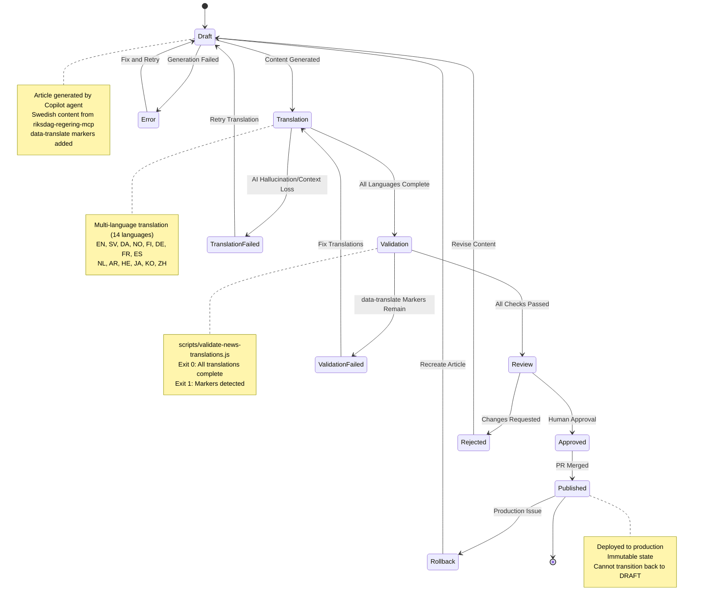
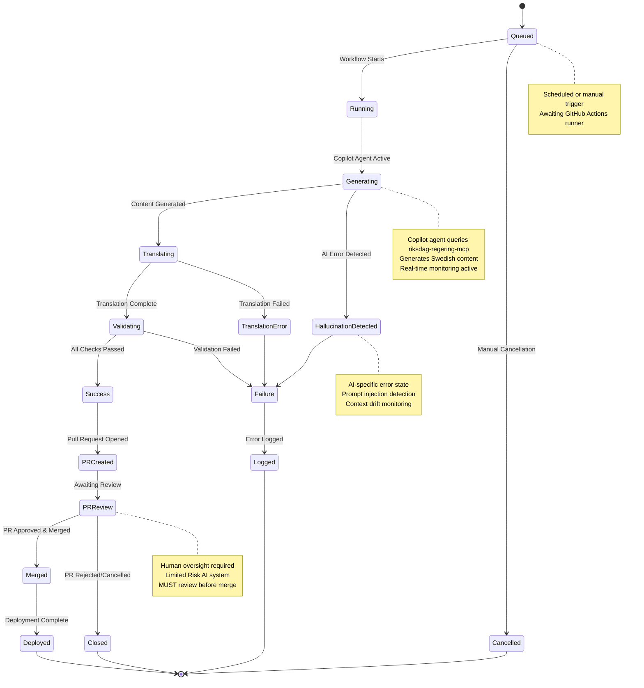
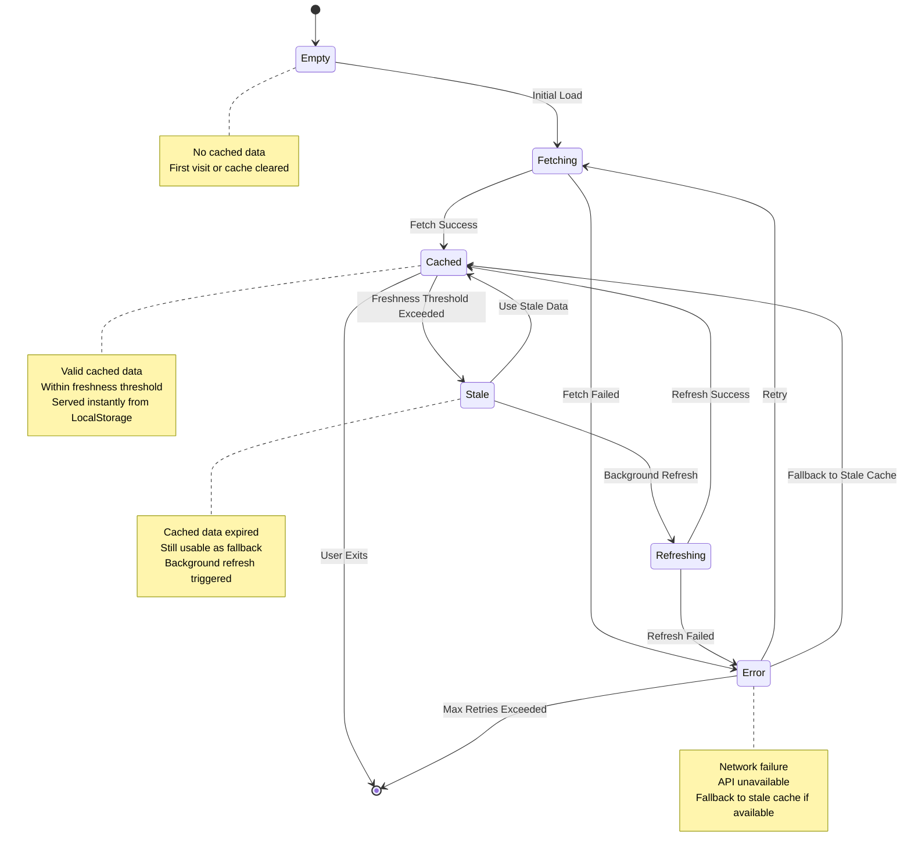
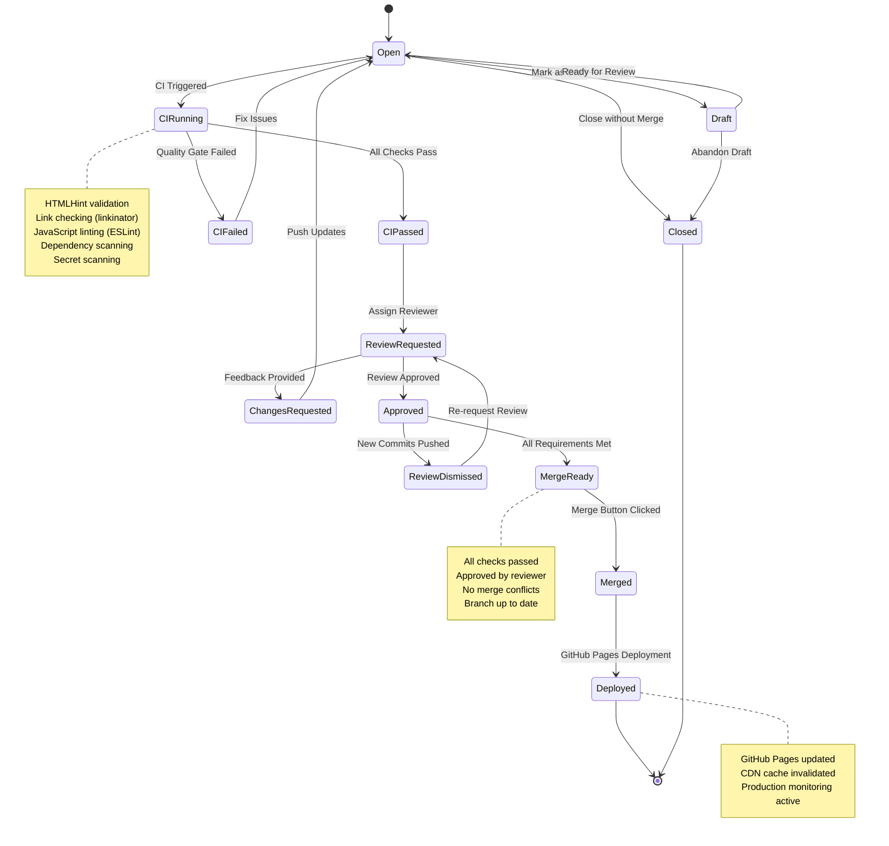
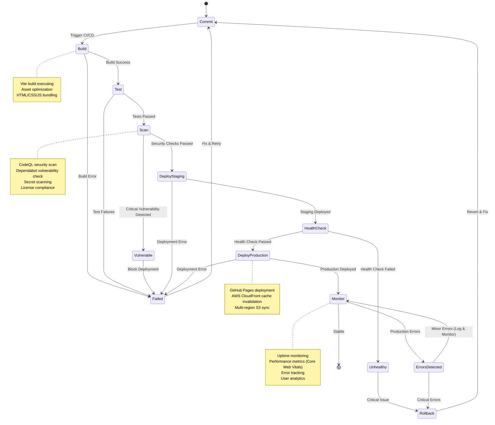
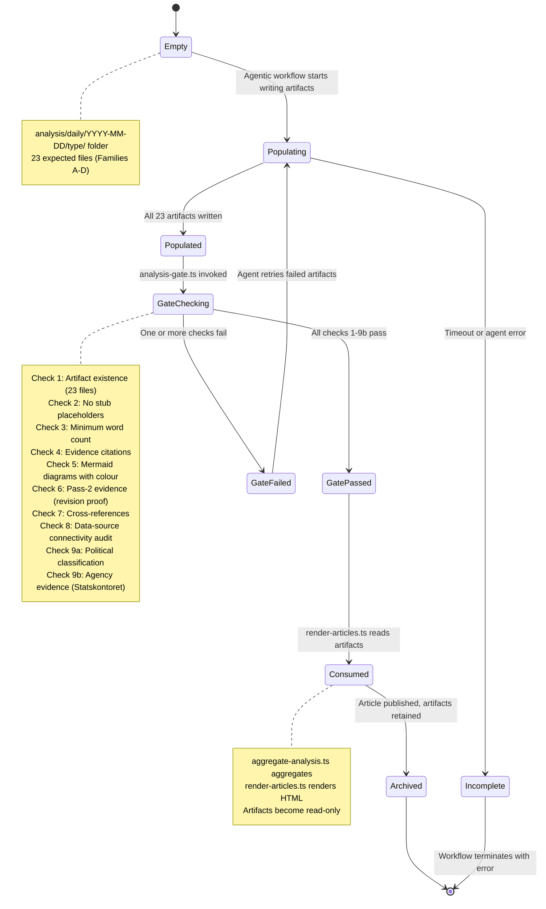
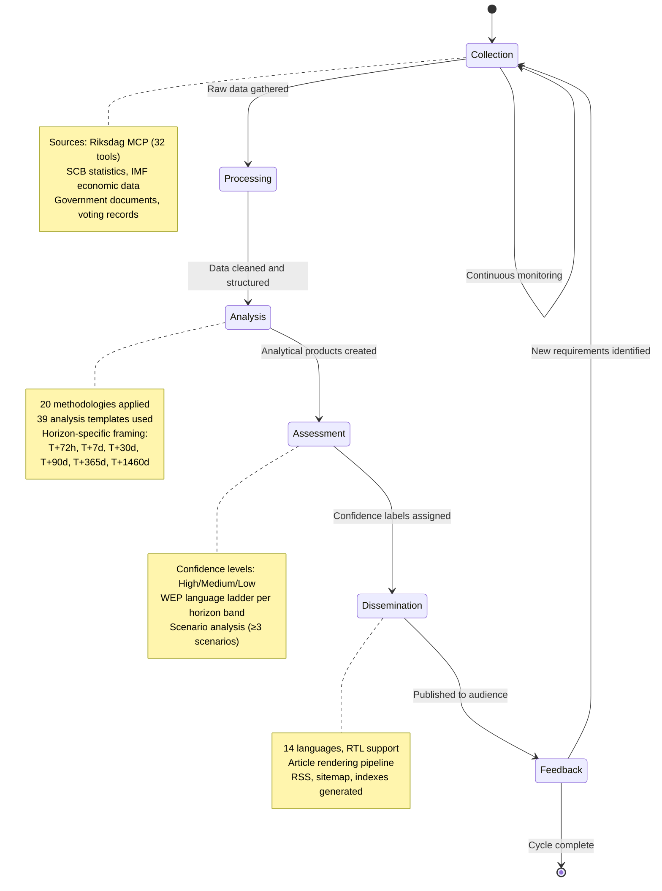
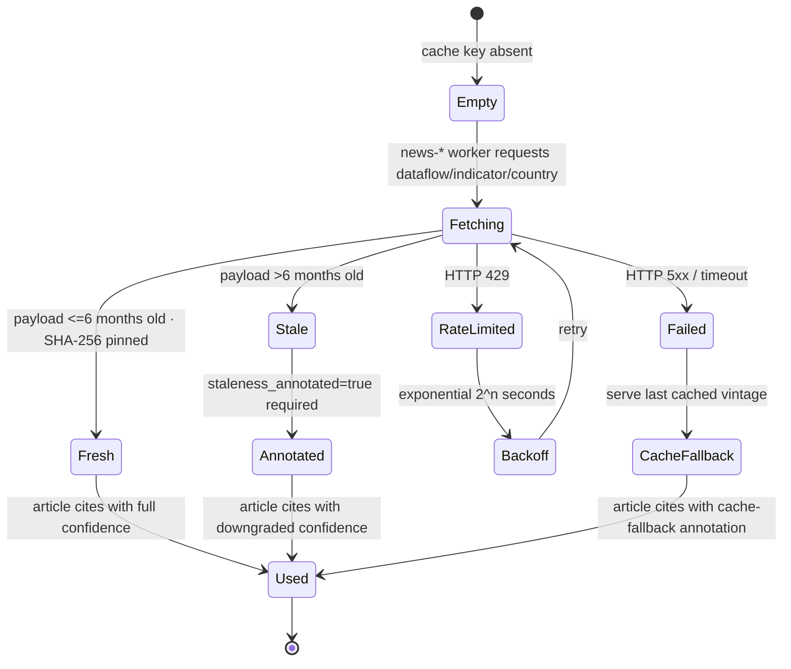

<p align="center">
  
</p>

<h1 align="center">🔄 Riksdagsmonitor — State Diagrams</h1>

<p align="center">
  <strong>🎭 System Behavior and State Transitions for Democratic Transparency</strong><br>
  <em>📊 Lifecycle Management · Workflow States · AI-Driven Processes</em>
</p>

<p align="center">
  
  
  
  
</p>

**📋 Document Owner:** CEO | **📄 Version:** 1.2 | **📅 Last Updated:** 2026-05-06 (UTC)  
**🔄 Review Cycle:** Quarterly | **⏰ Next Review:** 2026-08-06  
**🏢 Owner:** Hack23 AB (Org.nr 5595347807) | **🏷️ Classification:** Public

---

## Executive Summary

This document illustrates the key state transitions and behavioral models within the Riksdagsmonitor platform. These diagrams provide a comprehensive view of how system components change states in response to user interactions, data updates, workflow executions, and automated processes. All state models align with Hack23 AB's [AI Policy](https://github.com/Hack23/ISMS-PUBLIC/blob/main/AI_Policy.md) and [Secure Development Policy](https://github.com/Hack23/ISMS-PUBLIC/blob/main/Secure_Development_Policy.md).

## 📚 Architecture Documentation Map

| Document | Focus | Description |
|----------|-------|-------------|
| [🏛️ Architecture](ARCHITECTURE.md) | 🏗️ C4 Models | System context, containers, components |
| [📊 Data Model](DATA_MODEL.md) | 📊 Data | Entity relationships and data dictionary |
| [🔄 Flowchart](FLOWCHART.md) | 🔄 Processes | Business and data flow diagrams |
| **[📈 State Diagram](STATEDIAGRAM.md)** | **📈 States** | **System state transitions and lifecycles** |
| [🧠 Mindmap](MINDMAP.md) | 🧠 Concepts | System conceptual relationships |
| [💼 SWOT](SWOT.md) | 💼 Strategy | Strategic analysis and positioning |
| [🛡️ Security Architecture](SECURITY_ARCHITECTURE.md) | 🔒 Security | Current security controls and design |
| [🚀 Future Security](FUTURE_SECURITY_ARCHITECTURE.md) | 🔮 Security | Planned security improvements |
| [🎯 Threat Model](THREAT_MODEL.md) | 🎯 Threats | STRIDE/MITRE ATT&CK analysis |
| [🔧 Workflows](WORKFLOWS.md) | 🔧 DevOps | CI/CD automation and pipelines |
| [🛡️ CRA Assessment](CRA-ASSESSMENT.md) | ⚖️ Compliance | EU Cyber Resilience Act conformity |
| [🚀 Future Architecture](FUTURE_ARCHITECTURE.md) | 🔮 Evolution | Architectural evolution roadmap |
| [📊 Future Data Model](FUTURE_DATA_MODEL.md) | 🔮 Data | Enhanced data architecture plans |
| [🔄 Future Flowchart](FUTURE_FLOWCHART.md) | 🔮 Processes | Improved process workflows |
| [📈 Future State Diagram](FUTURE_STATEDIAGRAM.md) | 🔮 States | Advanced state management |
| [🧠 Future Mindmap](FUTURE_MINDMAP.md) | 🔮 Concepts | Capability expansion plans |
| [💼 Future SWOT](FUTURE_SWOT.md) | 🔮 Strategy | Future strategic opportunities |

---

## 1. 📰 News Article Lifecycle States

**📊 Data Focus:** Illustrates how news articles flow from generation to publication across 14 languages.

**🔄 Process Focus:** Shows state transitions as articles are generated, translated, validated, reviewed, and published.

**🤖 AI Integration:** Agentic workflows (Copilot + riksdag-regering-mcp) generate and translate content with human oversight.



### 1.1 State Definitions

| State | Description | Entry Conditions | Exit Conditions | Typical Duration |
|-------|-------------|------------------|-----------------|------------------|
| **DRAFT** | Article generated by Copilot agent with Swedish content only | Workflow triggered | Translation starts | 2-5 minutes |
| **TRANSLATION** | Multi-language translation in progress (14 languages) | Draft complete, data-translate markers present | All languages translated | 3-8 minutes |
| **VALIDATION** | Automated validation checking for remaining markers | Translation complete | Validation script exit 0 or 1 | 30-60 seconds |
| **REVIEW** | Human review in pull request | Validation passed, PR created | Approved or rejected | 1-24 hours |
| **APPROVED** | PR approved, awaiting merge | Reviewer approval | PR merged | 1-60 minutes |
| **PUBLISHED** | Merged to main, deployed to production | PR merged, deployment complete | Rollback (rare) | Permanent |
| **ERROR** | Generation failure requiring intervention | AI error, API failure | Manual fix, retry | Variable |
| **TRANSLATION_FAILED** | Translation error (hallucination, context loss) | AI translation error | Retry translation | 5-15 minutes |
| **VALIDATION_FAILED** | Validation script detected remaining markers | scripts/validate-news-translations.js exit 1 | Fix translations | 5-10 minutes |
| **REJECTED** | Human reviewer requested changes | Changes requested | Revise content | Variable |
| **ROLLBACK** | Production issue, reverting changes | Critical production bug | Recreate article | 10-30 minutes |

### 1.2 State Transition Matrix

| From State | Event | To State | Conditions | Actions |
|------------|-------|----------|------------|---------|
| DRAFT | translate_complete | TRANSLATION | All languages done | Trigger validation |
| DRAFT | generation_failed | ERROR | AI error, API timeout | Log error, alert team |
| TRANSLATION | validation_start | VALIDATION | Translation complete | Run validate-news-translations.js |
| TRANSLATION | translation_error | TRANSLATION_FAILED | Hallucination detected | Log error, retry |
| VALIDATION | validation_passed | REVIEW | Exit code 0 | Create PR |
| VALIDATION | validation_failed | VALIDATION_FAILED | Exit code 1, markers found | Return to translation |
| REVIEW | approve | APPROVED | Reviewer approval | Prepare merge |
| REVIEW | request_changes | REJECTED | Feedback provided | Notify author |
| APPROVED | merge | PUBLISHED | All checks passed | Deploy to production |
| PUBLISHED | production_issue | ROLLBACK | Critical bug detected | Revert commit |

### 1.3 State Invariants

- **PUBLISHED → DRAFT**: ❌ **BLOCKED** - Published articles are immutable (cannot revert to draft)
- **VALIDATION_FAILED → PUBLISHED**: ❌ **BLOCKED** - Cannot publish with untranslated markers
- **ERROR → PUBLISHED**: ❌ **BLOCKED** - Must resolve errors before publishing
- **DRAFT → PUBLISHED**: ❌ **BLOCKED** - Must pass through TRANSLATION → VALIDATION → REVIEW → APPROVED
- **TRANSLATION → REVIEW**: ❌ **BLOCKED** - Must validate first

### 1.4 Error State Handling

| Error State | Detection | Recovery | Retry Logic | Notification |
|-------------|-----------|----------|-------------|--------------|
| **ERROR** | AI generation fails, API timeout | Manual fix, retry workflow | Max 3 attempts, exponential backoff (1m, 2m, 4m) | GitHub issue auto-created |
| **TRANSLATION_FAILED** | AI hallucination, context loss | Automatic retry with refined prompt | Max 2 attempts, 5-minute delay | Workflow annotation |
| **VALIDATION_FAILED** | data-translate markers remain | Return to translation step | Automatic retry | Workflow log |
| **REJECTED** | Human reviewer feedback | Manual content revision | N/A (human-driven) | PR comment |
| **ROLLBACK** | Production bug detected | Manual revert + recreate | N/A (manual) | GitHub issue, Slack alert |

---

## 2. 🤖 Agentic Workflow States

**📊 Data Focus:** GitHub Actions workflows executing Copilot agents with MCP server integration.

**🔄 Process Focus:** Shows workflow lifecycle from scheduling through deployment.

**🤖 AI Integration:** Limited Risk AI system per Hack23 AI Policy requiring human oversight.



### 2.1 State Definitions

| State | Description | Entry Conditions | Exit Conditions | Typical Duration |
|-------|-------------|------------------|-----------------|------------------|
| **QUEUED** | Workflow scheduled, awaiting runner | Cron trigger or manual dispatch | Runner available | 10-60 seconds |
| **RUNNING** | Workflow executing, runner assigned | Runner allocated | Copilot agent starts | 10-30 seconds |
| **GENERATING** | Copilot agent generating content | Agent initialized, MCP connected | Content complete | 2-5 minutes |
| **TRANSLATING** | Multi-language translation | Content generated | All languages done | 3-8 minutes |
| **VALIDATING** | Playwright + translation validation | Translation complete | Validation exit 0 or 1 | 1-2 minutes |
| **SUCCESS** | All checks passed | Validation successful | PR created | 10-30 seconds |
| **FAILURE** | Workflow failed | Error detected | Logged | Immediate |
| **HALLUCINATION_DETECTED** | AI error (hallucination, prompt injection) | AI monitoring alert | Error logged | Immediate |
| **TRANSLATION_ERROR** | Translation failure | Translation step failed | Error logged | Immediate |
| **PR_CREATED** | Pull request opened | Success state, PR API call | Review requested | Immediate |
| **PR_REVIEW** | Human review in progress | PR created | Approved or closed | 1-24 hours |
| **MERGED** | Changes merged to main | PR approved, merge button clicked | Deployment starts | Immediate |
| **DEPLOYED** | Changes live in production | GitHub Pages deployment complete | Monitoring active | 2-5 minutes |
| **CLOSED** | PR rejected or cancelled | Review rejected, manual close | Workflow terminated | Immediate |
| **CANCELLED** | Workflow manually cancelled | User cancellation | Workflow terminated | Immediate |
| **LOGGED** | Error logged for audit | Any failure state | Workflow terminated | Immediate |

### 2.2 State Transition Matrix

| From State | Event | To State | Conditions | Actions |
|------------|-------|----------|------------|---------|
| QUEUED | runner_allocated | RUNNING | Runner available | Initialize environment |
| RUNNING | agent_start | GENERATING | Copilot agent ready | Connect MCP server |
| GENERATING | content_complete | TRANSLATING | Swedish content done | Start translation |
| GENERATING | ai_error | HALLUCINATION_DETECTED | Hallucination/injection | Log error, alert |
| TRANSLATING | translation_complete | VALIDATING | All languages done | Run validation |
| TRANSLATING | translation_failed | TRANSLATION_ERROR | AI error | Log error |
| VALIDATING | validation_success | SUCCESS | Exit code 0 | Prepare PR |
| VALIDATING | validation_failed | FAILURE | Exit code 1 | Log failure |
| SUCCESS | pr_created | PR_CREATED | PR API success | Notify team |
| PR_CREATED | review_requested | PR_REVIEW | Reviewer assigned | Await review |
| PR_REVIEW | approve_and_merge | MERGED | Human approval | Merge PR |
| PR_REVIEW | reject_or_close | CLOSED | Human rejection | Close PR |
| MERGED | deployment_complete | DEPLOYED | GitHub Pages updated | Monitor production |

### 2.3 AI-Specific States (Hack23 AI Policy Compliance)

| AI State | Purpose | Detection Method | Mitigation | Audit Log |
|----------|---------|------------------|------------|-----------|
| **HALLUCINATION_DETECTED** | Detect AI-generated false information | Content validation, fact-checking | Retry with refined prompt, human review | ✅ Yes - workflow logs |
| **TRANSLATION_ERROR** | Detect translation quality issues | Validation script, marker detection | Automatic retry, context preservation | ✅ Yes - workflow logs |
| **GENERATING** | AI content creation active | Workflow state tracking | Real-time monitoring, timeout (30 min) | ✅ Yes - workflow logs |
| **PR_REVIEW** | Human oversight required | Limited Risk AI system | MUST review before production | ✅ Yes - PR history |
| **LOGGED** | Audit trail for AI operations | All failure states | Compliance reporting | ✅ Yes - permanent logs |

### 2.4 Workflow Coordination

**Shared State File:** `workflow-state.json`

```javascript
{
  "lastUpdate": "2026-02-15T15:30:00Z",
  "recentArticles": [
    {
      "slug": "2026-02-15-week-ahead-en.html",
      "timestamp": "2026-02-15T15:25:00Z",
      "workflow": "news-week-ahead",
      "title": "Week Ahead in Swedish Parliament",
      "topics": ["parliament", "schedule", "committees"]
    }
  ],
  "mcpQueryCache": {
    "hash123": {
      "query": "recent motions",
      "result": {...},
      "timestamp": "2026-02-15T14:00:00Z"
    }
  },
  "workflows": {
    "news-week-ahead": {
      "lastRun": "2026-02-15T05:51:00Z",
      "status": "success",
      "articles": 1
    },
    "news-evening-analysis": {
      "lastRun": "2026-02-14T18:00:00Z",
      "status": "success",
      "articles": 1
    },
    "news-realtime-monitor": {
      "lastRun": "2026-02-15T14:00:00Z",
      "status": "success",
      "articles": 2
    }
  }
}
```

---

## 3. 📊 Dashboard Data States

**📊 Data Focus:** LocalStorage-based caching for CIA dashboard exports and Riksdag data.

**🔄 Process Focus:** Shows data lifecycle from initial fetch through refresh cycles.

**⚡ Performance Focus:** Minimizes API calls while maintaining data freshness.



### 3.1 State Definitions

| State | Description | Entry Conditions | Exit Conditions | Typical Duration |
|-------|-------------|------------------|-----------------|------------------|
| **EMPTY** | No cached data, initial load | First visit, cache cleared | Fetch starts | Instant |
| **FETCHING** | Requesting data from GitHub CDN | Empty state, refresh needed | Data received or error | 200-1000ms |
| **CACHED** | Valid cached data within freshness threshold | Fetch success, refresh success | Threshold exceeded | Hours to days |
| **STALE** | Cached data expired beyond threshold | Freshness check failed | Refresh initiated | Seconds to minutes |
| **REFRESHING** | Background refresh in progress | Stale state detected | Data updated or error | 200-1000ms |
| **ERROR** | Fetch/refresh failed | Network error, API timeout | Retry or fallback | Seconds |

### 3.2 Freshness Thresholds

| Data Type | Freshness Threshold | Rationale | Fallback Behavior |
|-----------|--------------------|-----------|--------------------|
| **Production Stats** | 24 hours | Updated monthly, low volatility | Use stale cache indefinitely |
| **Seasonal Patterns** | 7 days | Updated quarterly, stable data | Use stale cache indefinitely |
| **Politician Data** | 24 hours | Updated weekly, moderate volatility | Use stale cache up to 7 days |
| **Party Performance** | 7 days | Updated monthly, low volatility | Use stale cache indefinitely |
| **Election Forecasts** | 24 hours | Updated daily, high volatility | Require fresh data, retry |
| **Risk Assessments** | 24 hours | Updated daily, high volatility | Require fresh data, retry |

### 3.3 State Transition Matrix

| From State | Event | To State | Conditions | Actions |
|------------|-------|----------|------------|---------|
| EMPTY | page_load | FETCHING | No cache exists | Fetch from CDN |
| FETCHING | fetch_success | CACHED | HTTP 200, valid JSON | Store in LocalStorage |
| FETCHING | fetch_failed | ERROR | Network error, timeout | Log error, retry |
| CACHED | freshness_check | STALE | Age > threshold | Serve stale, trigger refresh |
| CACHED | user_exit | [END] | Page unload | Persist cache |
| STALE | background_refresh | REFRESHING | Auto-triggered | Fetch updated data |
| STALE | immediate_serve | CACHED | User needs data now | Serve stale data |
| REFRESHING | refresh_success | CACHED | HTTP 200, valid JSON | Update LocalStorage |
| REFRESHING | refresh_failed | ERROR | Network error | Log error, use stale |
| ERROR | retry | FETCHING | Retry count < max | Exponential backoff |
| ERROR | fallback | CACHED | Stale cache available | Use stale data |
| ERROR | max_retries | [END] | 3 retries exceeded | Show error message |

### 3.4 Cache Strategy

**LocalStorage Schema:**
```javascript
{
  "riksdagsmonitor_cache": {
    "production_stats": {
      "data": {...},
      "timestamp": "2026-02-15T15:30:00Z",
      "version": "1.0"
    },
    "seasonal_patterns": {
      "data": {...},
      "timestamp": "2026-02-10T10:00:00Z",
      "version": "1.0"
    },
    "politician_data": {
      "data": {...},
      "timestamp": "2026-02-15T14:00:00Z",
      "version": "1.0"
    }
  }
}
```

**Freshness Check Algorithm:**
```javascript
function isFresh(cachedItem, thresholdHours) {
  const now = new Date();
  const cached = new Date(cachedItem.timestamp);
  const ageHours = (now - cached) / (1000 * 60 * 60);
  return ageHours < thresholdHours;
}
```

---

## 4. 🔀 Pull Request Review States

**📊 Data Focus:** PR lifecycle from creation through deployment.

**🔄 Process Focus:** Shows review workflow with quality gates and human approval.

**🔒 Security Focus:** All checks must pass before merge.



### 4.1 State Definitions

| State | Description | Entry Conditions | Exit Conditions | Typical Duration |
|-------|-------------|------------------|-----------------|------------------|
| **OPEN** | PR created, awaiting CI | PR opened | CI starts | Seconds |
| **DRAFT** | Work-in-progress, not ready for review | Marked as draft | Ready for review | Hours to days |
| **CI_RUNNING** | Quality checks executing | PR opened, new commits | Checks complete | 2-5 minutes |
| **CI_PASSED** | All checks passed | All workflows green | Review requested | Seconds |
| **CI_FAILED** | Quality gate failed | HTMLHint error, broken links | Fix pushed | Variable |
| **REVIEW_REQUESTED** | Assigned to reviewer | Checks passed | Review submitted | 1-24 hours |
| **CHANGES_REQUESTED** | Feedback provided, changes needed | Reviewer requests changes | Updates pushed | Variable |
| **APPROVED** | Approved by reviewer | Reviewer approval | Merge or new commits | Minutes to hours |
| **REVIEW_DISMISSED** | Previous approval dismissed | New commits after approval | Re-review requested | Seconds |
| **MERGE_READY** | All requirements met | Approved + checks passed + no conflicts | Merge initiated | Minutes |
| **MERGED** | Changes merged to main | Merge button clicked | Deployment starts | Seconds |
| **CLOSED** | PR closed without merge | Manual close, abandonment | Workflow terminated | Immediate |
| **DEPLOYED** | Changes live in production | GitHub Pages deployment complete | Monitoring active | 2-5 minutes |

### 4.2 Quality Gates (CI Checks)

| Check | Tool | Purpose | Failure Action |
|-------|------|---------|----------------|
| **HTML Validation** | HTMLHint | Standards compliance | ❌ Block merge, show errors |
| **Link Checking** | Linkinator v6 | Verify internal/external links | ❌ Block merge, list broken links |
| **JavaScript Linting** | ESLint 10 | Code quality | ⚠️ Warn (clean: 0 errors, 1 warning) |
| **Dependency Scanning** | Dependabot | Vulnerability detection | ❌ Block merge if critical |
| **Secret Scanning** | GitHub | Credential leak detection | ❌ Block merge, remove secrets |
| **CodeQL** | GitHub | Security vulnerability scan | ⚠️ Review required if alerts |

### 4.3 State Transition Matrix

| From State | Event | To State | Conditions | Actions |
|------------|-------|----------|------------|---------|
| OPEN | mark_draft | DRAFT | User action | Prevent reviews |
| OPEN | ci_trigger | CI_RUNNING | Commit detected | Run workflows |
| DRAFT | ready_for_review | OPEN | User marks ready | Allow reviews |
| CI_RUNNING | checks_passed | CI_PASSED | All workflows green | Enable merge |
| CI_RUNNING | checks_failed | CI_FAILED | Any workflow red | Block merge |
| CI_FAILED | push_fix | OPEN | New commits | Re-run CI |
| CI_PASSED | request_review | REVIEW_REQUESTED | Reviewer assigned | Notify reviewer |
| REVIEW_REQUESTED | approve | APPROVED | Reviewer approval | Enable merge |
| REVIEW_REQUESTED | request_changes | CHANGES_REQUESTED | Feedback provided | Block merge |
| CHANGES_REQUESTED | push_updates | OPEN | New commits | Re-run CI |
| APPROVED | new_commits | REVIEW_DISMISSED | Commits after approval | Re-request review |
| APPROVED | all_requirements | MERGE_READY | Checks + approval + no conflicts | Show merge button |
| MERGE_READY | merge | MERGED | Merge button clicked | Start deployment |
| MERGED | deployment_complete | DEPLOYED | GitHub Pages updated | Monitor production |
| OPEN | close | CLOSED | Manual close | End workflow |

### 4.4 Merge Requirements Checklist

Before transition to MERGE_READY state, ALL must be true:

- ✅ All CI checks passed (HTML, links, security)
- ✅ At least 1 approval from reviewer
- ✅ No merge conflicts with base branch
- ✅ Branch is up to date with base
- ✅ No requested changes pending
- ✅ No critical security vulnerabilities detected
- ✅ All required status checks passed

---

## 5. 🚀 CI/CD Pipeline States

**📊 Data Focus:** Deployment pipeline from commit to production monitoring.

**🔄 Process Focus:** Shows build, test, security scan, and deployment workflow.

**🔒 Security Focus:** Multiple security gates (CodeQL, Dependabot, secret scanning).



### 5.1 State Definitions

| State | Description | Entry Conditions | Exit Conditions | Typical Duration |
|-------|-------------|------------------|-----------------|------------------|
| **COMMIT** | Code pushed to repository | Git push, PR merge | CI/CD triggered | Seconds |
| **BUILD** | Vite build executing | Commit detected | Build success/failure | 1-2 minutes |
| **TEST** | Unit tests (Vitest) and E2E tests (Cypress) | Build success | Tests pass/fail | 2-3 minutes |
| **SCAN** | Security scanning | Tests passed | Scans complete | 3-5 minutes |
| **FAILED** | Build/test/scan failure | Any step failed | Fix committed | Variable |
| **VULNERABLE** | Security vulnerability detected | Critical CVE found | Fix applied | Variable |
| **DEPLOY_STAGING** | Deploying to preview environment | Scans passed | Deployment complete | 2-3 minutes |
| **HEALTH_CHECK** | Smoke tests on staging | Staging deployed | Checks pass/fail | 1-2 minutes |
| **UNHEALTHY** | Health check failed | Staging broken | Rollback initiated | Seconds |
| **DEPLOY_PRODUCTION** | Deploying to GitHub Pages + CloudFront | Health checks passed | Deployment complete | 3-5 minutes |
| **MONITOR** | Production monitoring active | Production deployed | Errors detected or stable | Continuous |
| **ERRORS_DETECTED** | Production errors detected | Monitoring alerts | Rollback or mitigate | Variable |
| **ROLLBACK** | Reverting to previous version | Critical errors | Revert complete | 5-10 minutes |

### 5.2 Security Scanning Gates

| Scanner | Technology | Purpose | Blocking | Typical Duration |
|---------|-----------|---------|----------|------------------|
| **CodeQL** | GitHub Advanced Security | JavaScript/Python vulnerability detection | ⚠️ Review required | 3-4 minutes |
| **Dependabot** | GitHub Dependabot | Dependency vulnerability scanning | ❌ Critical only | 1-2 minutes |
| **Secret Scanning** | GitHub | Credential leak detection | ❌ Yes - block immediately | 30 seconds |
| **License Check** | Custom script | OSS license compliance | ⚠️ Review required | 10 seconds |

### 5.3 State Transition Matrix

| From State | Event | To State | Conditions | Actions |
|------------|-------|----------|------------|---------|
| COMMIT | ci_trigger | BUILD | New commit pushed | Clone repo, install deps |
| BUILD | build_success | TEST | Vite build complete | Run test suite |
| BUILD | build_error | FAILED | Compilation error | Log error, notify |
| TEST | tests_passed | SCAN | All tests green | Run security scans |
| TEST | tests_failed | FAILED | Any test red | Log failures, notify |
| SCAN | scans_passed | DEPLOY_STAGING | No critical vulnerabilities | Deploy to staging |
| SCAN | vulnerability_found | VULNERABLE | Critical CVE detected | Block deployment, alert |
| VULNERABLE | fix_applied | FAILED | Vulnerability mitigated | Restart pipeline |
| DEPLOY_STAGING | staging_deployed | HEALTH_CHECK | Deployment success | Run smoke tests |
| DEPLOY_STAGING | staging_failed | FAILED | Deployment error | Log error, notify |
| HEALTH_CHECK | checks_passed | DEPLOY_PRODUCTION | Staging healthy | Deploy to production |
| HEALTH_CHECK | checks_failed | UNHEALTHY | Staging broken | Rollback staging |
| UNHEALTHY | rollback_initiated | ROLLBACK | Critical issue | Revert deployment |
| DEPLOY_PRODUCTION | prod_deployed | MONITOR | Deployment success | Activate monitoring |
| DEPLOY_PRODUCTION | prod_failed | FAILED | Deployment error | Log error, notify |
| MONITOR | errors_detected | ERRORS_DETECTED | Error threshold exceeded | Evaluate severity |
| MONITOR | stable | [END] | No errors 24h | Continue monitoring |
| ERRORS_DETECTED | critical_errors | ROLLBACK | High severity | Revert immediately |
| ERRORS_DETECTED | minor_errors | MONITOR | Low severity | Log and monitor |
| ROLLBACK | revert_complete | COMMIT | Previous version restored | Fix and redeploy |
| FAILED | fix_committed | COMMIT | Issue resolved | Restart pipeline |

### 5.4 Deployment Targets

| Target | Technology | Purpose | Deployment Time | Availability |
|--------|-----------|---------|-----------------|--------------|
| **GitHub Pages** | GitHub CDN | Primary hosting | 2-3 minutes | 99.9% SLA |
| **AWS CloudFront** | 600+ PoPs | Global CDN | 3-5 minutes | 99.99% SLA |
| **S3 us-east-1** | Amazon S3 | Primary storage | 1-2 minutes | 99.99% SLA |
| **S3 eu-west-1** | Amazon S3 | Replica storage | Async (&lt;15 min) | 99.99% SLA |

### 5.5 Health Check Criteria

**Staging Health Checks:**
- ✅ HTTP 200 response for index.html
- ✅ All 14 language versions accessible
- ✅ CSS/JS assets loading
- ✅ No console errors
- ✅ Links resolve correctly

**Production Health Checks:**
- ✅ All staging checks
- ✅ CloudFront cache serving correctly
- ✅ S3 replication complete
- ✅ Core Web Vitals within targets (LCP &lt; 2.5s, FID &lt; 100ms, CLS &lt; 0.1)
- ✅ Uptime monitoring active

---

## 6. 🌐 Translation Validation States

**📊 Data Focus:** Multi-language content validation lifecycle.

**🔄 Process Focus:** Shows translation workflow from marking through publishing.

**🤖 AI Integration:** Agentic translation with automated validation.

```mermaid
stateDiagram-v2
    [*] --> Untranslated
    
    Untranslated --> Skip: Content Exempt
    Untranslated --> Marked: data-translate Markers Added
    
    Marked --> Translating: Agentic Translation Started
    
    Translating --> Translated: All Languages Complete
    Translating --> Failed: Translation Error
    
    Translated --> Validated: Validation Script Passed
    Translated --> Invalid: Markers Remain
    
    Failed --> Retrying: Retry Translation
    Retrying --> Translating: Retry Attempt
    Retrying --> Failed: Max Retries Exceeded
    
    Invalid --> Translating: Fix Translations
    
    Validated --> Published: Clean Content Deployed
    
    Published --> Rollback: Production Issue
    Published --> [*]
    
    Rollback --> Untranslated: Recreate Content
    Skip --> Published: Exempt Content
    
    note right of Marked
        Swedish API content wrapped
        <span data-translate="true" lang="sv">
        14 language versions needed
    end note
    
    note right of Translating
        Copilot agent translating
        EN, SV, DA, NO, FI, DE, FR, ES
        NL, AR, HE, JA, KO, ZH
    end note
    
    note right of Validated
        scripts/validate-news-translations.js
        Exit code 0 (success)
        No markers remaining
    end note
    
    note right of Published
        Clean translated content live
        No data-translate markers
        All languages accessible
    end note
```



### 6.1 State Definitions

| State | Description | Entry Conditions | Exit Conditions | Typical Duration |
|-------|-------------|------------------|-----------------|------------------|
| **UNTRANSLATED** | Swedish API content not yet translated | Content generated | Markers added | Seconds |
| **SKIP** | Content exempt from translation | Static content, images | Direct publish | N/A |
| **MARKED** | data-translate="true" lang="sv" markers added | Swedish content identified | Translation starts | Seconds |
| **TRANSLATING** | Agentic translation in progress | Markers present | All languages done | 3-8 minutes |
| **TRANSLATED** | All languages completed | Translation done | Validation runs | Seconds |
| **VALIDATED** | Validation script passed (exit 0) | No markers remain | Ready to publish | Seconds |
| **INVALID** | Markers remain (validation exit 1) | Validation detected markers | Fix translations | Variable |
| **FAILED** | Translation error | AI error, context loss | Retry or manual fix | Variable |
| **RETRYING** | Retry translation attempt | First attempt failed | Retry completes | 3-8 minutes |
| **PUBLISHED** | Clean content deployed | Validation passed | Monitoring active | Permanent |
| **ROLLBACK** | Revert to previous version | Production issue | Content recreated | 5-10 minutes |

### 6.2 Translation Validation Script

**Tool:** `scripts/validate-news-translations.js`

**Purpose:** Detects remaining `data-translate="true"` markers in non-Swedish articles

**Exit Codes:**
- `0` - Success: All articles fully translated
- `1` - Failure: Untranslated markers found

**Usage:**
```bash
# Validate all news articles
npm run validate-news

# Check specific directory
node scripts/validate-news-translations.js news/
```

**Sample Output (Failure):**
```
📋 NEWS TRANSLATION VALIDATION

✓ Fully translated: 142
✗ Needs translation: 3

Untranslated Articles:
  ✗ 2026-02-15-committee-reports-de.html - 10 markers
    Samples:
      1. "Bättre förutsättningar att sända ut statlig personal"
      2. "Ett register för alla bostadsrätter"
  
Action Required:
1. Open each file listed above
2. Find all <span data-translate="true" lang="sv">Swedish text</span> elements
3. Translate the Swedish text to the article's target language
4. Replace the span with plain translated text
5. Consult TRANSLATION_GUIDE.md for terminology
```

### 6.3 State Transition Matrix

| From State | Event | To State | Conditions | Actions |
|------------|-------|----------|------------|---------|
| UNTRANSLATED | exempt_content | SKIP | Static/image content | Publish directly |
| UNTRANSLATED | add_markers | MARKED | Swedish API content | Wrap in data-translate spans |
| MARKED | start_translation | TRANSLATING | Markers present | Trigger Copilot agent |
| TRANSLATING | translation_complete | TRANSLATED | All 14 languages done | Run validation |
| TRANSLATING | translation_error | FAILED | AI error, hallucination | Log error |
| TRANSLATED | validation_success | VALIDATED | Exit code 0 | Prepare publish |
| TRANSLATED | validation_failed | INVALID | Exit code 1, markers found | Return to translation |
| INVALID | fix_translations | TRANSLATING | Manual fix or retry | Re-translate |
| FAILED | retry | RETRYING | Retry count < max | Retry attempt |
| RETRYING | retry_attempt | TRANSLATING | New translation job | Attempt translation |
| RETRYING | max_retries | FAILED | 3 retries exceeded | Manual intervention |
| VALIDATED | publish | PUBLISHED | All checks passed | Deploy to production |
| PUBLISHED | production_issue | ROLLBACK | Critical bug | Revert changes |
| ROLLBACK | recreate | UNTRANSLATED | Content needs fix | Restart workflow |
| SKIP | publish | PUBLISHED | Exempt content | Deploy directly |

### 6.4 Translation Marker Format

**Swedish Content (Needs Translation):**
```html
<p>
  The committee proposes 
  <span data-translate="true" lang="sv">bättre förutsättningar för statlig personal</span> 
  in the budget.
</p>
```

**Translated Content (Clean):**
```html
<p>
  The committee proposes better conditions for government personnel in the budget.
</p>
```

### 6.5 Language Support Matrix

| Language Code | Language Name | Script | Direction | Translation Required |
|---------------|---------------|--------|-----------|----------------------|
| **en** | English | Latin | LTR | ✅ Yes |
| **sv** | Swedish | Latin | LTR | ❌ No (source) |
| **da** | Danish | Latin | LTR | ✅ Yes |
| **no** | Norwegian | Latin | LTR | ✅ Yes |
| **fi** | Finnish | Latin | LTR | ✅ Yes |
| **de** | German | Latin | LTR | ✅ Yes |
| **fr** | French | Latin | LTR | ✅ Yes |
| **es** | Spanish | Latin | LTR | ✅ Yes |
| **nl** | Dutch | Latin | LTR | ✅ Yes |
| **ar** | Arabic | Arabic | **RTL** | ✅ Yes |
| **he** | Hebrew | Hebrew | **RTL** | ✅ Yes |
| **ja** | Japanese | Kanji/Hiragana/Katakana | LTR | ✅ Yes |
| **ko** | Korean | Hangul | LTR | ✅ Yes |
| **zh** | Chinese | Simplified Chinese | LTR | ✅ Yes |

### 6.6 Retry Logic

**Translation Retry Policy:**
- **Max Attempts:** 3
- **Backoff Strategy:** Exponential (5 min, 10 min, 20 min)
- **Retry Triggers:** AI hallucination, context loss, network error
- **Manual Intervention:** After 3 failed attempts

**Validation Retry Policy:**
- **Max Attempts:** Unlimited (automatic retry after fixes)
- **Backoff Strategy:** None (immediate re-validation)
- **Retry Triggers:** Markers detected, validation script exit 1
- **Manual Intervention:** If markers persist after 3 translation attempts

---

## 6A. 📦 Analysis Artifact Lifecycle States

**📊 Data Focus:** 23 analysis artifacts (Families A-D) produced by every agentic news workflow.

**🔄 Process Focus:** Shows artifact folder lifecycle from creation through consumption by article rendering.

**🤖 AI Integration:** Artifacts are produced by Copilot agents and validated by `scripts/agentic/analysis-gate.ts`.



### 6A.1 State Definitions

| State | Description | Entry Conditions | Exit Conditions | Typical Duration |
|-------|-------------|------------------|-----------------|------------------|
| **EMPTY** | Analysis folder created but no artifacts written | Workflow triggered | First artifact written | Seconds |
| **POPULATING** | Agent writing artifacts to folder | First artifact write | All 23 present or timeout | 5-15 minutes |
| **INCOMPLETE** | Timeout or error, fewer than 23 artifacts | Agent timeout/error | Workflow terminates | N/A |
| **POPULATED** | All 23 artifacts present in folder | 23 files written | Gate check invoked | Seconds |
| **GATE_CHECKING** | analysis-gate.ts running checks 1-9b | Populated state | Pass or fail | 5-30 seconds |
| **GATE_PASSED** | All gate checks passed | All checks pass | Render starts | Seconds |
| **GATE_FAILED** | One or more checks failed | Any check fails | Retry or terminate | Variable |
| **CONSUMED** | Artifacts read by render pipeline | render-articles.ts invoked | Article published | 1-5 minutes |
| **ARCHIVED** | Artifacts retained for audit trail | Article published | Permanent | Permanent |

---

## 6B. 🕵️ Political Intelligence Assessment States

**📊 Data Focus:** Intelligence assessment lifecycle for political analysis products.

**🔄 Process Focus:** Shows the intelligence cycle from collection through dissemination and feedback.

**🤖 AI Integration:** Horizon stratification (T+72h → T+1460d) drives assessment scope and confidence levels.



### 6B.1 State Definitions

| State | Description | Entry Conditions | Exit Conditions | Typical Duration |
|-------|-------------|------------------|-----------------|------------------|
| **COLLECTION** | Gathering raw political data from sources | Workflow trigger or schedule | Sufficient data gathered | 2-5 minutes |
| **PROCESSING** | Cleaning, structuring, deduplication | Raw data available | Structured data ready | 1-3 minutes |
| **ANALYSIS** | Applying methodologies and templates | Structured data ready | Analysis artifacts produced | 5-15 minutes |
| **ASSESSMENT** | Assigning confidence, creating judgments | Analysis complete | Assessment products ready | 2-5 minutes |
| **DISSEMINATION** | Publishing to audience in multiple languages | Assessment approved | Content published | 3-10 minutes |
| **FEEDBACK** | Receiving feedback, identifying new requirements | Content published | New PIRs identified | Continuous |

### 6B.2 Horizon Stratification

| Horizon | Timeframe | Scope | Confidence Band | Scenario Depth |
|---------|-----------|-------|-----------------|----------------|
| **T+72h** | 3 days | Tactical | High | 2-3 scenarios |
| **T+7d** | 1 week | Tactical/Operational | High-Medium | 3 scenarios |
| **T+30d** | 1 month | Operational | Medium | 3-4 scenarios |
| **T+90d** | Quarter | Strategic | Medium-Low | 4 scenarios |
| **T+365d** | 1 year | Strategic | Low-Medium | 4+ scenarios + wildcards |
| **T+1460d** | Election cycle | Grand strategic | Low | 4×3 coalition branches + wildcards |

---

## 7. 📊 State Metrics and Monitoring

### 7.1 Time in State (Average Duration)

| State Category | State | Mean Duration | P50 | P95 | P99 |
|----------------|-------|---------------|-----|-----|-----|
| **Article Lifecycle** | DRAFT | 2-5 min | 3 min | 7 min | 10 min |
| **Article Lifecycle** | TRANSLATION | 3-8 min | 5 min | 12 min | 20 min |
| **Article Lifecycle** | VALIDATION | 30-60 sec | 45 sec | 90 sec | 2 min |
| **Article Lifecycle** | REVIEW | 1-24 hours | 6 hours | 24 hours | 48 hours |
| **Workflow** | QUEUED | 10-60 sec | 30 sec | 90 sec | 2 min |
| **Workflow** | GENERATING | 2-5 min | 3 min | 7 min | 10 min |
| **Workflow** | VALIDATING | 1-2 min | 90 sec | 3 min | 5 min |
| **Dashboard** | FETCHING | 200-1000ms | 500ms | 1.5 sec | 3 sec |
| **Dashboard** | CACHED | Hours to days | 12 hours | 48 hours | 7 days |
| **PR Review** | CI_RUNNING | 2-5 min | 3 min | 7 min | 10 min |
| **PR Review** | REVIEW_REQUESTED | 1-24 hours | 4 hours | 24 hours | 48 hours |
| **CI/CD** | BUILD | 1-2 min | 90 sec | 3 min | 5 min |
| **CI/CD** | TEST | 2-3 min | 150 sec | 4 min | 6 min |
| **CI/CD** | SCAN | 3-5 min | 4 min | 7 min | 10 min |
| **Translation** | TRANSLATING | 3-8 min | 5 min | 12 min | 20 min |

### 7.2 State Transition Frequency Matrix

**Top 10 Most Frequent Transitions (Weekly):**

| From State | To State | Frequency | Success Rate |
|------------|----------|-----------|--------------|
| DRAFT | TRANSLATION | ~50 | 98% |
| TRANSLATION | VALIDATION | ~50 | 95% |
| VALIDATION | REVIEW | ~48 | 100% |
| REVIEW | APPROVED | ~45 | 94% |
| APPROVED | PUBLISHED | ~45 | 100% |
| QUEUED | RUNNING | ~50 | 100% |
| RUNNING | GENERATING | ~50 | 98% |
| FETCHING | CACHED | ~1000 | 95% |
| CACHED | STALE | ~200 | 100% |
| OPEN | CI_RUNNING | ~50 | 100% |

### 7.3 Error Rates (Failed Transitions)

| Transition | Error Rate | Primary Cause | Mitigation |
|------------|-----------|---------------|------------|
| GENERATING → HALLUCINATION_DETECTED | 2% | AI hallucination | Refined prompts, fact-checking |
| TRANSLATION → TRANSLATION_FAILED | 5% | Context loss | Retry with context preservation |
| VALIDATION → VALIDATION_FAILED | 5% | Incomplete translation | Automatic retry |
| FETCHING → ERROR | 5% | Network timeout | Fallback to stale cache |
| BUILD → FAILED | 2% | Dependency issues | Lock file management |
| TEST → FAILED | 1% | Regression | Pre-commit testing |
| SCAN → VULNERABLE | &lt;1% | New CVE | Automatic Dependabot PRs |

### 7.4 Bottleneck Analysis

**States with Long P95 Durations:**

| State | P95 Duration | Bottleneck Cause | Optimization |
|-------|-------------|------------------|--------------|
| **REVIEW** (Article) | 24 hours | Human availability | Automate more checks, expand reviewer pool |
| **TRANSLATION** | 12 min | AI processing time | Parallel translation, caching |
| **SCAN** (Security) | 7 min | CodeQL analysis | Incremental analysis |
| **REVIEW_REQUESTED** (PR) | 24 hours | Human availability | Expand reviewer pool, SLA enforcement |

### 7.5 Monitoring Dashboards

**Key Metrics to Track:**

1. **Article Generation Success Rate:** % of workflows reaching PUBLISHED state
2. **Translation Quality:** % of articles passing validation on first attempt
3. **Review Turnaround Time:** Time from REVIEW → APPROVED
4. **Cache Hit Rate:** % of dashboard requests served from CACHED state
5. **CI/CD Success Rate:** % of commits reaching DEPLOYED state
6. **Production Uptime:** Time in MONITOR state without errors
7. **Rollback Frequency:** Number of ROLLBACK events per week

### 7.6 Alerting Thresholds

| Metric | Warning Threshold | Critical Threshold | Action |
|--------|-------------------|-------------------|--------|
| **Article Generation Failures** | &gt; 5% | &gt; 10% | Investigate AI/MCP server |
| **Translation Failures** | &gt; 10% | &gt; 20% | Review translation prompts |
| **CI/CD Failures** | &gt; 5% | &gt; 15% | Check infrastructure |
| **Cache Errors** | &gt; 10% | &gt; 25% | Verify CDN availability |
| **Production Errors** | &gt; 0.1% | &gt; 1% | Immediate rollback |
| **Review Backlog** | &gt; 10 PRs | &gt; 20 PRs | Expand reviewer pool |

---

## 8. 🔒 Security and Compliance

### 8.1 AI Policy Compliance (Hack23 AI Policy)

**Limited Risk AI System Classification:**
- ✅ Human oversight required (PR_REVIEW state)
- ✅ AI-specific states documented (HALLUCINATION_DETECTED, TRANSLATION_ERROR)
- ✅ Audit logs maintained (LOGGED state, workflow history)
- ✅ Error detection and recovery (automatic retries, rollback procedures)
- ✅ Transparency (state transitions visible in PRs and logs)

**AI Risk Controls:**

| Risk | State Where Risk Occurs | Mitigation | Monitoring |
|------|------------------------|------------|------------|
| **Hallucination** | GENERATING | Fact-checking, human review | HALLUCINATION_DETECTED state |
| **Prompt Injection** | GENERATING | Input validation, sandboxing | Real-time detection |
| **Context Loss** | TRANSLATION | Context preservation, retry | TRANSLATION_FAILED state |
| **Bias Amplification** | GENERATING, TRANSLATING | Diverse training data, review | Manual review in PR_REVIEW |
| **Data Poisoning** | GENERATING | Trusted data sources only | Source validation |

### 8.2 State Invariants for Security

**Security-Critical Invariants:**

1. **VULNERABLE → DEPLOY_PRODUCTION**: ❌ **BLOCKED** - Cannot deploy with critical vulnerabilities
2. **VALIDATION_FAILED → PUBLISHED**: ❌ **BLOCKED** - Cannot publish untranslated content
3. **CI_FAILED → MERGED**: ❌ **BLOCKED** - Cannot merge with failing checks
4. **HALLUCINATION_DETECTED → PUBLISHED**: ❌ **BLOCKED** - Cannot publish AI errors without review
5. **ERROR → DEPLOYED**: ❌ **BLOCKED** - Cannot deploy failed builds

### 8.3 Audit Trail Requirements

All state transitions MUST be logged with:

- ✅ Timestamp (ISO 8601 format)
- ✅ From State
- ✅ To State
- ✅ Triggering Event
- ✅ Actor (user, system, AI agent)
- ✅ Conditions Met (or failed)
- ✅ Actions Taken
- ✅ Outcome (success/failure)

**Retention Policy:** 90 days for operational logs, 7 years for compliance logs

---

## 9. 🔄 Integration with Other Documentation

### 9.1 Cross-References

| Document | Relevant State Diagrams | Integration Point |
|----------|------------------------|-------------------|
| **ARCHITECTURE.md** | Dashboard Data States, CI/CD Pipeline | C4 Container diagram component states |
| **WORKFLOWS.md** | Agentic Workflow States, CI/CD Pipeline | GitHub Actions workflow execution |
| **THREAT_MODEL.md** | All state diagrams | State transition security risks |
| **TRANSLATION_GUIDE.md** | Translation Validation States | Multi-language content workflow |
| **FLOWCHART.md** | Article Lifecycle States | Process and data flow diagrams |

### 9.2 Architecture Component State Mapping

| Architecture Component | State Diagram | Key States |
|------------------------|---------------|------------|
| **Interactive Dashboards** | Dashboard Data States | EMPTY, FETCHING, CACHED, STALE |
| **Static Website** | CI/CD Pipeline | BUILD, TEST, DEPLOY_PRODUCTION |
| **News Generation** | Article Lifecycle, Agentic Workflow | DRAFT, GENERATING, TRANSLATION, PUBLISHED |
| **GitHub Actions** | Agentic Workflow, CI/CD Pipeline | QUEUED, RUNNING, DEPLOYED |
| **Quality Gates** | PR Review States, CI/CD Pipeline | CI_RUNNING, CI_PASSED, CI_FAILED |

### 9.3 Workflow Execution State Mapping

| Workflow | State Diagram | Execution Path |
|----------|---------------|----------------|
| **news-evening-analysis.md** + 9 other per-type news workflows | Article Lifecycle, Agentic Workflow | QUEUED → ANALYSING → AGGREGATING → RENDERING → VALIDATING → PR_CREATED |
| **news-translate.md** | Article Lifecycle, Agentic Workflow | QUEUED → READING_RENDERED_HTML → TRANSLATING → VALIDATING → PR_CREATED |
| **news-realtime-monitor.md** | Article Lifecycle, Agentic Workflow | QUEUED → ANALYSING → AGGREGATING → RENDERING → VALIDATING → PR_CREATED |
| **quality-checks.yml** | PR Review States, CI/CD Pipeline | CI_RUNNING → CI_PASSED/CI_FAILED |
| **dependency-review.yml** | CI/CD Pipeline | SCAN → VULNERABLE/PASSED |

---

## 10. 📈 Future Enhancements

### 10.1 Planned State Additions

**Enhanced AI Monitoring:**
- **CONFIDENCE_SCORE_LOW** - AI-generated content below confidence threshold
- **HUMAN_OVERRIDE_REQUIRED** - Manual intervention needed
- **AI_EXPLANATION_GENERATED** - AI provides reasoning for decisions

**Advanced Caching:**
- **PREFETCHING** - Proactive cache warming
- **CACHE_INVALIDATION** - Explicit cache clearing
- **MULTI_REGION_SYNC** - Cross-region cache synchronization

**Deployment Optimization:**
- **CANARY_DEPLOYMENT** - Gradual rollout to subset of users
- **BLUE_GREEN_DEPLOYMENT** - Zero-downtime deployments
- **FEATURE_FLAG_EVALUATION** - Dynamic feature enablement

### 10.2 Monitoring Improvements

- Real-time state transition dashboard (Grafana)
- Machine learning-based anomaly detection for state durations
- Predictive analytics for workflow success rates
- Automated bottleneck identification and alerts

### 10.3 Automation Opportunities

- Auto-retry for transient failures (network, API timeouts)
- Smart cache preloading based on user behavior patterns
- Automated rollback on production error thresholds
- Self-healing workflows for common failure scenarios

## 📚 Architecture Documentation Map

| Document | Focus | Description |
|----------|-------|-------------|
| [🏛️ Architecture](ARCHITECTURE.md) | 🏗️ C4 Models | System context, containers, components |
| [📊 Data Model](DATA_MODEL.md) | 📊 Data | Entity relationships and data dictionary |
| [🔄 Flowchart](FLOWCHART.md) | 🔄 Processes | Business and data flow diagrams |
| **[📈 State Diagram](STATEDIAGRAM.md)** | **📈 States** | **System state transitions and lifecycles** |
| [🧠 Mindmap](MINDMAP.md) | 🧠 Concepts | System conceptual relationships |
| [💼 SWOT](SWOT.md) | 💼 Strategy | Strategic analysis and positioning |
| [🛡️ Security Architecture](SECURITY_ARCHITECTURE.md) | 🔒 Security | Current security controls and design |
| [🚀 Future Security](FUTURE_SECURITY_ARCHITECTURE.md) | 🔮 Security | Planned security improvements |
| [🎯 Threat Model](THREAT_MODEL.md) | 🎯 Threats | STRIDE/MITRE ATT&CK analysis |
| [🔧 Workflows](WORKFLOWS.md) | 🔧 DevOps | CI/CD automation and pipelines |
| [🛡️ CRA Assessment](CRA-ASSESSMENT.md) | ⚖️ Compliance | EU Cyber Resilience Act conformity |
| [🚀 Future Architecture](FUTURE_ARCHITECTURE.md) | 🔮 Evolution | Architectural evolution roadmap |
| [📊 Future Data Model](FUTURE_DATA_MODEL.md) | 🔮 Data | Enhanced data architecture plans |
| [🔄 Future Flowchart](FUTURE_FLOWCHART.md) | 🔮 Processes | Improved process workflows |
| [📈 Future State Diagram](FUTURE_STATEDIAGRAM.md) | 🔮 States | Advanced state management |
| [🧠 Future Mindmap](FUTURE_MINDMAP.md) | 🔮 Concepts | Capability expansion plans |
| [💼 Future SWOT](FUTURE_SWOT.md) | 🔮 Strategy | Future strategic opportunities |

### Hack23 ISMS Policies

- [🛡️ Secure Development Policy](https://github.com/Hack23/ISMS-PUBLIC/blob/main/Secure_Development_Policy.md) — Architecture documentation requirements
- [🏷️ Classification Framework](https://github.com/Hack23/ISMS-PUBLIC/blob/main/CLASSIFICATION.md) — CIA triad classification

---

**📋 Document Control:**  
**✅ Approved by:** James Pether Sörling, CEO  
**📤 Distribution:** Public  
**🏷️ Classification:** [](https://github.com/Hack23/ISMS-PUBLIC/blob/main/CLASSIFICATION.md#confidentiality-levels)  
**📅 Effective Date:** 2026-02-15  
**⏰ Next Review:** 2026-05-15  
**🎯 Framework Compliance:** [](https://github.com/Hack23/ISMS-PUBLIC/blob/main/CLASSIFICATION.md) [](https://github.com/Hack23/ISMS-PUBLIC/blob/main/CLASSIFICATION.md) [](https://github.com/Hack23/ISMS-PUBLIC/blob/main/CLASSIFICATION.md)


---

## 🌐 IMF Cache & Vintage State Machine (Current State)

> **Status:** ✅ Implemented and in production. The IMF cache lives in `analysis/imf/` (canonical hub) and `analysis/daily/*/economic-data.json` (per-article vintage cache). Every cache row is vintage-tagged and SHA-256 pinned. Authority: [`.github/aw/ECONOMIC_DATA_CONTRACT.md`](.github/aw/ECONOMIC_DATA_CONTRACT.md) v2.1.

### IMF cache row lifecycle



### WEO vintage transition (April → October cycle, current behaviour)

```mermaid
stateDiagram-v2
    [*] --> WEO_2026_04: April WEO published; cached
    WEO_2026_04 --> WEO_2026_10: October WEO published (supersedes pointer set)
    WEO_2026_04 --> Archived: superseded; preserved for audit-trail
    WEO_2026_10 --> WEO_2027_04: April 2027 WEO publishes
    WEO_2026_10 --> Archived
    Archived --> [*]: never deleted (provenance integrity)
```

**Current production guarantees:**
- Vintage label format `YYYY-MM` enforced by `tests/imf-inventory.test.ts`
- `supersedes` pointer never overwrites prior vintage row (immutable supersedes-chain)
- Stale vintages (>6 months) trigger automatic article-level annotation per `scripts/article-quality-enhancer.ts`
- Cache-fallback path tested by `tests/economic-context-multi-provider.test.ts`

---

## 🔗 Hack23 Ecosystem

<table>
<tr>
  <th width="33%">🌐 Platforms</th>
  <th width="33%">📦 Open-Source Projects</th>
  <th width="33%">🛡️ Governance &amp; Standards</th>
</tr>
<tr>
<td valign="top">
🗳️ <a href="https://riksdagsmonitor.com">Riksdagsmonitor</a> — Swedish Parliament intelligence<br>
🇪🇺 <a href="https://www.euparliamentmonitor.com">EU Parliament Monitor</a> — European coverage<br>
🕵️ <a href="https://www.hack23.com/cia">Citizen Intelligence Agency</a> — political-data engine<br>
🌐 <a href="https://www.hack23.com">Hack23 AB</a> — corporate site<br>
📰 <a href="https://hack23.com/blog.html">Hack23 Blog</a> — engineering &amp; policy<br>
💼 <a href="https://www.linkedin.com/company/hack23/">Hack23 on LinkedIn</a>
</td>
<td valign="top">
🗳️ <a href="https://github.com/Hack23/riksdagsmonitor">Hack23/riksdagsmonitor</a><br>
🕵️ <a href="https://github.com/Hack23/cia">Hack23/cia</a><br>
🇪🇺 <a href="https://github.com/Hack23/euparliamentmonitor">Hack23/euparliamentmonitor</a><br>
🔌 <a href="https://github.com/Hack23/european-parliament-mcp">Hack23/european-parliament-mcp</a><br>
✅ <a href="https://github.com/Hack23/cia-compliance-manager">Hack23/cia-compliance-manager</a><br>
🥋 <a href="https://github.com/Hack23/black-trigram">Hack23/black-trigram</a><br>
🏠 <a href="https://github.com/Hack23/homepage">Hack23/homepage</a>
</td>
<td valign="top">
🛡️ <a href="https://github.com/Hack23/ISMS-PUBLIC">Hack23 ISMS-PUBLIC</a> — public ISMS<br>
🔒 <a href="https://github.com/Hack23/ISMS-PUBLIC/blob/main/Information_Security_Policy.md">Information Security Policy</a><br>
🤖 <a href="https://github.com/Hack23/ISMS-PUBLIC/blob/main/AI_Policy.md">AI Policy</a><br>
🧪 <a href="https://github.com/Hack23/ISMS-PUBLIC/blob/main/Secure_Development_Policy.md">Secure Development Policy</a><br>
🎯 <a href="https://github.com/Hack23/ISMS-PUBLIC/blob/main/Threat_Modeling.md">Threat Modeling Policy</a><br>
⚠️ <a href="https://github.com/Hack23/ISMS-PUBLIC/blob/main/Vulnerability_Management.md">Vulnerability Management</a><br>
🏷️ <a href="https://github.com/Hack23/ISMS-PUBLIC/blob/main/CLASSIFICATION.md">Classification Framework</a>
</td>
</tr>
</table>

<p align="center">
<a href="https://www.bestpractices.dev/projects/12069"></a>
<a href="https://scorecard.dev/viewer/?uri=github.com/Hack23/riksdagsmonitor"></a>
<a href="https://github.com/Hack23/ISMS-PUBLIC"></a>
<a href="https://github.com/Hack23/ISMS-PUBLIC"></a>
<a href="https://github.com/Hack23/ISMS-PUBLIC"></a>
<a href="https://www.apache.org/licenses/LICENSE-2.0"></a>
</p>

<p align="center"><em>🗳️ Empower citizens · 🔍 Strengthen democratic accountability · 🕵️ Illuminate the political process</em></p>

<p align="center"><sub>© 2008–2026 <a href="https://www.hack23.com">Hack23 AB</a> (Org.nr 559534-7807) · Maintainer: <a href="https://www.linkedin.com/in/jamessorling/">James Pether Sörling, CISSP CISM</a></sub></p>
