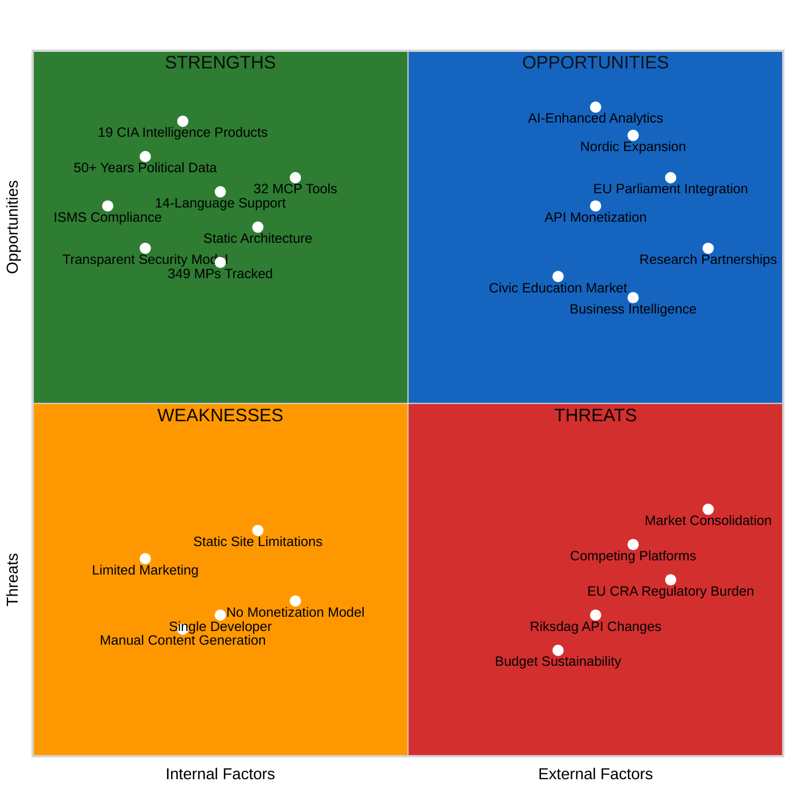
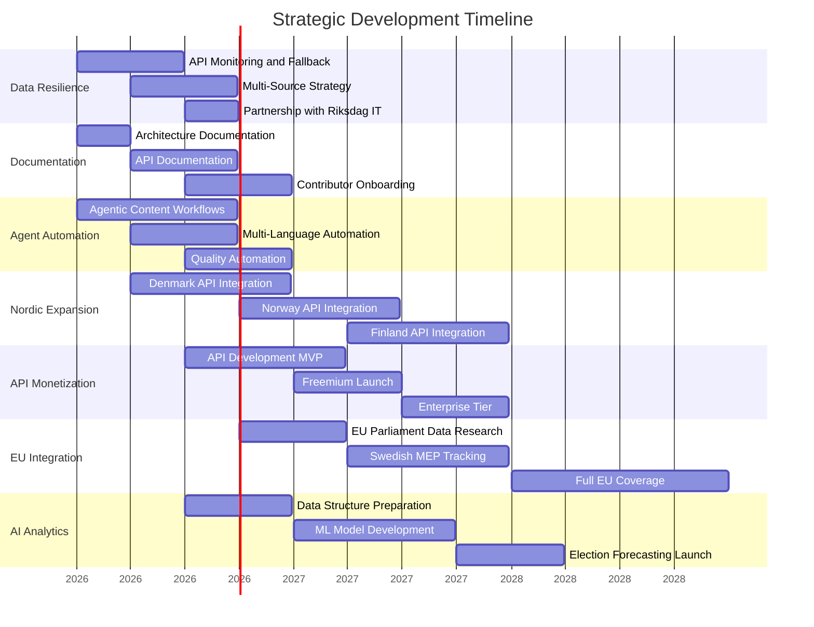

  

<h1 align="center">💼 Riksdagsmonitor — SWOT Analysis</h1>

  <strong>📊 Strategic Position Assessment for Democratic Transparency</strong> 
  <em>🎯 Strengths, Weaknesses, Opportunities, and Threats Analysis</em>

  
  
  
  

**📋 Document Owner:** CEO | **📄 Version:** 1.4 | **📅 Last Updated:** 2026-05-06 (UTC)  
**🔄 Review Cycle:** Quarterly | **⏰ Next Review:** 2026-08-03  
**🏢 Owner:** Hack23 AB (Org.nr 5595347807) | **🏷️ Classification:** Public

---

## 🎯 Purpose

> *"At Hack23 AB, we believe that true strategic excellence comes through transparent analysis and demonstrable self-awareness. This SWOT analysis openly examines Riksdagsmonitor's strategic position—our strengths to leverage, weaknesses to address, opportunities to pursue, and threats to mitigate. By making this analysis public, we demonstrate our commitment to transparency in governance and strategic planning, inviting stakeholders to understand our journey toward enhanced democratic accountability."*
>
> — **James Pether Sörling, CEO, Hack23 AB**

---

## 📊 Executive Summary

This SWOT analysis evaluates Riksdagsmonitor's strategic position as a Swedish Parliament intelligence platform. The analysis identifies internal strengths and weaknesses alongside external opportunities and threats, providing a foundation for strategic decision-making aligned with Hack23 AB's Information Security Management System (ISMS).

**Key Findings:**
- **Dominant Strengths:** 50+ years of comprehensive political data, 14-language support, 19 CIA intelligence products, modern static architecture, 7,500+ tests (v0.9.40)
- **Critical Weaknesses:** Single developer dependency, no monetization model, limited marketing reach
- **Major Opportunities:** Nordic expansion, EU Parliament integration, API monetization, international partnerships
- **Significant Threats:** Competitive platforms, regulatory uncertainty, technical evolution, market dynamics

**Strategic Imperative:** Leverage unique data depth and transparency model while addressing single-developer risk and exploring sustainable revenue models for long-term viability.

---

## 📋 SWOT Overview

### Traditional SWOT Quadrant Chart

**Strategic Focus:** This quadrant chart provides a visual representation of Riksdagsmonitor's strengths, weaknesses, opportunities, and threats arranged by their internal/external nature and positive/negative impact.

---

## 💪 Strengths (Internal, Positive)

### S1: Comprehensive Political Data (50+ Years)

**Description:** Unparalleled depth of Swedish Parliament data from 1971-2024, covering 2,494 politicians, 3.5+ million votes, 109,000+ documents, and complete electoral history.

**Competitive Advantage:**
- **Historical Depth:** 50+ years of longitudinal political analysis unavailable elsewhere
- **Data Completeness:** 349 current MPs, 8 parties, 45 risk rules, complete voting records
- **CIA Platform Integration:** 19 specialized intelligence products (dashboards, rankings, analytics)

**Evidence:**
- Production database: 2,494 politicians, 3.5M+ votes, 109,000+ documents
- Daily automated updates via GitHub Actions (03:00 CET)
- Schema validation against CIA JSON exports

**Strategic Value:** Establishes riksdagsmonitor as the authoritative source for Swedish political intelligence research and transparency.

---

### S2: Multi-Language Global Reach (14 Languages)

**Description:** Comprehensive internationalization supporting English, Swedish, Danish, Norwegian, Finnish, German, French, Spanish, Dutch, Arabic, Hebrew, Japanese, Korean, and Chinese.

**Competitive Advantage:**
- **Nordic Coverage:** Complete Nordic language support (SV, DA, NO, FI) for regional expansion
- **Global Accessibility:** Major European languages (DE, FR, ES, NL) and Asian languages (JA, KO, ZH)
- **RTL Support:** Arabic and Hebrew with proper right-to-left layouts
- **WCAG 2.1 AA Compliant:** Accessible design across all languages

**Evidence:**
- 14 complete HTML files (index.html, index_sv.html, index_da.html, etc.)
- Translation validation scripts and automated quality checks
- `TRANSLATION_GUIDE.md` with comprehensive political vocabulary
- Multi-language sitemap (sitemap_*.html for all 14 languages)

**Strategic Value:** Enables international research collaborations, cross-country analysis, and European Union integration without language barriers.

---

### S3: CIA Intelligence Platform Integration

**Description:** Deep integration with Citizen Intelligence Agency (CIA) platform providing 19 specialized intelligence products and advanced analytics.

**Competitive Advantage:**
- **19 Intelligence Products:** Overview, party performance, government cabinet, election cycles, top-10 rankings
- **Advanced Analytics:** Committee networks, career trajectories, longitudinal party analysis
- **Automated Data Pipelines:** Daily updates, schema validation, freshness monitoring
- **Production Statistics:** Real-time dashboard updates from CIA production database

**Evidence:**
- `cia-data/` directory with complete export files
- `scripts/load-cia-stats.js` and `scripts/update-stats-from-cia.js`
- `.github/workflows/update-cia-stats.yml` (daily automated workflow)
- 5 functional interactive dashboards (seasonal patterns, politician profiles, anomaly detection, party performance, pre-election monitoring)

**Strategic Value:** Leverages mature OSINT platform (15+ years development) without reinventing analysis capabilities.

---

### S4: Modern Static Architecture

**Description:** Secure, scalable static HTML/CSS/JavaScript architecture hosted on GitHub Pages with AWS CloudFront CDN, and a deterministic **aggregate-then-render** article pipeline that sources every published article directly from committed markdown analysis artifacts.

**Competitive Advantage:**
- **Zero Server Costs:** Static hosting on GitHub Pages (free) with CloudFront CDN
- **Inherent Security:** No server-side code execution, no database vulnerabilities
- **Global Performance:** CloudFront distribution with multi-region S3 replication
- **99.998% Availability:** AWS SLA-backed infrastructure with automated failover
- **Build System:** Vite 8.0.14 with ES modules, code splitting, tree-shaking
- **Single-Source-of-Truth Articles:** `scripts/aggregate-analysis.ts` concatenates `analysis/daily/$DATE/$SUB/*.md` into a canonical `article.md`; `scripts/render-articles.ts` + `scripts/render-lib/` emits sanitised HTML via `unified → remark → rehype → rehype-sanitize`. No HTML scaffolding, no `AI_MUST_REPLACE` markers, every claim traceable back to a committed analysis file.

**Evidence:**
- GitHub Pages primary hosting + AWS CloudFront CDN
- Multi-region S3 buckets (us-east-1 primary, eu-west-1 replica)
- Route 53 DNS with health checks and failover
- `SECURITY_ARCHITECTURE.md` with comprehensive security controls
- Zero server maintenance costs (~$50/month AWS costs only)
- Article pipeline contract: [`.github/prompts/06-article-generation.md`](.github/prompts/06-article-generation.md); implementation: [`scripts/aggregate-analysis.ts`](scripts/aggregate-analysis.ts), [`scripts/render-articles.ts`](scripts/render-articles.ts), [`scripts/render-lib/index.ts`](scripts/render-lib/index.ts)

**Strategic Value:** Sustainable, secure, and scalable architecture with minimal operational overhead suitable for volunteer-driven project.

---

### S5: Transparent Security Model (ISMS Compliance)

**Description:** Publicly documented security architecture, threat model, and ISMS compliance aligned with ISO 27001, NIST CSF 2.0, and CIS Controls v8.1.

**Competitive Advantage:**
- **Public Security Documentation:** Complete transparency in security architecture and threat modeling
- **ISMS Alignment:** 35+ Hack23 ISMS policies publicly available
- **Compliance Mapping:** ISO 27001:2022 (7 controls), NIST CSF 2.0 (6 functions), CIS Controls v8.1 (6 controls)
- **Audit-Ready:** Documentation ready for immediate third-party verification

**Evidence:**
- `SECURITY_ARCHITECTURE.md` (comprehensive security controls)
- `THREAT_MODEL.md` v1.2 (STRIDE analysis, MITRE ATT&CK, 18 AI threats)
- `WORKFLOWS.md` (CI/CD security documentation)
- [Hack23 Public ISMS](https://github.com/Hack23/ISMS-PUBLIC) (35+ policy documents)
- OpenSSF Scorecard badge (public security metrics)

**Strategic Value:** Differentiates from competitors through radical transparency, builds trust with researchers and government stakeholders.

---

### S6: Political Intelligence Tooling (riksdag-regering-mcp)

**Description:** Advanced political data access via riksdag-regering-mcp server with 32 specialized tools for Swedish Parliament, Government, and political data.

**Competitive Advantage:**
- **32 Specialized Tools:** Search MPs, documents, votes, speeches; access government reports
- **Real-Time Data:** Direct access to Swedish Riksdag and Government APIs
- **Advanced Queries:** Full-text search, voting patterns, document analysis
- **Agentic Integration:** Powers AI-driven news generation workflows

**Evidence:**
- MCP server configuration in `.github/copilot-mcp.json`
- Riksdag-Regering MCP server: `https://riksdag-regering-ai.onrender.com/mcp`
- Documentation in `SKILLS.md` (riksdag-regering-mcp skill)
- Used by `intelligence-operative` and `content-generator` agents

**Strategic Value:** Enables advanced political analysis and automated intelligence reporting not possible with manual data collection.

---

### S7: GitHub Copilot Agent Ecosystem (24 Agents)

**Description:** Comprehensive set of 24 specialized GitHub Copilot agents (14 persona + 9 workflow-specialist + 1 developer-instructions) for security, documentation, quality, frontend, intelligence, and operations.

**Competitive Advantage:**
- **24 Specialized Agents:** security-architect, documentation-architect, quality-engineer, frontend-specialist, isms-compliance-manager, deployment-specialist, intelligence-operative, task-agent, ui-enhancement-specialist, data-pipeline-specialist, data-visualization-specialist, content-generator, devops-engineer, news-journalist + 9 workflow-specialist agents + shared developer instructions
- **93 Skills:** Complete skill library covering ISMS, political intelligence, security, development, UI/UX, testing, data integration, and GitHub Agentic Workflows
- **Automated Workflows:** AI-powered content generation, quality checks, security scanning
- **ISMS Compliance:** All agents follow Hack23 secure development standards

**Evidence:**
- `AGENTS.md` (comprehensive agent documentation)
- `SKILLS.md` (93 specialized skills)
- `.github/agents/` (agent configuration files)
- `.github/skills/` (skill libraries)
- Active agentic workflows: 14 workflows in production — news-evening-analysis, news-realtime-monitor, news-motions, news-committee-reports, news-weekly-review, news-monthly-review, news-week-ahead, news-month-ahead, news-propositions, news-interpellations, news-quarter-ahead, news-year-ahead, news-election-cycle, plus news-translate

**Strategic Value:** Scalable AI-driven development and content generation addressing single-developer constraint.

---

### S8: Interactive Data Visualizations (Chart.js/D3.js)

**Description:** 5 functional interactive intelligence dashboards built with Chart.js 4 and D3.js 7, providing advanced political analytics.

**Competitive Advantage:**
- **5 Functional Dashboards:** Seasonal activity patterns, politician profiles, anomaly detection, party performance, pre-election monitoring
- **Advanced Visualizations:** Heat maps, time series, Z-score analysis, ranking charts, historical trend lines
- **Performance Optimized:** Local-first data loading, 1-hour caching, lazy loading
- **Accessible:** WCAG 2.1 AA compliant, keyboard navigation, screen reader support

**Evidence:**
- `dashboard/` directory with 14 localized HTML dashboard pages (one per language)
- `src/browser/dashboards/` with 11 functional dashboard modules (Vite-bundled to `js/`)
- Chart.js 4 and D3.js 7 hosted on CloudFront
- `cia-data/` with complete CSV exports for dashboards

**Strategic Value:** Provides unique analytical insights unavailable on competing platforms, appeals to researchers and journalists.

---

### S9: Political Intelligence Methodology (18 Methods + 39 Templates)

**Description:** Comprehensive political intelligence framework with 18 methodologies, 39 analysis templates, automated quality gate (checks 1-9b), AI-FIRST 2-iteration model, and 23-artifact structure with horizon stratification.

**Competitive Advantage:**
- **18 Methodologies:** AI-driven analysis, OSINT tradecraft, political risk, SWOT/STRIDE frameworks, electoral domain, synthesis, IMF/World Bank indicator mapping
- **39 Templates:** Covering intelligence assessment, risk, threat, PESTLE, scenario analysis, election forecasting, coalition mathematics, stakeholder impact, and quality audits
- **23-Artifact Structure:** Families A-D (Core Synthesis 9 + Structural Metadata 2 + Strategic Extensions 5 + Electoral Lenses 7) enforced per analysis run
- **Horizon Stratification:** T+72h / T+7d / T+30d / T+90d / T+365d / T+1460d / election with per-band confidence language
- **Analysis Gate:** Automated checks 1-9b block publication of sub-standard output
- **AI-FIRST:** Minimum 2-iteration quality model — Pass 1 creates, Pass 2 reads back and improves

**Evidence:**
- `analysis/methodologies/` (18 methodology files)
- `analysis/templates/` (39 template files)
- `.github/prompts/05-analysis-gate.md` (gate enforcement)
- `.github/prompts/04-analysis-pipeline.md` (artifact catalogue)
- `analysis/article-types.json` (horizon registry)

**Strategic Value:** Establishes industrial-grade intelligence production standards that ensure every published article is backed by structured, repeatable, auditable analysis — a unique differentiator against ad-hoc competitors.

---

## 🔻 Weaknesses (Internal, Negative)

### W1: Single Developer Dependency (High Risk)

**Description:** Project entirely dependent on single developer (James Pether Sörling, CEO), creating critical bus factor risk.

**Risk Impact:**
- **Development Velocity:** Limited by single person's time and bandwidth
- **Maintenance Risk:** Project vulnerable to developer unavailability
- **Knowledge Concentration:** All technical knowledge concentrated in one person
- **Scaling Limitation:** Cannot parallelize development efforts

**Mitigation Strategies:**
- **GitHub Copilot Agents:** 24 specialized agents automate development tasks
- **Comprehensive Documentation:** 20+ architecture and policy documents (ARCHITECTURE.md, SECURITY_ARCHITECTURE.md, THREAT_MODEL.md, WORKFLOWS.md, DATA_MODEL.md, etc.)
- **Code Simplicity:** Static HTML/CSS architecture (no complex backend)
- **Community Building:** Open-source model invites external contributions

**Strategic Priority:** **HIGH** - Must address through contributor onboarding, enhanced documentation, and agent-driven automation.

---

### W2: No Monetization Model (Sustainability Risk)

**Description:** Project operates without revenue model, relying entirely on volunteer efforts and minimal AWS costs (~$50/month).

**Risk Impact:**
- **Sustainability:** Cannot hire additional developers or fund advanced features
- **Growth Constraint:** Cannot invest in marketing, partnerships, or international expansion
- **Competitive Disadvantage:** Commercial competitors can outspend on features and reach

**Current Costs:**
- AWS CloudFront + S3 + Route 53: ~$50/month
- GitHub: Free (public repository)
- Development: Volunteer (opportunity cost)

**Potential Revenue Models:**
- **Freemium API:** Free tier for researchers, paid tier for businesses
- **Research Partnerships:** University and think tank subscriptions
- **Consulting Services:** Custom political intelligence reports
- **Business Intelligence:** Corporate policy monitoring subscriptions

**Strategic Priority:** **MEDIUM** - Explore sustainable revenue models without compromising transparency mission.

---

### W3: Limited Marketing and Outreach

**Description:** Minimal marketing efforts result in limited awareness among target audiences (researchers, journalists, citizens).

**Risk Impact:**
- **User Acquisition:** Slow organic growth without active promotion
- **Market Position:** Competitors with marketing budgets gain visibility
- **Partnership Opportunities:** Potential partners unaware of platform capabilities

**Current Marketing Efforts:**
- Website: riksdagsmonitor.com (organic traffic only)
- GitHub: Public repository with limited stars/forks
- No social media presence
- No PR or media outreach

**Improvement Opportunities:**
- **Content Marketing:** Blog posts on Swedish political trends
- **Academic Partnerships:** Collaborations with political science departments
- **Media Outreach:** Positioning as authoritative data source for journalists
- **Social Media:** Twitter/LinkedIn for platform updates and analysis

**Strategic Priority:** **MEDIUM** - Invest in targeted marketing to reach key stakeholder groups.

---

### W4: Static Site Limitations (Feature Constraints)

**Description:** Static architecture precludes user accounts, personalization, real-time collaboration, and advanced interactive features.

**Limitations:**
- **No User Accounts:** Cannot save preferences, create watchlists, or track favorites
- **No Real-Time Updates:** Data refreshed daily, not minute-by-minute
- **No Collaboration Features:** No commenting, sharing, or social features
- **Limited Interactivity:** JavaScript-only interactivity, no server-side processing

**Architectural Trade-offs:**
- ✅ **Benefits:** Zero server costs, inherent security, 99.998% availability, global CDN performance
- ❌ **Costs:** Limited feature set compared to dynamic platforms

**Mitigation Options:**
- **Progressive Enhancement:** Add features via client-side JavaScript
- **Third-Party Integrations:** Embed social features via external services
- **Hybrid Approach:** Consider serverless functions for specific features (AWS Lambda@Edge)

**Strategic Priority:** **LOW** - Static architecture advantages outweigh limitations for current use case.

---

### W5: Manual Content Generation (Labor Intensive)

**Description:** Multi-language content and news articles require significant manual effort despite agentic workflow experiments.

**Current State:**
- **14 Language Files:** Manual maintenance of index_*.html files
- **News Articles:** 14 agentic news workflows (news-evening-analysis, news-realtime-monitor, news-motions, news-committee-reports, news-weekly-review, news-monthly-review, news-week-ahead, news-month-ahead, news-propositions, news-interpellations, news-quarter-ahead, news-year-ahead, news-election-cycle, news-translate) each running **analysis → aggregate → render → PR** in one pass
- **Translation Validation:** Automated checks but human review required

**Efficiency Issues:**
- **Time-Consuming:** Multi-language updates require repetitive work
- **Quality Risk:** Manual translation errors, inconsistencies
- **Scaling Constraint:** Cannot rapidly expand content without automation

**Mitigation Progress:**
- **Agentic Workflows:** 14 AI-powered news generation workflows covering propositions, motions, committee reports, interpellations, evening analysis, realtime monitor, week/month/quarter/year ahead, weekly/monthly review, election cycle, and translation
- **Translation Scripts:** Automated validation (validate-news-translations.js)
- **Content Templates:** Standardized HTML structures for consistency

**Strategic Priority:** **MEDIUM** - Continue developing agentic content generation to address scalability.

---

## 🚀 Opportunities (External, Positive)

### O1: Nordic Expansion (Denmark, Norway, Finland)

**Description:** Extend riksdagsmonitor model to cover all Nordic parliaments (Folketing, Storting, Eduskunta) leveraging existing 14-language infrastructure.

**Market Potential:**
- **Combined Population:** 27 million (Denmark 6M, Norway 5M, Finland 5M + Sweden 11M)
- **Common Governance Model:** Nordic parliamentary democracies with similar transparency needs
- **Language Advantage:** Already support Danish, Norwegian, Finnish, Swedish
- **Cultural Fit:** Nordic tradition of transparency and open government data

**Implementation Path:**
1. **Data Integration:** Identify and integrate Nordic parliament APIs
2. **riksdag-regering-mcp Extension:** Add tools for Danish/Norwegian/Finnish parliaments
3. **Multi-Country Dashboards:** Comparative Nordic political analysis
4. **Localized Content:** Country-specific landing pages and intelligence reports

**Revenue Potential:**
- Research institutions studying Nordic politics
- Comparative political science programs
- Nordic Council and inter-governmental organizations

**Strategic Priority:** **HIGH** - Natural expansion leveraging existing multi-language infrastructure.

---

### O2: EU Parliament Integration (Brussels)

**Description:** Extend coverage to European Parliament, offering pan-European political transparency and Swedish MEP tracking.

**Market Potential:**
- **705 MEPs:** European Parliament members from 27 countries
- **Swedish Representation:** 21 Swedish MEPs tracked alongside Riksdag
- **EU Legislation Impact:** Critical for Swedish citizens understanding EU policy
- **Multi-Language Advantage:** 14 languages already supported

**Use Cases:**
- Swedish citizens tracking their MEPs
- Comparative analysis: Riksdag vs. EU Parliament voting
- EU legislation impact on Swedish policy
- Cross-border political research

**Data Sources:**
- [European Parliament Open Data Portal](https://data.europarl.europa.eu/)
- [VoteWatch Europe](https://www.votewatch.eu/) (potential partnership)
- EU Transparency Register

**Strategic Priority:** **HIGH** - Significant market expansion with strong alignment to transparency mission.

---

### O3: API Monetization (Freemium Model)

**Description:** Develop RESTful API and GraphQL endpoints for political data access, offering free tier for researchers and paid tiers for commercial use.

**Revenue Model:**
- **Free Tier:** 1,000 API calls/month for academics, journalists, non-profits
- **Professional Tier:** $99/month for 50,000 calls (business intelligence, consulting firms)
- **Enterprise Tier:** $499/month for unlimited calls (corporations, media organizations)

**API Products:**
- **Political Data API:** MPs, votes, documents, committees, parties
- **Analytics API:** Risk assessments, voting patterns, influence metrics
- **Intelligence API:** Pre-computed CIA products (dashboards, rankings)

**Technical Implementation:**
- AWS API Gateway + Lambda (serverless)
- Authentication: OAuth2 + API keys
- Rate limiting and quota management
- GraphQL for complex queries

**Market Demand:**
- Business intelligence platforms
- Political consultancies
- Media analytics tools
- Academic research automation

**Strategic Priority:** **MEDIUM-HIGH** - Sustainable revenue model without compromising transparency.

---

### O4: International Research Partnerships

**Description:** Collaborate with universities, think tanks, and research institutions for academic research, joint publications, and institutional subscriptions.

**Partnership Opportunities:**
- **Political Science Departments:** Uppsala University, Stockholm University, Gothenburg University
- **Think Tanks:** Swedish Institute of International Affairs (UI), Swedish Agency for Economic and Regional Growth
- **International Organizations:** OECD, UN Democracy Fund, International IDEA

**Value Proposition:**
- **Data Access:** Comprehensive Swedish political datasets
- **Analytical Tools:** 19 CIA intelligence products for research
- **Co-Publishing:** Joint research papers and policy briefs
- **Student Projects:** Platform for thesis research and capstone projects

**Revenue Potential:**
- Institutional subscriptions ($1,000-5,000/year)
- Custom research projects ($5,000-25,000/project)
- Data licensing for academic publications
- Workshop and training revenue

**Strategic Priority:** **MEDIUM** - Builds credibility, generates revenue, and expands user base.

---

### O5: Civic Education Market (Schools, NGOs)

**Description:** Develop educational modules and teaching materials for civic education programs targeting secondary schools, universities, and democratic engagement NGOs.

**Educational Products:**
- **Interactive Lessons:** How Swedish Parliament works, voting process, committee system
- **Student Dashboards:** Simplified versions for educational use
- **Gamification:** Political engagement challenges and competitions
- **Teacher Resources:** Lesson plans, worksheets, assessment tools

**Target Markets:**
- Swedish secondary schools (civics curriculum)
- University political science courses
- Democratic engagement NGOs (Studieförbunden, ABF)
- European civics education programs

**Potential Partners:**
- Swedish Riksdag Education Department
- Swedish School Inspectorate (Skolverket)
- European civic education networks

**Strategic Priority:** **LOW-MEDIUM** - Mission-aligned, long-term impact, moderate revenue potential.

---

### O6: Business Intelligence Integration (Corporate Policy Monitoring)

**Description:** Develop corporate policy monitoring service for businesses tracking legislation, regulations, and political risk affecting their industries.

**Use Cases:**
- **Regulatory Tracking:** Companies monitoring relevant legislation
- **Policy Impact Assessment:** Lobbying effectiveness and policy analysis
- **Political Risk:** Early warning system for political changes affecting business
- **Stakeholder Mapping:** Identify key MPs and committees for industry

**Target Industries:**
- Financial services (banking regulations)
- Healthcare and pharmaceuticals (health policy)
- Energy and utilities (environmental policy)
- Technology (data privacy and digital regulation)

**Product Features:**
- Custom dashboards for industry-specific tracking
- Alerts for relevant legislative changes
- Policy impact reports and forecasts
- Stakeholder influence mapping

**Pricing:**
- Industry dashboards: $199-499/month
- Policy impact reports: $2,000-5,000/report
- Custom analysis: $5,000-20,000/project

**Strategic Priority:** **MEDIUM** - High-value market segment, requires sales/marketing investment.

---

### O7: AI-Enhanced Predictive Analytics

**Description:** Leverage AI and machine learning for predictive political analytics including election forecasting, coalition prediction, and policy impact assessment.

**AI Capabilities:**
- **Election Forecasting:** Statistical models predicting seat distribution
- **Coalition Prediction:** Probabilistic analysis of government formation
- **Voting Pattern Analysis:** ML-based identification of cross-party voting
- **Policy Impact Assessment:** Predictive modeling of legislation outcomes

**Technical Implementation:**
- **Data Foundation:** 50+ years of historical data for training
- **AI Models:** TensorFlow.js or scikit-learn for client-side inference
- **Agent Integration:** Leverage existing agentic workflows
- **Transparency:** Explainable AI with model interpretability

**Differentiation:**
- **Radical Transparency:** Open-source AI models and methodologies
- **Historical Depth:** 50+ years of training data unavailable elsewhere
- **Real-Time Updates:** Daily model retraining with fresh data

**Strategic Priority:** **HIGH** - Significant competitive advantage and research appeal.

---

## ⚠️ Threats (External, Negative)

### T1: Competing Political Platforms (Market Competition)

**Description:** Commercial transparency solutions, government platforms, and media analytics tools offering overlapping functionality.

**Competitive Landscape:**
- **Commercial:** VoteWatch Europe, Democracy International, political intelligence startups
- **Government:** Swedish Riksdag official website, EU Parliament portals
- **Media:** SVT, DN, Svenska Dagbladet political dashboards
- **Academic:** University-hosted political databases

**Competitive Advantages (Riksdagsmonitor):**
- 50+ years historical data (deepest in Sweden)
- 19 CIA intelligence products (unique analytical depth)
- Transparent security model (open-source ISMS)
- Multi-language support (14 languages)
- Zero-cost hosting (sustainable model)

**Competitive Disadvantages:**
- No marketing budget
- Single developer
- Static architecture limitations
- No real-time features

**Mitigation Strategy:**
- **Differentiation:** Emphasize unique data depth, transparency, and international reach
- **Partnerships:** Collaborate rather than compete with media and government
- **Open Source:** Leverage community contributions for feature development
- **Niche Focus:** Target researchers and analysts underserved by consumer-focused platforms

**Strategic Priority:** **MEDIUM-HIGH** - Monitor competitive landscape and differentiate aggressively.

---

### T2: EU Cyber Resilience Act (CRA) Regulatory Burden

**Description:** EU CRA compliance requirements for digital products could impose significant documentation, testing, and vulnerability management obligations.

**Regulatory Requirements:**
- **CE Marking:** Conformity assessment for digital products
- **Security Documentation:** Comprehensive security architecture and threat models
- **Vulnerability Management:** Coordinated disclosure and 24-hour response SLA
- **Supply Chain Security:** SBOM and third-party component tracking
- **Incident Reporting:** Mandatory notification to authorities

**Current Compliance Status:**
- ✅ **Security Documentation:** SECURITY_ARCHITECTURE.md, THREAT_MODEL.md exist
- ✅ **ISMS Alignment:** ISO 27001/NIST CSF/CIS Controls mapped
- ✅ **Vulnerability Management:** Dependabot, CodeQL, Secret Scanning active
- ⚠️ **CE Marking:** Not yet assessed (likely required if commercial)
- ⚠️ **24-Hour Response:** SLA needs definition and monitoring

**Risk Assessment:**
- **Likelihood:** HIGH (EU CRA enforcement expected 2024-2027)
- **Impact:** MEDIUM (Compliance costs, documentation burden)
- **Residual Risk:** LOW (Open-source exemption possible, proactive compliance)

**Mitigation Strategy:**
- Maintain proactive security documentation
- Monitor EU CRA developments and open-source exemptions
- Leverage existing ISMS documentation for compliance
- Consider open-source classification to avoid commercial product requirements

**Strategic Priority:** **MEDIUM** - Monitor regulatory developments, maintain documentation readiness.

---

### T3: Swedish Riksdag API Changes (Data Source Risk)

**Description:** Changes to Swedish Parliament APIs (format, structure, access restrictions) could disrupt data pipelines and require rearchitecture.

**API Dependency:**
- [Swedish Parliament API](http://data.riksdagen.se/) - Primary data source
- [Swedish Election Authority](http://www.val.se/) - Election results
- [Swedish Financial Management Authority](https://www.esv.se/psidata/) - Budget data
- [World Bank Open Data](http://data.worldbank.org/) - Country indicators (WGI, environment, long-horizon social/education)
- [IMF Open Data](https://data.imf.org/) - Macro/fiscal/monetary/external-sector freshness + T+5 projections (WEO, Fiscal Monitor, IFS, GFS_COFOG) — consumed via pure-TypeScript client `scripts/imf-client.ts` (not MCP)

**Risk Scenarios:**
- **Format Changes:** API responses change structure (breaking changes)
- **Authentication Requirements:** API keys or OAuth required (access restrictions)
- **Rate Limiting:** Throttling impacts daily data fetches
- **Deprecation:** API versions sunset without migration path
- **Coverage Gaps:** Data incompleteness or historical data removal

**Current Mitigations:**
- **Schema Validation:** Automated checks against CIA JSON schemas
- **Daily Monitoring:** GitHub Actions workflows detect failures
- **Data Archival:** S3 versioning preserves historical data
- **Fallback Caching:** LocalStorage caching provides resilience

**Enhanced Mitigations:**
- **API Monitoring:** Proactive alerting for API changes
- **Multi-Source Strategy:** Diversify data sources where possible
- **Version Pinning:** Request specific API versions where supported
- **Partnership with Riksdag IT:** Establish communication channel for advance notice

**Strategic Priority:** **HIGH** - Critical dependency requiring robust monitoring and mitigation.

---

### T4: Market Consolidation (Acquisition Threat)

**Description:** Large tech companies or media organizations acquiring competing platforms could marginalize riksdagsmonitor through resource advantages.

**Consolidation Scenarios:**
- **Media Acquisition:** Schibsted, Bonnier, or international media acquiring political data startups
- **Big Tech Entry:** Google, Microsoft, or Meta launching civic engagement platforms
- **Government Initiatives:** Swedish government launching official transparency portal
- **Academic Consolidation:** Universities building comprehensive political databases

**Competitive Threats:**
- **Outspend on Features:** Commercial competitors invest in advanced analytics and UI
- **Marketing Dominance:** Large marketing budgets drive user acquisition
- **Partnership Access:** Corporate relationships enable exclusive data access
- **Talent Acquisition:** Hiring teams riksdagsmonitor cannot afford

**Defensive Strategies:**
- **Data Depth Moat:** 50+ years of historical data difficult to replicate
- **Transparency Differentiation:** Open-source model and ISMS transparency
- **Academic Credibility:** Research partnerships and institutional trust
- **Niche Specialization:** Focus on researcher/analyst market underserved by consumer platforms

**Strategic Priority:** **LOW-MEDIUM** - Long-term threat, requires differentiation and niche focus.

---

### T5: Budget Sustainability (Volunteer Fatigue)

**Description:** Volunteer-driven model creates risk of burnout, reduced development velocity, and eventual project abandonment.

**Resource Constraints:**
- **Single Developer:** All development by CEO (volunteer time)
- **Opportunity Cost:** Time spent on riksdagsmonitor diverts from paid consulting
- **AWS Costs:** ~$50/month ongoing (minimal but not zero)
- **No Revenue:** No sustainable funding model

**Burnout Risk Factors:**
- **Maintenance Burden:** Ongoing updates, security patches, dependency upgrades
- **Feature Pressure:** User expectations for new features and improvements
- **Technical Debt:** Legacy code requiring refactoring
- **Documentation Overhead:** Comprehensive docs require significant effort

**Mitigations:**
- **GitHub Copilot Agents:** Automate development tasks (24 agents)
- **Simple Architecture:** Static site minimizes maintenance overhead
- **Open Source Model:** Invite community contributions
- **Sustainable Scope:** Focus on high-value features, avoid feature creep

**Long-Term Solutions:**
- **Revenue Model:** API monetization or research partnerships for funding
- **Contributor Onboarding:** Lower barriers to external contributions
- **Foundation Model:** Consider non-profit foundation for long-term governance

**Strategic Priority:** **HIGH** - Sustainability critical for long-term viability.

---

## 📊 SWOT Matrix: Strategic Recommendations

### SO Strategies (Leverage Strengths to Pursue Opportunities)

1. **Nordic Intelligence Network (S1+S2+O1):**
   - Leverage 50+ years data depth and 14-language support to expand to Denmark, Norway, Finland
   - Extend riksdag-regering-mcp with Nordic parliament tools
   - Position as authoritative Nordic political intelligence platform

2. **AI-Powered Predictive Analytics (S1+S3+S7+O7):**
   - Leverage CIA integration and agent ecosystem to develop election forecasting
   - Use 50+ years historical data to train ML models
   - Differentiate through transparent, explainable AI methodology

3. **European Research Hub (S2+S5+O2+O4):**
   - Leverage multi-language support and ISMS compliance for EU Parliament integration
   - Partner with European universities for cross-country political research
   - Position as European political transparency authority

---

### ST Strategies (Use Strengths to Mitigate Threats)

1. **Differentiation Through Transparency (S5+T1):**
   - Leverage public ISMS documentation to differentiate from commercial competitors
   - Emphasize radical transparency as competitive advantage for research market
   - Partner with competitors where missions align (media, government)

2. **Proactive CRA Compliance (S4+S5+T2):**
   - Leverage existing security architecture documentation for EU CRA readiness
   - Static architecture simplifies vulnerability management requirements
   - Position as CRA-compliant open-source model

3. **Data Pipeline Resilience (S3+S6+T3):**
   - Leverage CIA platform integration for diversified data sources
   - Use riksdag-regering-mcp for robust API access and monitoring
   - Implement multi-source fallback strategies

---

### WO Strategies (Address Weaknesses to Pursue Opportunities)

1. **API Monetization for Sustainability (W2+O3):**
   - Develop freemium API to address lack of revenue model
   - Use API revenue to hire additional developers (address W1)
   - Sustainable funding enables international expansion (O1, O2)

2. **Agent-Driven Content Automation (W5+O5+O7):**
   - Enhance agentic workflows to automate multi-language content
   - Address manual content generation limitation
   - Scale civic education content production

3. **Marketing Through Partnerships (W3+O4+O6):**
   - Leverage research partnerships for credibility and awareness
   - Business intelligence clients provide marketing channel
   - Academic collaborations build brand and user base

---

### WT Strategies (Mitigate Weaknesses to Defend Against Threats)

1. **Community Building to Reduce Bus Factor (W1+T5):**
   - Comprehensive documentation enables external contributions
   - Lower barriers to code contributions
   - Build community to ensure long-term sustainability

2. **Hybrid Architecture for Feature Parity (W4+T1):**
   - Evaluate serverless functions (AWS Lambda@Edge) for advanced features
   - Maintain static architecture benefits while adding selective dynamic capabilities
   - Compete more effectively with feature-rich commercial platforms

3. **Strategic Niche Focus (W2+W3+T4):**
   - Focus on researcher/analyst market underserved by consumer platforms
   - Differentiate through data depth and transparency rather than mass marketing
   - Avoid competing directly with well-funded commercial platforms

---

## 🎯 Strategic Priorities and Action Plan

### Immediate Priorities (0-6 Months)

| Priority | Action | Owner | Success Metric |
|----------|--------|-------|----------------|
| **Data Pipeline Resilience** | Implement robust API monitoring and fallback strategies | DevOps Engineer | Zero data pipeline failures |
| **Documentation Excellence** | Complete comprehensive documentation for all systems | Documentation Architect | 100% coverage in ARCHITECTURE.md |
| **Agent-Driven Automation** | Enhance agentic content generation workflows | Content Generator | 50% reduction in manual effort |

### Short-Term Priorities (6-12 Months)

| Priority | Action | Owner | Success Metric |
|----------|--------|-------|----------------|
| **Nordic Expansion (Phase 1)** | Integrate Danish Parliament API | Intelligence Operative | Denmark full coverage |
| **API Development (MVP)** | Launch freemium political data API | DevOps Engineer | 100 API users |
| **Research Partnerships** | Establish 2-3 university collaborations | CEO | 2 institutional subscriptions |

### Medium-Term Priorities (1-2 Years)

| Priority | Action | Owner | Success Metric |
|----------|--------|-------|----------------|
| **Nordic Network Complete** | Full Norway and Finland coverage | Intelligence Operative | 4 Nordic countries |
| **EU Parliament Integration** | Track 21 Swedish MEPs | Intelligence Operative | EU data live |
| **API Monetization** | $5,000/month API revenue | CEO | Sustainable funding |
| **AI Predictive Analytics** | Election forecasting model | Data Visualization Specialist | Public forecasts |

### Long-Term Vision (2-5 Years)

| Priority | Action | Owner | Success Metric |
|----------|--------|-------|----------------|
| **European Intelligence Hub** | Full EU Parliament coverage (705 MEPs) | CEO | Pan-European reach |
| **Business Intelligence Platform** | Corporate policy monitoring service | CEO | $25,000/month revenue |
| **Academic Research Network** | 10+ university partnerships | CEO | 10 institutional partners |
| **Foundation Model** | Non-profit foundation for governance | CEO | Long-term sustainability |

---

## 📅 Implementation Timeline

---

## 🏆 Success Metrics

### Strategic KPIs

| Metric | Baseline (2026) | Target (2027) | Target (2028) |
|--------|----------------|---------------|---------------|
| **Countries Covered** | 1 (Sweden) | 2-3 (Nordic) | 5 (Nordic + EU) |
| **Annual Users** | 5,000 | 25,000 | 100,000 |
| **API Users** | 0 | 100 | 500 |
| **Annual Revenue** | $0 | $60,000 | $300,000 |
| **Research Partnerships** | 0 | 3 | 10 |
| **Data Depth (Years)** | 50 | 51 | 53 |
| **Languages** | 14 | 14 | 20+ |
| **Intelligence Products** | 19 | 25 | 40 |

### Operational KPIs

| Metric | Target | Measurement |
|--------|--------|-------------|
| **Data Pipeline Uptime** | 99.9% | GitHub Actions success rate |
| **API Response Time** | <500ms | CloudWatch metrics |
| **Dashboard Load Time** | <2s | Lighthouse CI |
| **Security Scan Pass Rate** | 100% | CodeQL, Dependabot |
| **Documentation Coverage** | 100% | Manual review |
| **Agent Automation Rate** | 50% | Time saved by agents |

---

## 📚 Architecture Documentation Map

| Document | Focus | Description |
|----------|-------|-------------|
| [🏛️ Architecture](ARCHITECTURE.md) | 🏗️ C4 Models | System context, containers, components |
| [📊 Data Model](DATA_MODEL.md) | 📊 Data | Entity relationships and data dictionary |
| [🔄 Flowchart](FLOWCHART.md) | 🔄 Processes | Business and data flow diagrams |
| [📈 State Diagram](STATEDIAGRAM.md) | 📈 States | System state transitions and lifecycles |
| [🧠 Mindmap](MINDMAP.md) | 🧠 Concepts | System conceptual relationships |
| **[💼 SWOT](SWOT.md)** | **💼 Strategy** | **Strategic analysis and positioning** |
| [🛡️ Security Architecture](SECURITY_ARCHITECTURE.md) | 🔒 Security | Current security controls and design |
| [🚀 Future Security](FUTURE_SECURITY_ARCHITECTURE.md) | 🔮 Security | Planned security improvements |
| [🎯 Threat Model](THREAT_MODEL.md) | 🎯 Threats | STRIDE/MITRE ATT&CK analysis |
| [🔧 Workflows](WORKFLOWS.md) | 🔧 DevOps | CI/CD automation and pipelines |
| [🛡️ CRA Assessment](CRA-ASSESSMENT.md) | ⚖️ Compliance | EU Cyber Resilience Act conformity |
| [🚀 Future Architecture](FUTURE_ARCHITECTURE.md) | 🔮 Evolution | Architectural evolution roadmap |
| [📊 Future Data Model](FUTURE_DATA_MODEL.md) | 🔮 Data | Enhanced data architecture plans |
| [🔄 Future Flowchart](FUTURE_FLOWCHART.md) | 🔮 Processes | Improved process workflows |
| [📈 Future State Diagram](FUTURE_STATEDIAGRAM.md) | 🔮 States | Advanced state management |
| [🧠 Future Mindmap](FUTURE_MINDMAP.md) | 🔮 Concepts | Capability expansion plans |
| [💼 Future SWOT](FUTURE_SWOT.md) | 🔮 Strategy | Future strategic opportunities |

### Hack23 ISMS Policies

- [🛡️ Secure Development Policy](https://github.com/Hack23/ISMS-PUBLIC/blob/main/Secure_Development_Policy.md) — Architecture documentation requirements
- [🏷️ Classification Framework](https://github.com/Hack23/ISMS-PUBLIC/blob/main/CLASSIFICATION.md) — CIA triad classification
- [📉 Risk Register](https://github.com/Hack23/ISMS-PUBLIC/blob/main/Risk_Register.md) — Enterprise risk management

---

## 🎬 Conclusion

Riksdagsmonitor occupies a strong strategic position with unique data depth (50+ years), comprehensive multi-language support (14 languages), and transparent security model. The platform's integration with the CIA intelligence platform and extensive agent ecosystem provides significant competitive advantages.

**Critical Success Factors:**
1. **Address Single-Developer Risk:** Enhance agent automation and community contributions
2. **Develop Sustainable Revenue:** Launch freemium API and research partnerships
3. **Expand Geographic Coverage:** Nordic expansion and EU Parliament integration
4. **Differentiate Through Transparency:** Leverage public ISMS as competitive advantage
5. **Ensure Data Pipeline Resilience:** Proactive monitoring and multi-source strategies

**Strategic Imperative:** Balance immediate sustainability concerns (W1, W2) with long-term growth opportunities (O1, O2, O3) while leveraging unique strengths (S1, S2, S3, S5) to mitigate competitive threats (T1, T4).

The path forward requires strategic focus, disciplined execution, and continued commitment to transparency and democratic accountability that defines Hack23 AB's mission.

---

**📋 Document Control:**  
**✅ Approved by:** James Pether Sörling, CEO  
**📤 Distribution:** Public  
**🏷️ Classification:**   
**📅 Effective Date:** 2026-02-15  
**⏰ Next Review:** 2026-05-15  
**🎯 Framework Compliance:**   

---

## 🔗 Hack23 Ecosystem

<table>
<tr>
  <th width="33%">🌐 Platforms</th>
  <th width="33%">📦 Open-Source Projects</th>
  <th width="33%">🛡️ Governance &amp; Standards</th>
</tr>
<tr>
<td valign="top">
🗳️ <a href="https://riksdagsmonitor.com">Riksdagsmonitor</a> — Swedish Parliament intelligence 
🇪🇺 <a href="https://www.euparliamentmonitor.com">EU Parliament Monitor</a> — European coverage 
🕵️ <a href="https://www.hack23.com/cia">Citizen Intelligence Agency</a> — political-data engine 
🌐 <a href="https://www.hack23.com">Hack23 AB</a> — corporate site 
📰 <a href="https://hack23.com/blog.html">Hack23 Blog</a> — engineering &amp; policy 
💼 <a href="https://www.linkedin.com/company/hack23/">Hack23 on LinkedIn</a>
</td>
<td valign="top">
🗳️ <a href="https://github.com/Hack23/riksdagsmonitor">Hack23/riksdagsmonitor</a> 
🕵️ <a href="https://github.com/Hack23/cia">Hack23/cia</a> 
🇪🇺 <a href="https://github.com/Hack23/euparliamentmonitor">Hack23/euparliamentmonitor</a> 
🔌 <a href="https://github.com/Hack23/european-parliament-mcp">Hack23/european-parliament-mcp</a> 
✅ <a href="https://github.com/Hack23/cia-compliance-manager">Hack23/cia-compliance-manager</a> 
🥋 <a href="https://github.com/Hack23/black-trigram">Hack23/black-trigram</a> 
🏠 <a href="https://github.com/Hack23/homepage">Hack23/homepage</a>
</td>
<td valign="top">
🛡️ <a href="https://github.com/Hack23/ISMS-PUBLIC">Hack23 ISMS-PUBLIC</a> — public ISMS 
🔒 <a href="https://github.com/Hack23/ISMS-PUBLIC/blob/main/Information_Security_Policy.md">Information Security Policy</a> 
🤖 <a href="https://github.com/Hack23/ISMS-PUBLIC/blob/main/AI_Policy.md">AI Policy</a> 
🧪 <a href="https://github.com/Hack23/ISMS-PUBLIC/blob/main/Secure_Development_Policy.md">Secure Development Policy</a> 
🎯 <a href="https://github.com/Hack23/ISMS-PUBLIC/blob/main/Threat_Modeling.md">Threat Modeling Policy</a> 
⚠️ <a href="https://github.com/Hack23/ISMS-PUBLIC/blob/main/Vulnerability_Management.md">Vulnerability Management</a> 
🏷️ <a href="https://github.com/Hack23/ISMS-PUBLIC/blob/main/CLASSIFICATION.md">Classification Framework</a>
</td>
</tr>
</table>

<em>🗳️ Empower citizens · 🔍 Strengthen democratic accountability · 🕵️ Illuminate the political process</em>

© 2008–2026 <a href="https://www.hack23.com">Hack23 AB</a> (Org.nr 559534-7807) · Maintainer: <a href="https://www.linkedin.com/in/jamessorling/">James Pether Sörling, CISSP CISM</a>

