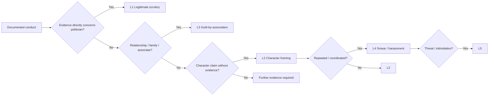
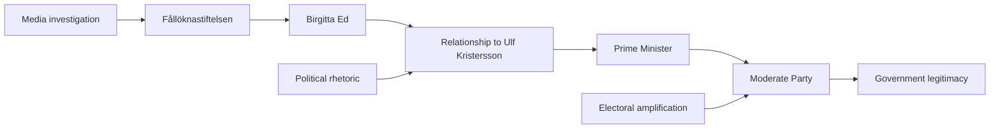
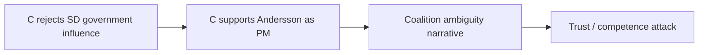
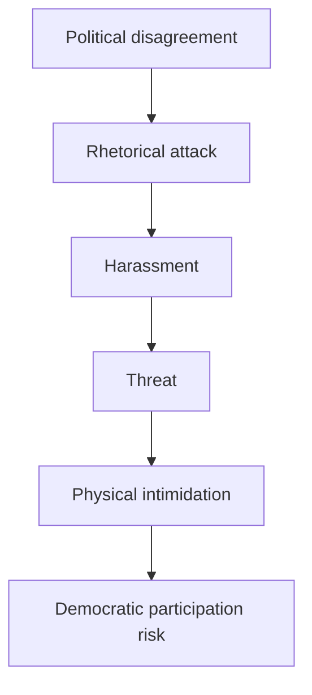
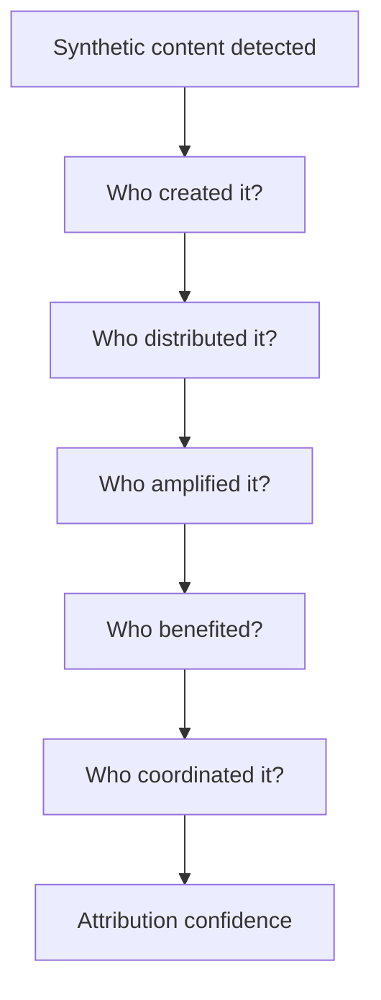
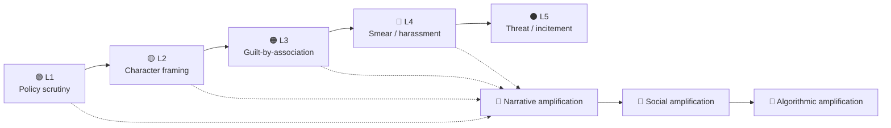
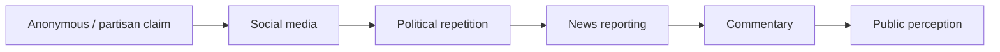
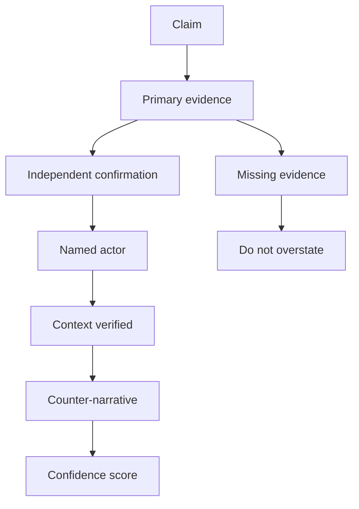

# 🇸🇪 Swedish Election 2026 — Political Attacks, Smears & Influence Operations

> **Hack23 Riksdagsmonitor analytical catalogue**
> Election date: **13 September 2026**
> Coverage period: **2026 election campaign**
> Methodology: [`media-framing-analysis.md`](../templates/media-framing-analysis.md) · [`voter-segmentation.md`](../templates/voter-segmentation.md) · [`election-cycle-analysis.md`](../templates/election-cycle-analysis.md)

---

## 🎯 Executive Summary

The 2026 Swedish election campaign demonstrates a broad spectrum of political attack behaviour ranging from legitimate policy criticism to personalisation, character attacks, family-member instrumentalisation, guilt-by-association, ideological contamination, coalition warfare, harassment, threats and information operations.

The central analytical finding is that **"political attack" should not automatically be equated with "smear"**.

Hack23 therefore separates:

| Level     | Classification              | Description                                                                              |
| --------- | --------------------------- | ---------------------------------------------------------------------------------------- |
| 🟢 **L1** | Legitimate scrutiny         | Evidence-based criticism of conduct, policy or decisions                                 |
| 🟡 **L2** | Character framing           | Personal trust, competence or integrity attacks                                          |
| 🟠 **L3** | Guilt-by-association        | Family, friends, colleagues or affiliated organisations used to attack a political actor |
| 🔴 **L4** | Harassment / smear campaign | Repeated, coordinated or apparently amplified personal attacks                           |
| ⚫ **L5**  | Incitement / threat         | Threats, intimidation or attacks on democratic participation                             |

A second dimension records the **information-operation mechanism**:

* 📰 Media framing
* 🗣️ Political rhetoric
* 📱 Social-media amplification
* 🧩 Guilt-by-association
* 👪 Family-member instrumentalisation
* 🧠 Ideological contamination
* 🤖 Synthetic/AI-generated content
* 🌍 Foreign-influence narrative
* 🗳️ Election-legitimacy attack
* 🚨 Harassment or threat

The catalogue deliberately includes **attacks made by and against all eight parties represented in the Riksdag**. This prevents the analysis itself from becoming partisan.

---

# 1. 🔬 Analytical Framework

## 1.1 Attack ≠ illegitimate criticism

The Hack23 methodology asks:

> **What is the attack mechanism, what evidence supports the underlying claim, and how far is the conclusion being extended beyond that evidence?**

For example:



The classification should therefore describe **the attack mechanism**, not declare whether the political actor is personally guilty.

---

# 2. 🛡️ Private-Person and Family Shield

The strongest example is the controversy involving Prime Minister **Ulf Kristersson**, his wife **Birgitta Ed** and Fållöknastiftelsen.

This case requires particularly careful treatment because it combines:

* a serving prime minister;
* a spouse;
* a privately owned property;
* a foundation;
* government appointments;
* public-sector relationships;
* security arrangements;
* political criticism;
* investigative journalism;
* and electoral weaponisation.

SVT reported that the Fållöknastiftelsen controversy was becoming a political burden for Kristersson and the government. Aftonbladet separately investigated alleged connections involving the foundation, volunteers, property and public appointments.

### Hack23 classification

The existence of a documented relationship does **not automatically constitute guilt-by-association**.

| Claim type                                                                | Classification            |
| ------------------------------------------------------------------------- | ------------------------- |
| Documented activity directly involving Kristersson in official capacity   | 🟢 L1                     |
| Documented governance/conflict-of-interest question                       | 🟢 L1                     |
| Criticism of Kristersson's political judgement                            | 🟡 L2 if evidence is weak |
| Using Ed's conduct as evidence of Kristersson's personal integrity        | 🟠 L3                     |
| Treating Ed's associations as proof Kristersson shares them               | 🟠 L3                     |
| Repeated coordinated personal attacks based primarily on the relationship | 🔴 L4                     |
| Threats or intimidation toward either political actor                     | ⚫ L5                      |

The methodology therefore explicitly supports the concept of:

> **Family-member instrumentalisation → guilt-by-association**

This is not a new category invented for the 2026 election; it is already part of the Hack23 media-framing taxonomy.

---

# 3. 👪 Case Study — Kristersson / Birgitta Ed / Fållöknastiftelsen

### Narrative

The controversy surrounding Fållöknastiftelsen became one of the clearest examples of how a politician's family relationship can become politically salient.

Aftonbladet reported on the foundation, its relationship with the private property, volunteers and connections to people subsequently holding public positions. Other reporting focused on security arrangements and the relationship between the foundation and the prime ministerial household.

SvD subsequently reported internal Moderat frustration concerning the political impact of the controversy surrounding the Kristersson couple.

### Attack-chain model



### Analytical firewall

The analytical object should be:

> **How political actors use the relationship**

rather than:

> **Whether a private spouse is politically responsible for the prime minister.**

That distinction is essential for preventing the Riksdagsmonitor itself from reproducing the attack.

---

# 4. 🟠 Guilt-by-Association — Explicit Hack23 Category

Guilt-by-association occurs when:

> **A political actor is portrayed as responsible, compromised, corrupt, extremist or untrustworthy primarily because of their relationship with another person, organisation or group.**

### Typical structures

```text
Politician
   ↓
Family member
   ↓
Organisation / friend / associate
   ↓
Controversial activity
   ↓
"Therefore politician is compromised"
```

The logical problem is the missing evidentiary link.

### Examples

| Case                                                           | Mechanism                         | Level |
| -------------------------------------------------------------- | --------------------------------- | ----: |
| Kristersson → Birgitta Ed → Fållöknastiftelsen                 | Family-member instrumentalisation | 🟠 L3 |
| Party candidate → controversial individual candidate           | Ideological contamination         | 🟠 L3 |
| Party → individual extremist statement                         | Collective attribution            | 🟠 L3 |
| Politician → foreign-linked associate                          | Foreign-association attack        | 🟠 L3 |
| Coalition partner → controversial statement by another partner | Coalition contamination           | 🟠 L3 |

The existence of a relationship is evidence of a relationship — **not automatically evidence of shared intent**.

---

# 5. 🏛️ Party-by-Party Attack Coverage

The catalogue should deliberately cover the complete parliamentary field.

## 5.1 🔴 Socialdemokraterna — S

### Major attack vectors

**S is both an attacker and a target.**

The campaign has repeatedly framed the election as a choice between:

* a Social Democrat-led government;
* and a government involving Sverigedemokraterna.

International coverage also identified the question of SD entering government as a central campaign fault line.

### Examples

**Coalition / ideological attack**

S has attacked the prospect of SD entering government as a democratic and ideological risk.

Classification:

> 🟡 **L2 — ideological/character framing**

when the argument moves from documented SD history/policy into claims about the personal character or democratic intentions of every supporter.

**Economic attack**

Magdalena Andersson has attacked the government's economic management, including claims concerning the state finances.

Classification:

> 🟢 **L1** where supported by verifiable fiscal evidence.
> 🟡 **L2** when converted into broad competence/character claims.

**Counterattack**

Andersson was herself subject to personal framing when Jimmie Åkesson asked:

> "Varför är du så sur?"

The incident was widely reported by SVT, Expressen and other media.

Hack23 classification:

> 🟡 **L2 — gendered/personal character framing**

rather than substantive policy criticism.

---

# 6. 🔵 Moderaterna — M

## Kristersson: leadership, competence and family association

The M campaign has faced several attack vectors:

* leadership competence;
* government performance;
* relationship with SD;
* Birgitta Ed/Fållöknastiftelsen;
* coalition stability;
* economic and crime-policy performance.

The Fållöknastiftelsen story generated internal M concern according to SvD, while SVT characterised the issue as becoming a burden for Kristersson.

### Attack types

| Attack                                             | Type                               |
| -------------------------------------------------- | ---------------------------------- |
| Government policy criticism                        | 🟢 L1                              |
| Kristersson leadership criticism                   | 🟡 L2                              |
| Kristersson ↔ Birgitta Ed                          | 🟠 L3                              |
| Kristersson ↔ SD                                   | 🟠 L3 / coalition association      |
| "Kristersson is controlled by SD" without evidence | 🟡/🟠                              |
| Repeated personal attacks                          | 🔴 L4 if coordination demonstrated |

---

# 7. 🟡 Sverigedemokraterna — SD

SD has been one of the most important sources and targets of campaign attacks.

### 7.1 Åkesson → Andersson

The "sur" exchange is a textbook example of personalisation rather than policy criticism. SVT reported criticism from both Andersson and Ebba Busch, while Expressen covered the exchange directly.

Classification:

> 🟡 **L2 — personal character framing**

### 7.2 SD → KD

Åkesson questioned whether voters could trust Ebba Busch/KD, particularly in relation to the possibility of supporting a Social Democrat-led government.

SVT characterised the increasingly hostile Tidö relationship as evidence of growing internal tension.

Classification:

> 🟡 **L2 — coalition loyalty/trust attack**

### 7.3 SD → L

Åkesson urged SD voters not to give tactical support to Liberalerna.

This is not necessarily a smear. It is better classified as:

> 🟢 **L1 — strategic electoral competition**

unless accompanied by unsupported personal allegations.

---

# 8. 🟠 Kristdemokraterna — KD

## Ebba Busch as both attacker and target

KD provides an unusually clear example of reciprocal attack escalation.

Busch accused M and SD of:

> "smutskastning och struntprat"

and alleged that incorrect claims had been spread through speeches, social media and door-to-door campaigning. SVT and Aftonbladet both reported the dispute.

Classification:

> 🟡 **L2 allegation of character/political attack**

The allegation becomes:

> 🔴 **L4**

only if independent evidence establishes coordinated amplification or campaign-level coordination.

### Busch → Dadgostar

In the final debate, Busch described Nooshi Dadgostar as a "Hamaskramare".

SVT and TV4 reported the exchange.

Classification:

> 🟡 **L2 — ideological/association attack**

The analytical question is whether the allegation concerns documented V policy/behaviour or uses association with Hamas to imply personal allegiance without sufficient evidence.

---

# 9. 🟣 Vänsterpartiet — V

V has experienced one of the strongest examples of **ideological contamination** during the election campaign.

SVT reported revelations concerning individual V representatives accused of:

* antisemitism;
* Hamas praise;
* terrorism-related sympathies;
* extremist statements.

SVT's political analysis explicitly noted the impact of these individual cases on V's coalition and government ambitions.

### Hack23 classification

Individual documented behaviour:

> 🟢 **L1 — legitimate scrutiny**

Moving from:

> "Candidate X made statement Y"

to:

> "Vänsterpartiet / all V voters share Y"

becomes:

> 🟠 **L3 — ideological contamination / guilt-by-association**

unless party-level evidence supports the broader claim.

This distinction is particularly important because V has thousands of representatives and members.

---

# 10. 🟢 Centerpartiet — C

C has faced a different form of attack: **strategic ambiguity and coalition legitimacy framing**.

C has stated that it does not want extremist parties to have government influence, while simultaneously supporting a possible government under Magdalena Andersson. SVT described the combination as potentially difficult for voters to understand.

### Attack pattern



Classification:

> 🟡 **L2 — strategic competence/trust framing**

when political opponents portray C's coalition strategy as evidence that the party cannot be trusted.

### M/L → C

Expressen reported an explicit Liberal strategy to attack Centerpartiet, while later reporting described M and L attacking C together.

Classification:

> 🟢/🟡 **L1-L2 depending on claim**

Policy competition is legitimate; unsupported claims about C's motives or integrity belong in L2.

---

# 11. 🟦 Liberalerna — L

L has been subject to unusually intense **electoral survival framing** because of the parliamentary threshold.

SVT reported that L's campaign strategy increasingly relied on tactical voting and the argument that an L vote was necessary for continuation of a Tidö government.

At the same time, Expressen reported an explicit L strategy of attacking C.

### Attack taxonomy

| Narrative                                      |                    Classification |
| ---------------------------------------------- | --------------------------------: |
| "Vote L to keep government coalition possible" |                             🟢 L1 |
| "L has abandoned liberalism"                   |                             🟡 L2 |
| "L cannot be trusted"                          |                             🟡 L2 |
| "L is effectively controlled by M/SD"          | 🟠 L3 if evidence is insufficient |
| "A vote for L is wasted"                       |              🟡 electoral framing |

SVT's analysis noted that L's tactical-vote strategy appeared to be gaining traction shortly before election day.

---

# 12. 🟩 Miljöpartiet — MP

MP has been targeted primarily through **policy competence and economic-cost framing**, particularly around climate and nuclear power.

SVT reported Daniel Helldén attacking the government's nuclear-power plans and warning about the financial implications. The same analysis highlighted tensions between S and MP over nuclear power.

### Attack mechanism

> "MP's climate policy is economically irresponsible."

This is:

> 🟢 **L1** if based on measurable fiscal/economic claims.

It becomes:

> 🟡 **L2**

when transformed into claims that MP politicians are inherently economically incompetent or detached from reality.

### MP as target of election disruption

SVT also reported theft of both S and MP election posters in Sölvesborg, with local representatives describing the incidents as an attack on democracy.

This should be recorded separately from rhetorical attacks:

> ⚫ **Democratic participation interference**

rather than ordinary political rhetoric.

---

# 13. ⚫ Direct Threats and Democratic Participation

One of the most serious categories is not rhetorical disagreement but intimidation.

Examples should receive their own register because they affect democratic participation:



The Hack23 register should therefore include:

* threats against candidates;
* threats against activists;
* attacks on party offices;
* destruction/theft of election material;
* intimidation of campaign workers;
* violence against political volunteers.

These are **L5 democratic-security incidents**, not merely "negative campaigning".

---

# 14. 🤖 AI, Deepfakes and Synthetic Media

The 2026 election also requires a separate synthetic-media track.

SVT's election security reporting highlighted:

* deepfakes;
* cyberattacks;
* social-media influence operations;
* foreign influence;
* AI-generated political material.

The methodology explicitly requires separating:

> **synthetic content detected**

from:

> **actor attribution established**.

### Attribution ladder



**Never collapse these questions into one.**

---

# 15. 🌍 Foreign Influence and Russia-Association Attacks

Claims involving Russia require a particularly high evidentiary standard.

Hack23 methodology requires:

* competing hypotheses;
* multiple independent indicators;
* no attribution based solely on ideological similarity;
* separation of "Russian narrative" from "Russian operation";
* separation of "Russian contact" from "Russian control".

### Example

```text
Politician
   ↓
Associate
   ↓
Russian contact
   ↓
"Therefore politician is Russian-controlled"
```

The final step is **not automatically supported**.

Classification:

> 🟠 **L3 guilt-by-association**

unless independent evidence demonstrates control, coordination or operational involvement.

---

# 16. 🗳️ Election-Legitimacy Attacks

A separate category should cover claims that the election itself is illegitimate.

Examples include narratives around:

* missing ballots;
* alleged ballot fraud;
* election administration;
* voting irregularities;
* manipulated polls;
* alleged electoral interference.

The analytical distinction is crucial:

| Evidence                                        | Classification                  |
| ----------------------------------------------- | ------------------------------- |
| Documented voting error                         | 🟢 L1                           |
| Documented administrative failure               | 🟢 L1                           |
| Political criticism of administration           | 🟢/🟡                           |
| Unsupported claim of systematic fraud           | 🔴 L4                           |
| Call to reject election result without evidence | ⚫ L5 democratic legitimacy risk |

---

# 17. 🧩 Multilingual / Targeted Influence

Riksdagsmonitor should maintain a dedicated multilingual influence category.

The campaign has seen false Arabic-language claims suggesting that immigrants or other voters could face deportation depending on how they voted.

This is especially important because it combines:

* targeted demographic messaging;
* electoral intimidation;
* false government claims;
* social-media distribution;
* potential AI-generated content.

The responsible analytical classification is:

> 🔴 **L4 influence operation candidate**

while **actor attribution remains unresolved unless coordination evidence exists**.

---

# 18. 📰 Event Hijacking

Political actors and networks can exploit unrelated criminal or tragic events to reinforce pre-existing political narratives.

The Karlstad murder case illustrates this mechanism: false claims about the perpetrators' background and motives circulated and the incident became incorporated into political narratives.

The correct analytical label is:

> **Event hijacking / narrative exploitation**

rather than automatically:

> **Coordinated disinformation campaign**

unless coordination can be demonstrated.

---

# 19. 📊 Complete Party Coverage Matrix

| Party     | Major attack/target themes                                                    | Primary Hack23 mechanism              |
| --------- | ----------------------------------------------------------------------------- | ------------------------------------- |
| 🔴 **S**  | SD government, economic competence, coalition politics, Andersson personality | Coalition framing / character attack  |
| 🔵 **M**  | Kristersson leadership, Birgitta Ed, government performance, SD relationship  | 🟠 Guilt-by-association               |
| 🟡 **SD** | Andersson, KD, L, foreign/security narratives                                 | 🟡 Personalisation / coalition attack |
| 🟠 **KD** | V, M, SD, coalition loyalty                                                   | 🟡 Ideological & coalition attack     |
| 🟣 **V**  | Hamas/antisemitism allegations, government suitability                        | 🟠 Ideological contamination          |
| 🟢 **C**  | Coalition ambiguity, government positioning                                   | 🟡 Trust/strategy attack              |
| 🔷 **L**  | C, electoral threshold, liberal identity                                      | 🟡 Competence/identity framing        |
| 🟩 **MP** | Nuclear policy, economic cost, climate competence                             | 🟢/🟡 Policy competence framing       |

This gives Riksdagsmonitor a **balanced target map** rather than focusing disproportionately on the largest parties.

---

# 20. 🔥 Attack Escalation Model



Not every attack follows this path.

Some attacks begin directly at L3 or L4.

---

# 21. 🧠 Narrative Laundering Model

A recurring pattern worth monitoring is:



The fact that a claim eventually appears in a newspaper **does not validate the original claim**.

Riksdagsmonitor should therefore record:

* original source;
* first political amplifier;
* first mainstream-media appearance;
* independent verification;
* subsequent repetition;
* whether the original uncertainty survived the amplification chain.

---

# 22. 🎯 Voter-Segment Impact

Using [`voter-segmentation.md`](../templates/voter-segmentation.md), attack narratives should be mapped against established segments rather than invented micro-targets.

| Attack                    | Young urban | Families | Retired | Rural | Low income | High income |
| ------------------------- | ----------: | -------: | ------: | ----: | ---------: | ----------: |
| SD government risk        |          🟠 |       🟠 |      🟠 |    🟠 |         🟠 |          🟡 |
| Crime / security          |          🟠 |       🔴 |      🔴 |    🟠 |         🔴 |          🟡 |
| Migration                 |          🟠 |       🟠 |      🟠 |    🔴 |         🟠 |          🟡 |
| Climate / nuclear         |          🔴 |       🟠 |      🟡 |    🟠 |         🟡 |          🟠 |
| Fållöknastiftelsen        |          🟡 |       🟡 |      🟠 |    🟡 |         🟡 |          🟠 |
| Coalition instability     |          🟠 |       🔴 |      🔴 |    🟠 |         🟠 |          🟠 |
| Election fraud narratives |          🟠 |       🟠 |      🔴 |    🔴 |         🟠 |          🟡 |
| AI/deepfake manipulation  |          🔴 |       🟠 |      🟡 |    🟠 |         🟠 |          🟡 |

These are **analytical hypotheses**, not polling results.

---

# 23. 📈 Attack Register

Riksdagsmonitor should maintain structured records using a model similar to:

| Field               | Purpose                                         |
| ------------------- | ----------------------------------------------- |
| `attack_id`         | Stable identifier                               |
| `date`              | First observed date                             |
| `target_party`      | Target                                          |
| `target_actor`      | Individual target                               |
| `attacker_party`    | Political source if known                       |
| `attacker_actor`    | Named actor                                     |
| `attack_type`       | Taxonomy                                        |
| `severity`          | L1–L5                                           |
| `claim`             | Exact claim                                     |
| `evidence_status`   | Verified / disputed / unsupported               |
| `association_type`  | Family / party / associate / foreign            |
| `medium`            | Speech / debate / social / media                |
| `source_url`        | Original source                                 |
| `media_sources`     | Independent reporting                           |
| `counter_narrative` | Response                                        |
| `voter_segments`    | Impacted segments                               |
| `DISARM_TTP`        | Influence mechanism                             |
| `RRPA`              | Reach / resonance / persistence / amplification |
| `confidence`        | Analytical confidence                           |
| `attribution`       | Actor attribution confidence                    |

---

# 24. 📚 Source Diversity Requirement

Each significant incident should ideally have:

### Tier 1 — Primary

* Riksdagen
* party statements
* official government material
* official election authorities
* public speeches
* public social-media posts

### Tier 2 — Public-service journalism

* SVT
* Sveriges Radio

### Tier 3 — Commercial Swedish media

* Aftonbladet
* Expressen
* Dagens Nyheter
* Svenska Dagbladet
* TV4
* Omni
* TT

### Tier 4 — International

* Reuters
* AP
* Financial Times
* The Guardian
* other reputable international outlets

### Tier 5 — Social media

Used primarily to document:

* original wording;
* amplification;
* timing;
* spread;
* narrative evolution.

Social media should **not automatically be treated as evidence of truth**.

---

# 25. 📰 Recommended Media Source Register

The catalogue should retain source diversity rather than relying exclusively on one newspaper.

### Birgitta Ed / Fållöknastiftelsen

* SVT investigation and political analysis
* Aftonbladet investigative reporting
* Svenska Dagbladet reporting on internal M reactions
* Omni aggregation and chronology

### KD / M / SD conflict

* SVT
* Aftonbladet
* Expressen
* TV4

### V / Hamas / antisemitism controversy

* SVT
* Expressen
* Riksdag debate record
* other independent reporting

### C / L electoral strategy

* SVT
* Expressen
* DN
* other election coverage

### Election influence / AI / deepfakes

* SVT
* SR
* Valmyndigheten
* Säkerhetspolisen
* Myndigheten för psykologiskt försvar

The objective is **not to select sources that agree with each other**, but to establish a traceable evidence chain.

---

# 26. ⚖️ Evidence Rules

Every attack record should answer five questions:

### 1. Who said it?

Named actor whenever possible.

### 2. What exactly was said?

Preserve the smallest necessary quotation and the surrounding context.

### 3. What evidence supports it?

Link to primary evidence.

### 4. What does the evidence *not* establish?

This is critical for guilt-by-association analysis.

### 5. Who amplified it?

Record political, media and social amplification separately.

---

# 27. 🧪 Confidence Model



Recommended confidence labels:

* 🟢 **High** — primary evidence + independent corroboration
* 🟡 **Medium** — credible public evidence but incomplete corroboration
* 🟠 **Low** — allegation or contested claim
* 🔴 **Unverified** — no sufficient evidence

---

# 28. 🚫 What Riksdagsmonitor Must Not Do

The project should not:

* label every criticism a smear;
* repeat unverified allegations as facts;
* infer political control from association alone;
* attribute operations to Russia without evidence;
* treat social-media virality as proof of coordination;
* infer party-wide ideology from one candidate;
* treat a spouse as politically responsible for a politician;
* infer voter motivation without evidence;
* manufacture numerical impact estimates;
* turn investigative reporting into an accusation of guilt;
* confuse political rhetoric with an information operation.

---

# 29. 🧭 Analytical Principle

The strongest version of the Riksdagsmonitor attack catalogue is therefore:

> **Evidence first. Attribution second. Classification third. Impact last.**

The objective is not to determine which party is "the worst attacker".

The objective is to identify:

1. **who attacked whom;**
2. **what narrative was used;**
3. **what evidence supported the claim;**
4. **whether association was substituted for evidence;**
5. **how the narrative propagated;**
6. **which voter segments were potentially targeted;**
7. **whether the attack escalated into harassment or threats;**
8. **whether coordination can actually be demonstrated.**

---

# 30. 🏁 Election 2026 Assessment

The 2026 campaign shows a shift from conventional policy competition toward increasingly personalised and coalition-centred campaigning.

The most important attack mechanisms are:

1. 👤 **Personalisation**
2. 👪 **Family-member instrumentalisation**
3. 🟠 **Guilt-by-association**
4. 🧩 **Ideological contamination**
5. 🤝 **Coalition loyalty attacks**
6. 📱 **Social-media amplification**
7. 🤖 **Synthetic-media / AI manipulation**
8. 🗳️ **Election-legitimacy narratives**
9. 🚨 **Threats and intimidation**
10. 🌍 **Foreign-influence narratives**

The **Kristersson–Birgitta Ed case** is particularly valuable for the methodology because it demonstrates why the distinction between legitimate scrutiny and guilt-by-association matters.

The reporting contains substantive questions about governance, conflicts of interest, security and public trust. Those questions can legitimately be investigated.

However, the analytical error would be to move automatically from:

> **"Birgitta Ed is associated with X"**

to:

> **"Therefore Ulf Kristersson is responsible for X."**

That evidentiary leap is precisely what the Hack23 **L3 Guilt-by-Association** category is designed to identify.

The same principle applies symmetrically to every party.

> **A political attack should be classified by its evidence, mechanism and propagation — not by whether Hack23 agrees with the political position of either the attacker or the target.**

---

## 🔗 Methodology

* [`analysis/templates/media-framing-analysis.md`](../templates/media-framing-analysis.md)
* [`analysis/templates/voter-segmentation.md`](../templates/voter-segmentation.md)
* [`analysis/templates/election-cycle-analysis.md`](../templates/election-cycle-analysis.md)
* [`analysis/methodologies/electoral-domain-methodology.md`](../methodologies/electoral-domain-methodology.md)
* [`analysis/methodologies/ai-driven-analysis-guide.md`](../methodologies/ai-driven-analysis-guide.md)
* [`Article-Generation.md`](../../Article-Generation.md)
* [`DATA_MODEL.md`](../../DATA_MODEL.md)

---

## 📌 Recommended Repository Location

`analysis/election-2026/attack-and-influence-report.md`

**Status:** Living analytical document — update through election day and post-election review.

**Scope:** Public information only. No private-account material, hacked/leaked material, paywall circumvention or unsupported attribution.

**Core rule:**

### 🔐 *Document the attack. Do not become part of it.*
