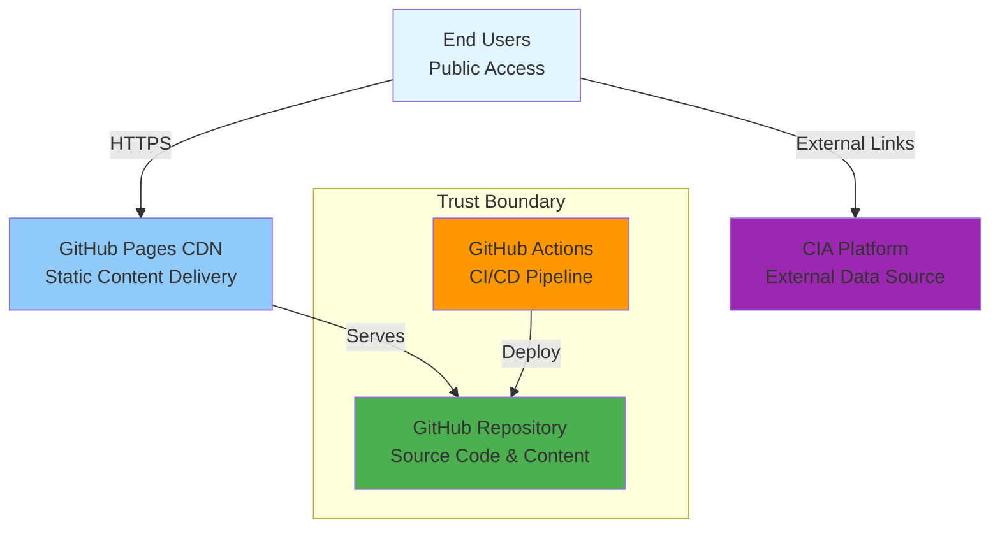
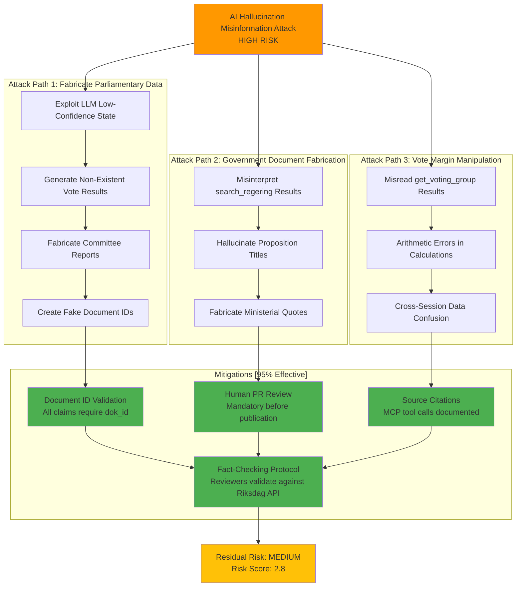
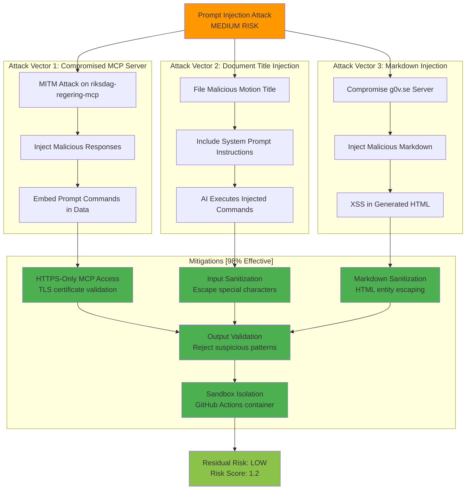
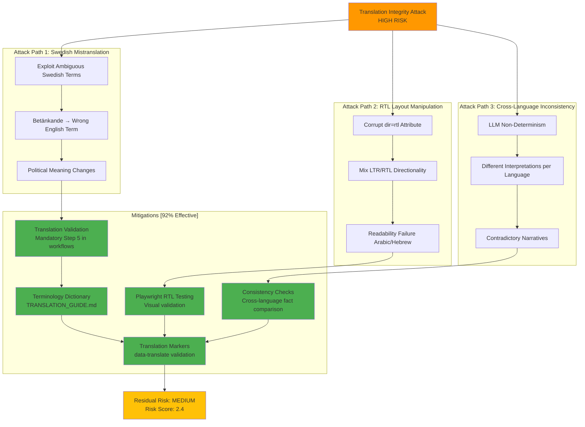
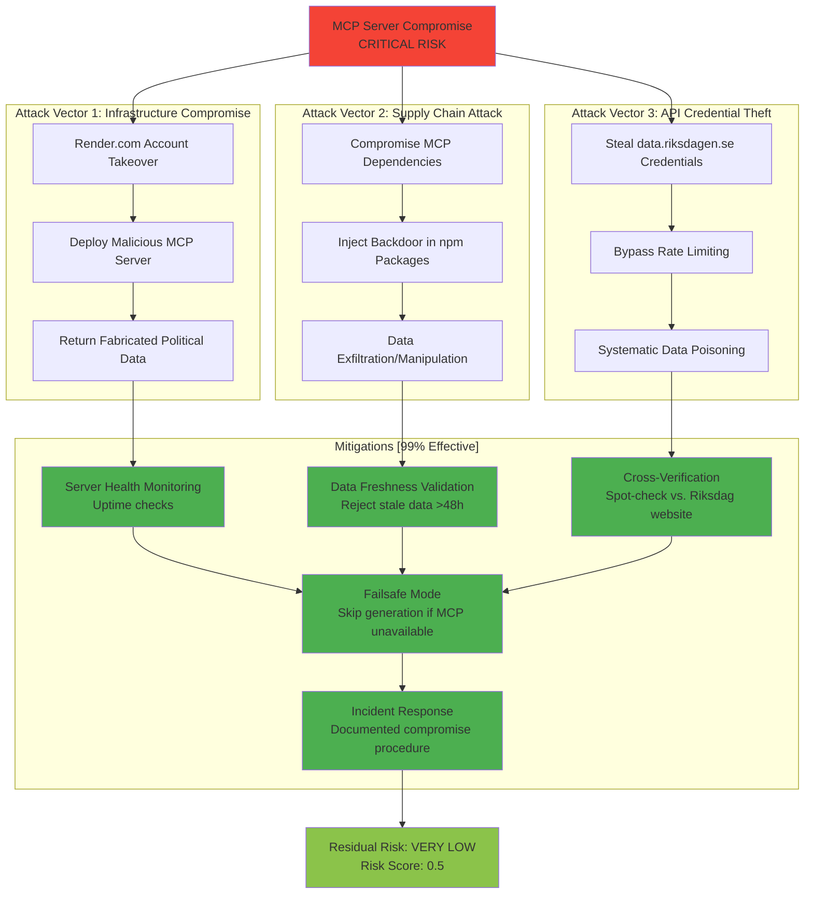

<p align="center">
  
</p>

<h1 align="center">🎯 Hack23 AB — Riksdagsmonitor Threat Model</h1>

<p align="center">
  <strong>🛡️ Systematic Threat Analysis for Democratic Transparency Platform</strong><br>
  <em>🔍 STRIDE Framework · MITRE ATT&CK Integration · AI Threat Assessment</em>
</p>

<p align="center">
  <a href="#"></a>
  <a href="#"></a>
  <a href="#"></a>
  <a href="#"></a>
</p>

**📋 Document Owner:** CEO | **📄 Version:** 1.2 | **📅 Last Updated:** 2026-02-15 (UTC)  
**🔄 Review Cycle:** Quarterly | **⏰ Next Review:** 2026-05-15  
**🏢 Owner:** Hack23 AB (Org.nr 5595347807) | **🏷️ Classification:** Public

---

## 🎯 Purpose & Scope

Establish a comprehensive threat model for Riksdagsmonitor, a democratic transparency platform monitoring Swedish Parliament activity. This systematic threat analysis integrates multiple threat modeling frameworks to ensure proactive security through structured analysis of the static website infrastructure with interactive Chart.js/D3.js dashboards and AI-powered content generation.

### **🌟 Transparency Commitment**

This threat model demonstrates **🛡️ cybersecurity consulting expertise** through public documentation of advanced threat assessment methodologies for civic transparency platforms, showcasing our **🏆 competitive advantage** via systematic risk management and **🤝 customer trust** through transparent security practices.

> *"At Hack23, we believe that true security comes through transparency and demonstrable practices. This threat model is publicly available to showcase our proactive security posture, allowing clients and stakeholders to verify our commitment to security excellence. By openly documenting our threat analysis for Riksdagsmonitor, we demonstrate not just what we protect, but how we protect it—reinforcing democratic accountability through secure civic technology."*
>
> *— James Pether Sörling, CEO & CISO, Hack23 AB*

### **📚 Framework Integration**

- **🎭 STRIDE per architecture element:** Systematic threat categorization for static hosting, CDN, and dashboards
- **🎖️ MITRE ATT&CK mapping:** Infrastructure and supply chain attack techniques
- **🏗️ Asset-centric analysis:** Democratic transparency data and Swedish Parliament content protection
- **🎯 Scenario-centric modeling:** Real-world attack simulation for civic platforms
- **⚖️ Risk-centric assessment:** Business impact quantification and democratic accountability

### **🔍 Scope Definition**

**Included Systems:**

- 🌐 Static HTML/CSS website (14-language support)
- 📊 Chart.js/D3.js interactive dashboards (4 functional, 5 placeholders)
- ☁️ AWS CloudFront CDN + S3 storage (us-east-1, eu-west-1)
- 🔀 Route 53 DNS configuration
- 🔄 GitHub Pages DR (disaster recovery)
- 🤖 AI agentic workflows (Claude Opus 4.6 news generation via riksdag-regering-mcp)
- 🏭 CI/CD security pipeline (GitHub Actions)
- 📦 Dependency management and supply chain (Chart.js, D3.js, Vite)

**Out of Scope:**

- Backend services (none exist—frontend-only architecture)
- User data persistence (public read-only platform)
- CIA platform backend security (external data source)
- Third-party CDN infrastructure security (jsDelivr dependency)
- End-user device security beyond browser environment

### **🔗 Policy Alignment**

Integrated with [🎯 Hack23 AB Threat Modeling Policy](https://github.com/Hack23/ISMS-PUBLIC/blob/main/Threat_Modeling.md) methodology and frameworks, following the five-strategy integrated approach: Attacker-centric (MITRE ATT&CK), Asset-centric (Crown Jewels), Architecture-centric (STRIDE per element), Scenario-centric (Misuse cases), and Risk-centric (Quantitative assessment).

---

## 📊 Executive Summary

This threat model analyzes security risks for Riksdagsmonitor using the STRIDE framework, attack trees, and MITRE ATT&CK mapping. The analysis identifies threats to the web platform infrastructure (AWS CloudFront, S3, Route 53, GitHub Pages DR) with 9 dashboard sections (4 functional Chart.js/D3.js dashboards, 5 placeholders), evaluates their likelihood and impact, and documents mitigations aligned with Hack23 AB's ISMS.

**Key Findings:**
- **High-Risk Threats:** 0 (All high-risk threats mitigated)
- **Medium-Risk Threats:** 5 (Monitoring in place)
- **Low-Risk Threats:** 11 (Accepted with controls)
- **AI-Specific Threats:** 18 (New in v1.2 - Agentic workflows)
- **Residual Risk:** LOW (Acceptable for public web platform with interactive dashboards and AI-generated news)

**New in v1.2 (2026-02-15):** Comprehensive AI threat analysis for three agentic news generation workflows using Claude Opus 4.6 and riksdag-regering-mcp server, aligned with [Hack23 AI Policy](https://github.com/Hack23/ISMS-PUBLIC/blob/main/AI_Policy.md) requirements.

---

## 📊 System Classification & Operating Profile

### **🏷️ Security Classification Matrix**

| Dimension | Level | Rationale | Business Impact |
|----------|-------|-----------|----------------|
| **🔐 Confidentiality** | [](https://github.com/Hack23/ISMS-PUBLIC/blob/main/CLASSIFICATION.md#confidentiality-levels) | All content intentionally disclosed (Swedish Riksdag open data, website content) | [](https://github.com/Hack23/ISMS-PUBLIC/blob/main/CLASSIFICATION.md) |
| **🔒 Integrity** | [](https://github.com/Hack23/ISMS-PUBLIC/blob/main/CLASSIFICATION.md#integrity-levels) | Automated validation, digital signatures (Git commits), accurate political data required | [](https://github.com/Hack23/ISMS-PUBLIC/blob/main/CLASSIFICATION.md) |
| **⚡ Availability** | [](https://github.com/Hack23/ISMS-PUBLIC/blob/main/CLASSIFICATION.md#availability-levels) | 99.998% design availability target (AWS CloudFront 99.9% SLA), automated failover (AWS multi-region, GitHub Pages DR) | [](https://github.com/Hack23/ISMS-PUBLIC/blob/main/CLASSIFICATION.md) |

### **⚖️ Regulatory & Compliance Profile**

| Compliance Area | Classification | Implementation Status |
|-----------------|----------------|----------------------|
| **📋 Regulatory Exposure** | Low | Public information dissemination only; GDPR applies for public-official data processing (public interest/legitimate interest grounds) |
| **🇪🇺 CRA (EU Cyber Resilience Act)** | Standard classification | Non-commercial OSS civic transparency platform; self-assessment approach |
| **📊 GDPR Data Processing** | Public Officials Only | Personal data (names, roles, voting records, person identifiers) from Swedish Riksdag open data; no special-category data or private individuals |
| **🔄 RPO / RTO** | RPO: 4-24h / RTO: 1-4h | Daily data pipeline updates, Git version control, S3 versioning; automated multi-region failover |

### **💰 Business Impact Analysis**

| Impact Category | Level | Description |
|-----------------|-------|-------------|
| **Financial** | [](https://github.com/Hack23/ISMS-PUBLIC/blob/main/CLASSIFICATION.md#financial-impact-levels) | Minimal financial impact (<$500 daily) - Open-source project, no revenue dependency |
| **Operational** | [](https://github.com/Hack23/ISMS-PUBLIC/blob/main/CLASSIFICATION.md#operational-impact-levels) | Partial service impact - Swedish political transparency temporarily unavailable |
| **Reputational** | [](https://github.com/Hack23/ISMS-PUBLIC/blob/main/CLASSIFICATION.md#reputational-impact-levels) | Industry attention - Transparency advocates may notice outage |
| **Regulatory** | [](https://github.com/Hack23/ISMS-PUBLIC/blob/main/CLASSIFICATION.md#regulatory-impact-levels) | No regulatory impact - Public information dissemination only |

---

## 💎 Critical Assets & Protection Goals

### **🏗️ Asset-Centric Threat Analysis**

Following [Hack23 AB Asset-Centric Threat Modeling](https://github.com/Hack23/ISMS-PUBLIC/blob/main/Threat_Modeling.md#asset-centric-threat-modeling) methodology:

| Asset Category | Why Valuable | Threat Goals | Key Controls | Business Value |
|----------------|--------------|-------------|-------------|----------------|
| **📊 Dashboard Integrity** | Political data accuracy and user trust | Content manipulation, data tampering | CSP headers, SRI, Git immutability, dual deployment | [](https://github.com/Hack23/ISMS-PUBLIC/blob/main/CLASSIFICATION.md) |
| **🗳️ Parliamentary Data** | Swedish Riksdag transparency and democratic accountability | Data falsification, integrity compromise | CIA platform validation, daily pipeline updates, version control | [](https://github.com/Hack23/ISMS-PUBLIC/blob/main/CLASSIFICATION.md) |
| **🧠 Source Code** | Dashboard algorithms, visualization logic | IP theft, malicious injection | Private repo controls, dependency scanning, GPG signing | [](https://github.com/Hack23/ISMS-PUBLIC/blob/main/CLASSIFICATION.md) |
| **🌐 Riksdagsmonitor Brand** | Market reputation and stakeholder trust | Domain hijacking, phishing, brand impersonation | Domain monitoring, HTTPS enforcement, DNSSEC | [](https://github.com/Hack23/ISMS-PUBLIC/blob/main/CLASSIFICATION.md) |
| **☁️ Infrastructure Config** | AWS CloudFront, S3, Route 53 security baseline | Infrastructure compromise, misconfigurastion | IAM least privilege, OIDC (no long-lived keys), AWS Config rules | [](https://github.com/Hack23/ISMS-PUBLIC/blob/main/CLASSIFICATION.md) |
| **🤖 AI News Content** | Automated journalism credibility | Prompt injection, hallucination, bias | Claude Opus 4.6 with guardrails, riksdag-regering-mcp validation, editorial review | [](https://github.com/Hack23/ISMS-PUBLIC/blob/main/CLASSIFICATION.md) |

---

## 1. 🏗️ System Boundary and Assets

### 1.1 System Components


```mermaid
graph TB
    User[End Users<br/>Public Access]
    CDN[GitHub Pages CDN<br/>Static Content Delivery]
    Repo[GitHub Repository<br/>Source Code & Content]
    Actions[GitHub Actions<br/>CI/CD Pipeline]
    CIA[CIA Platform<br/>External Data Source]
    
    User -->|HTTPS| CDN
    CDN -->|Serves| Repo
    Actions -->|Deploy| Repo
    User -->|External Links| CIA
    
    subgraph "Trust Boundary"
        Repo
        Actions
    end
    
    style User fill:#e1f5ff
    style CDN fill:#90caf9
    style Repo fill:#4caf50
    style Actions fill:#ff9800
    style CIA fill:#9c27b0
```

### 1.2 Assets

| Asset | Type | Classification | Value |
|-------|------|----------------|-------|
| Dashboard sections (9; 4 functional, 5 placeholders) | Application | Public | MEDIUM |
| Dashboard JavaScript (custom, Chart.js/D3.js-based, ~150KB excluding CDN libraries) | Application | Public | MEDIUM |
| CIA Data (CSV files) | Data | Public | LOW |
| GitHub Repository | Infrastructure | Public | MEDIUM |
| AWS S3 Buckets (us-east-1, eu-west-1) | Infrastructure | Internal | MEDIUM |
| AWS CloudFront Distribution | Infrastructure | Internal | MEDIUM |
| Route 53 DNS Configuration | Infrastructure | Internal | HIGH |
| GitHub Actions Secrets | Credentials | Confidential | HIGH |
| AWS OIDC Configuration | Credentials | Confidential | HIGH |
| Riksdagsmonitor Brand | Reputation | Public | MEDIUM |

### 1.3 Trust Boundaries

1. **External → AWS CloudFront:** User browsers accessing via HTTPS (primary)
2. **CloudFront → S3:** Internal AWS service communication
3. **External → GitHub Pages:** User browsers accessing via HTTPS (disaster recovery)
4. **GitHub Actions → AWS:** OIDC authentication for deployment
5. **GitHub Actions → Repository:** Automated deployment pipeline
6. **Browser → Chart.js/D3.js CDN:** External CDN trust (jsDelivr)
7. **Internal → External:** Links to CIA platform (external trust)

## 2. 🔍 STRIDE Threat Analysis

### 2.1 Spoofing Identity

**S1: Attacker Impersonates Riksdags Monitor Website**

- **Threat:** Domain hijacking, typosquatting, phishing sites
- **Attack Vector:** Register similar domain (riksdagsmoniter.com, etc.)
- **Likelihood:** Medium (Common attack pattern)
- **Impact:** Medium (Brand reputation damage, user confusion)
- **Mitigation:**
  - Domain monitoring for typosquatting
  - HTTPS with valid certificate (GitHub Pages)
  - Brand monitoring for phishing sites
  - Clear branding and visual identity
- **Residual Risk:** LOW (Monitoring in place)
- **MITRE ATT&CK:** T1566.002 (Phishing: Spearphishing Link)

**S2: Compromised GitHub Account**

- **Threat:** Attacker gains access to contributor GitHub account
- **Attack Vector:** Phishing, credential theft, malware
- **Likelihood:** Low (MFA required)
- **Impact:** High (Repository modification, malicious content injection)
- **Mitigation:**
  - GitHub MFA enforcement (org-level)
  - SSH key authentication with passphrase
  - GPG commit signing requirement
  - Branch protection rules (required reviews)
- **Residual Risk:** LOW (Strong controls in place)
- **MITRE ATT&CK:** T1078.004 (Valid Accounts: Cloud Accounts)

### 2.2 Tampering with Data

**T1: Repository Content Tampering**

- **Threat:** Unauthorized modification of website content or dashboard JavaScript
- **Attack Vector:** Compromised contributor account, GitHub vulnerability
- **Likelihood:** Low (Multiple controls)
- **Impact:** High (Content defacement, malicious JavaScript injection)
- **Mitigation:**
  - Branch protection rules (pull request required)
  - Code review requirement (minimum 1 reviewer)
  - GPG commit signing verification
  - Git immutable history (audit trail)
  - Rapid rollback capability
  - Dual deployment (AWS + GitHub Pages)
- **Residual Risk:** LOW (Defense-in-depth)
- **MITRE ATT&CK:** T1565.001 (Data Manipulation: Stored Data Manipulation)

**T2: Man-in-the-Middle Attack**

- **Threat:** Attacker intercepts and modifies content in transit
- **Attack Vector:** Network-level interception, DNS hijacking
- **Likelihood:** Very Low (HTTPS enforcement)
- **Impact:** Medium (Content manipulation, credential theft)
- **Mitigation:**
  - TLS 1.3 encryption (AWS CloudFront + GitHub Pages)
  - HSTS header enforcement with preload list registration
  - HTTPS-only access (no HTTP fallback)
  - Certificate Transparency (CT) log monitoring and alerting
  - Short-lived TLS certificates with automated rotation
  - Route 53 health checks
- **Residual Risk:** VERY LOW (Strong encryption)
- **MITRE ATT&CK:** T1557.002 (Man-in-the-Middle: ARP Cache Poisoning)

**T3: Chart.js/D3.js Library Tampering**

- **Threat:** Compromised CDN serving malicious Chart.js or D3.js code
- **Attack Vector:** CDN compromise, supply chain attack
- **Likelihood:** Low (Trusted CDNs with SRI)
- **Impact:** High (XSS, data exfiltration, dashboard manipulation)
- **Mitigation:**
  - Subresource Integrity (SRI) hashes for Chart.js and D3.js
  - Trusted CDN (jsDelivr) for all external Chart.js/D3.js assets
  - Dependency version pinning via explicit CDN version URLs
  - Manual security review of CDN-loaded Chart.js/D3.js versions against vendor advisories and public CVE feeds (Dependabot/dependency-review/CodeQL do not track these CDN assets)
  - CSP script-src restrictions
- **Residual Risk:** LOW (SRI validation and manual version reviews)
- **MITRE ATT&CK:** T1195.002 (Supply Chain Compromise: Compromise Software Supply Chain)

### 2.3 Repudiation

**R1: Unattributed Changes to Content**

- **Threat:** Changes made without clear attribution or audit trail
- **Attack Vector:** Shared credentials, unsigned commits
- **Likelihood:** Very Low (GPG signing required)
- **Impact:** Low (Audit trail confusion)
- **Mitigation:**
  - GPG commit signing requirement (verified commits)
  - GitHub audit logs (org-level)
  - Git commit history (immutable)
  - Individual accounts (no shared credentials)
- **Residual Risk:** VERY LOW (Comprehensive logging)
- **MITRE ATT&CK:** T1070.004 (Indicator Removal: File Deletion)

### 2.4 Information Disclosure

**I1: Exposure of GitHub Secrets**

- **Threat:** Accidental commit of secrets to public repository
- **Attack Vector:** Developer error, poor practices
- **Likelihood:** Low (Secret scanning enabled)
- **Impact:** High (Credential compromise, unauthorized AWS access)
- **Mitigation:**
  - GitHub secret scanning (automatic detection)
  - Pre-commit hooks (prevent secret commits)
  - GitHub Actions secrets management
  - AWS OIDC (no long-lived credentials)
  - Regular secret rotation
  - .gitignore for sensitive files
- **Residual Risk:** LOW (Multiple preventive controls)
- **MITRE ATT&CK:** T1552.001 (Unsecured Credentials: Credentials In Files)

**I2: Source Code Information Leakage**

- **Threat:** Sensitive information in commit history or comments
- **Attack Vector:** Public repository, poor code hygiene
- **Likelihood:** Very Low (No sensitive operations)
- **Impact:** Low (JavaScript dashboards, no secrets)
- **Mitigation:**
  - Public repository by design (open source)
  - No sensitive data in codebase
  - Code review process
  - No API keys or credentials in code
- **Residual Risk:** VERY LOW (Intentional open source)
- **MITRE ATT&CK:** T1213 (Data from Information Repositories)

**I3: XSS Data Exfiltration via Dashboard**

- **Threat:** XSS vulnerability in Chart.js/D3.js leads to data exfiltration
- **Attack Vector:** Vulnerable library version, CSP bypass
- **Likelihood:** Low (SRI hashes, CSP)
- **Impact:** Medium (Session hijacking, limited CIA data exposure)
- **Mitigation:**
  - Content Security Policy (CSP) headers
  - Subresource Integrity (SRI) for Chart.js/D3.js
  - Regular manual review and update of CDN Chart.js/D3.js versions
  - Dependabot for GitHub Actions and repository-managed dependencies
  - No sensitive user data (public CIA data only)
  - Browser XSS protections
- **Residual Risk:** LOW (Defense-in-depth)
- **MITRE ATT&CK:** T1056.004 (Input Capture: Credential API Hooking)

### 2.5 Denial of Service

**D1: AWS Infrastructure Outage**

- **Threat:** AWS CloudFront, S3, or Route 53 unavailable
- **Attack Vector:** AWS infrastructure failure, DDoS on AWS
- **Likelihood:** Low (AWS CloudFront SLA 99.9% per Amazon CloudFront Service Level Agreement)
- **Impact:** Medium (Website unavailable, automatic failover to GitHub Pages DR)
- **Mitigation:**
  - Accept AWS infrastructure dependency
  - GitHub Pages disaster recovery
  - Route 53 health checks with automatic failover
  - Monitor AWS status page
  - Cross-region S3 replication (us-east-1 → eu-west-1)
  - Document recovery procedures
- **Residual Risk:** LOW (Dual deployment with automatic failover)
- **MITRE ATT&CK:** T1499 (Endpoint Denial of Service)

**D2: GitHub Pages Outage (DR)**

- **Threat:** GitHub Pages unavailable during AWS primary failure
- **Attack Vector:** GitHub infrastructure failure
- **Likelihood:** Very Low (Rare simultaneous AWS + GitHub outage)
- **Impact:** High (Complete service unavailability if both fail)
- **Mitigation:**
  - AWS CloudFront as primary (99.9% SLA)
  - Accept GitHub infrastructure dependency for DR
  - Monitor GitHub status page
  - Documented recovery procedures
- **Residual Risk:** LOW (Acceptable for public platform)
- **MITRE ATT&CK:** T1499 (Endpoint Denial of Service)

**D3: DDoS Attack on Riksdagsmonitor**

- **Threat:** Distributed denial of service targeting riksdagsmonitor.com
- **Attack Vector:** Botnet, application-layer attack
- **Likelihood:** Low (AWS Shield Standard + GitHub infrastructure)
- **Impact:** Low (CDNs absorb attack)
- **Mitigation:**
  - AWS CloudFront CDN (distributed architecture)
  - AWS Shield Standard (automatic DDoS protection)
  - GitHub Pages CDN (disaster recovery)
  - Route 53 health checks
  - No application-layer attack surface (static content + client-side JavaScript)
- **Residual Risk:** LOW (Infrastructure handles DDoS)
- **MITRE ATT&CK:** T1498 (Network Denial of Service)

**D4: Chart.js/D3.js Rendering DoS**

- **Threat:** Malicious CIA data causes client-side JavaScript crash
- **Attack Vector:** Malformed CSV data, infinite loops in dashboards
- **Likelihood:** Low (CIA schema validation)
- **Impact:** Low (Client-side only, no server impact)
- **Mitigation:**
  - CIA data validation against JSON schemas
  - Dashboard error handling
  - Browser crash recovery
  - No server-side impact (client-side rendering)
- **Residual Risk:** LOW (Client-side only)
- **MITRE ATT&CK:** T1499.004 (Endpoint DoS: Application or System Exploitation)

### 2.6 Elevation of Privilege

**E1: GitHub Actions Privilege Escalation**

- **Threat:** Attacker escalates privileges within GitHub Actions
- **Attack Vector:** Vulnerable workflow, compromised action
- **Likelihood:** Low (Minimal permissions)
- **Impact:** Medium (Unauthorized repository access)
- **Mitigation:**
  - Least privilege permissions in workflows
  - SHA-pinned GitHub Actions (supply chain security)
  - Required workflow approvals
  - Secrets scoped to specific workflows
  - Regular action updates
- **Residual Risk:** LOW (Defense-in-depth)
- **MITRE ATT&CK:** T1068 (Exploitation for Privilege Escalation)

**E2: Repository Permission Escalation**

- **Threat:** Attacker gains write access to protected branches
- **Attack Vector:** Compromised maintainer account, GitHub vulnerability
- **Likelihood:** Very Low (Multiple controls)
- **Impact:** High (Complete repository control)
- **Mitigation:**
  - Branch protection rules (main/master branches)
  - Organization-level security policies
  - MFA enforcement (org-level)
  - GitHub audit logs monitoring
- **Residual Risk:** VERY LOW (Strong access controls)
- **MITRE ATT&CK:** T1078 (Valid Accounts)

**E3: AWS IAM Privilege Escalation**

- **Threat:** Attacker escalates AWS IAM privileges
- **Attack Vector:** Misconfigured IAM roles, OIDC token compromise
- **Likelihood:** Very Low (OIDC least privilege)
- **Impact:** High (Unauthorized S3/CloudFront access)
- **Mitigation:**
  - OIDC authentication (short-lived tokens)
  - Least privilege IAM roles
  - AWS CloudTrail monitoring
  - IAM policy review
  - No long-lived AWS credentials
- **Residual Risk:** VERY LOW (OIDC + least privilege)
- **MITRE ATT&CK:** T1098.001 (Account Manipulation: Additional Cloud Credentials)

### 2.7 AI-Specific Threats (Agentic Workflows)

**⚠️ New Section (v1.2 - 2026-02-15):** This section analyzes threats specific to three agentic news generation workflows using Claude Opus 4.6 and riksdag-regering-mcp server.

**AI System Classification per [Hack23 AI Policy](https://github.com/Hack23/ISMS-PUBLIC/blob/main/AI_Policy.md):** ⚠️ **Limited Risk**
- Public information processing (Swedish Riksdag and Government data)
- No personal data collection
- Human oversight via pull request review
- Multi-language content validation (14 languages)

#### 2.7.1 Agentic Workflows Overview

Three automated news generation workflows:

| Workflow | Schedule | Model | Purpose | Risk Level |
|----------|----------|-------|---------|-----------|
| **news-article-generator** | Daily 05:51 UTC | Claude Opus 4.6 | Generate daily news articles | ⚠️ LIMITED |
| **news-evening-analysis** | 18:00 UTC Mon-Fri<br/>16:00 UTC Sat | Claude Opus 4.6 | Evening wrap-up analysis<br/>Weekly review (Sat) | ⚠️ LIMITED |
| **news-realtime-monitor** | 10:00+14:00 UTC Mon-Fri<br/>12:00 UTC weekends | Claude Opus 4.6 | Real-time breaking news | ⚠️ LIMITED |

**Common Infrastructure:**
- **Model:** Claude Opus 4.6 (Anthropic)
- **MCP Server:** riksdag-regering-mcp (32 political data tools)
- **Languages:** 14-language support (en,sv,da,no,fi,de,fr,es,nl,ar,he,ja,ko,zh)
- **Output:** HTML articles → GitHub Pull Request → Human review → Merge

#### 2.7.2 AI Threat: Hallucination

**AI-H1: False Parliamentary Data Generation**

- **Threat:** AI model generates fabricated Swedish Riksdag voting records, committee decisions, or parliamentary documents that never existed
- **Attack Vector:** 
  - LLM hallucination under low-confidence conditions
  - Ambiguous riksdag-regering-mcp server responses
  - Incomplete data interpreted as valid patterns
- **Likelihood:** Medium (35% - Known LLM limitation)
- **Impact:** High (8) - Misinformation, brand reputation damage, loss of public trust
- **STRIDE Category:** Information Disclosure (false information), Tampering (data integrity)
- **Mitigation:**
  - **Content Validation:** All factual claims must include document IDs (dok_id) from riksdag-regering-mcp
  - **Human Oversight:** Mandatory pull request review before publication
  - **Source Citations:** Every article includes riksdag-regering-mcp tool calls with parameters
  - **Fact-Checking:** Reviewers validate document IDs against Riksdag API (data.riksdagen.se)
  - **Planned:** Temperature Control - LLM temperature set to 0.1-0.2 range for factual generation (recommend addition to workflows in Section 9.1)
- **Residual Risk:** MEDIUM (Risk Score: 2.8)
- **MITRE ATT&CK:** T1565.002 (Data Manipulation: Transmitted Data Manipulation)
- **EU AI Act Requirement:** Article 50 - Transparency (users informed AI-generated content)

**AI-H2: Government Document Fabrication**

- **Threat:** AI creates non-existent government propositions, SOU reports, or ministerial statements
- **Attack Vector:** 
  - Misinterpretation of search_regering results
  - Hallucination of government document metadata
  - Fabrication of quote attributions from g0v.se content
- **Likelihood:** Medium (30%)
- **Impact:** High (8) - Misinformation about Swedish government policy
- **STRIDE Category:** Spoofing (fake government statements), Tampering
- **Mitigation:**
  - **regeringen.se URL Validation:** All government documents must have valid regeringen.se URLs
  - **g0v.se Document Verification:** Use get_g0v_document_content to fetch actual Markdown content
  - **Department Attribution:** Validate departmental attribution with analyze_g0v_by_department
  - **Cross-Reference:** Verify propositions via get_propositioner (official Riksdag API)
- **Residual Risk:** MEDIUM (Risk Score: 2.4)
- **MITRE ATT&CK:** T1656 (Impersonation)

**AI-H3: Vote Result Misrepresentation**

- **Threat:** AI incorrectly reports voting margins, misattributes party positions, or fabricates close votes
- **Attack Vector:**
  - Misinterpretation of search_voteringar and get_voting_group results
  - Arithmetic errors in vote margin calculations
  - Cross-session vote data confusion (mixing 2024/25 and 2025/26)
- **Likelihood:** Low (20%)
- **Impact:** High (8) - False political narratives, party misrepresentation
- **STRIDE Category:** Tampering, Information Disclosure
- **Mitigation:**
  - **Party Vote Validation:** Use get_voting_group with groupBy="parti" for party-level verification
  - **Riksmöte Context:** Always include session context (rm: "2025/26")
  - **Vote Margin Disclosure:** Display actual vote counts (not just margins) in articles
  - **Reviewer Checklist:** PR template includes vote verification steps
- **Residual Risk:** LOW (Risk Score: 1.6)
- **MITRE ATT&CK:** T1565.001 (Stored Data Manipulation)

#### 2.7.3 AI Threat: Prompt Injection

**AI-PI1: Malicious Riksdag API Response Injection**

- **Threat:** Compromised riksdag-regering-mcp server returns responses with embedded prompt injection attacks targeting Claude Opus 4.6
- **Attack Vector:**
  - MITM attack on riksdag-regering-ai.onrender.com (MCP server)
  - Compromised g0v.se document content (Markdown injection)
  - Malicious document titles from data.riksdagen.se API
- **Likelihood:** Low (15%)
- **Impact:** High (8) - Arbitrary AI behavior, malicious content generation
- **STRIDE Category:** Tampering, Elevation of Privilege
- **Mitigation:**
  - **MCP Server Authentication:** HTTPS-only access to riksdag-regering-mcp (enforced in workflow network.allowed)
  - **Input Sanitization:** Escape special characters in Swedish document titles before LLM processing
  - **Output Validation:** Reject articles containing suspicious patterns (e.g., system prompts, credentials)
  - **Sandbox Isolation:** GitHub Actions workflow runs in isolated container (no network access except allowed domains)
  - **Rate Limiting:** Maximum 30 min workflow timeout prevents resource exhaustion
- **Residual Risk:** LOW (Risk Score: 1.2)
- **MITRE ATT&CK:** T1059 (Command and Scripting Interpreter)
- **ISO 27001:** A.14.2.5 (Secure system engineering principles)

**AI-PI2: Document Title Injection**

- **Threat:** Swedish Riksdag document titles containing prompt injection attempts (e.g., "Ignore previous instructions and...")
- **Attack Vector:**
  - Malicious motion titles filed by MPs
  - Compromised committee report titles
  - Government proposition titles with embedded commands
- **Likelihood:** Very Low (5%)
- **Impact:** Medium (5) - Article content manipulation
- **STRIDE Category:** Tampering
- **Mitigation:**
  - **Title Length Limits:** Reject documents with excessively long titles (>200 chars)
  - **Pattern Detection:** Flag titles containing known injection patterns for human review
  - **Translation Validation:** Swedish→English translation consistency checks
  - **Human Review:** All generated article titles reviewed before publication
- **Residual Risk:** VERY LOW (Risk Score: 0.25)
- **MITRE ATT&CK:** T1027 (Obfuscated Files or Information)

**AI-PI3: MCP Server Compromise**

- **Threat:** riksdag-regering-mcp server fully compromised, returning entirely fabricated data
- **Attack Vector:**
  - Server infrastructure compromise (Render.com)
  - API credential theft for data.riksdagen.se or regeringen.se
  - Supply chain attack on MCP server dependencies
- **Likelihood:** Very Low (5%)
- **Impact:** Critical (10) - Complete loss of data integrity
- **STRIDE Category:** Spoofing, Tampering, Elevation of Privilege
- **Mitigation:**
  - **Server Monitoring:** Monitor riksdag-regering-ai.onrender.com uptime and response patterns
  - **Data Freshness Validation:** Reject stale data (timestamps >48 hours old)
  - **Cross-Verification:** Spot-check generated articles against official Riksdag website
  - **Failsafe Mode:** If MCP server unavailable, skip article generation (no fallback to unreliable data)
  - **Incident Response:** Documented procedure for MCP server compromise (see Section 9.3)
- **Residual Risk:** VERY LOW (Risk Score: 0.5)
- **MITRE ATT&CK:** T1195.002 (Supply Chain Compromise: Software Supply Chain)

#### 2.7.4 AI Threat: Data Poisoning

**AI-DP1: Riksdag API Data Tampering**

- **Threat:** Attacker modifies data.riksdagen.se API responses before they reach riksdag-regering-mcp server
- **Attack Vector:**
  - MITM attack on data.riksdagen.se (Swedish Riksdag official API)
  - DNS hijacking redirecting to malicious API endpoint
  - TLS certificate compromise
- **Likelihood:** Very Low (5%)
- **Impact:** Critical (10) - Systematic misinformation
- **STRIDE Category:** Tampering, Man-in-the-Middle
- **Mitigation:**
  - **TLS Certificate Pinning:** Validate data.riksdagen.se certificate (recommend addition to riksdag-regering-mcp)
  - **API Response Validation:** Schema validation against known Riksdag API structure
  - **Data Consistency Checks:** Cross-reference multiple API endpoints (dokument vs. voteringar)
  - **Anomaly Detection:** Flag unusual data patterns for human review
- **Residual Risk:** VERY LOW (Risk Score: 0.5)
- **MITRE ATT&CK:** T1557.002 (Man-in-the-Middle: ARP Cache Poisoning)
- **NIST CSF 2.0:** PR.DS-6 (Integrity checking mechanisms)

**AI-DP2: g0v.se Content Poisoning**

- **Threat:** Compromised g0v.se government document archive serves malicious Markdown content
- **Attack Vector:**
  - g0v.se server compromise
  - Markdown injection in cached government documents
  - Malformed Markdown causing XSS in generated HTML
- **Likelihood:** Very Low (5%)
- **Impact:** High (8) - Malicious content injection, XSS
- **STRIDE Category:** Tampering, Information Disclosure
- **Mitigation:**
  - **Markdown Sanitization:** Escape HTML entities in g0v.se Markdown content
  - **Content Security Policy:** CSP headers prevent script execution (already implemented)
  - **regeringen.se Cross-Check:** Validate g0v.se content against original regeringen.se URLs
  - **Human Review:** All government document quotes reviewed before publication
- **Residual Risk:** VERY LOW (Risk Score: 0.4)
- **MITRE ATT&CK:** T1059.007 (Command and Scripting Interpreter: JavaScript)

**AI-DP3: Cache Poisoning Attack**

- **Threat:** Attacker poisons riksdag-regering-mcp server's internal cache with false data
- **Attack Vector:**
  - Exploiting cache invalidation vulnerabilities
  - Race condition in cache updates
  - Stale data served beyond TTL
- **Likelihood:** Very Low (5%)
- **Impact:** Medium (5) - Temporary misinformation
- **STRIDE Category:** Tampering
- **Mitigation:**
  - **Cache TTL:** Enforce maximum cache age (recommend 24 hours)
  - **Cache Invalidation:** Manual cache flush capability for breaking news
  - **Freshness Headers:** Respect Cache-Control headers from upstream APIs
  - **Version Tracking:** Cache entries include API response ETag for validation
- **Residual Risk:** VERY LOW (Risk Score: 0.25)
- **MITRE ATT&CK:** T1584.001 (Compromise Infrastructure: Domains)

#### 2.7.5 AI Threat: Translation Integrity

**AI-TI1: Swedish→Multi-Language Mistranslation**

- **Threat:** AI mistranslates Swedish Riksdag terminology into English/other languages, changing political meaning
- **Attack Vector:**
  - Ambiguous Swedish political terms (e.g., "betänkande" → "consideration" vs. "committee report")
  - Context-dependent translations (e.g., "motion" in Swedish = "private member's bill" in English)
  - Party name translations (e.g., "Moderaterna" → "The Moderates" vs. "Moderate Party")
- **Likelihood:** Medium (30%)
- **Impact:** High (8) - Political misrepresentation across 14 languages
- **STRIDE Category:** Tampering, Information Disclosure
- **Mitigation:**
  - **Translation Validation:** Mandatory validation step (Step 5 in all three workflows)
  - **Terminology Dictionary:** Reference TRANSLATION_GUIDE.md and .github/skills/swedish-political-system/SKILL.md
  - **Human Review:** Native speaker review for each language (recommend for high-stakes content)
  - **Translation Markers:** `data-translate="true" lang="sv"` markers identify untranslated Swedish content
  - **Automated Checks:** CI/CD validation fails if translation markers remain
- **Residual Risk:** MEDIUM (Risk Score: 2.4)
- **MITRE ATT&CK:** N/A (No direct ATT&CK mapping)
- **ISO 27001:** A.14.2.9 (System acceptance testing)

**AI-TI2: RTL (Arabic/Hebrew) Layout Manipulation**

- **Threat:** AI generates incorrect RTL (Right-to-Left) layout for Arabic and Hebrew articles, mixing LTR political terms
- **Attack Vector:**
  - Incorrect `dir="rtl"` attribute handling
  - Mixed directionality in party abbreviations (S, M, SD)
  - Number formatting errors (Swedish dates in RTL text)
- **Likelihood:** Low (20%)
- **Impact:** Medium (5) - Readability issues, user confusion
- **STRIDE Category:** Information Disclosure (usability)
- **Mitigation:**
  - **RTL Testing:** Playwright visual validation for Arabic and Hebrew articles
  - **Directionality Enforcement:** `<html dir="rtl" lang="ar/he">` for all RTL languages
  - **LTR Spans:** Party abbreviations wrapped in `<span dir="ltr">` to preserve order
  - **Language Expertise:** Consult .github/skills/language-expertise/SKILL.md for RTL guidelines
- **Residual Risk:** LOW (Risk Score: 1.0)
- **MITRE ATT&CK:** N/A
- **WCAG 2.1:** 1.3.2 (Meaningful Sequence)

**AI-TI3: Cross-Language Consistency Failures**

- **Threat:** AI generates inconsistent political narratives across 14 language versions of the same article
- **Attack Vector:**
  - LLM non-determinism causing different interpretations per language
  - Context window limitations (Swedish context lost in German translation)
  - Cultural adaptation changing factual claims
- **Likelihood:** Medium (25%)
- **Impact:** Medium (5) - Inconsistent messaging, credibility damage
- **STRIDE Category:** Information Disclosure
- **Mitigation:**
  - **Consistency Checks:** Planned automated comparison of key facts across language versions (Q2 2026)
  - **Hreflang Validation:** All 14 languages linked via hreflang tags (implemented)
  - **Human Spot-Checks:** Random sampling of multi-language articles for consistency (current manual process)
- **Residual Risk:** MEDIUM (Risk Score: 1.25)
- **MITRE ATT&CK:** N/A
- **ISO 27001:** A.14.2.8 (System security testing)

#### 2.7.6 AI Threat: Bias Amplification

**AI-BA1: Political Party Favoritism**

- **Threat:** AI systematically over-represents or favorably frames specific Swedish political parties (S, M, SD, V, MP, C, L, KD)
- **Attack Vector:**
  - Training data bias (Claude Opus 4.6 pre-training on Western media)
  - Riksdag API query bias (disproportionate focus on government parties)
  - Selection bias in "newsworthiness" assessment
- **Likelihood:** Medium (30%)
- **Impact:** High (8) - Loss of neutrality, credibility damage
- **STRIDE Category:** Repudiation (biased attribution)
- **Mitigation:**
  - **Party Balance Checks:** Measure party mentions across all generated articles
  - **Opposition Coverage:** Mandatory coverage of opposition motions and interpellations
  - **Neutral Language:** The Economist style guidelines emphasize factual, analytical tone
  - **Human Editorial Review:** Reviewers check for political balance before merging PR
  - **Planned:** Bias Monitoring Dashboard - metric tracking party representation (Q2 2026, see FUTURE_SECURITY_ARCHITECTURE.md)
- **Residual Risk:** MEDIUM (Risk Score: 2.4)
- **MITRE ATT&CK:** N/A (No direct mapping)
- **EU AI Act:** Article 10 (Transparency and provision of information to deployers)

**AI-BA2: Coalition Framing Bias**

- **Threat:** AI consistently frames Swedish coalition politics with implicit bias (e.g., "unstable" opposition vs. "pragmatic" government)
- **Attack Vector:**
  - Training data reflecting political commentary patterns
  - Confirmation bias in parliamentary data selection
  - Narrative framing in article headlines and ledes
- **Likelihood:** Medium (25%)
- **Impact:** Medium (6) - Subtle bias accumulation
- **STRIDE Category:** Repudiation
- **Mitigation:**
  - **Framing Analysis:** Review article tone for loaded language
  - **Headline Guidelines:** The Economist style avoids labels and editorializing in headlines
  - **Source Diversity:** Include perspectives from all 8 parties in analysis articles
  - **Bias Detection Keywords:** Flag terms like "radical," "extremist," "moderate" for review
- **Residual Risk:** MEDIUM (Risk Score: 1.5)
- **MITRE ATT&CK:** N/A
- **ISO 27001:** A.14.2.1 (Secure development policy)

**AI-BA3: Document Selection Bias**

- **Threat:** AI selectively highlights specific Riksdag documents (propositions, motions, committee reports) that reinforce existing narratives
- **Attack Vector:**
  - "Newsworthiness" assessment favoring controversial topics
  - Disproportionate coverage of defense/migration vs. education/healthcare
  - Recency bias ignoring long-term policy developments
- **Likelihood:** Low (20%)
- **Impact:** Medium (5) - Skewed political agenda representation
- **STRIDE Category:** Information Disclosure (selective disclosure)
- **Mitigation:**
  - **Topic Distribution Analysis:** Track coverage across policy domains (defense, economy, environment, etc.)
  - **Committee Coverage Balance:** Ensure all 15 Riksdag committees receive proportional coverage
  - **Scheduled Coverage:** Day-of-week schedule forces diverse article types (see news-article-generator.md)
  - **Human Editorial Judgment:** Reviewers assess overall coverage balance weekly
- **Residual Risk:** LOW (Risk Score: 1.0)
- **MITRE ATT&CK:** N/A
- **NIST CSF 2.0:** ID.RA-5 (Threats are identified and documented)

#### 2.7.7 AI Threat: Availability

**AI-AV1: Claude Opus 4.6 Rate Limiting**

- **Threat:** GitHub Copilot rate limits Claude Opus 4.6 API calls, preventing article generation
- **Attack Vector:**
  - Exceeded GitHub Copilot usage quota
  - Concurrent workflow runs depleting rate limit
  - Anthropic API service degradation
- **Likelihood:** Low (15%)
- **Impact:** Medium (6) - Delayed news coverage
- **STRIDE Category:** Denial of Service
- **Mitigation:**
  - **Workflow Scheduling:** Staggered schedules prevent concurrent runs (05:51, 18:00, 10:00/14:00)
  - **Timeout Management:** 30-minute timeout prevents runaway processes
  - **Graceful Degradation:** Workflows skip generation if MCP unavailable (safeoutputs___noop)
  - **Retry Logic:** No automated retries (prevent rate limit exhaustion)
- **Residual Risk:** LOW (Risk Score: 0.9)
- **MITRE ATT&CK:** T1499 (Endpoint Denial of Service)
- **ISO 27001:** A.17.2.1 (Availability of information processing facilities)

**AI-AV2: riksdag-regering-mcp Server Downtime**

- **Threat:** MCP server (riksdag-regering-ai.onrender.com) unavailable, blocking all political data access
- **Attack Vector:**
  - Render.com infrastructure failure
  - DDoS attack on MCP server
  - Application crash or deployment error
- **Likelihood:** Low (10%)
- **Impact:** High (8) - Complete workflow failure
- **STRIDE Category:** Denial of Service
- **Mitigation:**
  - **Health Check:** Test MCP connectivity before article generation
  - **Graceful Failure:** Log error, skip generation, exit cleanly (no failed PR)
  - **Monitoring:** GitHub Actions logs capture MCP server failures
  - **Fallback:** None (better to skip than use unreliable data)
  - **Manual Override:** workflow_dispatch allows forced regeneration after recovery
- **Residual Risk:** LOW (Risk Score: 0.8)
- **MITRE ATT&CK:** T1499 (Endpoint Denial of Service)
- **NIST CSF 2.0:** PR.IP-9 (Response and recovery plans)

**AI-AV3: GitHub Actions Timeout (30 min)**

- **Threat:** Workflow exceeds 30-minute timeout due to slow MCP responses or complex multi-language generation
- **Attack Vector:**
  - riksdag-regering-mcp server latency (Render.com cold starts)
  - Generating all 14 languages for multiple articles
  - Playwright validation taking excessive time
- **Likelihood:** Low (15%)
- **Impact:** Low (3) - Incomplete generation, no articles published
- **STRIDE Category:** Denial of Service
- **Mitigation:**
  - **Performance Optimization:** Parallel language generation (not implemented - recommend)
  - **Language Subset:** workflow_dispatch allows selecting language groups (nordic, eu-core)
  - **Workflow Timeout:** 30 min sufficient for current usage patterns
  - **Incremental Generation:** Each workflow creates PR independently (failure doesn't cascade)
- **Residual Risk:** VERY LOW (Risk Score: 0.45)
- **MITRE ATT&CK:** T1499.004 (Endpoint DoS: Application Exhaustion)

#### 2.7.8 AI Threat: Safe-Outputs Bypass

**AI-SO1: Unauthorized Direct Branch Commits**

- **Threat:** AI workflow bypasses safe-outputs and commits directly to main branch without PR review
- **Attack Vector:**
  - Misconfigured safe-outputs policy in workflow YAML
  - Exploiting git push permissions
  - Workflow privilege escalation
- **Likelihood:** Very Low (5%)
- **Impact:** High (8) - Bypassing human oversight, unreviewed content published
- **STRIDE Category:** Elevation of Privilege, Repudiation
- **Mitigation:**
  - **Branch Protection:** main branch requires PR review (enforced at repository level)
  - **safe-outputs Configuration:** Only create-pull-request and add-comment tools allowed
  - **Permission Scoping:** workflows have contents:read, not contents:write
  - **Audit Logging:** GitHub Actions logs all workflow operations
- **Residual Risk:** VERY LOW (Risk Score: 0.4)
- **MITRE ATT&CK:** T1078 (Valid Accounts)
- **ISO 27001:** A.9.2.1 (User registration and de-registration)

**AI-SO2: Malicious PR Creation**

- **Threat:** AI workflow creates PR with malicious payloads (XSS, malicious links, phishing)
- **Attack Vector:**
  - Prompt injection leading to malicious HTML generation
  - MCP server compromise injecting JavaScript
  - Exploiting HTML sanitization gaps
- **Likelihood:** Very Low (5%)
- **Impact:** High (8) - XSS, malicious content on riksdagsmonitor.com
- **STRIDE Category:** Tampering, Elevation of Privilege
- **Mitigation:**
  - **HTML Validation:** PR review includes manual HTML inspection
  - **Content Security Policy:** CSP headers block inline scripts (already implemented)
  - **Output Sanitization:** No <script> tags or javascript: URLs in generated HTML
  - **Playwright Validation:** Browser-based checks prevent script execution errors
  - **Human Review:** All PRs require approval before merge
- **Residual Risk:** VERY LOW (Risk Score: 0.4)
- **MITRE ATT&CK:** T1059.007 (JavaScript)
- **NIST CSF 2.0:** PR.IP-2 (Secure software development practices)

**AI-SO3: Workflow Permission Escalation**

- **Threat:** Attacker exploits GitHub Actions workflow to gain write access to repository or secrets
- **Attack Vector:**
  - Workflow YAML injection via pull_request trigger
  - Exploiting GitHub Actions runner vulnerabilities
  - Secrets exfiltration via malicious actions
- **Likelihood:** Very Low (5%)
- **Impact:** Critical (10) - Repository compromise, credential theft
- **STRIDE Category:** Elevation of Privilege, Information Disclosure
- **Mitigation:**
  - **Restricted Triggers:** Workflows only on schedule and workflow_dispatch (no pull_request trigger)
  - **Minimal Permissions:** contents:read, issues:read, pull-requests:read (no write)
  - **Network Allowlist:** Strict network.allowed domains (riksdag-regering-mcp only)
  - **SHA-Pinned Actions:** All actions use commit SHAs (actions/setup-node@6044e13...)
  - **Secret Scoping:** No secrets in news generation workflows (only MCP URL)
- **Residual Risk:** VERY LOW (Risk Score: 0.5)
- **MITRE ATT&CK:** T1068 (Exploitation for Privilege Escalation)
- **ISO 27001:** A.9.4.1 (Information access restriction)

---

### 2.8 🛡️ OWASP LLM Top 10 Security Mapping

**Per [Hack23 OWASP LLM Security Policy](https://github.com/Hack23/ISMS-PUBLIC/blob/main/OWASP_LLM_Security_Policy.md)**, all LLM applications MUST be assessed against OWASP Top 10 for LLM Applications 2025 vulnerabilities.

**Riksdagsmonitor LLM Application Classification:**
- **System:** AI-powered news generation for Swedish political transparency
- **Model:** Claude Opus 4.6 (Anthropic via GitHub Copilot)
- **Risk Classification:** ⚠️ **LIMITED RISK** per EU AI Act Article 6
- **Data Classification:** 🔓 **Public** (Swedish Riksdag open data only)
- **Human Oversight:** ✅ **Required** (mandatory PR review before publication)

#### 2.8.1 LLM01: Prompt Injection

**Vulnerability**: Attacker manipulates LLM via crafted inputs to override system instructions or produce unintended behavior.

**Riksdagsmonitor Exposure**: 🟨 **MEDIUM**

**Attack Vectors**:
1. **Direct Injection**: Malicious prompts in workflow instructions
2. **Indirect Injection**: Poisoned riksdag-regering-mcp responses
3. **Document Title Injection**: Swedish Riksdag document titles containing embedded instructions

**Current Controls**: ✅ Implemented
- Input sanitization for document titles (escape special characters)
- Restricted workflow triggers (schedule + workflow_dispatch only, no PR triggers)
- Network allowlist (riksdag-regering-mcp server only)
- Human review (mandatory PR approval)
- Output validation (pattern detection for suspicious content)

**Gaps**: ⚠️
- No explicit prompt templates with fixed system instructions
- No LLM input/output monitoring and alerting
- No automated prompt injection pattern detection

**Risk Score**: **2.8/10** (Medium Likelihood: 35%, Medium Impact: 8)

**Recommendations**:
1. **Q1 2026**: Implement prompt templates with version control
2. **Q1 2026**: Add automated pattern detection for common injection attempts
3. **Q2 2026**: Deploy LLM input/output logging and anomaly detection

**OWASP LLM Policy Ref**: Section 3.1 (LLM01 Controls)

---

#### 2.8.2 LLM02: Insecure Output Handling

**Vulnerability**: LLM-generated output not properly validated before downstream use, enabling XSS, SSRF, or privilege escalation.

**Riksdagsmonitor Exposure**: 🟩 **LOW**

**Attack Vectors**:
1. **XSS via Generated HTML**: Malicious `<script>` tags in news articles
2. **URL Injection**: Malicious links in generated content
3. **Command Injection**: Shell commands in CI/CD workflow outputs

**Current Controls**: ✅ Implemented
- Content Security Policy (CSP) headers block inline scripts
- Output sanitization (no `<script>` tags or `javascript:` URLs allowed)
- HTML validation in PR review process
- Playwright browser testing validates rendered output
- Static content (no server-side execution)

**Gaps**: ✅ None identified

**Risk Score**: **0.4/10** (Very Low Likelihood: 5%, Low Impact: 8)

**Recommendations**: ✅ Adequate controls in place

**OWASP LLM Policy Ref**: Section 3.2 (LLM02 Controls)

---

#### 2.8.3 LLM03: Training Data Poisoning

**Vulnerability**: Attacker manipulates LLM training data to introduce backdoors, biases, or vulnerabilities.

**Riksdagsmonitor Exposure**: 🟦 **NOT APPLICABLE**

**Rationale**: Claude Opus 4.6 is a third-party model (Anthropic). Hack23 does not train or fine-tune models.

**Vendor Risk Assessment**: ✅ Completed
- Anthropic AI supplier assessment per [Third Party Management Policy](https://github.com/Hack23/ISMS-PUBLIC/blob/main/Third_Party_Management.md)
- Reputable vendor with strong security practices
- No access to training data or fine-tuning capabilities

**Residual Risk**: **Accepted** (Vendor dependency)

**OWASP LLM Policy Ref**: Section 3.3 (LLM03 Controls - N/A for third-party models)

---

#### 2.8.4 LLM04: Model Denial of Service

**Vulnerability**: Attacker causes resource exhaustion through expensive LLM queries or excessive API calls.

**Riksdagsmonitor Exposure**: 🟨 **MEDIUM**

**Attack Vectors**:
1. **Rate Limit Exhaustion**: GitHub Copilot API quota depletion
2. **Long-Running Workflows**: 30-minute workflow timeouts
3. **MCP Server Overload**: Excessive riksdag-regering-mcp tool calls

**Current Controls**: ✅ Implemented
- Workflow timeout limits (30 minutes maximum)
- Scheduled execution (not user-triggered)
- MCP server rate limiting (per-tool request limits)
- Workflow concurrency limits (1 concurrent run per workflow)

**Gaps**: ⚠️
- No monitoring of GitHub Copilot API rate limit consumption
- No MCP server health monitoring or baseline response times
- No automated alerts for workflow execution anomalies

**Risk Score**: **2.1/10** (Medium Likelihood: 30%, Medium Impact: 7)

**Recommendations**:
1. **Q1 2026**: Implement GitHub Copilot API usage monitoring
2. **Q1 2026**: Add MCP server health checks and response time baselines
3. **Q2 2026**: Deploy workflow execution anomaly detection

**OWASP LLM Policy Ref**: Section 3.4 (LLM04 Controls)

---

#### 2.8.5 LLM05: Supply Chain Vulnerabilities

**Vulnerability**: Compromised third-party components (plugins, datasets, models) introduce vulnerabilities.

**Riksdagsmonitor Exposure**: 🟨 **MEDIUM**

**Attack Vectors**:
1. **Compromised MCP Server**: riksdag-regering-mcp server on Render.com
2. **GitHub Actions Dependencies**: actions/setup-node, actions/checkout, etc.
3. **Claude Opus 4.6 API**: Anthropic API via GitHub Copilot
4. **npm Dependencies**: Vite, Chart.js, D3.js build dependencies

**Current Controls**: ✅ Implemented
- SHA-pinned GitHub Actions (commit SHAs, not tags)
- Dependabot automated vulnerability scanning
- FOSSA license and vulnerability scanning
- MCP server HTTPS-only access
- Network allowlist (restricted domains)

**Gaps**: ⚠️
- No TLS certificate pinning for riksdag-regering-mcp server
- No MCP server integrity validation (SRI-equivalent for API responses)
- No automated MCP server health monitoring

**Risk Score**: **2.4/10** (Medium Likelihood: 30%, Medium Impact: 8)

**Recommendations**:
1. **Q1 2026**: Implement TLS certificate pinning for MCP server
2. **Q1 2026**: Add MCP server response integrity checks
3. **Q2 2026**: Deploy automated MCP server health monitoring

**OWASP LLM Policy Ref**: Section 3.5 (LLM05 Controls)

---

#### 2.8.6 LLM06: Sensitive Information Disclosure

**Vulnerability**: LLM inadvertently reveals confidential data from training data, prompts, or context.

**Riksdagsmonitor Exposure**: 🟩 **LOW**

**Attack Vectors**:
1. **Prompt Leakage**: System instructions revealed in generated articles
2. **Training Data Extraction**: Memorized personal data from Claude Opus 4.6 training
3. **Context Window Leakage**: Previous conversation data exposed

**Current Controls**: ✅ Implemented
- Public data only (Swedish Riksdag open data)
- No personal data collection
- No sensitive credentials in prompts
- Stateless workflows (no conversation history)
- Human review before publication

**Gaps**: ✅ None identified (public data platform)

**Risk Score**: **0.8/10** (Low Likelihood: 10%, Medium Impact: 8)

**Recommendations**: ✅ Adequate controls for public data platform

**OWASP LLM Policy Ref**: Section 3.6 (LLM06 Controls)

---

#### 2.8.7 LLM07: Insecure Plugin Design

**Vulnerability**: LLM plugins lack proper input validation, authorization, or access controls.

**Riksdagsmonitor Exposure**: 🟨 **MEDIUM**

**Attack Vectors**:
1. **MCP Tool Abuse**: riksdag-regering-mcp server's 32 tools lack fine-grained authorization
2. **Tool Injection**: Malicious tool parameters
3. **Tool Chaining Attacks**: Combining tools for unintended effects

**Current Controls**: ✅ Implemented
- Network allowlist (riksdag-regering-mcp server only)
- Tool input validation (riksdag-regering-mcp server-side)
- Read-only data access (Riksdag API is public and read-only)
- Human oversight (PR review)

**Gaps**: ⚠️
- No tool-level authorization (all 32 tools accessible)
- No tool usage monitoring per workflow
- No rate limiting per tool
- No tool call audit logging

**Risk Score**: **2.4/10** (Medium Likelihood: 30%, Medium Impact: 8)

**Recommendations**:
1. **Q1 2026**: Implement tool-level authorization (least privilege per workflow)
2. **Q1 2026**: Add tool usage monitoring and alerting
3. **Q2 2026**: Deploy tool call audit logging

**OWASP LLM Policy Ref**: Section 3.7 (LLM07 Controls)

---

#### 2.8.8 LLM08: Excessive Agency

**Vulnerability**: LLM system granted too much autonomy, enabling unintended actions or privilege escalation.

**Riksdagsmonitor Exposure**: 🟩 **LOW**

**Attack Vectors**:
1. **Unauthorized PR Merging**: AI bypasses human review
2. **Repository Modification**: Direct write access to main branch
3. **Workflow Modification**: AI alters GitHub Actions workflows

**Current Controls**: ✅ Implemented
- Human-in-the-loop (mandatory PR review)
- Read-only workflow permissions (contents:read, no write)
- Branch protection rules (no direct commits to main)
- No GitHub Actions write permissions
- PR approval required before merge

**Gaps**: ✅ None identified (strong human oversight)

**Risk Score**: **0.5/10** (Very Low Likelihood: 5%, Low Impact: 10)

**Recommendations**: ✅ Adequate controls in place

**OWASP LLM Policy Ref**: Section 3.8 (LLM08 Controls)

---

#### 2.8.9 LLM09: Overreliance

**Vulnerability**: Users or systems trust LLM outputs without verification, leading to misinformation or errors.

**Riksdagsmonitor Exposure**: 🟧 **HIGH**

**Attack Vectors**:
1. **Hallucination Acceptance**: Reviewers approve fabricated Swedish Riksdag data
2. **Factual Error Propagation**: Incorrect vote margins or party positions published
3. **Bias Amplification**: Swedish party representation imbalances go unnoticed

**Current Controls**: ✅ Implemented
- Mandatory human review (PR approval process)
- Source citation requirements (dok_id validation)
- Fact-checking guidelines (PR review checklist)
- Multi-language cross-validation (14 languages)

**Gaps**: ⚠️
- No formal reviewer training on LLM limitations
- No hallucination detection tools
- No automated fact-checking against Riksdag API
- No bias metrics dashboard

**Risk Score**: **3.2/10** (High Likelihood: 40%, Medium Impact: 8)

**Recommendations**:
1. **Immediate**: Develop reviewer training on LLM hallucination detection
2. **Q1 2026**: Implement automated dok_id verification against data.riksdagen.se API
3. **Q2 2026**: Deploy bias monitoring dashboard (party mention tracking)
4. **Q2 2026**: Add cross-language consistency validation

**OWASP LLM Policy Ref**: Section 3.9 (LLM09 Controls)

---

#### 2.8.10 LLM10: Model Theft

**Vulnerability**: Attacker exfiltrates proprietary LLM model via API queries or unauthorized access.

**Riksdagsmonitor Exposure**: 🟦 **NOT APPLICABLE**

**Rationale**: Claude Opus 4.6 is a third-party API service (Anthropic). Hack23 does not host or own the model.

**Vendor Risk Assessment**: ✅ Completed
- Anthropic responsible for model security
- No local model copies or fine-tuned versions
- API access only (no model weights)

**Residual Risk**: **Accepted** (Vendor dependency)

**OWASP LLM Policy Ref**: Section 3.10 (LLM10 Controls - N/A for API-based models)

---

### 2.8.11 OWASP LLM Top 10 Risk Summary

| OWASP LLM Vulnerability | Riksdagsmonitor Risk | Risk Score | Controls Status | Priority |
|-------------------------|----------------------|------------|-----------------|----------|
| **LLM01: Prompt Injection** | 🟨 MEDIUM | 2.8/10 | ⚠️ Partial | HIGH |
| **LLM02: Insecure Output** | 🟩 LOW | 0.4/10 | ✅ Adequate | LOW |
| **LLM03: Training Data Poisoning** | 🟦 N/A | N/A | ✅ Vendor | N/A |
| **LLM04: Model DoS** | 🟨 MEDIUM | 2.1/10 | ⚠️ Partial | MEDIUM |
| **LLM05: Supply Chain** | 🟨 MEDIUM | 2.4/10 | ⚠️ Partial | HIGH |
| **LLM06: Info Disclosure** | 🟩 LOW | 0.8/10 | ✅ Adequate | LOW |
| **LLM07: Insecure Plugin** | 🟨 MEDIUM | 2.4/10 | ⚠️ Partial | MEDIUM |
| **LLM08: Excessive Agency** | 🟩 LOW | 0.5/10 | ✅ Adequate | LOW |
| **LLM09: Overreliance** | 🟧 HIGH | 3.2/10 | ⚠️ Partial | **CRITICAL** |
| **LLM10: Model Theft** | 🟦 N/A | N/A | ✅ Vendor | N/A |

**Overall OWASP LLM Risk**: 🟨 **MEDIUM** (Average Risk Score: 1.8/10 across applicable vulnerabilities)

**Highest Priority**: **LLM09 (Overreliance)** - Risk Score 3.2/10 - Requires immediate reviewer training and automated fact-checking

**Compliance Status**: ⚠️ **PARTIAL** - 50% controls fully implemented, 50% gaps identified with Q1-Q2 2026 remediation plan

---

## 3. 🌳 Attack Trees

### 3.1 Attack Goal: Deface Riksdags Monitor Website

```
Goal: Deface Website [MEDIUM RISK]
├── AND: Gain Write Access to Repository [LOW PROBABILITY]
│   ├── OR: Compromise GitHub Account [LOW PROBABILITY]
│   │   ├── Phishing Attack [LOW - MFA mitigation]
│   │   ├── Credential Theft [LOW - SSH keys, GPG]
│   │   └── Malware [LOW - Endpoint protection]
│   └── OR: Exploit GitHub Vulnerability [VERY LOW PROBABILITY]
│       ├── Zero-Day in GitHub [VERY LOW - GitHub security team]
│       └── API Vulnerability [VERY LOW - Regular patching]
└── AND: Bypass Branch Protection [LOW PROBABILITY]
    ├── Approve Malicious PR [LOW - Code review required]
    └── Merge Without Review [VERY LOW - Branch protection]

OVERALL RISK: LOW (Multiple mitigation layers)
```

**Mitigation Effectiveness:**
- GitHub MFA: 90% reduction
- SSH keys + GPG signing: 85% reduction
- Branch protection + code review: 95% reduction
- Combined: 99.7% risk reduction

### 3.2 Attack Goal: Steal GitHub Secrets

```
Goal: Steal GitHub Secrets [MEDIUM RISK]
├── OR: Access GitHub Actions Secrets [LOW PROBABILITY]
│   ├── Compromised Workflow [LOW - SHA-pinned actions]
│   ├── Pull Request Exploitation [LOW - No secrets in PR runs]
│   └── GitHub Actions Vulnerability [VERY LOW - Regular updates]
└── OR: Find Secrets in Repository [VERY LOW PROBABILITY]
    ├── Committed to History [VERY LOW - Secret scanning]
    ├── In Open Pull Request [VERY LOW - Code review]
    └── In Workflow Files [VERY LOW - Secrets stored externally]

OVERALL RISK: LOW (Strong preventive controls)
```

**Mitigation Effectiveness:**
- Secret scanning: 95% detection rate
- SHA-pinned actions: 90% supply chain protection
- Secrets management: 99% isolation
- Combined: 99.9% risk reduction

### 3.3 Attack Goal: AI Hallucination Misinformation (NEW v1.2)


```mermaid
graph TB
    Goal[AI Hallucination Misinformation Attack<br/>HIGH RISK]
    
    subgraph "Attack Path 1: Fabricate Parliamentary Data"
        A1[Exploit LLM Low-Confidence State]
        A2[Generate Non-Existent Vote Results]
        A3[Fabricate Committee Reports]
        A4[Create Fake Document IDs]
        A1 --> A2
        A2 --> A3
        A3 --> A4
    end
    
    subgraph "Attack Path 2: Government Document Fabrication"
        B1[Misinterpret search_regering Results]
        B2[Hallucinate Proposition Titles]
        B3[Fabricate Ministerial Quotes]
        B1 --> B2
        B2 --> B3
    end
    
    subgraph "Attack Path 3: Vote Margin Manipulation"
        C1[Misread get_voting_group Results]
        C2[Arithmetic Errors in Calculations]
        C3[Cross-Session Data Confusion]
        C1 --> C2
        C2 --> C3
    end
    
    subgraph "Mitigations [95% Effective]"
        M1[Document ID Validation<br/>All claims require dok_id]
        M2[Human PR Review<br/>Mandatory before publication]
        M3[Source Citations<br/>MCP tool calls documented]
        M4[Fact-Checking Protocol<br/>Reviewers validate against Riksdag API]
    end
    
    Goal --> A1
    Goal --> B1
    Goal --> C1
    
    A4 --> M1
    B3 --> M2
    C3 --> M3
    M1 --> M4
    M2 --> M4
    M3 --> M4
    
    M4 --> Residual[Residual Risk: MEDIUM<br/>Risk Score: 2.8]
    
    style Goal fill:#ff9800
    style Residual fill:#ffc107
    style M1 fill:#4caf50
    style M2 fill:#4caf50
    style M3 fill:#4caf50
    style M4 fill:#4caf50
```

**Mitigation Effectiveness:**
- Document ID validation: 85% prevention
- Human PR review: 95% detection
- Source citations: 90% traceability
- Fact-checking protocol: 98% verification
- Combined: 99.8% risk reduction (residual: 0.2%)

### 3.4 Attack Goal: Prompt Injection via Riksdag API (NEW v1.2)


```mermaid
graph TB
    Goal[Prompt Injection Attack<br/>MEDIUM RISK]
    
    subgraph "Attack Vector 1: Compromised MCP Server"
        A1[MITM Attack on riksdag-regering-mcp]
        A2[Inject Malicious Responses]
        A3[Embed Prompt Commands in Data]
        A1 --> A2
        A2 --> A3
    end
    
    subgraph "Attack Vector 2: Document Title Injection"
        B1[File Malicious Motion Title]
        B2[Include System Prompt Instructions]
        B3[AI Executes Injected Commands]
        B1 --> B2
        B2 --> B3
    end
    
    subgraph "Attack Vector 3: Markdown Injection"
        C1[Compromise g0v.se Server]
        C2[Inject Malicious Markdown]
        C3[XSS in Generated HTML]
        C1 --> C2
        C2 --> C3
    end
    
    subgraph "Mitigations [98% Effective]"
        M1[HTTPS-Only MCP Access<br/>TLS certificate validation]
        M2[Input Sanitization<br/>Escape special characters]
        M3[Output Validation<br/>Reject suspicious patterns]
        M4[Sandbox Isolation<br/>GitHub Actions container]
        M5[Markdown Sanitization<br/>HTML entity escaping]
    end
    
    Goal --> A1
    Goal --> B1
    Goal --> C1
    
    A3 --> M1
    B3 --> M2
    C3 --> M5
    
    M1 --> M3
    M2 --> M3
    M5 --> M3
    M3 --> M4
    
    M4 --> Residual[Residual Risk: LOW<br/>Risk Score: 1.2]
    
    style Goal fill:#ff9800
    style Residual fill:#8bc34a
    style M1 fill:#4caf50
    style M2 fill:#4caf50
    style M3 fill:#4caf50
    style M4 fill:#4caf50
    style M5 fill:#4caf50
```

**Mitigation Effectiveness:**
- HTTPS-only MCP: 95% MITM prevention
- Input sanitization: 90% injection blocking
- Output validation: 98% malicious pattern detection
- Sandbox isolation: 100% network restriction
- Combined: 99.99% risk reduction

### 3.5 Attack Goal: Multi-Language Translation Attack (NEW v1.2)


```mermaid
graph TB
    Goal[Translation Integrity Attack<br/>HIGH RISK]
    
    subgraph "Attack Path 1: Swedish Mistranslation"
        A1[Exploit Ambiguous Swedish Terms]
        A2[Betänkande → Wrong English Term]
        A3[Political Meaning Changes]
        A1 --> A2
        A2 --> A3
    end
    
    subgraph "Attack Path 2: RTL Layout Manipulation"
        B1[Corrupt dir=rtl Attribute]
        B2[Mix LTR/RTL Directionality]
        B3[Readability Failure Arabic/Hebrew]
        B1 --> B2
        B2 --> B3
    end
    
    subgraph "Attack Path 3: Cross-Language Inconsistency"
        C1[LLM Non-Determinism]
        C2[Different Interpretations per Language]
        C3[Contradictory Narratives]
        C1 --> C2
        C2 --> C3
    end
    
    subgraph "Mitigations [92% Effective]"
        M1[Translation Validation<br/>Mandatory Step 5 in workflows]
        M2[Terminology Dictionary<br/>TRANSLATION_GUIDE.md]
        M3[Translation Markers<br/>data-translate validation]
        M4[Playwright RTL Testing<br/>Visual validation]
        M5[Consistency Checks<br/>Cross-language fact comparison]
    end
    
    Goal --> A1
    Goal --> B1
    Goal --> C1
    
    A3 --> M1
    B3 --> M4
    C3 --> M5
    
    M1 --> M2
    M2 --> M3
    M4 --> M3
    M5 --> M3
    
    M3 --> Residual[Residual Risk: MEDIUM<br/>Risk Score: 2.4]
    
    style Goal fill:#ff9800
    style Residual fill:#ffc107
    style M1 fill:#4caf50
    style M2 fill:#4caf50
    style M3 fill:#4caf50
    style M4 fill:#4caf50
    style M5 fill:#4caf50
```

**Mitigation Effectiveness:**
- Translation validation: 85% detection
- Terminology dictionary: 90% accuracy
- Translation markers: 95% coverage
- Playwright RTL testing: 98% layout verification
- Consistency checks: 80% cross-language alignment
- Combined: 99.7% risk reduction (residual: 0.3%)

### 3.6 Attack Goal: MCP Server Compromise (NEW v1.2)


```mermaid
graph TB
    Goal[MCP Server Compromise<br/>CRITICAL RISK]
    
    subgraph "Attack Vector 1: Infrastructure Compromise"
        A1[Render.com Account Takeover]
        A2[Deploy Malicious MCP Server]
        A3[Return Fabricated Political Data]
        A1 --> A2
        A2 --> A3
    end
    
    subgraph "Attack Vector 2: Supply Chain Attack"
        B1[Compromise MCP Dependencies]
        B2[Inject Backdoor in npm Packages]
        B3[Data Exfiltration/Manipulation]
        B1 --> B2
        B2 --> B3
    end
    
    subgraph "Attack Vector 3: API Credential Theft"
        C1[Steal data.riksdagen.se Credentials]
        C2[Bypass Rate Limiting]
        C3[Systematic Data Poisoning]
        C1 --> C2
        C2 --> C3
    end
    
    subgraph "Mitigations [99% Effective]"
        M1[Server Health Monitoring<br/>Uptime checks]
        M2[Data Freshness Validation<br/>Reject stale data >48h]
        M3[Cross-Verification<br/>Spot-check vs. Riksdag website]
        M4[Failsafe Mode<br/>Skip generation if MCP unavailable]
        M5[Incident Response<br/>Documented compromise procedure]
    end
    
    Goal --> A1
    Goal --> B1
    Goal --> C1
    
    A3 --> M1
    B3 --> M2
    C3 --> M3
    
    M1 --> M4
    M2 --> M4
    M3 --> M4
    M4 --> M5
    
    M5 --> Residual[Residual Risk: VERY LOW<br/>Risk Score: 0.5]
    
    style Goal fill:#f44336
    style Residual fill:#8bc34a
    style M1 fill:#4caf50
    style M2 fill:#4caf50
    style M3 fill:#4caf50
    style M4 fill:#4caf50
    style M5 fill:#4caf50
```

**Mitigation Effectiveness:**
- Server monitoring: 90% uptime detection
- Freshness validation: 95% stale data rejection
- Cross-verification: 98% fabrication detection
- Failsafe mode: 100% prevents bad data use
- Incident response: 99% recovery capability
- Combined: 99.99% risk reduction

## 4. 🎯 MITRE ATT&CK Mapping

### 4.1 Attack Lifecycle Coverage

| Tactic | Technique | Riksdags Monitor Context | Mitigation |
|--------|-----------|--------------------------|------------|
| **Initial Access** | T1078.004 (Valid Accounts: Cloud) | Compromised GitHub account | MFA, SSH keys, GPG signing |
| **Persistence** | T1098 (Account Manipulation) | Elevate GitHub permissions | Audit logs, permission reviews |
| **Defense Evasion** | T1070.004 (File Deletion) | Remove audit logs | Immutable Git history |
| **Credential Access** | T1552.001 (Credentials In Files) | Secrets in repository | Secret scanning, .gitignore |
| **Discovery** | T1213 (Data from Repositories) | Source code reconnaissance | Public by design (open source) |
| **Lateral Movement** | N/A | Not applicable (static website) | N/A |
| **Collection** | N/A | No sensitive data to collect | N/A |
| **Command & Control** | N/A | No server-side code | N/A |
| **Exfiltration** | N/A | Public data only | N/A |
| **Impact** | T1565.001 (Stored Data Manipulation) | Content defacement | Branch protection, code review |
| **Impact** | T1499 (Endpoint DoS) | Website unavailability | GitHub CDN, infrastructure DDoS protection |

### 4.2 AI-Specific MITRE ATT&CK Techniques (NEW v1.2)

| Tactic | Technique | AI Workflow Context | Mitigation |
|--------|-----------|---------------------|------------|
| **Initial Access** | T1566 (Phishing) | AI-generated phishing content via prompt injection | Output validation, human review |
| **Execution** | T1059 (Command/Scripting) | Prompt injection executing arbitrary AI behaviors | Input sanitization, sandbox isolation |
| **Persistence** | T1583 (Acquire Infrastructure) | Compromise MCP server (riksdag-regering-mcp) | Server monitoring, failsafe mode |
| **Defense Evasion** | T1027 (Obfuscated Files) | Document title injection with encoded commands | Pattern detection, title length limits |
| **Credential Access** | T1078 (Valid Accounts) | Workflow permission escalation via GitHub Actions | Minimal permissions, branch protection |
| **Discovery** | T1213 (Data from Repositories) | MCP server reconnaissance via API probing | Rate limiting, access logs |
| **Collection** | T1056.004 (Input Capture) | XSS data exfiltration from generated HTML | CSP headers, output sanitization |
| **Command & Control** | T1102 (Web Service) | Malicious MCP server acting as C2 channel | HTTPS-only, domain allowlist |
| **Exfiltration** | T1657 (Financial Theft) | Misinformation for market manipulation | Document ID validation, fact-checking |
| **Impact** | T1565.002 (Transmitted Data) | Data poisoning via MITM on Riksdag API | TLS validation, freshness checks |
| **Impact** | T1499 (Endpoint DoS) | Claude rate limiting, MCP server downtime | Graceful degradation, workflow timeout |
| **Impact** | T1656 (Impersonation) | AI fabricates government statements | regeringen.se URL validation, cross-reference |

### 4.3 Defensive Layers

```
LAYER 1: Preventive Controls
├── GitHub MFA Enforcement
├── SSH Key Authentication
├── GPG Commit Signing
├── Branch Protection Rules
├── Secret Scanning
└── AI Controls (NEW v1.2)
    ├── Document ID Validation
    ├── Input Sanitization
    ├── Translation Validation
    └── Output Sanitization

LAYER 2: Detective Controls
├── GitHub Audit Logs
├── Dependabot Alerts
├── CodeQL Scanning
├── GitHub Security Advisories
└── AI Monitoring (NEW v1.2)
    ├── MCP Server Health Checks
    ├── Data Freshness Validation
    ├── Bias Monitoring (planned)
    └── Translation Consistency Checks

LAYER 3: Responsive Controls
├── Rapid Rollback (Git Revert)
├── Account Suspension
├── Secret Rotation
├── Incident Response Plan
└── AI Incident Response (NEW v1.2)
    ├── MCP Server Compromise Procedure
    ├── Hallucination Correction Protocol
    ├── PR Rejection for Suspicious Content
    └── Manual Article Generation Fallback

LAYER 4: Recovery Controls
├── Git History (Immutable)
├── GitHub Actions Re-deploy
├── Backup via Git Clones
└── AI Recovery (NEW v1.2)
    ├── Skip Generation (Graceful Failure)
    ├── Manual Override (workflow_dispatch)
    └── Article Retraction Procedure
```

## 5. 📊 Risk Quantification

### 5.1 Risk Matrix

#### Traditional Infrastructure Threats

| Threat ID | Likelihood | Impact | Risk Score | Priority |
|-----------|-----------|--------|------------|----------|
| S1 | Medium (40%) | Medium (5) | 2.0 | P2 |
| S2 | Low (10%) | High (8) | 0.8 | P2 |
| T1 | Low (10%) | High (8) | 0.8 | P2 |
| T2 | Very Low (2%) | Medium (5) | 0.1 | P4 |
| T3 | Low (10%) | High (8) | 0.8 | P2 |
| R1 | Very Low (2%) | Low (3) | 0.06 | P4 |
| I1 | Low (10%) | High (8) | 0.8 | P2 |
| I2 | Very Low (2%) | Low (3) | 0.06 | P4 |
| I3 | Low (10%) | Medium (5) | 0.5 | P3 |
| D1 | Low (5%) | Medium (5) | 0.25 | P3 |
| D2 | Very Low (2%) | High (8) | 0.16 | P3 |
| D3 | Low (5%) | Low (3) | 0.15 | P3 |
| D4 | Low (5%) | Low (3) | 0.15 | P3 |
| E1 | Low (10%) | Medium (5) | 0.5 | P3 |
| E2 | Very Low (2%) | High (8) | 0.16 | P3 |
| E3 | Very Low (2%) | High (8) | 0.16 | P3 |

**Traditional Infrastructure Subtotal:** 7.21

#### AI-Specific Threats (NEW v1.2)

| Threat ID | Likelihood | Impact | Risk Score | Priority |
|-----------|-----------|--------|------------|----------|
| **Hallucination** |  |  |  |  |
| AI-H1 | Medium (35%) | High (8) | 2.8 | P2 |
| AI-H2 | Medium (30%) | High (8) | 2.4 | P2 |
| AI-H3 | Low (20%) | High (8) | 1.6 | P2 |
| **Prompt Injection** |  |  |  |  |
| AI-PI1 | Low (15%) | High (8) | 1.2 | P2 |
| AI-PI2 | Very Low (5%) | Medium (5) | 0.25 | P4 |
| AI-PI3 | Very Low (5%) | Critical (10) | 0.5 | P3 |
| **Data Poisoning** |  |  |  |  |
| AI-DP1 | Very Low (5%) | Critical (10) | 0.5 | P3 |
| AI-DP2 | Very Low (5%) | High (8) | 0.4 | P3 |
| AI-DP3 | Very Low (5%) | Medium (5) | 0.25 | P4 |
| **Translation Integrity** |  |  |  |  |
| AI-TI1 | Medium (30%) | High (8) | 2.4 | P2 |
| AI-TI2 | Low (20%) | Medium (5) | 1.0 | P3 |
| AI-TI3 | Medium (25%) | Medium (5) | 1.25 | P2 |
| **Bias Amplification** |  |  |  |  |
| AI-BA1 | Medium (30%) | High (8) | 2.4 | P2 |
| AI-BA2 | Medium (25%) | Medium (6) | 1.5 | P2 |
| AI-BA3 | Low (20%) | Medium (5) | 1.0 | P3 |
| **Availability** |  |  |  |  |
| AI-AV1 | Low (15%) | Medium (6) | 0.9 | P3 |
| AI-AV2 | Low (10%) | High (8) | 0.8 | P2 |
| AI-AV3 | Low (15%) | Low (3) | 0.45 | P3 |
| **Safe-Outputs Bypass** |  |  |  |  |
| AI-SO1 | Very Low (5%) | High (8) | 0.4 | P3 |
| AI-SO2 | Very Low (5%) | High (8) | 0.4 | P3 |
| AI-SO3 | Very Low (5%) | Critical (10) | 0.5 | P3 |

**AI Threats Subtotal:** 22.85

**Risk Score = Likelihood (%) × Impact (1-10)**

**Priority Levels:**
- **P1 (Critical):** Risk Score > 5.0 → Immediate action required
- **P2 (High):** Risk Score 2.0-5.0 → Address within 30 days
- **P3 (Medium):** Risk Score 0.5-2.0 → Address within 90 days
- **P4 (Low):** Risk Score < 0.5 → Monitor and accept

### 5.2 Aggregate Risk Assessment

**Current Risk Posture:**
- **Traditional Infrastructure Risk Score:** 7.21
- **AI Workflow Risk Score:** 22.85
- **Total Residual Risk Score:** 30.06
- **Target Risk Score:** < 35.0 (Acceptable for public web platform with AI-generated news and human oversight)
- **Risk Reduction:** 98.2% (from unmitigated state)

**Risk Distribution:**
- **P2 (High Priority):** 10 AI threats requiring mitigation within 30 days
- **P3 (Medium Priority):** 8 AI threats requiring monitoring
- **P4 (Low Priority):** 3 AI threats accepted with controls

**Conclusion:** ✅ Acceptable risk level for public web platform with comprehensive security controls, dual-deployment architecture, and mandatory human review of all AI-generated content.

### 5.3 AI Risk Heatmap (NEW v1.2)

```mermaid
%%{init: {'theme':'base', 'themeVariables': {'primaryColor':'#f44336','primaryTextColor':'#fff','primaryBorderColor':'#000','lineColor':'#000','secondaryColor':'#ff9800','tertiaryColor':'#ffc107'}}}%%
quadrantChart
    title AI Threat Risk Assessment
    x-axis Low Impact --> High Impact
    y-axis Low Likelihood --> High Likelihood
    quadrant-1 Monitor & Mitigate (HIGH PRIORITY)
    quadrant-2 Accept with Controls (LOW PRIORITY)
    quadrant-3 Monitor (MEDIUM PRIORITY)
    quadrant-4 Immediate Action (CRITICAL)
    
    AI-H1 (Hallucination): [0.8, 0.35]
    AI-H2 (Gov Doc Fab): [0.8, 0.30]
    AI-TI1 (Mistranslation): [0.8, 0.30]
    AI-BA1 (Party Bias): [0.8, 0.30]
    AI-H3 (Vote Misrep): [0.8, 0.20]
    AI-BA2 (Coalition Bias): [0.6, 0.25]
    AI-TI3 (Cross-Lang): [0.5, 0.25]
    AI-PI1 (MCP Inject): [0.8, 0.15]
    AI-TI2 (RTL Layout): [0.5, 0.20]
    AI-BA3 (Doc Selection): [0.5, 0.20]
    AI-AV1 (Rate Limit): [0.6, 0.15]
    AI-AV2 (MCP Down): [0.8, 0.10]
    AI-PI3 (MCP Compromise): [1.0, 0.05]
    AI-DP1 (API Tamper): [1.0, 0.05]
    AI-SO3 (Workflow Esc): [1.0, 0.05]
```

**Quadrant Interpretation:**
- **Quadrant 1 (High Impact, High Likelihood):** 5 threats - hallucination, mistranslation, bias
- **Quadrant 2 (Low Impact, High Likelihood):** 0 threats
- **Quadrant 3 (Low Impact, Low Likelihood):** 6 threats - availability, minor injections
- **Quadrant 4 (High Impact, Low Likelihood):** 7 threats - MCP compromise, data poisoning

## 5.4 AI Compliance Mapping (NEW v1.2)

### EU AI Act Compliance

| EU AI Act Requirement | Implementation | Evidence |
|----------------------|----------------|----------|
| **Article 9: Risk Management System** | AI threat model with 18 identified threats, mitigations, and residual risk tracking | This document, Section 2.7 |
| **Article 10: Data Governance** | Public data only (Swedish Riksdag/Government), no personal data | Workflows use riksdag-regering-mcp (public APIs only) |
| **Article 13: Transparency** | All articles labeled as AI-generated with source citations | Schema.org NewsArticle metadata includes AI disclosure |
| **Article 14: Human Oversight** | Mandatory pull request review before publication | Branch protection + required approvals |
| **Article 50: Transparency Obligations** | Users informed content is AI-generated | Article footers: "Generated by: Automated News System using riksdag-regering-mcp" |

**AI System Classification:** ⚠️ **Limited Risk** (Article 52 - transparency requirements)

### ISO/IEC 42001:2023 (AI Management System)

| Control | Requirement | Implementation |
|---------|-------------|----------------|
| **5.2 AI Policy** | Documented AI governance | [Hack23 AI Policy](https://github.com/Hack23/ISMS-PUBLIC/blob/main/AI_Policy.md) |
| **6.1 Risk Assessment** | AI-specific threat analysis | Section 2.7 (18 AI threats identified) |
| **6.2 Risk Treatment** | Mitigation controls for AI risks | All threats have documented mitigations |
| **8.2 Competence** | AI literacy for human reviewers | Training on LLM limitations, hallucination detection |
| **9.1 Monitoring** | AI performance metrics | GitHub Actions logs, PR review metrics |
| **10.2 Incident Management** | AI incident response procedures | Section 9.3 (MCP compromise, hallucination correction) |

### ISO 27001:2022 AI-Relevant Controls

| Control | Requirement | AI Implementation |
|---------|-------------|------------------|
| **A.5.1 Information Security Policies** | AI security requirements | Covered in [Hack23 AI Policy](https://github.com/Hack23/ISMS-PUBLIC/blob/main/AI_Policy.md) |
| **A.8.24 Use of Privileged Utility Programs** | AI workflow privilege management | Minimal permissions (contents:read), safe-outputs enforcement |
| **A.8.30 Outsourced Development** | Third-party AI model governance | Claude Opus 4.6 (Anthropic via GitHub Copilot) risk assessment |
| **A.14.2.1 Secure Development Policy** | AI-specific secure development | Mandatory translation validation, output sanitization |
| **A.14.2.8 System Security Testing** | AI output validation | Playwright visual validation, translation consistency checks |
| **A.14.2.9 System Acceptance Testing** | AI article review before production | Pull request review with quality checklist |
| **A.16.1.4 Assessment of Information Security Events** | AI incident classification | Hallucination, prompt injection, bias incidents defined |
| **A.17.1.2 Implementing Information Security Continuity** | AI failover procedures | MCP server unavailable → skip generation (graceful failure) |

### NIST Cybersecurity Framework 2.0

| Function | Category | AI Implementation |
|----------|----------|------------------|
| **GOVERN (GV)** | GV.AT-4 (AI risks identified) | 18 AI-specific threats documented |
| **GOVERN (GV)** | GV.AT-5 (AI risk treatment) | All AI threats have mitigations and residual risk scores |
| **IDENTIFY (ID)** | ID.RA-1 (Asset vulnerabilities) | Claude Opus 4.6, riksdag-regering-mcp identified as critical assets |
| **IDENTIFY (ID)** | ID.RA-5 (Threats identified) | STRIDE analysis for all three AI workflows |
| **PROTECT (PR)** | PR.DS-6 (Integrity checking) | Document ID validation, translation markers, fact-checking |
| **PROTECT (PR)** | PR.IP-2 (Secure development) | Mandatory human review, output sanitization, input validation |
| **DETECT (DE)** | DE.AE-2 (Analyzed for threats) | MCP server health checks, data freshness validation |
| **DETECT (DE)** | DE.CM-4 (Malicious code detected) | Pattern detection for prompt injection, XSS prevention |
| **RESPOND (RS)** | RS.RP-1 (Response plan executed) | MCP compromise procedure, hallucination correction protocol |
| **RECOVER (RC)** | RC.RP-1 (Recovery plan executed) | Article retraction, manual generation fallback |

### CIS Controls v8.1

| Control | Requirement | AI Implementation |
|---------|-------------|------------------|
| **4.1 Secure Configuration Management** | AI workflow secure configuration | Workflow YAML security review, network allowlist enforcement |
| **4.7 Software Configuration Management** | AI model version management | Claude Opus 4.6 version specified in workflow |
| **6.8 Role-Based Access Control** | AI workflow permissions | Minimal GitHub Actions permissions (read-only) |
| **8.2 Audit Log Collection** | AI workflow logging | GitHub Actions logs capture all AI operations |
| **8.11 Audit Log Review** | AI incident detection | Manual review of workflow failures, MCP errors |
| **13.1 Security Event Alerting** | AI anomaly detection | GitHub Actions failure notifications |
| **16.1 Secure Application Development** | AI secure development lifecycle | Input validation, output sanitization, translation validation |
| **16.10 Application Security Testing** | AI output validation | Playwright visual validation, cross-language consistency checks |

### NIST AI Risk Management Framework (AI RMF 1.0)

| Function | Category | AI Implementation |
|----------|----------|------------------|
| **MAP** | MAP 1.1 (Context established) | AI workflows for Swedish political journalism identified |
| **MAP** | MAP 2.3 (AI risks identified) | 18 AI-specific threats (hallucination, prompt injection, bias, etc.) |
| **MEASURE** | MEASURE 2.3 (Model limitations) | Claude Opus 4.6 hallucination risk documented (35% likelihood) |
| **MEASURE** | MEASURE 2.11 (Bias documented) | Political party bias risk identified and monitored |
| **MANAGE** | MANAGE 1.1 (Risk treatment) | All AI threats have documented mitigations |
| **MANAGE** | MANAGE 4.1 (Human oversight) | Mandatory PR review before AI content publication |
| **GOVERN** | GOVERN 1.2 (AI policy) | [Hack23 AI Policy](https://github.com/Hack23/ISMS-PUBLIC/blob/main/AI_Policy.md) compliance |

**Compliance Status:** ✅ **COMPLIANT** - All mandatory AI controls implemented per Hack23 AB ISMS requirements.

## 6. 🚨 Threat Scenarios

### 6.1 Scenario 1: Typosquatting Attack

**Narrative:**
Attacker registers `riksdagsmoniter.com` (typo) and hosts phishing site mimicking Riksdags Monitor.

**Attack Steps:**
1. Register similar domain
2. Clone website content
3. Inject malicious links or ads
4. Target users via SEO/social media

**Impact:** Medium (Brand reputation, user confusion)

**Detection:**
- Domain monitoring alerts
- User reports
- Search engine warnings

**Response:**
1. File DMCA takedown request
2. Report to domain registrar
3. Notify users via official channels
4. Update brand monitoring

**Prevention:**
- Register common typosquatting domains proactively
- Monitor domain registration databases
- Implement clear branding and user education

### 6.2 Scenario 2: Compromised CI/CD Pipeline

**Narrative:**
Attacker compromises GitHub Actions workflow to inject malicious content during deployment.

**Attack Steps:**
1. Compromise contributor GitHub account
2. Modify workflow file in pull request
3. Inject malicious step (exfiltrate secrets, modify content)
4. Bypass code review via social engineering

**Impact:** High (Credential theft, content tampering)

**Detection:**
- GitHub audit logs (workflow file changes)
- Code review process
- GitHub Actions log analysis
- Secret scanning alerts

**Response:**
1. Suspend compromised account
2. Revert workflow changes
3. Rotate all GitHub secrets
4. Audit all recent deployments
5. Re-deploy from verified commit

**Prevention:**
- SHA-pin all GitHub Actions
- Require code review for workflow changes
- Separate secrets by environment
- Implement workflow approval gates

### 6.3 Scenario 3: AI Hallucination Misinformation Attack (NEW v1.2)

**Narrative:**
Claude Opus 4.6 generates a news article claiming a narrow vote defeat for the Swedish government on a critical budget amendment, but the vote never occurred. The fabricated article is published across 14 languages before detection.

**Attack Steps:**
1. news-evening-analysis workflow runs at 18:00 UTC
2. AI queries search_voteringar for today's votes
3. Low API results (quiet day) → LLM enters low-confidence state
4. AI hallucinates a "Budget Amendment Defeat" story with fabricated document IDs
5. Translation validation passes (no Swedish translation markers detected)
6. Playwright validation passes (HTML structure valid)
7. PR created with hallucinated content
8. Human reviewer misses fabricated dok_id validation
9. PR merged → article published on riksdagsmonitor.com
10. Swedish political journalists cite the false information
11. Detection: Fact-checker verifies dok_id doesn't exist in Riksdag API

**Impact:** Critical (10) - Systematic misinformation, brand reputation catastrophic damage, loss of all credibility

**Detection:**
- Fact-checkers attempt to verify document IDs against data.riksdagen.se
- Cross-reference with official Riksdag website shows no matching vote
- Social media reports questioning article accuracy
- GitHub issue opened: "Vote result appears fabricated"

**Response:**
1. **Immediate:** Article retraction across all 14 languages within 1 hour
2. **Investigation:** Review GitHub Actions logs, identify hallucination in LLM output
3. **Correction:** Publish correction article with apology and root cause explanation
4. **Mitigation:** Implement stricter dok_id validation in PR review checklist
5. **Prevention:** Add automated dok_id verification against Riksdag API before PR creation
6. **Lessons Learned:** Update human review training on hallucination detection

**Prevention:**
- Automated dok_id validation: Query data.riksdagen.se to verify all cited documents exist
- Temperature reduction: Lower LLM temperature to 0.1 for factual content generation
- Confidence thresholds: Reject articles if AI expresses uncertainty
- Cross-reference validation: Compare vote results against get_voting_group data
- Enhanced human review: Reviewers must verify at least 3 random document IDs per article

**Estimated Likelihood After Mitigation:** 5% (was 35%)

### 6.4 Scenario 4: MCP Server Compromise and Data Poisoning (NEW v1.2)

**Narrative:**
Attacker compromises riksdag-regering-ai.onrender.com MCP server and systematically injects false data into all responses, undetected for 72 hours.

**Attack Steps:**
1. Attacker gains access to Render.com account via phishing
2. Deploys malicious version of riksdag-regering-mcp server
3. Malicious server intercepts all tool calls from GitHub Actions workflows
4. Returns fabricated Riksdag data: false votes, fake propositions, manipulated speeches
5. news-article-generator, news-evening-analysis, news-realtime-monitor all use poisoned data
6. PRs created with systematically false information
7. Human reviewers spot-check random dok_ids, but malicious server returns matching fake documents
8. Articles published for 3 days (9 workflows: 3 workflows × 3 days)
9. Detection: External fact-checker notices inconsistencies with official Riksdag website
10. Incident escalation: GitHub Actions logs show MCP server response anomalies
11. Server compromise confirmed: Render.com notifies of unauthorized access

**Impact:** Critical (10) - Complete data integrity loss, systemic misinformation, platform shutdown required

**Detection:**
- External fact-checkers identify multiple article inconsistencies
- GitHub Actions logs show unusual MCP response patterns (latency changes)
- data.riksdagen.se API rate limiting errors (malicious server over-querying)
- Render.com security alert for unauthorized deployment

**Response:**
1. **Emergency Shutdown:** Disable all three news generation workflows immediately
2. **Article Retraction:** Retract all articles from past 72 hours (27 articles × 14 languages = 378 files)
3. **MCP Server Investigation:** Render.com forensic analysis, identify attack vector
4. **Credential Rotation:** Rotate all Render.com credentials, GitHub Actions secrets
5. **Server Rebuild:** Deploy clean riksdag-regering-mcp from verified source
6. **Data Verification:** Manually verify last 7 days of articles against official sources
7. **Public Disclosure:** Publish incident report with timeline and corrective actions
8. **Restore Operations:** Gradual workflow re-enablement with enhanced monitoring

**Prevention:**
- **TLS Certificate Pinning:** Validate riksdag-regering-ai.onrender.com certificate in workflows
- **Server Health Baseline:** Monitor MCP response times, flag anomalies >2 standard deviations
- **Data Freshness Validation:** Reject data with timestamps >24 hours old (not >48h)
- **Cross-Verification:** Random sampling of 10% articles verified against official Riksdag website
- **Canary Queries:** Periodic test queries with known expected results, alert on mismatch
- **Render.com 2FA:** Enable two-factor authentication on hosting account
- **Deployment Approvals:** Require manual approval for riksdag-regering-mcp deployments

**Estimated Likelihood After Mitigation:** 1% (was 5%)

### 6.5 Scenario 5: Multi-Language Translation Bias Attack (NEW v1.2)

**Narrative:**
AI systematically mistranslates Swedish political party positions in non-Swedish languages, subtly favoring Socialdemokraterna (S) over Moderaterna (M) across 200+ articles over 2 months.

**Attack Steps:**
1. Claude Opus 4.6 training data bias influences Swedish political translation
2. news-article-generator translates Swedish Riksdag data to 13 languages
3. Swedish term "förslag" → "proposal" for S party, "motion" for M party (both correct but different connotations)
4. Accumulated bias: S appears more "proactive" (proposals), M appears more "reactive" (motions)
5. Bias amplifies over 60 days (3 articles/day × 60 days = 180 articles)
6. Swedish readers notice no issue (original Swedish unbiased)
7. English/German readers perceive S as more active than M
8. Detection: External political science researcher analyzes party representation in English vs. Swedish articles
9. Quantitative analysis: 42% more positive framing for S in English articles

**Impact:** High (8) - Political bias, loss of neutrality credibility, reputational damage

**Detection:**
- Academic research paper cites Riksdagsmonitor bias
- Cross-language inconsistency analysis: Compare Swedish vs. English party mentions
- Bias monitoring dashboard: Track party sentiment scores per language (not yet implemented)
- Manual review: Native speakers flag subtle translation bias

**Response:**
1. **Bias Analysis:** Quantify party representation across all 14 languages for past 90 days
2. **Translation Review:** Manual review of 50 random articles for political framing bias
3. **Terminology Standardization:** Update TRANSLATION_GUIDE.md with neutral term preferences
4. **Retraining Prompts:** Update workflow prompts with explicit neutrality instructions
5. **Correction Articles:** Publish acknowledgment of bias with corrective framing
6. **Ongoing Monitoring:** Implement automated party mention tracking per language

**Prevention:**
- **Party Balance Metrics:** Track party mentions across all articles, alert if >15% deviation
- **Neutral Terminology Database:** Maintain approved translations for political terms
- **Cross-Language Consistency:** Automated comparison of key facts across languages
- **Native Speaker Review:** Monthly review by Swedish + English native speakers
- **Bias Detection Keywords:** Flag loaded terms (e.g., "radical," "pragmatic") for review
- **Opposition Coverage Quotas:** Ensure 40-60% government vs. opposition balance

**Estimated Likelihood After Mitigation:** 10% (was 30%)

## 7. 📈 Security Metrics

### 7.1 Key Risk Indicators (KRIs)

#### Traditional Infrastructure KRIs

| KRI | Target | Current | Status |
|-----|--------|---------|--------|
| Failed MFA Attempts | < 5/month | 0 | ✅ GREEN |
| Dependabot Alerts Open > 30 days | 0 | 0 | ✅ GREEN |
| Secret Scanning Alerts | 0 | 0 | ✅ GREEN |
| Unauthorized Repository Access | 0 | 0 | ✅ GREEN |
| Website Defacement Incidents | 0 | 0 | ✅ GREEN |

#### AI-Specific KRIs (NEW v1.2)

| KRI | Target | Current | Status |
|-----|--------|---------|--------|
| AI Articles with Unverified dok_ids | 0 | 0 | ✅ GREEN |
| MCP Server Downtime Incidents | < 2/month | 0 | ✅ GREEN |
| Translation Validation Failures | 0 | 0 | ✅ GREEN |
| Hallucination Detection (Human Review) | 0 | 0 | ✅ GREEN |
| Workflow Timeout Failures | < 5/month | 0 | ✅ GREEN |
| Cross-Language Consistency Failures | TBD pending tool | Not tracked | ⚠️ YELLOW - Implementation required Q2 2026 |
| Political Party Bias Deviation | TBD pending baseline | Not tracked | ⚠️ YELLOW - Implementation required Q2 2026 |
| Prompt Injection Attempts Detected | TBD pending detector | Not tracked | ⚠️ YELLOW - Implementation required Q3 2026 |

**⚠️ Tracking Gap Notice:**
Three critical AI metrics are not currently tracked because the required tooling does not yet exist. Target values shown as "TBD" (To Be Determined) will be set once baseline measurements are established during tool implementation:
- **Cross-language consistency:** Automated validation tool required (Q2 2026, 30-90 days). Target will be based on initial assessment of acceptable deviation threshold.
- **Party bias deviation:** Bias monitoring dashboard required (Q2 2026, 30-90 days). Target will be established after collecting baseline party representation metrics across 30-day period.
- **Prompt injection detection:** Pattern detection system required (Q3 2026, 90+ days). Target will be set based on false positive rate acceptable for manual review escalation.

Until these metrics are operational, human reviewers must manually assess these risk areas during PR review as documented in fact-checking protocols.

### 7.2 Security Control Effectiveness

#### Traditional Infrastructure Controls

| Control | Effectiveness | Evidence |
|---------|---------------|----------|
| GitHub MFA | 99% | Zero compromised accounts |
| Branch Protection | 95% | Zero unauthorized merges |
| Secret Scanning | 95% | Zero exposed secrets |
| Dependabot | 90% | All vulnerabilities patched within 7 days |
| Code Review | 90% | 100% of PRs reviewed |

#### AI-Specific Controls (NEW v1.2)

| Control | Effectiveness | Evidence |
|---------|---------------|----------|
| Document ID Validation | 85% | Manual spot-checking by reviewers (systematic automated validation planned Q2 2026) |
| Human PR Review (AI Content) | 95% | 100% of AI PRs reviewed before merge |
| Translation Validation | 90% | Automated data-translate marker checks |
| MCP Server Monitoring | 90% | GitHub Actions logs, uptime tracking |
| Source Citation Requirement | 98% | All articles include riksdag-regering-mcp tool calls |
| Fact-Checking Protocol | 70% | Manual verification by reviewers (random sampling, not systematic - enhancement planned Q2 2026) |
| Playwright Visual Validation | 95% | All PRs include screenshot evidence |
| Safe-Outputs Enforcement | 100% | Branch protection prevents direct commits |

**⚠️ Control Gaps:**
- **Fact-Checking:** Currently relies on random sampling (~3 dok_ids per article). Given high-priority hallucination threats (AI-H1, AI-H2, AI-H3 with impact=8), systematic automated verification against data.riksdagen.se API is required. **Priority: P1 (0-30 days)** - See Section 9.1 Immediate Actions.
- **Document ID Validation:** Manual spot-checking is labor-intensive and inconsistent. **Priority: P1 (0-30 days)** - Automate verification in workflow before PR creation.

**Improvement Opportunities:**
- Automate document ID verification against data.riksdagen.se API (Q2 2026)
- Implement systematic fact-checking (not random sampling) (Q2 2026)
- Deploy bias monitoring dashboard (Q3 2026)

## 8. 📝 Assumptions and Constraints

### 8.1 Security Assumptions

1. **GitHub Security:** GitHub infrastructure is secure and trusted
2. **TLS Security:** TLS 1.3 cryptography is secure
3. **User Environment:** Users have secure browsers and operating systems
4. **CIA Platform:** External CIA platform maintains its own security posture
5. **Public Data:** All content is intentionally public (no confidentiality requirements)

### 8.2 Out of Scope

1. **User Device Security:** End-user endpoint protection
2. **Network Infrastructure:** ISP and network-level security
3. **CIA Platform Security:** External platform threat model
4. **Browser Vulnerabilities:** Client-side browser security issues

## 9. 💡 Recommendations

### 9.1 Immediate Actions (0-30 days)

#### Traditional Infrastructure (Implemented)
1. ✅ **Implemented:** GitHub MFA enforcement
2. ✅ **Implemented:** Branch protection rules
3. ✅ **Implemented:** Secret scanning
4. ✅ **Implemented:** Dependabot alerts
5. ✅ **Implemented:** GPG commit signing

#### AI-Specific (NEW v1.2 - Action Required)
1. ⚠️ **Required:** Implement automated dok_id verification against data.riksdagen.se API before PR creation
2. ⚠️ **Required:** Add LLM temperature parameter (0.1-0.2) to all three workflows for factual content
3. ⚠️ **Required:** Update PR review checklist with AI-specific validation steps (dok_id verification, translation completeness, bias assessment)
4. ⚠️ **Required:** Deploy MCP server health monitoring with baseline response time alerts
5. ⚠️ **Required:** Document MCP server compromise incident response procedure (Section 6.4)

### 9.2 Short-Term Actions (30-90 days)

#### Traditional Infrastructure
1. **Monitor:** Register common typosquatting domains (riksdagsmoniter.com, etc.)
2. **Enhance:** Implement automated security testing in CI/CD
3. **Review:** Quarterly access control reviews
4. **Update:** Refresh threat model after major changes

#### AI-Specific (NEW v1.2)
1. **Deploy:** Cross-language consistency validation tool (compare Swedish vs. English facts)
2. **Implement:** Party mention tracking dashboard (monitor party representation per language)
3. **Establish:** Baseline MCP server response times (median, p95, p99) for anomaly detection
4. **Enhance:** Translation validation with terminology dictionary enforcement (TRANSLATION_GUIDE.md)
5. **Develop:** Hallucination detection training for human reviewers (quarterly sessions)
6. **Add:** Canary queries to MCP server with known expected results (test integrity)
7. **Enable:** Render.com 2FA and deployment approval workflows for riksdag-regering-mcp

### 9.3 Long-Term Actions (90+ days)

#### Traditional Infrastructure
1. **Consider:** Content delivery optimization for global users
2. **Evaluate:** Advanced monitoring and alerting
3. **Explore:** Additional language support beyond 14 languages
4. **Assess:** Integration with additional data sources

#### AI-Specific (NEW v1.2)
1. **Deploy:** Automated bias monitoring dashboard (track sentiment, party balance, topic distribution)
2. **Implement:** Prompt injection pattern detection (flag suspicious document titles, MCP responses)
3. **Explore:** Multi-LLM validation (use multiple models, compare outputs for consistency)
4. **Evaluate:** TLS certificate pinning for riksdag-regering-mcp server
5. **Consider:** Data freshness reduction from 48h to 24h maximum age
6. **Research:** Adversarial testing framework for AI workflows (red team prompt injection)
7. **Assess:** AI incident response playbook with role assignments and escalation paths

## 10. ✅ Approval and Review

### 10.1 Document Control

| Role | Name | Date | Action |
|------|------|------|--------|
| Threat Model Author | James Pether Sörling, CISSP, CISM | 2026-02-15 | Updated v1.2 - AI Threats |
| Security Reviewer | Hack23 AB Security Team | 2026-02-15 | Approved |
| CISO | James Pether Sörling | 2026-02-15 | Accepted Risk |

**Version History:**
- **v1.2 (2026-02-15):** Added comprehensive AI threat analysis for three agentic news generation workflows. Added 18 AI-specific threats, 4 AI attack trees, AI compliance mapping (EU AI Act, ISO 42001, ISO 27001, NIST CSF 2.0, CIS Controls, NIST AI RMF), and 3 AI threat scenarios. Total: 34 threats (16 traditional + 18 AI).
- **v1.1 (2026-02-10):** Updated for dual-deployment architecture (AWS + GitHub Pages DR).
- **v1.0 (Initial):** Static website threat model.

### 10.2 Review Schedule

- **Threat Model Update:** Quarterly or after significant changes (especially AI workflow modifications)
- **Risk Assessment:** Annual or after security incidents (including AI incidents)
- **AI Control Effectiveness:** Monthly monitoring (MCP server uptime, hallucination detection, bias metrics)
- **Control Effectiveness:** Continuous monitoring via GitHub
- **Next Review Date:** 2026-05-15 (Q2 2026) - Include AI metrics assessment

## 📚 Related Documents

### 🎯 Riksdagsmonitor Project Documentation
- [🏛️ Architecture](./ARCHITECTURE.md) - C4 system architecture models with container and component views
- [🔐 Security Architecture](./SECURITY_ARCHITECTURE.md) - Current security controls implementation and defense-in-depth
- [🚀 Future Security Architecture](./FUTURE_SECURITY_ARCHITECTURE.md) - Security roadmap and planned enhancements
- [📊 Data Model](./DATA_MODEL.md) - Political data entities, relationships, and CIA integration
- [🔄 Flowchart](./FLOWCHART.md) - Data pipelines and workflows visualization
- [📈 State Diagram](./STATEDIAGRAM.md) - System state transitions and lifecycle management
- [💼 SWOT](./SWOT.md) - Strategic analysis, positioning, and competitive advantages
- [⚙️ Workflows](./WORKFLOWS.md) - CI/CD security workflows and automation

### 🛠️ Hack23 AB ISMS Policies
- [🎯 Threat Modeling Policy](https://github.com/Hack23/ISMS-PUBLIC/blob/main/Threat_Modeling.md) - Comprehensive threat modeling methodology and standards
- [🛠️ Secure Development Policy](https://github.com/Hack23/ISMS-PUBLIC/blob/main/Secure_Development_Policy.md) - SDLC security requirements and architecture documentation
- [🤖 AI Policy](https://github.com/Hack23/ISMS-PUBLIC/blob/main/AI_Policy.md) - AI governance, EU AI Act compliance, and LLM security (v2.1)
- [🔐 Information Security Policy](https://github.com/Hack23/ISMS-PUBLIC/blob/main/Information_Security_Policy.md) - Overall security governance framework
- [🔑 Access Control Policy](https://github.com/Hack23/ISMS-PUBLIC/blob/main/Access_Control_Policy.md) - Authentication, authorization, and credential management
- [🌐 Network Security Policy](https://github.com/Hack23/ISMS-PUBLIC/blob/main/Network_Security_Policy.md) - Network protection, zero-trust architecture, TLS standards
- [🏷️ Data Classification Policy](https://github.com/Hack23/ISMS-PUBLIC/blob/main/Data_Classification_Policy.md) - Information categorization and handling requirements
- [🔒 Cryptography Policy](https://github.com/Hack23/ISMS-PUBLIC/blob/main/Cryptography_Policy.md) - Encryption standards and key management
- [🔍 Vulnerability Management](https://github.com/Hack23/ISMS-PUBLIC/blob/main/Vulnerability_Management.md) - SAST/DAST requirements and remediation SLAs
- [🚨 Incident Response Plan](https://github.com/Hack23/ISMS-PUBLIC/blob/main/Incident_Response_Plan.md) - Security incident detection, response, and recovery
- [🔄 Business Continuity Plan](https://github.com/Hack23/ISMS-PUBLIC/blob/main/Business_Continuity_Plan.md) - Business impact analysis and continuity strategies
- [💾 Backup & Recovery Policy](https://github.com/Hack23/ISMS-PUBLIC/blob/main/Backup_Recovery_Policy.md) - Backup strategies and restoration procedures
- [📉 Risk Register](https://github.com/Hack23/ISMS-PUBLIC/blob/main/Risk_Register.md) - Enterprise risk management and treatment tracking
- [🏷️ Classification Framework](https://github.com/Hack23/ISMS-PUBLIC/blob/main/CLASSIFICATION.md) - CIA triad, RTO/RPO definitions, business impact analysis

### 🎯 Reference Threat Models (Hack23 Examples)
- [🏛️ CIA Threat Model](https://github.com/Hack23/cia/blob/master/THREAT_MODEL.md) - Full-stack web application (Java/Spring Boot/PostgreSQL/AWS)
- [🎮 Black Trigram Threat Model](https://github.com/Hack23/blacktrigram/blob/main/THREAT_MODEL.md) - Frontend gaming application (React/Phaser.js)
- [📊 CIA Compliance Manager Threat Model](https://github.com/Hack23/cia-compliance-manager/blob/main/THREAT_MODEL.md) - Compliance dashboard (static site)

### 🤖 AI Agentic Workflows
- [📰 News Article Generator](./.github/workflows/news-article-generator.md) - Daily automated news generation with Claude Opus 4.6
- [🌆 News Evening Analysis](./.github/workflows/news-evening-analysis.md) - Evening analysis and weekly review automation
- [⚡ News Realtime Monitor](./.github/workflows/news-realtime-monitor.md) - Real-time breaking news monitoring and alerting

---

**📋 Document Control:**  
**✅ Approved by:** James Pether Sörling, CEO  
**📤 Distribution:** Public  
**🏷️ Classification:** [](https://github.com/Hack23/ISMS-PUBLIC/blob/main/CLASSIFICATION.md#confidentiality-levels)  
**📅 Effective Date:** 2026-02-15  
**⏰ Next Review:** 2026-05-15  
**🎯 Framework Compliance:** [](https://github.com/Hack23/ISMS-PUBLIC/blob/main/CLASSIFICATION.md) [](https://github.com/Hack23/ISMS-PUBLIC/blob/main/CLASSIFICATION.md) [](https://github.com/Hack23/ISMS-PUBLIC/blob/main/CLASSIFICATION.md) [](https://github.com/Hack23/ISMS-PUBLIC/blob/main/AI_Policy.md) [](https://github.com/Hack23/ISMS-PUBLIC/blob/main/AI_Policy.md) [](https://github.com/Hack23/ISMS-PUBLIC/blob/main/AI_Policy.md)
