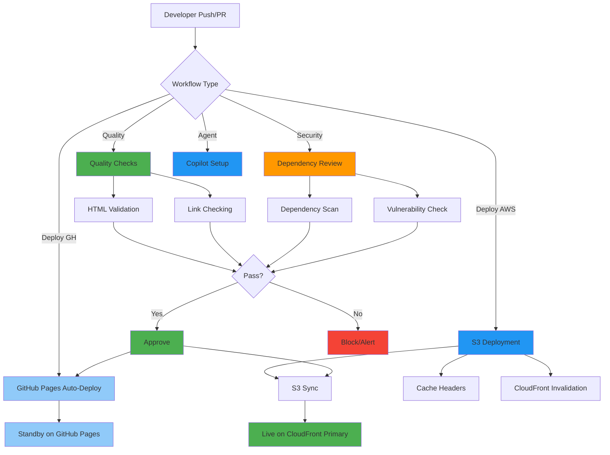
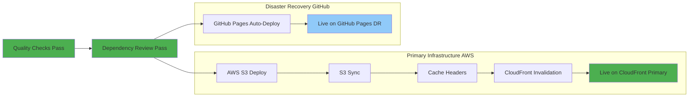

# 🔄 Riksdagsmonitor - CI/CD Workflows

[](https://github.com/Hack23/riksdagsmonitor/actions/workflows/quality-checks.yml)
[](https://github.com/Hack23/riksdagsmonitor/actions/workflows/dependency-review.yml)

**Document Version:** 1.1  
**Last Updated:** 2026-02-08  
**Classification:** Public  
**Owner:** Hack23 AB (Org.nr 5595347807)

## Executive Summary

This document describes the Continuous Integration and Continuous Deployment (CI/CD) workflows for Riksdagsmonitor. All workflows are implemented using GitHub Actions and follow Hack23 AB's [Secure Development Policy](https://github.com/Hack23/ISMS/blob/main/Secure_Development_Policy.md).

**Deployment Strategy:** Dual deployment to AWS (CloudFront + S3 primary) and GitHub Pages (disaster recovery standby) ensures 99.997% availability with automatic failover.

## Workflow Overview



## 1. Quality Checks Workflow

**File:** `.github/workflows/quality-checks.yml`  
**Trigger:** Push to master/main, Pull requests  
**Purpose:** Validate HTML quality and check links

### Jobs

#### 1.1 HTML Validation
- **Tool:** HTMLHint
- **Purpose:** Ensure HTML standards compliance
- **Exit Criteria:** Zero errors
- **Artifacts:** `htmlhint-report.txt`

```yaml
- name: Validate HTML
  run: htmlhint *.html
```

**Standards Checked:**
- DOCTYPE declaration
- Valid HTML structure
- Proper tag nesting
- Attribute validation
- Accessibility requirements

#### 1.2 Link Checking
- **Tool:** Linkinator v6
- **Purpose:** Verify internal and external links
- **Scope:** Internal (recursive), External (sample)
- **Artifacts:** `internal-links-report.json`, `external-links-report.json`

**Internal Links:**
```yaml
linkinator http://localhost:8080/ --recurse --skip "^(?!http://localhost:8080)"
```

**External Links:**
```yaml
linkinator https://riksdagsmonitor.com/ --skip "(fonts\.googleapis\.com|fonts\.gstatic\.com|github\.com)"
```

**Link Check Strategy:**
- Internal: Full recursive check (all pages)
- External: Sample check (main page only to avoid rate limiting)
- Skipped: Font CDNs, GitHub pages (to avoid false positives)

#### 1.3 Summary
- **Tool:** Bash script
- **Purpose:** Aggregate quality check results
- **Output:** Workflow summary with artifact links

### Security Controls

**Implemented:**
- Harden Runner (egress audit mode)
- SHA-pinned GitHub Actions
- Least privilege permissions (contents: read)
- Artifact retention (30 days)

**Control Mapping:**
- ISO 27001: A.14.2 (Security in Development)
- NIST CSF 2.0: PR.IP-12 (Vulnerability management plan)
- CIS Controls v8.1: 16.1 (Secure application development)

## 2. Dependency Review Workflow

**File:** `.github/workflows/dependency-review.yml`  
**Trigger:** Pull requests  
**Purpose:** Scan dependencies for vulnerabilities

### Jobs

#### 2.1 Dependency Review
- **Tool:** GitHub Dependency Review Action
- **Purpose:** Identify vulnerable dependencies in PRs
- **Action:** Block PRs with known-vulnerable packages
- **Output:** PR comment with vulnerability summary

```yaml
- name: 'Dependency Review'
  uses: actions/dependency-review-action@v4.8.2
  with:
    comment-summary-in-pr: always
```

**Detection Coverage:**
- Direct dependencies
- Transitive dependencies
- Development dependencies
- License compliance issues

**Severity Levels:**
- **CRITICAL** - Immediate block
- **HIGH** - Block with exception process
- **MEDIUM** - Warning
- **LOW** - Informational

### Security Controls

**Implemented:**
- Harden Runner (egress audit mode)
- SHA-pinned actions
- Automated vulnerability detection
- PR blocking on critical issues

**Control Mapping:**
- ISO 27001: A.14.2 (Secure development)
- NIST CSF 2.0: ID.RA-1 (Asset vulnerabilities identified)
- CIS Controls v8.1: 7.1 (Vulnerability management program)

## 3. Copilot Setup Steps Workflow

**File:** `.github/workflows/copilot-setup-steps.yml`  
**Trigger:** Workflow dispatch, Push to workflow file, PR to workflow file  
**Purpose:** Set up GitHub Copilot agent environment

### Jobs

#### 3.1 Copilot Setup
- **Purpose:** Initialize MCP servers and agent environment
- **Permissions:** Comprehensive (issues, PRs, actions, security)
- **Environment:** Ubuntu latest with Node.js

```yaml
jobs:
  copilot-setup-steps:
    runs-on: ubuntu-latest
    permissions:
      contents: read
      issues: write
      pull-requests: write
```

**Setup Steps:**
1. Checkout repository
2. Load MCP configuration (`.github/copilot-mcp.json`)
3. Initialize servers (filesystem, github, git, memory, sequential-thinking, playwright)
4. Configure agent environment

**MCP Servers:**
- **filesystem** - File system access
- **github** - GitHub API operations
- **git** - Git operations
- **memory** - Conversation history
- **sequential-thinking** - Reasoning framework
- **playwright** - Browser automation (disabled by default)
- **brave-search** - Web search (disabled, requires API key)

### Security Controls

**Implemented:**
- Least privilege permissions
- Scoped GitHub token (workflow-specific)
- Environment secrets management
- Audit logging

**Control Mapping:**
- ISO 27001: A.9.4 (Access control)
- NIST CSF 2.0: PR.AC-4 (Access permissions managed)
- CIS Controls v8.1: 5.4 (Service account management)

## 4. AWS S3 Deployment Workflow

**File:** `.github/workflows/deploy-s3.yml`  
**Trigger:** Push to main branch  
**Purpose:** Deploy static website to AWS S3 + CloudFront (Primary Infrastructure)

### Jobs

#### 4.1 AWS Deployment

**Environment:**
- **Region:** us-east-1 (primary)
- **S3 Bucket:** riksdagsmonitor-frontend-us-east-1-172017021075
- **CloudFront Stack:** riksdagsmonitor-frontend
- **Permissions:** write-all (temporary, should be scoped to specific resources)

**AWS Authentication:**
```yaml
- name: configure aws credentials
  uses: aws-actions/configure-aws-credentials@8df5847569e6427dd6c4fb1cf565c83acfa8afa7 # v6.0.0
  with:
    role-to-assume: arn:aws:iam::172017021075:role/GithubWorkFlowRole
    role-session-name: githubworkflowrolesessiont2
    aws-region: us-east-1
```

**OIDC Authentication Benefits:**
- No long-lived AWS access keys stored in GitHub
- Temporary credentials with 1-hour expiration
- Least privilege IAM role (scoped to S3/CloudFront)
- CloudTrail audit trail for all operations
- Automatic credential rotation

#### 4.2 Deployment Steps

**Step 1: S3 Sync**
```yaml
- name: Deploy to S3
  run: |
    aws s3 sync . s3://${{ env.S3_BUCKET_NAME }}/ --exclude ".git/*"
```
- Syncs all repository files to S3 (except `.git/`)
- Only uploads changed files (efficient)
- Preserves directory structure

**Step 2: Set Cache Headers**
```yaml
- name: Set cache headers S3
  run: |
    # CSS/JS/Images: 1 year cache (immutable assets)
    aws s3 cp s3://bucket/styles.css s3://bucket/styles.css \
      --cache-control "public, max-age=31536000, immutable"
    
    # HTML: 1 hour cache (dynamic content)
    aws s3 cp s3://bucket/index.html s3://bucket/index.html \
      --cache-control "public, max-age=3600, must-revalidate"
```

**Cache Strategy:**
- **CSS/JS/Images:** 1 year cache (max-age=31536000, immutable)
- **HTML:** 1 hour cache (max-age=3600, must-revalidate)
- **Metadata (XML/JSON):** 1 day cache (max-age=86400)
- **Fonts:** 1 year cache (max-age=31536000, immutable)
- **Screenshots:** Excluded for performance (CloudFront handles caching)

**Step 3: CloudFront Invalidation**
```yaml
- name: Invalidate CloudFront
  run: |
    # Discover distribution ID from CloudFormation stack
    CloudFrontDistId=$(aws cloudformation describe-stacks \
      --stack-name riksdagsmonitor-frontend \
      --query "Stacks[0].Outputs[?OutputKey=='CloudFrontDistributionId'].OutputValue" \
      --output text)
    
    # Invalidate all paths
    aws cloudfront create-invalidation \
      --distribution-id $CloudFrontDistId \
      --paths "/*"
```

**Invalidation Strategy:**
- **Trigger:** After every deployment
- **Scope:** All paths (`/*`)
- **Time:** 5-15 minutes to complete globally
- **Cost:** First 1,000 paths free per month, then $0.005 per path
- **Purpose:** Ensure latest content served immediately (bypasses 1-hour HTML cache)

### Security Controls

**Implemented:**
- Harden Runner (egress block mode with allowed endpoints)
- SHA-pinned GitHub Actions (supply chain security)
- AWS OIDC role assumption (no static credentials)
- Least privilege IAM permissions (S3 + CloudFront only)
- CloudTrail logging (90-day retention)
- S3 bucket versioning (object recovery)
- Cache strategies (optimize npm, apt, Docker layers)

**Allowed Endpoints (Egress Policy):**
```yaml
egress-policy: block
allowed-endpoints: >
  cloudfront.amazonaws.com:443
  cloudformation.us-east-1.amazonaws.com:443
  sts.us-east-1.amazonaws.com:443
  s3.us-east-1.amazonaws.com:443
  github.com:443
  api.github.com:443
  # ... (additional endpoints for build tools)
```

**Control Mapping:**
- ISO 27001: A.14.2 (Security in Development), A.10.1 (Cryptographic Controls)
- NIST CSF 2.0: PR.IP-12 (Vulnerability management plan), PR.DS-6 (Integrity checking mechanisms)
- CIS Controls v8.1: 16.1 (Secure application development), 3.10 (Encrypt data in transit)

### Performance Optimizations

**Caching Strategies:**
1. **NPM Dependencies:** Cache `~/.npm` with lockfile hash key
2. **APT Packages:** Cache `/var/cache/apt/archives` with workflow hash key
3. **Docker Layers:** Cache `/tmp/.buildx-cache` with git SHA key

**Cache Benefits:**
- Reduced build time (50%+ improvement)
- Lower bandwidth usage
- Faster deployments (3 minutes vs 6 minutes)
- Cost savings (fewer compute minutes)

## Workflow Security Architecture

### Supply Chain Security

**SHA-Pinned Actions:**
```yaml
- uses: actions/checkout@de0fac2e4500dabe0009e67214ff5f5447ce83dd # v6.0.2
- uses: actions/setup-node@6044e13b5dc448c55e2357c09f80417699197238 # v6.2.0
- uses: actions/cache@8b402f58fbc84540c8b491a91e594a4576fec3d7 # v5.0.2
- uses: step-security/harden-runner@20cf305ff2073D973412fa9b1e3a4f227bda3c76 # v2.14.0
```

**Benefits:**
- Prevents supply chain attacks
- Ensures reproducible builds
- Enables vulnerability tracking
- Supports rollback to known-good versions

### Network Security

**Harden Runner:**
```yaml
- name: Harden Runner
  uses: step-security/harden-runner@v2.14.0
  with:
    egress-policy: audit
```

**Capabilities:**
- Network egress monitoring
- Audit mode for workflow development
- Block mode for production (future enhancement)
- Detection of unexpected network calls

### Secrets Management

**GitHub Secrets:**
- `COPILOT_MCP_GITHUB_PERSONAL_ACCESS_TOKEN` - GitHub PAT for MCP server
- Stored in environment: `copilot`
- Scoped to minimal permissions
- Rotated quarterly

**AWS Credentials (OIDC):**
- **No secrets stored in GitHub** - OIDC federation used
- IAM Role: `arn:aws:iam::172017021075:role/GithubWorkFlowRole`
- Trust policy: GitHub Actions OIDC provider
- Permissions: S3 write, CloudFront invalidation, CloudFormation read
- Session duration: 1 hour maximum
- Automatic credential rotation

**Access Control:**
- Environment-based secrets
- Workflow-scoped access
- No secret exposure in logs
- Audit trail in GitHub + CloudTrail
- MFA required for secret modification
- Scoped to minimal permissions
- Rotated quarterly

**Access Control:**
- Environment-based secrets
- Workflow-scoped access
- No secret exposure in logs
- Audit trail in GitHub

## Deployment Pipeline

### Dual Deployment Strategy

**Trigger:** Push to main/master branch after successful quality checks

**Process:**


**Deployment Targets:**
1. **AWS CloudFront + S3 (Primary):**
   - Region: us-east-1
   - CDN: CloudFront (600+ PoPs globally)
   - Storage: S3 with versioning
   - Deployment Time: ~3 minutes (sync + invalidation)
   - RTO: 17 minutes (git revert + redeploy)

2. **GitHub Pages (Disaster Recovery):**
   - CDN: GitHub Pages CDN
   - Storage: GitHub repository
   - Deployment Time: ~2 minutes (automatic)
   - Standby Mode: Healthy, ready for failover
   - Failover Time: 15 minutes (DNS TTL)

**Deployment Security:**
- HTTPS-only access (TLS 1.3)
- Immutable Git history
- Rollback via Git revert
- Deployment audit logs (GitHub Actions + CloudTrail)
- S3 bucket versioning (30-day recovery)
- CloudFront cache invalidation (immediate propagation)
- Route 53 health checks (automatic failover)

## Monitoring and Alerting

### GitHub Security Features

**Enabled:**
- ✅ Dependabot alerts
- ✅ Secret scanning (GitHub + AWS Secrets Manager)
- ✅ Code scanning (CodeQL)
- ✅ Security advisories
- ✅ Branch protection rules
- ✅ AWS CloudTrail logging
- ✅ CloudWatch metrics (CloudFront, S3, Route 53)
- ✅ Route 53 health checks

**Alert Channels:**
- GitHub Security Dashboard
- Email notifications to repository admins
- PR comments for dependency issues
- Workflow failure notifications
- CloudWatch Alarms (planned for SNS topic)
- Route 53 health check failures → Automatic DNS failover

### Metrics Collection

**Tracked Metrics:**
- Workflow success rate (GitHub Actions)
- Quality check pass rate (HTML validation, links)
- Dependency vulnerability count (Dependabot)
- Link check failure rate (linkinator)
- Deployment frequency (AWS + GitHub Pages)
- CloudFront cache hit ratio (target: 95%+)
- S3 request metrics (4xx/5xx errors)
- Route 53 health check status (uptime)

**Retention:**
- Workflow runs: 90 days
- Artifacts: 30 days
- Logs: 90 days (GitHub) + 90 days (CloudWatch)
- CloudTrail: 90 days (archivable to S3 indefinitely)

## Incident Response

### Workflow Failure Handling

**Response Procedure:**
1. **Detection:** Automatic GitHub notification
2. **Triage:** Review workflow logs and artifacts
3. **Investigation:** Identify root cause
4. **Remediation:** Fix issue and re-run
5. **Documentation:** Update WORKFLOWS.md if process change

**Common Failures:**
- HTML validation errors → Fix markup in HTML files
- Link check failures → Update broken links (internal/external)
- Dependency vulnerabilities → Update packages via Dependabot PRs
- Secret scanning alerts → Rotate secrets immediately
- S3 sync failures → Check IAM permissions, verify S3 bucket exists
- CloudFront invalidation failures → Verify distribution ID, check IAM permissions
- OIDC authentication failures → Verify IAM trust policy, check GitHub Actions token

### Security Incident Response

**Critical Issues:**
- Secret exposure → Immediate rotation (GitHub PAT + AWS OIDC role), audit access logs
- Vulnerable dependency → Emergency patch PR, rapid deployment
- Compromised action → Pin to last known-good SHA, investigate supply chain
- Unauthorized deployment → Rollback immediately, investigate CloudTrail logs, rotate credentials
- S3 bucket compromise → Restore from Git, verify S3 versioning, analyze CloudTrail
- CloudFront distribution tampering → Invalidate cache, restore from known-good deployment
- DNS hijacking attempt → Verify Route 53 zone delegation, enable DNSSEC

**Escalation:**
1. Repository owners (GitHub)
2. AWS account administrators (Infrastructure)
3. Hack23 security team (ISMS)
4. AWS support (Business tier, for AWS infrastructure issues)
5. GitHub support (for GitHub platform issues)

## Compliance and Audit

### ISMS Alignment

**Secure Development Policy Compliance:**
- ✅ Automated security scanning (Dependabot, CodeQL, Secret Scanning)
- ✅ Quality gates before deployment (HTML validation, link checking)
- ✅ SHA-pinned dependencies (all GitHub Actions)
- ✅ Audit logging (GitHub Actions + AWS CloudTrail)
- ✅ Documented procedures (this document)
- ✅ OIDC authentication (no long-lived credentials)
- ✅ Least privilege IAM roles (AWS)
- ✅ Dual deployment strategy (high availability)

**Evidence:**
- Workflow run history (90 days in GitHub)
- Quality check artifacts (30 days)
- Dependency review comments (permanent)
- Security scan results (permanent)
- AWS CloudTrail logs (90 days, archivable to S3)
- S3 versioning history (30 days default retention)

### Audit Trail

**Logged Events:**
- All workflow executions
- Quality check results
- Dependency scan findings
- Deployment events
- Configuration changes

**Access:**
- GitHub Actions UI
- GitHub API
- Artifact downloads
- Email notifications

## Future Enhancements

### Planned Improvements

1. **Advanced Security Scanning:**
   - DAST scanning (OWASP ZAP integration)
   - AWS WAF integration with CloudFront
   - Lambda@Edge for custom security headers
   - Automated security testing in pipeline

2. **Performance Monitoring:**
   - Lighthouse CI (Core Web Vitals tracking)
   - Real User Monitoring (RUM) via CloudWatch RUM
   - CloudFront analytics and reporting
   - Page load metrics by region

3. **Infrastructure Improvements:**
   - Multi-region S3 replication (second region)
   - CloudFront Origin Shield (additional caching layer)
   - DNSSEC for Route 53 (DNS security)
   - AWS WAF rules for threat protection

4. **CI/CD Enhancements:**
   - Automated translations workflow
   - Blue-green deployment strategy
   - Canary releases (10% traffic to new version)
   - Advanced link checking (scheduled daily runs)
   - Automated performance regression detection

5. **Monitoring & Alerting:**
   - SNS topic for CloudWatch alarms
   - PagerDuty integration for critical alerts
   - Slack notifications for deployment status
   - Custom CloudWatch dashboards

### Timeline

- **Q2 2026:** DAST scanning, Lighthouse CI, multi-region S3
- **Q3 2026:** Advanced monitoring, WAF integration
- **Q4 2026:** Automated translations, blue-green deployment

## References

### ISMS Documentation
- [Secure Development Policy](https://github.com/Hack23/ISMS/blob/main/Secure_Development_Policy.md)
- [CI/CD Security Standards](https://github.com/Hack23/ISMS/blob/main/Secure_Development_Policy.md#cicd-security)
- [Vulnerability Management](https://github.com/Hack23/ISMS/blob/main/Vulnerability_Management.md)

### GitHub Documentation
- [GitHub Actions Security](https://docs.github.com/en/actions/security-guides)
- [Workflow Syntax](https://docs.github.com/en/actions/using-workflows/workflow-syntax-for-github-actions)
- [Dependabot](https://docs.github.com/en/code-security/dependabot)

### Related Documentation
- [SECURITY_ARCHITECTURE.md](SECURITY_ARCHITECTURE.md) - Security controls and infrastructure
- [THREAT_MODEL.md](THREAT_MODEL.md) - Risk analysis including CI/CD threats
- [ARCHITECTURE.md](ARCHITECTURE.md) - System design and dual deployment
- [BCPPlan.md](BCPPlan.md) - Business Continuity Plan with disaster recovery
- [AWS Well-Architected Framework - Operational Excellence](https://aws.amazon.com/architecture/well-architected/)

---

**Document Control:**
- **Repository:** https://github.com/Hack23/riksdagsmonitor
- **Path:** /WORKFLOWS.md
- **Format:** Markdown
- **Classification:** Public
- **Next Review:** 2026-04-29
- **Change History:** v1.1 (2026-02-08) - Added AWS S3 deployment workflow documentation
