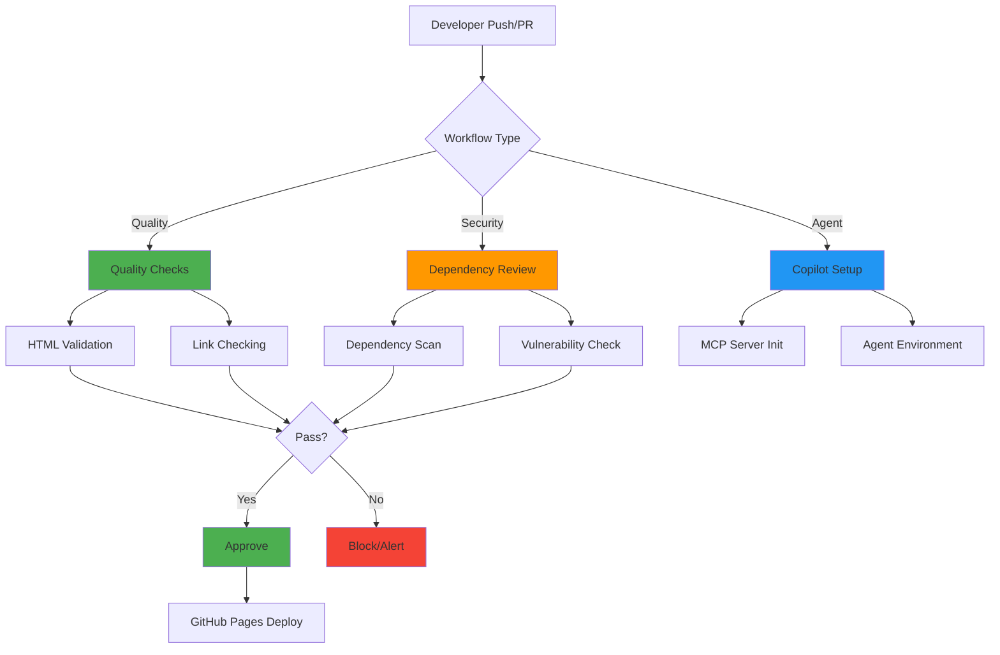
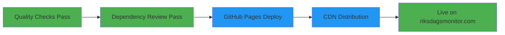

# 🔄 Riksdagsmonitor - CI/CD Workflows

[](https://github.com/Hack23/riksdagsmonitor/actions/workflows/quality-checks.yml)
[](https://github.com/Hack23/riksdagsmonitor/actions/workflows/dependency-review.yml)

**Document Version:** 1.0  
**Last Updated:** 2026-01-29  
**Classification:** Public  
**Owner:** Hack23 AB (Org.nr 5595347807)

## Executive Summary

This document describes the Continuous Integration and Continuous Deployment (CI/CD) workflows for Riksdagsmonitor. All workflows are implemented using GitHub Actions and follow Hack23 AB's [Secure Development Policy](https://github.com/Hack23/ISMS/blob/main/Secure_Development_Policy.md).

## Workflow Overview



## 1. Quality Checks Workflow

**File:** `.github/workflows/quality-checks.yml`  
**Trigger:** Push to master/main, Pull requests  
**Purpose:** Validate HTML quality and check links

### Jobs

#### 1.1 HTML Validation
- **Tool:** HTMLHint
- **Purpose:** Ensure HTML standards compliance
- **Exit Criteria:** Zero errors
- **Artifacts:** `htmlhint-report.txt`

```yaml
- name: Validate HTML
  run: htmlhint *.html
```

**Standards Checked:**
- DOCTYPE declaration
- Valid HTML structure
- Proper tag nesting
- Attribute validation
- Accessibility requirements

#### 1.2 Link Checking
- **Tool:** Linkinator v6
- **Purpose:** Verify internal and external links
- **Scope:** Internal (recursive), External (sample)
- **Artifacts:** `internal-links-report.json`, `external-links-report.json`

**Internal Links:**
```yaml
linkinator http://localhost:8080/ --recurse --skip "^(?!http://localhost:8080)"
```

**External Links:**
```yaml
linkinator https://riksdagsmonitor.com/ --skip "(fonts\.googleapis\.com|fonts\.gstatic\.com|github\.com)"
```

**Link Check Strategy:**
- Internal: Full recursive check (all pages)
- External: Sample check (main page only to avoid rate limiting)
- Skipped: Font CDNs, GitHub pages (to avoid false positives)

#### 1.3 Summary
- **Tool:** Bash script
- **Purpose:** Aggregate quality check results
- **Output:** Workflow summary with artifact links

### Security Controls

**Implemented:**
- Harden Runner (egress audit mode)
- SHA-pinned GitHub Actions
- Least privilege permissions (contents: read)
- Artifact retention (30 days)

**Control Mapping:**
- ISO 27001: A.14.2 (Security in Development)
- NIST CSF 2.0: PR.IP-12 (Vulnerability management plan)
- CIS Controls v8.1: 16.1 (Secure application development)

## 2. Dependency Review Workflow

**File:** `.github/workflows/dependency-review.yml`  
**Trigger:** Pull requests  
**Purpose:** Scan dependencies for vulnerabilities

### Jobs

#### 2.1 Dependency Review
- **Tool:** GitHub Dependency Review Action
- **Purpose:** Identify vulnerable dependencies in PRs
- **Action:** Block PRs with known-vulnerable packages
- **Output:** PR comment with vulnerability summary

```yaml
- name: 'Dependency Review'
  uses: actions/dependency-review-action@v4.8.2
  with:
    comment-summary-in-pr: always
```

**Detection Coverage:**
- Direct dependencies
- Transitive dependencies
- Development dependencies
- License compliance issues

**Severity Levels:**
- **CRITICAL** - Immediate block
- **HIGH** - Block with exception process
- **MEDIUM** - Warning
- **LOW** - Informational

### Security Controls

**Implemented:**
- Harden Runner (egress audit mode)
- SHA-pinned actions
- Automated vulnerability detection
- PR blocking on critical issues

**Control Mapping:**
- ISO 27001: A.14.2 (Secure development)
- NIST CSF 2.0: ID.RA-1 (Asset vulnerabilities identified)
- CIS Controls v8.1: 7.1 (Vulnerability management program)

## 3. Copilot Setup Steps Workflow

**File:** `.github/workflows/copilot-setup-steps.yml`  
**Trigger:** Workflow dispatch, Push to workflow file, PR to workflow file  
**Purpose:** Set up GitHub Copilot agent environment

### Jobs

#### 3.1 Copilot Setup
- **Purpose:** Initialize MCP servers and agent environment
- **Permissions:** Comprehensive (issues, PRs, actions, security)
- **Environment:** Ubuntu latest with Node.js

```yaml
jobs:
  copilot-setup-steps:
    runs-on: ubuntu-latest
    permissions:
      contents: read
      issues: write
      pull-requests: write
```

**Setup Steps:**
1. Checkout repository
2. Load MCP configuration (`.github/copilot-mcp.json`)
3. Initialize servers (filesystem, github, git, memory, sequential-thinking, playwright)
4. Configure agent environment

**MCP Servers:**
- **filesystem** - File system access
- **github** - GitHub API operations
- **git** - Git operations
- **memory** - Conversation history
- **sequential-thinking** - Reasoning framework
- **playwright** - Browser automation (disabled by default)
- **brave-search** - Web search (disabled, requires API key)

### Security Controls

**Implemented:**
- Least privilege permissions
- Scoped GitHub token (workflow-specific)
- Environment secrets management
- Audit logging

**Control Mapping:**
- ISO 27001: A.9.4 (Access control)
- NIST CSF 2.0: PR.AC-4 (Access permissions managed)
- CIS Controls v8.1: 5.4 (Service account management)

## Workflow Security Architecture

### Supply Chain Security

**SHA-Pinned Actions:**
```yaml
- uses: actions/checkout@de0fac2e4500dabe0009e67214ff5f5447ce83dd # v6.0.2
- uses: actions/setup-node@6044e13b5dc448c55e2357c09f80417699197238 # v6.2.0
- uses: actions/cache@8b402f58fbc84540c8b491a91e594a4576fec3d7 # v5.0.2
- uses: step-security/harden-runner@20cf305ff2073D973412fa9b1e3a4f227bda3c76 # v2.14.0
```

**Benefits:**
- Prevents supply chain attacks
- Ensures reproducible builds
- Enables vulnerability tracking
- Supports rollback to known-good versions

### Network Security

**Harden Runner:**
```yaml
- name: Harden Runner
  uses: step-security/harden-runner@v2.14.0
  with:
    egress-policy: audit
```

**Capabilities:**
- Network egress monitoring
- Audit mode for workflow development
- Block mode for production (future enhancement)
- Detection of unexpected network calls

### Secrets Management

**GitHub Secrets:**
- `COPILOT_MCP_GITHUB_PERSONAL_ACCESS_TOKEN` - GitHub PAT for MCP server
- Stored in environment: `copilot`
- Scoped to minimal permissions
- Rotated quarterly

**Access Control:**
- Environment-based secrets
- Workflow-scoped access
- No secret exposure in logs
- Audit trail in GitHub

## Deployment Pipeline

### GitHub Pages Deployment

**Trigger:** Push to main/master branch after successful quality checks

**Process:**


**Deployment Configuration:**
- **Source:** Main branch, root directory
- **Custom Domain:** riksdagsmonitor.com (via CNAME)
- **HTTPS:** Enforced (TLS 1.3)
- **CDN:** GitHub Pages global CDN

**Deployment Security:**
- HTTPS-only access
- Immutable Git history
- Rollback via Git revert
- Deployment audit logs

## Monitoring and Alerting

### GitHub Security Features

**Enabled:**
- ✅ Dependabot alerts
- ✅ Secret scanning
- ✅ Code scanning (CodeQL)
- ✅ Security advisories
- ✅ Branch protection rules

**Alert Channels:**
- GitHub Security Dashboard
- Email notifications to repository admins
- PR comments for dependency issues
- Workflow failure notifications

### Metrics Collection

**Tracked Metrics:**
- Workflow success rate
- Quality check pass rate
- Dependency vulnerability count
- Link check failure rate
- Deployment frequency

**Retention:**
- Workflow runs: 90 days
- Artifacts: 30 days
- Logs: 90 days

## Incident Response

### Workflow Failure Handling

**Response Procedure:**
1. **Detection:** Automatic GitHub notification
2. **Triage:** Review workflow logs and artifacts
3. **Investigation:** Identify root cause
4. **Remediation:** Fix issue and re-run
5. **Documentation:** Update WORKFLOWS.md if process change

**Common Failures:**
- HTML validation errors → Fix markup
- Link check failures → Update broken links
- Dependency vulnerabilities → Update packages
- Secret scanning alerts → Rotate secrets

### Security Incident Response

**Critical Issues:**
- Secret exposure → Immediate rotation, audit access
- Vulnerable dependency → Emergency patch PR
- Compromised action → Pin to last known-good SHA
- Unauthorized deployment → Rollback, investigate

**Escalation:**
1. Repository owners
2. Hack23 security team
3. GitHub support (for platform issues)

## Compliance and Audit

### ISMS Alignment

**Secure Development Policy Compliance:**
- ✅ Automated security scanning
- ✅ Quality gates before deployment
- ✅ SHA-pinned dependencies
- ✅ Audit logging
- ✅ Documented procedures

**Evidence:**
- Workflow run history (90 days)
- Quality check artifacts (30 days)
- Dependency review comments (permanent)
- Security scan results (permanent)

### Audit Trail

**Logged Events:**
- All workflow executions
- Quality check results
- Dependency scan findings
- Deployment events
- Configuration changes

**Access:**
- GitHub Actions UI
- GitHub API
- Artifact downloads
- Email notifications

## Future Enhancements

### Planned Improvements

1. **DAST Scanning:**
   - OWASP ZAP integration
   - Automated security testing
   - Vulnerability reporting

2. **Performance Monitoring:**
   - Lighthouse CI
   - Page load metrics
   - Accessibility scoring

3. **Automated Translations:**
   - Multi-language HTML generation
   - Translation validation
   - Consistency checking

4. **Advanced Link Checking:**
   - Scheduled daily runs
   - External link monitoring
   - Broken link alerts

### Timeline

- **Q2 2026:** DAST scanning implementation
- **Q3 2026:** Performance monitoring
- **Q4 2026:** Automated translations

## References

### ISMS Documentation
- [Secure Development Policy](https://github.com/Hack23/ISMS/blob/main/Secure_Development_Policy.md)
- [CI/CD Security Standards](https://github.com/Hack23/ISMS/blob/main/Secure_Development_Policy.md#cicd-security)
- [Vulnerability Management](https://github.com/Hack23/ISMS/blob/main/Vulnerability_Management.md)

### GitHub Documentation
- [GitHub Actions Security](https://docs.github.com/en/actions/security-guides)
- [Workflow Syntax](https://docs.github.com/en/actions/using-workflows/workflow-syntax-for-github-actions)
- [Dependabot](https://docs.github.com/en/code-security/dependabot)

### Related Documentation
- [SECURITY_ARCHITECTURE.md](SECURITY_ARCHITECTURE.md) - Security controls
- [THREAT_MODEL.md](THREAT_MODEL.md) - Risk analysis
- [ARCHITECTURE.md](ARCHITECTURE.md) - System design

---

**Document Control:**
- **Repository:** https://github.com/Hack23/riksdagsmonitor
- **Path:** /WORKFLOWS.md
- **Format:** Markdown
- **Classification:** Public
- **Next Review:** 2026-04-29
