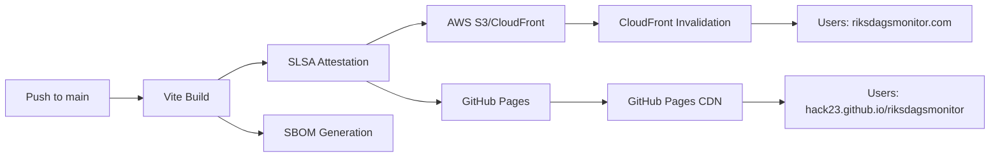

# 🔄 Riksdagsmonitor — CI/CD Workflows

### CI/CD & Security
[](https://github.com/Hack23/riksdagsmonitor/actions/workflows/quality-checks.yml)
[](https://github.com/Hack23/riksdagsmonitor/actions/workflows/dependency-review.yml)
[](https://github.com/Hack23/riksdagsmonitor/actions/workflows/codeql.yml)
[](https://scorecard.dev/viewer/?uri=github.com/Hack23/riksdagsmonitor)

### Testing
[](https://github.com/Hack23/riksdagsmonitor/actions/workflows/javascript-testing.yml)
[](https://github.com/Hack23/riksdagsmonitor/actions/workflows/jsdoc-validation.yml)
[](https://github.com/Hack23/riksdagsmonitor/actions/workflows/translation-validation.yml)

### Documentation & Release
[](https://github.com/Hack23/riksdagsmonitor/actions/workflows/release.yml)
[](https://riksdagsmonitor.com/docs/api/)
[](https://riksdagsmonitor.com/docs/coverage/)

**Document Version:** 6.0
**Last Updated:** 2026-03-10
**Classification:** Public
**Owner:** Hack23 AB (Org.nr 5595347807)

## Executive Summary

This document describes the Continuous Integration and Continuous Deployment (CI/CD) workflows for Riksdagsmonitor. All workflows are implemented using GitHub Actions and follow Hack23 AB's [Secure Development Policy](https://github.com/Hack23/ISMS-PUBLIC/blob/main/Secure_Development_Policy.md).

The project has been migrated from JavaScript to **TypeScript** (31 modules in `src/browser/`) with all workflows updated accordingly. TypeScript compilation is handled by Vite (esbuild) for browser bundles and Node 24's native type-stripping for scripts.

**Total Workflows: 43** (23 standard YAML + 10 agentic markdown sources + 10 compiled lock files)
**Security Compliance: 100%** (all actions SHA-pinned, harden-runner enabled)
**ISMS Compliance:** ISO 27001:2022, NIST CSF 2.0, CIS Controls v8.1

### Technology Stack

| Component | Version | Purpose |
|-----------|---------|---------|
| Node.js | 24 | Runtime (native TypeScript strip-types) |
| TypeScript | 5.9.3 | Type system |
| Vite | 7.3.1 | Build toolchain (esbuild) |
| Vitest | 4.0.18 | Unit testing (2890 tests) |
| Cypress | 14 | E2E testing |
| TypeDoc | 0.28.17 | API documentation |
| ESLint | 10.x | Linting (flat config) |

### Compliance Frameworks
- **ISO 27001:2022:** A.8.31 (Separation of dev/test/prod), A.8.32 (Change management), A.5.37 (Documented operating procedures)
- **NIST CSF 2.0:** ID.RA (Risk Assessment), PR.DS (Data Security), DE.CM (Continuous Monitoring)
- **CIS Controls v8.1:** 16.6 (Application Software Security), 16.10 (Vulnerability Remediation)

See [Hack23 ISMS-PUBLIC](https://github.com/Hack23/ISMS-PUBLIC) for complete framework documentation.

## Workflow Architecture


```mermaid
graph TD
    A[Developer Push/PR] --> B{Workflow Type}
    B -->|Quality| C[Quality Checks]
    B -->|Security| D[Security Suite]
    B -->|Testing| T[Testing Suite]
    B -->|Release| R[Release Pipeline]
    B -->|Agent| E[Copilot / Agentic]
    B -->|Data| DP[CIA Data Pipeline]
    B -->|Monitor| M[Monitoring]
    
    C --> F[HTML Validation]
    C --> G[Link Checking]
    C --> TS[TypeScript Lint]
    
    D --> H[Dependency Review]
    D --> CodeQL[CodeQL JS/TS]
    D --> SC[OpenSSF Scorecard]
    
    T --> TSTest[TypeScript & JS Testing]
    T --> TypeDoc[TypeDoc Validation]
    T --> Trans[Translation Check]
    T --> Dash[Dashboard E2E]
    T --> Home[Homepage E2E]
    T --> News[News E2E]
    
    TSTest --> TSC[tsc --noEmit]
    TSTest --> VT[Vitest 2890 Tests]
    TSTest --> CY[Cypress E2E]
    
    R --> Build[Vite Build]
    R --> Attest[SLSA Attestations]
    R --> DeployDual[Dual Deploy]
    
    DeployDual --> S3[AWS S3/CloudFront]
    DeployDual --> GHP[GitHub Pages]
    
    DP --> CIA[CIA Exports Fetch]
    DP --> Val[Schema Validation]
    DP --> Stats[Stats Update]
    
    E --> Setup[Copilot Setup Steps]
    E --> AG[Agentic News Gen]
    
    M --> LH[Lighthouse CI]
    M --> UP[Uptime Monitor]
    
    style C fill:#4caf50
    style D fill:#ff9800
    style T fill:#00bcd4
    style R fill:#9c27b0
    style E fill:#2196f3
    style DP fill:#795548
    style M fill:#607d8b
```

## Complete Workflow Inventory (43 Files)

### 🔐 Security & Compliance (5 workflows)

| # | Workflow | File | Trigger | ISMS Controls |
|---|----------|------|---------|---------------|
| 1.1 | CodeQL Analysis | `codeql.yml` | Push, PR, Weekly schedule | A.8.8, PR.DS-6, CIS 16.6 |
| 1.2 | Dependency Review | `dependency-review.yml` | Pull requests | A.8.8, PR.DS-6, CIS 16.6 |
| 1.3 | OpenSSF Scorecard | `scorecards.yml` | Push to main, Weekly | A.5.36, DE.CM-6, CIS 16.2 |
| 1.4 | Setup Labels | `setup-labels.yml` | Manual dispatch | A.5.37, PR.IP-1 |
| 1.5 | PR Labeler | `labeler.yml` | Pull requests | A.5.37, PR.IP-1 |

### 🧪 Testing & Validation (7 workflows)

| # | Workflow | File | Trigger | Coverage |
|---|----------|------|---------|----------|
| 2.1 | TypeScript & JavaScript Testing | `javascript-testing.yml` | Push/PR (`**/*.ts`, `**/*.js`, `src/browser/**`) | TSC type-check + Vitest + Cypress |
| 2.2 | TypeDoc Validation | `jsdoc-validation.yml` | Manual dispatch | TypeDoc generation + coverage |
| 2.3 | Quality Checks | `quality-checks.yml` | Push/PR to main | ESLint + HTMLHint + linkinator |
| 2.4 | Translation Validation | `translation-validation.yml` | Push/PR (`index*.html`, `news/*.html`) | 14-language + RTL + hreflang |
| 2.5 | Test Dashboard | `test-dashboard.yml` | Push/PR (`src/browser/**`, `dashboard/**`) | Dashboard Cypress E2E |
| 2.6 | Test Homepage | `test-homepage.yml` | Push/PR (`src/browser/**`, `index*.html`) | Homepage Cypress E2E |
| 2.7 | Test News | `test-news.yml` | Push/PR (`news/**`, `cypress/e2e/news*`) | News pages Cypress E2E |

### 📦 CIA Data Pipeline (5 workflows)

| # | Workflow | File | Trigger | Purpose |
|---|----------|------|---------|---------|
| 3.1 | CIA Data Pipeline | `data-pipeline.yml` | Manual dispatch (schedule disabled) | Fetch & validate CIA exports |
| 3.2 | Check CIA Schema Updates | `check-cia-schema-updates.yml` | Weekly schedule | Detect upstream schema changes |
| 3.3 | Sync CIA Schemas | `sync-cia-schemas.yml` | Manual dispatch, push | Sync schemas from CIA repo |
| 3.4 | Update CIA Stats | `update-cia-stats.yml` | Daily 03:00 CET, manual | Fetch production statistics |
| 3.5 | Validate CIA Data | `validate-cia-data.yml` | Daily, push/PR, manual | JSON schema validation |

### 🚀 Release & Deployment (3 workflows)

| # | Workflow | File | Trigger | Targets |
|---|----------|------|---------|---------|
| 4.1 | Release with Attestations | `release.yml` | Push to main, manual | SLSA + dual deploy |
| 4.2 | Deploy to S3 | `deploy-s3.yml` | Push to main | AWS S3/CloudFront |
| 4.3 | Lighthouse CI | `lighthouse-ci.yml` | Push/PR, weekly | Performance audit |

### 🤖 Agentic Workflows (21 files: 10 sources + 10 locks + 1 compiler)

| # | Workflow | Source | Lock | Purpose |
|---|----------|--------|------|---------|
| 5.1 | News Article Generator | `news-article-generator.md` | `news-article-generator.lock.yml` | Daily news generation |
| 5.2 | News Evening Analysis | `news-evening-analysis.md` | `news-evening-analysis.lock.yml` | Evening analysis reports |
| 5.3 | News Realtime Monitor | `news-realtime-monitor.md` | `news-realtime-monitor.lock.yml` | Real-time political monitoring |
| 5.4 | News Motions | `news-motions.md` | `news-motions.lock.yml` | Motion tracking and reporting |
| 5.5 | News Committee Reports | `news-committee-reports.md` | `news-committee-reports.lock.yml` | Committee report coverage |
| 5.6 | News Weekly Review | `news-weekly-review.md` | `news-weekly-review.lock.yml` | Weekly political summary |
| 5.7 | News Monthly Review | `news-monthly-review.md` | `news-monthly-review.lock.yml` | Monthly political review |
| 5.8 | News Week Ahead | `news-week-ahead.md` | `news-week-ahead.lock.yml` | Upcoming week preview |
| 5.9 | News Month Ahead | `news-month-ahead.md` | `news-month-ahead.lock.yml` | Upcoming month preview |
| 5.10 | News Propositions | `news-propositions.md` | `news-propositions.lock.yml` | Government proposition coverage |
| 5.11 | Compile Agentic Workflows | `compile-agentic-workflows.yml` | — | Compile .md → .lock.yml |

### 📊 Monitoring & Infrastructure (2 workflows)

| # | Workflow | File | Trigger | Purpose |
|---|----------|------|---------|---------|
| 6.1 | Uptime Monitor | `uptime-monitor.yml` | Every 15 minutes | Site availability checks |
| 6.2 | Copilot Setup Steps | `copilot-setup-steps.yml` | Push, manual | Agent environment setup |

---

## Detailed Workflow Documentation

### 1. Quality Checks (`quality-checks.yml`)

**Purpose:** Validates code quality through ESLint linting, HTML validation, and link checking on every push/PR to `main`.

**Branch triggers:** `main` only

#### Jobs

##### 1.1 TypeScript Lint (`typescript-lint`)
```yaml
steps:
  - Checkout
  - Setup Node.js 24
  - Install dependencies (npm ci)
  - Run ESLint: npx eslint .
  - Artifact upload: eslint-results
```

**What it checks:**
- TypeScript & JavaScript files via ESLint flat config (`eslint.config.js`)
- Uses `@typescript-eslint/parser` with `tsconfig.browser.json` + `tsconfig.scripts.json`
- 0 errors required (warnings permitted)

##### 1.2 HTML Validation
```yaml
steps:
  - Checkout
  - Run HTMLHint on all *.html files
  - Report validation results
```

##### 1.3 Link Checking
```yaml
steps:
  - Checkout, Setup Node.js, Install deps
  - Vite preview server (background)
  - linkinator --recurse (skip external)
```

##### 1.4 Summary
Generates a consolidated step summary with pass/fail status for all jobs.

**Security Controls:**
- Harden-runner with egress auditing
- All actions SHA-pinned
- Least privilege permissions (`contents: read`)

---

### 2. TypeScript & JavaScript Testing (`javascript-testing.yml`)

**Purpose:** Primary test workflow — TypeScript type-checking, Vitest unit tests, Vite build verification, and multi-language Cypress E2E.

**Triggers:** Push/PR on `**/*.ts`, `**/*.js`, `src/browser/**`, `tsconfig*.json`, `*.html`, `styles.css`, `cypress/**`, `package*.json`, `vitest.config.js`, `vite.config.js`

#### Jobs

##### 2.1 Unit Tests & Build
```yaml
steps:
  - Checkout
  - Setup Node.js 24
  - Install dependencies
  - TypeScript type-check (browser): npx tsc --project tsconfig.browser.json --noEmit
  - TypeScript type-check (scripts): npx tsc --project tsconfig.scripts.json --noEmit
  - Run Vitest: npx vitest run --coverage
  - Vite build: npm run build
  - Upload coverage artifacts
```

**TypeScript Compilation Strategy:**
- `tsconfig.browser.json` — validates `src/browser/**/*.ts` (31 modules)
- `tsconfig.scripts.json` — validates `scripts/**/*.ts` + `tests/**/*.ts`
- Both use `noEmit: true` (Vite/esbuild handles actual compilation)

##### 2.2 Multi-Language E2E (Cypress)
Matrix strategy: Tests across `en`, `sv`, and additional language variants.

```yaml
steps:
  - Checkout, Setup Node.js, Install deps
  - Vite build + preview server
  - Cypress run (headless Chrome)
  - Upload screenshots on failure
```

**Test Coverage:**
- 2890 unit tests (Vitest)
- Happy-DOM environment for browser module testing
- V8 coverage provider with `src/browser/**/*.ts` in include paths

---

### 3. TypeDoc Validation (`jsdoc-validation.yml`)

**Purpose:** Generates TypeDoc API documentation from TypeScript source and validates documentation coverage.

**Source directories:** `src/browser`, `scripts`

```yaml
steps:
  - Checkout, Setup Node.js 24, Install deps
  - Generate TypeDoc: npx typedoc
  - Validate documentation coverage
  - Check generated TypeDoc files exist
  - Upload api/ artifact
```

**Coverage Check:**
```bash
find src/browser scripts -name "*.ts" -o -name "*.js" | head -20
# Verifies TypeDoc generated output for all source files
```

---

### 4. CodeQL Analysis (`codeql.yml`)

**Purpose:** GitHub's code scanning for security vulnerabilities across JavaScript and TypeScript.

**Language matrix:** `["javascript-typescript"]` — analyses both `.js` and `.ts` files in a single pass.

```yaml
strategy:
  matrix:
    language: ['javascript-typescript']
steps:
  - Harden Runner
  - Checkout
  - Initialize CodeQL (language matrix)
  - Autobuild
  - Perform CodeQL Analysis
  - Upload SARIF results
```

---

### 5. Release Pipeline (`release.yml`)

**Purpose:** Full release workflow with Vite build, SLSA provenance attestations, SBOM generation, and dual deployment to AWS S3/CloudFront + GitHub Pages.

**Cache key:** `hashFiles('src/browser/**/*.ts', 'scripts/**/*.ts', 'scripts/**/*.js')` — tracks TypeScript source for cache invalidation.

#### Key Steps:
1. **Build:** `npm run build` (Vite/esbuild → `dist/`)
2. **SLSA Attestation:** `actions/attest-build-provenance` for supply chain security
3. **SBOM:** Software Bill of Materials generation
4. **TypeDoc:** Generate API reference (TypeDoc-generated API documentation for TypeScript modules)
5. **Dual Deploy:**
   - AWS S3 + CloudFront invalidation
   - GitHub Pages (backup)

---

### 6. Deploy to S3 (`deploy-s3.yml`)

**Purpose:** Deploys built assets to AWS S3/CloudFront on push to main.

**Critical:** Includes a Vite build step before deployment — never deploys raw source.

```yaml
steps:
  - Checkout
  - Setup Node.js 24
  - Install dependencies: npm ci
  - Build: npm run build          # ← Critical: Vite build before deploy
  - Configure AWS credentials
  - S3 sync with exclusions
  - CloudFront cache invalidation
```

**S3 Sync Exclusions:**
```
--exclude ".git/*" --exclude ".github/*" --exclude "node_modules/*"
--exclude "src/*" --exclude "tests/*" --exclude "cypress/*"
--exclude "builds/*" --exclude "tsconfig*.json" --exclude "*.config.js"
--exclude "typedoc.json" --exclude "eslint.config.js"
```

---

### 7. CIA Data Integration Workflows

#### 7.1 Update CIA Stats (`update-cia-stats.yml`)

**Schedule:** Daily at 03:00 CET (02:00 UTC)

```yaml
steps:
  - Checkout, Setup Node.js 24, Install deps
  - Fetch: node scripts/load-cia-stats.ts        # Node 24 native TS
  - Update: node scripts/update-stats-from-cia.ts  # Node 24 native TS
  - Commit and push changes (if any)
```

**Note:** Uses Node 24's native TypeScript type-stripping (`process.features.typescript === "strip"`). No `--experimental-strip-types` flag needed — `.ts` files run directly with `node`.

#### 7.2 Data Pipeline (`data-pipeline.yml`)

**Status:** Schedule disabled — fetch implementation pending. Manual dispatch only.

Validates CIA exports against JSON schemas, generates versioned cache, and creates PRs with updated data.

#### 7.3 Check CIA Schema Updates (`check-cia-schema-updates.yml`)

Weekly check for upstream CIA schema changes. Auto-creates PRs when updates found.

#### 7.4 Sync CIA Schemas (`sync-cia-schemas.yml`)

Syncs JSON schemas from upstream CIA repository. Uses `scripts/sync-cia-schemas.js`.

#### 7.5 Validate CIA Data (`validate-cia-data.yml`)

Daily validation of CIA data exports against JSON schemas. Uses `scripts/validate-against-cia-schemas.js`.

---

### 8. Agentic News Generation Workflows

Ten agentic workflows use the `gh-aw` (GitHub Agentic Workflows) framework with Claude to generate political news content.

#### 8.1 News Article Generator (`news-article-generator.md`)

**Source:** Markdown workflow definition compiled to `news-article-generator.lock.yml`
**Model:** Claude Opus 4.6
**Style:** OSINT/INTOP political intelligence editorial standards

Generates daily political news articles from Swedish Riksdag/Government data via riksdag-regering-mcp tools.

#### 8.2 News Evening Analysis (`news-evening-analysis.md`)

**5 Editorial Pillars:**
1. Parliamentary proceedings
2. Government policy
3. Committee deliberations
4. Opposition dynamics
5. Meta-analysis

#### 8.3 News Realtime Monitor (`news-realtime-monitor.md`)

Real-time political event monitoring with breaking news detection.

#### 8.4 News Motions (`news-motions.md`)

Tracks and reports on parliamentary motions filed by members.

#### 8.5 News Committee Reports (`news-committee-reports.md`)

Coverage of committee reports and deliberations across Riksdag committees.

#### 8.6 News Weekly Review (`news-weekly-review.md`)

Weekly summary of political developments across all parliamentary activities.

#### 8.7 News Monthly Review (`news-monthly-review.md`)

Monthly comprehensive political review with trend analysis.

#### 8.8 News Week Ahead (`news-week-ahead.md`)

Preview of upcoming parliamentary week including scheduled debates and votes.

#### 8.9 News Month Ahead (`news-month-ahead.md`)

Preview of upcoming month's parliamentary calendar and expected developments.

#### 8.10 News Propositions (`news-propositions.md`)

Coverage of government propositions and their parliamentary journey.

#### 8.11 Compile Agentic Workflows (`compile-agentic-workflows.yml`)

Compiles `.md` workflow sources to `.lock.yml` using `gh aw compile`. Creates GitHub issues if manual compilation is needed.

**MCP Tools Available:**
- riksdag-regering-mcp (32 tools for Swedish political data)
- @playwright/mcp (browser automation)
- @modelcontextprotocol/server-filesystem
- @modelcontextprotocol/server-memory

---

### 9. Monitoring & Infrastructure

#### 9.1 Lighthouse CI (`lighthouse-ci.yml`)

**Schedule:** Weekly + push/PR to main
**Audits:** Performance, Accessibility, SEO, Best Practices
**Targets:** All 14 language versions + dashboard pages

#### 9.2 Uptime Monitor (`uptime-monitor.yml`)

**Schedule:** Every 15 minutes
**Checks:** All 14 language homepages + critical assets + security headers
**Incident Management:** Auto-creates/closes GitHub issues on outage/recovery

#### 9.3 Copilot Setup Steps (`copilot-setup-steps.yml`)

**Purpose:** Configures the GitHub Copilot coding agent environment.

```yaml
steps:
  - Checkout
  - Setup Web Test Environment (Chrome + Xvfb)
  - Setup Node.js 24
  - Install MCP server packages globally
  - Install Playwright browsers
  - Verify all MCP server installations
```

**MCP Servers Installed:**
- `@modelcontextprotocol/server-filesystem`
- `@modelcontextprotocol/server-memory`
- `@modelcontextprotocol/server-sequential-thinking`
- `@playwright/mcp`
- `riksdag-regering-mcp`

---

### 10. Translation Validation (`translation-validation.yml`)

**Purpose:** Validates all 14 language translations, RTL support (Arabic, Hebrew), hreflang tags, and news article language purity.

**Branch triggers:** `main` only
**Paths:** `index*.html`, `news/*.html`, `scripts/validate-translations.js`

---

### 11. PR Labeling System

#### 11.1 Setup Labels (`setup-labels.yml`)

Manual workflow creating/updating 46 repository labels across categories:
- Content, Technology, Data, i18n, ISMS, Infrastructure, Quality, Priority, Size, Status

#### 11.2 PR Labeler (`labeler.yml`)

Auto-labels PRs based on changed file paths and adds size labels (xs/s/m/l/xl) based on lines changed.

---

## Workflow Security Architecture

### Supply Chain Security

All workflows implement defense-in-depth:

| Control | Implementation | ISMS Reference |
|---------|---------------|----------------|
| Action SHA Pinning | Every `uses:` pinned to commit SHA | CIS 16.6 |
| Harden Runner | `step-security/harden-runner` with egress audit | NIST DE.CM-1 |
| Least Privilege | Minimal `permissions:` per-workflow | ISO A.8.3 |
| Dependency Review | `actions/dependency-review-action` on PRs | CIS 16.4 |
| CodeQL Scanning | `javascript-typescript` language matrix | ISO A.8.8 |
| Scorecard | OpenSSF Scorecard supply-chain analysis | NIST PR.DS-6 |
| Secret Scanning | Native GitHub secret scanning enabled | ISO A.8.24 |

### Network Security (Egress Audit)

```yaml
# Standard pattern across all workflows
- name: Harden Runner
  uses: step-security/harden-runner@58077d3c7e43986b6b15fba718e8ea69e387dfcc  # v2.15.1
  with:
    egress-policy: audit
    allowed-endpoints: >
      api.github.com:443
      github.com:443
      registry.npmjs.org:443
```

### Secrets Management

| Secret | Used By | Purpose |
|--------|---------|---------|
| `GITHUB_TOKEN` | Most workflows | Standard GitHub API access |
| `COPILOT_MCP_GITHUB_PERSONAL_ACCESS_TOKEN` | Copilot setup, agentic workflows | MCP server authentication |
| `AWS_ACCESS_KEY_ID` | deploy-s3, release | S3 deployment |
| `AWS_SECRET_ACCESS_KEY` | deploy-s3, release | S3 deployment |
| `CLOUDFRONT_DISTRIBUTION_ID` | deploy-s3, release | CloudFront invalidation |

---

## Deployment Pipeline

### Dual Deployment Strategy


```mermaid
graph LR
    P[Push to main] --> B[Vite Build]
    B --> A1[SLSA Attestation]
    B --> A2[SBOM Generation]
    A1 --> D1[AWS S3/CloudFront]
    A1 --> D2[GitHub Pages]
    D1 --> CF[CloudFront Invalidation]
    D2 --> GH[GitHub Pages CDN]
    CF --> U[Users: riksdagsmonitor.com]
    GH --> U2[Users: hack23.github.io/riksdagsmonitor]
```

**Primary:** AWS S3 + CloudFront (riksdagsmonitor.com)
**Backup:** GitHub Pages (hack23.github.io/riksdagsmonitor)

### Build Process

```bash
npm run build        # Vite/esbuild → dist/
```

Vite compiles TypeScript source (`src/browser/**/*.ts`) to optimized JavaScript bundles:
- `main-*.js` — primary application bundle (251 KB gzip: 74 KB)
- `chart-*.js` — Chart.js bundle (207 KB gzip: 71 KB)
- `d3-*.js` — D3.js bundle (37 KB gzip: 12 KB)
- `cia-entry-*.js` — CIA data entry point (37 KB gzip: 12 KB)

---

## TypeScript Integration Summary

The following table summarizes how each workflow interacts with TypeScript:

| Workflow | TypeScript Interaction | Mechanism |
|----------|----------------------|-----------|
| `javascript-testing.yml` | Type-checks + tests TS source | `tsc --noEmit` + Vitest |
| `quality-checks.yml` | Lints TS files | ESLint with `@typescript-eslint` |
| `jsdoc-validation.yml` | Generates API docs from TS | TypeDoc |
| `codeql.yml` | Scans TS for vulnerabilities | `javascript-typescript` matrix |
| `release.yml` | Builds TS → JS bundles | Vite/esbuild |
| `deploy-s3.yml` | Builds then deploys bundles | `npm run build` → S3 sync |
| `update-cia-stats.yml` | Runs `.ts` scripts directly | Node 24 native TS strip |
| `vitest.config.js` | Coverage includes TS source | `src/browser/**/*.ts` in includes |
| `test-dashboard.yml` | Triggers on TS changes | `src/browser/**` in path filter |
| `test-homepage.yml` | Triggers on TS changes | `src/browser/**` in path filter |

---

## Workflow Automation Patterns

### Pattern 1: Scheduled Data Pipeline
```yaml
schedule:
  - cron: '0 2 * * *'     # Update CIA stats daily at 03:00 CET
steps:
  - node scripts/load-cia-stats.ts    # Node 24 native TS
  - node scripts/update-stats-from-cia.ts
  - git commit + push (if changed)
```

### Pattern 2: Performance Monitoring
```yaml
schedule:
  - cron: '0 6 * * 1'     # Weekly Lighthouse audit
steps:
  - treosh/lighthouse-ci-action (14 language URLs)
  - Upload reports + PR comment
```

### Pattern 3: Continuous Availability Monitoring
```yaml
schedule:
  - cron: '*/15 * * * *'  # Every 15 minutes
steps:
  - curl all 14 language homepages
  - Check security headers (HSTS, CSP, X-Frame-Options)
  - Auto-create/close incident issues
```

### Pattern 4: Agentic Content Generation
```yaml
source: news-article-generator.md
compiled: news-article-generator.lock.yml
model: Claude Opus 4.6
tools: riksdag-regering-mcp (32 tools)
style: OSINT/INTOP political intelligence editorial standards
```

---

## ISMS Compliance Mapping

### ISO 27001:2022 Controls

| Control | Workflow(s) | Implementation |
|---------|-------------|----------------|
| A.5.33 — Protection of records | update-cia-stats | Git audit trail, source attribution |
| A.5.36 — Conformity with policies | scorecards | OpenSSF automated compliance |
| A.5.37 — Documented procedures | All | Workflow YAML as executable documentation |
| A.8.3 — Information lifecycle | update-cia-stats, data-pipeline | Automated daily updates, retention |
| A.8.8 — Vulnerability management | codeql, dependency-review | Automated scanning |
| A.8.10 — Information deletion | data-pipeline | Cache archival (keep 7 days) |
| A.8.19 — Security in use | All | HTTPS-only, SRI, CSP |
| A.8.24 — Secret scanning | GitHub native | Automated secret detection |
| A.8.31 — Separation of environments | release | Staging → production pipeline |
| A.8.32 — Change management | quality-checks, testing | Quality gates before merge |

### NIST CSF 2.0 Functions

| Function | Workflow(s) |
|----------|-------------|
| **GV** (Govern) | setup-labels, ISMS documentation |
| **ID** (Identify) | scorecards, dependency-review |
| **PR** (Protect) | codeql, harden-runner, SHA pinning |
| **DE** (Detect) | uptime-monitor, validate-cia-data |
| **RS** (Respond) | Incident auto-creation on outage |
| **RC** (Recover) | Auto-close incidents on recovery |

### CIS Controls v8.1

| Control | Workflow(s) |
|---------|-------------|
| 2.2 — Software inventory | release (SBOM) |
| 3.1 — Data inventory | data-pipeline metadata |
| 3.14 — Data integrity | validate-cia-data |
| 16.2 — Software security | scorecards |
| 16.4 — Dependency security | dependency-review |
| 16.6 — Application security | codeql |
| 16.10 — Vulnerability remediation | Dependabot + codeql |

---

## Workflow Troubleshooting Guide

### Common Issues and Solutions

#### Issue: TypeScript type-check fails in CI
```
error TS2307: Cannot find module './foo'
```
**Solution:**
1. Verify `tsconfig.browser.json` includes the file in `include` patterns
2. Check that import paths use correct extensions (`.ts` or extensionless)
3. Run locally: `npx tsc --project tsconfig.browser.json --noEmit`

#### Issue: Workflow not triggering on TypeScript changes
**Solution:** Ensure path filters include `'**/*.ts'` and `'src/browser/**'`:
```yaml
paths:
  - '**/*.ts'
  - 'src/browser/**'
  - 'tsconfig*.json'
```

#### Issue: Node 24 cannot run .ts scripts
**Solution:** Node 24 has native TypeScript type-stripping. Verify:
```bash
node -e "console.log(process.features.typescript)"  # Should print "strip"
```
If using an older Node version, add `--experimental-strip-types` flag.

#### Issue: Harden Runner egress audit failures
**Cause:** New network endpoints accessed.
**Solution:** Review the egress report and add legitimate endpoints to `allowed-endpoints`.

#### Issue: Lighthouse CI failures
**Cause:** Performance regression or accessibility issue.
**Solution:**
1. Check the Lighthouse HTML report artifact
2. Common fixes: optimize images, reduce CSS, fix color contrast
3. Targets: LCP < 2.5s, CLS < 0.1, Accessibility ≥ 90

#### Issue: Data pipeline skipping fetch
**Cause:** Data freshness < 23 hours.
**Solution:** Use `force_refresh: true` input parameter for manual dispatch.

#### Issue: Agentic workflow lock files outdated
**Cause:** `.md` source edited but `.lock.yml` not recompiled.
**Solution:**
```bash
gh extension install github/gh-aw
gh aw compile .github/workflows/news-article-generator.md
git add .github/workflows/*.lock.yml
git commit -m "chore: recompile agentic workflow lock files"
```

#### Issue: Translation validation failing
**Cause:** Missing hreflang tags or broken language purity.
**Solution:** Run `npm run validate-translations` locally and fix reported issues.

#### Issue: Deploy-S3 CloudFront invalidation failure
**Cause:** AWS credentials expired or wrong distribution ID.
**Solution:**
1. Verify `AWS_ACCESS_KEY_ID` and `AWS_SECRET_ACCESS_KEY` secrets are valid
2. Verify `CLOUDFRONT_DISTRIBUTION_ID` matches the production distribution
3. Check IAM policy allows `cloudfront:CreateInvalidation`

### Performance Optimization Tips

#### Workflow Run Time
- **npm ci** with `--prefer-offline --no-audit` for faster installs
- **Cache** npm dependencies: `actions/cache` with `hashFiles('**/package-lock.json')`
- **Parallel jobs** where possible (ESLint + HTMLHint + link checking)
- **Matrix strategy** for multi-language E2E tests

#### Artifact Size
- Upload only necessary files (coverage reports, screenshots on failure)
- Set appropriate `retention-days` (7 for test artifacts, 30 for pipeline data)
- Use `if-no-files-found: ignore` to prevent failures on missing artifacts

---

## Workflow Metrics

### Key Performance Indicators

| Metric | Target | Actual |
|--------|--------|--------|
| Test Count | > 1000 | **2890** ✅ |
| Test Pass Rate | 100% | **100%** ✅ |
| TypeScript Errors | 0 | **0** ✅ |
| ESLint Errors | 0 | **0** ✅ |
| Build Time | < 5s | **3.4s** ✅ |
| Test Duration | < 30s | **15s** ✅ |
| Action SHA Pinning | 100% | **100%** ✅ |
| Harden Runner | All workflows | **All** ✅ |

---

## References

### ISMS Documentation
- [Hack23 ISMS-PUBLIC](https://github.com/Hack23/ISMS-PUBLIC)
- [Secure Development Policy](https://github.com/Hack23/ISMS-PUBLIC/blob/main/Secure_Development_Policy.md)
- [Threat Modeling](https://github.com/Hack23/ISMS-PUBLIC/blob/main/Threat_Modeling.md)

### GitHub Documentation
- [GitHub Actions](https://docs.github.com/en/actions)
- [GitHub Copilot Agents](https://docs.github.com/en/copilot/concepts/agents)
- [GitHub Agentic Workflows](https://github.com/github/gh-aw)

### Related Documentation
- [ARCHITECTURE.md](ARCHITECTURE.md) — C4 architecture models
- [SECURITY_ARCHITECTURE.md](SECURITY_ARCHITECTURE.md) — Security controls
- [THREAT_MODEL.md](THREAT_MODEL.md) — STRIDE threat analysis
- [DATA_MODEL.md](DATA_MODEL.md) — Data entities and relationships
- [FLOWCHART.md](FLOWCHART.md) — Business process flows
- [STATEDIAGRAM.md](STATEDIAGRAM.md) — System state transitions
- [MINDMAP.md](MINDMAP.md) — System conceptual maps
- [SWOT.md](SWOT.md) — Strategic analysis
- [CRA-ASSESSMENT.md](CRA-ASSESSMENT.md) — EU Cyber Resilience Act conformity
- [FUTURE_WORKFLOWS.md](FUTURE_WORKFLOWS.md) — Future workflow projections
- [AGENTS.md](AGENTS.md) — Custom agent reference
- [SKILLS.md](SKILLS.md) — Skill definitions

### External Tools
- [step-security/harden-runner](https://github.com/step-security/harden-runner) — Workflow security
- [OpenSSF Scorecard](https://securityscorecards.dev/) — Supply chain security
- [Lighthouse CI](https://github.com/GoogleChrome/lighthouse-ci) — Performance monitoring
- [TypeDoc](https://typedoc.org/) — TypeScript API documentation

---

**Document Version:** 6.0
**Last Updated:** 2026-03-10
**Classification:** Public
**Owner:** Hack23 AB
