<p align="center">
  
</p>

<h1 align="center">🔄 Riksdagsmonitor — CI/CD Workflows</h1>

<p align="center">
  <strong>🔧 DevSecOps Pipeline and Automation Documentation</strong><br>
  <em>🎯 Multi-Stage Quality Gates for Security, Quality, and Reliability</em>
</p>

<p align="center">
  
  
  
  
</p>

**📋 Document Owner:** CEO | **📄 Version:** 7.6 | **📅 Last Updated:** 2026-05-28 (UTC)
**🔄 Review Cycle:** Quarterly | **⏰ Next Review:** 2026-08-05
**🏢 Owner:** Hack23 AB (Org.nr 5595347807) | **🏷️ Classification:** Public

---

## 📊 Workflow Status Badges

### CI/CD & Security

[](https://github.com/Hack23/riksdagsmonitor/actions/workflows/quality-checks.yml)
[](https://github.com/Hack23/riksdagsmonitor/actions/workflows/dependency-review.yml)
[](https://github.com/Hack23/riksdagsmonitor/actions/workflows/codeql.yml)
[](https://github.com/Hack23/riksdagsmonitor/actions/workflows/scorecards.yml)
[](https://scorecard.dev/viewer/?uri=github.com/Hack23/riksdagsmonitor)

### Testing & Quality

[](https://github.com/Hack23/riksdagsmonitor/actions/workflows/javascript-testing.yml)
[](https://github.com/Hack23/riksdagsmonitor/actions/workflows/jsdoc-validation.yml)
[](https://github.com/Hack23/riksdagsmonitor/actions/workflows/translation-validation.yml)
[](https://github.com/Hack23/riksdagsmonitor/actions/workflows/knip.yml)

### Documentation & Release

[](https://github.com/Hack23/riksdagsmonitor/actions/workflows/release.yml)
[](https://riksdagsmonitor.com/docs/api/)
[](https://riksdagsmonitor.com/docs/coverage/)

---

## 🎯 Purpose & Scope

This document provides comprehensive documentation of the CI/CD workflows implemented in the Riksdagsmonitor project, demonstrating alignment with **Hack23 ISMS Secure Development Policy §10.1 "CI/CD Workflow & Automation Excellence"**. It serves as evidence of automated security operations, pipeline transparency, and continuous security validation.

**Compliance Objectives:**
- **ISO 27001 (A.12.1)**: Change management documentation and controls
- **NIST CSF (DE.CM)**: Continuous monitoring and detection evidence
- **CIS Controls (17.1)**: Implement and manage automated secure application deployments
- **Transparency**: Public demonstration of security automation and quality gates

The project has been migrated from JavaScript to **TypeScript** (31 modules in `src/browser/`) with all workflows updated accordingly. TypeScript compilation is handled by Vite (esbuild) for browser bundles and Node 26's native type-stripping for scripts.

**Total Workflow Files: 54** (26 standard YAML + 14 agentic `.md` sources + 14 compiled `.lock.yml`). Each agentic workflow consists of a source `.md` file and its compiled `.lock.yml` counterpart, yielding **40 distinct workflows** (26 standard + 14 agentic).
**Security Compliance: 100%** (all actions SHA-pinned, harden-runner enabled)

## 🔐 ISMS Policy Alignment

Riksdagsmonitor's CI/CD workflows implement security controls mandated by Hack23 AB's ISMS framework:

| **ISMS Policy** | **Workflow Implementation** |
| --- | --- |
| [🛠️ Secure Development Policy](https://github.com/Hack23/ISMS-PUBLIC/blob/main/Secure_Development_Policy.md) | SAST (CodeQL), SCA (Dependency Review), quality gates, coverage thresholds |
| [📝 Change Management](https://github.com/Hack23/ISMS-PUBLIC/blob/main/Change_Management.md) | Automated testing gates, security scanning, PR review requirements |
| [🔍 Vulnerability Management](https://github.com/Hack23/ISMS-PUBLIC/blob/main/Vulnerability_Management.md) | Dependabot, CodeQL, OpenSSF Scorecard, security advisories |
| [🔓 Open Source Policy](https://github.com/Hack23/ISMS-PUBLIC/blob/main/Open_Source_Policy.md) | SLSA attestations, SBOM generation, license compliance |
| [🔐 Information Security Policy](https://github.com/Hack23/ISMS-PUBLIC/blob/main/Information_Security_Policy.md) | Security-hardened runners, SHA-pinned actions, least privilege permissions |
| [🌐 Network Security Policy](https://github.com/Hack23/ISMS-PUBLIC/blob/main/Network_Security_Policy.md) | Egress auditing via harden-runner, HTTPS-only endpoints |
| [🔑 Access Control Policy](https://github.com/Hack23/ISMS-PUBLIC/blob/main/Access_Control_Policy.md) | Least privilege workflow permissions, OIDC token usage |
| [🔒 Cryptography Policy](https://github.com/Hack23/ISMS-PUBLIC/blob/main/Cryptography_Policy.md) | TLS 1.3 enforcement, SRI for CDN assets, SLSA provenance |

## 📚 Related Architecture Documentation

<div class="documentation-map">

| Document | Focus | Description | Documentation Link |
| --- | --- | --- | --- |
| **[Architecture](ARCHITECTURE.md)** | 🏛️ Architecture | C4 model showing current system structure | [View Source](https://github.com/Hack23/riksdagsmonitor/blob/main/ARCHITECTURE.md) |
| **[Future Architecture](FUTURE_ARCHITECTURE.md)** | 🏛️ Architecture | Architectural evolution roadmap (2026–2037) | [View Source](https://github.com/Hack23/riksdagsmonitor/blob/main/FUTURE_ARCHITECTURE.md) |
| **[Security Architecture](SECURITY_ARCHITECTURE.md)** | 🛡️ Security | Defense-in-depth security controls | [View Source](https://github.com/Hack23/riksdagsmonitor/blob/main/SECURITY_ARCHITECTURE.md) |
| **[Threat Model](THREAT_MODEL.md)** | 🛡️ Security | STRIDE threat analysis and risk assessment | [View Source](https://github.com/Hack23/riksdagsmonitor/blob/main/THREAT_MODEL.md) |
| **[Data Model](DATA_MODEL.md)** | 📊 Data | Data structures and relationships | [View Source](https://github.com/Hack23/riksdagsmonitor/blob/main/DATA_MODEL.md) |
| **[Flowcharts](FLOWCHART.md)** | 🔄 Process | Business process and data flows | [View Source](https://github.com/Hack23/riksdagsmonitor/blob/main/FLOWCHART.md) |
| **[State Diagrams](STATEDIAGRAM.md)** | 🔄 Behavior | System state transitions and lifecycles | [View Source](https://github.com/Hack23/riksdagsmonitor/blob/main/STATEDIAGRAM.md) |
| **[Mindmaps](MINDMAP.md)** | 🧠 Concept | System conceptual relationships | [View Source](https://github.com/Hack23/riksdagsmonitor/blob/main/MINDMAP.md) |
| **[SWOT Analysis](SWOT.md)** | 💼 Business | Strategic assessment | [View Source](https://github.com/Hack23/riksdagsmonitor/blob/main/SWOT.md) |
| **[Future Workflows](FUTURE_WORKFLOWS.md)** | 🔧 DevOps | Enhanced CI/CD vision (2026–2037) | [View Source](https://github.com/Hack23/riksdagsmonitor/blob/main/FUTURE_WORKFLOWS.md) |
| **[Future Security Architecture](FUTURE_SECURITY_ARCHITECTURE.md)** | 🛡️ Security | Security roadmap | [View Source](https://github.com/Hack23/riksdagsmonitor/blob/main/FUTURE_SECURITY_ARCHITECTURE.md) |
| **[CRA Assessment](CRA-ASSESSMENT.md)** | 🛡️ Compliance | EU Cyber Resilience Act conformity | [View Source](https://github.com/Hack23/riksdagsmonitor/blob/main/CRA-ASSESSMENT.md) |
| **[End-of-Life Strategy](End-of-Life-Strategy.md)** | 📅 Lifecycle | Maintenance and EOL planning | [View Source](https://github.com/Hack23/riksdagsmonitor/blob/main/End-of-Life-Strategy.md) |

</div>

---

## 🏗️ Pipeline Architecture

The Riksdagsmonitor project implements a comprehensive DevSecOps CI/CD pipeline with multi-stage quality gates:


```mermaid
graph LR
    A[Code Push] --> B[Build & Test]
    B --> C[SCA Scan]
    C --> D[CodeQL Scan]
    D --> E[Quality Gate]
    E --> F[Security Gate]
    F --> G[SBOM Generation]
    G --> H[Attestations]
    H --> I[Release]
    I --> J[Dual Deploy]

    classDef trigger fill:#bbdefb,stroke:#1565c0,stroke-width:2px,color:black
    classDef build fill:#c8e6c9,stroke:#2e7d32,stroke-width:2px,color:black
    classDef security fill:#ffccbc,stroke:#bf360c,stroke-width:2px,color:black
    classDef quality fill:#fff9c4,stroke:#f57f17,stroke-width:2px,color:black
    classDef attestation fill:#d1c4e9,stroke:#4a148c,stroke-width:2px,color:black
    classDef deploy fill:#a5d6a7,stroke:#1b5e20,stroke-width:2px,color:black

    class A trigger
    class B build
    class C,D security
    class E quality
    class F security
    class G,H attestation
    class I,J deploy
```

### Pipeline Stages Summary

| Stage | Tool/Service | Trigger | Quality Gate | Duration |
| --- | --- | --- | --- | --- |
| **🏗️ Build & Test** | Vite, Vitest, Cypress | Push/PR | Tests pass, coverage thresholds enforced at the **Hack23 Secure Development Policy floor** (statements ≥80 % / branches ≥70 % / functions ≥70 % / lines ≥80 %; see `vitest.config.js` and TESTING.md for measured baseline) | ~3.4s build, ~63s test |
| **📦 SCA** | Dependabot, Dependency Review | Daily / PR | No critical vulnerabilities | ~2 min |
| **🔍 CodeQL** | GitHub CodeQL | PR, Push, Weekly | No critical/high issues | ~10 min |
| **✅ Quality Gate** | ESLint, HTMLHint, linkinator | Every commit | Zero errors, valid HTML | ~3 min |
| **🔒 Security Gate** | harden-runner (enforced), Scorecard (advisory) | Every commit | Zero critical vulnerabilities in enforced checks; Scorecard advisory only | Auto |
| **📋 SBOM** | Release attestation | Release | Complete SBOM generated | ~2 min |
| **🔏 Attestations** | GitHub Attestations | Release | SLSA provenance created | ~2 min |
| **🚀 Dual Deploy** | AWS S3/CloudFront + GitHub Pages | Release / Push | Successful build artifact | ~3 min |

### Technology Stack

| Component | Version | Purpose |
| --- | --- | --- |
| GitHub Actions Runner | `ubuntu-26.04` | CI/CD execution environment |
| Node.js | 26 | Runtime (native TypeScript strip-types) |
| TypeScript | 6.0.3 | Type system |
| Vite | 8.0.14 | Build toolchain (esbuild) |
| Vitest | 4.1.7 | Unit testing (7,500+ tests) |
| Cypress | 15.16.0 | E2E testing (optional dependency) |
| TypeDoc | 0.28.18 | API documentation |
| ESLint | 10.x | Linting (flat config) |

---

## 🕐 Agentic Workflow Daily Schedule

The agentic news workflows run on a precisely orchestrated daily schedule (all times UTC):

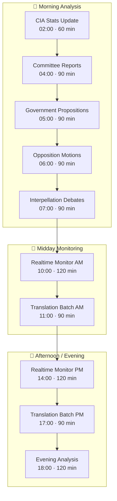
```mermaid
flowchart TD
    subgraph Morning["🌅 Morning Analysis"]
        A["CIA Stats Update<br/>02:00 · 60 min"]
        B["Committee Reports<br/>04:00 · 90 min"]
        C["Government Propositions<br/>05:00 · 90 min"]
        D["Opposition Motions<br/>06:00 · 90 min"]
        E["Interpellation Debates<br/>07:00 · 90 min"]
    end

    subgraph Midday["📰 Midday Monitoring"]
        F["Realtime Monitor AM<br/>10:00 · 120 min"]
        G["Translation Batch AM<br/>11:00 · 90 min"]
    end

    subgraph Evening["🌆 Afternoon / Evening"]
        H["Realtime Monitor PM<br/>14:00 · 120 min"]
        I["Translation Batch PM<br/>17:00 · 90 min"]
        J["Evening Analysis<br/>18:00 · 120 min"]
    end

    A --> B --> C --> D --> E --> F --> G --> H --> I --> J
```

### Weekend Schedule Variations

| Day | Active Workflows | Schedule Difference |
|-----|-----------------|---------------------|
| **Saturday** | Weekly Review (09:00) · Realtime Monitor (12:00) · Evening/Weekly Wrap-up (16:00) · Translation (14:00) | Reduced frequency; weekly synthesis |
| **Sunday** | Realtime Monitor (12:00) · Translation (14:00) | Minimal coverage |
| **1st of Month** | Month Ahead (08:00) · Quarter Ahead (09:00) | Monthly + quarterly strategic outlook |
| **15th of Month** | Quarter Ahead (09:00) | Mid-month quarterly refresh |
| **28th of Month** | Monthly Review (10:00) | Monthly retrospective |
| **Friday** | Week Ahead (07:00) | Weekly prospective outlook |
| **5 Jan / 5 Jul** | Year Ahead (09:00) | Semi-annual strategic outlook anchored in IMF WEO vintage |
| **13 Mar / 13 Sep** | Election Cycle (dispatch-only) | Delivered: semi-annual election-cycle deep intelligence (cron declared but disabled) |

---

## 🔄 Workflow Overview

The Riksdagsmonitor project uses **54 workflow files** (26 standard `.yml` + 14 agentic `.lock.yml` + 14 agentic `.md` sources) organized into 5 functional categories:

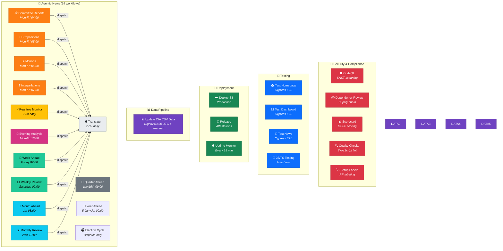
```mermaid
graph TB
    subgraph "🔐 Security & Compliance"
        SEC1["🛡️ CodeQL<br/><i>SAST scanning</i>"]
        SEC2["📦 Dependency Review<br/><i>Supply chain</i>"]
        SEC3["📊 Scorecard<br/><i>OSSF scoring</i>"]
        SEC4["🔍 Quality Checks<br/><i>TypeScript lint</i>"]
        SEC5["🏷️ Setup Labels<br/><i>PR labeling</i>"]
    end

    subgraph "🧪 Testing"
        TEST1["🏠 Test Homepage<br/><i>Cypress E2E</i>"]
        TEST2["📊 Test Dashboard<br/><i>Cypress E2E</i>"]
        TEST3["📰 Test News<br/><i>Cypress E2E</i>"]
        TEST4["🔬 JS/TS Testing<br/><i>Vitest unit</i>"]
    end

    subgraph "🚀 Deployment"
        DEP1["☁️ Deploy S3<br/><i>Production</i>"]
        DEP2["🔖 Release<br/><i>Attestations</i>"]
        DEP3["🌐 Uptime Monitor<br/><i>Every 15 min</i>"]
    end

    subgraph "📊 Data Pipeline"
        DATA1["📊 Update CIA CSV Data<br/><i>Nightly 03:30 UTC + manual</i>"]
    end

    subgraph "📰 Agentic News (14 workflows)"
        NEWS1["📋 Committee Reports<br/><i>Mon-Fri 04:00</i>"]
        NEWS2["📜 Propositions<br/><i>Mon-Fri 05:00</i>"]
        NEWS3["✊ Motions<br/><i>Mon-Fri 06:00</i>"]
        NEWS4["❓ Interpellations<br/><i>Mon-Fri 07:00</i>"]
        NEWS5["⚡ Realtime Monitor<br/><i>2-3× daily</i>"]
        NEWS6["🌙 Evening Analysis<br/><i>Mon-Fri 18:00</i>"]
        NEWS7["📅 Week Ahead<br/><i>Friday 07:00</i>"]
        NEWS8["📊 Weekly Review<br/><i>Saturday 09:00</i>"]
        NEWS9["📅 Month Ahead<br/><i>1st 08:00</i>"]
        NEWS10["📊 Monthly Review<br/><i>28th 10:00</i>"]
        NEWS11["🌐 Translate<br/><i>2-3× daily</i>"]
        NEWS12["📐 Quarter Ahead<br/><i>1st+15th 09:00</i>"]
        NEWS13["📆 Year Ahead<br/><i>5 Jan+Jul 09:00</i>"]
        NEWS14["🗳️ Election Cycle<br/><i>Dispatch only</i>"]
    end

    NEWS1 & NEWS2 & NEWS3 & NEWS4 & NEWS5 & NEWS6 -->|"dispatch"| NEWS11
    NEWS7 & NEWS8 & NEWS9 & NEWS10 -->|"dispatch"| NEWS11

    style SEC1 fill:#dc3545,color:#fff,stroke:#b02a37
    style SEC2 fill:#dc3545,color:#fff,stroke:#b02a37
    style SEC3 fill:#dc3545,color:#fff,stroke:#b02a37
    style SEC4 fill:#dc3545,color:#fff,stroke:#b02a37
    style SEC5 fill:#dc3545,color:#fff,stroke:#b02a37
    style TEST1 fill:#0d6efd,color:#fff,stroke:#0a58ca
    style TEST2 fill:#0d6efd,color:#fff,stroke:#0a58ca
    style TEST3 fill:#0d6efd,color:#fff,stroke:#0a58ca
    style TEST4 fill:#0d6efd,color:#fff,stroke:#0a58ca
    style DEP1 fill:#198754,color:#fff,stroke:#146c43
    style DEP2 fill:#198754,color:#fff,stroke:#146c43
    style DEP3 fill:#198754,color:#fff,stroke:#146c43
    style DATA1 fill:#6f42c1,color:#fff,stroke:#59359a
    style DATA2 fill:#6f42c1,color:#fff,stroke:#59359a
    style DATA3 fill:#6f42c1,color:#fff,stroke:#59359a
    style DATA4 fill:#6f42c1,color:#fff,stroke:#59359a
    style DATA5 fill:#6f42c1,color:#fff,stroke:#59359a
    style NEWS1 fill:#fd7e14,color:#fff,stroke:#ca6510
    style NEWS2 fill:#fd7e14,color:#fff,stroke:#ca6510
    style NEWS3 fill:#fd7e14,color:#fff,stroke:#ca6510
    style NEWS4 fill:#fd7e14,color:#fff,stroke:#ca6510
    style NEWS5 fill:#ffc107,color:#000,stroke:#cc9a06
    style NEWS6 fill:#d63384,color:#fff,stroke:#ab296a
    style NEWS7 fill:#20c997,color:#000,stroke:#1aa179
    style NEWS8 fill:#20c997,color:#000,stroke:#1aa179
    style NEWS9 fill:#0dcaf0,color:#000,stroke:#0aa2c0
    style NEWS10 fill:#0dcaf0,color:#000,stroke:#0aa2c0
    style NEWS11 fill:#e9ecef,color:#212529,stroke:#adb5bd
    style NEWS12 fill:#6c757d,color:#fff,stroke:#495057
```

### Core CI/CD Workflows

1. **✅ Quality Checks** (`.github/workflows/quality-checks.yml`) — ESLint linting, HTML validation, link checking
2. **🧹 Knip Dead Code Check** (`.github/workflows/knip.yml`) — Detects unused files, dependencies, binaries, and duplicate exports on every PR (informational pass also reports unused exports/types)
3. **🧪 TypeScript & JavaScript Testing** (`.github/workflows/javascript-testing.yml`) — Vitest unit tests, TypeScript type-checking, Cypress E2E
4. **📖 TypeDoc Validation** (`.github/workflows/jsdoc-validation.yml`) — API documentation generation and coverage
5. **🌐 Translation Validation** (`.github/workflows/translation-validation.yml`) — 14-language validation with RTL and hreflang
6. **🚀 Release with Attestations** (`.github/workflows/release.yml`) — SLSA provenance, SBOM, dual deployment
7. **☁️ Deploy to S3** (`.github/workflows/deploy-s3.yml`) — AWS S3/CloudFront deployment

### Security Scanning Workflows

7. **🔍 CodeQL Analysis** (`.github/workflows/codeql.yml`) — SAST for JavaScript/TypeScript vulnerabilities
8. **📦 Dependency Review** (`.github/workflows/dependency-review.yml`) — SCA for dependency vulnerabilities
9. **⭐ Scorecard Analysis** (`.github/workflows/scorecards.yml`) — OpenSSF supply chain security assessment

### Testing & Monitoring Workflows

10. **🖥️ Test Dashboard** (`.github/workflows/test-dashboard.yml`) — Dashboard Cypress E2E tests
11. **🏠 Test Homepage** (`.github/workflows/test-homepage.yml`) — Homepage Cypress E2E tests
12. **📰 Test News** (`.github/workflows/test-news.yml`) — News pages Cypress E2E tests
13. **🔆 Lighthouse CI** (`.github/workflows/lighthouse-ci.yml`) — Performance, accessibility, SEO auditing
14. **📡 Uptime Monitor** (`.github/workflows/uptime-monitor.yml`) — 15-minute availability checks for all 14 languages

### CIA Data Pipeline Workflows

15. **📊 Update CIA CSV Data** (`.github/workflows/update-cia-csv-data.yml`) — Nightly + manual refresh of every already-tracked `data/cia/**` and `cia-data/**` CSV from upstream `Hack23/cia` `service.data.impl/sample-data/` (recursive basename→path index, handles sub-folders); also refreshes `cia-data/production-stats.json` and injects counts into `index*.html`; opens a single PR when anything changes

### Automation & Infrastructure Workflows

16. **🏷️ Setup Labels** (`.github/workflows/setup-labels.yml`) — Repository label management
17. **🏷️ PR Labeler** (`.github/workflows/labeler.yml`) — Automated PR labeling
18. **🔧 Compile Agentic Workflows** (`.github/workflows/compile-agentic-workflows.yml`) — Compile .md → .lock.yml
19. **🤖 Copilot Setup Steps** (`.github/workflows/copilot-setup-steps.yml`) — GitHub Copilot environment

### 🤖 Agentic News Workflows (14 workflows: each has a `.md` source + `.lock.yml` compiled output)

20. **📰 News Committee Reports** — Committee report coverage
21. **📰 News Propositions** — Government proposition coverage
22. **📋 News Motions** — Parliamentary motion tracking
23. **❓ News Interpellations** — Interpellation debate tracking
24. **🌅 News Evening Analysis** — Evening analysis reports
25. **📡 News Realtime Monitor** — Real-time political monitoring
26. **🔮 News Week Ahead** — Upcoming week preview
27. **📅 News Month Ahead** — Upcoming month preview
28. **📊 News Quarter Ahead** — 90-day parliamentary-season forecast
29. **📈 News Year Ahead** — 365-day annual outlook (PESTLE blocking)
30. **🗳️ News Election Cycle** — Full 4-year mandate analysis (dispatch-only)
31. **📊 News Weekly Review** — Weekly political summary
32. **📆 News Monthly Review** — Monthly political review
33. **🌍 News Translate** — Multi-language article translation

### Workflow Relationships

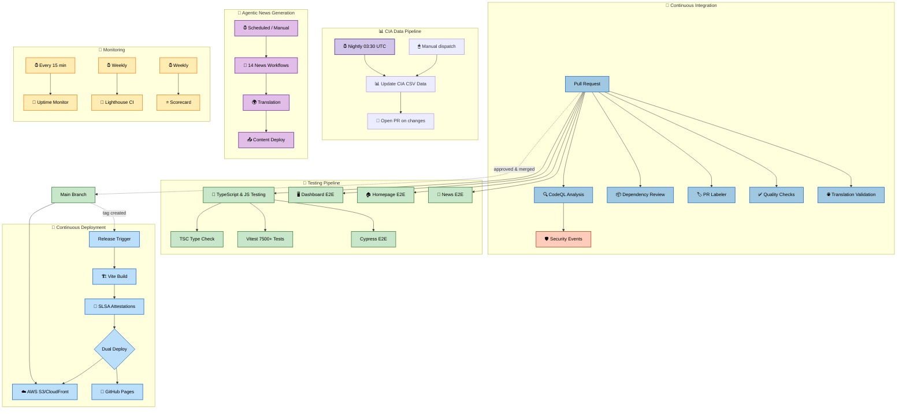
```mermaid
flowchart TB
    subgraph "🔄 Continuous Integration"
        direction TB
        PR[Pull Request] --> CodeQLScan[🔍 CodeQL Analysis]
        PR --> DependencyReview[📦 Dependency Review]
        PR --> Labeler[🏷️ PR Labeler]
        PR --> QualityChecks[✅ Quality Checks]
        PR --> TranslationVal[🌐 Translation Validation]
        CodeQLScan --> SecurityEvents[🛡️ Security Events]
    end

    subgraph "🧪 Testing Pipeline"
        direction TB
        PR --> UnitTests[🧪 TypeScript & JS Testing]
        UnitTests --> TypeCheck[TSC Type Check]
        UnitTests --> Vitest[Vitest 7500+ Tests]
        UnitTests --> CypressE2E[Cypress E2E]
        PR --> DashboardE2E[🖥️ Dashboard E2E]
        PR --> HomepageE2E[🏠 Homepage E2E]
        PR --> NewsE2E[📰 News E2E]
    end

    subgraph "📊 CIA Data Pipeline"
        direction TB
        Schedule1[⏰ Nightly 03:30 UTC] --> CIACsv[📊 Update CIA CSV Data]
        ManualTrig[🖱 Manual dispatch] --> CIACsv
        CIACsv --> CIAPR[🔁 Open PR on changes]
    end

    subgraph "🚀 Continuous Deployment"
        direction TB
        Release[Release Trigger] --> Build[🏗️ Vite Build]
        Build --> Attestations[🔏 SLSA Attestations]
        Attestations --> DualDeploy{Dual Deploy}
        DualDeploy --> S3Deploy[☁️ AWS S3/CloudFront]
        DualDeploy --> GHPages[📄 GitHub Pages]
    end

    subgraph "🤖 Agentic News Generation"
        direction TB
        AgenticTrigger[⏰ Scheduled / Manual] --> NewsGen[📰 14 News Workflows]
        NewsGen --> Translate[🌍 Translation]
        Translate --> ContentDeploy[📤 Content Deploy]
    end

    subgraph "📡 Monitoring"
        direction TB
        Cron15[⏰ Every 15 min] --> Uptime[📡 Uptime Monitor]
        WeeklyLH[⏰ Weekly] --> Lighthouse[🔆 Lighthouse CI]
        WeeklyScore[⏰ Weekly] --> Scorecard[⭐ Scorecard]
    end

    PR -.-> |"approved & merged"| main[Main Branch]
    main --> S3Deploy
    main -.-> |"tag created"| Release

    classDef integration fill:#a0c8e0,stroke:#1565c0,stroke-width:1.5px,color:black
    classDef testing fill:#c8e6c9,stroke:#2e7d32,stroke-width:1.5px,color:black
    classDef deployment fill:#bbdefb,stroke:#1565c0,stroke-width:1.5px,color:black
    classDef security fill:#ffccbc,stroke:#bf360c,stroke-width:1.5px,color:black
    classDef datapipeline fill:#d1c4e9,stroke:#4a148c,stroke-width:1.5px,color:black
    classDef agentic fill:#e1bee7,stroke:#6a1b9a,stroke-width:1.5px,color:black
    classDef monitoring fill:#ffecb3,stroke:#f57f17,stroke-width:1.5px,color:black
    classDef process fill:#c8e6c9,stroke:#2e7d32,stroke-width:1.5px,color:black

    class PR,CodeQLScan,DependencyReview,Labeler,QualityChecks,TranslationVal integration
    class UnitTests,TypeCheck,Vitest,CypressE2E,DashboardE2E,HomepageE2E,NewsE2E testing
    class Release,Build,Attestations,DualDeploy,S3Deploy,GHPages deployment
    class SecurityEvents security
    class Schedule1,Schedule2,CIAStats,SchemaCheck,DataValidation,SchemaSync datapipeline
    class AgenticTrigger,NewsGen,Translate,ContentDeploy agentic
    class Cron15,WeeklyLH,WeeklyScore,Uptime,Lighthouse,Scorecard monitoring
    class main process
```

### 📊 Security Gates & Quality Thresholds

| Security Gate | Threshold | Workflow | Enforcement |
| --- | --- | --- | --- |
| **TypeScript Compilation** | Zero errors | javascript-testing.yml | Required ✅ |
| **ESLint** | Zero errors | quality-checks.yml | Required ✅ |
| **HTMLHint Validation** | Zero errors | quality-checks.yml | Required ✅ |
| **Link Integrity** | Zero broken internal links | quality-checks.yml | Required ✅ |
| **Knip Dead Code (files/deps/dups)** | Zero unused files, deps, binaries, or duplicate exports | knip.yml | Required ✅ |
| **Unit Test Pass Rate** | 100% (7,500+ tests) | javascript-testing.yml | Required ✅ |
| **CodeQL SAST** | No critical/high | codeql.yml | Required ✅ |
| **Dependency Vulnerabilities** | No critical/high | dependency-review.yml | Required ✅ |
| **Translation Completeness** | All 14 languages valid | translation-validation.yml | Required ✅ |
| **OSSF Scorecard** | Score > 7.0 | scorecards.yml | Advisory ℹ️ |
| **Lighthouse Performance** | Score 90+ | lighthouse-ci.yml | Advisory ℹ️ |
| **Site Availability** | 99.9% uptime | uptime-monitor.yml | Advisory ℹ️ |

---

## 🔐 Security Hardening Practices

Riksdagsmonitor implements industry best practices for securing CI/CD pipelines, with StepSecurity hardening for all workflows:

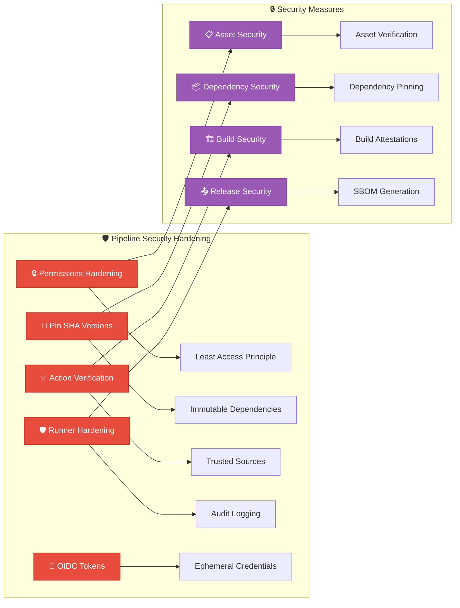
```mermaid
flowchart LR
    subgraph "🛡️ Pipeline Security Hardening"
        PH[🔒 Permissions Hardening] --> LAP[Least Access Principle]
        PS[📌 Pin SHA Versions] --> IDT[Immutable Dependencies]
        AV[✅ Action Verification] --> TS[Trusted Sources]
        RH[🛡️ Runner Hardening] --> AL[Audit Logging]
        OT[🔑 OIDC Tokens] --> EF[Ephemeral Credentials]
    end

    subgraph "🔒 Security Measures"
        AS[📋 Asset Security] --> AC[Asset Verification]
        DS[📦 Dependency Security] --> PD[Dependency Pinning]
        BS[🏗️ Build Security] --> BA[Build Attestations]
        RS[📤 Release Security] --> SBOM[SBOM Generation]
    end

    PH --> AS
    PS --> DS
    AV --> BS
    RH --> RS

    classDef security fill:#e74c3c,stroke:#c0392b,stroke-width:1.5px,color:white
    classDef measures fill:#9b59b6,stroke:#8e44ad,stroke-width:1.5px,color:white

    class PH,PS,AV,RH,OT security
    class AS,DS,BS,RS measures
```

### Specific Hardening Measures

Every workflow in the Riksdagsmonitor project implements least-privilege security. The baseline minimum permission is `contents: read`; individual workflows add only the extra scopes they need (e.g., `id-token: write` for OIDC, `pages: write` for deployments, `pull-requests: write` for PR comments):

1. **🔒 Permissions Restriction**: Explicit least-privilege permissions per workflow
   ```yaml
   # Baseline minimum — additional scopes added per-workflow as needed
   permissions:
     contents: read
   ```

2. **📌 SHA Pinning**: All external actions pinned to specific SHA hashes for immutability
   ```yaml
   - uses: actions/checkout@11bd71901bbe5b1630ceea73d27597364c9af683 # v4
   ```

3. **🛡️ Runner Hardening**: StepSecurity harden-runner for egress auditing
   ```yaml
   - name: Harden Runner
     uses: step-security/harden-runner@fa2e9d605c4eeb9fcad4c99c224cee0c6c7f3594 # v2.16.0
     with:
       egress-policy: audit
   ```

4. **📄 SBOM Generation**: Software Bill of Materials for supply chain transparency

5. **🔏 Build Attestations**: SLSA build provenance attestations (via GitHub Attestations)

6. **⏱️ Timeout Limits**: Jobs use timeout limits where applicable to prevent resource exhaustion

7. **🔑 OIDC Tokens**: Ephemeral authentication for AWS deployments

---

## 📋 Detailed Pipeline Stages

### 🧪 Stage 1: Quality Checks (`quality-checks.yml`)

**Purpose:** Validates code quality through ESLint linting, HTML validation, and link checking.
**Trigger:** Push/PR to `main`
**Security Controls:** Harden-runner with egress auditing, SHA-pinned actions, least privilege permissions (`contents: read`)

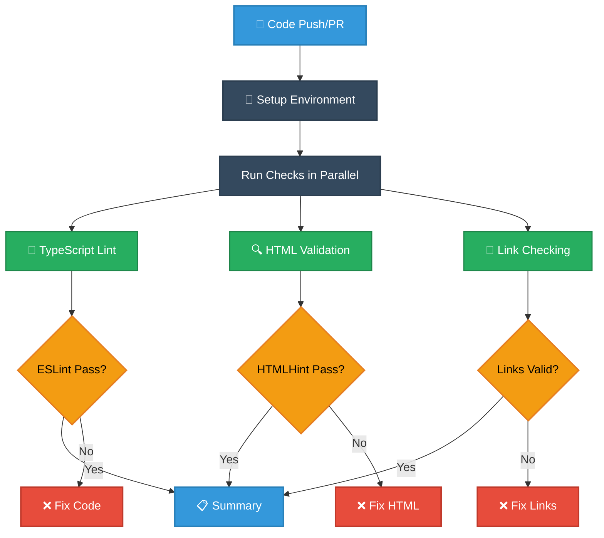
```mermaid
flowchart TD
    Start[🚀 Code Push/PR] --> Prepare[🔧 Setup Environment]
    Prepare --> ParallelChecks[Run Checks in Parallel]

    ParallelChecks --> TSLint[📝 TypeScript Lint]
    ParallelChecks --> HTMLVal[🔍 HTML Validation]
    ParallelChecks --> LinkCheck[🔗 Link Checking]

    TSLint --> TSResult{ESLint Pass?}
    HTMLVal --> HTMLResult{HTMLHint Pass?}
    LinkCheck --> LinkResult{Links Valid?}

    TSResult -->|Yes| Summary[📋 Summary]
    HTMLResult -->|Yes| Summary
    LinkResult -->|Yes| Summary

    TSResult -->|No| FixCode[❌ Fix Code]
    HTMLResult -->|No| FixHTML[❌ Fix HTML]
    LinkResult -->|No| FixLinks[❌ Fix Links]

    classDef startEnd fill:#3498db,stroke:#2980b9,stroke-width:2px,color:white
    classDef process fill:#34495e,stroke:#2c3e50,stroke-width:2px,color:white
    classDef test fill:#27ae60,stroke:#1e8449,stroke-width:1.5px,color:white
    classDef decision fill:#f39c12,stroke:#e67e22,stroke-width:2px,color:black
    classDef fail fill:#e74c3c,stroke:#c0392b,stroke-width:2px,color:white

    class Start,Summary startEnd
    class Prepare,ParallelChecks process
    class TSLint,HTMLVal,LinkCheck test
    class TSResult,HTMLResult,LinkResult decision
    class FixCode,FixHTML,FixLinks fail
```

**Jobs:**
- **📝 TypeScript Lint** — ESLint flat config with `@typescript-eslint/parser` across `tsconfig.browser.json` + `tsconfig.scripts.json`
- **🔍 HTML Validation** — HTMLHint on all `*.html` files (14 language versions)
- **🔗 Link Checking** — Vite preview server + linkinator recursive check (skip external)

---

### 🧪 Stage 2: TypeScript & JavaScript Testing (`javascript-testing.yml`)

**Purpose:** Primary test workflow — TypeScript type-checking, Vitest unit tests, Vite build verification, and multi-language Cypress E2E.
**Trigger:** Push/PR on `**/*.ts`, `**/*.js`, `src/browser/**`, `tsconfig*.json`, `*.html`, `cypress/**`, `package*.json`

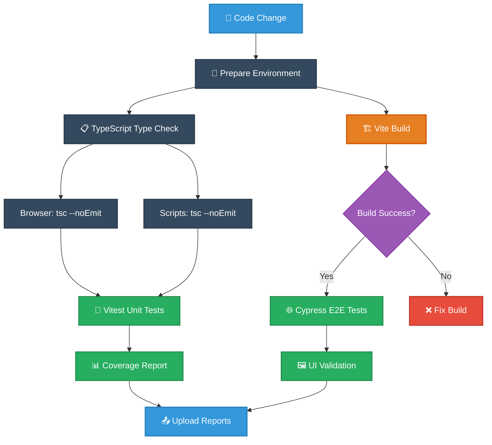
```mermaid
flowchart TD
    CodeChange[📝 Code Change] --> PrepareJob[🔧 Prepare Environment]
    PrepareJob --> TypeCheck[📋 TypeScript Type Check]
    TypeCheck --> BrowserTSC[Browser: tsc --noEmit]
    TypeCheck --> ScriptsTSC[Scripts: tsc --noEmit]

    BrowserTSC --> UnitTests[🧪 Vitest Unit Tests]
    ScriptsTSC --> UnitTests
    UnitTests --> CoverageMeasurement[📊 Coverage Report]

    PrepareJob --> BuildValidation[🏗️ Vite Build]
    BuildValidation --> BuildPass{Build Success?}
    BuildPass -->|Yes| E2ETests[🌐 Cypress E2E Tests]
    BuildPass -->|No| FixBuild[❌ Fix Build]

    E2ETests --> UIValidation[🖼️ UI Validation]

    CoverageMeasurement --> Report[📤 Upload Reports]
    UIValidation --> Report

    classDef start fill:#3498db,stroke:#2980b9,stroke-width:2px,color:white
    classDef process fill:#34495e,stroke:#2c3e50,stroke-width:2px,color:white
    classDef test fill:#27ae60,stroke:#1e8449,stroke-width:1.5px,color:white
    classDef decision fill:#9b59b6,stroke:#8e44ad,stroke-width:2px,color:white
    classDef parallel fill:#e67e22,stroke:#d35400,stroke-width:2px,color:white
    classDef fail fill:#e74c3c,stroke:#c0392b,stroke-width:2px,color:white

    class CodeChange start
    class PrepareJob,TypeCheck,BrowserTSC,ScriptsTSC process
    class UnitTests,CoverageMeasurement,E2ETests,UIValidation test
    class BuildPass decision
    class BuildValidation parallel
    class FixBuild fail
    class Report start
```

**TypeScript Compilation Strategy:**
- `tsconfig.browser.json` — validates `src/browser/**/*.ts` (31 modules)
- `tsconfig.scripts.json` — validates `scripts/**/*.ts` + `tests/**/*.ts`
- Both use `noEmit: true` (Vite/esbuild handles actual compilation)

**Test Coverage:** 7,500+ unit tests (Vitest) + Happy-DOM environment for browser modules + V8 coverage provider

---

### 🔍 Stage 3: Security Scanning

#### 3.1 CodeQL Analysis (`codeql.yml`)

**Tool:** GitHub CodeQL
**Trigger:** Push to main, PR, weekly schedule
**Language matrix:** `["javascript-typescript"]`

#### 3.2 Dependency Review (`dependency-review.yml`)

**Tool:** `actions/dependency-review-action`
**Trigger:** Pull requests
**Gate:** Blocks PRs with critical/high vulnerability dependencies

#### 3.3 OpenSSF Scorecard (`scorecards.yml`)

**Tool:** OpenSSF Scorecard
**Trigger:** Push to main, weekly schedule
**Purpose:** Supply chain security assessment and OSSF best practices evaluation

---

### 🚀 Stage 4: Release & Deployment

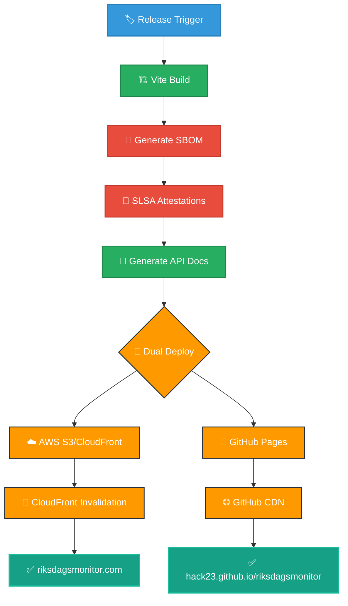
```mermaid
flowchart TD
    Trigger[🏷️ Release Trigger] --> Build[🏗️ Vite Build]
    Build --> SBOM[📄 Generate SBOM]
    SBOM --> Attestations[🔏 SLSA Attestations]
    Attestations --> TypeDoc[📖 Generate API Docs]
    TypeDoc --> DualDeploy{🚀 Dual Deploy}

    DualDeploy --> S3[☁️ AWS S3/CloudFront]
    DualDeploy --> GHP[📄 GitHub Pages]

    S3 --> CFInvalidate[🔄 CloudFront Invalidation]
    GHP --> GHPCdn[🌐 GitHub CDN]

    CFInvalidate --> Live1[✅ riksdagsmonitor.com]
    GHPCdn --> Live2[✅ hack23.github.io/riksdagsmonitor]

    classDef trigger fill:#3498db,stroke:#2980b9,stroke-width:2px,color:white
    classDef build fill:#27ae60,stroke:#1e8449,stroke-width:1.5px,color:white
    classDef security fill:#e74c3c,stroke:#c0392b,stroke-width:1.5px,color:white
    classDef deploy fill:#FF9900,stroke:#232F3E,stroke-width:1.5px,color:white
    classDef complete fill:#16a085,stroke:#1abc9c,stroke-width:2px,color:white

    class Trigger trigger
    class Build,TypeDoc build
    class SBOM,Attestations security
    class DualDeploy,S3,GHP,CFInvalidate,GHPCdn deploy
    class Live1,Live2 complete
```

**Release Pipeline Features:**
- **🏷️ Tag-based Releases**: Automatic releases on `v*` tag push
- **📋 Manual Releases**: Workflow dispatch with version input
- **🔒 SLSA Attestations**: Build provenance for supply chain security
- **📄 SBOM Generation**: Software Bill of Materials
- **📖 TypeDoc**: API documentation generation
- **☁️ Dual Deployment**: AWS S3/CloudFront (primary) + GitHub Pages (DR)

**S3 Sync Exclusions:** `.git/*`, `.github/*`, `node_modules/*`, `src/*`, `tests/*`, `cypress/*`, `builds/*`, `tsconfig*.json`, `*.config.js`

---

### 📊 Stage 5: CIA Data Integration

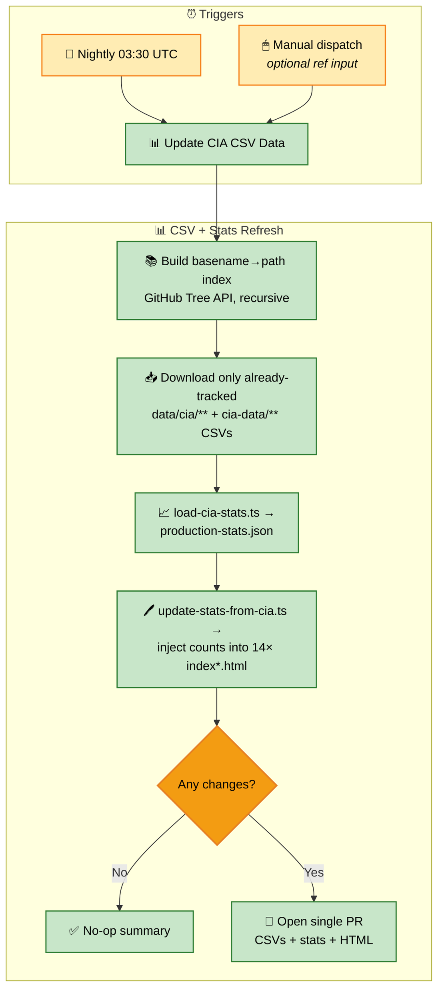
```mermaid
flowchart TD
    subgraph "⏰ Triggers"
        Nightly[📅 Nightly 03:30 UTC] --> Refresh[📊 Update CIA CSV Data]
        Manual[🖱 Manual dispatch<br/><i>optional ref input</i>] --> Refresh
    end

    subgraph "📊 CSV + Stats Refresh"
        Refresh --> TreeIdx[📚 Build basename→path index<br/>GitHub Tree API, recursive]
        TreeIdx --> Download[📥 Download only already-tracked<br/>data/cia/** + cia-data/** CSVs]
        Download --> Stats[📈 load-cia-stats.ts →<br/>production-stats.json]
        Stats --> Inject[🖊 update-stats-from-cia.ts →<br/>inject counts into 14× index*.html]
        Inject --> Diff{Any changes?}
        Diff -->|No| NoOp[✅ No-op summary]
        Diff -->|Yes| AutoPR[🔁 Open single PR<br/>CSVs + stats + HTML]
    end

    classDef schedule fill:#ffecb3,stroke:#f57f17,stroke-width:1.5px,color:black
    classDef pipeline fill:#c8e6c9,stroke:#2e7d32,stroke-width:1.5px,color:black
    classDef decision fill:#f39c12,stroke:#e67e22,stroke-width:2px,color:black

    class Nightly,Manual schedule
    class Refresh,TreeIdx,Download,Stats,Inject,AutoPR,NoOp pipeline
    class Diff decision
```

**Workflows:**
- **📊 Update CIA CSV Data** (`update-cia-csv-data.yml`): Nightly at 03:30 UTC and on manual dispatch.
  - **Source of truth for *what* to refresh** = the set of CSVs already tracked in this repository under `data/cia/**` and `cia-data/**`. The workflow never introduces new files.
  - **Source of truth for *where* each CSV lives upstream** = a `basename → upstream-path` index built once per run from the GitHub Tree API (`/repos/Hack23/cia/git/trees/<ref>?recursive=1`). This correctly resolves sub-folder CSVs (e.g. `distinct_values/vote_data_party.csv`, `framework-validation/**`, `risk-rule-tests/**`) — the upstream layout is **not** flat. A `<stem>_sample.csv` alias is tried as a fallback for the handful of locally-renamed canonical files (`view_riksdagen_committee_decisions.csv` → upstream `view_riksdagen_committee_decisions_sample.csv`, etc.).
  - **Stats refresh** — after the CSV step, the workflow runs `npx tsx scripts/load-cia-stats.ts` to regenerate `cia-data/production-stats.json` from upstream [`extraction_summary_report.csv`](https://github.com/Hack23/cia/blob/master/service.data.impl/sample-data/extraction_summary_report.csv), then `npx tsx scripts/update-stats-from-cia.ts` to inject the refreshed counts into all 14 `index*.html` language variants.
  - **PR output** — a single automated pull request is opened via `peter-evans/create-pull-request` whenever CSV content, `production-stats.json`, or `index*.html` change. Byte-level `cmp` ensures commits are produced only on real diffs.
  - **Skipped paths** — locally-curated files with no upstream equivalent are never overwritten: `data/cia/ministry/sample_{influence,decision_impact,risk_levels,productivity}.csv` and `cia-data/election/{election_forecast,coalition_scenarios}.csv`.

---

### 🤖 Stage 6: Agentic News Generation

Fourteen agentic workflows use the `gh-aw` (GitHub Agentic Workflows) framework to generate political-intelligence content following OSINT/INTOP editorial standards and the 23-artifact analysis baseline. The **13 analysis/article-generating workflows run on `claude-opus-5`** (strongest reasoning for the analysis pipeline), while the high-volume **`news-translate` workflow stays on `claude-sonnet-4.6`** for translation-fan-out throughput.

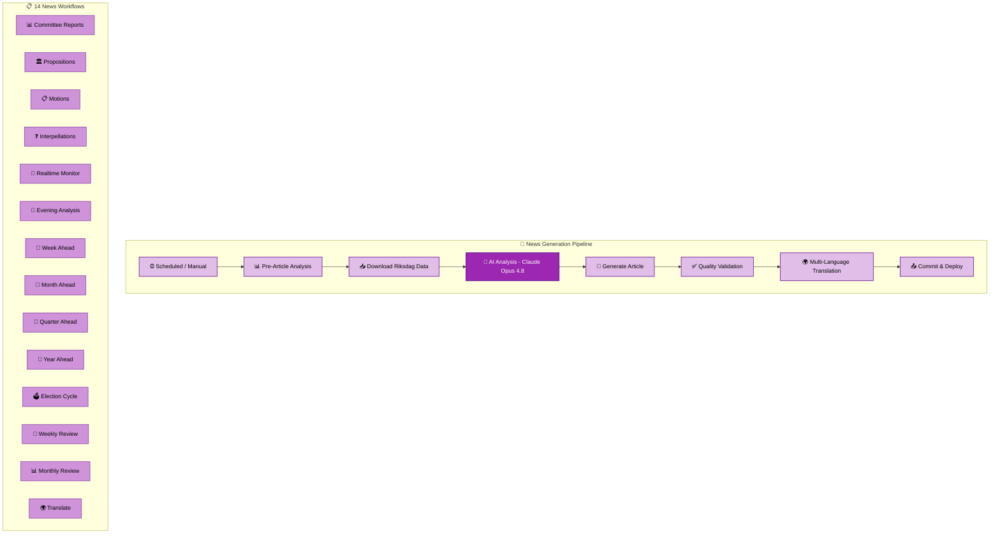
```mermaid
flowchart TD
    subgraph "📰 News Generation Pipeline"
        Trigger[⏰ Scheduled / Manual] --> PreAnalysis[📊 Pre-Article Analysis]
        PreAnalysis --> Download[📥 Download Riksdag Data]
        Download --> AIAnalysis[🤖 AI Analysis - Claude Opus 4.8]
        AIAnalysis --> Generate[📝 Generate Article]
        Generate --> QualityCheck[✅ Quality Validation]
        QualityCheck --> Translate[🌍 Multi-Language Translation]
        Translate --> Deploy[📤 Commit & Deploy]
    end

    subgraph "📋 14 News Workflows"
        W1[📊 Committee Reports]
        W2[🏛️ Propositions]
        W3[📋 Motions]
        W4[❓ Interpellations]
        W5[📡 Realtime Monitor]
        W6[🌅 Evening Analysis]
        W7[🔮 Week Ahead]
        W8[📅 Month Ahead]
        W9[📐 Quarter Ahead]
        W10[📆 Year Ahead]
        W11[🗳️ Election Cycle]
        W12[📰 Weekly Review]
        W13[📊 Monthly Review]
        W14[🌍 Translate]
    end

    classDef pipeline fill:#e1bee7,stroke:#6a1b9a,stroke-width:1.5px,color:black
    classDef workflow fill:#ce93d8,stroke:#6a1b9a,stroke-width:1px,color:black
    classDef ai fill:#9C27B0,stroke:#6a1b9a,stroke-width:2px,color:white

    class Trigger,PreAnalysis,Download,Generate,QualityCheck,Translate,Deploy pipeline
    class AIAnalysis ai
    class W1,W2,W3,W4,W5,W6,W7,W8,W9,W10,W11,W12,W13,W14 workflow
```

**MCP Tools Available:**
- `riksdag-regering-mcp` (32 tools for Swedish political data)
- `@playwright/mcp` (browser automation)
- `@modelcontextprotocol/server-filesystem`
- `@modelcontextprotocol/server-memory`

**Compilation:** Source `.md` → `.lock.yml` via `compile-agentic-workflows.yml`

#### Per-Workflow Data Download & Unique Analytics

Each agentic workflow downloads data from specific MCP tools and produces unique political intelligence that only that document type can provide:


```mermaid
graph TB
    subgraph "📥 MCP Data Sources"
        BET["get_betankanden<br/><i>Committee reports</i>"]
        PROP["get_propositioner<br/><i>Government bills</i>"]
        MOT["get_motioner<br/><i>Opposition motions</i>"]
        INTERP["get_interpellationer<br/><i>Parliamentary questions</i>"]
        VOTE["search_voteringar<br/><i>Voting records</i>"]
        ANF["search_anforanden<br/><i>Debate speeches</i>"]
        DOK["search_dokument<br/><i>Document search</i>"]
        DOKFT["search_dokument_fulltext<br/><i>Full-text search</i>"]
        CAL["get_calendar_events<br/><i>Parliamentary calendar</i>"]
        SCB["SCB MCP<br/><i>Statistics Sweden</i>"]
        WB["World Bank MCP<br/><i>International data</i>"]
        IMF["IMF TypeScript client<br/><i>WEO + Fiscal Monitor + IFS<br/>pure-TS, not MCP</i>"]
    end

    subgraph "📰 Agentic Workflows"
        WF_CR["📋 Committee Reports"]
        WF_PR["📜 Propositions"]
        WF_MO["✊ Motions"]
        WF_IP["❓ Interpellations"]
        WF_EV["🌙 Evening Analysis"]
        WF_RT["⚡ Realtime Monitor"]
        WF_WR["📅 Weekly Review"]
        WF_WA["🔮 Week Ahead"]
    end

    BET --> WF_CR
    VOTE --> WF_CR
    ANF --> WF_CR
    PROP --> WF_CR
    SCB --> WF_CR
    WB --> WF_EV
    WB --> WF_WR
    IMF --> WF_EV
    IMF --> WF_WR
    IMF --> WF_WA
    IMF --> WF_CR
    PROP --> WF_PR
    DOKFT --> WF_PR
    ANF --> WF_PR
    MOT --> WF_MO
    DOKFT --> WF_MO
    ANF --> WF_MO
    INTERP --> WF_IP
    ANF --> WF_IP
    DOKFT --> WF_IP
    CAL --> WF_IP
    VOTE --> WF_EV
    ANF --> WF_EV
    BET --> WF_EV
    CAL --> WF_EV
    DOK --> WF_RT
    CAL --> WF_RT
    VOTE --> WF_RT
    ANF --> WF_RT
    BET --> WF_RT
    DOK --> WF_WR
    ANF --> WF_WR
    BET --> WF_WR
    PROP --> WF_WR
    MOT --> WF_WR
    VOTE --> WF_WR
    CAL --> WF_WA
    DOK --> WF_WA
    ANF --> WF_WA
    INTERP --> WF_WA

    style BET fill:#198754,color:#fff
    style PROP fill:#0d6efd,color:#fff
    style MOT fill:#fd7e14,color:#fff
    style INTERP fill:#dc3545,color:#fff
    style VOTE fill:#6f42c1,color:#fff
    style ANF fill:#d63384,color:#fff
    style DOK fill:#20c997,color:#000
    style DOKFT fill:#17a589,color:#fff
    style CAL fill:#0dcaf0,color:#000
    style SCB fill:#ffc107,color:#000
    style WB fill:#ff9800,color:#000
    style IMF fill:#00897b,color:#fff,stroke:#004d40,stroke-width:2px
    style WF_CR fill:#198754,color:#fff,stroke-width:2px
    style WF_PR fill:#0d6efd,color:#fff,stroke-width:2px
    style WF_MO fill:#fd7e14,color:#fff,stroke-width:2px
    style WF_IP fill:#dc3545,color:#fff,stroke-width:2px
    style WF_EV fill:#6f42c1,color:#fff,stroke-width:2px
    style WF_RT fill:#d63384,color:#fff,stroke-width:2px
    style WF_WR fill:#20c997,color:#000,stroke-width:2px
    style WF_WA fill:#0dcaf0,color:#000,stroke-width:2px
```

| # | Workflow | Schedule | Primary MCP Data | Unique Analytics Produced |
|---|---------|----------|-----------------|--------------------------|
| 1 | **Committee Reports** | Mon–Fri 04:00 UTC | `get_betankanden`, `search_voteringar`, `search_anforanden`, `get_propositioner` | Committee voting splits per party, reservation (dissent) analysis, committee-to-policy-domain mapping, SCB statistical enrichment per committee domain |
| 2 | **Propositions** | Mon–Fri 05:00 UTC | `get_propositioner`, `search_dokument_fulltext`, `analyze_g0v_by_department`, `search_anforanden` | Legislative pipeline tracking (referral → committee → vote), government legislative ambition score, budget allocation impact analysis, policy domain cascading effects |
| 3 | **Motions** | Mon–Fri 06:00 UTC | `get_motioner`, `search_dokument_fulltext`, `analyze_g0v_by_department`, `search_anforanden` | Opposition strategy analysis, motion clustering by theme, cross-party co-sponsorship detection, signalverdi (is this positioning or a real bid?) |
| 4 | **Interpellations** | Mon–Fri 07:00 UTC | `get_interpellationer`, `search_anforanden`, `search_dokument_fulltext`, `get_calendar_events` | Ministerial accountability scoring (response rate/timeliness), evasion detection, question framing analysis, party oversight strategy mapping |
| 5 | **Realtime Monitor** | Mon–Fri 10:00+14:00, Weekends 12:00 | `search_dokument`, `get_calendar_events`, `search_voteringar`, `search_anforanden`, `get_betankanden` | Breaking event detection, urgency classification, real-time political temperature spikes |
| 6 | **Evening Analysis** | Mon–Fri 18:00, Sat 16:00 | `search_voteringar`, `search_anforanden`, `get_betankanden`, `get_calendar_events` | Daily parliamentary pulse, party discipline metrics, coalition cohesion scoring, debate intensity index |
| 7 | **Weekly Review** | Sat 09:00 UTC | `search_dokument`, `search_anforanden`, `get_betankanden`, `get_propositioner`, `get_motioner`, `search_voteringar` | Week-over-week trend detection, cross-document-type pattern identification, legislative throughput metrics; **IMF WEO / Fiscal Monitor projections enrich the weekly macroeconomic framing** |
| 8 | **Week Ahead** | Fri 07:00 UTC | `get_calendar_events`, `search_dokument`, `search_anforanden`, `get_fragor`, `get_interpellationer` | Prospective calendar analysis, scheduled debate preview, expected vote outcomes; **IMF projections (T+5 horizon) are the primary source for forward-looking economic commentary** |
| 9 | **Monthly Review** | 28th 10:00 UTC | `search_dokument`, `search_anforanden`, `get_betankanden`, `get_propositioner`, `get_motioner`, `search_voteringar` | Monthly legislative throughput, party productivity rankings, government vs opposition scorecard; **IMF IFS monthly series + WEO vintages used for fiscal/monetary context** |
| 10 | **Month Ahead** | 1st 08:00 UTC | `get_calendar_events`, `search_dokument`, `get_betankanden`, `get_propositioner`, `get_motioner` | Strategic political calendar, legislative pipeline forecast, major policy decision timeline; **IMF WEO / Fiscal Monitor projection vintage (`projectionVintage` pinned per article) anchors medium-term outlook** |
| 11 | **Article Generator** | Manual only | Per-type (configurable) | Manual backfill/regeneration for any article type |
| 12 | **Translate** | Mon–Fri 11:00+17:00, Weekends 14:00 | N/A (text processing) | 14-language translation quality with cultural adaptation |

---

### 🧩 Stage 6.1: Agentic Workflow Structure & Prompt Imports

Every `news-*.md` source in `.github/workflows/` is a **gh-aw workflow** — a Markdown file whose YAML frontmatter compiles down, via `gh aw compile`, to a hardened GitHub Actions `.lock.yml`. A workflow is made up of three layers:

```
┌─────────────────────────────────────────────────────────────────────────┐
│  news-<type>.md                                                         │
│  ├── Frontmatter (name, triggers, runtimes, network, tools, mcp-servers)│
│  ├── imports:                                                           │
│  │    ├── prompts/00-base-contract.md      ← role, ethics, AI-FIRST     │
│  │    ├── prompts/01-bash-and-shell-safety.md                           │
│  │    ├── prompts/02-mcp-access.md         ← MCP inventory + health     │
│  │    ├── prompts/03-data-download.md      ← download pipeline          │
│  │    ├── prompts/04-analysis-pipeline.md  ← 23 artifacts (4 families), Pass 1+2 │
│  │    ├── prompts/05-analysis-gate.md      ← BLOCKING artifact gate     │
│  │    ├── prompts/06-article-generation.md ← sections, banned patterns  │
│  │    └── prompts/07-commit-and-pr.md      ← stage → commit → PR        │
│  ├── (Tier-C only) imports: prompts/ext/tier-c-aggregation.md ← depth multipliers │
│  └── Body = per-type instructions (e.g. "generate propositions article")│
└─────────────────────────────────────────────────────────────────────────┘
                                │
                                │  gh aw compile
                                ▼
┌─────────────────────────────────────────────────────────────────────────┐
│  news-<type>.lock.yml    (the only file GitHub Actions executes)        │
│  ├── SHA-pinned actions (100%)                                          │
│  ├── step-security/harden-runner with egress audit                      │
│  ├── Squid proxy + iptables firewall over network.allowed:              │
│  ├── Five-layer safe-outputs validator                                  │
│  └── MCP servers wired: riksdag-regering, scb, world-bank               │
└─────────────────────────────────────────────────────────────────────────┘
```

#### Import order is a contract

The import order is **not arbitrary** — each module builds on the previous one, and [`.github/prompts/05-analysis-gate.md`](.github/prompts/05-analysis-gate.md) is a single blocking gate that refuses to let the agent draft a single article sentence until all required artifacts are on disk in `analysis/daily/$ARTICLE_DATE/$SUBFOLDER/` for both Pass 1 and Pass 2. The baseline is **23 artifacts**; year-ahead requires **24** (23 + `pestle-analysis.md` via LH-4); election-cycle requires **28** (23 + 5 blocking supplementary via LH-4 + LH-5: `pestle-analysis.md`, `cycle-trajectory.md`, `wildcards-blackswans.md`, `quantitative-swot.md`, `political-stride-assessment.md`).

| Import # | Module | Responsibility | What fails fast if missing |
|---------:|--------|----------------|----------------------------|
| 1 | `00-base-contract.md` | Role, editorial ethics, GDPR, ISMS, AI-FIRST 2-pass minimum | Ethics drift, privacy leaks, shallow output |
| 2 | `01-bash-and-shell-safety.md` | UTF-8 shell patterns, no `eval`, no shell-expansion exploits | Command injection, encoding corruption |
| 3 | `02-mcp-access.md` | MCP server inventory + health probe | Wrong tool called, missing data source |
| 4 | `03-data-download.md` | Download manifest, source attribution, caching | Unsourced claims |
| 5 | `04-analysis-pipeline.md` | 23 required artifacts (Family A–D), methodology → template bindings, Pass 1 + Pass 2 | Shallow analysis, template mismatch |
| 6 | **`05-analysis-gate.md`** | **Blocks article generation until artifacts are complete** | *Any article written before gate passes → workflow failure* |
| 7 | `06-article-generation.md` | Article sections, banned hype patterns, visualisation, translations | Boilerplate content, missing charts |
| 8 | `07-commit-and-pr.md` | Stage → commit → exactly one `create_pull_request` call | Orphan commits, duplicate PRs |
| 9 (Tier-C only) | `ext/tier-c-aggregation.md` | Depth multipliers, cross-type synthesis, higher article floor (same 23 artifacts) | Aggregation without base artifacts |

#### Dependency graph

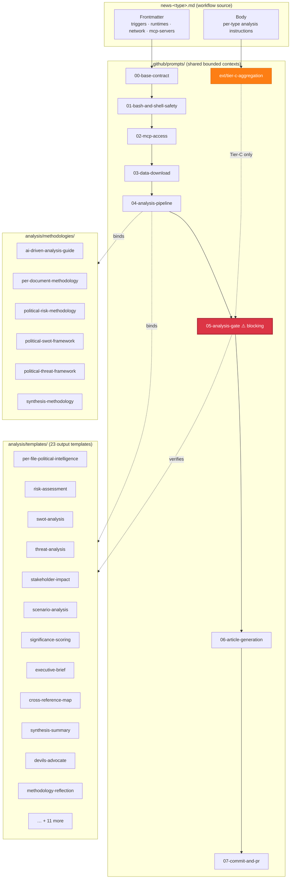
```mermaid
flowchart TB
  subgraph WF["news-&lt;type&gt;.md (workflow source)"]
    FM[Frontmatter<br/>triggers · runtimes · network · mcp-servers]
    BODY[Body<br/>per-type analysis instructions]
  end

  subgraph PROMPTS[".github/prompts/ (shared bounded contexts)"]
    P00[00-base-contract]
    P01[01-bash-and-shell-safety]
    P02[02-mcp-access]
    P03[03-data-download]
    P04[04-analysis-pipeline]
    P05[05-analysis-gate ⚠️ blocking]
    P06[06-article-generation]
    P07[07-commit-and-pr]
    PEXT[ext/tier-c-aggregation]
  end

  subgraph METH["analysis/methodologies/"]
    M1[ai-driven-analysis-guide]
    M2[per-document-methodology]
    M3[political-risk-methodology]
    M4[political-swot-framework]
    M5[political-threat-framework]
    M6[synthesis-methodology]
  end

  subgraph TPL["analysis/templates/ (23 output templates)"]
    T1[per-file-political-intelligence]
    T2[risk-assessment]
    T3[swot-analysis]
    T4[threat-analysis]
    T5[stakeholder-impact]
    T6[scenario-analysis]
    T7[significance-scoring]
    T8[executive-brief]
    T9[cross-reference-map]
    T10[synthesis-summary]
    T11[devils-advocate]
    T12[methodology-reflection]
    T13[… + 11 more]
  end

  FM --> P00 --> P01 --> P02 --> P03 --> P04 --> P05 --> P06 --> P07
  P04 -.binds.-> METH
  P04 -.binds.-> TPL
  P05 -.verifies.-> TPL
  BODY --> PEXT
  PEXT -. Tier-C only .-> P05

  style P05 fill:#dc3545,color:#fff,stroke:#b02a37,stroke-width:3px
  style PEXT fill:#fd7e14,color:#fff,stroke:#ca6510
```

#### Single-type vs. Tier-C artifact contract

All workflows produce the same **23 always-on artifacts** (Family A 9 + Family B 2 + Family C 5 + Family D 7) defined in [`prompts/04-analysis-pipeline.md`](.github/prompts/04-analysis-pipeline.md). The counts below are *baseline* blocking artifacts from the main gate checks and long-horizon checks (LH-4, LH-5). In addition, the gate's **supplementary checks** (S1–S7 in [`05-analysis-gate.md`](.github/prompts/05-analysis-gate.md)) can block runs depending on tier and article type:

- **`comprehensive` tier** and **aggregation types** (`weekly-review`, `monthly-review`): `analysis-index.md`, `reference-analysis-quality.md`, `mcp-reliability-audit.md`, `workflow-audit.md` become blocking; aggregation types also require `cross-session-intelligence.md` and `session-baseline.md`
- **Multi-run** (≥ 2 production runs of the same article type): `cross-run-diff.md` becomes blocking

**Long-horizon gates** (LH-4, LH-5) additionally require **analytical supplementary artifacts** that are normally optional but become blocking for specific workflows:

- **Year-ahead (LH-4)**: `pestle-analysis.md` — total **24** baseline blocking artifacts
- **Election-cycle (LH-4 + LH-5)**: `pestle-analysis.md` + `cycle-trajectory.md` + `wildcards-blackswans.md` + `quantitative-swot.md` + `political-stride-assessment.md` — total **28** baseline blocking artifacts

| Contract | Applies to | Baseline blocking | Depth | Source |
|----------|-----------|-------------------:|-------|--------|
| **Single-type** | `news-propositions`, `news-motions`, `news-committee-reports`, `news-interpellations` | **23** | standard/deep | [`prompts/05-analysis-gate.md`](.github/prompts/05-analysis-gate.md) |
| **Tier-C aggregation** | `news-evening-analysis`, `news-realtime-monitor`, `news-week-ahead`, `news-month-ahead`, `news-weekly-review`, `news-monthly-review`, `news-quarter-ahead` | **23** (+ S1–S7 per tier/type) | × 1.0–1.7 | [`prompts/ext/tier-c-aggregation.md`](.github/prompts/ext/tier-c-aggregation.md) |
| **Tier-C + year-ahead** | `news-year-ahead` | **24** (23 + `pestle-analysis.md` via LH-4; + S1–S7 per tier) | × 2.0 | [`prompts/ext/tier-c-aggregation.md`](.github/prompts/ext/tier-c-aggregation.md) + LH-4 |
| **Tier-C + election-cycle** | `news-election-cycle` | **28** (23 + 5 via LH-4 + LH-5; + S1–S7 per tier) | × 2.5 | [`prompts/ext/tier-c-aggregation.md`](.github/prompts/ext/tier-c-aggregation.md) + LH-4 + LH-5 |
| **Translation** (N/A) | `news-translate` | N/A (catch-up only — primary translation now happens inside each per-type run) | — | Direct text pipeline |

All artifacts are written under `analysis/daily/$ARTICLE_DATE/$SUBFOLDER/` — see [`analysis/README.md`](analysis/README.md) for the on-disk layout and [`analysis/templates/README.md`](analysis/templates/README.md) for the 23 canonical templates.

#### MCP server wiring (identical across all 14 agentic workflows)

```yaml
mcp-servers:
  riksdag-regering:                           # HTTP (hosted)
    url: https://riksdag-regering-ai.onrender.com/mcp
    allowed: ["*"]
  scb:                                         # Container (per-run)
    container: "node:26-alpine"
    entrypoint: "npx"
    entrypointArgs: ["-y", "@jarib/pxweb-mcp@2.0.0",
                     "--url", "https://api.scb.se/OV0104/v2beta"]
    allowed: ["*"]
  world-bank:                                  # Container (per-run)
    container: "node:26-alpine"
    entrypoint: "npx"
    entrypointArgs: ["-y", "worldbank-mcp@1.0.1"]
    allowed: ["*"]
```

In addition, every workflow activates the gh-aw-provided `github` (all toolsets), `agentic-workflows`, `bash`, `playwright`, and `repo-memory` tools. IMF ingestion is **not** an MCP server — it is pulled by `scripts/imf-client.ts` (pure-TS Datamapper JSON + SDMX 3.0 client), fully covered by the npm SBOM, so the total MCP server count remains **8** (3 shared here + 5 repo-level in `.github/copilot-mcp.json`).

#### Network egress allow-list (applies to every agentic workflow)

```yaml
network:
  allowed:
    - node                              # npm registry ecosystem
    - github                            # GitHub API
    - defaults                          # Curated dev domains
    - riksdag-regering-ai.onrender.com  # Riksdag MCP
    - api.scb.se                        # Statistics Sweden
    - api.worldbank.org                 # World Bank
    - api.imf.org                       # IMF (for imf-client.ts)
    - data.riksdagen.se                 # Riksdag open data
    - riksdagen.se / www.riksdagen.se   # Riksdag website
    - regeringen.se / www.regeringen.se # Government website
    - hack23.com / www.hack23.com       # Hack23 platform
    - riksdagsmonitor.com               # This platform
    - raw.githubusercontent.com         # Raw GitHub content
    - hack23.github.io                  # GitHub Pages DR
```

Any outbound connection not matching this allow-list is dropped at the Squid proxy / iptables layer.

#### Compilation lifecycle

1. Author edits `news-<type>.md`.
2. PR triggers [`compile-agentic-workflows.yml`](.github/workflows/compile-agentic-workflows.yml).
3. That workflow runs `gh aw compile` to regenerate the sibling `.lock.yml`.
4. Reviewer inspects the `.md` *source of truth* and confirms the `.lock.yml` diff.
5. Once merged, the next cron/dispatch runs the `.lock.yml` under the hardened runner.

> **Rule:** never edit a `.lock.yml` by hand — the next compilation pass will overwrite it. All review feedback must target the `.md` source and the prompt modules it imports.

---

### 🔮 Stage 6.2: Long-Horizon Forward-Look Pipelines (quarter / year / election-cycle)

The three **long-horizon** workflows extend the forward-look family beyond week-ahead and month-ahead. They share the Tier-C aggregation contract but apply progressively higher depth multipliers and require additional prompt modules (`ext/long-horizon-forecasting.md`; `ext/cycle-rollover.md` for election-cycle only). Full horizon metadata is defined in [`analysis/article-types.json`](analysis/article-types.json); editorial parameters are documented in [Article-Generation.md § Forward-Look Horizons](Article-Generation.md).

#### 📐 6.2.1 News Quarter Ahead (`news-quarter-ahead`)

**Schedule:** `0 9 1,15 * *` (1st + 15th of month, 09:00 UTC)
**Horizon:** 90 days | **Depth multiplier:** × 1.7 | **Word floor:** 2 000 | **Timeout:** 45 min

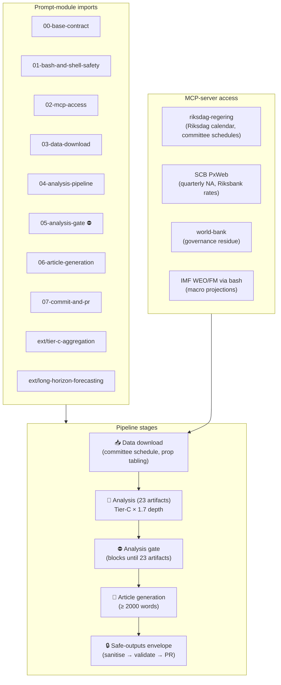
```mermaid
flowchart TD
    subgraph Imports["Prompt-module imports"]
        P00["00-base-contract"]
        P01["01-bash-and-shell-safety"]
        P02["02-mcp-access"]
        P03["03-data-download"]
        P04["04-analysis-pipeline"]
        P05["05-analysis-gate ⛔"]
        P06["06-article-generation"]
        P07["07-commit-and-pr"]
        EXT1["ext/tier-c-aggregation"]
        EXT2["ext/long-horizon-forecasting"]
    end

    subgraph MCP["MCP-server access"]
        RR["riksdag-regering<br/>(Riksdag calendar, committee schedules)"]
        SCB["SCB PxWeb<br/>(quarterly NA, Riksbank rates)"]
        WB["world-bank<br/>(governance residue)"]
        IMF["IMF WEO/FM via bash<br/>(macro projections)"]
    end

    subgraph Pipeline["Pipeline stages"]
        A1["📥 Data download<br/>(committee schedule, prop tabling)"]
        A2["🔬 Analysis (23 artifacts)<br/>Tier-C × 1.7 depth"]
        A3["⛔ Analysis gate<br/>(blocks until 23 artifacts)"]
        A4["📝 Article generation<br/>(≥ 2000 words)"]
        A5["🔒 Safe-outputs envelope<br/>(sanitise → validate → PR)"]
    end

    Imports --> Pipeline
    MCP --> A1
    A1 --> A2 --> A3 --> A4 --> A5
```

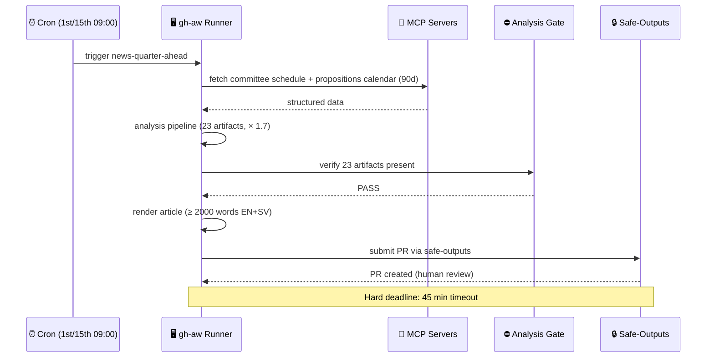
```mermaid
sequenceDiagram
    participant Cron as ⏰ Cron (1st/15th 09:00)
    participant Runner as 🖥️ gh-aw Runner
    participant MCP as 📡 MCP Servers
    participant Gate as ⛔ Analysis Gate
    participant SO as 🔒 Safe-Outputs

    Cron->>Runner: trigger news-quarter-ahead
    Runner->>MCP: fetch committee schedule + propositions calendar (90d)
    MCP-->>Runner: structured data
    Runner->>Runner: analysis pipeline (23 artifacts, × 1.7)
    Runner->>Gate: verify 23 artifacts present
    Gate-->>Runner: PASS
    Runner->>Runner: render article (≥ 2000 words EN+SV)
    Runner->>SO: submit PR via safe-outputs
    SO-->>Runner: PR created (human review)
    Note over Runner,SO: Hard deadline: 45 min timeout
```

#### 📆 6.2.2 News Year Ahead (`news-year-ahead`)

**Schedule:** `0 9 5 1,7 *` (5th of January + 5th of July, 09:00 UTC)
**Horizon:** 365 days | **Depth multiplier:** × 2.0 | **Word floor:** 2 500 | **Timeout:** 45 min

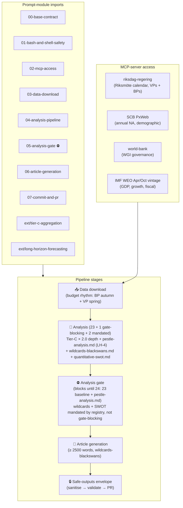
```mermaid
flowchart TD
    subgraph Imports["Prompt-module imports"]
        P00["00-base-contract"]
        P01["01-bash-and-shell-safety"]
        P02["02-mcp-access"]
        P03["03-data-download"]
        P04["04-analysis-pipeline"]
        P05["05-analysis-gate ⛔"]
        P06["06-article-generation"]
        P07["07-commit-and-pr"]
        EXT1["ext/tier-c-aggregation"]
        EXT2["ext/long-horizon-forecasting"]
    end

    subgraph MCP["MCP-server access"]
        RR["riksdag-regering<br/>(Riksmöte calendar, VPs + BPs)"]
        SCB["SCB PxWeb<br/>(annual NA, demographic)"]
        WB["world-bank<br/>(WGI governance)"]
        IMF["IMF WEO Apr/Oct vintage<br/>(GDP, growth, fiscal)"]
    end

    subgraph Pipeline["Pipeline stages"]
        A1["📥 Data download<br/>(budget rhythm: BP autumn + VP spring)"]
        A2["🔬 Analysis (23 + 1 gate-blocking + 2 mandated)<br/>Tier-C × 2.0 depth + pestle-analysis.md (LH-4)<br/>+ wildcards-blackswans.md + quantitative-swot.md"]
        A3["⛔ Analysis gate<br/>(blocks until 24: 23 baseline + pestle-analysis.md)<br/>wildcards + SWOT mandated by registry, not gate-blocking"]
        A4["📝 Article generation<br/>(≥ 2500 words, wildcards-blackswans)"]
        A5["🔒 Safe-outputs envelope<br/>(sanitise → validate → PR)"]
    end

    Imports --> Pipeline
    MCP --> A1
    A1 --> A2 --> A3 --> A4 --> A5
```

```mermaid
sequenceDiagram
    participant Cron as ⏰ Cron (5 Jan/Jul 09:00)
    participant Runner as 🖥️ gh-aw Runner
    participant MCP as 📡 MCP Servers
    participant IMF as 💹 IMF WEO/FM
    participant Gate as ⛔ Analysis Gate
    participant SO as 🔒 Safe-Outputs

    Cron->>Runner: trigger news-year-ahead
    Runner->>MCP: fetch Riksmöte + budget calendar (365d)
    Runner->>IMF: fetch WEO Apr/Oct vintage projections
    MCP-->>Runner: parliamentary data
    IMF-->>Runner: macro projections (GDP, inflation, fiscal)
    Runner->>Runner: analysis pipeline (24 gate-blocking + 2 mandated: pestle + wildcards + SWOT, × 2.0)
    Runner->>Runner: LH-4: pestle-analysis.md blocking; wildcards + SWOT mandated by registry
    Runner->>Gate: verify 24 gate-blocking artifacts (23 baseline + pestle-analysis.md via LH-4)
    Gate-->>Runner: PASS
    Runner->>Runner: render article (≥ 2500 words EN+SV)
    Runner->>SO: submit PR via safe-outputs
    SO-->>Runner: PR created (human review)
    Note over Runner,SO: Hard deadline: 45 min timeout
```

#### 🗳️ 6.2.3 News Election Cycle (`news-election-cycle`)

**Schedule:** `workflow_dispatch` only (cron `0 9 13 3,9 *` declared but disabled until runtime measured)
**Horizon:** 1 460 days (4-year mandate) | **Depth multiplier:** × 2.5 | **Word floor:** 3 500 | **Timeout:** 45 min
**Extra imports:** `ext/cycle-rollover.md` (active ±30 days of election anchor 2026-09-13)

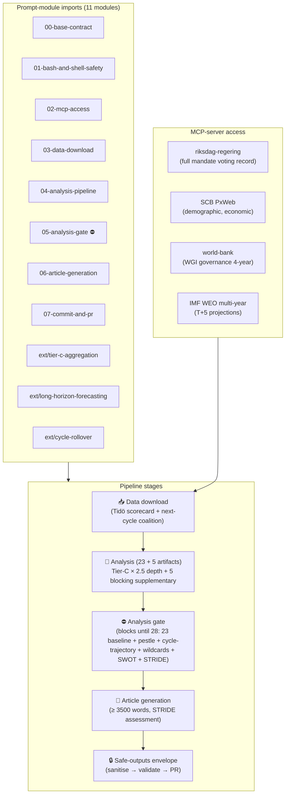
```mermaid
flowchart TD
    subgraph Imports["Prompt-module imports (11 modules)"]
        P00["00-base-contract"]
        P01["01-bash-and-shell-safety"]
        P02["02-mcp-access"]
        P03["03-data-download"]
        P04["04-analysis-pipeline"]
        P05["05-analysis-gate ⛔"]
        P06["06-article-generation"]
        P07["07-commit-and-pr"]
        EXT1["ext/tier-c-aggregation"]
        EXT2["ext/long-horizon-forecasting"]
        EXT3["ext/cycle-rollover"]
    end

    subgraph MCP["MCP-server access"]
        RR["riksdag-regering<br/>(full mandate voting record)"]
        SCB["SCB PxWeb<br/>(demographic, economic)"]
        WB["world-bank<br/>(WGI governance 4-year)"]
        IMF["IMF WEO multi-year<br/>(T+5 projections)"]
    end

    subgraph Pipeline["Pipeline stages"]
        A1["📥 Data download<br/>(Tidö scorecard + next-cycle coalition)"]
        A2["🔬 Analysis (23 + 5 artifacts)<br/>Tier-C × 2.5 depth + 5 blocking supplementary"]
        A3["⛔ Analysis gate<br/>(blocks until 28: 23 baseline + pestle + cycle-trajectory + wildcards + SWOT + STRIDE)"]
        A4["📝 Article generation<br/>(≥ 3500 words, STRIDE assessment)"]
        A5["🔒 Safe-outputs envelope<br/>(sanitise → validate → PR)"]
    end

    Imports --> Pipeline
    MCP --> A1
    A1 --> A2 --> A3 --> A4 --> A5
```

```mermaid
sequenceDiagram
    participant Op as 👤 Operator (dispatch)
    participant Runner as 🖥️ gh-aw Runner
    participant MCP as 📡 MCP Servers
    participant IMF as 💹 IMF WEO T+5
    participant Gate as ⛔ Analysis Gate
    participant SO as 🔒 Safe-Outputs

    Op->>Runner: workflow_dispatch (cycle_anchor=both)
    Runner->>MCP: fetch full mandate voting record + coalition data
    Runner->>IMF: fetch multi-year WEO projections
    MCP-->>Runner: 4-year parliamentary data
    IMF-->>Runner: T+5 macro projections
    Runner->>Runner: analysis pipeline (28 artifacts: 23 + 5 blocking supplementary, × 2.5)
    Runner->>Runner: LH-4: pestle-analysis.md; LH-5: cycle-trajectory + wildcards + SWOT + STRIDE
    Runner->>Gate: verify 28 artifacts (23 baseline + pestle + cycle-trajectory + wildcards-blackswans + quantitative-swot + political-stride-assessment)
    Gate-->>Runner: PASS
    Runner->>Runner: render article (≥ 3500 words EN+SV)
    Runner->>SO: submit PR via safe-outputs
    SO-->>Runner: PR created (human review)
    Note over Runner,SO: Hard deadline: 45 min timeout
```

#### 📊 Long-Horizon ISMS Control Mapping

The three long-horizon workflows touch additional ISMS controls beyond the standard agentic security model:

| **Control** | **Standard** | **How Applied** |
|---|---|---|
| A.5.1 (Policies for information security) | ISO 27001:2022 | Long-horizon forecasts classified PUBLIC; no PII processed; GDPR DPIA short-circuit |
| A.5.30 (ICT readiness for business continuity) | ISO 27001:2022 | Graceful fallback if MCP/IMF unavailable — uses cached vintage with annotation |
| A.8.8 (Management of technical vulnerabilities) | ISO 27001:2022 | IMF/SCB egress pins in Squid allowlist; `.meta.json` provenance sidecars for fetched data |
| A.8.28 (Secure coding) | ISO 27001:2022 | Prompt injection detection in safe-outputs layer; no user input reaches shell |
| A.8.30 (Outsourced development) | ISO 27001:2022 | gh-aw compiler generates hardened `.lock.yml`; human review mandatory |
| GV.SC (Supply chain risk management) | NIST CSF 2.0 | MCP server versions pinned; egress firewall restricts external calls |
| PR.DS (Data security) | NIST CSF 2.0 | Analysis artifacts written to branch-protected path; no secrets in output |
| DE.CM (Continuous monitoring) | NIST CSF 2.0 | Workflow timeout enforcement (45 min); GitHub Actions run-duration visible in dashboard |
| RS.AN (Incident analysis) | NIST CSF 2.0 | Failed analysis-gate logs structured error messages; workflow conclusion captured in Actions history |
| #4 (Secure configuration) | CIS Controls v8.1 | Harden-runner enforced; read-only permissions; concurrency guards |
| #16 (Application software security) | CIS Controls v8.1 | Five-layer safe-outputs validator; AI output sanitisation |

#### 📈 Long-Horizon KPIs

| **KPI** | **Definition** | **Target** | **Measurement** |
|---|---|---|---|
| Legislative calendar coverage (quarter) | % of committee schedule + chamber sittings + proposition tabling deadlines forecast for the 90-day window | ≥ 85% | Cross-reference generated quarter-ahead against `data.riksdagen.se` calendar API |
| Legislative calendar coverage (year) | % of Riksmöte + budget rhythm events forecast for 365-day window | ≥ 70% | Compare year-ahead output against known BP/VP/session dates |
| Legislative calendar coverage (cycle) | % of mandate-level milestones (elections, coalition formations, government reshuffles) forecast | ≥ 60% | Retrospective scoring after events occur |
| PIR roll-forward continuity | % of Priority Intelligence Requirements from prior horizon article with explicit obsolescence date or roll-forward in next article | ≥ 90% | Automated diff of PIR sections between consecutive articles |
| Vintage discipline rate | % of IMF WEO/FM citations that include projection-year stamp (e.g. "WEO Apr-2026 est.") | 100% | Regex validation in safe-outputs layer |
| Analysis gate pass rate | % of workflow runs that pass the analysis gate on first attempt | ≥ 80% | GitHub Actions run outcome data |
| Safe-outputs rejection rate | % of PRs rejected by safe-outputs validator | < 5% | PR merge/close statistics |

---

### 📡 Stage 7: Monitoring & Infrastructure

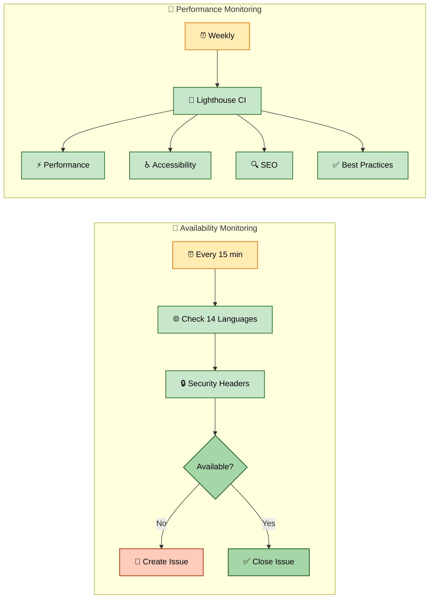
```mermaid
flowchart LR
    subgraph "📡 Availability Monitoring"
        Cron[⏰ Every 15 min] --> Check14[🌐 Check 14 Languages]
        Check14 --> Headers[🔒 Security Headers]
        Headers --> Result{Available?}
        Result -->|No| CreateIssue[🚨 Create Issue]
        Result -->|Yes| CloseIssue[✅ Close Issue]
    end

    subgraph "🔆 Performance Monitoring"
        Weekly[⏰ Weekly] --> LH[🔆 Lighthouse CI]
        LH --> Perf[⚡ Performance]
        LH --> A11y[♿ Accessibility]
        LH --> SEO[🔍 SEO]
        LH --> BP[✅ Best Practices]
    end

    classDef schedule fill:#ffecb3,stroke:#f57f17,stroke-width:1.5px,color:black
    classDef check fill:#c8e6c9,stroke:#2e7d32,stroke-width:1.5px,color:black
    classDef alert fill:#ffccbc,stroke:#bf360c,stroke-width:1.5px,color:black
    classDef success fill:#a5d6a7,stroke:#1b5e20,stroke-width:1.5px,color:black

    class Cron,Weekly schedule
    class Check14,Headers,LH,Perf,A11y,SEO,BP check
    class CreateIssue alert
    class CloseIssue,Result success
```

**Uptime Monitor** (`uptime-monitor.yml`):
- Every 15 minutes — checks all 14 language homepages
- Validates security headers (HSTS, CSP, X-Frame-Options)
- Auto-creates/closes GitHub issues on outage/recovery

**Lighthouse CI** (`lighthouse-ci.yml`):
- Weekly + push/PR to main
- Targets: LCP < 2.5s, CLS < 0.1, Accessibility ≥ 90

---

## 🔧 Complete Workflow Inventory (54 Files — 26 standard `.yml` + 14 agentic `.md` + 14 compiled `.lock.yml`)

> **Verification:** `ls .github/workflows/` yields 54 workflow files (55 entries including the directory README.md). This matches 26 standard workflow files + 14 agentic Markdown sources + 14 corresponding compiled lock files. Badges and PR checks are driven by the 26 standard `.yml` plus the 14 compiled `.lock.yml` (GitHub Actions only executes the compiled artifacts).

### 🔐 Security & Compliance (6 workflows)

| # | Workflow | File | Trigger | ISMS Controls |
| --- | --- | --- | --- | --- |
| 1.1 | 🔍 CodeQL Analysis | `codeql.yml` | Push, PR, Weekly | A.8.8, PR.DS-6, CIS 16.6 |
| 1.2 | 📦 Dependency Review | `dependency-review.yml` | Pull requests | A.8.8, PR.DS-6, CIS 16.6 |
| 1.3 | ⭐ OpenSSF Scorecard | `scorecards.yml` | Push to main, Weekly | A.5.36, DE.CM-6, CIS 16.2 |
| 1.4 | 🏷️ Setup Labels | `setup-labels.yml` | Manual dispatch | A.5.37, PR.IP-1 |
| 1.5 | 🏷️ PR Labeler | `labeler.yml` | Pull requests | A.5.37, PR.IP-1 |
| 1.6 | 🕷️ ZAP DAST Scan | `zap-scan.yml` | Weekly schedule, manual dispatch | A.8.29, DE.CM-8, CIS 18 |

### 🧪 Testing & Validation (10 workflows)

| # | Workflow | File | Trigger | Coverage |
| --- | --- | --- | --- | --- |
| 2.1 | 🧪 TypeScript & JS Testing | `javascript-testing.yml` | Push/PR (TS/JS/HTML) | TSC + Vitest + Cypress |
| 2.2 | 📖 TypeDoc Validation | `jsdoc-validation.yml` | Manual dispatch | TypeDoc generation + coverage |
| 2.3 | ✅ Quality Checks | `quality-checks.yml` | Push/PR to main | ESLint + HTMLHint + linkinator |
| 2.4 | 🧹 Knip Dead Code Check | `knip.yml` | Push/PR to main | Unused files, deps, binaries, duplicate exports (blocking); unused exports/types (informational) |
| 2.5 | 🌐 Translation Validation | `translation-validation.yml` | Push/PR (HTML) | 14-language + RTL + hreflang |
| 2.6 | 🖥️ Test Dashboard | `test-dashboard.yml` | Push/PR (src/browser) | Dashboard Cypress E2E |
| 2.7 | 🏠 Test Homepage | `test-homepage.yml` | Push/PR (src/browser) | Homepage Cypress E2E |
| 2.8 | 📰 Test News | `test-news.yml` | Push/PR (news) | News pages Cypress E2E |
| 2.9 | 🌍 Executive Brief Translation Checks | `exec-brief-translation-checks.yml` | Pull requests | Structural-parity + file-ownership merge gate for the executive-brief translation pipeline |
| 2.10 | 🔤 Test Article Headers | `test-article-headers.yml` | Manual dispatch | Audits rendered `<head>` metadata (title/description/keywords + OpenGraph/Twitter) via the shared `computeArticleHeadMetadata` composer |

### 📊 CIA Data Pipeline (1 workflow)

| # | Workflow | File | Trigger | Purpose |
| --- | --- | --- | --- | --- |
| 3.1 | 📊 Update CIA CSV Data | `update-cia-csv-data.yml` | Nightly 03:30 UTC, manual dispatch | Refresh every already-tracked `data/cia/**` and `cia-data/**` CSV from upstream `Hack23/cia` sample-data (recursive basename→path index handles sub-folders), refresh `production-stats.json`, inject counts into all 14 `index*.html`; auto-PR on changes |

### 🚀 Release & Deployment (3 workflows)

| # | Workflow | File | Trigger | Targets |
| --- | --- | --- | --- | --- |
| 4.1 | 🚀 Release with Attestations | `release.yml` | Push tags (v*), manual | SLSA + dual deploy |
| 4.2 | ☁️ Deploy to S3 | `deploy-s3.yml` | Push to main | AWS S3/CloudFront |
| 4.3 | 🔆 Lighthouse CI | `lighthouse-ci.yml` | Push/PR, weekly | Performance audit |

### 🤖 Agentic Workflows (14 workflows × 2 files each = 28 files)

> Each agentic workflow is authored as a Markdown source (`.md`) and **compiled** to a hardened GitHub Actions workflow (`.lock.yml`) via `compile-agentic-workflows.yml`. Only the `.lock.yml` executes on the runner; the `.md` is the source of truth, reviewed in PRs. Both files are SHA-pinned, run behind the Squid/iptables egress firewall, and route all write-side effects through the five-layer **safe-outputs** validator (sanitisation → schema-validate → policy-check → human-review → merge).
>
> **Pipeline model**: each per-type news workflow runs **analysis → aggregate → translate (13 non-English languages) → render (`--lang all`, 14 HTML files) → PR** in a single agentic run. The legacy two-step `news-article-generator` (scaffold + later fill) workflow has been removed; articles are now derived directly from `analysis/daily/$DATE/$SUB/` artifacts via [`scripts/aggregate-analysis.ts`](scripts/aggregate-analysis.ts) → per-language Markdown translation → [`scripts/render-articles.ts --lang all`](scripts/render-articles.ts). The dedicated `news-translate` workflow is now a quality / catch-up workflow only — it re-validates upstream translations and back-fills any language that an upstream run could not finish under its 60-min budget.

| # | Workflow | Source | Lock | Purpose |
| --- | --- | --- | --- | --- |
| 5.1 | 🌅 News Evening Analysis | `news-evening-analysis.md` | `news-evening-analysis.lock.yml` | Tier-C aggregation: end-of-day political analysis |
| 5.2 | 📡 News Realtime Monitor | `news-realtime-monitor.md` | `news-realtime-monitor.lock.yml` | Tier-C aggregation: real-time political monitoring |
| 5.3 | 📋 News Motions | `news-motions.md` | `news-motions.lock.yml` | Single-type: motion tracking and reporting |
| 5.4 | 📊 News Committee Reports | `news-committee-reports.md` | `news-committee-reports.lock.yml` | Single-type: committee report coverage |
| 5.5 | 📰 News Weekly Review | `news-weekly-review.md` | `news-weekly-review.lock.yml` | Tier-C aggregation: weekly political summary |
| 5.6 | 📆 News Monthly Review | `news-monthly-review.md` | `news-monthly-review.lock.yml` | Tier-C aggregation: monthly political review |
| 5.7 | 🔮 News Week Ahead | `news-week-ahead.md` | `news-week-ahead.lock.yml` | Tier-C aggregation: upcoming week preview |
| 5.8 | 📅 News Month Ahead | `news-month-ahead.md` | `news-month-ahead.lock.yml` | Tier-C aggregation: upcoming month preview |
| 5.9 | 🏛️ News Propositions | `news-propositions.md` | `news-propositions.lock.yml` | Single-type: government proposition coverage |
| 5.10 | ❓ News Interpellations | `news-interpellations.md` | `news-interpellations.lock.yml` | Single-type: interpellation debate tracking |
| 5.11 | 🌍 News Translate (catch-up) | `news-translate.md` | `news-translate.lock.yml` | Quality / catch-up only: re-validates upstream translations, refines drift, back-fills languages an upstream run could not finish |
| 5.12 | 📐 News Quarter Ahead | `news-quarter-ahead.md` | `news-quarter-ahead.lock.yml` | Tier-C aggregation × 1.7: 90-day parliamentary-season + Riksbank/SCB calendar |
| 5.13 | 📆 News Year Ahead | `news-year-ahead.md` | `news-year-ahead.lock.yml` | Tier-C aggregation × 2.0: 365-day annual outlook anchored in IMF WEO Apr/Oct vintage |
| 5.14 | 🗳️ News Election Cycle | `news-election-cycle.md` | `news-election-cycle.lock.yml` | Tier-C aggregation × 2.5: full 4-year mandate; dispatch-only until runtime measured |

### 🛠️ Automation & Tooling (4 workflows)

| # | Workflow | File | Trigger | Purpose |
| --- | --- | --- | --- | --- |
| 6.1 | 🔧 Compile Agentic Workflows | `compile-agentic-workflows.yml` | Push/PR touching `news-*.md`, manual | Compile `.md` sources → `.lock.yml` via `gh-aw` compiler; enforces firewall + safe-outputs + SHA-pinning policy |
| 6.2 | 🧹 Agentics Maintenance | `agentics-maintenance.yml` | Scheduled + manual | Scheduled hygiene of agentic environment: stale branch cleanup, secret rotation hooks, runtime-cache eviction, agent-config validation |
| 6.3 | ♻️ Regenerate Articles | `regenerate-articles.yml` | Manual dispatch | Deterministic (no-AI) rebuild of every `article.md` (via aggregate-analysis) and every `news/*.html` page (via render-articles, all 14 languages) from the current `analysis/daily/` tree; commits directly to `main` |
| 6.4 | 🤝 News Host-side PAT PR Fallback | `news-pat-pr-fallback.yml` | `workflow_run` after each `news-*` workflow | Single host-side recovery path for all 14 news workflows: replays the sandbox commit-handoff bundle under a host PAT to open/refresh the PR when the in-sandbox safe-outputs push could not deliver |

### 📡 Monitoring & Infrastructure (2 workflows)

| # | Workflow | File | Trigger | Purpose |
| --- | --- | --- | --- | --- |
| 7.1 | 📡 Uptime Monitor | `uptime-monitor.yml` | Every 15 minutes | Site availability checks |
| 7.2 | 🤖 Copilot Setup Steps | `copilot-setup-steps.yml` | Push, manual | Agent environment setup |

---

### 🧩 Extracted Script Modules (`scripts/agentic/`)

The inline bash validation logic embedded in `.github/prompts/05-analysis-gate.md` has been extracted into strictly-typed TypeScript modules under `scripts/agentic/`. This bounded context provides:

| Module | Responsibility |
|--------|---------------|
| `scripts/agentic/artifact-inventory.ts` | Typed definitions for all 23 required artifacts (Families A–D), stub placeholders, evidence patterns, agency lists, dok_id patterns |
| `scripts/agentic/analysis-gate.ts` | Gate validation checks 1–9b: artifact existence, per-document coverage, stub detection, Mermaid validation, Family C/D structure, PIR sidecar, Statskontoret evidence |
| `scripts/agentic/index.ts` | Barrel export — single public surface for downstream consumers |

**Key types exported:**
- `ArtifactFamily` — `'A' | 'B' | 'C' | 'D' | 'E'`
- `ArtifactDefinition` — filename, family, description, gate metadata
- `GateCheckResult` — per-check pass/fail with message and artifact reference
- `GateValidationResult` — aggregate result with failure count

**Design principles:**
- Zero `any` types — explicit interfaces for all data structures
- Gate module factored for readability (single-responsibility check functions)
- Co-located tests: `tests/agentic/gate-checks/*.test.ts` (one suite per production check module), `tests/agentic/gate-shared/*.test.ts` (markdown helpers, file walkers), and `tests/agentic/analysis-gate-integration.test.ts` (end-to-end orchestrator scenarios)
- ESLint clean with zero warnings
- No circular dependencies (barrel imports only)

---

## Political Intelligence Validation Pipeline

The political intelligence generation and validation is a CI/CD concern enforced both in the prebuild chain and within agentic workflows:

### Prebuild Chain (13 Steps)

```
generate-article-types-doc → copy-vendor-mermaid → aggregate-analysis → render-articles →
generate-news-indexes → extract-news-metadata → generate-sitemap-html →
generate-political-intelligence → generate-rss → generate-sitemap →
normalize-static-html-chrome → backfill-translated-chrome → strip-legacy-chrome-script-tags
```

### Analysis Gate Enforcement

Every agentic news workflow MUST produce 23 analysis artifacts (Families A-D) and pass the analysis gate (`scripts/agentic/analysis-gate.ts`) before article rendering:

| Check | Validation | Script |
|-------|-----------|--------|
| 1 | Artifact existence (23 files) | `analysis-gate.ts` |
| 2 | No stub placeholders (`AI_MUST_REPLACE`, `[REQUIRED]`, `TODO:`) | `analysis-gate.ts` |
| 3 | Minimum word count per artifact | `analysis-gate.ts` |
| 4 | Evidence citations (SWOT + significance) | `analysis-gate.ts` |
| 5 | Mermaid diagrams with colour configuration | `analysis-gate.ts` |
| 6 | Pass-2 evidence (revision proof via mtime/snapshot diff) | `analysis-gate.ts` |
| 7 | Cross-references between artifacts | `analysis-gate.ts` |
| 8 | Data-source connectivity audit | `analysis-gate.ts` |
| 9a | Political classification completeness | `analysis-gate.ts` |
| 9b | Agency evidence (Statskontoret recognised agencies) | `analysis-gate.ts` |

### Additional Validation Scripts

| Script | Purpose | Trigger |
|--------|---------|---------|
| `validate-methodology-reflection.ts` | Validates methodology-reflection.md structure and required sections | Agentic workflow |
| `validate-quality-scores.cjs` | Validates quality score thresholds | CI quality checks |
| `validate-article.ts` | Validates article HTML structure and metadata | Prebuild + CI |
| `validate-news-translations.ts` | Detects remaining data-translate markers | Translation validation workflow |
| `validate-translations.ts` | Validates all translation files | CI |

### Parliamentary Data Scripts

| Script | Purpose | Schedule |
|--------|---------|----------|
| `download-parliamentary-data.ts` | Download propositions, motions, betänkanden from Riksdag API | Nightly / on-demand |
| `fetch-voting-records.ts` | Fetch voting records from Riksdag | Nightly |
| `fetch-calendar.ts` | Fetch parliamentary calendar events | Nightly |
| `fetch-statskontoret.ts` | Fetch Statskontoret agency data (headcount, budget) | Weekly |
| `fetch-rir-followups.ts` | Fetch Riksrevisionen follow-up reports | Weekly |
| `scb-fetch.ts` | Fetch SCB statistical data | On-demand |
| `imf-fetch.ts` | Fetch IMF economic data (WEO, FM, IFS, DOTS) | On-demand |

---

## 🔒 Workflow Security Architecture

### Supply Chain Security

All workflows implement defense-in-depth:

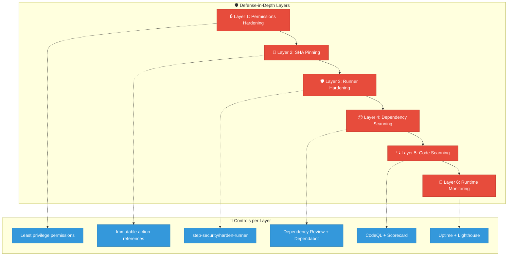
```mermaid
flowchart TB
    subgraph "🛡️ Defense-in-Depth Layers"
        L1[🔒 Layer 1: Permissions Hardening] --> L2[📌 Layer 2: SHA Pinning]
        L2 --> L3[🛡️ Layer 3: Runner Hardening]
        L3 --> L4[📦 Layer 4: Dependency Scanning]
        L4 --> L5[🔍 Layer 5: Code Scanning]
        L5 --> L6[📡 Layer 6: Runtime Monitoring]
    end

    subgraph "🔐 Controls per Layer"
        L1 -.-> C1[Least privilege permissions]
        L2 -.-> C2[Immutable action references]
        L3 -.-> C3[step-security/harden-runner]
        L4 -.-> C4[Dependency Review + Dependabot]
        L5 -.-> C5[CodeQL + Scorecard]
        L6 -.-> C6[Uptime + Lighthouse]
    end

    classDef layer fill:#e74c3c,stroke:#c0392b,stroke-width:1.5px,color:white
    classDef control fill:#3498db,stroke:#2980b9,stroke-width:1.5px,color:white

    class L1,L2,L3,L4,L5,L6 layer
    class C1,C2,C3,C4,C5,C6 control
```

| Control | Implementation | ISMS Reference |
| --- | --- | --- |
| 🔒 Action SHA Pinning | Every `uses:` pinned to commit SHA | CIS 16.6 |
| 🛡️ Harden Runner | `step-security/harden-runner` with egress audit | NIST DE.CM-1 |
| 🔐 Least Privilege | Minimal `permissions:` per-workflow | ISO A.8.3 |
| 📦 Dependency Review | `actions/dependency-review-action` on PRs | CIS 16.4 |
| 🔍 CodeQL Scanning | `javascript-typescript` language matrix | ISO A.8.8 |
| ⭐ Scorecard | OpenSSF Scorecard supply-chain analysis | NIST PR.DS-6 |
| 🔑 Secret Scanning | Native GitHub secret scanning enabled | ISO A.8.24 |

### Secrets Management

| Secret / Credential | Used By | Purpose |
| --- | --- | --- |
| `GITHUB_TOKEN` | Most workflows | Standard GitHub API access |
| `COPILOT_MCP_GITHUB_PERSONAL_ACCESS_TOKEN` | Copilot setup, agentic workflows | MCP server authentication |
| AWS OIDC Role (`GithubWorkFlowRole`) | deploy-s3, release | Ephemeral credentials via `id-token: write` + `role-to-assume` |
| CloudFront Distribution ID | deploy-s3, release | Discovered dynamically from CloudFormation stack or origin lookup |

---

## 🏗️ gh-aw (GitHub Agentic Workflows) Security Architecture

> **Reference:** [gh-aw Architecture](https://github.github.com/gh-aw/introduction/architecture/) · [SECURITY_ARCHITECTURE.md § Five-Layer Safe-Output Model](SECURITY_ARCHITECTURE.md#-five-layer-safe-output-security-model-detailed)

All 14 agentic workflows in this repository execute within the **gh-aw** runtime — GitHub's purpose-built security substrate for AI-powered automation. gh-aw enforces a **three-layer defense-in-depth** model that contains agent actions within strict trust boundaries.

### 🏛️ Three-Layer Trust Model

```mermaid
flowchart TB
    subgraph L1["🔒 Layer 1: Substrate-Level Trust<br/>(Infrastructure — enforced by gh-aw runtime)"]
        direction LR
        AWF["🧱 Agent Workflow Firewall<br/>(iptables + Squid proxy)"]
        MCP_GW["🐳 MCP Gateway<br/>(Docker container isolation)"]
        API_P["🔌 API Proxy<br/>(token-scoped access)"]
        VM["🖥️ Runner VM<br/>(ephemeral, kernel-hardened)"]
    end

    subgraph L2["⚙️ Layer 2: Configuration-Level Trust<br/>(Compile-time — enforced by gh aw compile)"]
        direction LR
        SCHEMA["📋 Schema Validation<br/>(workflow structure)"]
        SHA["📌 Action SHA Pinning<br/>(immutable references)"]
        SCAN["🔍 Security Scanners<br/>(actionlint, zizmor, poutine)"]
        STRICT["🔐 Strict Mode<br/>(expression allowlisting)"]
    end

    subgraph L3["🛡️ Layer 3: Plan-Level Trust<br/>(Runtime — enforced per execution)"]
        direction LR
        SO["📤 SafeOutputs<br/>(buffered writes)"]
        TD["🕵️ Threat Detection<br/>(AI-powered analysis)"]
        CS["🧹 Content Sanitisation<br/>(@mention, URI, tag filters)"]
        SR["🔑 Secret Redaction<br/>(pre-upload scan)"]
    end

    L1 --> L2 --> L3

    style L1 fill:#1a237e,color:#fff,stroke:#0d47a1,stroke-width:2px
    style L2 fill:#004d40,color:#fff,stroke:#00695c,stroke-width:2px
    style L3 fill:#b71c1c,color:#fff,stroke:#c62828,stroke-width:2px
```

### 🧱 Layer 1: Substrate-Level Trust (Infrastructure)

The gh-aw runtime provides hardware-enforced isolation for every agentic workflow run:

| Component | Icon | Function | Riksdagsmonitor Usage |
|-----------|------|----------|----------------------|
| **Runner VM** | 🖥️ | Ephemeral GitHub Actions VM with kernel-level isolation; destroyed after each run | All 14 agentic workflows execute in fresh VMs |
| **Agent Workflow Firewall (AWF)** | 🧱 | `iptables` redirects all HTTP/HTTPS through a Squid proxy with domain allowlist; non-allowlisted traffic is DROPped | 17 allowlisted domains (see [Network egress allow-list](#network-egress-allow-list-applies-to-every-agentic-workflow)) |
| **MCP Gateway** | 🐳 | Each MCP server runs in an isolated Docker container; tool allowlisting; per-container network controls; secrets injected via env vars only | `scb` and `world-bank` servers in `node:26-alpine` containers |
| **API Proxy** | 🔌 | Token-scoped access to GitHub APIs; prevents privilege escalation via stolen tokens | Agentic workflows get read-only repo + PR write only |

### ⚙️ Layer 2: Configuration-Level Trust (Compile-Time)

The `gh aw compile` command enforces security at compilation time:

| Control | Icon | What It Enforces | Riksdagsmonitor Implementation |
|---------|------|-----------------|-------------------------------|
| **Schema Validation** | 📋 | Workflow YAML structure must conform to gh-aw schema (permissions, triggers, steps) | `compile-agentic-workflows.yml` validates all 14 `.md` sources |
| **Expression Allowlisting** | 🔐 | Only safe expression patterns allowed in workflow definitions | Strict mode enabled; no `${{ }}` in shell commands |
| **Action SHA Pinning** | 📌 | All `uses:` references pinned to immutable commit SHAs (not tags) | 100% SHA-pinned across all 54 workflow files |
| **Security Scanners** | 🔍 | `actionlint`, `zizmor`, `poutine` run during compilation | Integrated into the compile workflow quality gate |
| **Prompt Module Size Cap** | 📏 | No single prompt module may exceed 550 lines | Enforced by compile workflow (prevents prompt injection via oversized modules) |

### 🛡️ Layer 3: Plan-Level Trust (Runtime)

Runtime controls that govern what the AI agent can actually do:

| Control | Icon | Mechanism | Riksdagsmonitor Implementation |
|---------|------|-----------|-------------------------------|
| **SafeOutputs** | 📤 | Agent job has **read-only** permissions; all writes buffered as artifacts; separate detection job analyzes before execution | Five-layer validator: sanitise → schema → policy → human review → merge |
| **Threat Detection Pipeline** | 🕵️ | Separate job downloads agent artifacts; AI security agent analyzes for secret leaks, malicious patches, policy violations; blocking verdict gates output jobs | Analysis gate (checks 1–9b) + methodology-reflection validator |
| **Content Sanitisation** | 🧹 | `@mention` neutralisation, bot trigger protection, XML/HTML tag conversion, URI filtering (HTTPS-only from trusted domains), content size limits (0.5 MB / 65k lines) | `rehype-sanitize` allow-list + Mermaid `securityLevel: 'strict'` |
| **Integrity Filtering** | 🔒 | Controls which GitHub content the agent can access based on author trust and merge status | Repository scoped — merged > approved > unapproved |
| **Secret Redaction** | 🔑 | Automatic scanning of `/tmp/gh-aw` for secrets before artifact upload; partial visibility (first 3 chars + `***`) | Enforced by gh-aw runtime for all 14 workflows |

### 🔄 SafeOutputs Execution Flow

```mermaid
sequenceDiagram
    participant Agent as 🤖 AI Agent (read-only)
    participant Buffer as 📦 Artifact Buffer
    participant Detect as 🕵️ Threat Detection Job
    participant Gate as ⛔ Analysis Gate
    participant Output as 📤 Safe Output Jobs
    participant Human as 👤 Human Reviewer

    Agent->>Buffer: Write analysis artifacts + article
    Note over Agent,Buffer: Agent has NO write permissions<br/>All output buffered as workflow artifacts

    Buffer->>Detect: Download artifacts for analysis
    Detect->>Detect: AI security scan (secret leaks, malicious patches)
    Detect->>Gate: Structural validation (checks 1–9b)

    alt Detection PASS + Gate PASS
        Gate->>Output: Authorize safe output execution
        Output->>Output: create_pull_request (sanitised content)
        Output->>Human: PR ready for review
        Human->>Human: Approve or reject
    else Detection FAIL or Gate FAIL
        Gate--xOutput: ❌ Blocked — no PR created
        Note over Gate,Output: Fail-closed: entire workflow fails
    end
```

### 🌐 gh-aw Security Components Applied to Riksdagsmonitor

```mermaid
flowchart LR
    subgraph "14 Agentic News Workflows"
        W1["news-propositions"]
        W2["news-motions"]
        W3["news-committee-reports"]
        W4["… + 11 more"]
    end

    subgraph "gh-aw Security Substrate"
        FW["🧱 AWF<br/>Squid + iptables<br/>17 domains allowed"]
        MCP["🐳 MCP Gateway<br/>3 containerised servers"]
        SO["📤 SafeOutputs<br/>5-layer validator"]
        TD["🕵️ Threat Detection<br/>AI + structural gates"]
        SR["🔑 Secret Redaction<br/>Pre-upload scan"]
    end

    subgraph "Riksdagsmonitor Controls"
        AG["⛔ Analysis Gate<br/>Checks 1–9b"]
        MR["📊 Methodology<br/>Reflection Validator"]
        PR["👤 Human PR Review<br/>CODEOWNERS"]
    end

    W1 & W2 & W3 & W4 --> FW
    FW --> MCP
    MCP --> SO
    SO --> TD
    TD --> AG
    AG --> MR
    MR --> PR

    style FW fill:#1a237e,color:#fff
    style MCP fill:#004d40,color:#fff
    style SO fill:#b71c1c,color:#fff
    style TD fill:#e65100,color:#fff
    style SR fill:#4a148c,color:#fff
    style AG fill:#880e4f,color:#fff
```

### 📊 gh-aw Security Layer Summary

| Layer | Trust Boundary | Enforced By | Bypass Resistance | ISMS Mapping |
|-------|---------------|-------------|-------------------|--------------|
| **🔒 L1: Substrate** | Infrastructure | gh-aw runtime (VM + kernel + AWF + MCP Gateway) | Hardware isolation; iptables DROP rules; container sandboxing | ISO A.8.22 (Network segregation), NIST PR.AC-5, CIS #13 |
| **⚙️ L2: Configuration** | Compilation | `gh aw compile` + security scanners | Schema validation; SHA immutability; scanner verdicts | ISO A.8.28 (Secure coding), NIST PR.DS-6, CIS #16.6 |
| **🛡️ L3: Plan** | Runtime | SafeOutputs + threat detection + sanitisation | Permission separation; AI-powered analysis; fail-closed gates | ISO A.8.25 (SDLC), NIST DE.CM-4, CIS #16.10 |

---

## 📊 ISMS Compliance Mapping

### ISO 27001:2022 Controls

| Control | Workflow(s) | Implementation |
| --- | --- | --- |
| A.5.33 — Protection of records | update-cia-csv-data | Git audit trail, source attribution, automated PR review |
| A.5.36 — Conformity with policies | scorecards | OpenSSF automated compliance |
| A.5.37 — Documented procedures | All | Workflow YAML as executable documentation |
| A.8.3 — Information lifecycle | update-cia-csv-data | Nightly upstream refresh, change-detection, PR-gated commits |
| A.8.8 — Vulnerability management | codeql, dependency-review | Automated scanning |
| A.8.10 — Information deletion | update-cia-csv-data | Branch auto-delete after PR merge |
| A.8.19 — Security in use | All | HTTPS-only, SRI, CSP |
| A.8.24 — Secret scanning | GitHub native | Automated secret detection |
| A.8.31 — Separation of environments | release | Staging → production pipeline |
| A.8.32 — Change management | quality-checks, testing | Quality gates before merge |

### NIST CSF 2.0 Functions

| Function | Workflow(s) | Implementation |
| --- | --- | --- |
| **GV** (Govern) | setup-labels, ISMS documentation | Policy enforcement through automation |
| **ID** (Identify) | scorecards, dependency-review | Asset and vulnerability identification |
| **PR** (Protect) | codeql, harden-runner, SHA pinning | Security controls implementation |
| **DE** (Detect) | uptime-monitor, update-cia-csv-data | Continuous monitoring and upstream change detection |
| **RS** (Respond) | Incident auto-creation on outage | Automated incident response |
| **RC** (Recover) | Auto-close incidents on recovery | Automated recovery verification |

### CIS Controls v8.1

| Control | Workflow(s) | Implementation |
| --- | --- | --- |
| 2.2 — Software inventory | release (SBOM) | Automated SBOM generation |
| 3.1 — Data inventory | update-cia-csv-data | Explicit tracked-file discovery + recursive upstream index |
| 3.14 — Data integrity | update-cia-csv-data | Byte-level diff vs upstream + PR review gate |
| 16.2 — Software security | scorecards | Supply chain assessment |
| 16.4 — Dependency security | dependency-review | Vulnerability scanning |
| 16.6 — Application security | codeql | Static analysis |
| 16.10 — Vulnerability remediation | Dependabot + codeql | Automated patching |

---

## 🧰 Cache and External-Registry Resilience Standard

### Cache Strategy (standard workflows)

- **Primary cache mechanism:** `actions/setup-node` built-in npm cache (`cache: 'npm'`), with explicit `cache-dependency-path` including:
  - `package-lock.json`
  - the owning workflow file path (for per-workflow cache key uniqueness)
- **Single direct `actions/cache` usage:** only `dependency-review.yml` (apt archive cache), pinned to:
  - `actions/cache@27d5ce7f107fe9357f9df03efb73ab90386fccae # v5.0.5`
- **Cache invalidation:** key version prefixes (e.g., `-v2-`) are used to force expiration of prior cache generations when strategy changes.
- **Cache TTL note:** GitHub Actions does not support per-workflow explicit cache expiration/TTL configuration; retention is managed by the GitHub cache eviction policy and repository cache storage limits (10 GB per repository).

### Resilience requirements (registry / apt / browser tooling)

- Add retry + exponential backoff for `apt-get update` and `apt-get install` in workflows that install system dependencies.
- Add retry + npm fetch-retry tuning (`fetch-retries=5`, `fetch-retry-mintimeout=20000`, `fetch-retry-maxtimeout=120000`) for global npm installs and `npm ci` in setup-heavy workflows.
- Add step-level `timeout-minutes` on dependency-install steps most exposed to external outage/hanging behavior.
- Prefer browser/binary installs without extra apt dependency fetches where possible (e.g., Playwright browser-only install).

---

## 🛠️ Workflow Troubleshooting Guide

### Common Issues and Solutions

| Issue | Cause | Solution |
| --- | --- | --- |
| 🔴 TypeScript type-check fails | Missing module or incorrect import | Verify `tsconfig.browser.json` includes the file; run `npx tsc --project tsconfig.browser.json --noEmit` locally |
| 🔴 Workflow not triggering on TS changes | Missing path filter | Add `'**/*.ts'` and `'src/browser/**'` to path filters |
| 🔴 Node version cannot run .ts scripts | Older Node.js version | Node 26 has native TS type-stripping; verify `node -e "console.log(process.features.typescript)"` outputs `"strip"` |
| 🔴 Harden Runner egress failures | New network endpoints accessed | Review egress report and add legitimate endpoints to `allowed-endpoints` |
| 🔴 Lighthouse CI failures | Performance regression | Check Lighthouse HTML report artifact; optimize images, reduce CSS, fix color contrast |
| 🔴 Data pipeline skipping fetch | Data freshness < 23 hours | Use `force_refresh: true` input for manual dispatch |
| 🔴 Agentic lock files outdated | `.md` source edited but not compiled | Run `gh aw compile .github/workflows/<name>.md` and commit `.lock.yml` |
| 🔴 Translation validation failing | Missing hreflang or language purity | Run `npm run validate-translations` locally |
| 🔴 Deploy-S3 CloudFront invalidation | OIDC role trust or IAM permissions misconfigured, or CloudFront distribution ID lookup from CloudFormation failed | Verify GitHub OIDC provider + role trust policy, ensure the assumed role has required CloudFront/S3/CloudFormation permissions, and confirm the workflow step that discovers the distribution ID from the CloudFormation stack/origin is succeeding |

---

## 📈 Workflow Metrics

### Key Performance Indicators

| Metric | Target | Actual | Status |
| --- | --- | --- | --- |
| Test Count | > 1000 | **7,500+** | ✅ |
| Test Pass Rate | 100% | **100%** | ✅ |
| TypeScript Errors | 0 | **0** | ✅ |
| ESLint Errors | 0 | **0** | ✅ |
| Build Time | < 5s | **3.4s** | ✅ |
| Test Duration | Tracked in CI | **139s local full suite** | ✅ |
| Action SHA Pinning | 100% | **100%** | ✅ |
| Harden Runner | All workflows | **All** | ✅ |
| Language Coverage | 14 | **14** | ✅ |
| Agentic Workflows | 14 | **14** | ✅ |

---

## 📚 References

### ISMS Documentation
- [Hack23 ISMS-PUBLIC](https://github.com/Hack23/ISMS-PUBLIC)
- [Secure Development Policy](https://github.com/Hack23/ISMS-PUBLIC/blob/main/Secure_Development_Policy.md)
- [Threat Modeling](https://github.com/Hack23/ISMS-PUBLIC/blob/main/Threat_Modeling.md)
- [Vulnerability Management](https://github.com/Hack23/ISMS-PUBLIC/blob/main/Vulnerability_Management.md)
- [Change Management](https://github.com/Hack23/ISMS-PUBLIC/blob/main/Change_Management.md)
- [Network Security Policy](https://github.com/Hack23/ISMS-PUBLIC/blob/main/Network_Security_Policy.md)

### GitHub Documentation
- [GitHub Actions](https://docs.github.com/en/actions)
- [GitHub Copilot Agents](https://docs.github.com/en/copilot/concepts/agents)
- [GitHub Agentic Workflows](https://github.com/github/gh-aw)
- [gh-aw Security Architecture](https://github.github.com/gh-aw/introduction/architecture/)

### Related Documentation
- [ARCHITECTURE.md](ARCHITECTURE.md) — C4 architecture models
- [SECURITY_ARCHITECTURE.md](SECURITY_ARCHITECTURE.md) — Security controls
- [THREAT_MODEL.md](THREAT_MODEL.md) — STRIDE threat analysis
- [DATA_MODEL.md](DATA_MODEL.md) — Data entities and relationships
- [FLOWCHART.md](FLOWCHART.md) — Business process flows
- [STATEDIAGRAM.md](STATEDIAGRAM.md) — System state transitions
- [MINDMAP.md](MINDMAP.md) — System conceptual maps
- [SWOT.md](SWOT.md) — Strategic analysis
- [CRA-ASSESSMENT.md](CRA-ASSESSMENT.md) — EU Cyber Resilience Act conformity
- [FUTURE_WORKFLOWS.md](FUTURE_WORKFLOWS.md) — Future workflow projections
- [AGENTS.md](AGENTS.md) — Custom agent reference (23 agents)
- [SKILLS.md](SKILLS.md) — Skill definitions (92 skills)

### External Tools
- [step-security/harden-runner](https://github.com/step-security/harden-runner) — Workflow security
- [OpenSSF Scorecard](https://securityscorecards.dev/) — Supply chain security
- [Lighthouse CI](https://github.com/GoogleChrome/lighthouse-ci) — Performance monitoring
- [TypeDoc](https://typedoc.org/) — TypeScript API documentation

---

**📋 Document Owner:** CEO | **📄 Version:** 7.6 | **📅 Last Updated:** 2026-06-02 (UTC)
**🔄 Review Cycle:** Quarterly | **⏰ Next Review:** 2026-09-02
**🏢 Classification:** Public | **🏛️ Owner:** Hack23 AB (Org.nr 5595347807)

---

## 🔗 Hack23 Ecosystem

<table>
<tr>
  <th width="33%">🌐 Platforms</th>
  <th width="33%">📦 Open-Source Projects</th>
  <th width="33%">🛡️ Governance &amp; Standards</th>
</tr>
<tr>
<td valign="top">
🗳️ <a href="https://riksdagsmonitor.com">Riksdagsmonitor</a> — Swedish Parliament intelligence<br>
🇪🇺 <a href="https://www.euparliamentmonitor.com">EU Parliament Monitor</a> — European coverage<br>
🕵️ <a href="https://www.hack23.com/cia">Citizen Intelligence Agency</a> — political-data engine<br>
🌐 <a href="https://www.hack23.com">Hack23 AB</a> — corporate site<br>
📰 <a href="https://hack23.com/blog.html">Hack23 Blog</a> — engineering &amp; policy<br>
💼 <a href="https://www.linkedin.com/company/hack23/">Hack23 on LinkedIn</a>
</td>
<td valign="top">
🗳️ <a href="https://github.com/Hack23/riksdagsmonitor">Hack23/riksdagsmonitor</a><br>
🕵️ <a href="https://github.com/Hack23/cia">Hack23/cia</a><br>
🇪🇺 <a href="https://github.com/Hack23/euparliamentmonitor">Hack23/euparliamentmonitor</a><br>
🔌 <a href="https://github.com/Hack23/european-parliament-mcp">Hack23/european-parliament-mcp</a><br>
✅ <a href="https://github.com/Hack23/cia-compliance-manager">Hack23/cia-compliance-manager</a><br>
🥋 <a href="https://github.com/Hack23/black-trigram">Hack23/black-trigram</a><br>
🏠 <a href="https://github.com/Hack23/homepage">Hack23/homepage</a>
</td>
<td valign="top">
🛡️ <a href="https://github.com/Hack23/ISMS-PUBLIC">Hack23 ISMS-PUBLIC</a> — public ISMS<br>
🔒 <a href="https://github.com/Hack23/ISMS-PUBLIC/blob/main/Information_Security_Policy.md">Information Security Policy</a><br>
🤖 <a href="https://github.com/Hack23/ISMS-PUBLIC/blob/main/AI_Policy.md">AI Policy</a><br>
🧪 <a href="https://github.com/Hack23/ISMS-PUBLIC/blob/main/Secure_Development_Policy.md">Secure Development Policy</a><br>
🎯 <a href="https://github.com/Hack23/ISMS-PUBLIC/blob/main/Threat_Modeling.md">Threat Modeling Policy</a><br>
⚠️ <a href="https://github.com/Hack23/ISMS-PUBLIC/blob/main/Vulnerability_Management.md">Vulnerability Management</a><br>
🏷️ <a href="https://github.com/Hack23/ISMS-PUBLIC/blob/main/CLASSIFICATION.md">Classification Framework</a>
</td>
</tr>
</table>

<p align="center">
<a href="https://www.bestpractices.dev/projects/12069"></a>
<a href="https://scorecard.dev/viewer/?uri=github.com/Hack23/riksdagsmonitor"></a>
<a href="https://github.com/Hack23/ISMS-PUBLIC"></a>
<a href="https://github.com/Hack23/ISMS-PUBLIC"></a>
<a href="https://github.com/Hack23/ISMS-PUBLIC"></a>
<a href="https://www.apache.org/licenses/LICENSE-2.0"></a>
</p>

<p align="center"><em>🗳️ Empower citizens · 🔍 Strengthen democratic accountability · 🕵️ Illuminate the political process</em></p>

<p align="center"><sub>© 2008–2026 <a href="https://www.hack23.com">Hack23 AB</a> (Org.nr 559534-7807) · Maintainer: <a href="https://www.linkedin.com/in/jamessorling/">James Pether Sörling, CISSP CISM</a></sub></p>
