<p align="center">
  
</p>

<h1 align="center">🔄 Riksdagsmonitor — CI/CD Workflows</h1>

<p align="center">
  <strong>🔧 DevSecOps Pipeline and Automation Documentation</strong><br>
  <em>🎯 Multi-Stage Quality Gates for Security, Quality, and Reliability</em>
</p>

<p align="center">
  <a href="#"></a>
  <a href="#"></a>
  <a href="#"></a>
  <a href="#"></a>
</p>

**📋 Document Owner:** CEO | **📄 Version:** 7.0 | **📅 Last Updated:** 2026-03-27 (UTC)
**🔄 Review Cycle:** Quarterly | **⏰ Next Review:** 2026-06-27

---

## 📊 Workflow Status Badges

### CI/CD & Security

[](https://github.com/Hack23/riksdagsmonitor/actions/workflows/quality-checks.yml)
[](https://github.com/Hack23/riksdagsmonitor/actions/workflows/dependency-review.yml)
[](https://github.com/Hack23/riksdagsmonitor/actions/workflows/codeql.yml)
[](https://github.com/Hack23/riksdagsmonitor/actions/workflows/scorecards.yml)
[](https://scorecard.dev/viewer/?uri=github.com/Hack23/riksdagsmonitor)

### Testing & Quality

[](https://github.com/Hack23/riksdagsmonitor/actions/workflows/javascript-testing.yml)
[](https://github.com/Hack23/riksdagsmonitor/actions/workflows/jsdoc-validation.yml)
[](https://github.com/Hack23/riksdagsmonitor/actions/workflows/translation-validation.yml)

### Documentation & Release

[](https://github.com/Hack23/riksdagsmonitor/actions/workflows/release.yml)
[](https://riksdagsmonitor.com/docs/api/)
[](https://riksdagsmonitor.com/docs/coverage/)

---

## 🎯 Purpose & Scope

This document provides comprehensive documentation of the CI/CD workflows implemented in the Riksdagsmonitor project, demonstrating alignment with **Hack23 ISMS Secure Development Policy §10.1 "CI/CD Workflow & Automation Excellence"**. It serves as evidence of automated security operations, pipeline transparency, and continuous security validation.

**Compliance Objectives:**
- **ISO 27001 (A.12.1)**: Change management documentation and controls
- **NIST CSF (DE.CM)**: Continuous monitoring and detection evidence
- **CIS Controls (17.1)**: Implement and manage automated secure application deployments
- **Transparency**: Public demonstration of security automation and quality gates

The project has been migrated from JavaScript to **TypeScript** (31 modules in `src/browser/`) with all workflows updated accordingly. TypeScript compilation is handled by Vite (esbuild) for browser bundles and Node 25's native type-stripping for scripts.

**Total Workflow Files: 47** (23 standard YAML + 12 agentic `.md` sources + 12 compiled `.lock.yml`). Each agentic workflow consists of a source `.md` file and its compiled `.lock.yml` counterpart, yielding **35 distinct workflows** (23 standard + 12 agentic).
**Security Compliance: 100%** (all actions SHA-pinned, harden-runner enabled)

## 🔐 ISMS Policy Alignment

Riksdagsmonitor's CI/CD workflows implement security controls mandated by Hack23 AB's ISMS framework:

| **ISMS Policy** | **Workflow Implementation** |
| --- | --- |
| [🛠️ Secure Development Policy](https://github.com/Hack23/ISMS-PUBLIC/blob/main/Secure_Development_Policy.md) | SAST (CodeQL), SCA (Dependency Review), quality gates, coverage thresholds |
| [📝 Change Management](https://github.com/Hack23/ISMS-PUBLIC/blob/main/Change_Management.md) | Automated testing gates, security scanning, PR review requirements |
| [🔍 Vulnerability Management](https://github.com/Hack23/ISMS-PUBLIC/blob/main/Vulnerability_Management.md) | Dependabot, CodeQL, OpenSSF Scorecard, security advisories |
| [🔓 Open Source Policy](https://github.com/Hack23/ISMS-PUBLIC/blob/main/Open_Source_Policy.md) | SLSA attestations, SBOM generation, license compliance |
| [🔐 Information Security Policy](https://github.com/Hack23/ISMS-PUBLIC/blob/main/Information_Security_Policy.md) | Security-hardened runners, SHA-pinned actions, least privilege permissions |
| [🌐 Network Security Policy](https://github.com/Hack23/ISMS-PUBLIC/blob/main/Network_Security_Policy.md) | Egress auditing via harden-runner, HTTPS-only endpoints |
| [🔑 Access Control Policy](https://github.com/Hack23/ISMS-PUBLIC/blob/main/Access_Control_Policy.md) | Least privilege workflow permissions, OIDC token usage |
| [🔒 Cryptography Policy](https://github.com/Hack23/ISMS-PUBLIC/blob/main/Cryptography_Policy.md) | TLS 1.3 enforcement, SRI for CDN assets, SLSA provenance |

## 📚 Related Architecture Documentation

<div class="documentation-map">

| Document | Focus | Description | Documentation Link |
| --- | --- | --- | --- |
| **[Architecture](ARCHITECTURE.md)** | 🏛️ Architecture | C4 model showing current system structure | [View Source](https://github.com/Hack23/riksdagsmonitor/blob/main/ARCHITECTURE.md) |
| **[Future Architecture](FUTURE_ARCHITECTURE.md)** | 🏛️ Architecture | Architectural evolution roadmap (2026–2037) | [View Source](https://github.com/Hack23/riksdagsmonitor/blob/main/FUTURE_ARCHITECTURE.md) |
| **[Security Architecture](SECURITY_ARCHITECTURE.md)** | 🛡️ Security | Defense-in-depth security controls | [View Source](https://github.com/Hack23/riksdagsmonitor/blob/main/SECURITY_ARCHITECTURE.md) |
| **[Threat Model](THREAT_MODEL.md)** | 🛡️ Security | STRIDE threat analysis and risk assessment | [View Source](https://github.com/Hack23/riksdagsmonitor/blob/main/THREAT_MODEL.md) |
| **[Data Model](DATA_MODEL.md)** | 📊 Data | Data structures and relationships | [View Source](https://github.com/Hack23/riksdagsmonitor/blob/main/DATA_MODEL.md) |
| **[Flowcharts](FLOWCHART.md)** | 🔄 Process | Business process and data flows | [View Source](https://github.com/Hack23/riksdagsmonitor/blob/main/FLOWCHART.md) |
| **[State Diagrams](STATEDIAGRAM.md)** | 🔄 Behavior | System state transitions and lifecycles | [View Source](https://github.com/Hack23/riksdagsmonitor/blob/main/STATEDIAGRAM.md) |
| **[Mindmaps](MINDMAP.md)** | 🧠 Concept | System conceptual relationships | [View Source](https://github.com/Hack23/riksdagsmonitor/blob/main/MINDMAP.md) |
| **[SWOT Analysis](SWOT.md)** | 💼 Business | Strategic assessment | [View Source](https://github.com/Hack23/riksdagsmonitor/blob/main/SWOT.md) |
| **[Future Workflows](FUTURE_WORKFLOWS.md)** | 🔧 DevOps | Enhanced CI/CD vision (2026–2037) | [View Source](https://github.com/Hack23/riksdagsmonitor/blob/main/FUTURE_WORKFLOWS.md) |
| **[Future Security Architecture](FUTURE_SECURITY_ARCHITECTURE.md)** | 🛡️ Security | Security roadmap | [View Source](https://github.com/Hack23/riksdagsmonitor/blob/main/FUTURE_SECURITY_ARCHITECTURE.md) |
| **[CRA Assessment](CRA-ASSESSMENT.md)** | 🛡️ Compliance | EU Cyber Resilience Act conformity | [View Source](https://github.com/Hack23/riksdagsmonitor/blob/main/CRA-ASSESSMENT.md) |
| **[End-of-Life Strategy](End-of-Life-Strategy.md)** | 📅 Lifecycle | Maintenance and EOL planning | [View Source](https://github.com/Hack23/riksdagsmonitor/blob/main/End-of-Life-Strategy.md) |

</div>

---

## 🏗️ Pipeline Architecture

The Riksdagsmonitor project implements a comprehensive DevSecOps CI/CD pipeline with multi-stage quality gates:


```mermaid
graph LR
    A[Code Push] --> B[Build & Test]
    B --> C[SCA Scan]
    C --> D[CodeQL Scan]
    D --> E[Quality Gate]
    E --> F[Security Gate]
    F --> G[SBOM Generation]
    G --> H[Attestations]
    H --> I[Release]
    I --> J[Dual Deploy]

    classDef trigger fill:#bbdefb,stroke:#1565c0,stroke-width:2px,color:black
    classDef build fill:#c8e6c9,stroke:#2e7d32,stroke-width:2px,color:black
    classDef security fill:#ffccbc,stroke:#bf360c,stroke-width:2px,color:black
    classDef quality fill:#fff9c4,stroke:#f57f17,stroke-width:2px,color:black
    classDef attestation fill:#d1c4e9,stroke:#4a148c,stroke-width:2px,color:black
    classDef deploy fill:#a5d6a7,stroke:#1b5e20,stroke-width:2px,color:black

    class A trigger
    class B build
    class C,D security
    class E quality
    class F security
    class G,H attestation
    class I,J deploy
```

### Pipeline Stages Summary

| Stage | Tool/Service | Trigger | Quality Gate | Duration |
| --- | --- | --- | --- | --- |
| **🏗️ Build & Test** | Vite, Vitest, Cypress | Push/PR | Tests pass, coverage thresholds enforced (lines 25%, branches 25%) | ~3.4s build, ~15s test |
| **📦 SCA** | Dependabot, Dependency Review | Daily / PR | No critical vulnerabilities | ~2 min |
| **🔍 CodeQL** | GitHub CodeQL | PR, Push, Weekly | No critical/high issues | ~10 min |
| **✅ Quality Gate** | ESLint, HTMLHint, linkinator | Every commit | Zero errors, valid HTML | ~3 min |
| **🔒 Security Gate** | harden-runner (enforced), Scorecard (advisory) | Every commit | Zero critical vulnerabilities in enforced checks; Scorecard advisory only | Auto |
| **📋 SBOM** | Release attestation | Release | Complete SBOM generated | ~2 min |
| **🔏 Attestations** | GitHub Attestations | Release | SLSA provenance created | ~2 min |
| **🚀 Dual Deploy** | AWS S3/CloudFront + GitHub Pages | Release / Push | Successful build artifact | ~3 min |

### Technology Stack

| Component | Version | Purpose |
| --- | --- | --- |
| Node.js | 25 | Runtime (native TypeScript strip-types) |
| TypeScript | 6.0.2 | Type system |
| Vite | 8.0.3 | Build toolchain (esbuild) |
| Vitest | 4.1.2 | Unit testing (2890 tests) |
| Cypress | 15.13.0 | E2E testing |
| TypeDoc | 0.28.18 | API documentation |
| ESLint | 10.x | Linting (flat config) |

---

## 🕐 Agentic Workflow Daily Schedule

The agentic news workflows run on a precisely orchestrated daily schedule (all times UTC):

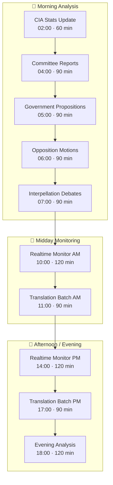
```mermaid
flowchart TD
    subgraph Morning["🌅 Morning Analysis"]
        A["CIA Stats Update<br/>02:00 · 60 min"]
        B["Committee Reports<br/>04:00 · 90 min"]
        C["Government Propositions<br/>05:00 · 90 min"]
        D["Opposition Motions<br/>06:00 · 90 min"]
        E["Interpellation Debates<br/>07:00 · 90 min"]
    end

    subgraph Midday["📰 Midday Monitoring"]
        F["Realtime Monitor AM<br/>10:00 · 120 min"]
        G["Translation Batch AM<br/>11:00 · 90 min"]
    end

    subgraph Evening["🌆 Afternoon / Evening"]
        H["Realtime Monitor PM<br/>14:00 · 120 min"]
        I["Translation Batch PM<br/>17:00 · 90 min"]
        J["Evening Analysis<br/>18:00 · 120 min"]
    end

    A --> B --> C --> D --> E --> F --> G --> H --> I --> J
```

### Weekend Schedule Variations

| Day | Active Workflows | Schedule Difference |
|-----|-----------------|---------------------|
| **Saturday** | Weekly Review (09:00) · Realtime Monitor (12:00) · Evening/Weekly Wrap-up (16:00) · Translation (14:00) | Reduced frequency; weekly synthesis |
| **Sunday** | Realtime Monitor (12:00) · Translation (14:00) | Minimal coverage |
| **1st of Month** | Month Ahead (08:00) | Monthly strategic outlook |
| **28th of Month** | Monthly Review (10:00) | Monthly retrospective |
| **Friday** | Week Ahead (07:00) | Weekly prospective outlook |

---

## 🔄 Workflow Overview

The Riksdagsmonitor project uses **48 workflow files** (23 standard `.yml` + 12 agentic `.lock.yml` + 13 agentic `.md` sources) organized into 5 functional categories:

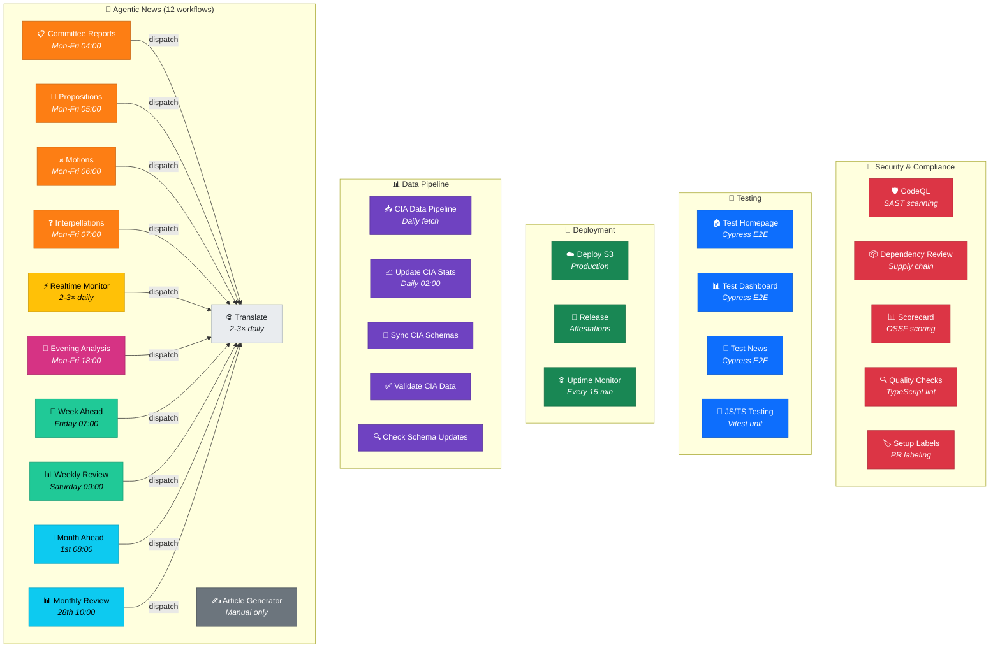
```mermaid
graph TB
    subgraph "🔐 Security & Compliance"
        SEC1["🛡️ CodeQL<br/><i>SAST scanning</i>"]
        SEC2["📦 Dependency Review<br/><i>Supply chain</i>"]
        SEC3["📊 Scorecard<br/><i>OSSF scoring</i>"]
        SEC4["🔍 Quality Checks<br/><i>TypeScript lint</i>"]
        SEC5["🏷️ Setup Labels<br/><i>PR labeling</i>"]
    end

    subgraph "🧪 Testing"
        TEST1["🏠 Test Homepage<br/><i>Cypress E2E</i>"]
        TEST2["📊 Test Dashboard<br/><i>Cypress E2E</i>"]
        TEST3["📰 Test News<br/><i>Cypress E2E</i>"]
        TEST4["🔬 JS/TS Testing<br/><i>Vitest unit</i>"]
    end

    subgraph "🚀 Deployment"
        DEP1["☁️ Deploy S3<br/><i>Production</i>"]
        DEP2["🔖 Release<br/><i>Attestations</i>"]
        DEP3["🌐 Uptime Monitor<br/><i>Every 15 min</i>"]
    end

    subgraph "📊 Data Pipeline"
        DATA1["📥 CIA Data Pipeline<br/><i>Daily fetch</i>"]
        DATA2["📈 Update CIA Stats<br/><i>Daily 02:00</i>"]
        DATA3["🔄 Sync CIA Schemas"]
        DATA4["✅ Validate CIA Data"]
        DATA5["🔍 Check Schema Updates"]
    end

    subgraph "📰 Agentic News (12 workflows)"
        NEWS1["📋 Committee Reports<br/><i>Mon-Fri 04:00</i>"]
        NEWS2["📜 Propositions<br/><i>Mon-Fri 05:00</i>"]
        NEWS3["✊ Motions<br/><i>Mon-Fri 06:00</i>"]
        NEWS4["❓ Interpellations<br/><i>Mon-Fri 07:00</i>"]
        NEWS5["⚡ Realtime Monitor<br/><i>2-3× daily</i>"]
        NEWS6["🌙 Evening Analysis<br/><i>Mon-Fri 18:00</i>"]
        NEWS7["📅 Week Ahead<br/><i>Friday 07:00</i>"]
        NEWS8["📊 Weekly Review<br/><i>Saturday 09:00</i>"]
        NEWS9["📅 Month Ahead<br/><i>1st 08:00</i>"]
        NEWS10["📊 Monthly Review<br/><i>28th 10:00</i>"]
        NEWS11["🌐 Translate<br/><i>2-3× daily</i>"]
        NEWS12["✍️ Article Generator<br/><i>Manual only</i>"]
    end

    NEWS1 & NEWS2 & NEWS3 & NEWS4 & NEWS5 & NEWS6 -->|"dispatch"| NEWS11
    NEWS7 & NEWS8 & NEWS9 & NEWS10 -->|"dispatch"| NEWS11

    style SEC1 fill:#dc3545,color:#fff,stroke:#b02a37
    style SEC2 fill:#dc3545,color:#fff,stroke:#b02a37
    style SEC3 fill:#dc3545,color:#fff,stroke:#b02a37
    style SEC4 fill:#dc3545,color:#fff,stroke:#b02a37
    style SEC5 fill:#dc3545,color:#fff,stroke:#b02a37
    style TEST1 fill:#0d6efd,color:#fff,stroke:#0a58ca
    style TEST2 fill:#0d6efd,color:#fff,stroke:#0a58ca
    style TEST3 fill:#0d6efd,color:#fff,stroke:#0a58ca
    style TEST4 fill:#0d6efd,color:#fff,stroke:#0a58ca
    style DEP1 fill:#198754,color:#fff,stroke:#146c43
    style DEP2 fill:#198754,color:#fff,stroke:#146c43
    style DEP3 fill:#198754,color:#fff,stroke:#146c43
    style DATA1 fill:#6f42c1,color:#fff,stroke:#59359a
    style DATA2 fill:#6f42c1,color:#fff,stroke:#59359a
    style DATA3 fill:#6f42c1,color:#fff,stroke:#59359a
    style DATA4 fill:#6f42c1,color:#fff,stroke:#59359a
    style DATA5 fill:#6f42c1,color:#fff,stroke:#59359a
    style NEWS1 fill:#fd7e14,color:#fff,stroke:#ca6510
    style NEWS2 fill:#fd7e14,color:#fff,stroke:#ca6510
    style NEWS3 fill:#fd7e14,color:#fff,stroke:#ca6510
    style NEWS4 fill:#fd7e14,color:#fff,stroke:#ca6510
    style NEWS5 fill:#ffc107,color:#000,stroke:#cc9a06
    style NEWS6 fill:#d63384,color:#fff,stroke:#ab296a
    style NEWS7 fill:#20c997,color:#000,stroke:#1aa179
    style NEWS8 fill:#20c997,color:#000,stroke:#1aa179
    style NEWS9 fill:#0dcaf0,color:#000,stroke:#0aa2c0
    style NEWS10 fill:#0dcaf0,color:#000,stroke:#0aa2c0
    style NEWS11 fill:#e9ecef,color:#212529,stroke:#adb5bd
    style NEWS12 fill:#6c757d,color:#fff,stroke:#495057
```

### Core CI/CD Workflows

1. **✅ Quality Checks** (`.github/workflows/quality-checks.yml`) — ESLint linting, HTML validation, link checking
2. **🧪 TypeScript & JavaScript Testing** (`.github/workflows/javascript-testing.yml`) — Vitest unit tests, TypeScript type-checking, Cypress E2E
3. **📖 TypeDoc Validation** (`.github/workflows/jsdoc-validation.yml`) — API documentation generation and coverage
4. **🌐 Translation Validation** (`.github/workflows/translation-validation.yml`) — 14-language validation with RTL and hreflang
5. **🚀 Release with Attestations** (`.github/workflows/release.yml`) — SLSA provenance, SBOM, dual deployment
6. **☁️ Deploy to S3** (`.github/workflows/deploy-s3.yml`) — AWS S3/CloudFront deployment

### Security Scanning Workflows

7. **🔍 CodeQL Analysis** (`.github/workflows/codeql.yml`) — SAST for JavaScript/TypeScript vulnerabilities
8. **📦 Dependency Review** (`.github/workflows/dependency-review.yml`) — SCA for dependency vulnerabilities
9. **⭐ Scorecard Analysis** (`.github/workflows/scorecards.yml`) — OpenSSF supply chain security assessment

### Testing & Monitoring Workflows

10. **🖥️ Test Dashboard** (`.github/workflows/test-dashboard.yml`) — Dashboard Cypress E2E tests
11. **🏠 Test Homepage** (`.github/workflows/test-homepage.yml`) — Homepage Cypress E2E tests
12. **📰 Test News** (`.github/workflows/test-news.yml`) — News pages Cypress E2E tests
13. **🔆 Lighthouse CI** (`.github/workflows/lighthouse-ci.yml`) — Performance, accessibility, SEO auditing
14. **📡 Uptime Monitor** (`.github/workflows/uptime-monitor.yml`) — 15-minute availability checks for all 14 languages

### CIA Data Pipeline Workflows

15. **📊 CIA Data Pipeline** (`.github/workflows/data-pipeline.yml`) — Fetch and validate CIA exports
16. **🔄 Check CIA Schema Updates** (`.github/workflows/check-cia-schema-updates.yml`) — Weekly schema drift detection
17. **📥 Sync CIA Schemas** (`.github/workflows/sync-cia-schemas.yml`) — Schema synchronization from upstream
18. **📈 Update CIA Stats** (`.github/workflows/update-cia-stats.yml`) — Daily production statistics
19. **✅ Validate CIA Data** (`.github/workflows/validate-cia-data.yml`) — JSON schema validation

### Automation & Infrastructure Workflows

20. **🏷️ Setup Labels** (`.github/workflows/setup-labels.yml`) — Repository label management
21. **🏷️ PR Labeler** (`.github/workflows/labeler.yml`) — Automated PR labeling
22. **🔧 Compile Agentic Workflows** (`.github/workflows/compile-agentic-workflows.yml`) — Compile .md → .lock.yml
23. **🤖 Copilot Setup Steps** (`.github/workflows/copilot-setup-steps.yml`) — GitHub Copilot environment

### 🤖 Agentic News Workflows (12 workflows: each has a `.md` source + `.lock.yml` compiled output)

24. **📰 News Article Generator** — Daily news generation
25. **🌅 News Evening Analysis** — Evening analysis reports
26. **📡 News Realtime Monitor** — Real-time political monitoring
27. **📋 News Motions** — Parliamentary motion tracking
28. **📊 News Committee Reports** — Committee report coverage
29. **📰 News Weekly Review** — Weekly political summary
30. **📆 News Monthly Review** — Monthly political review
31. **🔮 News Week Ahead** — Upcoming week preview
32. **📅 News Month Ahead** — Upcoming month preview
33. **🏛️ News Propositions** — Government proposition coverage
34. **❓ News Interpellations** — Interpellation debate tracking
35. **🌍 News Translate** — Multi-language article translation

### Workflow Relationships

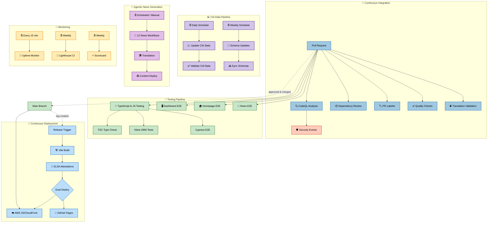
```mermaid
flowchart TB
    subgraph "🔄 Continuous Integration"
        direction TB
        PR[Pull Request] --> CodeQLScan[🔍 CodeQL Analysis]
        PR --> DependencyReview[📦 Dependency Review]
        PR --> Labeler[🏷️ PR Labeler]
        PR --> QualityChecks[✅ Quality Checks]
        PR --> TranslationVal[🌐 Translation Validation]
        CodeQLScan --> SecurityEvents[🛡️ Security Events]
    end

    subgraph "🧪 Testing Pipeline"
        direction TB
        PR --> UnitTests[🧪 TypeScript & JS Testing]
        UnitTests --> TypeCheck[TSC Type Check]
        UnitTests --> Vitest[Vitest 2890 Tests]
        UnitTests --> CypressE2E[Cypress E2E]
        PR --> DashboardE2E[🖥️ Dashboard E2E]
        PR --> HomepageE2E[🏠 Homepage E2E]
        PR --> NewsE2E[📰 News E2E]
    end

    subgraph "📊 CIA Data Pipeline"
        direction TB
        Schedule1[⏰ Daily Schedule] --> CIAStats[📈 Update CIA Stats]
        Schedule2[⏰ Weekly Schedule] --> SchemaCheck[🔄 Schema Updates]
        CIAStats --> DataValidation[✅ Validate CIA Data]
        SchemaCheck --> SchemaSync[📥 Sync Schemas]
    end

    subgraph "🚀 Continuous Deployment"
        direction TB
        Release[Release Trigger] --> Build[🏗️ Vite Build]
        Build --> Attestations[🔏 SLSA Attestations]
        Attestations --> DualDeploy{Dual Deploy}
        DualDeploy --> S3Deploy[☁️ AWS S3/CloudFront]
        DualDeploy --> GHPages[📄 GitHub Pages]
    end

    subgraph "🤖 Agentic News Generation"
        direction TB
        AgenticTrigger[⏰ Scheduled / Manual] --> NewsGen[📰 12 News Workflows]
        NewsGen --> Translate[🌍 Translation]
        Translate --> ContentDeploy[📤 Content Deploy]
    end

    subgraph "📡 Monitoring"
        direction TB
        Cron15[⏰ Every 15 min] --> Uptime[📡 Uptime Monitor]
        WeeklyLH[⏰ Weekly] --> Lighthouse[🔆 Lighthouse CI]
        WeeklyScore[⏰ Weekly] --> Scorecard[⭐ Scorecard]
    end

    PR -.-> |"approved & merged"| main[Main Branch]
    main --> S3Deploy
    main -.-> |"tag created"| Release

    classDef integration fill:#a0c8e0,stroke:#1565c0,stroke-width:1.5px,color:black
    classDef testing fill:#c8e6c9,stroke:#2e7d32,stroke-width:1.5px,color:black
    classDef deployment fill:#bbdefb,stroke:#1565c0,stroke-width:1.5px,color:black
    classDef security fill:#ffccbc,stroke:#bf360c,stroke-width:1.5px,color:black
    classDef datapipeline fill:#d1c4e9,stroke:#4a148c,stroke-width:1.5px,color:black
    classDef agentic fill:#e1bee7,stroke:#6a1b9a,stroke-width:1.5px,color:black
    classDef monitoring fill:#ffecb3,stroke:#f57f17,stroke-width:1.5px,color:black
    classDef process fill:#c8e6c9,stroke:#2e7d32,stroke-width:1.5px,color:black

    class PR,CodeQLScan,DependencyReview,Labeler,QualityChecks,TranslationVal integration
    class UnitTests,TypeCheck,Vitest,CypressE2E,DashboardE2E,HomepageE2E,NewsE2E testing
    class Release,Build,Attestations,DualDeploy,S3Deploy,GHPages deployment
    class SecurityEvents security
    class Schedule1,Schedule2,CIAStats,SchemaCheck,DataValidation,SchemaSync datapipeline
    class AgenticTrigger,NewsGen,Translate,ContentDeploy agentic
    class Cron15,WeeklyLH,WeeklyScore,Uptime,Lighthouse,Scorecard monitoring
    class main process
```

### 📊 Security Gates & Quality Thresholds

| Security Gate | Threshold | Workflow | Enforcement |
| --- | --- | --- | --- |
| **TypeScript Compilation** | Zero errors | javascript-testing.yml | Required ✅ |
| **ESLint** | Zero errors | quality-checks.yml | Required ✅ |
| **HTMLHint Validation** | Zero errors | quality-checks.yml | Required ✅ |
| **Link Integrity** | Zero broken internal links | quality-checks.yml | Required ✅ |
| **Unit Test Pass Rate** | 100% (2890 tests) | javascript-testing.yml | Required ✅ |
| **CodeQL SAST** | No critical/high | codeql.yml | Required ✅ |
| **Dependency Vulnerabilities** | No critical/high | dependency-review.yml | Required ✅ |
| **Translation Completeness** | All 14 languages valid | translation-validation.yml | Required ✅ |
| **OSSF Scorecard** | Score > 7.0 | scorecards.yml | Advisory ℹ️ |
| **Lighthouse Performance** | Score 90+ | lighthouse-ci.yml | Advisory ℹ️ |
| **Site Availability** | 99.9% uptime | uptime-monitor.yml | Advisory ℹ️ |

---

## 🔐 Security Hardening Practices

Riksdagsmonitor implements industry best practices for securing CI/CD pipelines, with StepSecurity hardening for all workflows:

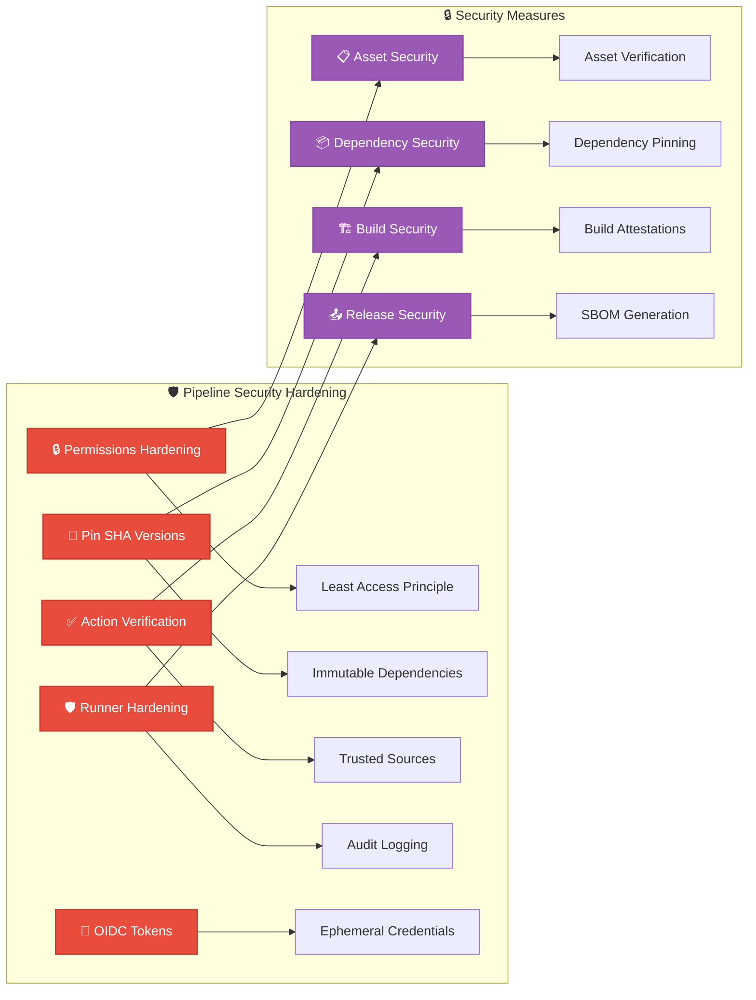
```mermaid
flowchart LR
    subgraph "🛡️ Pipeline Security Hardening"
        PH[🔒 Permissions Hardening] --> LAP[Least Access Principle]
        PS[📌 Pin SHA Versions] --> IDT[Immutable Dependencies]
        AV[✅ Action Verification] --> TS[Trusted Sources]
        RH[🛡️ Runner Hardening] --> AL[Audit Logging]
        OT[🔑 OIDC Tokens] --> EF[Ephemeral Credentials]
    end

    subgraph "🔒 Security Measures"
        AS[📋 Asset Security] --> AC[Asset Verification]
        DS[📦 Dependency Security] --> PD[Dependency Pinning]
        BS[🏗️ Build Security] --> BA[Build Attestations]
        RS[📤 Release Security] --> SBOM[SBOM Generation]
    end

    PH --> AS
    PS --> DS
    AV --> BS
    RH --> RS

    classDef security fill:#e74c3c,stroke:#c0392b,stroke-width:1.5px,color:white
    classDef measures fill:#9b59b6,stroke:#8e44ad,stroke-width:1.5px,color:white

    class PH,PS,AV,RH,OT security
    class AS,DS,BS,RS measures
```

### Specific Hardening Measures

Every workflow in the Riksdagsmonitor project implements least-privilege security. The baseline minimum permission is `contents: read`; individual workflows add only the extra scopes they need (e.g., `id-token: write` for OIDC, `pages: write` for deployments, `pull-requests: write` for PR comments):

1. **🔒 Permissions Restriction**: Explicit least-privilege permissions per workflow
   ```yaml
   # Baseline minimum — additional scopes added per-workflow as needed
   permissions:
     contents: read
   ```

2. **📌 SHA Pinning**: All external actions pinned to specific SHA hashes for immutability
   ```yaml
   - uses: actions/checkout@11bd71901bbe5b1630ceea73d27597364c9af683 # v4
   ```

3. **🛡️ Runner Hardening**: StepSecurity harden-runner for egress auditing
   ```yaml
   - name: Harden Runner
     uses: step-security/harden-runner@fa2e9d605c4eeb9fcad4c99c224cee0c6c7f3594 # v2.16.0
     with:
       egress-policy: audit
   ```

4. **📄 SBOM Generation**: Software Bill of Materials for supply chain transparency

5. **🔏 Build Attestations**: SLSA build provenance attestations (via GitHub Attestations)

6. **⏱️ Timeout Limits**: Jobs use timeout limits where applicable to prevent resource exhaustion

7. **🔑 OIDC Tokens**: Ephemeral authentication for AWS deployments

---

## 📋 Detailed Pipeline Stages

### 🧪 Stage 1: Quality Checks (`quality-checks.yml`)

**Purpose:** Validates code quality through ESLint linting, HTML validation, and link checking.
**Trigger:** Push/PR to `main`
**Security Controls:** Harden-runner with egress auditing, SHA-pinned actions, least privilege permissions (`contents: read`)

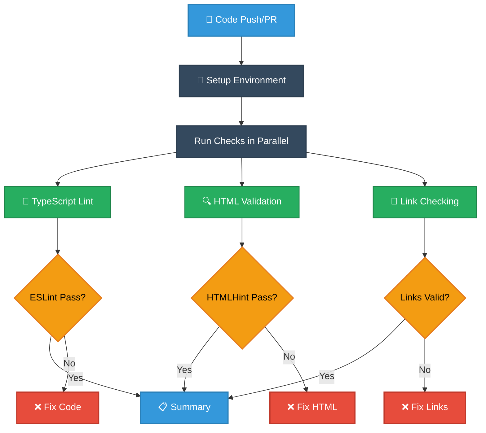
```mermaid
flowchart TD
    Start[🚀 Code Push/PR] --> Prepare[🔧 Setup Environment]
    Prepare --> ParallelChecks[Run Checks in Parallel]

    ParallelChecks --> TSLint[📝 TypeScript Lint]
    ParallelChecks --> HTMLVal[🔍 HTML Validation]
    ParallelChecks --> LinkCheck[🔗 Link Checking]

    TSLint --> TSResult{ESLint Pass?}
    HTMLVal --> HTMLResult{HTMLHint Pass?}
    LinkCheck --> LinkResult{Links Valid?}

    TSResult -->|Yes| Summary[📋 Summary]
    HTMLResult -->|Yes| Summary
    LinkResult -->|Yes| Summary

    TSResult -->|No| FixCode[❌ Fix Code]
    HTMLResult -->|No| FixHTML[❌ Fix HTML]
    LinkResult -->|No| FixLinks[❌ Fix Links]

    classDef startEnd fill:#3498db,stroke:#2980b9,stroke-width:2px,color:white
    classDef process fill:#34495e,stroke:#2c3e50,stroke-width:2px,color:white
    classDef test fill:#27ae60,stroke:#1e8449,stroke-width:1.5px,color:white
    classDef decision fill:#f39c12,stroke:#e67e22,stroke-width:2px,color:black
    classDef fail fill:#e74c3c,stroke:#c0392b,stroke-width:2px,color:white

    class Start,Summary startEnd
    class Prepare,ParallelChecks process
    class TSLint,HTMLVal,LinkCheck test
    class TSResult,HTMLResult,LinkResult decision
    class FixCode,FixHTML,FixLinks fail
```

**Jobs:**
- **📝 TypeScript Lint** — ESLint flat config with `@typescript-eslint/parser` across `tsconfig.browser.json` + `tsconfig.scripts.json`
- **🔍 HTML Validation** — HTMLHint on all `*.html` files (14 language versions)
- **🔗 Link Checking** — Vite preview server + linkinator recursive check (skip external)

---

### 🧪 Stage 2: TypeScript & JavaScript Testing (`javascript-testing.yml`)

**Purpose:** Primary test workflow — TypeScript type-checking, Vitest unit tests, Vite build verification, and multi-language Cypress E2E.
**Trigger:** Push/PR on `**/*.ts`, `**/*.js`, `src/browser/**`, `tsconfig*.json`, `*.html`, `cypress/**`, `package*.json`

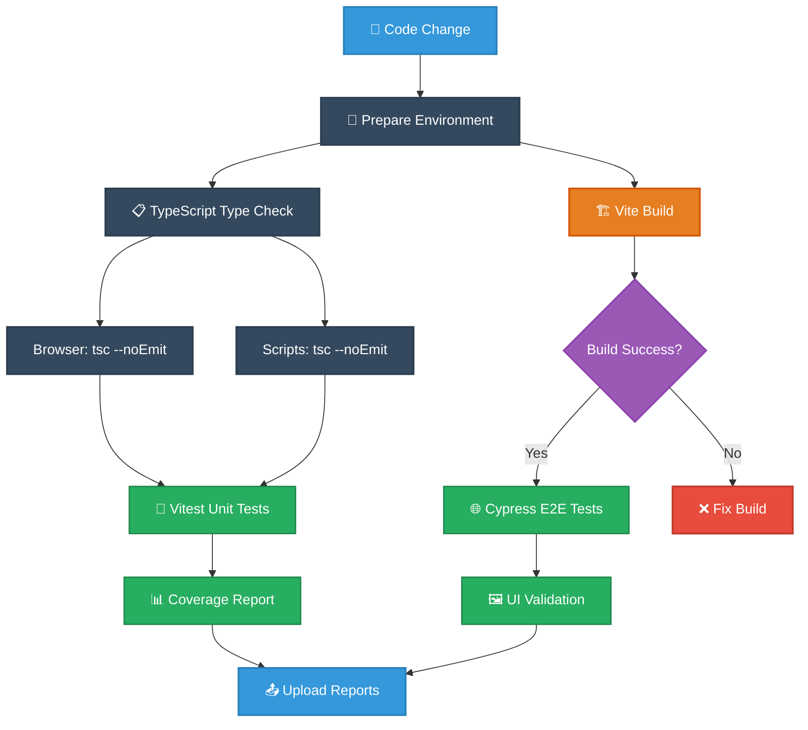
```mermaid
flowchart TD
    CodeChange[📝 Code Change] --> PrepareJob[🔧 Prepare Environment]
    PrepareJob --> TypeCheck[📋 TypeScript Type Check]
    TypeCheck --> BrowserTSC[Browser: tsc --noEmit]
    TypeCheck --> ScriptsTSC[Scripts: tsc --noEmit]

    BrowserTSC --> UnitTests[🧪 Vitest Unit Tests]
    ScriptsTSC --> UnitTests
    UnitTests --> CoverageMeasurement[📊 Coverage Report]

    PrepareJob --> BuildValidation[🏗️ Vite Build]
    BuildValidation --> BuildPass{Build Success?}
    BuildPass -->|Yes| E2ETests[🌐 Cypress E2E Tests]
    BuildPass -->|No| FixBuild[❌ Fix Build]

    E2ETests --> UIValidation[🖼️ UI Validation]

    CoverageMeasurement --> Report[📤 Upload Reports]
    UIValidation --> Report

    classDef start fill:#3498db,stroke:#2980b9,stroke-width:2px,color:white
    classDef process fill:#34495e,stroke:#2c3e50,stroke-width:2px,color:white
    classDef test fill:#27ae60,stroke:#1e8449,stroke-width:1.5px,color:white
    classDef decision fill:#9b59b6,stroke:#8e44ad,stroke-width:2px,color:white
    classDef parallel fill:#e67e22,stroke:#d35400,stroke-width:2px,color:white
    classDef fail fill:#e74c3c,stroke:#c0392b,stroke-width:2px,color:white

    class CodeChange start
    class PrepareJob,TypeCheck,BrowserTSC,ScriptsTSC process
    class UnitTests,CoverageMeasurement,E2ETests,UIValidation test
    class BuildPass decision
    class BuildValidation parallel
    class FixBuild fail
    class Report start
```

**TypeScript Compilation Strategy:**
- `tsconfig.browser.json` — validates `src/browser/**/*.ts` (31 modules)
- `tsconfig.scripts.json` — validates `scripts/**/*.ts` + `tests/**/*.ts`
- Both use `noEmit: true` (Vite/esbuild handles actual compilation)

**Test Coverage:** 2890 unit tests (Vitest) + Happy-DOM environment for browser modules + V8 coverage provider

---

### 🔍 Stage 3: Security Scanning

#### 3.1 CodeQL Analysis (`codeql.yml`)

**Tool:** GitHub CodeQL
**Trigger:** Push to main, PR, weekly schedule
**Language matrix:** `["javascript-typescript"]`

#### 3.2 Dependency Review (`dependency-review.yml`)

**Tool:** `actions/dependency-review-action`
**Trigger:** Pull requests
**Gate:** Blocks PRs with critical/high vulnerability dependencies

#### 3.3 OpenSSF Scorecard (`scorecards.yml`)

**Tool:** OpenSSF Scorecard
**Trigger:** Push to main, weekly schedule
**Purpose:** Supply chain security assessment and OSSF best practices evaluation

---

### 🚀 Stage 4: Release & Deployment

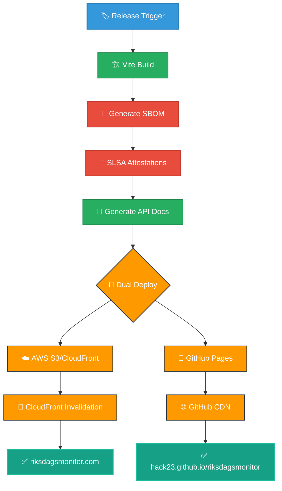
```mermaid
flowchart TD
    Trigger[🏷️ Release Trigger] --> Build[🏗️ Vite Build]
    Build --> SBOM[📄 Generate SBOM]
    SBOM --> Attestations[🔏 SLSA Attestations]
    Attestations --> TypeDoc[📖 Generate API Docs]
    TypeDoc --> DualDeploy{🚀 Dual Deploy}

    DualDeploy --> S3[☁️ AWS S3/CloudFront]
    DualDeploy --> GHP[📄 GitHub Pages]

    S3 --> CFInvalidate[🔄 CloudFront Invalidation]
    GHP --> GHPCdn[🌐 GitHub CDN]

    CFInvalidate --> Live1[✅ riksdagsmonitor.com]
    GHPCdn --> Live2[✅ hack23.github.io/riksdagsmonitor]

    classDef trigger fill:#3498db,stroke:#2980b9,stroke-width:2px,color:white
    classDef build fill:#27ae60,stroke:#1e8449,stroke-width:1.5px,color:white
    classDef security fill:#e74c3c,stroke:#c0392b,stroke-width:1.5px,color:white
    classDef deploy fill:#FF9900,stroke:#232F3E,stroke-width:1.5px,color:white
    classDef complete fill:#16a085,stroke:#1abc9c,stroke-width:2px,color:white

    class Trigger trigger
    class Build,TypeDoc build
    class SBOM,Attestations security
    class DualDeploy,S3,GHP,CFInvalidate,GHPCdn deploy
    class Live1,Live2 complete
```

**Release Pipeline Features:**
- **🏷️ Tag-based Releases**: Automatic releases on `v*` tag push
- **📋 Manual Releases**: Workflow dispatch with version input
- **🔒 SLSA Attestations**: Build provenance for supply chain security
- **📄 SBOM Generation**: Software Bill of Materials
- **📖 TypeDoc**: API documentation generation
- **☁️ Dual Deployment**: AWS S3/CloudFront (primary) + GitHub Pages (DR)

**S3 Sync Exclusions:** `.git/*`, `.github/*`, `node_modules/*`, `src/*`, `tests/*`, `cypress/*`, `builds/*`, `tsconfig*.json`, `*.config.js`

---

### 📊 Stage 5: CIA Data Integration

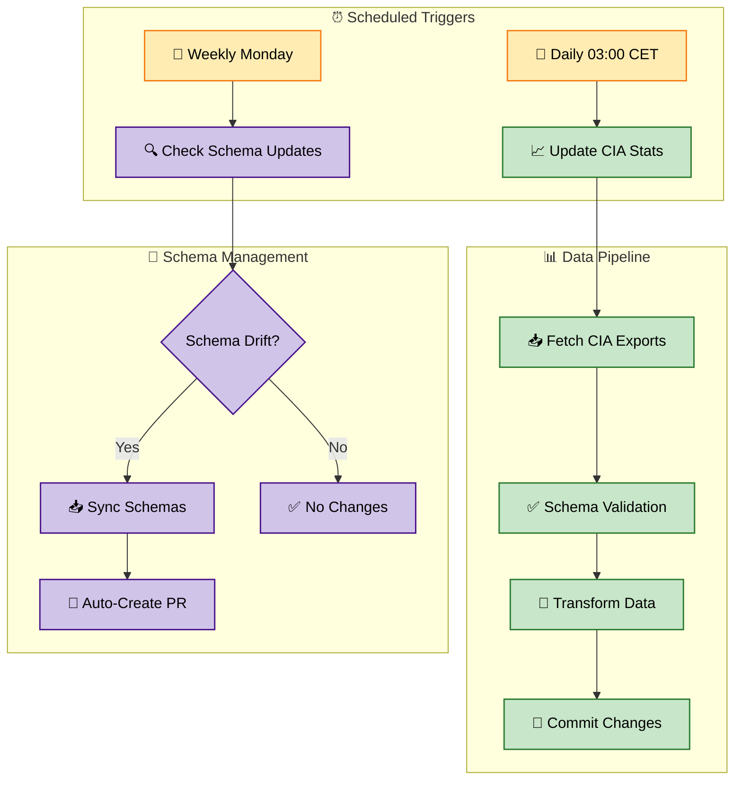
```mermaid
flowchart TD
    subgraph "⏰ Scheduled Triggers"
        Daily[📅 Daily 03:00 CET] --> Stats[📈 Update CIA Stats]
        Weekly[📅 Weekly Monday] --> SchemaCheck[🔍 Check Schema Updates]
    end

    subgraph "📊 Data Pipeline"
        Stats --> FetchData[📥 Fetch CIA Exports]
        FetchData --> Validate[✅ Schema Validation]
        Validate --> Transform[🔄 Transform Data]
        Transform --> Commit[💾 Commit Changes]
    end

    subgraph "🔧 Schema Management"
        SchemaCheck --> Drift{Schema Drift?}
        Drift -->|Yes| SyncSchemas[📥 Sync Schemas]
        Drift -->|No| NoAction[✅ No Changes]
        SyncSchemas --> AutoPR[🔄 Auto-Create PR]
    end

    classDef schedule fill:#ffecb3,stroke:#f57f17,stroke-width:1.5px,color:black
    classDef pipeline fill:#c8e6c9,stroke:#2e7d32,stroke-width:1.5px,color:black
    classDef schema fill:#d1c4e9,stroke:#4a148c,stroke-width:1.5px,color:black
    classDef decision fill:#f39c12,stroke:#e67e22,stroke-width:2px,color:black

    class Daily,Weekly schedule
    class Stats,FetchData,Validate,Transform,Commit pipeline
    class SchemaCheck,Drift,SyncSchemas,NoAction,AutoPR schema
```

**Workflows:**
- **📈 Update CIA Stats** (`update-cia-stats.yml`): Daily at 03:00 CET — Uses Node 25 native TypeScript (`node scripts/load-cia-stats.ts`)
- **📊 Data Pipeline** (`data-pipeline.yml`): Manual dispatch — Fetch & validate CIA exports
- **🔄 Check Schema Updates** (`check-cia-schema-updates.yml`): Weekly — Detect upstream schema changes
- **📥 Sync Schemas** (`sync-cia-schemas.yml`): Manual/push — Sync schemas from CIA repo
- **✅ Validate CIA Data** (`validate-cia-data.yml`): Daily/push/PR — JSON schema validation

---

### 🤖 Stage 6: Agentic News Generation

Twelve agentic workflows use the `gh-aw` (GitHub Agentic Workflows) framework with Claude Opus 4.7 to generate political news content following OSINT/INTOP editorial standards.

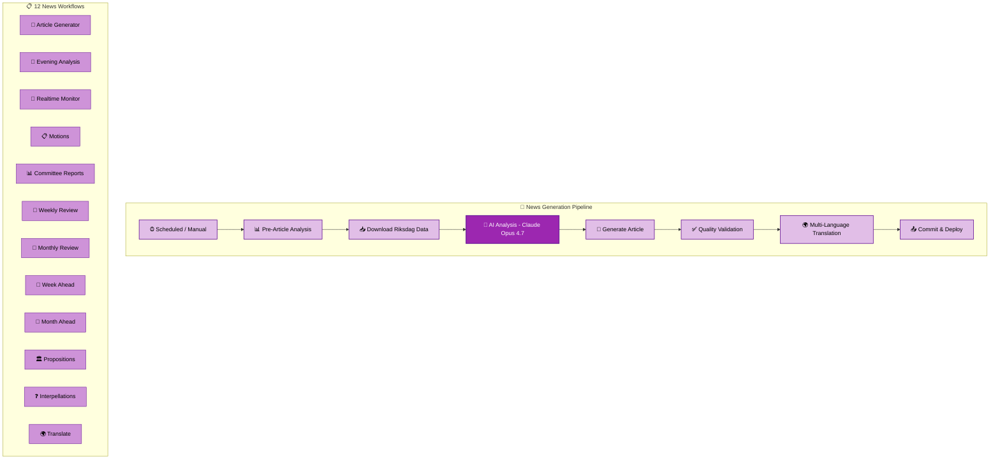
```mermaid
flowchart TD
    subgraph "📰 News Generation Pipeline"
        Trigger[⏰ Scheduled / Manual] --> PreAnalysis[📊 Pre-Article Analysis]
        PreAnalysis --> Download[📥 Download Riksdag Data]
        Download --> AIAnalysis[🤖 AI Analysis - Claude Opus 4.7]
        AIAnalysis --> Generate[📝 Generate Article]
        Generate --> QualityCheck[✅ Quality Validation]
        QualityCheck --> Translate[🌍 Multi-Language Translation]
        Translate --> Deploy[📤 Commit & Deploy]
    end

    subgraph "📋 12 News Workflows"
        W1[📰 Article Generator]
        W2[🌅 Evening Analysis]
        W3[📡 Realtime Monitor]
        W4[📋 Motions]
        W5[📊 Committee Reports]
        W6[📰 Weekly Review]
        W7[📆 Monthly Review]
        W8[🔮 Week Ahead]
        W9[📅 Month Ahead]
        W10[🏛️ Propositions]
        W11[❓ Interpellations]
        W12[🌍 Translate]
    end

    classDef pipeline fill:#e1bee7,stroke:#6a1b9a,stroke-width:1.5px,color:black
    classDef workflow fill:#ce93d8,stroke:#6a1b9a,stroke-width:1px,color:black
    classDef ai fill:#9C27B0,stroke:#6a1b9a,stroke-width:2px,color:white

    class Trigger,PreAnalysis,Download,Generate,QualityCheck,Translate,Deploy pipeline
    class AIAnalysis ai
    class W1,W2,W3,W4,W5,W6,W7,W8,W9,W10,W11,W12 workflow
```

**MCP Tools Available:**
- `riksdag-regering-mcp` (32 tools for Swedish political data)
- `@playwright/mcp` (browser automation)
- `@modelcontextprotocol/server-filesystem`
- `@modelcontextprotocol/server-memory`

**Compilation:** Source `.md` → `.lock.yml` via `compile-agentic-workflows.yml`

#### Per-Workflow Data Download & Unique Analytics

Each agentic workflow downloads data from specific MCP tools and produces unique political intelligence that only that document type can provide:


```mermaid
graph TB
    subgraph "📥 MCP Data Sources"
        BET["get_betankanden<br/><i>Committee reports</i>"]
        PROP["get_propositioner<br/><i>Government bills</i>"]
        MOT["get_motioner<br/><i>Opposition motions</i>"]
        INTERP["get_interpellationer<br/><i>Parliamentary questions</i>"]
        VOTE["search_voteringar<br/><i>Voting records</i>"]
        ANF["search_anforanden<br/><i>Debate speeches</i>"]
        DOK["search_dokument<br/><i>Document search</i>"]
        DOKFT["search_dokument_fulltext<br/><i>Full-text search</i>"]
        CAL["get_calendar_events<br/><i>Parliamentary calendar</i>"]
        SCB["SCB MCP<br/><i>Statistics Sweden</i>"]
        WB["World Bank MCP<br/><i>International data</i>"]
    end

    subgraph "📰 Agentic Workflows"
        WF_CR["📋 Committee Reports"]
        WF_PR["📜 Propositions"]
        WF_MO["✊ Motions"]
        WF_IP["❓ Interpellations"]
        WF_EV["🌙 Evening Analysis"]
        WF_RT["⚡ Realtime Monitor"]
        WF_WR["📅 Weekly Review"]
        WF_WA["🔮 Week Ahead"]
    end

    BET --> WF_CR
    VOTE --> WF_CR
    ANF --> WF_CR
    PROP --> WF_CR
    SCB --> WF_CR
    PROP --> WF_PR
    DOKFT --> WF_PR
    ANF --> WF_PR
    MOT --> WF_MO
    DOKFT --> WF_MO
    ANF --> WF_MO
    INTERP --> WF_IP
    ANF --> WF_IP
    DOKFT --> WF_IP
    CAL --> WF_IP
    VOTE --> WF_EV
    ANF --> WF_EV
    BET --> WF_EV
    CAL --> WF_EV
    DOK --> WF_RT
    CAL --> WF_RT
    VOTE --> WF_RT
    ANF --> WF_RT
    BET --> WF_RT
    DOK --> WF_WR
    ANF --> WF_WR
    BET --> WF_WR
    PROP --> WF_WR
    MOT --> WF_WR
    VOTE --> WF_WR
    CAL --> WF_WA
    DOK --> WF_WA
    ANF --> WF_WA
    INTERP --> WF_WA

    style BET fill:#198754,color:#fff
    style PROP fill:#0d6efd,color:#fff
    style MOT fill:#fd7e14,color:#fff
    style INTERP fill:#dc3545,color:#fff
    style VOTE fill:#6f42c1,color:#fff
    style ANF fill:#d63384,color:#fff
    style DOK fill:#20c997,color:#000
    style DOKFT fill:#17a589,color:#fff
    style CAL fill:#0dcaf0,color:#000
    style SCB fill:#ffc107,color:#000
    style WB fill:#ff9800,color:#000
    style WF_CR fill:#198754,color:#fff,stroke-width:2px
    style WF_PR fill:#0d6efd,color:#fff,stroke-width:2px
    style WF_MO fill:#fd7e14,color:#fff,stroke-width:2px
    style WF_IP fill:#dc3545,color:#fff,stroke-width:2px
    style WF_EV fill:#6f42c1,color:#fff,stroke-width:2px
    style WF_RT fill:#d63384,color:#fff,stroke-width:2px
    style WF_WR fill:#20c997,color:#000,stroke-width:2px
    style WF_WA fill:#0dcaf0,color:#000,stroke-width:2px
```

| # | Workflow | Schedule | Primary MCP Data | Unique Analytics Produced |
|---|---------|----------|-----------------|--------------------------|
| 1 | **Committee Reports** | Mon–Fri 04:00 UTC | `get_betankanden`, `search_voteringar`, `search_anforanden`, `get_propositioner` | Committee voting splits per party, reservation (dissent) analysis, committee-to-policy-domain mapping, SCB statistical enrichment per committee domain |
| 2 | **Propositions** | Mon–Fri 05:00 UTC | `get_propositioner`, `search_dokument_fulltext`, `analyze_g0v_by_department`, `search_anforanden` | Legislative pipeline tracking (referral → committee → vote), government legislative ambition score, budget allocation impact analysis, policy domain cascading effects |
| 3 | **Motions** | Mon–Fri 06:00 UTC | `get_motioner`, `search_dokument_fulltext`, `analyze_g0v_by_department`, `search_anforanden` | Opposition strategy analysis, motion clustering by theme, cross-party co-sponsorship detection, signalverdi (is this positioning or a real bid?) |
| 4 | **Interpellations** | Mon–Fri 07:00 UTC | `get_interpellationer`, `search_anforanden`, `search_dokument_fulltext`, `get_calendar_events` | Ministerial accountability scoring (response rate/timeliness), evasion detection, question framing analysis, party oversight strategy mapping |
| 5 | **Realtime Monitor** | Mon–Fri 10:00+14:00, Weekends 12:00 | `search_dokument`, `get_calendar_events`, `search_voteringar`, `search_anforanden`, `get_betankanden` | Breaking event detection, urgency classification, real-time political temperature spikes |
| 6 | **Evening Analysis** | Mon–Fri 18:00, Sat 16:00 | `search_voteringar`, `search_anforanden`, `get_betankanden`, `get_calendar_events` | Daily parliamentary pulse, party discipline metrics, coalition cohesion scoring, debate intensity index |
| 7 | **Weekly Review** | Sat 09:00 UTC | `search_dokument`, `search_anforanden`, `get_betankanden`, `get_propositioner`, `get_motioner`, `search_voteringar` | Week-over-week trend detection, cross-document-type pattern identification, legislative throughput metrics |
| 8 | **Week Ahead** | Fri 07:00 UTC | `get_calendar_events`, `search_dokument`, `search_anforanden`, `get_fragor`, `get_interpellationer` | Prospective calendar analysis, scheduled debate preview, expected vote outcomes |
| 9 | **Monthly Review** | 28th 10:00 UTC | `search_dokument`, `search_anforanden`, `get_betankanden`, `get_propositioner`, `get_motioner`, `search_voteringar` | Monthly legislative throughput, party productivity rankings, government vs opposition scorecard |
| 10 | **Month Ahead** | 1st 08:00 UTC | `get_calendar_events`, `search_dokument`, `get_betankanden`, `get_propositioner`, `get_motioner` | Strategic political calendar, legislative pipeline forecast, major policy decision timeline |
| 11 | **Article Generator** | Manual only | Per-type (configurable) | Manual backfill/regeneration for any article type |
| 12 | **Translate** | Mon–Fri 11:00+17:00, Weekends 14:00 | N/A (text processing) | 14-language translation quality with cultural adaptation |

---

### 📡 Stage 7: Monitoring & Infrastructure

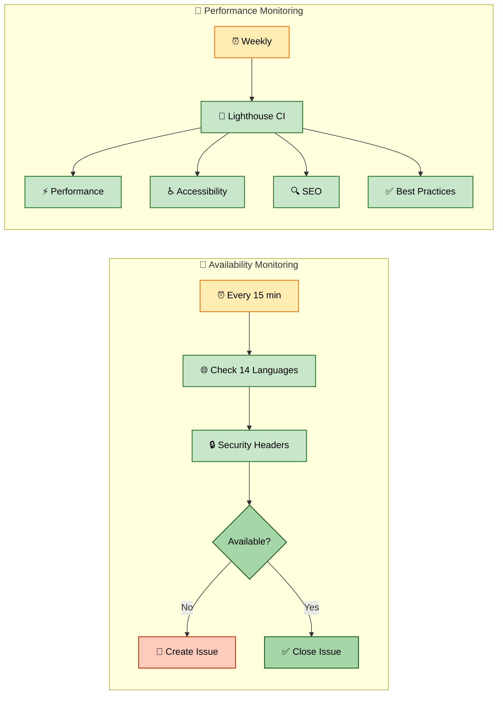
```mermaid
flowchart LR
    subgraph "📡 Availability Monitoring"
        Cron[⏰ Every 15 min] --> Check14[🌐 Check 14 Languages]
        Check14 --> Headers[🔒 Security Headers]
        Headers --> Result{Available?}
        Result -->|No| CreateIssue[🚨 Create Issue]
        Result -->|Yes| CloseIssue[✅ Close Issue]
    end

    subgraph "🔆 Performance Monitoring"
        Weekly[⏰ Weekly] --> LH[🔆 Lighthouse CI]
        LH --> Perf[⚡ Performance]
        LH --> A11y[♿ Accessibility]
        LH --> SEO[🔍 SEO]
        LH --> BP[✅ Best Practices]
    end

    classDef schedule fill:#ffecb3,stroke:#f57f17,stroke-width:1.5px,color:black
    classDef check fill:#c8e6c9,stroke:#2e7d32,stroke-width:1.5px,color:black
    classDef alert fill:#ffccbc,stroke:#bf360c,stroke-width:1.5px,color:black
    classDef success fill:#a5d6a7,stroke:#1b5e20,stroke-width:1.5px,color:black

    class Cron,Weekly schedule
    class Check14,Headers,LH,Perf,A11y,SEO,BP check
    class CreateIssue alert
    class CloseIssue,Result success
```

**Uptime Monitor** (`uptime-monitor.yml`):
- Every 15 minutes — checks all 14 language homepages
- Validates security headers (HSTS, CSP, X-Frame-Options)
- Auto-creates/closes GitHub issues on outage/recovery

**Lighthouse CI** (`lighthouse-ci.yml`):
- Weekly + push/PR to main
- Targets: LCP < 2.5s, CLS < 0.1, Accessibility ≥ 90

---

## 🔧 Complete Workflow Inventory (48 Files)

### 🔐 Security & Compliance (5 workflows)

| # | Workflow | File | Trigger | ISMS Controls |
| --- | --- | --- | --- | --- |
| 1.1 | 🔍 CodeQL Analysis | `codeql.yml` | Push, PR, Weekly | A.8.8, PR.DS-6, CIS 16.6 |
| 1.2 | 📦 Dependency Review | `dependency-review.yml` | Pull requests | A.8.8, PR.DS-6, CIS 16.6 |
| 1.3 | ⭐ OpenSSF Scorecard | `scorecards.yml` | Push to main, Weekly | A.5.36, DE.CM-6, CIS 16.2 |
| 1.4 | 🏷️ Setup Labels | `setup-labels.yml` | Manual dispatch | A.5.37, PR.IP-1 |
| 1.5 | 🏷️ PR Labeler | `labeler.yml` | Pull requests | A.5.37, PR.IP-1 |

### 🧪 Testing & Validation (7 workflows)

| # | Workflow | File | Trigger | Coverage |
| --- | --- | --- | --- | --- |
| 2.1 | 🧪 TypeScript & JS Testing | `javascript-testing.yml` | Push/PR (TS/JS/HTML) | TSC + Vitest + Cypress |
| 2.2 | 📖 TypeDoc Validation | `jsdoc-validation.yml` | Manual dispatch | TypeDoc generation + coverage |
| 2.3 | ✅ Quality Checks | `quality-checks.yml` | Push/PR to main | ESLint + HTMLHint + linkinator |
| 2.4 | 🌐 Translation Validation | `translation-validation.yml` | Push/PR (HTML) | 14-language + RTL + hreflang |
| 2.5 | 🖥️ Test Dashboard | `test-dashboard.yml` | Push/PR (src/browser) | Dashboard Cypress E2E |
| 2.6 | 🏠 Test Homepage | `test-homepage.yml` | Push/PR (src/browser) | Homepage Cypress E2E |
| 2.7 | 📰 Test News | `test-news.yml` | Push/PR (news) | News pages Cypress E2E |

### 📊 CIA Data Pipeline (5 workflows)

| # | Workflow | File | Trigger | Purpose |
| --- | --- | --- | --- | --- |
| 3.1 | 📊 CIA Data Pipeline | `data-pipeline.yml` | Manual dispatch | Fetch & validate CIA exports |
| 3.2 | 🔄 Check CIA Schema Updates | `check-cia-schema-updates.yml` | Weekly schedule | Detect upstream schema changes |
| 3.3 | 📥 Sync CIA Schemas | `sync-cia-schemas.yml` | Manual dispatch, push | Sync schemas from CIA repo |
| 3.4 | 📈 Update CIA Stats | `update-cia-stats.yml` | Daily 03:00 CET, manual | Fetch production statistics |
| 3.5 | ✅ Validate CIA Data | `validate-cia-data.yml` | Daily, push/PR, manual | JSON schema validation |

### 🚀 Release & Deployment (3 workflows)

| # | Workflow | File | Trigger | Targets |
| --- | --- | --- | --- | --- |
| 4.1 | 🚀 Release with Attestations | `release.yml` | Push tags (v*), manual | SLSA + dual deploy |
| 4.2 | ☁️ Deploy to S3 | `deploy-s3.yml` | Push to main | AWS S3/CloudFront |
| 4.3 | 🔆 Lighthouse CI | `lighthouse-ci.yml` | Push/PR, weekly | Performance audit |

### 🤖 Agentic Workflows (12 workflows × 2 files each + 1 compiler = 25 files)

| # | Workflow | Source | Lock | Purpose |
| --- | --- | --- | --- | --- |
| 5.1 | 📰 News Article Generator | `news-article-generator.md` | `news-article-generator.lock.yml` | Daily news generation |
| 5.2 | 🌅 News Evening Analysis | `news-evening-analysis.md` | `news-evening-analysis.lock.yml` | Evening analysis reports |
| 5.3 | 📡 News Realtime Monitor | `news-realtime-monitor.md` | `news-realtime-monitor.lock.yml` | Real-time political monitoring |
| 5.4 | 📋 News Motions | `news-motions.md` | `news-motions.lock.yml` | Motion tracking and reporting |
| 5.5 | 📊 News Committee Reports | `news-committee-reports.md` | `news-committee-reports.lock.yml` | Committee report coverage |
| 5.6 | 📰 News Weekly Review | `news-weekly-review.md` | `news-weekly-review.lock.yml` | Weekly political summary |
| 5.7 | 📆 News Monthly Review | `news-monthly-review.md` | `news-monthly-review.lock.yml` | Monthly political review |
| 5.8 | 🔮 News Week Ahead | `news-week-ahead.md` | `news-week-ahead.lock.yml` | Upcoming week preview |
| 5.9 | 📅 News Month Ahead | `news-month-ahead.md` | `news-month-ahead.lock.yml` | Upcoming month preview |
| 5.10 | 🏛️ News Propositions | `news-propositions.md` | `news-propositions.lock.yml` | Government proposition coverage |
| 5.11 | ❓ News Interpellations | `news-interpellations.md` | `news-interpellations.lock.yml` | Interpellation debate tracking |
| 5.12 | 🌍 News Translate | `news-translate.md` | `news-translate.lock.yml` | Multi-language translation |
| 5.13 | 🔧 Compile Agentic Workflows | `compile-agentic-workflows.yml` | — | Compile .md → .lock.yml |

### 📡 Monitoring & Infrastructure (2 workflows)

| # | Workflow | File | Trigger | Purpose |
| --- | --- | --- | --- | --- |
| 6.1 | 📡 Uptime Monitor | `uptime-monitor.yml` | Every 15 minutes | Site availability checks |
| 6.2 | 🤖 Copilot Setup Steps | `copilot-setup-steps.yml` | Push, manual | Agent environment setup |

---

## 🔒 Workflow Security Architecture

### Supply Chain Security

All workflows implement defense-in-depth:

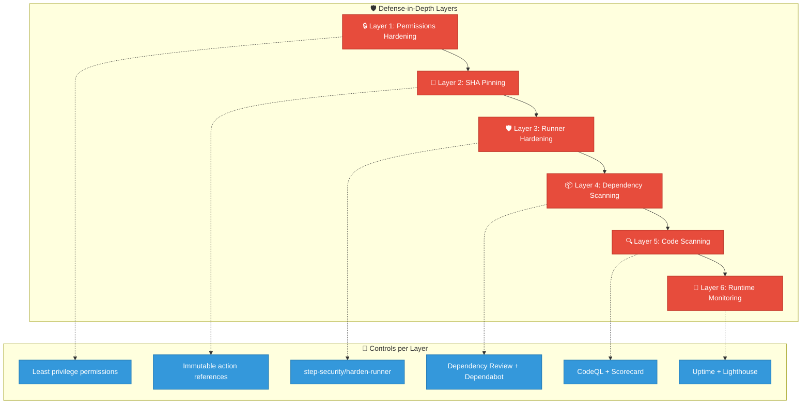
```mermaid
flowchart TB
    subgraph "🛡️ Defense-in-Depth Layers"
        L1[🔒 Layer 1: Permissions Hardening] --> L2[📌 Layer 2: SHA Pinning]
        L2 --> L3[🛡️ Layer 3: Runner Hardening]
        L3 --> L4[📦 Layer 4: Dependency Scanning]
        L4 --> L5[🔍 Layer 5: Code Scanning]
        L5 --> L6[📡 Layer 6: Runtime Monitoring]
    end

    subgraph "🔐 Controls per Layer"
        L1 -.-> C1[Least privilege permissions]
        L2 -.-> C2[Immutable action references]
        L3 -.-> C3[step-security/harden-runner]
        L4 -.-> C4[Dependency Review + Dependabot]
        L5 -.-> C5[CodeQL + Scorecard]
        L6 -.-> C6[Uptime + Lighthouse]
    end

    classDef layer fill:#e74c3c,stroke:#c0392b,stroke-width:1.5px,color:white
    classDef control fill:#3498db,stroke:#2980b9,stroke-width:1.5px,color:white

    class L1,L2,L3,L4,L5,L6 layer
    class C1,C2,C3,C4,C5,C6 control
```

| Control | Implementation | ISMS Reference |
| --- | --- | --- |
| 🔒 Action SHA Pinning | Every `uses:` pinned to commit SHA | CIS 16.6 |
| 🛡️ Harden Runner | `step-security/harden-runner` with egress audit | NIST DE.CM-1 |
| 🔐 Least Privilege | Minimal `permissions:` per-workflow | ISO A.8.3 |
| 📦 Dependency Review | `actions/dependency-review-action` on PRs | CIS 16.4 |
| 🔍 CodeQL Scanning | `javascript-typescript` language matrix | ISO A.8.8 |
| ⭐ Scorecard | OpenSSF Scorecard supply-chain analysis | NIST PR.DS-6 |
| 🔑 Secret Scanning | Native GitHub secret scanning enabled | ISO A.8.24 |

### Secrets Management

| Secret / Credential | Used By | Purpose |
| --- | --- | --- |
| `GITHUB_TOKEN` | Most workflows | Standard GitHub API access |
| `COPILOT_MCP_GITHUB_PERSONAL_ACCESS_TOKEN` | Copilot setup, agentic workflows | MCP server authentication |
| AWS OIDC Role (`GithubWorkFlowRole`) | deploy-s3, release | Ephemeral credentials via `id-token: write` + `role-to-assume` |
| CloudFront Distribution ID | deploy-s3, release | Discovered dynamically from CloudFormation stack or origin lookup |

---

## 📊 ISMS Compliance Mapping

### ISO 27001:2022 Controls

| Control | Workflow(s) | Implementation |
| --- | --- | --- |
| A.5.33 — Protection of records | update-cia-stats | Git audit trail, source attribution |
| A.5.36 — Conformity with policies | scorecards | OpenSSF automated compliance |
| A.5.37 — Documented procedures | All | Workflow YAML as executable documentation |
| A.8.3 — Information lifecycle | update-cia-stats, data-pipeline | Automated daily updates, retention |
| A.8.8 — Vulnerability management | codeql, dependency-review | Automated scanning |
| A.8.10 — Information deletion | data-pipeline | Cache archival (keep 7 days) |
| A.8.19 — Security in use | All | HTTPS-only, SRI, CSP |
| A.8.24 — Secret scanning | GitHub native | Automated secret detection |
| A.8.31 — Separation of environments | release | Staging → production pipeline |
| A.8.32 — Change management | quality-checks, testing | Quality gates before merge |

### NIST CSF 2.0 Functions

| Function | Workflow(s) | Implementation |
| --- | --- | --- |
| **GV** (Govern) | setup-labels, ISMS documentation | Policy enforcement through automation |
| **ID** (Identify) | scorecards, dependency-review | Asset and vulnerability identification |
| **PR** (Protect) | codeql, harden-runner, SHA pinning | Security controls implementation |
| **DE** (Detect) | uptime-monitor, validate-cia-data | Continuous monitoring and detection |
| **RS** (Respond) | Incident auto-creation on outage | Automated incident response |
| **RC** (Recover) | Auto-close incidents on recovery | Automated recovery verification |

### CIS Controls v8.1

| Control | Workflow(s) | Implementation |
| --- | --- | --- |
| 2.2 — Software inventory | release (SBOM) | Automated SBOM generation |
| 3.1 — Data inventory | data-pipeline metadata | CIA data cataloging |
| 3.14 — Data integrity | validate-cia-data | Schema validation checks |
| 16.2 — Software security | scorecards | Supply chain assessment |
| 16.4 — Dependency security | dependency-review | Vulnerability scanning |
| 16.6 — Application security | codeql | Static analysis |
| 16.10 — Vulnerability remediation | Dependabot + codeql | Automated patching |

---

## 🛠️ Workflow Troubleshooting Guide

### Common Issues and Solutions

| Issue | Cause | Solution |
| --- | --- | --- |
| 🔴 TypeScript type-check fails | Missing module or incorrect import | Verify `tsconfig.browser.json` includes the file; run `npx tsc --project tsconfig.browser.json --noEmit` locally |
| 🔴 Workflow not triggering on TS changes | Missing path filter | Add `'**/*.ts'` and `'src/browser/**'` to path filters |
| 🔴 Node version cannot run .ts scripts | Older Node.js version | Node 25 has native TS type-stripping; verify `node -e "console.log(process.features.typescript)"` outputs `"strip"` |
| 🔴 Harden Runner egress failures | New network endpoints accessed | Review egress report and add legitimate endpoints to `allowed-endpoints` |
| 🔴 Lighthouse CI failures | Performance regression | Check Lighthouse HTML report artifact; optimize images, reduce CSS, fix color contrast |
| 🔴 Data pipeline skipping fetch | Data freshness < 23 hours | Use `force_refresh: true` input for manual dispatch |
| 🔴 Agentic lock files outdated | `.md` source edited but not compiled | Run `gh aw compile .github/workflows/<name>.md` and commit `.lock.yml` |
| 🔴 Translation validation failing | Missing hreflang or language purity | Run `npm run validate-translations` locally |
| 🔴 Deploy-S3 CloudFront invalidation | OIDC role trust or IAM permissions misconfigured, or CloudFront distribution ID lookup from CloudFormation failed | Verify GitHub OIDC provider + role trust policy, ensure the assumed role has required CloudFront/S3/CloudFormation permissions, and confirm the workflow step that discovers the distribution ID from the CloudFormation stack/origin is succeeding |

---

## 📈 Workflow Metrics

### Key Performance Indicators

| Metric | Target | Actual | Status |
| --- | --- | --- | --- |
| Test Count | > 1000 | **2890** | ✅ |
| Test Pass Rate | 100% | **100%** | ✅ |
| TypeScript Errors | 0 | **0** | ✅ |
| ESLint Errors | 0 | **0** | ✅ |
| Build Time | < 5s | **3.4s** | ✅ |
| Test Duration | < 30s | **15s** | ✅ |
| Action SHA Pinning | 100% | **100%** | ✅ |
| Harden Runner | All workflows | **All** | ✅ |
| Language Coverage | 14 | **14** | ✅ |
| Agentic Workflows | 12 | **12** | ✅ |

---

## 📚 References

### ISMS Documentation
- [Hack23 ISMS-PUBLIC](https://github.com/Hack23/ISMS-PUBLIC)
- [Secure Development Policy](https://github.com/Hack23/ISMS-PUBLIC/blob/main/Secure_Development_Policy.md)
- [Threat Modeling](https://github.com/Hack23/ISMS-PUBLIC/blob/main/Threat_Modeling.md)
- [Vulnerability Management](https://github.com/Hack23/ISMS-PUBLIC/blob/main/Vulnerability_Management.md)
- [Change Management](https://github.com/Hack23/ISMS-PUBLIC/blob/main/Change_Management.md)
- [Network Security Policy](https://github.com/Hack23/ISMS-PUBLIC/blob/main/Network_Security_Policy.md)

### GitHub Documentation
- [GitHub Actions](https://docs.github.com/en/actions)
- [GitHub Copilot Agents](https://docs.github.com/en/copilot/concepts/agents)
- [GitHub Agentic Workflows](https://github.com/github/gh-aw)

### Related Documentation
- [ARCHITECTURE.md](ARCHITECTURE.md) — C4 architecture models
- [SECURITY_ARCHITECTURE.md](SECURITY_ARCHITECTURE.md) — Security controls
- [THREAT_MODEL.md](THREAT_MODEL.md) — STRIDE threat analysis
- [DATA_MODEL.md](DATA_MODEL.md) — Data entities and relationships
- [FLOWCHART.md](FLOWCHART.md) — Business process flows
- [STATEDIAGRAM.md](STATEDIAGRAM.md) — System state transitions
- [MINDMAP.md](MINDMAP.md) — System conceptual maps
- [SWOT.md](SWOT.md) — Strategic analysis
- [CRA-ASSESSMENT.md](CRA-ASSESSMENT.md) — EU Cyber Resilience Act conformity
- [FUTURE_WORKFLOWS.md](FUTURE_WORKFLOWS.md) — Future workflow projections
- [AGENTS.md](AGENTS.md) — Custom agent reference (14 agents)
- [SKILLS.md](SKILLS.md) — Skill definitions (87 skills)

### External Tools
- [step-security/harden-runner](https://github.com/step-security/harden-runner) — Workflow security
- [OpenSSF Scorecard](https://securityscorecards.dev/) — Supply chain security
- [Lighthouse CI](https://github.com/GoogleChrome/lighthouse-ci) — Performance monitoring
- [TypeDoc](https://typedoc.org/) — TypeScript API documentation

---

**📋 Document Owner:** CEO | **📄 Version:** 7.0 | **📅 Last Updated:** 2026-03-27 (UTC)
**🔄 Review Cycle:** Quarterly | **⏰ Next Review:** 2026-06-27
**🏢 Classification:** Public | **🏛️ Owner:** Hack23 AB (Org.nr 5595347807)
