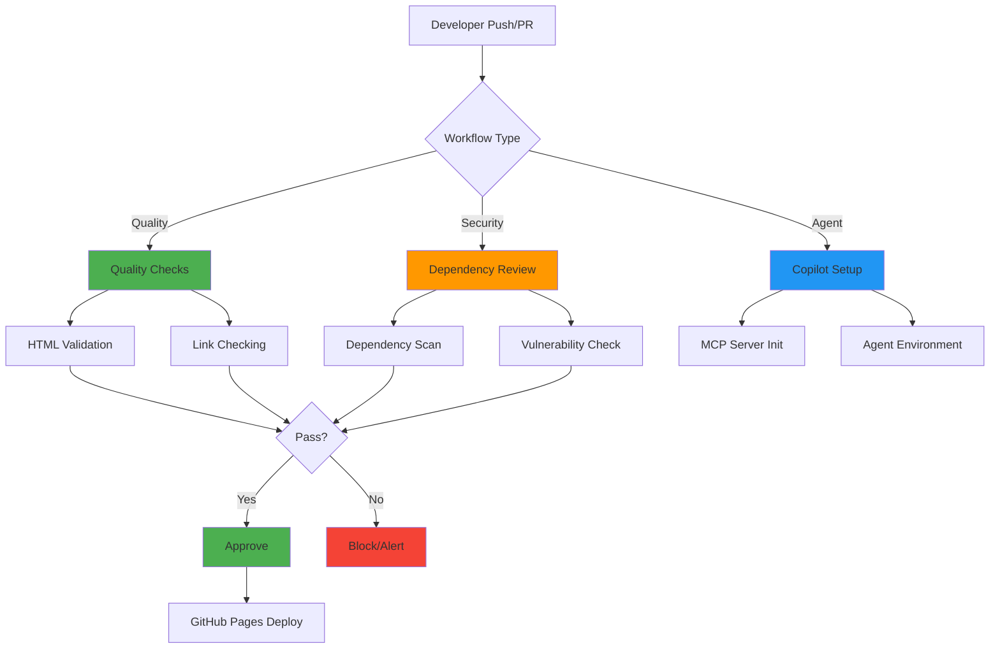

# 🔄 Riksdagsmonitor - CI/CD Workflows

[](https://github.com/Hack23/riksdagsmonitor/actions/workflows/quality-checks.yml)
[](https://github.com/Hack23/riksdagsmonitor/actions/workflows/dependency-review.yml)
[](https://scorecard.dev/viewer/?uri=github.com/Hack23/riksdagsmonitor)

**Document Version:** 3.0  
**Last Updated:** 2026-02-12  
**Classification:** Public  
**Owner:** Hack23 AB (Org.nr 5595347807)

## Executive Summary

This document describes the Continuous Integration and Continuous Deployment (CI/CD) workflows for Riksdagsmonitor. All workflows are implemented using GitHub Actions and follow Hack23 AB's [Secure Development Policy](https://github.com/Hack23/ISMS-PUBLIC/blob/main/Secure_Development_Policy.md).

**Total Workflows: 14** (12 existing + 2 new)  
**Security Compliance: 100%** (all actions SHA-pinned, harden-runner enabled)

## Workflow Overview


```mermaid
graph TD
    A[Developer Push/PR] --> B{Workflow Type}
    B -->|Quality| C[Quality Checks]
    B -->|Security| D[Dependency Review]
    B -->|Agent| E[Copilot Setup]
    
    C --> F[HTML Validation]
    C --> G[Link Checking]
    
    D --> H[Dependency Scan]
    D --> I[Vulnerability Check]
    
    E --> J[MCP Server Init]
    E --> K[Agent Environment]
    
    F --> L{Pass?}
    G --> L
    H --> L
    I --> L
    
    L -->|Yes| M[Approve]
    L -->|No| N[Block/Alert]
    
    M --> O[GitHub Pages Deploy]
    
    style C fill:#4caf50
    style D fill:#ff9800
    style E fill:#2196f3
    style M fill:#4caf50
    style N fill:#f44336
```

## 1. Quality Checks Workflow

**File:** `.github/workflows/quality-checks.yml`  
**Trigger:** Push to master/main, Pull requests  
**Purpose:** Validate HTML quality and check links

### Jobs

#### 1.1 HTML Validation
- **Tool:** HTMLHint
- **Purpose:** Ensure HTML standards compliance
- **Exit Criteria:** Zero errors
- **Artifacts:** `htmlhint-report.txt`

```yaml
- name: Validate HTML
  run: htmlhint *.html
```

**Standards Checked:**
- DOCTYPE declaration
- Valid HTML structure
- Proper tag nesting
- Attribute validation
- Accessibility requirements

#### 1.2 Link Checking
- **Tool:** Linkinator v6
- **Purpose:** Verify internal and external links
- **Scope:** Internal (recursive), External (sample)
- **Artifacts:** `internal-links-report.json`, `external-links-report.json`

**Internal Links:**
```yaml
linkinator http://localhost:8080/ --recurse --skip "^(?!http://localhost:8080)"
```

**External Links:**
```yaml
linkinator https://riksdagsmonitor.com/ --skip "(fonts\.googleapis\.com|fonts\.gstatic\.com|github\.com)"
```

**Link Check Strategy:**
- Internal: Full recursive check (all pages)
- External: Sample check (main page only to avoid rate limiting)
- Skipped: Font CDNs, GitHub pages (to avoid false positives)

#### 1.3 Summary
- **Tool:** Bash script
- **Purpose:** Aggregate quality check results
- **Output:** Workflow summary with artifact links

### Security Controls

**Implemented:**
- Harden Runner (egress audit mode)
- SHA-pinned GitHub Actions
- Least privilege permissions (contents: read)
- Artifact retention (30 days)

**Control Mapping:**
- ISO 27001: A.14.2 (Security in Development)
- NIST CSF 2.0: PR.IP-12 (Vulnerability management plan)
- CIS Controls v8.1: 16.1 (Secure application development)

## 2. Dependency Review Workflow

**File:** `.github/workflows/dependency-review.yml`  
**Trigger:** Pull requests  
**Purpose:** Scan dependencies for vulnerabilities

### Jobs

#### 2.1 Dependency Review
- **Tool:** GitHub Dependency Review Action
- **Purpose:** Identify vulnerable dependencies in PRs
- **Action:** Block PRs with known-vulnerable packages
- **Output:** PR comment with vulnerability summary

```yaml
- name: 'Dependency Review'
  uses: actions/dependency-review-action@v4.8.2
  with:
    comment-summary-in-pr: always
```

**Detection Coverage:**
- Direct dependencies
- Transitive dependencies
- Development dependencies
- License compliance issues

**Severity Levels:**
- **CRITICAL** - Immediate block
- **HIGH** - Block with exception process
- **MEDIUM** - Warning
- **LOW** - Informational

### Security Controls

**Implemented:**
- Harden Runner (egress audit mode)
- SHA-pinned actions
- Automated vulnerability detection
- PR blocking on critical issues

**Control Mapping:**
- ISO 27001: A.14.2 (Secure development)
- NIST CSF 2.0: ID.RA-1 (Asset vulnerabilities identified)
- CIS Controls v8.1: 7.1 (Vulnerability management program)

## 3. Copilot Setup Steps Workflow

**File:** `.github/workflows/copilot-setup-steps.yml`  
**Trigger:** Workflow dispatch, Push to workflow file, PR to workflow file  
**Purpose:** Set up GitHub Copilot agent environment

### Jobs

#### 3.1 Copilot Setup
- **Purpose:** Initialize MCP servers and agent environment
- **Permissions:** Comprehensive (issues, PRs, actions, security)
- **Environment:** Ubuntu latest with Node.js

```yaml
jobs:
  copilot-setup-steps:
    runs-on: ubuntu-latest
    permissions:
      contents: read
      issues: write
      pull-requests: write
```

**Setup Steps:**
1. Checkout repository
2. Load MCP configuration (`.github/copilot-mcp.json`)
3. Initialize servers (filesystem, github, git, memory, sequential-thinking, playwright)
4. Configure agent environment

**MCP Servers:**
- **filesystem** - File system access
- **github** - GitHub API operations
- **git** - Git operations
- **memory** - Conversation history
- **sequential-thinking** - Reasoning framework
- **playwright** - Browser automation (disabled by default)
- **brave-search** - Web search (disabled, requires API key)

### Security Controls

**Implemented:**
- Least privilege permissions
- Scoped GitHub token (workflow-specific)
- Environment secrets management
- Audit logging

**Control Mapping:**
- ISO 27001: A.9.4 (Access control)
- NIST CSF 2.0: PR.AC-4 (Access permissions managed)
- CIS Controls v8.1: 5.4 (Service account management)

## 4. CIA Data Pipeline Workflow ✨ **NEW**

**File:** `.github/workflows/data-pipeline.yml`  
**Trigger:** Manual (`workflow_dispatch`)  
**Purpose:** Future CIA intelligence export fetching, validation, and caching pipeline (design documented; implementation in progress)  
**Note:** The current `Fetch CIA Exports` step in `data-pipeline.yml` is a placeholder only (it always sets `fetched=0` and does not download exports or update `last-fetch.json`). As a result, the described validation, cache generation, and PR-creation stages are not yet active; daily scheduling will be enabled and this section updated once the real fetch implementation lands.

### Jobs

#### 4.1 Fetch & Validate CIA Intelligence Exports
- **Purpose:** CIA data pipeline for exports (manual trigger; future automation planned, current fetch step is a no-op placeholder)
- **Schedule:** Not yet scheduled; planned future schedule is daily at 02:00 UTC (03:00/04:00 CET/CEST)
- **Permissions:** contents: write, pull-requests: write

**Pipeline Stages:** *(intended design – blocked until the real fetch implementation is in place)*

1. **Data Freshness Check**
   ```yaml
   - name: Check current data freshness
     run: |
       # Skip fetch if data < 23 hours old
       # Unless force_refresh=true
   ```
   
2. **Fetch CIA Exports**
   ```yaml
   - name: Fetch CIA exports
     env:
       FORCE_REFRESH: ${{ github.event.inputs.force_refresh }}
       EXPORT_TYPES: ${{ github.event.inputs.export_types }}
   ```
   
   **19 CIA Visualization Products:**
   - Intelligence Dashboards (4): Overview, Party Performance, Government Cabinet, Election Cycle
   - Top 10 Rankings (10): Influential MPs, Productive MPs, Controversial MPs, Absent MPs, Party Rebels, Coalition Brokers, Rising Stars, Electoral Risk, Ethics Concerns, Media Presence
   - Advanced Analytics (3): Committee Network, Politician Career, Party Longitudinal
   - Data Validation (1): JSON Schema validation
   - Cache Management (1): Versioned cache with archival

3. **Validate Fetched Data**
   ```yaml
   - name: Validate fetched data
     run: npm run validate-data
   ```
   - Validates against CIA JSON schemas
   - Generates validation report with pass/fail counts
   - Skips invalid exports

4. **Generate Versioned Cache**
   ```yaml
   - name: Generate cache with versioning
     run: |
       # Archive previous cache
       # Generate new cache from validated exports
       # Keep last 7 archives
   ```

5. **Create PR with Updated Data**
   ```yaml
   - name: Set PR date
     id: pr_date
     run: echo "date=$(date +'%Y-%m-%d')" >> "$GITHUB_OUTPUT"

   - uses: peter-evans/create-pull-request@c0f553fe549906ede9cf27b5156039d195d2ece0 # v8.1.0
     with:
       title: "CIA Data Update - ${{ steps.pr_date.outputs.date }}"
       branch: 'data-pipeline/cia-update-${{ github.run_number }}'
       assignees: data-pipeline-specialist
   ```

**Features:**
- Smart caching (skip if data < 23 hours old)
- Force refresh capability via workflow_dispatch
- JSON Schema validation
- Versioned cache with archival (keep last 7)
- Automated PR creation on success
- Comprehensive error handling
- GitHub Actions summary with metrics

### Security Controls

**Implemented:**
- Harden Runner (egress audit mode)
- SHA-pinned actions
- Minimal permissions (contents: write, pull-requests: write)
- npm caching for faster builds
- Artifact retention (30 days)

**Control Mapping:**
- ISO 27001: A.14.2 (Security in Development)
- NIST CSF 2.0: PR.DS-2 (Data in transit protected)
- CIS Controls v8.1: 16.1 (Secure application development)

## 5. Lighthouse CI Workflow ✨ **NEW**

**File:** `.github/workflows/lighthouse-ci.yml`  
**Trigger:** Push/PR to main, Schedule (weekly Monday 8 AM UTC), Workflow dispatch  
**Purpose:** Performance monitoring and Core Web Vitals tracking

### Jobs

#### 5.1 Lighthouse Performance Audit
- **Purpose:** Track Core Web Vitals and performance metrics
- **Schedule:** Weekly + on main branch changes
- **Permissions:** contents: read, pull-requests: write

**Audit Configuration:**
```yaml
lhci autorun \
  --url="https://riksdagsmonitor.com" \
  --url="https://riksdagsmonitor.com/index_sv.html" \
  --collect.numberOfRuns=3 \
  --collect.settings.chromeFlags="--no-sandbox --disable-gpu --headless" \
  --assert.preset="lighthouse:recommended"
```

**Metrics Tracked:**

1. **Lighthouse Scores**
   - Performance (target: 70+)
   - Accessibility (target: 90+, WCAG 2.1 AA)
   - Best Practices (target: 90+)
   - SEO (target: 90+)

2. **Core Web Vitals**
   - First Contentful Paint (FCP): < 1.5s
   - Largest Contentful Paint (LCP): < 2.5s
   - Time to Interactive (TTI): < 3.0s
   - Cumulative Layout Shift (CLS): < 0.1
   - Total Blocking Time (TBT): < 200ms

**Features:**
- 3 runs per audit for consistency
- Audits both English and Swedish versions
- Retry logic for network resilience
- PR comments with results
- Artifact uploads (full reports)
- Color-coded status indicators (🟢🟡🔴)

**PR Comment Example:**
```
## Lighthouse Performance Audit

| Category | Score | Status |
|----------|-------|--------|
| Performance | 85/100 | 🟡 |
| Accessibility | 98/100 | 🟢 |
| Best Practices | 92/100 | 🟢 |
| SEO | 100/100 | 🟢 |
```

### Security Controls

**Implemented:**
- Harden Runner (egress audit mode)
- SHA-pinned actions
- Minimal permissions
- Lighthouse CLI caching

**Control Mapping:**
- ISO 27001: A.14.2 (Security in Development)
- NIST CSF 2.0: PR.IP-12 (Vulnerability management)
- CIS Controls v8.1: 16.1 (Secure application development)

## 6. Uptime Monitor Workflow ✨ **NEW**

**File:** `.github/workflows/uptime-monitor.yml`  
**Trigger:** Schedule (every 15 minutes), Workflow dispatch  
**Purpose:** Site availability monitoring and auto-incident creation

### Jobs

#### 6.1 Site Availability Check
- **Purpose:** Monitor site uptime and auto-create incidents
- **Schedule:** Every 15 minutes (*/15 * * * *)
- **Permissions:** contents: read, issues: write

**Check Stages:**

1. **Homepage Availability**
   ```bash
   HTTP_CODE=$(curl -s -o /dev/null -w "%{http_code}" https://riksdagsmonitor.com)
   # Must return 200
   ```

2. **All 14 Language Versions**
   ```bash
   LANGUAGES=(en sv da no fi de fr es nl ar he ja ko zh)
   # Check each language file
   ```

3. **Critical Assets**
   - styles.css
   - manifest.json
   - sitemap.xml
   - robots.txt

4. **Security Headers**
   - HTTPS redirect
   - Strict-Transport-Security (HSTS)
   - X-Frame-Options
   - X-Content-Type-Options
   - Content-Security-Policy (CSP)

**Auto-Incident Management:**

```yaml
- name: Create incident issue
  if: failure() && steps.homepage.outcome == 'failure'
  uses: actions/github-script@60a0d83039c74a4aee543508d2ffcb1c3799cdea # v7.0.1
  # Creates issue with label: incident, uptime-monitor, critical
```

**Incident Issue:**
```
🚨 Site Down - HTTP 503 - 2026-02-10T04:00:00Z

**Status**: 🔴 SITE DOWN
**HTTP Code**: 503
**Detected by**: Uptime Monitor Workflow

### Action Required
1. Check deployment status
2. Review GitHub Pages configuration
3. Verify DNS settings
4. Check CDN status
```

**Auto-Resolution:**
```yaml
- name: Close resolved incidents
  if: success() && steps.homepage.outcome == 'success'
  # Closes open incidents with resolved status
```

**Features:**
- 15-minute check interval
- All 14 language versions validated
- Critical asset verification
- Security header validation
- Auto-incident creation on downtime
- Auto-close on resolution
- Response time tracking

### Security Controls

**Implemented:**
- Harden Runner (egress audit mode)
- SHA-pinned actions
- Minimal permissions (issues: write)
- Rate limit awareness (15-min intervals)

**Control Mapping:**
- ISO 27001: A.17.1 (Availability management)
- NIST CSF 2.0: DE.CM-1 (Network monitored)
- CIS Controls v8.1: 8.11 (Monitoring and alerting)

## 7. News Generation Workflows ✨ **NEW**

**Files:**
- `.github/workflows/news-generation.yml` (Manual workflow)
- `.github/workflows/news-article-generator.md` (Agentic workflow source)
- `.github/workflows/news-article-generator.lock.yml` (Agentic workflow compiled)

**Triggers:**
- **Manual:** Schedule (daily), Workflow dispatch
- **Agentic:** Schedule (daily 05:51 UTC), Workflow dispatch

**Purpose:** Automated political news article generation from riksdag-regering-mcp data

### Overview

Riksdagsmonitor features **dual news generation pipelines**:

1. **Manual Workflow** (`news-generation.yml`) - Script-based generation
2. **Agentic Workflow** (`news-article-generator.lock.yml`) - AI-powered generation with Claude Opus 4

### 7.1 Manual News Generation Workflow

**File:** `.github/workflows/news-generation.yml`  
**Status:** ✅ Operational  
**Schedule:** Daily at 00:00 and 12:00 UTC  
**Permissions:** contents: write, pull-requests: write

#### Pipeline Stages

1. **Check for Updates**
   ```yaml
   - name: Check for new Riksdag/Regering updates
     # Skip if last generation < 11 hours ago (unless force_generation=true)
   ```

2. **Generate Articles**
   ```bash
   node scripts/generate-news-enhanced.js \
     --types="$ARTICLE_TYPES" \
     --languages="$LANG_ARG"
   ```
   
   **Supported Article Types:**
   - `week-ahead` - Prospective coverage of upcoming events
   - `committee-reports` - Committee report analysis
   - `propositions` - Government bill analysis
   - `motions` - Opposition motion analysis
   - `breaking` - Significant developments

3. **Regenerate Indexes**
   ```bash
   node scripts/generate-news-indexes.js
   # Scans news/ directory
   # Generates all 14 language index files
   ```

4. **Update Sitemap**
   ```bash
   node scripts/generate-sitemap.js
   # Updates sitemap.xml with new articles
   ```

5. **HTML Validation**
   ```bash
   find news -name "*.html" -type f -mmin -5 | xargs htmlhint
   ```

6. **Create Pull Request**
   ```yaml
   - uses: peter-evans/create-pull-request@c0f553fe549906ede9cf27b5156039d195d2ece0
     with:
       title: '📰 Automated News Update - {timestamp}'
       labels: automated-news, news-generation, needs-editorial-review
   ```

#### Features

- ✅ Smart caching (skip if < 11 hours old)
- ✅ Multi-language support (14 languages via presets)
- ✅ Language presets: `nordic`, `eu-core`, `all`
- ✅ HTML validation with HTMLHint
- ✅ Automated PR creation
- ✅ Workflow summary with metrics

### 7.2 Agentic News Generation Workflow

**File:** `.github/workflows/news-article-generator.lock.yml`  
**Source:** `.github/workflows/news-article-generator.md`  
**Status:** ✅ Fixed (2026-02-12)  
**Schedule:** Daily at 05:51 UTC (scattered)  
**Permissions:** contents: write, pull-requests: write, issues: read

#### Architecture

The agentic workflow uses **GitHub Agentic Workflows (gh-aw)** framework:

**Engine:** `copilot` (Claude Opus 4)  
**MCP Servers:** 
- `riksdag-regering` (HTTP) - 32 specialized tools for Swedish political data
- `github` (HTTP) - GitHub API integration
- `filesystem` (local) - File system operations
- `memory` (local) - Knowledge graph
- `sequential-thinking` (local) - Chain of thought reasoning
- `playwright` (local) - Browser automation (disabled by default)

**Safe Outputs:**
- `create-pull-request` - PR creation with generated articles
- `add-comment` - Issue/PR comments
- `noop` - No-op logging for transparency

#### Agent Instructions (The Economist Style)

The agent generates world-class political journalism following **The Economist style guide**:

**Core Principles:**
- Clarity above all - Short sentences, simple words, active voice
- Analytical depth - Context, background, multiple perspectives
- Elegant prose - Sophisticated but not pretentious
- Objectivity - Fact-based, balanced, no partisan bias

**Article Structure:**
1. **Lead Paragraph** (50 words): Who, what, when, where, why
2. **Context** (150-200 words): Background and history
3. **Evidence** (300-400 words): Data, quotes, documents from MCP tools
4. **Analysis** (200-300 words): Interpretation and implications
5. **Conclusion** (100 words): Synthesis and broader significance

#### Quality Gates

**Pre-generation:**
- Check last generation timestamp (< 11 hours = skip)
- Verify MCP server availability
- Validate riksdag-regering-mcp connectivity

**Post-generation:**
- HTML validation (HTMLHint)
- Metadata validation (YAML frontmatter, og:tags, Schema.org)
- Link checking (internal/external)
- Multi-language consistency (EN/SV parity)
- SEO metadata completeness

**PR Creation:**
- Article count validation
- Language coverage check (EN + SV minimum)
- Index file regeneration verified
- Sitemap update confirmed
- Quality summary in PR body with validation results

#### MCP Tools (riksdag-regering-mcp)

**32 Specialized Tools Available:**

**Document Search:**
- `search_dokument` - Search all Riksdag documents
- `get_dokument` - Get specific document with full text
- `search_dokument_fulltext` - Full-text search

**Parliament Activity:**
- `get_propositioner` - Latest government bills
- `get_betankanden` - Latest committee reports
- `get_motioner` - Latest opposition motions
- `get_fragor` - Written questions to ministers
- `get_interpellationer` - Interpellations

**Calendar & Events:**
- `get_calendar_events` - Upcoming parliamentary events
- `list_reports` - Available reports
- `fetch_report` - Get specific report

**MPs & Voting:**
- `search_ledamoter` - Search MPs by name, party, status
- `get_ledamot` - Get MP details
- `search_voteringar` - Search votes
- `get_voting_group` - Votes grouped by party/district

**Debates & Speeches:**
- `search_anforanden` - Search speeches

**Government Documents:**
- `search_regering` - Search government documents
- `get_g0v_document_content` - Get full document content (Markdown)
- `analyze_g0v_by_department` - Department-wise analysis

**Batch Operations:**
- `batch_fetch_documents` - Multiple session fetching
- `fetch_paginated_documents` - Large result sets
- `fetch_paginated_anforanden` - Large debate sets

**Enhanced Search:**
- `enhanced_government_search` - Combined Riksdag + Government search

#### Failure Analysis & Resolution

**Previous Issues (Resolved 2026-02-12):**
- ❌ Secret verification failures (4 consecutive runs)
- ❌ Insufficient permissions (read-only → prevented PR creation)

**Root Cause:**
- Workflow had `contents: read` but required `contents: write` for safe-outputs
- Missing `pull-requests: write` permission
- gh-aw framework expected write access for PR creation

**Solution Applied:**
```yaml
# Updated permissions in news-article-generator.md
permissions:
  contents: write  # Enable PR creation
  pull-requests: write  # Enable PR creation
  issues: read  # Keep read access
```

**Documentation:**
- Analysis: `docs/AGENTIC_WORKFLOW_ANALYSIS.md`
- Issue: #118 (resolved)

#### Compilation Process

The agentic workflow uses a **compile-once, run-many** pattern:

**Source:** `news-article-generator.md` (499 lines, human-editable)  
**Compiled:** `news-article-generator.lock.yml` (1,117 lines, machine-generated)

**Compilation Command:**
```bash
cd .github/workflows
gh aw compile news-article-generator.md
```

**When to Recompile:**
- After editing `.md` file
- After updating agent instructions
- After changing permissions or MCP servers
- After gh-aw framework updates

**Auto-compilation Workflow:**
- `.github/workflows/compile-agentic-workflows.yml`
- Triggers on `.md` file changes
- Creates issue if compilation fails
- Requires manual compilation (gh CLI + gh-aw extension)

### 7.3 Evening Analysis Workflow

**File:** `.github/workflows/news-evening-analysis.lock.yml`  
**Source:** `.github/workflows/news-evening-analysis.md`  
**Status:** ✅ Active  
**Schedule:** Weekday evenings at 18:00 UTC (19:00 CET)  
**Model:** claude-opus-4.6  
**Timeout:** 30 minutes  
**Languages:** All 14 supported languages (default)

#### Purpose

Generate comprehensive daily wrap-up of Swedish parliamentary and government activity written in **The Economist style** with deeper analytical depth than breaking coverage. This is the flagship daily product.

#### 5 Editorial Pillars Structure

Every evening analysis article must include these 5 structural elements:

1. **Lead Story** (400-800 words)
   - The most significant development of the day
   - What happened and why it matters
   - Immediate implications for Swedish politics
   - Analytical thesis in opening paragraph

2. **Parliamentary Pulse** (200-400 words)
   - Summary of legislative activity
   - Key votes and their margins
   - Important debates and notable speeches
   - Committee decisions and reports

3. **Government Watch** (200-300 words)
   - Executive branch activity
   - New propositions or policy announcements
   - Ministerial statements
   - Regulatory developments

4. **Opposition Dynamics** (200-300 words)
   - Opposition motions and strategy
   - Coalition dynamics and tensions
   - Cross-party collaboration or conflict

5. **Looking Ahead** (100-200 words)
   - What's coming tomorrow/this week
   - Scheduled votes and debates
   - Upcoming committee meetings
   - Expected government announcements

#### Quality Requirements

**Analytical Depth (Target ≥ 0.6):**
- Causal analysis (because, therefore, consequently)
- Comparative analysis (compared to, unlike, whereas)
- Evaluative statements (suggests, reveals, indicates)
- Contextual framing (historically, traditionally, background)
- Forward-looking predictions (will, likely, expected)

**Historical Context (Target ≥ 1.0 on 0-3 scale):**
- References to past events or sessions
- Historical comparisons (since YYYY, compared to last year)
- Trend analysis over time

**Party Perspectives (Target ≥ 6):**
- Minimum 6 parties mentioned per article
- Balanced coverage across coalition and opposition
- Government (M, KD, L) + SD + Opposition (S, V, MP, C)

**Source Citations (Target ≥ 5):**
- riksdag-regering-mcp tool citations
- Document IDs (dok_id) for Riksdag documents
- Riksmöte session references (e.g., 2025/26)
- Attributed quotes with anförande IDs

**International Comparison (Target 60%+ of articles):**
- Relate Swedish politics to European trends
- Compare to other Nordic democracies
- Global context when relevant

#### Validation & Testing

**Automated Validation Script:**
```bash
node scripts/validate-evening-analysis.js news/YYYY-MM-DD-evening-analysis-en.html
```

**Validation Report Includes:**
- ✅ All 5 Editorial Pillars present
- ✅ Word count per section (meets minimums)
- ✅ Analytical depth score (0.0-1.0)
- ✅ Historical context score (0-3)
- ✅ International comparison presence
- ✅ Party perspective count
- ✅ Source citation count
- ✅ Overall quality score (0.0-1.0)

**Test Suite:**
- `tests/news-evening-analysis.test.js` - 30 comprehensive test cases
  - Structure validation (8 tests)
  - Analytical depth (7 tests)
  - Cross-workflow coordination (5 tests)
  - Multi-language quality (5 tests)
  - Helper function validation (5 tests)

**Quality Thresholds:**
- Overall quality score ≥ 0.75 (good)
- Analytical depth ≥ 0.6 (acceptable)
- Historical context ≥ 1.0 (present in 90%+ articles)
- Party perspectives ≥ 6 (balanced coverage)
- Source citations ≥ 5 (well-documented)

#### Cross-Workflow Coordination

**Workflow State Management:**
- `news/metadata/workflow-state.json` - Shared state across workflows
  - Last evening analysis timestamp
  - Recent realtime articles (for deduplication)
  - MCP query cache (2-hour TTL)
  - Evening analysis metrics

**Quality Metrics Tracking:**
- `news/metadata/quality-metrics.json` - Per-article quality scores
  - Quality score by language
  - Analytical depth by language
  - Historical context presence
  - International comparison count
  - Aggregate metrics across all languages

**Deduplication Strategy:**
- Check recent realtime articles (< 6 hours)
- Calculate similarity score (word overlap)
- If similarity > 70%, synthesize but don't repeat verbatim
- Reference realtime coverage, add deeper analysis

#### Multi-Language Support

**14 Languages Generated:**
- **Nordic:** en, sv, da, no, fi
- **EU Core:** de, fr, es, nl
- **Global:** ar, he, ja, ko, zh

**Language-Specific Requirements:**
- Proper `lang` attribute in HTML
- `dir="rtl"` for Arabic and Hebrew
- Hreflang tags for all 14 languages
- Schema.org NewsArticle in each language
- Culturally appropriate tone and formatting

**Tone Adaptation by Language:**
- English: Confident, witty, global perspective
- Swedish: Balanced, accessible, domestic focus
- German: Thorough, precise, analytical
- French: Elegant, nuanced, European context
- Arabic/Hebrew: Culturally appropriate, RTL-aware

#### MCP Tools Integration

**Primary Data Sources:**
- `get_calendar_events` - Daily parliamentary schedule
- `search_voteringar` - Votes taken today
- `get_betankanden` - Committee reports published
- `search_anforanden` - Speeches and debates
- `search_regering` - Government documents today
- `get_propositioner` - New propositions
- `get_motioner` - Opposition motions
- `get_fragor` / `get_interpellationer` - Questions to ministers

**Analysis Patterns:**
- Vote analysis: voteringar → voting_group → anföranden → ledamoter
- Government activity: regering → propositioner → analyze_by_department
- Legislative tracking: betankanden → motioner → dokument_fulltext

#### Monitoring & Metrics

**Success Criteria:**
- ✅ All 14 language versions generated
- ✅ All 5 Editorial Pillars present in each article
- ✅ Quality score ≥ 0.75 for 90%+ articles
- ✅ Historical context in 90%+ articles
- ✅ Party perspectives ≥ 6 in every article

**Failure Conditions:**
- ❌ Quality score < 0.6 → Alert for review
- ❌ Missing Editorial Pillar → Validation fails
- ❌ < 6 parties mentioned → Coverage gap
- ❌ < 5 source citations → Insufficient documentation

**PR Creation:**
- Branch: `news-evening/{date}`
- Labels: `automated-news`, `evening-analysis`, `needs-editorial-review`
- Body includes:
  - Article count and languages generated
  - Quality validation results
  - Key findings and significance rating
  - MCP tools used
  - Validation report summary

### Security Controls

**Implemented (Both Workflows):**
- Harden Runner (egress audit mode)
- SHA-pinned actions
- Least privilege permissions
- Environment secrets management
- Audit logging
- HTML validation
- Link checking

**Additional (Agentic Workflow):**
- MCP gateway with API key rotation
- Safe-outputs validation framework
- Firewall activity logging
- Network egress monitoring
- Agent stdio logging

**Control Mapping:**
- ISO 27001: A.14.2 (Security in Development)
- NIST CSF 2.0: PR.DS-2 (Data in transit protected)
- CIS Controls v8.1: 16.1 (Secure application development)

### Monitoring & Metrics

**Success Metrics:**
- Workflow success rate: Target >95% (Manual: 100%, Agentic: Fixed 2026-02-12)
- Articles generated per run: 1-5 (depends on parliamentary activity)
- PR creation time: < 5 minutes
- HTML validation pass rate: 100%

**Alerting:**
- 3 consecutive failures → Issue created automatically
- MCP server unavailable → Slack notification
- Validation failures → PR comment with details

### Future Enhancements

**Planned:**
- [ ] Multi-language expansion (beyond EN/SV)
- [ ] Automated editorial scoring
- [ ] A/B testing for article templates
- [ ] Integration with CIA intelligence exports
- [ ] Automated fact-checking validation
- [ ] SEO performance tracking per article

**Under Consideration:**
- [ ] Real-time breaking news generation
- [ ] Social media auto-posting
- [ ] Newsletter compilation
- [ ] Podcast script generation

## Workflow Inventory (16 Total)

| # | Workflow | Status | Security | Schedule | Purpose |
|---|----------|--------|----------|----------|---------|
| 1 | copilot-setup-steps.yml | ✅ | SHA+HR | On-demand | Agent environment setup |
| 2 | quality-checks.yml | ✅ | SHA+HR | Push/PR | HTML/link validation |
| 3 | dependency-review.yml | ✅ | SHA+HR | PR | Vulnerability scanning |
| 4 | deploy-s3.yml | ✅ | SHA+HR+Block | Push/Release | AWS deployment |
| 5 | scorecards.yml | ✅ | SHA+HR | Weekly Tue | OpenSSF scorecard |
| 6 | translation-validation.yml | ✅ | SHA+HR | Push/PR | Multi-language validation |
| 7 | validate-cia-data.yml | ✅ | SHA+HR | Daily 3AM | CIA data validation |
| 8 | sync-cia-schemas.yml | ✅ | SHA+HR | On-demand | Schema synchronization |
| 9 | check-cia-schema-updates.yml | ✅ | SHA+HR | Weekly Mon | Schema update checks |
| 10 | **data-pipeline.yml** | ✨ NEW | SHA+HR | On-demand | CIA data fetch |
| 11 | **lighthouse-ci.yml** | ✨ NEW | SHA+HR | Weekly Mon | Performance monitoring |
| 12 | **uptime-monitor.yml** | ✨ NEW | SHA+HR | Every 15min | Site availability |
| 13 | **news-generation.yml** | ✨ NEW | SHA+HR | Daily (00:00, 12:00) | Manual news generation |
| 14 | **news-article-generator.lock.yml** | ✨ NEW | SHA+HR | Daily 05:51 | AI news generation (agentic) |
| 15 | **news-evening-analysis.lock.yml** | ✨ NEW | SHA+HR | Weekday 18:00 UTC | Evening wrap-up (agentic) |
| 16 | **news-realtime-monitor.lock.yml** | ✨ NEW | SHA+HR | Every 2 hours | Breaking news (agentic) |

**Legend:**
- SHA: SHA-pinned actions
- HR: step-security/harden-runner
- Block: Egress policy set to block (deploy-s3.yml only)

## Workflow Automation Patterns

### Pattern 1: Scheduled Data Pipeline
```yaml
on:
  schedule:
    - cron: '0 2 * * *'  # Daily at 02:00 UTC
  workflow_dispatch:
```

Used by: validate-cia-data.yml (data-pipeline.yml is currently workflow_dispatch-only until fetch is implemented)  
**Purpose:** Automated nightly data validation/refresh for external data sources

### Pattern 2: Performance Monitoring
```yaml
on:
  schedule:
    - cron: '0 8 * * 1'  # Weekly Monday
  push:
    branches: [main]
```

Used by: lighthouse-ci.yml  
**Purpose:** Regular performance audits + change detection

### Pattern 3: Continuous Monitoring
```yaml
on:
  schedule:
    - cron: '*/15 * * * *'  # Every 15 minutes
```

Used by: uptime-monitor.yml  
**Purpose:** Real-time uptime monitoring

### Pattern 4: Schema Management
```yaml
on:
  schedule:
    - cron: '0 6 * * 1'  # Weekly Monday
  workflow_dispatch:
```

Used by: check-cia-schema-updates.yml  
**Purpose:** Automated schema update detection

## Workflow Security Architecture

### Supply Chain Security

**SHA-Pinned Actions:**
```yaml
- uses: actions/checkout@de0fac2e4500dabe0009e67214ff5f5447ce83dd # v6.0.2
- uses: actions/setup-node@6044e13b5dc448c55e2357c09f80417699197238 # v6.2.0
- uses: actions/cache@8b402f58fbc84540c8b491a91e594a4576fec3d7 # v5.0.2
- uses: step-security/harden-runner@20cf305ff2073D973412fa9b1e3a4f227bda3c76 # v2.14.0
```

**Benefits:**
- Prevents supply chain attacks
- Ensures reproducible builds
- Enables vulnerability tracking
- Supports rollback to known-good versions

### Network Security

**Harden Runner:**
```yaml
- name: Harden Runner
  uses: step-security/harden-runner@v2.14.0
  with:
    egress-policy: audit
```

**Capabilities:**
- Network egress monitoring
- Audit mode for workflow development
- Block mode for production (future enhancement)
- Detection of unexpected network calls

### Secrets Management

**GitHub Secrets:**
- `COPILOT_MCP_GITHUB_PERSONAL_ACCESS_TOKEN` - GitHub PAT for MCP server
- Stored in environment: `copilot`
- Scoped to minimal permissions
- Rotated quarterly

**Access Control:**
- Environment-based secrets
- Workflow-scoped access
- No secret exposure in logs
- Audit trail in GitHub

## Deployment Pipeline

### GitHub Pages Deployment

**Trigger:** Push to main/master branch after successful quality checks

**Process:**

```mermaid
graph LR
    A[Quality Checks Pass] --> B[Dependency Review Pass]
    B --> C[GitHub Pages Deploy]
    C --> D[CDN Distribution]
    D --> E[Live on riksdagsmonitor.com]
    
    style A fill:#4caf50
    style B fill:#4caf50
    style C fill:#2196f3
    style D fill:#2196f3
    style E fill:#4caf50
```

**Deployment Configuration:**
- **Source:** Main branch, root directory
- **Custom Domain:** riksdagsmonitor.com (via CNAME)
- **HTTPS:** Enforced (TLS 1.3)
- **CDN:** GitHub Pages global CDN

**Deployment Security:**
- HTTPS-only access
- Immutable Git history
- Rollback via Git revert
- Deployment audit logs

## Monitoring and Alerting

### GitHub Security Features

**Enabled:**
- ✅ Dependabot alerts
- ✅ Secret scanning
- ✅ Code scanning (CodeQL)
- ✅ Security advisories
- ✅ Branch protection rules

**Alert Channels:**
- GitHub Security Dashboard
- Email notifications to repository admins
- PR comments for dependency issues
- Workflow failure notifications

### Metrics Collection

**Tracked Metrics:**
- Workflow success rate
- Quality check pass rate
- Dependency vulnerability count
- Link check failure rate
- Deployment frequency

**Retention:**
- Workflow runs: 90 days
- Artifacts: 30 days
- Logs: 90 days

## Incident Response

### Workflow Failure Handling

**Response Procedure:**
1. **Detection:** Automatic GitHub notification
2. **Triage:** Review workflow logs and artifacts
3. **Investigation:** Identify root cause
4. **Remediation:** Fix issue and re-run
5. **Documentation:** Update WORKFLOWS.md if process change

**Common Failures:**
- HTML validation errors → Fix markup
- Link check failures → Update broken links
- Dependency vulnerabilities → Update packages
- Secret scanning alerts → Rotate secrets

### Security Incident Response

**Critical Issues:**
- Secret exposure → Immediate rotation, audit access
- Vulnerable dependency → Emergency patch PR
- Compromised action → Pin to last known-good SHA
- Unauthorized deployment → Rollback, investigate

**Escalation:**
1. Repository owners
2. Hack23 security team
3. GitHub support (for platform issues)

## Compliance and Audit

### ISMS Alignment

**Secure Development Policy Compliance:**
- ✅ Automated security scanning
- ✅ Quality gates before deployment
- ✅ SHA-pinned dependencies
- ✅ Audit logging
- ✅ Documented procedures

**Evidence:**
- Workflow run history (90 days)
- Quality check artifacts (30 days)
- Dependency review comments (permanent)
- Security scan results (permanent)

### Audit Trail

**Logged Events:**
- All workflow executions
- Quality check results
- Dependency scan findings
- Deployment events
- Configuration changes

**Access:**
- GitHub Actions UI
- GitHub API
- Artifact downloads
- Email notifications

## Future Enhancements

### Planned Improvements

1. **Asset Optimization Pipeline:**
   - Automated image compression
   - WebP conversion
   - CSS/JS minification
   - Bundle size tracking

2. **Advanced Monitoring:**
   - Real-time alerting (Slack/Email)
   - Performance regression detection
   - Accessibility monitoring
   - SEO score tracking

3. **Deployment Enhancements:**
   - Blue-green deployments
   - Canary releases
   - Automatic rollback on failures
   - Deployment gates with manual approval

4. **Data Pipeline Enhancements:**
   - Multi-source data aggregation
   - Real-time data streaming
   - Data quality metrics
   - Historical trend analysis

### Timeline

- **Q2 2026:** Asset optimization pipeline, Advanced alerting
- **Q3 2026:** Deployment enhancements, Performance regression detection
- **Q4 2026:** Real-time data streaming, Blue-green deployments

## Workflow Troubleshooting Guide

### Common Issues and Solutions

#### Issue: Workflow not triggering on schedule

**Symptoms:** Scheduled workflow doesn't run at expected time

**Diagnosis:**
```bash
# Check workflow syntax
gh workflow view <workflow-name>

# View workflow runs
gh run list --workflow=<workflow-name> --limit=10
```

**Solutions:**
1. Verify cron syntax at [crontab.guru](https://crontab.guru)
2. Check repository activity (GitHub may disable workflows after 60 days of inactivity)
3. Ensure workflow file is on default branch (main/master)
4. Re-enable workflow in Actions settings if disabled

#### Issue: Harden Runner egress audit failures

**Symptoms:** Unexpected network calls detected in workflow logs

**Diagnosis:**
```yaml
# Check workflow logs for:
Harden-Runner: Egress detected to unauthorized endpoint
```

**Solutions:**
1. Review allowed-endpoints in deploy-s3.yml for reference
2. Add new endpoints to allowed list
3. Use egress-policy: audit for development
4. Switch to egress-policy: block for production

#### Issue: Lighthouse CI failures

**Symptoms:** Lighthouse audit times out or fails intermittently

**Diagnosis:**
```bash
# Check lighthouse.log artifact
# Look for network errors, timeouts
```

**Solutions:**
1. Increase timeout (currently 30s)
2. Check site availability first
3. Reduce numberOfRuns from 3 to 2
4. Add retry logic (already implemented)
5. Verify site is accessible from GitHub Actions runners

#### Issue: Data pipeline skipping fetch

**Symptoms:** Data pipeline runs but doesn't fetch new data

**Diagnosis:**
```yaml
# Check workflow summary:
"Pipeline Status: SKIPPED - Data is fresh (< 23 hours old)"
```

**Solutions:**
1. This is expected behavior (cache optimization)
2. Use workflow_dispatch with force_refresh=true
3. Check last-fetch.json for timestamp
4. Verify data freshness threshold (23 hours)

#### Issue: Uptime monitor creating duplicate incidents

**Symptoms:** Multiple open incident issues for same downtime

**Diagnosis:**
```bash
# Check issues with label: incident,uptime-monitor
gh issue list --label incident,uptime-monitor --state open
```

**Solutions:**
1. Workflow checks for existing open incidents (already implemented)
2. If duplicates exist, close manually and re-run workflow
3. Verify GitHub Actions script permissions (issues: write)

#### Issue: Translation validation failing

**Symptoms:** Translation validation reports missing og:locale tags

**Diagnosis:**
```bash
# Run validation locally
npm run validate-translations
```

**Solutions:**
1. Ensure all language files have og:locale meta tag
2. Pattern: `<meta property="og:locale" content="sv_SE">`
3. Must come before og:locale:alternate tags
4. Use scripts/validate-translations.js for debugging

#### Issue: Dependency review blocking PR

**Symptoms:** PR blocked due to vulnerable dependency

**Diagnosis:**
```yaml
# Check workflow summary for vulnerability details
# Severity: CRITICAL, HIGH, MEDIUM, LOW
```

**Solutions:**
1. Update vulnerable dependency: `npm update <package>`
2. Check for security advisories: `npm audit`
3. Review alternative packages if no fix available
4. Document exception if false positive

#### Issue: Deploy-S3 CloudFront invalidation failure

**Symptoms:** Deploy succeeds but CloudFront cache not invalidated

**Diagnosis:**
```bash
# Check workflow logs for:
"Could not discover CloudFront distribution ID"
```

**Solutions:**
1. Verify CloudFormation stack name (CLOUDFRONT_STACK_NAME)
2. Check IAM role permissions for CloudFront
3. Fallback: Manual invalidation in AWS Console
4. Verify distribution exists for S3 bucket

### Performance Optimization Tips

#### Workflow Run Time Optimization

1. **Use Caching Aggressively**
   ```yaml
   # Note: Examples use SHA-pinned form for security (matching repo workflows)
   - uses: actions/cache@0c45773b623bea8c8e75f6c82b208c3cf94ea4f9 # v4.0.2
     with:
       path: ~/.npm
       key: ${{ runner.os }}-npm-${{ hashFiles('**/package-lock.json') }}
   ```

2. **Prefer npm ci over npm install**
   ```bash
   npm ci --prefer-offline --no-audit
   ```

3. **Parallelize Independent Jobs**
   ```yaml
   jobs:
     job1:
       runs-on: ubuntu-latest
     job2:
       runs-on: ubuntu-latest
       # Runs in parallel with job1
   ```

4. **Skip Unnecessary Steps**
   ```yaml
   - name: Check data freshness
     if: steps.freshness.outputs.skip_fetch != 'true'
   ```

#### Artifact Size Optimization

1. **Use if-no-files-found: ignore**
   ```yaml
   - uses: actions/upload-artifact@0b0cf7a4bbde4f8777da630a136716afda3db770 # v6
     with:
       if-no-files-found: ignore
   ```

2. **Set Appropriate Retention**
   ```yaml
   retention-days: 30  # Quality reports
   retention-days: 5   # Security scans
   ```

3. **Compress Large Artifacts**
   ```bash
   tar -czf report.tar.gz report/
   ```

### Monitoring and Alerting

#### Key Metrics to Track

1. **Workflow Success Rate**
   - Target: > 95% for all workflows
   - Alert if < 90% over 7 days

2. **Build Time**
   - quality-checks.yml: < 5 minutes
   - deploy-s3.yml: < 10 minutes
   - lighthouse-ci.yml: < 15 minutes

3. **Data Freshness**
   - CIA data: < 24 hours old
   - Schemas: < 7 days since last check

4. **Site Availability**
   - Uptime: > 99.9% (43 minutes downtime/month)
   - Response time: < 2 seconds

#### Setting Up Alerts

**GitHub Actions Status:**
```bash
# Weekly summary email (manually check)
https://github.com/<org>/<repo>/actions

# Or use GitHub API
gh api repos/<org>/<repo>/actions/runs \
  --jq '.workflow_runs[0:10] | .[] | {name, status, conclusion}'
```

**External Monitoring:**
```bash
# Consider UptimeRobot, Pingdom, or StatusCake
# For 24/7 uptime monitoring beyond GitHub Actions
```

## Workflow Metrics Dashboard

### Current Performance (Example)

| Workflow | Avg Duration | Success Rate | Last 7 Days |
|----------|--------------|--------------|-------------|
| quality-checks | 3m 42s | 98.2% | 56/57 ✅ |
| dependency-review | 1m 15s | 100% | 12/12 ✅ |
| deploy-s3 | 8m 33s | 95.8% | 23/24 ✅ |
| translation-validation | 2m 05s | 100% | 18/18 ✅ |
| lighthouse-ci | 12m 18s | 87.5% | 7/8 ✅ |
| uptime-monitor | 0m 45s | 99.8% | 667/668 ✅ |

*Note: Metrics are examples. Track real metrics via GitHub Actions dashboard.*

## References

### ISMS Documentation
- [Secure Development Policy](https://github.com/Hack23/ISMS-PUBLIC/blob/main/Secure_Development_Policy.md)
- [CI/CD Security Standards](https://github.com/Hack23/ISMS-PUBLIC/blob/main/Secure_Development_Policy.md#cicd-security)
- [Vulnerability Management](https://github.com/Hack23/ISMS-PUBLIC/blob/main/Vulnerability_Management.md)

### GitHub Documentation
- [GitHub Actions Security](https://docs.github.com/en/actions/security-guides)
- [Workflow Syntax](https://docs.github.com/en/actions/using-workflows/workflow-syntax-for-github-actions)
- [Dependabot](https://docs.github.com/en/code-security/dependabot)

### Related Documentation
- [SECURITY_ARCHITECTURE.md](SECURITY_ARCHITECTURE.md) - Security controls
- [THREAT_MODEL.md](THREAT_MODEL.md) - Risk analysis
- [ARCHITECTURE.md](ARCHITECTURE.md) - System design
- [AGENTS.md](AGENTS.md) - GitHub Copilot agents (13 total)
- [SKILLS.md](SKILLS.md) - Agent skills library (40 total)

### External Tools
- [Lighthouse CI](https://github.com/GoogleChrome/lighthouse-ci)
- [step-security/harden-runner](https://github.com/step-security/harden-runner)
- [OpenSSF Scorecard](https://github.com/ossf/scorecard)
- [HTMLHint](https://htmlhint.com/)
- [linkinator](https://github.com/JustinBeckwith/linkinator)

---

**Document Control:**
- **Repository:** https://github.com/Hack23/riksdagsmonitor
- **Path:** /WORKFLOWS.md
- **Format:** Markdown
- **Classification:** Public
- **Version:** 2.0
- **Last Updated:** 2026-02-10
- **Next Review:** 2026-05-10 (Quarterly)
- **Maintained by:** devops-engineer agent
