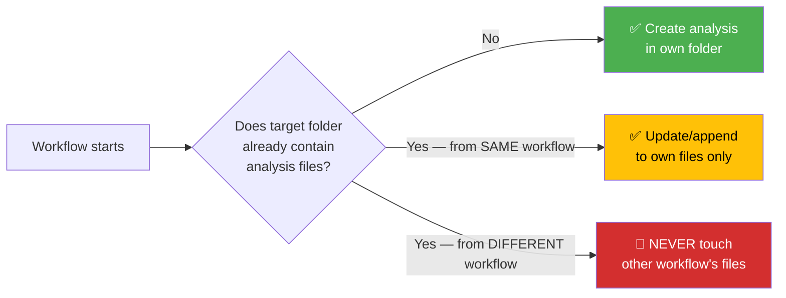
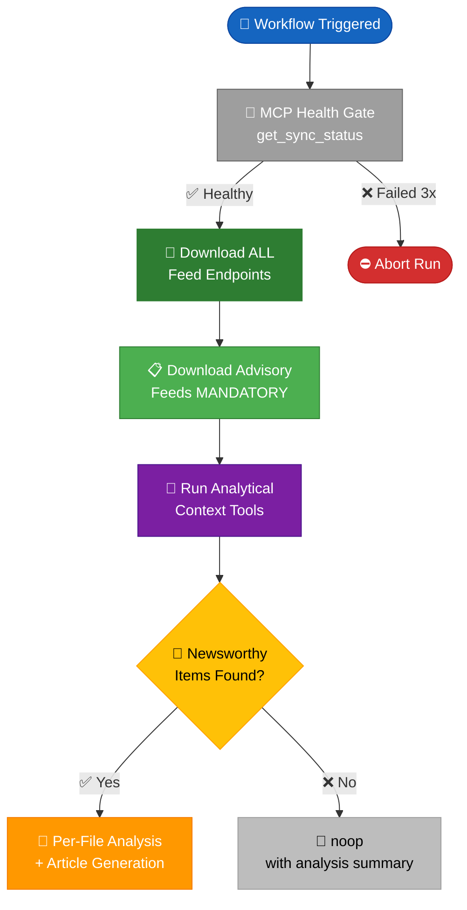
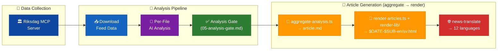
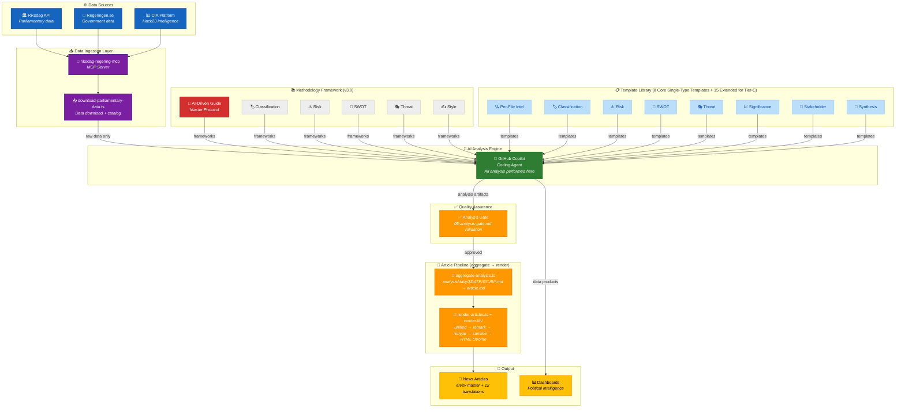
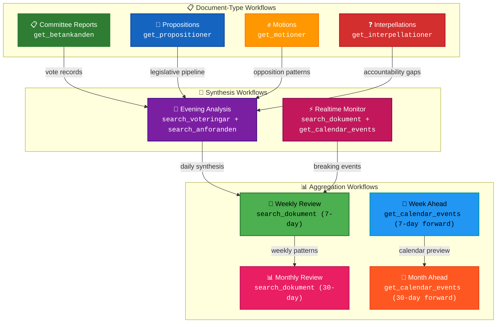
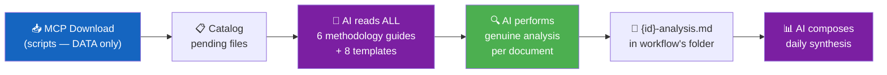
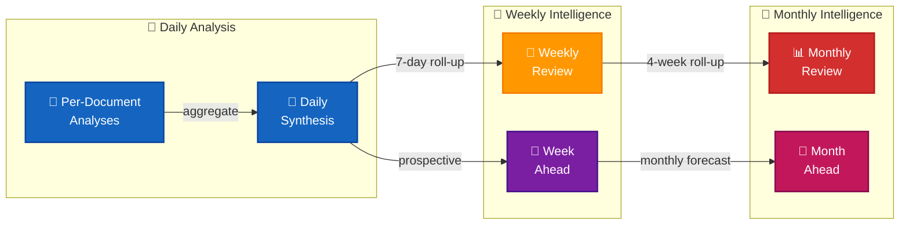

<p align="center">
  
</p>

<h1 align="center">🔬 Riksdagsmonitor — Analysis Directory</h1>

<p align="center">
  <strong>📊 Political Intelligence Analysis Artifacts for Agentic Workflows</strong><br>
  <em>🎯 AI-Driven · Evidence-Based · Methodology-Guided · Never Scripted</em>
</p>

<p align="center">
  <a href="#"></a>
  <a href="#"></a>
  <a href="#"></a>
  <a href="#"></a>
</p>

**📋 Document Owner:** CEO | **📄 Version:** 4.0 | **📅 Last Updated:** 2026-03-31 (UTC)  
**🔄 Review Cycle:** Quarterly | **⏰ Next Review:** 2026-06-30  
**🏢 Owner:** Hack23 AB (Org.nr 5595347807) | **🏷️ Classification:** Public

---

## 📚 Architecture Documentation Map

<table class="documentation-map">
  <thead>
    <tr>
      <th>Document</th>
      <th>Focus</th>
      <th>Description</th>
      <th>Documentation Link</th>
    </tr>
  </thead>
  <tbody>
    <tr>
      <td><strong><a href="../ARCHITECTURE.md">Architecture</a></strong></td>
      <td>🏛️ Architecture</td>
      <td>C4 model showing current system structure</td>
      <td><a href="https://github.com/Hack23/riksdagsmonitor/blob/main/ARCHITECTURE.md">View Source</a></td>
    </tr>
    <tr>
      <td><strong><a href="../SECURITY_ARCHITECTURE.md">Security Architecture</a></strong></td>
      <td>🛡️ Security</td>
      <td>Security controls and compliance mapping</td>
      <td><a href="https://github.com/Hack23/riksdagsmonitor/blob/main/SECURITY_ARCHITECTURE.md">View Source</a></td>
    </tr>
    <tr>
      <td><strong><a href="../THREAT_MODEL.md">Threat Model</a></strong></td>
      <td>🎯 Security</td>
      <td>Political Threat Landscape analysis</td>
      <td><a href="https://github.com/Hack23/riksdagsmonitor/blob/main/THREAT_MODEL.md">View Source</a></td>
    </tr>
    <tr>
      <td><strong><a href="../SWOT.md">SWOT Analysis</a></strong></td>
      <td>💼 Business</td>
      <td>Strategic assessment (<strong>formatting exemplar</strong>)</td>
      <td><a href="https://github.com/Hack23/riksdagsmonitor/blob/main/SWOT.md">View Source</a></td>
    </tr>
    <tr>
      <td><strong><a href="../DATA_MODEL.md">Data Model</a></strong></td>
      <td>📊 Data</td>
      <td>Current data structures and relationships</td>
      <td><a href="https://github.com/Hack23/riksdagsmonitor/blob/main/DATA_MODEL.md">View Source</a></td>
    </tr>
    <tr>
      <td><strong><a href="../FLOWCHART.md">Flowcharts</a></strong></td>
      <td>🔄 Process</td>
      <td>Current data processing workflows</td>
      <td><a href="https://github.com/Hack23/riksdagsmonitor/blob/main/FLOWCHART.md">View Source</a></td>
    </tr>
    <tr>
      <td><strong><a href="../WORKFLOWS.md">Workflows</a></strong></td>
      <td>⚙️ DevOps</td>
      <td>CI/CD and agentic workflow documentation</td>
      <td><a href="https://github.com/Hack23/riksdagsmonitor/blob/main/WORKFLOWS.md">View Source</a></td>
    </tr>
    <tr>
      <td><strong><a href="methodologies/README.md">Analysis Methodologies</a></strong></td>
      <td>📐 Methodology</td>
      <td>6 political intelligence analysis frameworks</td>
      <td><a href="https://github.com/Hack23/riksdagsmonitor/blob/main/analysis/methodologies/README.md">View Source</a></td>
    </tr>
    <tr>
      <td><strong><a href="templates/README.md">Analysis Templates</a></strong></td>
      <td>📋 Templates</td>
      <td>23 structured analysis output templates (8 core single-type + 15 extended / Tier-C)</td>
      <td><a href="https://github.com/Hack23/riksdagsmonitor/blob/main/analysis/templates/README.md">View Source</a></td>
    </tr>
  </tbody>
</table>

---

## 🔐 ISMS Policy Alignment

| **ISMS Policy** | **Analysis Implementation** |
| --- | --- |
| [🛠️ Secure Development Policy](https://github.com/Hack23/ISMS-PUBLIC/blob/main/Secure_Development_Policy.md) | Quality gates enforce evidence-based analysis; anti-pattern rejection prevents low-quality output |
| [🤖 AI Policy](https://github.com/Hack23/ISMS-PUBLIC/blob/main/AI_Policy.md) | AI agents MUST read methodology docs before analysis; per-file protocol ensures reproducibility |
| [📝 Classification Policy](https://github.com/Hack23/ISMS-PUBLIC/blob/main/Classification_Policy.md) | 7-dimension classification adapted from ISMS for Swedish political events (see [reference/](reference/)) |
| [🔍 Vulnerability Management](https://github.com/Hack23/ISMS-PUBLIC/blob/main/Vulnerability_Management.md) | Political threat analysis uses 6 purpose-built dimensions, NOT software-centric models |
| [🔓 Open Source Policy](https://github.com/Hack23/ISMS-PUBLIC/blob/main/Open_Source_Policy.md) | All methodology documents published under project license for transparency |

---

## 🚨 CRITICAL RULES — Read Before Any Analysis Work

### Rule 1: Folder Isolation — Every Workflow Gets Its Own Folder

```
analysis/daily/YYYY-MM-DD/{articleType}/
```

**Every agentic workflow MUST write ONLY to its own article-type subfolder.** Workflows MUST NEVER write to another workflow's folder. This prevents overwriting.

| Workflow | Output Folder | Example |
|----------|--------------|---------|
| `news-committee-reports` | `analysis/daily/YYYY-MM-DD/committeeReports/` | `analysis/daily/2026-03-30/committeeReports/` |
| `news-propositions` | `analysis/daily/YYYY-MM-DD/propositions/` | `analysis/daily/2026-03-30/propositions/` |
| `news-motions` | `analysis/daily/YYYY-MM-DD/motions/` | `analysis/daily/2026-03-30/motions/` |
| `news-interpellations` | `analysis/daily/YYYY-MM-DD/interpellations/` | `analysis/daily/2026-03-30/interpellations/` |
| `news-evening-analysis` | `analysis/daily/YYYY-MM-DD/evening/` | `analysis/daily/2026-03-30/evening/` |
| `news-realtime-monitor` | `analysis/daily/YYYY-MM-DD/realtime-HHMM/` | `analysis/daily/2026-03-30/realtime-1400/` |
| `news-weekly-review` | `analysis/weekly/YYYY-WNN/` | `analysis/weekly/2026-W13/` |
| `news-monthly-review` | `analysis/monthly/YYYY-MM/` | `analysis/monthly/2026-03/` |

### Rule 2: Never Overwrite Existing Analysis

**An agentic workflow MUST NEVER overwrite analysis produced by another workflow.** Each workflow run creates new files in its own scope. If a file already exists, the workflow MUST skip it or create an addendum, never replace.



### Rule 3: AI Performs ALL Analysis — Never Scripted Content

**Scripts download data. AI performs ALL analysis.** This is a fundamental architectural principle.

| ✅ Scripts MAY | 🚫 Scripts MUST NEVER |
|---------------|----------------------|
| Download MCP data to `analysis/data/` | Generate analysis prose, tables, or conclusions |
| Catalog pending files | Create SWOT entries, risk scores, or threat assessments |
| Validate output format (quality gate) | Fill template sections with generated content |
| Move/rename files | Produce "placeholder" analysis that looks real |

**The AI agent reads the 6 core methodology guides (of 11 total) and the 8 core output templates (of 23 total), reads the actual data, and produces genuine analytical content based on evidence found in the documents.** The remaining 5 methodology files (electoral-domain, per-document, strategic-extensions, structural-metadata, synthesis) provide domain-specific and meta-methodology context; the remaining 15 templates cover Tier-C aggregation (scenario-analysis, executive-brief, coalition-mathematics, election-2026-analysis, historical-parallels, comparative-international, devils-advocate, forward-indicators, implementation-feasibility, intelligence-assessment, media-framing-analysis, methodology-reflection, voter-segmentation, data-download-manifest, cross-reference-map).

**Fallback mechanism:** If AI analysis fails or produces unusable output (detected by the quality gate bash check in `.github/prompts/` — see the README for the module catalogue), the workflow should:
1. Commit a minimal `data-download-manifest.md` documenting what was downloaded
2. Flag the analysis as `pending` for the next workflow run
3. Never commit placeholder or stub content that masquerades as genuine analysis

### Rule 4: Deep Analysis — Not Shallow Summaries

Every analysis file must demonstrate **genuine political intelligence depth**. The quality standard is [SWOT.md](../SWOT.md) (965 lines of strategic analysis) and [THREAT_MODEL.md](../THREAT_MODEL.md) (2,938 lines of multi-framework threat modeling).

**Minimum depth indicators:**
- ≥ 3 evidence-backed claims per SWOT quadrant (with dok_id citations)
- ≥ 1 color-coded Mermaid diagram per analysis file (with real data, not placeholders)
- Multi-perspective analysis (government, opposition, citizen, media, international)
- Explicit confidence labels on every analytical claim
- Forward-looking indicators (what to watch next, with specific triggers)
- Cross-document pattern identification (how this document relates to other recent activity)

### Rule 5: Mandatory Data Download — ALWAYS Before Analysis

**Every agentic workflow MUST download Riksdag data before deciding whether to produce an article.** Data collection is NEVER optional:



**Key rules:**
- `timeframe: "today"` first, fallback to `"one-week"` for empty/error/timeout feeds
- Riksdag API can take 30–90+ seconds per call — NEVER abort slow responses
- Partial data is better than no data — continue with other feeds on individual failures
- Even on `noop`, all data collection and analysis MUST complete first

### Rule 6: Evidence-Based Only

Every factual claim must have a source citation. Every non-factual assessment must have a confidence level (HIGH/MEDIUM/LOW). Opinion-only entries are REJECTED.

---

## 🎯 Purpose

The `analysis/` directory stores **political intelligence analysis artifacts** produced by Riksdagsmonitor's agentic workflows. These artifacts bridge raw Swedish parliamentary data (sourced via the **riksdag-regering-mcp** server) and the final published political intelligence articles, news summaries, and dashboards across 14 languages.



Analysis artifacts are **genuine intelligence products** — not summaries or reformatted data — that enable:

- 🔄 **Workflow composition**: Upstream agents deposit analysis; downstream agents consume it
- 📐 **Consistent methodology**: 6 core frameworks (of 11 methodology files) + 8 core templates (of 23 total output templates) enforce analytical rigor
- 📊 **Full data analysis**: Every downloaded MCP file receives per-file deep analysis
- 🧠 **Reusable intelligence**: Cross-workflow pattern sharing and knowledge accumulation
- 🎯 **Quality assurance**: Minimum 7.0/10 quality gate before article generation
- 🔀 **Collision-free design**: Per-workflow directories prevent merge conflicts
- 📅 **Temporal aggregation**: Daily → Weekly → Monthly intelligence roll-ups

---

## 🏗️ Analysis System Architecture



---

## 🧩 Article Pipeline — `analysis/` is the article

Articles are **not authored in HTML**. Every rendered `news/$DATE-$SUB-$LANG.html` is a pure projection of the markdown artifacts in this directory, produced by two deterministic CLI scripts:

| Step | Script | Input | Output |
|------|--------|-------|--------|
| 1. Aggregate | [`scripts/aggregate-analysis.ts`](../scripts/aggregate-analysis.ts) | `analysis/daily/$DATE/$SUB/*.md` (+ `documents/*-analysis.md`) | `analysis/daily/$DATE/$SUB/article.md` (canonical, front-mattered) |
| 2. Render | [`scripts/render-articles.ts`](../scripts/render-articles.ts) + [`scripts/render-lib/`](../scripts/render-lib/) | `article.md` (or `article.<lang>.md`) | `news/$DATE-$SUB-$LANG.html` (sanitised, chrome-wrapped) |
| 3. Translate (EN+SV → 12 extra) | [`news-translate`](../.github/workflows/news-translate.md) | rendered `*-en.html` / `*-sv.html` | sibling `*-$LANG.html` files |

The aggregator enforces a **canonical narrative order** (executive-brief → synthesis → significance → stakeholder → SWOT → risk → threat → per-document intelligence → scenario/forward/comparative/historical → methodology-reflection → data-download-manifest). The renderer uses the `unified → remark-parse → remark-gfm → remark-rehype → rehype-raw → rehype-slug → rehype-autolink-headings → rehype-sanitize → rehype-stringify` pipeline; Mermaid fences survive as `<pre class="mermaid">` and are upgraded to SVG client-side.

**Implications for every analysis author (human or AI):**

- ✅ Every `.md` you write under `analysis/daily/$DATE/$SUB/` ships verbatim (modulo sanitisation) to the published article.
- ✅ Fix quality by fixing the `.md`, not by editing the rendered HTML (HTML is regenerated on every run).
- ✅ Relative links in analysis files are auto-rewritten to absolute `github.com/Hack23/riksdagsmonitor/blob/main/…` URLs so every citation stays auditable.
- 🚫 There is no scaffold, no `AI_MUST_REPLACE` marker, no HTML template to fill — see [`.github/prompts/06-article-generation.md`](../.github/prompts/06-article-generation.md) for the full contract.

---

## 📚 Documentation Map

<table class="documentation-map">
  <thead>
    <tr>
      <th>Document</th>
      <th>Type</th>
      <th>Focus</th>
      <th>Link</th>
    </tr>
  </thead>
  <tbody>
    <tr>
      <td><strong><a href="methodologies/README.md">Methodologies README</a></strong></td>
      <td>📚 Index</td>
      <td>Complete methodology catalog with architecture diagrams</td>
      <td><a href="methodologies/README.md">View</a></td>
    </tr>
    <tr>
      <td><strong><a href="templates/README.md">Templates README</a></strong></td>
      <td>📋 Index</td>
      <td>Template catalog with usage flow and quality standards</td>
      <td><a href="templates/README.md">View</a></td>
    </tr>
    <tr>
      <td><strong><a href="methodologies/ai-driven-analysis-guide.md">AI-Driven Guide</a></strong></td>
      <td>🤖 Protocol</td>
      <td>Master protocol for all AI analysis</td>
      <td><a href="methodologies/ai-driven-analysis-guide.md">View</a></td>
    </tr>
    <tr>
      <td><strong><a href="methodologies/political-classification-guide.md">Classification Guide</a></strong></td>
      <td>🏷️ Method</td>
      <td>7-dimension political taxonomy</td>
      <td><a href="methodologies/political-classification-guide.md">View</a></td>
    </tr>
    <tr>
      <td><strong><a href="methodologies/political-risk-methodology.md">Risk Methodology</a></strong></td>
      <td>⚠️ Method</td>
      <td>Cascading risk assessment model</td>
      <td><a href="methodologies/political-risk-methodology.md">View</a></td>
    </tr>
    <tr>
      <td><strong><a href="methodologies/political-swot-framework.md">SWOT Framework</a></strong></td>
      <td>💼 Method</td>
      <td>TOWS + Cross-SWOT analysis</td>
      <td><a href="methodologies/political-swot-framework.md">View</a></td>
    </tr>
    <tr>
      <td><strong><a href="methodologies/political-threat-framework.md">Threat Framework</a></strong></td>
      <td>🎭 Method</td>
      <td>4-framework threat modeling (v3.0)</td>
      <td><a href="methodologies/political-threat-framework.md">View</a></td>
    </tr>
    <tr>
      <td><strong><a href="methodologies/political-style-guide.md">Style Guide</a></strong></td>
      <td>✍️ Standards</td>
      <td>Evidence citation and writing standards</td>
      <td><a href="methodologies/political-style-guide.md">View</a></td>
    </tr>
    <tr>
      <td><strong><a href="reference/isms-classification-adaptation.md">ISMS Classification</a></strong></td>
      <td>📖 Reference</td>
      <td>ISO 27001 → Political classification mapping</td>
      <td><a href="reference/isms-classification-adaptation.md">View</a></td>
    </tr>
    <tr>
      <td><strong><a href="reference/isms-risk-assessment-adaptation.md">ISMS Risk</a></strong></td>
      <td>📖 Reference</td>
      <td>ISO 27001 → Political risk mapping</td>
      <td><a href="reference/isms-risk-assessment-adaptation.md">View</a></td>
    </tr>
    <tr>
      <td><strong><a href="reference/isms-style-guide-adaptation.md">ISMS Style</a></strong></td>
      <td>📖 Reference</td>
      <td>ISO 27001 → Political writing mapping</td>
      <td><a href="reference/isms-style-guide-adaptation.md">View</a></td>
    </tr>
    <tr>
      <td><strong><a href="reference/isms-threat-modeling-adaptation.md">ISMS Threat</a></strong></td>
      <td>📖 Reference</td>
      <td>ISO 27001 → Political threat mapping</td>
      <td><a href="reference/isms-threat-modeling-adaptation.md">View</a></td>
    </tr>
  </tbody>
</table>

---

## 🎯 Article-Type-Specific Analytics Matrix

Every agentic workflow produces **unique political intelligence** tailored to its document type. This is not generic analysis — each workflow downloads type-specific data via MCP and produces analytics that only that document type can provide.



### Per-Workflow Unique Analytics

| Workflow | Primary MCP Tool | Unique Analytics Only This Workflow Produces | Cross-Reference Tools |
|----------|-----------------|----------------------------------------------|----------------------|
| **Committee Reports** | `get_betankanden` | Committee voting splits, reservation analysis (dissenting opinions), committee-to-policy-domain mapping, fiscal/defence/healthcare committee specialisation metrics | `search_voteringar` (by beteckning), `search_anforanden`, `get_propositioner` |
| **Propositions** | `get_propositioner` | Legislative pipeline tracking (committee referral → vote timeline), government legislative ambition scoring, policy domain impact analysis, budget allocation implications | `search_dokument`, `analyze_g0v_by_department` |
| **Motions** | `get_motioner` | Opposition party strategy analysis (which parties push which issues), motion clustering by theme, cross-party alignment detection, signalverdi (signal value) for upcoming legislative battles | `search_dokument_fulltext`, `search_anforanden` |
| **Interpellations** | `get_interpellationer` | Ministerial accountability scoring (response rate, timeliness, evasion detection), question-to-response quality analysis, party oversight strategy mapping | `search_anforanden` (minister speeches), `get_calendar_events` |
| **Evening Analysis** | `search_voteringar` + `search_anforanden` | Daily parliamentary pulse (vote results + debate intensity), party discipline metrics, coalition cohesion scoring, MP-level voting deviation from party line | `get_betankanden`, `get_propositioner`, `get_calendar_events` |
| **Realtime Monitor** | `search_dokument` + `get_calendar_events` | Breaking event detection, urgency classification, real-time political temperature index | All MCP tools as needed |
| **Weekly Review** | `search_dokument` (7-day window) | Week-over-week trend detection, cross-document-type pattern identification, political narrative arc tracking | `search_voteringar`, `search_anforanden` |
| **Week Ahead** | `get_calendar_events` (forward 7 days) | Prospective calendar analysis, scheduled debate preview, expected voting outcomes based on committee composition | `search_dokument`, `get_fragor`, `get_interpellationer` |
| **Monthly Review** | `search_dokument` (30-day window) | Monthly legislative throughput metrics, party productivity rankings, government vs opposition scorecard | All MCP tools for comprehensive retrospective |
| **Month Ahead** | `get_calendar_events` (forward 30 days) | Strategic political calendar, legislative pipeline forecast, major policy decision timeline | `search_dokument`, `get_betankanden`, `get_propositioner` |

### Per-Document Unique Intelligence (Examples)

For **high-significance documents** (significance score ≥ 70), workflows produce **document-specific deep dives**:

| Document Type | Example dok_id | Unique Deep-Dive Analysis |
|--------------|----------------|--------------------------|
| **Committee Report** | `H901JuU15` | Voting split heatmap by party, reservation text analysis, comparison with original proposition intent, dissent pattern vs committee norms |
| **Proposition** | `H9032025/26:227` | Policy impact chain (which laws change → who is affected), budget envelope impact, comparison with previous government bills in same domain |
| **Motion** | `H902mot1234` | Opposition signalling analysis (is this a positioning motion or serious legislative bid?), cross-party co-sponsorship network, historical motion success rate for this topic |
| **Interpellation** | `H902ip456` | Question framing analysis (adversarial vs inquiry), minister response timeliness, evasion score (did the minister actually answer?), policy commitment extraction |

---

## 📁 Directory Structure

```
analysis/
├── README.md                          ← This file (CRITICAL RULES — read first)
├── data/                              ← Persistent MCP data repository (collision-free)
│   ├── README.md                      ← Data repository documentation
│   ├── documents/                     ← Parliamentary documents by type
│   │   ├── propositions/              ← Government propositions ({dok_id}.json + .meta.json)
│   │   ├── motions/                   ← Parliamentary motions
│   │   ├── committeeReports/          ← Committee reports
│   │   ├── votes/                     ← Voting records
│   │   ├── speeches/                  ← Parliamentary speeches
│   │   ├── questions/                 ← Written questions
│   │   └── interpellations/           ← Interpellations
│   ├── votes/                         ← Date-stamped vote ballots (YYYY-MM-DD/)
│   ├── events/                        ← Date-stamped calendar events (YYYY-MM-DD/)
│   ├── mps/                           ← MP profiles (intressent_id.json)
│   ├── worldbank/                     ← World Bank economic indicators
│   ├── scb/                           ← Statistics Sweden (SCB) table data
│   └── mcp-responses/                 ← Generic MCP tool response archive
├── templates/                         ← Analysis templates (AI fills these — NEVER scripts)
│   ├── political-classification.md    ← Event classification template
│   ├── risk-assessment.md             ← Political risk template (5×5 matrix + cascading risk)
│   ├── threat-analysis.md             ← Multi-framework threat template (Attack Trees + Kill Chain)
│   ├── swot-analysis.md               ← SWOT quadrant template (evidence-based, intersection analysis)
│   ├── stakeholder-impact.md          ← Stakeholder impact template (6 analytical lenses)
│   ├── significance-scoring.md        ← Significance scoring template (5-dimension rubric)
│   ├── synthesis-summary.md           ← Daily synthesis template (aggregates all above)
│   └── per-file-political-intelligence.md ← Per-file AI analysis template
├── methodologies/                     ← Detailed methodology guides (AI MUST read ALL before analyzing)
│   ├── ai-driven-analysis-guide.md    ← Master protocol: folder isolation, AI-only analysis, quality gates
│   ├── political-classification-guide.md ← Multi-dimensional classification, political temperature
│   ├── political-risk-methodology.md  ← 5×5 matrix, cascading risk, Bayesian updating
│   ├── political-threat-framework.md  ← Attack Trees, Kill Chain, Diamond Model, Political Threat Taxonomy
│   ├── political-swot-framework.md    ← Evidence hierarchy, cross-SWOT interference, scenario generation
│   └── political-style-guide.md       ← Intelligence writing standards, evidence density, attribution
├── reference/                         ← ISMS adaptation mappings
│   ├── isms-classification-adaptation.md
│   ├── isms-risk-assessment-adaptation.md
│   ├── isms-threat-modeling-adaptation.md
│   └── isms-style-guide-adaptation.md
├── daily/                             ← Per-day analysis (YYYY-MM-DD/{articleType}/ — ISOLATED per workflow)
│   └── README.md
├── weekly/                            ← Per-week aggregations (YYYY-WNN/)
│   └── README.md
└── monthly/                           ← Per-month strategic briefs (YYYY-MM/)
    └── README.md
```

### 🔒 Folder Isolation Model (Critical)

```
analysis/daily/2026-03-30/              ← Date folder
├── committeeReports/                   ← news-committee-reports ONLY writes here
│   ├── documents/                      ← Per-file analyses
│   │   ├── H901AU10-analysis.md
│   │   └── H901JuU25-analysis.md
│   ├── synthesis-summary.md
│   └── data-download-manifest.md
├── propositions/                       ← news-propositions ONLY writes here
│   ├── documents/
│   │   ├── H901prop227-analysis.md
│   │   └── H901prop213-analysis.md
│   ├── synthesis-summary.md
│   └── data-download-manifest.md
├── motions/                            ← news-motions ONLY writes here
│   └── ...
├── interpellations/                    ← news-interpellations ONLY writes here
│   └── ...
├── evening/                            ← news-evening-analysis ONLY writes here
│   └── ...
└── realtime-1400/                      ← news-realtime-monitor ONLY writes here (timestamped)
    └── ...
```

**Enforcement:** Each workflow's `git add` scope MUST be limited to its own subfolder:
```bash
# ✅ CORRECT — scoped to article type
git add "analysis/daily/${ARTICLE_DATE}/${DOC_TYPE}/"

# 🚫 WRONG — broad scope can overwrite other workflows
git add "analysis/daily/${ARTICLE_DATE}/"
```

---

## 📅 Naming Conventions

| Scope   | Format      | Example         | Description                         |
|---------|-------------|-----------------|-------------------------------------|
| Daily   | `YYYY-MM-DD`| `2026-03-26/`   | ISO 8601 calendar date              |
| Weekly  | `YYYY-WNN`  | `2026-W13/`     | ISO 8601 week number (Mon–Sun)      |
| Monthly | `YYYY-MM`   | `2026-03/`      | ISO 8601 year-month                 |
| Ad-hoc  | descriptive | `coalition-risk/`| Named topic directories when needed |

**Rules:**
- All directory names use zero-padded numbers (`W03`, not `W3`)
- Weekly directories align with ISO 8601: weeks start **Monday**
- Never use locale-specific date formats (no `26/3/2026` or `Mar-26`)

---

## 🤖 Workflow Integration

The following agentic workflows produce analysis artifacts. All workflows **MUST**:
1. Write ONLY to their own article-type subfolder (folder isolation)
2. Never overwrite analysis produced by another workflow
3. Follow the AI-driven analysis protocol (read methodologies, then analyze)
4. Never use scripts to generate analytical content

### 🌅 Daily Morning Workflows (scheduled Mon–Fri)

| Workflow | Schedule | Output Folder | Primary Output |
|----------|----------|---------------|----------------|
| `news-committee-reports` | 04:00 UTC | `daily/YYYY-MM-DD/committeeReports/` | Committee report analysis |
| `news-propositions` | 05:00 UTC | `daily/YYYY-MM-DD/propositions/` | Proposition analysis |
| `news-motions` | 06:00 UTC | `daily/YYYY-MM-DD/motions/` | Motion analysis |
| `news-interpellations` | 07:00 UTC | `daily/YYYY-MM-DD/interpellations/` | Interpellation analysis |

### 🌆 `news-evening-analysis` (18:00 UTC Mon–Fri, 16:00 UTC Sat)

Output folder: `daily/YYYY-MM-DD/evening/`

The evening analysis workflow is the most comprehensive. It:
1. Downloads data via `populate-analysis-data.ts` + `download-parliamentary-data.ts` (scripts for DATA only)
2. AI reads ALL 6 methodology guides + ALL 8 templates
3. AI performs per-file analysis on all pending files using genuine analytical reasoning
4. AI composes daily synthesis from per-file analyses
5. AI generates evening analysis articles — all content is AI-produced intelligence

### 📡 `news-realtime-monitor` (10:00+14:00 UTC Mon–Fri, 12:00 UTC weekends)

Output folder: `daily/YYYY-MM-DD/realtime-HHMM/` (timestamped to prevent overwrites)

Real-time monitoring of parliamentary activity with per-file analysis on new data. Each run gets a unique timestamped folder so successive runs never overwrite each other.

### 📅 Weekly & Monthly Workflows

| Workflow | Schedule | Output Folder | Output |
|----------|----------|---------------|--------|
| `news-week-ahead` | Fridays 07:00 UTC | `weekly/YYYY-WNN/week-ahead/` | Weekly forecast + aggregated SWOT |
| `news-weekly-review` | Scheduled | `weekly/YYYY-WNN/review/` | Weekly parliamentary wrap-up |
| `news-month-ahead` | Scheduled | `monthly/YYYY-MM/month-ahead/` | Monthly forecast |
| `news-monthly-review` | Scheduled | `monthly/YYYY-MM/review/` | Monthly strategic brief |

---

## 📐 Template Usage Guide

### Using a Template

1. **Copy** the template from `analysis/templates/` to the appropriate dated subdirectory
2. **Rename** using scope/workflow conventions from the target directory `README.md` (e.g. daily: `morning-risk-snapshot.md` / `evening-swot-update.md` / `realtime-HHMM-risk-delta.md`, weekly: `week-summary-swot.md`, monthly: `monthly-risk-register.md`)
3. **Fill** all required fields (marked `[REQUIRED]`)
4. **Complete** optional fields where evidence is available
5. **Validate** against the methodology guide before consuming downstream

### Template Quick Reference

| Template | When to Use | Key Output |
|----------|-------------|------------|
| `political-classification.md` | New political event arrives | Sensitivity + urgency classification |
| `risk-assessment.md` | Coalition/policy risk spike | Risk scores + mitigation map |
| `threat-analysis.md` | Political Threat Taxonomy review | Threat inventory + actor mapping |
| `swot-analysis.md` | Weekly/strategic SWOT pass | Quadrant entries with evidence |
| `stakeholder-impact.md` | Policy decision announced | Impact by stakeholder group |
| `significance-scoring.md` | Deciding what to publish | Composite score → publish/skip |
| `synthesis-summary.md` | Daily synthesis (aggregation) | Combined intelligence dashboard |
| `per-file-political-intelligence.md` | Per-file AI analysis | Full deep analysis per document |

---

## 📚 Related Scripts

| Path | Purpose |
|------|---------|
| `scripts/catalog-downloaded-data.ts` | Catalog downloaded files, list pending analysis |
| `scripts/populate-analysis-data.ts` | Standalone MCP data fetcher (7 data types) |
| `scripts/download-parliamentary-data.ts` | Orchestrates raw data download and persistence (manifest + JSON) |
| `scripts/analysis-framework/` | Core analysis pipeline (TypeScript) |
| `scripts/analysis-framework/lenses/` | Per-perspective classifiers (citizen, economic, government, international, media, opposition) |
| `scripts/analysis-framework/significance-scorer.ts` | Significance score computation |
| `scripts/analysis-framework/cross-reference.ts` | Cross-document reference linking |
| `scripts/parliamentary-data/data-persistence.ts` | MCP data persistence to `analysis/data/` |
| `scripts/parliamentary-data/data-downloader.ts` | Document download from riksdag-regering-mcp |
| `scripts/ai-analysis/` | AI-assisted analysis generation |
| `scripts/ai-analysis/swot/` | SWOT generation pipeline |
| `scripts/analysis-reader.ts` | Read daily analysis files with fallback |
| `scripts/prompts/v2/` | LLM prompt templates for analysis (v2) |

---

## 📊 Per-File AI Analysis Quality Gate

Every per-file analysis must score **≥ 7.0/10** across the 5 weighted dimensions defined in [`methodologies/ai-driven-analysis-guide.md`](methodologies/ai-driven-analysis-guide.md):

| Dimension | Weight | Minimum | Description |
|-----------|--------|---------|-------------|
| **Evidence** | 25% | 6/10 | Evidence density, citations per claim, source variety, dok_id references |
| **Depth** | 25% | 6/10 | Multi-framework application, analytical depth, cross-reference density, non-trivial insights |
| **Structural** | 20% | 7/10 | All template sections filled, required Mermaid diagrams present, coherent flow |
| **Actionable** | 15% | 6/10 | Clear implications, decision support, Riksdag-specific relevance, stakeholder identification |
| **Neutrality** | 15% | 7/10 | Balanced tone, writing quality, style guide compliance, clarity, no boilerplate or bias |

---

## 🔒 ISMS Compliance Framework Mapping

### ISO 27001:2022 Controls

| Control | Title | Analysis Implementation |
|---------|-------|------------------------|
| **A.5.1** | Policies for information security | All analysis methodologies align with Hack23 ISMS policy framework |
| **A.5.10** | Acceptable use of information | Classification guide defines sensitivity-based data handling |
| **A.5.33** | Protection of records | Style guide enforces evidence citation and audit trail |
| **A.8.3** | Information access restriction | Sensitivity levels (PUBLIC/SENSITIVE/RESTRICTED) gate access |
| **A.8.10** | Information deletion | 180-day SWOT decay rule ensures stale data is removed |
| **A.8.28** | Secure coding | AI analysis guide enforces structured, reviewable output with quality gates |

### NIST CSF 2.0 Functions

| Function | Analysis Relevance |
|----------|-------------------|
| **Identify (ID)** | Classification guide identifies and categorizes Riksdag events by sensitivity and impact |
| **Protect (PR)** | Style guide protects analytical quality through evidence requirements and anti-patterns |
| **Detect (DE)** | Threat framework detects political threats across 6 dimensions using multiple analytical models |
| **Respond (RS)** | Risk methodology provides quantified risk scores enabling proportionate response |
| **Recover (RC)** | SWOT framework supports strategic recovery planning through forward-looking opportunity analysis |

### CIS Controls v8.1

| Control | Title | Analysis Relevance |
|---------|-------|-------------------|
| **Control 1** | Inventory and Control of Enterprise Assets | Classification guide inventories and categorizes all Riksdag data assets |
| **Control 3** | Data Protection | Sensitivity levels enforce appropriate handling for each data classification |
| **Control 8** | Audit Log Management | AI analysis guide requires documented quality gate assessments (audit trail) |
| **Control 14** | Security Awareness and Skills Training | Methodology documents serve as training material for AI agents and analysts |
| **Control 16** | Application Software Security | Quality gates enforce structured, validated analytical output |

---

## 🔒 ISMS Adaptation Reference

The `reference/` directory maps ISMS security frameworks to political intelligence:

| Reference Document | Source ISMS Document | Political Adaptation |
|-------------------|---------------------|---------------------|
| [isms-classification-adaptation.md](reference/isms-classification-adaptation.md) | ISO 27001 A.5.12–A.5.13, [Classification Policy](https://github.com/Hack23/ISMS-PUBLIC/blob/main/Classification_Policy.md) | Confidentiality → Sensitivity, Integrity → Accuracy, Availability → Urgency |
| [isms-risk-assessment-adaptation.md](reference/isms-risk-assessment-adaptation.md) | ISO 27001 A.8.8, [Risk Assessment Methodology](https://github.com/Hack23/ISMS-PUBLIC/blob/main/Risk_Assessment_Methodology.md) | CIA Triad → Political Triad (Accountability, Policy Fidelity, Democratic Continuity) |
| [isms-threat-modeling-adaptation.md](reference/isms-threat-modeling-adaptation.md) | ISO 27001 A.5.7, NIST CSF ID.RA-3 | Political Threat Landscape + Attack Trees + Diamond Model |
| [isms-style-guide-adaptation.md](reference/isms-style-guide-adaptation.md) | [STYLE_GUIDE](https://github.com/Hack23/ISMS-PUBLIC/blob/main/STYLE_GUIDE.md) | ISMS writing standards → Political intelligence writing standards |

---

## 🔗 Related Documentation

- [📐 ARCHITECTURE.md](../ARCHITECTURE.md) — System architecture overview
- [🧠 MINDMAP.md](../MINDMAP.md) — Conceptual relationship map
- [🔄 FLOWCHART.md](../FLOWCHART.md) — Data flow diagrams
- [🛡️ THREAT_MODEL.md](../THREAT_MODEL.md) — Platform threat analysis (**formatting exemplar**)
- [💼 SWOT.md](../SWOT.md) — Platform strategic analysis (**formatting exemplar**)
- [🔐 SECURITY_ARCHITECTURE.md](../SECURITY_ARCHITECTURE.md) — Security controls

---

## 🤖 Per-File AI Analysis (Primary Analysis Mode)

The primary analysis mode is **per-file AI-driven analysis**: for every downloaded MCP data file, the AI agent produces a deep analysis markdown file. The AI reads all methodology guides, reads the actual data, and produces genuine political intelligence — **not** script-generated summaries.

### How It Works



| Step | Action | Responsible | Tool / Reference |
|------|--------|-------------|-----------------|
| 1. Download | Scripts fetch MCP data to `analysis/data/` | **Scripts** | `scripts/populate-analysis-data.ts` |
| 2. Catalog | List files needing analysis | **Scripts** | `scripts/catalog-downloaded-data.ts --pending-only` |
| 3. Read methods | AI reads ALL 6 methodology docs + 8 templates | **AI** | `analysis/methodologies/*.md` + `analysis/templates/*.md` |
| 4. Analyze | AI applies multi-framework analysis to each file | **AI** | Evidence-based reasoning, not scripts |
| 5. Write | Save `{id}-analysis.md` in workflow's isolated folder | **AI** | e.g. `analysis/daily/YYYY-MM-DD/propositions/documents/H901prop227-analysis.md` |
| 6. Synthesize | AI composes synthesis from per-file analyses | **AI** | `analysis/daily/YYYY-MM-DD/{articleType}/synthesis-summary.md` |

### What "Genuine AI Analysis" Means (vs. Scripted Content)

| ✅ Genuine AI Analysis | 🚫 Scripted/Shallow Content |
|------------------------|---------------------------|
| "Proposition 2025/26:227 strengthens criminal penalties for gang crime, extending minimum sentences from 4→6 years. Coalition partner L has historically resisted harsh sentencing (see L motion 2024/25:1234), creating potential friction. SD has publicly demanded even stricter measures (interpellation 2025/26:456). **Risk:** L could break ranks on floor vote, though KD mediation has historically bridged such gaps (vote record H901JuU15). [MEDIUM confidence]" | "This proposition relates to justice policy. The government's position is strengthened. [MEDIUM confidence]" |
| Cross-references 3+ documents, names specific actors with party, identifies tension dynamics, provides forward risk assessment | Generic summary with no specific data, no cross-references, no named actors |

### Methodology Documents (AI Must Read Before Analyzing)

| Priority | Document | Key Analytical Frameworks |
|:--------:|----------|--------------------------|
| 🔴 1 | [political-swot-framework.md](methodologies/political-swot-framework.md) | Evidence hierarchy, confidence levels, temporal decay, cross-SWOT interference, strategic scenario generation |
| 🔴 2 | [political-risk-methodology.md](methodologies/political-risk-methodology.md) | 5×5 Likelihood×Impact, cascading risk analysis, Bayesian updating, risk interconnection mapping |
| 🔴 3 | [political-threat-framework.md](methodologies/political-threat-framework.md) | Attack Trees, Political Kill Chain, Diamond Model, Political Threat Taxonomy, threat actor profiling |
| 🟠 4 | [political-classification-guide.md](methodologies/political-classification-guide.md) | Multi-dimensional classification, political temperature index, strategic significance |
| 🟠 5 | [political-style-guide.md](methodologies/political-style-guide.md) | Intelligence writing standards, evidence density requirements, attribution rules |
| 🟠 6 | [ai-driven-analysis-guide.md](methodologies/ai-driven-analysis-guide.md) | Master protocol: folder isolation, AI-only analysis, quality gates, time budget |

### Analysis Prompts (v2)

| Prompt | Purpose |
|--------|---------|
| [per-file-intelligence-analysis.md](../scripts/prompts/v2/per-file-intelligence-analysis.md) | Step-by-step per-file analysis protocol |
| [political-analysis.md](../scripts/prompts/v2/political-analysis.md) | Core political analysis framework (6 lenses) |
| [swot-generation.md](../scripts/prompts/v2/swot-generation.md) | SWOT generation with pre-computed data |
| [political-risk-prompt.md](../scripts/prompts/v2/political-risk-prompt.md) | Risk assessment prompt |
| [political-threat-prompt.md](../scripts/prompts/v2/political-threat-prompt.md) | Threat analysis prompt |
| [quality-criteria.md](../scripts/prompts/v2/quality-criteria.md) | Quality self-assessment rubric (≥7/10) |

### Conflict Resolution

Because each workflow writes to its own isolated folder:
- **Per-file analyses** (`{id}-analysis.md`) are conflict-free — each file analyzed independently in its workflow's folder
- **Daily synthesis** files are scoped to each workflow's folder — no cross-workflow conflicts
- **Weekly aggregations** read from all daily folders (read-only) to compose weekly intelligence
- **Realtime monitor** uses timestamped folders (`realtime-HHMM/`) so successive runs never overwrite

> **Quality Standard:** Every per-file analysis must match [SWOT.md](../SWOT.md) and [THREAT_MODEL.md](../THREAT_MODEL.md) formatting quality — Hack23 header badges, color-coded Mermaid diagrams, evidence tables with confidence labels, multi-framework analysis, and actionable intelligence.

---

**Document Control:**  
- **Repository:** https://github.com/Hack23/riksdagsmonitor  
- **Path:** `/analysis/README.md`  
- **Format:** Markdown  
- **Classification:** Public  
- **Version:** 4.0  
- **Next Review:** 2026-06-30

---

## 📊 Temporal Aggregation Architecture



---

<p align="center">
  <em>📊 Hack23 AB — Political Intelligence Through Systematic Analysis</em>
</p>
