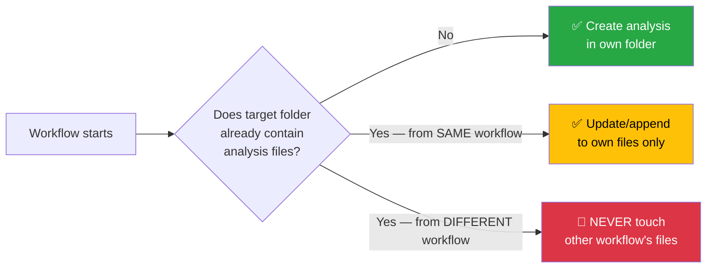
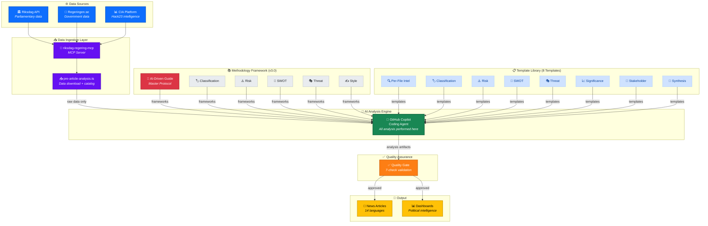
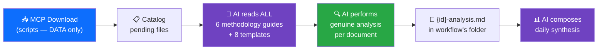
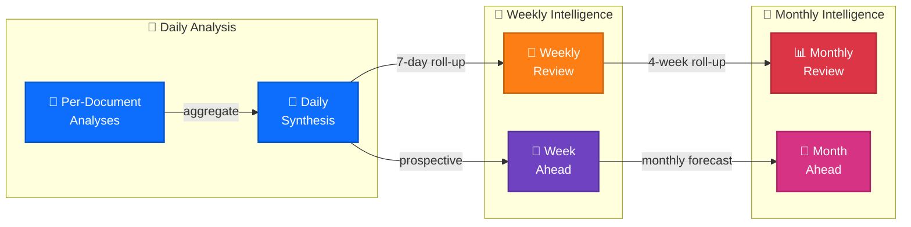

<p align="center">
  
</p>

<h1 align="center">🔬 Riksdagsmonitor — Analysis Directory</h1>

<p align="center">
  <strong>📊 Political Intelligence Analysis Artifacts for Agentic Workflows</strong><br>
  <em>🎯 AI-Driven · Evidence-Based · Methodology-Guided · Never Scripted</em>
</p>

<p align="center">
  <a href="#"></a>
  <a href="#"></a>
  <a href="#"></a>
  <a href="#"></a>
</p>

**📋 Document Owner:** CEO | **📄 Version:** 3.0 | **📅 Last Updated:** 2026-03-30 (UTC)  
**🔄 Review Cycle:** Quarterly | **⏰ Next Review:** 2026-06-30  
**🏢 Owner:** Hack23 AB (Org.nr 5595347807) | **🏷️ Classification:** Public

---

## 🚨 CRITICAL RULES — Read Before Any Analysis Work

### Rule 1: Folder Isolation — Every Workflow Gets Its Own Folder

```
analysis/daily/YYYY-MM-DD/{articleType}/
```

**Every agentic workflow MUST write ONLY to its own article-type subfolder.** Workflows MUST NEVER write to another workflow's folder. This prevents overwriting.

| Workflow | Output Folder | Example |
|----------|--------------|---------|
| `news-committee-reports` | `analysis/daily/YYYY-MM-DD/committeeReports/` | `analysis/daily/2026-03-30/committeeReports/` |
| `news-propositions` | `analysis/daily/YYYY-MM-DD/propositions/` | `analysis/daily/2026-03-30/propositions/` |
| `news-motions` | `analysis/daily/YYYY-MM-DD/motions/` | `analysis/daily/2026-03-30/motions/` |
| `news-interpellations` | `analysis/daily/YYYY-MM-DD/interpellations/` | `analysis/daily/2026-03-30/interpellations/` |
| `news-evening-analysis` | `analysis/daily/YYYY-MM-DD/evening/` | `analysis/daily/2026-03-30/evening/` |
| `news-realtime-monitor` | `analysis/daily/YYYY-MM-DD/realtime-HHMM/` | `analysis/daily/2026-03-30/realtime-1400/` |
| `news-weekly-review` | `analysis/weekly/YYYY-WNN/` | `analysis/weekly/2026-W13/` |
| `news-monthly-review` | `analysis/monthly/YYYY-MM/` | `analysis/monthly/2026-03/` |

### Rule 2: Never Overwrite Existing Analysis

**An agentic workflow MUST NEVER overwrite analysis produced by another workflow.** Each workflow run creates new files in its own scope. If a file already exists, the workflow MUST skip it or create an addendum, never replace.



### Rule 3: AI Performs ALL Analysis — Never Scripted Content

**Scripts download data. AI performs ALL analysis.** This is a fundamental architectural principle.

| ✅ Scripts MAY | 🚫 Scripts MUST NEVER |
|---------------|----------------------|
| Download MCP data to `analysis/data/` | Generate analysis prose, tables, or conclusions |
| Catalog pending files | Create SWOT entries, risk scores, or threat assessments |
| Validate output format (quality gate) | Fill template sections with generated content |
| Move/rename files | Produce "placeholder" analysis that looks real |

**The AI agent reads all 6 methodology guides, reads all 8 templates, reads the actual data, and produces genuine analytical content based on evidence found in the documents.**

**Fallback mechanism:** If AI analysis fails or produces unusable output (detected by the quality gate bash check in `SHARED_PROMPT_PATTERNS.md`), the workflow should:
1. Commit a minimal `data-download-manifest.md` documenting what was downloaded
2. Flag the analysis as `pending` for the next workflow run
3. Never commit placeholder or stub content that masquerades as genuine analysis

### Rule 4: Deep Analysis — Not Shallow Summaries

Every analysis file must demonstrate **genuine political intelligence depth**. The quality standard is [SWOT.md](../SWOT.md) (965 lines of strategic analysis) and [THREAT_MODEL.md](../THREAT_MODEL.md) (2,938 lines of multi-framework threat modeling).

**Minimum depth indicators:**
- ≥ 3 evidence-backed claims per SWOT quadrant (with dok_id citations)
- ≥ 1 color-coded Mermaid diagram per analysis file (with real data, not placeholders)
- Multi-perspective analysis (government, opposition, citizen, media, international)
- Explicit confidence labels on every analytical claim
- Forward-looking indicators (what to watch next, with specific triggers)
- Cross-document pattern identification (how this document relates to other recent activity)

---

## 🎯 Purpose

The `analysis/` directory stores **political intelligence analysis artifacts** produced by Riksdagsmonitor's agentic workflows. These artifacts bridge raw Swedish parliamentary data (sourced via the riksdag-regering-mcp server) and the final published political intelligence articles, news summaries, and dashboards.

Analysis artifacts are **genuine intelligence products** — not summaries or reformatted data — that enable:

- 🔄 **Workflow isolation**: Each workflow writes to its own folder; no overwrites
- 📐 **Methodology-driven rigor**: AI reads all frameworks before analyzing; templates enforce structure
- 📊 **Temporal aggregation**: Daily → Weekly → Monthly intelligence roll-ups
- 🧠 **Evidence-based intelligence**: Every claim cites dok_id, vote records, or official statistics
- 🎯 **Multi-framework analysis**: SWOT, Risk matrices, Attack Trees, Kill Chains, Stakeholder mapping

---

## 🏗️ Analysis System Architecture



---

## 📚 Documentation Map

<div class="documentation-map">

| Document | Type | Focus | Link |
|----------|------|-------|------|
| **[Methodologies README](methodologies/README.md)** | 📚 Index | Complete methodology catalog with architecture diagrams | [View](methodologies/README.md) |
| **[Templates README](templates/README.md)** | 📋 Index | Template catalog with usage flow and quality standards | [View](templates/README.md) |
| **[AI-Driven Guide](methodologies/ai-driven-analysis-guide.md)** | 🤖 Protocol | Master protocol for all AI analysis | [View](methodologies/ai-driven-analysis-guide.md) |
| **[Classification Guide](methodologies/political-classification-guide.md)** | 🏷️ Method | 7-dimension political taxonomy | [View](methodologies/political-classification-guide.md) |
| **[Risk Methodology](methodologies/political-risk-methodology.md)** | ⚠️ Method | Cascading risk assessment model | [View](methodologies/political-risk-methodology.md) |
| **[SWOT Framework](methodologies/political-swot-framework.md)** | 💼 Method | TOWS + Cross-SWOT analysis | [View](methodologies/political-swot-framework.md) |
| **[Threat Framework](methodologies/political-threat-framework.md)** | 🎭 Method | 4-framework threat modeling (v3.0) | [View](methodologies/political-threat-framework.md) |
| **[Style Guide](methodologies/political-style-guide.md)** | ✍️ Standards | Evidence citation and writing standards | [View](methodologies/political-style-guide.md) |
| **[ISMS Classification](reference/isms-classification-adaptation.md)** | 📖 Reference | ISO 27001 → Political classification mapping | [View](reference/isms-classification-adaptation.md) |
| **[ISMS Risk](reference/isms-risk-assessment-adaptation.md)** | 📖 Reference | ISO 27001 → Political risk mapping | [View](reference/isms-risk-assessment-adaptation.md) |
| **[ISMS Style](reference/isms-style-guide-adaptation.md)** | 📖 Reference | ISO 27001 → Political writing mapping | [View](reference/isms-style-guide-adaptation.md) |
| **[ISMS Threat](reference/isms-threat-modeling-adaptation.md)** | 📖 Reference | ISO 27001 → Political threat mapping | [View](reference/isms-threat-modeling-adaptation.md) |

</div>

---

## 📁 Directory Structure

```
analysis/
├── README.md                          ← This file (CRITICAL RULES — read first)
├── data/                              ← Persistent MCP data repository (collision-free)
│   ├── README.md                      ← Data repository documentation
│   ├── documents/                     ← Parliamentary documents by type
│   │   ├── propositions/              ← Government propositions ({dok_id}.json + .meta.json)
│   │   ├── motions/                   ← Parliamentary motions
│   │   ├── committeeReports/          ← Committee reports
│   │   ├── votes/                     ← Voting records
│   │   ├── speeches/                  ← Parliamentary speeches
│   │   ├── questions/                 ← Written questions
│   │   └── interpellations/           ← Interpellations
│   ├── votes/                         ← Date-stamped vote ballots (YYYY-MM-DD/)
│   ├── events/                        ← Date-stamped calendar events (YYYY-MM-DD/)
│   ├── mps/                           ← MP profiles (intressent_id.json)
│   ├── worldbank/                     ← World Bank economic indicators
│   ├── scb/                           ← Statistics Sweden (SCB) table data
│   └── mcp-responses/                 ← Generic MCP tool response archive
├── templates/                         ← Analysis templates (AI fills these — NEVER scripts)
│   ├── political-classification.md    ← Event classification template
│   ├── risk-assessment.md             ← Political risk template (5×5 matrix + cascading risk)
│   ├── threat-analysis.md             ← Multi-framework threat template (Attack Trees + Kill Chain)
│   ├── swot-analysis.md               ← SWOT quadrant template (evidence-based, intersection analysis)
│   ├── stakeholder-impact.md          ← Stakeholder impact template (6 analytical lenses)
│   ├── significance-scoring.md        ← Significance scoring template (5-dimension rubric)
│   ├── synthesis-summary.md           ← Daily synthesis template (aggregates all above)
│   └── per-file-political-intelligence.md ← Per-file AI analysis template
├── methodologies/                     ← Detailed methodology guides (AI MUST read ALL before analyzing)
│   ├── ai-driven-analysis-guide.md    ← Master protocol: folder isolation, AI-only analysis, quality gates
│   ├── political-classification-guide.md ← Multi-dimensional classification, political temperature
│   ├── political-risk-methodology.md  ← 5×5 matrix, cascading risk, Bayesian updating
│   ├── political-threat-framework.md  ← Attack Trees, Kill Chain, Diamond Model, Political Threat Taxonomy
│   ├── political-swot-framework.md    ← Evidence hierarchy, cross-SWOT interference, scenario generation
│   └── political-style-guide.md       ← Intelligence writing standards, evidence density, attribution
├── reference/                         ← ISMS adaptation mappings
│   ├── isms-classification-adaptation.md
│   ├── isms-risk-assessment-adaptation.md
│   ├── isms-threat-modeling-adaptation.md
│   └── isms-style-guide-adaptation.md
├── daily/                             ← Per-day analysis (YYYY-MM-DD/{articleType}/ — ISOLATED per workflow)
│   └── README.md
├── weekly/                            ← Per-week aggregations (YYYY-WNN/)
│   └── README.md
└── monthly/                           ← Per-month strategic briefs (YYYY-MM/)
    └── README.md
```

### 🔒 Folder Isolation Model (Critical)

```
analysis/daily/2026-03-30/              ← Date folder
├── committeeReports/                   ← news-committee-reports ONLY writes here
│   ├── documents/                      ← Per-file analyses
│   │   ├── H901AU10-analysis.md
│   │   └── H901JuU25-analysis.md
│   ├── synthesis-summary.md
│   └── data-download-manifest.md
├── propositions/                       ← news-propositions ONLY writes here
│   ├── documents/
│   │   ├── H901prop227-analysis.md
│   │   └── H901prop213-analysis.md
│   ├── synthesis-summary.md
│   └── data-download-manifest.md
├── motions/                            ← news-motions ONLY writes here
│   └── ...
├── interpellations/                    ← news-interpellations ONLY writes here
│   └── ...
├── evening/                            ← news-evening-analysis ONLY writes here
│   └── ...
└── realtime-1400/                      ← news-realtime-monitor ONLY writes here (timestamped)
    └── ...
```

**Enforcement:** Each workflow's `git add` scope MUST be limited to its own subfolder:
```bash
# ✅ CORRECT — scoped to article type
git add "analysis/daily/${ARTICLE_DATE}/${DOC_TYPE}/"

# 🚫 WRONG — broad scope can overwrite other workflows
git add "analysis/daily/${ARTICLE_DATE}/"
```

---

## 📅 Naming Conventions

| Scope   | Format      | Example         | Description                         |
|---------|-------------|-----------------|-------------------------------------|
| Daily   | `YYYY-MM-DD`| `2026-03-26/`   | ISO 8601 calendar date              |
| Weekly  | `YYYY-WNN`  | `2026-W13/`     | ISO 8601 week number (Mon–Sun)      |
| Monthly | `YYYY-MM`   | `2026-03/`      | ISO 8601 year-month                 |
| Ad-hoc  | descriptive | `coalition-risk/`| Named topic directories when needed |

**Rules:**
- All directory names use zero-padded numbers (`W03`, not `W3`)
- Weekly directories align with ISO 8601: weeks start **Monday**
- Never use locale-specific date formats (no `26/3/2026` or `Mar-26`)

---

## 🤖 Workflow Integration

The following agentic workflows produce analysis artifacts. All workflows **MUST**:
1. Write ONLY to their own article-type subfolder (folder isolation)
2. Never overwrite analysis produced by another workflow
3. Follow the AI-driven analysis protocol (read methodologies, then analyze)
4. Never use scripts to generate analytical content

### 🌅 Daily Morning Workflows (scheduled Mon–Fri)

| Workflow | Schedule | Output Folder | Primary Output |
|----------|----------|---------------|----------------|
| `news-committee-reports` | 04:00 UTC | `daily/YYYY-MM-DD/committeeReports/` | Committee report analysis |
| `news-propositions` | 05:00 UTC | `daily/YYYY-MM-DD/propositions/` | Proposition analysis |
| `news-motions` | 06:00 UTC | `daily/YYYY-MM-DD/motions/` | Motion analysis |
| `news-interpellations` | 07:00 UTC | `daily/YYYY-MM-DD/interpellations/` | Interpellation analysis |

### 🌆 `news-evening-analysis` (18:00 UTC Mon–Fri, 16:00 UTC Sat)

Output folder: `daily/YYYY-MM-DD/evening/`

The evening analysis workflow is the most comprehensive. It:
1. Downloads data via `populate-analysis-data.ts` + `pre-article-analysis.ts` (scripts for DATA only)
2. AI reads ALL 6 methodology guides + ALL 8 templates
3. AI performs per-file analysis on all pending files using genuine analytical reasoning
4. AI composes daily synthesis from per-file analyses
5. AI generates evening analysis articles — all content is AI-produced intelligence

### 📡 `news-realtime-monitor` (10:00+14:00 UTC Mon–Fri, 12:00 UTC weekends)

Output folder: `daily/YYYY-MM-DD/realtime-HHMM/` (timestamped to prevent overwrites)

Real-time monitoring of parliamentary activity with per-file analysis on new data. Each run gets a unique timestamped folder so successive runs never overwrite each other.

### 📅 Weekly & Monthly Workflows

| Workflow | Schedule | Output Folder | Output |
|----------|----------|---------------|--------|
| `news-week-ahead` | Fridays 07:00 UTC | `weekly/YYYY-WNN/week-ahead/` | Weekly forecast + aggregated SWOT |
| `news-weekly-review` | Scheduled | `weekly/YYYY-WNN/review/` | Weekly parliamentary wrap-up |
| `news-month-ahead` | Scheduled | `monthly/YYYY-MM/month-ahead/` | Monthly forecast |
| `news-monthly-review` | Scheduled | `monthly/YYYY-MM/review/` | Monthly strategic brief |

---

## 📐 Template Usage Guide

### Using a Template

1. **Copy** the template from `analysis/templates/` to the appropriate dated subdirectory
2. **Rename** using scope/workflow conventions from the target directory `README.md` (e.g. daily: `morning-risk-snapshot.md` / `evening-swot-update.md` / `realtime-HHMM-risk-delta.md`, weekly: `week-summary-swot.md`, monthly: `monthly-risk-register.md`)
3. **Fill** all required fields (marked `[REQUIRED]`)
4. **Complete** optional fields where evidence is available
5. **Validate** against the methodology guide before consuming downstream

### Template Quick Reference

| Template | When to Use | Key Output |
|----------|-------------|------------|
| `political-classification.md` | New political event arrives | Sensitivity + urgency classification |
| `risk-assessment.md` | Coalition/policy risk spike | Risk scores + mitigation map |
| `threat-analysis.md` | Political Threat Taxonomy review | Threat inventory + actor mapping |
| `swot-analysis.md` | Weekly/strategic SWOT pass | Quadrant entries with evidence |
| `stakeholder-impact.md` | Policy decision announced | Impact by stakeholder group |
| `significance-scoring.md` | Deciding what to publish | Composite score → publish/skip |
| `synthesis-summary.md` | Daily synthesis (aggregation) | Combined intelligence dashboard |
| `per-file-political-intelligence.md` | Per-file AI analysis | Full deep analysis per document |

---

## 📚 Related Scripts

| Path | Purpose |
|------|---------|
| `scripts/catalog-downloaded-data.ts` | Catalog downloaded files, list pending analysis |
| `scripts/populate-analysis-data.ts` | Standalone MCP data fetcher (7 data types) |
| `scripts/pre-article-analysis.ts` | Orchestrates 10-step analysis pipeline |
| `scripts/analysis-framework/` | Core analysis pipeline (TypeScript) |
| `scripts/analysis-framework/lenses/` | Per-perspective classifiers (citizen, economic, government, international, media, opposition) |
| `scripts/analysis-framework/significance-scorer.ts` | Significance score computation |
| `scripts/analysis-framework/cross-reference.ts` | Cross-document reference linking |
| `scripts/pre-article-analysis/data-persistence.ts` | MCP data persistence to `analysis/data/` |
| `scripts/pre-article-analysis/data-downloader.ts` | Document download from riksdag-regering-mcp |
| `scripts/ai-analysis/` | AI-assisted analysis generation |
| `scripts/ai-analysis/swot/` | SWOT generation pipeline |
| `scripts/analysis-reader.ts` | Read daily analysis files with fallback |
| `scripts/prompts/v2/` | LLM prompt templates for analysis (v2) |

---

## 🔗 Related Documentation

- [📐 ARCHITECTURE.md](../ARCHITECTURE.md) — System architecture overview
- [🧠 MINDMAP.md](../MINDMAP.md) — Conceptual relationship map
- [🔄 FLOWCHART.md](../FLOWCHART.md) — Data flow diagrams
- [🛡️ THREAT_MODEL.md](../THREAT_MODEL.md) — Platform threat analysis (**formatting exemplar**)
- [💼 SWOT.md](../SWOT.md) — Platform strategic analysis (**formatting exemplar**)
- [🔐 SECURITY_ARCHITECTURE.md](../SECURITY_ARCHITECTURE.md) — Security controls

---

## 🤖 Per-File AI Analysis (Primary Analysis Mode)

The primary analysis mode is **per-file AI-driven analysis**: for every downloaded MCP data file, the AI agent produces a deep analysis markdown file. The AI reads all methodology guides, reads the actual data, and produces genuine political intelligence — **not** script-generated summaries.

### How It Works



| Step | Action | Responsible | Tool / Reference |
|------|--------|-------------|-----------------|
| 1. Download | Scripts fetch MCP data to `analysis/data/` | **Scripts** | `scripts/populate-analysis-data.ts` |
| 2. Catalog | List files needing analysis | **Scripts** | `scripts/catalog-downloaded-data.ts --pending-only` |
| 3. Read methods | AI reads ALL 6 methodology docs + 8 templates | **AI** | `analysis/methodologies/*.md` + `analysis/templates/*.md` |
| 4. Analyze | AI applies multi-framework analysis to each file | **AI** | Evidence-based reasoning, not scripts |
| 5. Write | Save `{id}-analysis.md` in workflow's isolated folder | **AI** | e.g. `analysis/daily/YYYY-MM-DD/propositions/documents/H901prop227-analysis.md` |
| 6. Synthesize | AI composes synthesis from per-file analyses | **AI** | `analysis/daily/YYYY-MM-DD/{articleType}/synthesis-summary.md` |

### What "Genuine AI Analysis" Means (vs. Scripted Content)

| ✅ Genuine AI Analysis | 🚫 Scripted/Shallow Content |
|------------------------|---------------------------|
| "Proposition 2025/26:227 strengthens criminal penalties for gang crime, extending minimum sentences from 4→6 years. Coalition partner L has historically resisted harsh sentencing (see L motion 2024/25:1234), creating potential friction. SD has publicly demanded even stricter measures (interpellation 2025/26:456). **Risk:** L could break ranks on floor vote, though KD mediation has historically bridged such gaps (vote record H901JuU15). [MEDIUM confidence]" | "This proposition relates to justice policy. The government's position is strengthened. [MEDIUM confidence]" |
| Cross-references 3+ documents, names specific actors with party, identifies tension dynamics, provides forward risk assessment | Generic summary with no specific data, no cross-references, no named actors |

### Methodology Documents (AI Must Read Before Analyzing)

| Priority | Document | Key Analytical Frameworks |
|:--------:|----------|--------------------------|
| 🔴 1 | [political-swot-framework.md](methodologies/political-swot-framework.md) | Evidence hierarchy, confidence levels, temporal decay, cross-SWOT interference, strategic scenario generation |
| 🔴 2 | [political-risk-methodology.md](methodologies/political-risk-methodology.md) | 5×5 Likelihood×Impact, cascading risk analysis, Bayesian updating, risk interconnection mapping |
| 🔴 3 | [political-threat-framework.md](methodologies/political-threat-framework.md) | Attack Trees, Political Kill Chain, Diamond Model, Political Threat Taxonomy, threat actor profiling |
| 🟠 4 | [political-classification-guide.md](methodologies/political-classification-guide.md) | Multi-dimensional classification, political temperature index, strategic significance |
| 🟠 5 | [political-style-guide.md](methodologies/political-style-guide.md) | Intelligence writing standards, evidence density requirements, attribution rules |
| 🟠 6 | [ai-driven-analysis-guide.md](methodologies/ai-driven-analysis-guide.md) | Master protocol: folder isolation, AI-only analysis, quality gates, time budget |

### Analysis Prompts (v2)

| Prompt | Purpose |
|--------|---------|
| [per-file-intelligence-analysis.md](../scripts/prompts/v2/per-file-intelligence-analysis.md) | Step-by-step per-file analysis protocol |
| [political-analysis.md](../scripts/prompts/v2/political-analysis.md) | Core political analysis framework (6 lenses) |
| [swot-generation.md](../scripts/prompts/v2/swot-generation.md) | SWOT generation with pre-computed data |
| [political-risk-prompt.md](../scripts/prompts/v2/political-risk-prompt.md) | Risk assessment prompt |
| [political-threat-prompt.md](../scripts/prompts/v2/political-threat-prompt.md) | Threat analysis prompt |
| [quality-criteria.md](../scripts/prompts/v2/quality-criteria.md) | Quality self-assessment rubric (≥7/10) |

### Conflict Resolution

Because each workflow writes to its own isolated folder:
- **Per-file analyses** (`{id}-analysis.md`) are conflict-free — each file analyzed independently in its workflow's folder
- **Daily synthesis** files are scoped to each workflow's folder — no cross-workflow conflicts
- **Weekly aggregations** read from all daily folders (read-only) to compose weekly intelligence
- **Realtime monitor** uses timestamped folders (`realtime-HHMM/`) so successive runs never overwrite

> **Quality Standard:** Every per-file analysis must match [SWOT.md](../SWOT.md) and [THREAT_MODEL.md](../THREAT_MODEL.md) formatting quality — Hack23 header badges, color-coded Mermaid diagrams, evidence tables with confidence labels, multi-framework analysis, and actionable intelligence.

---

**Document Control:**  
- **Repository:** https://github.com/Hack23/riksdagsmonitor  
- **Path:** `/analysis/README.md`  
- **Format:** Markdown  
- **Classification:** Public  
- **Version:** 3.0  
- **Next Review:** 2026-06-30

---

## 📊 Temporal Aggregation Architecture



---

<p align="center">
  <em>📊 Hack23 AB — Political Intelligence Through Systematic Analysis</em>
</p>
