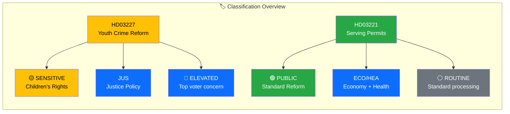

# Political Classification Results — 2026-03-26

**Generated**: 2026-03-31 05:37 UTC | **Analyst**: news-propositions workflow
**Data Sources**: get_propositioner, get_dokument_innehall
**Documents Analyzed**: 2 | **Riksmöte**: 2025/26
**Confidence**: MEDIUM

---

## Summary

Classified **2** government propositions by sensitivity, impact, urgency, and policy domain.

## Detailed Analysis

### HD03227 — Bättre möjligheter att utreda brott av unga lagöverträdare

| Field | Assessment |
|-------|-----------|
| **Sensitivity** | 🟡 SENSITIVE — touches children's rights and criminal procedure |
| **Primary Domain** | JUS (Justice) — Youth criminal investigation reform |
| **Secondary Domains** | Coalition Programme 2022–2026, Electoral Programme |
| **Urgency** | 🔵 ELEVATED — top voter concern, active media narrative |
| **Significance** | 🟠 7/10 (HIGH) |
| **Committee** | JuU (Justitieutskottet) — Tier 1 |
| **Department** | Justitiedepartementet |
| **Presenters** | Acting PM Ebba Busch (KD), Justice Minister Gunnar Strömmer (M) |
| **Confidence** | MEDIUM (74%) |

### HD03221 — Slopat matkrav för serveringstillstånd

| Field | Assessment |
|-------|-----------|
| **Sensitivity** | 🟢 PUBLIC — standard regulatory reform |
| **Primary Domain** | ECO (Economy) — Hospitality deregulation |
| **Secondary Domains** | HEA (Health — alcohol policy), Coalition Programme |
| **Urgency** | ⚪ ROUTINE — standard legislative processing |
| **Significance** | 🟡 5/10 (MEDIUM) |
| **Committee** | SoU (Socialutskottet) — Tier 2 |
| **Department** | Socialdepartementet |
| **Presenters** | Acting PM Ebba Busch (KD), Minister Elisabet Lann (KD) |
| **Confidence** | MEDIUM (72%) |

## Key Findings

1. HD03227 classified as SENSITIVE due to children's rights implications — requires editorial care in framing
2. HD03221 classified as PUBLIC — standard deregulation with no sensitivity concerns
3. Both propositions map to Tidö Agreement commitments — crime reform (Pillar 1) and deregulation (Pillar 3)

## Implications

Classification drives article prioritisation: HD03227 should lead as HIGH significance with ELEVATED urgency. HD03221 provides supporting context as MEDIUM significance ROUTINE processing.

## Data Quality Notes

Classification confidence: **MEDIUM**. Higher confidence achieved through full-text content enrichment. Committee tier mapping based on Riksdag committee hierarchy (JuU = Tier 1, SoU = Tier 2).