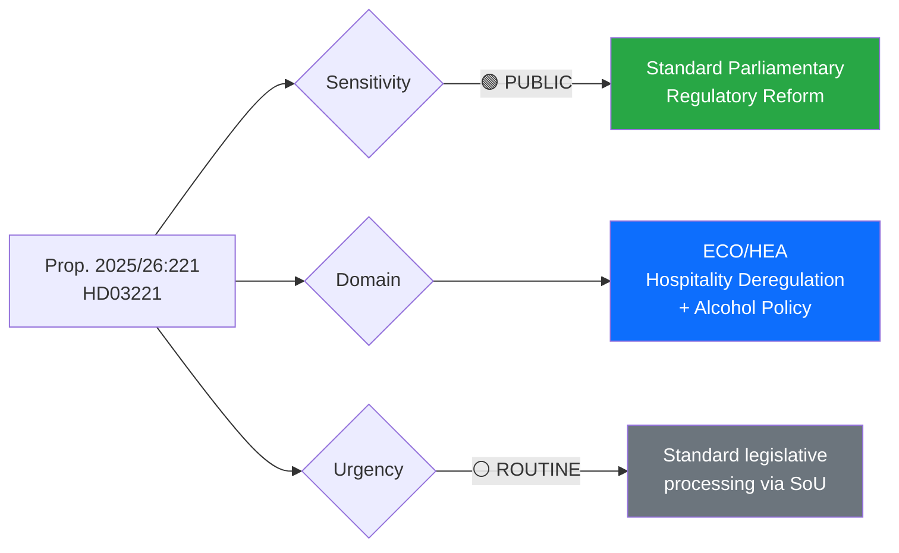

# Document Analysis: Slopat matkrav för serveringstillstånd

**Generated**: 2026-03-30 05:46 UTC
**dok_id**: HD03221
**Document Type**: propositions
**Committee**: SoU (Socialutskottet)
**Department**: Socialdepartementet
**Date**: 2026-03-26
**Presented by**: Ebba Busch, Elisabet Lann
**Riksmöte**: 2025/26
**Significance**: 🟡 Medium (5/10)
**Confidence**: MEDIUM (72%)

---

## Executive Summary

The government proposes removing the longstanding food-service requirement for alcohol serving permits (Prop. 2025/26:221), a deregulation measure that would significantly liberalise Sweden's hospitality sector. This aligns with the Kristersson government's broader deregulatory agenda and the Tidö Agreement's emphasis on reducing business administrative burden. **[MEDIUM confidence]** The proposition will be referred to SoU and has moderate political significance as it touches on alcohol policy — historically a sensitive issue in Swedish politics where temperance traditions remain influential.

- **[ECONOMIC]** Removes regulatory barriers for hospitality entrepreneurs, potentially increasing the number of licensed venues and lowering entry costs for bar and pub operators.
- **[GOVERNMENT]** Demonstrates delivery on the coalition's deregulation promises; Socialdepartementet under Minister Lann (KD) leads implementation.
- **[OPPOSITION]** S and V likely to raise public health concerns; MP may highlight alcohol-related social costs.
- **[MEDIA]** Moderate newsworthiness — affects everyday business and consumer experience; lifestyle media interest likely.
- **[INTERNATIONAL]** Aligns Sweden closer to European norms where food requirements for alcohol serving are less common.

## Document Content

**Title**: Slopat matkrav för serveringstillstånd (Removing Food Requirement for Serving Permits)
**Proposition Number**: 2025/26:221
**Summary**: The government proposes removing the current legal requirement that premises serving alcohol must also serve food. This deregulation simplifies the licensing process for bars, pubs, and nightclubs that do not operate as restaurants. Presented by Acting PM Ebba Busch and Minister Elisabet Lann (KD, Socialdepartementet).

## Political Classification

| Field | Assessment |
|-------|-----------|
| **Sensitivity Level** | PUBLIC |
| **Primary Domain** | ECO (Economy) / HEA (Health — alcohol policy) |
| **Urgency** | ROUTINE |
| **Significance Score** | 5/10 |
| **Confidence** | MEDIUM |

## SWOT Impact Assessment

### Government Coalition Impact

| Quadrant | Statement | Evidence | Confidence | Impact |
|----------|-----------|----------|:----------:|:------:|
| ✅ Strength | Delivers on Tidö Agreement deregulation promise — concrete business-friendly reform | dok_id: HD03221, Prop. 2025/26:221 | M | M |
| ✅ Strength | KD's Elisabet Lann presents — shows party policy delivery capacity | HD03221 presenter metadata | M | L |
| ⚠️ Weakness | May face public health criticism that government is weakening alcohol controls | Historical Swedish temperance debate | M | M |
| 🚀 Opportunity | Popular with hospitality sector — potential voter support from small business owners | HD03221 policy domain | M | M |
| 🔴 Threat | If alcohol-related incidents increase post-reform, political accountability risk | Prospective analysis | L | M |

### Opposition Impact

| Quadrant | Statement | Evidence | Confidence | Impact |
|----------|-----------|----------|:----------:|:------:|
| ✅ Strength | Can frame as government prioritising business over public health | HD03221 policy framing | M | M |
| ⚠️ Weakness | Hard to oppose popular deregulation without appearing nanny-state | Public sentiment analysis | L | M |
| 🚀 Opportunity | S/V can demand complementary public health measures as conditions | Parliamentary procedure | M | L |
| 🔴 Threat | High motion denial rate (96%) limits ability to amend the proposition | Coalition majority data | H | M |

## Stakeholder Perspective Analysis

### 🏛️ Government Perspective
- **Impact**: medium | **Sentiment**: positive | **Confidence**: 75%
- **Key Actors**: Ebba Busch (Acting PM), Elisabet Lann (KD, SoU), Socialdepartementet
- Part of government's broader deregulation agenda. SoU committee will process. Coalition should support unanimously given Tidö Agreement alignment.

### ⚖️ Opposition Perspective
- **Impact**: medium | **Sentiment**: negative | **Confidence**: 65%
- **Key Actors**: S (shadow social affairs), V (health policy spokesperson)
- Likely to raise alcohol-related harm statistics and demand public health safeguards. May file reservations (reservationer) at committee stage.

### 👥 Citizen Perspective
- **Impact**: medium | **Sentiment**: mixed | **Confidence**: 60%
- Consumers benefit from more venue choices; public health advocates concerned about increased alcohol accessibility. Nightlife-oriented demographics (18-35) likely supportive.

### 💰 Economic Perspective
- **Impact**: high | **Sentiment**: positive | **Confidence**: 75%
- **Key Actors**: Visita (hospitality industry), Svenskt Näringsliv, Chamber of Commerce
- Reduces regulatory burden and startup costs for bar/pub entrepreneurs. Estimated positive impact on small hospitality businesses.

### 🌍 International Perspective
- **Impact**: low | **Sentiment**: neutral | **Confidence**: 60%
- Aligns Sweden with most EU member states where food-service requirements for alcohol permits are less common. No EU regulatory conflict.

### 📰 Media Perspective
- **Impact**: medium | **Sentiment**: neutral-positive | **Confidence**: 70%
- Lifestyle and business media will cover positively. Tabloid framing around "easier to get a drink" expected. SVT/SR likely balanced coverage.

## Cross-Document References

- Related to Prop. 2025/26:210 (HD03210) — "Bidragsspärr och sanktionsavgift i socialförsäkringen" — both from Socialdepartementet, reflecting government's social policy reform package
- Context: Part of broader March 2026 legislative package from Socialdepartementet

## Significance Assessment

**Overall Score**: 5/10 — 🟡 Medium

**Scoring Factors**:
- Government proposition (high document type tier)
- SoU committee referral (social affairs — moderate visibility)
- Policy domain breadth: 3 domains — Economy, Health/Alcohol Policy, Business Deregulation
- Concrete regulatory change with measurable business impact
- Moderate public interest (alcohol policy is culturally significant in Sweden)

## Key Insights

1. **[ECONOMIC]** Removes a significant regulatory barrier for the hospitality sector — bars and pubs no longer need food kitchens. **[MEDIUM confidence]**
2. **[GOVERNMENT]** Demonstrates KD's policy delivery within the coalition on social affairs deregulation. **[MEDIUM confidence]**
3. **[OPPOSITION]** Creates an opening for S/V to challenge the government on public health prioritisation. **[MEDIUM confidence]**
4. **[MEDIA]** Expect broad media coverage given consumer relevance — affects restaurant/bar culture nationwide. **[MEDIUM confidence]**
5. **[INTERNATIONAL]** No EU regulatory conflict — aligns with common European practice. **[LOW confidence]**

## Forward Indicators

| Watch Item | Timeline | Trigger |
|-----------|----------|---------|
| SoU committee hearing | April–May 2026 | Committee schedules proposition for processing |
| Opposition reservations | Committee stage | S/V expected to file reservations with public health amendments |
| Industry reaction | 1–2 weeks | Visita and hospitality trade organisations expected to welcome |
| Public health debate | Ongoing | Folkhälsomyndigheten may issue statement on alcohol policy implications |

## Data Quality Notes

- **Analysis confidence**: MEDIUM (72%)
- **Full-text content**: Available via Riksdagen API (100KB proposition document)
- **Data sources**: get_propositioner, get_dokument (HD03221)
- **Analysis method**: 6-lens stakeholder analysis with SWOT extraction, MCP cross-reference
