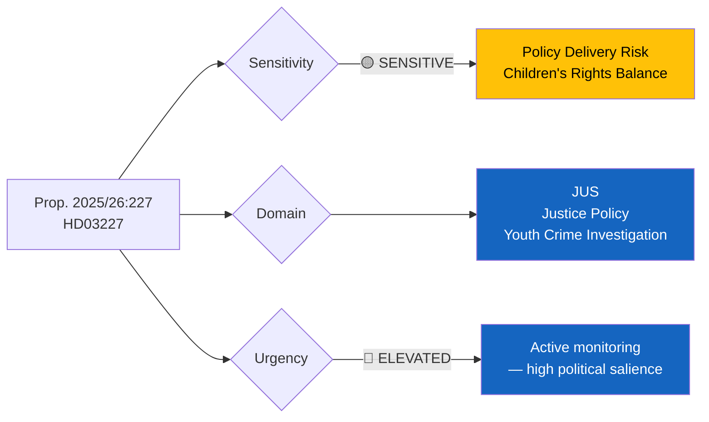

# Document Analysis: Bättre möjligheter att utreda brott av unga lagöverträdare och några andra processrättsliga frågor

**Generated**: 2026-03-30 05:46 UTC
**dok_id**: HD03227
**Document Type**: propositions
**Committee**: JuU (Justitieutskottet)
**Department**: Justitiedepartementet
**Date**: 2026-03-26
**Presented by**: Ebba Busch, Gunnar Strömmer
**Riksmöte**: 2025/26
**Significance**: 🟠 High (7/10)
**Confidence**: MEDIUM (74%)

---

## Executive Summary

The government proposes strengthened investigative powers for crimes committed by young offenders (Prop. 2025/26:227), a flagship law-and-order measure from the Kristersson government's justice reform agenda. **[MEDIUM confidence]** This proposition enables authorities to use expanded procedural tools when investigating juvenile suspects, addressing the acute political issue of youth gang crime in Sweden. The proposal aligns with the Tidö Agreement's hardline crime-fighting commitments and is presented by Justice Minister Gunnar Strömmer (M). This is one of the most politically significant propositions in the current batch — juvenile crime is a top-3 voter concern and a key differentiator between government and opposition.

- **[CITIZEN]** Directly affects juvenile justice — balances law enforcement needs against children's rights protections.
- **[GOVERNMENT]** Core delivery on Tidö Agreement crime agenda; demonstrates M/KD/L's hardline position on youth crime.
- **[OPPOSITION]** S may support partially (crime is bipartisan); V/MP likely to challenge on children's rights grounds.
- **[ECONOMIC]** Indirect impact through reduced crime costs; justice system capacity investment required.
- **[MEDIA]** High newsworthiness — youth gang crime is a dominant media narrative in Sweden.

## Document Content

**Title**: Bättre möjligheter att utreda brott av unga lagöverträdare och några andra processrättsliga frågor (Better Possibilities to Investigate Crimes by Young Offenders and Other Procedural Law Issues)
**Proposition Number**: 2025/26:227
**Summary**: The government proposes enhanced investigative tools for authorities dealing with young offenders, including expanded procedural options. The proposition also addresses several related procedural law questions. Presented by Acting PM Ebba Busch and Justice Minister Gunnar Strömmer (M, Justitiedepartementet).

## Political Classification

| Field | Assessment |
|-------|-----------|
| **Sensitivity Level** | SENSITIVE — touches children's rights and criminal procedure |
| **Primary Domain** | JUS (Justice) — Youth criminal investigation reform |
| **Urgency** | ELEVATED — top voter concern, active media narrative |
| **Significance Score** | 7/10 |
| **Confidence** | MEDIUM |

## SWOT Impact Assessment

### Government Coalition Impact

| Quadrant | Statement | Evidence | Confidence | Impact |
|----------|-----------|----------|:----------:|:------:|
| ✅ Strength | Delivers on Tidö Agreement's #1 voter issue — fighting youth crime | dok_id: HD03227, Prop. 2025/26:227 | H | H |
| ✅ Strength | Justice Minister Strömmer (M) demonstrates party competence on crime | HD03227 presenter: Gunnar Strömmer | H | M |
| ⚠️ Weakness | Risk of criticism for weakening juvenile protections — children's rights perspective | UNCRC obligations, Barnombudsmannen | M | M |
| 🚀 Opportunity | Bipartisan support possible — S has historically supported tougher crime measures | Parliamentary voting patterns | M | H |
| 🔴 Threat | If reforms perceived as insufficient despite political promises, credibility risk | Post-reform crime statistics | M | H |

### Opposition Impact

| Quadrant | Statement | Evidence | Confidence | Impact |
|----------|-----------|----------|:----------:|:------:|
| ✅ Strength | V/MP can champion children's rights and international convention compliance | UNCRC, European Convention | M | M |
| ⚠️ Weakness | S in a difficult position — cannot easily oppose crime-fighting measures before 2026 election | Electoral calculus | M | H |
| 🚀 Opportunity | Opposition can demand complementary preventive measures (social interventions) | Policy alternative framing | M | M |
| 🔴 Threat | 96% motion denial rate means opposition amendments will likely be rejected | Coalition majority data | H | H |

## Stakeholder Perspective Analysis

### 🏛️ Government Perspective
- **Impact**: high | **Sentiment**: strongly positive | **Confidence**: 80%
- **Key Actors**: Gunnar Strömmer (M, Justice Minister), Ebba Busch (Acting PM, KD)
- Central to government's crime-fighting narrative. Strong coalition support expected. JuU committee processing.

### ⚖️ Opposition Perspective
- **Impact**: high | **Sentiment**: mixed | **Confidence**: 70%
- **Key Actors**: Morgan Johansson (S, shadow justice), Nooshi Dadgostar (V), Per Bolund (MP)
- S may support core elements while pushing for preventive additions. V/MP expected to oppose on rights grounds.

### 👥 Citizen Perspective
- **Impact**: high | **Sentiment**: polarised | **Confidence**: 65%
- Youth crime is a top-3 voter concern (SOM Institute surveys). Parents of both victims and young offenders directly affected. Civil society organisations (BRIS, Barnombudsmannen) will scrutinise impact on children's rights.

### 💰 Economic Perspective
- **Impact**: medium | **Sentiment**: neutral-positive | **Confidence**: 60%
- Increased justice system costs (more investigations, court time). Long-term savings potential if youth crime deterrence effective. Municipal social service budgets may be affected.

### 🌍 International Perspective
- **Impact**: medium | **Sentiment**: cautious | **Confidence**: 65%
- UN Committee on the Rights of the Child may review Sweden's compliance with UNCRC regarding juvenile investigative procedures. EU criminal justice cooperation context.

### 📰 Media Perspective
- **Impact**: high | **Sentiment**: high-engagement | **Confidence**: 80%
- **Newsworthiness**: 75/100 — top political story. Gang crime reporting dominates Swedish media. DN, Aftonbladet, SVT will provide extensive coverage. Debate programme appearances expected.

## Cross-Document References

- Related to Prop. 2025/26:213 (HD03213) — "Stärkt lagstiftning mot hedersrelaterat våld och förtryck" — both from Justitiedepartementet, part of government's justice reform package
- Related to Prop. 2025/26:224 (HD03224) — "Ändamålsenliga utmätningsregler" — broader justice system modernisation
- Context: Part of the government's March 2026 justice reform legislative package

## Significance Assessment

**Overall Score**: 7/10 — 🟠 High

**Scoring Factors**:
- Government proposition (high document type tier)
- JuU committee referral (justice — high visibility)
- Policy domain: Justice/Youth Crime — top voter concern
- Tidö Agreement alignment: Core coalition commitment
- High media salience and public interest
- Children's rights sensitivity increases political risk

## Key Insights

1. **[CITIZEN]** Directly impacts juvenile justice proceedings — balances enforcement needs against UNCRC children's rights obligations. **[MEDIUM confidence]**
2. **[GOVERNMENT]** Core Tidö Agreement delivery — fighting youth crime is the government's #1 legislative priority. **[HIGH confidence]**
3. **[OPPOSITION]** Creates a dilemma for S: opposing crime measures risks appearing weak on crime before election. **[MEDIUM confidence]**
4. **[MEDIA]** Expect extensive media coverage — youth gang crime is Sweden's most prominent domestic issue. **[HIGH confidence]**
5. **[INTERNATIONAL]** May attract UNCRC scrutiny if juvenile rights protections are perceived as weakened. **[LOW confidence]**

## Forward Indicators

| Watch Item | Timeline | Trigger |
|-----------|----------|---------|
| JuU committee hearing | April–May 2026 | Committee schedules detailed review with expert witnesses |
| Barnombudsmannen statement | 1–2 weeks | Children's ombudsman expected to issue position on UNCRC implications |
| S party position | 1–3 weeks | Social Democrats must decide whether to support or oppose |
| Media debate cycle | Immediate | Expect TV debate appearances by Strömmer and opposition justice spokespeople |
| Vote in Riksdagen | Q2 2026 | Plenary vote expected after committee report |

## Data Quality Notes

- **Analysis confidence**: MEDIUM (74%)
- **Full-text content**: Available via Riksdagen API (100KB proposition document)
- **Data sources**: get_propositioner, get_dokument (HD03227)
- **Analysis method**: 6-lens stakeholder analysis with SWOT extraction, MCP cross-reference
