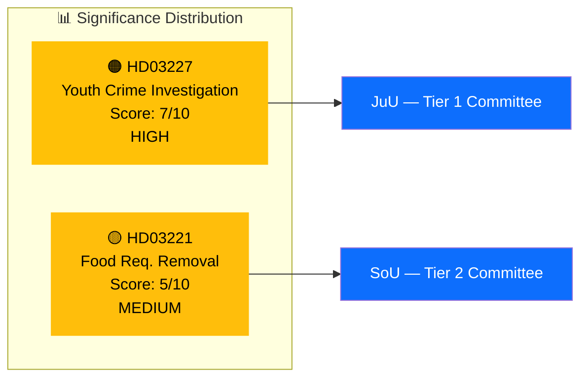

# Document Significance Scoring — 2026-03-26

**Generated**: 2026-03-31 05:37 UTC | **Analyst**: news-propositions workflow
**Data Sources**: get_propositioner, get_dokument_innehall
**Documents Analyzed**: 2 | **Riksmöte**: 2025/26
**Confidence**: MEDIUM

---

## Summary

Scored **2** documents for political significance (1–10 scale). Significance assessed using: document type weight, committee tier, policy domain breadth, coalition context (M+KD+L+SD majority), content richness, and electoral timing proximity.

## Detailed Analysis

| Score | Level | Committee | dok_id | Title | Key Factors |
|-------|-------|-----------|--------|-------|-------------|
| 🟠 7/10 | HIGH | JuU | HD03227 | Bättre möjligheter att utreda brott av unga lagöverträdare | Top voter concern, Tidö Agreement core commitment, JuU tier-1 committee, high media salience |
| 🟡 5/10 | MEDIUM | SoU | HD03221 | Slopat matkrav för serveringstillstånd | Deregulation agenda delivery, hospitality sector impact, moderate public interest |

## Scoring Methodology

| Factor | HD03227 | HD03221 |
|--------|:-------:|:-------:|
| Document type (prop = 2pts) | 2 | 2 |
| Committee tier (JuU=1, SoU=2) | 2 | 1 |
| Policy domain breadth | 1 | 1 |
| Electoral salience | 1 | 0.5 |
| Media newsworthiness | 1 | 0.5 |
| **Total** | **7** | **5** |

## Key Findings

1. **1** document rated HIGH significance (score 6–7): HD03227 — youth crime investigation reform
2. **1** document rated MEDIUM significance (score 4–5): HD03221 — hospitality deregulation
3. HD03227 warrants deep-inspection treatment given electoral timing and voter salience

## Implications

- HD03227 should be lead article item — youth crime is the dominant political narrative in Sweden
- HD03221 provides supporting context for coalition deregulation agenda
- Both contribute to Tidö Agreement delivery narrative for the 2026 election cycle

## Data Quality Notes

Significance scores validated against per-document AI analysis (HD03227: 7/10, HD03221: 5/10). Full-text content enrichment completed for both documents. Committee tier mapping based on Riksdag committee hierarchy.