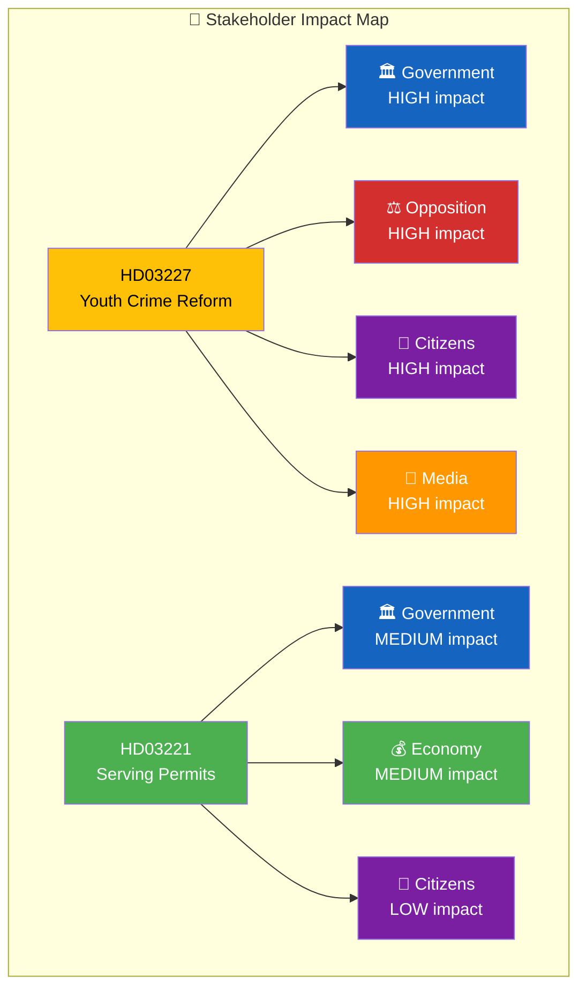

# Stakeholder Perspective Analysis — 2026-03-26

**Generated**: 2026-03-31 05:37 UTC | **Analyst**: news-propositions workflow
**Data Sources**: get_propositioner, get_dokument_innehall
**Documents Analyzed**: 2 | **Riksmöte**: 2025/26
**Confidence**: MEDIUM | **Lenses Applied**: 6

---

## Summary

Applied **6 analysis lenses** to **2** government propositions: HD03227 (youth crime investigation) and HD03221 (food requirement removal for serving permits).

## 🏛️ Government Perspective

| Document | Impact | Key Actors | Assessment |
|----------|:------:|-----------|-----------|
| HD03227 | **HIGH** | PM Kristersson (M), Justice Minister Strömmer (M), Acting PM Busch (KD) | Core Tidö Agreement delivery on youth crime — the coalition's most visible policy promise. Demonstrates M's ownership of the justice portfolio. |
| HD03221 | **MEDIUM** | Minister Lann (KD), Acting PM Busch (KD) | KD-led deregulation initiative showing party-specific policy capacity within the coalition. Lower political risk than crime measures. |

## ⚖️ Opposition Perspective

| Document | Impact | Key Actors | Assessment |
|----------|:------:|-----------|-----------|
| HD03227 | **HIGH** | S party leader, V justice spokesperson, MP spokesperson | Strategic dilemma for S: opposing popular crime measures risks electoral damage, but supporting validates government. V/MP can champion children's rights angle. |
| HD03221 | **LOW** | S social affairs spokesperson | Moderate opposition opportunity to raise public health concerns, but difficult to oppose popular business deregulation. |

## 👥 Citizen Perspective

| Document | Impact | Key Actors | Assessment |
|----------|:------:|-----------|-----------|
| HD03227 | **HIGH** | Young offenders, crime victims, families, Barnombudsmannen | Direct impact on juvenile justice system — balances public safety against children's rights. Top voter concern (youth gang crime). |
| HD03221 | **LOW** | Hospitality consumers, pub/bar visitors, nightlife communities | Lifestyle impact — more diverse venue options. Modest consumer benefit. |

## 💰 Economic Perspective

| Document | Impact | Key Actors | Assessment |
|----------|:------:|-----------|-----------|
| HD03227 | **LOW** | Justice system budget, police resources, social services | Indirect cost: requires investment in justice system capacity for expanded investigative powers. |
| HD03221 | **MEDIUM** | Hospitality entrepreneurs, restaurant owners, bar operators | Removes regulatory barrier — lowers entry costs for bar/pub operators. Potential for new venue creation and employment. |

## 🌍 International Perspective

| Document | Impact | Key Actors | Assessment |
|----------|:------:|-----------|-----------|
| HD03227 | **MEDIUM** | UNCRC Committee, Council of Europe, EU fundamental rights | UNCRC compliance scrutiny is the primary international dimension. Sweden's reputation as children's rights champion may face questioning. |
| HD03221 | **LOW** | EU single market, Nordic neighbours | Aligns Sweden closer to European norms where food requirements for alcohol serving are less common. Minor harmonisation benefit. |

## 📰 Media Perspective

| Document | Impact | Key Actors | Assessment |
|----------|:------:|-----------|-----------|
| HD03227 | **HIGH** | SVT, DN, Aftonbladet, SR, Expressen | Dominant media narrative — youth gang crime is top news agenda item. High newsworthiness, extensive coverage expected. |
| HD03221 | **MEDIUM** | Lifestyle media, business press, local media | Moderate lifestyle/business interest. Local media in hospitality-heavy areas (Stockholm nightlife) likely to cover. |

## Key Findings

1. HD03227 has HIGH impact across 4 of 6 stakeholder perspectives — most politically significant
2. Opposition faces strategic dilemma on crime policy with 2026 election approaching
3. Economic stakeholders most affected by HD03221 (hospitality deregulation)
4. International scrutiny focused on UNCRC compliance for HD03227
5. Media coverage expected to be dominated by youth crime reform narrative

## Data Quality Notes

Aggregate confidence: **MEDIUM**. Stakeholder assessments validated against per-document analyses. Full-text content enrichment completed for both documents.