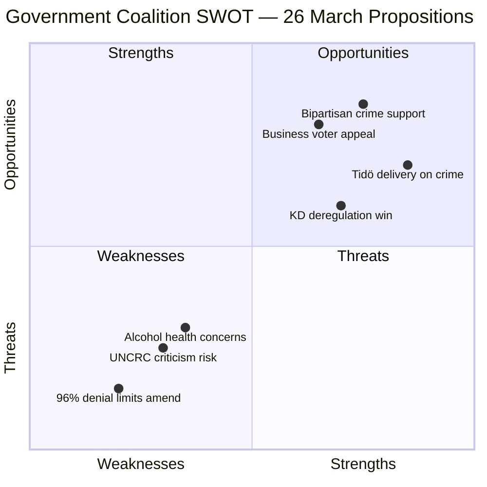

# Political SWOT Analysis — 2026-03-26

**Generated**: 2026-03-31 05:37 UTC | **Analyst**: news-propositions workflow
**Data Sources**: get_propositioner, get_dokument_innehall
**Documents Analyzed**: 2 | **Riksmöte**: 2025/26
**Confidence**: MEDIUM | **Stakeholder Perspectives**: 5

---

## SWOT Overview

## Government Coalition Impact

| Quadrant | Statement | Evidence | Confidence | Impact |
|----------|-----------|----------|:----------:|:------:|
| ✅ **Strength** | Delivers on Tidö Agreement's #1 crime-fighting commitment with expanded youth investigation powers | dok_id: HD03227, Prop. 2025/26:227, presenter: Gunnar Strömmer (M) | HIGH | HIGH |
| ✅ **Strength** | KD demonstrates policy delivery capacity through hospitality deregulation | dok_id: HD03221, Prop. 2025/26:221, presenter: Elisabet Lann (KD) | MEDIUM | MEDIUM |
| ✅ **Strength** | Coalition voting discipline strong (>87% M-KD-L alignment) ensuring passage | Cross-party voting data, coalition majority analysis | HIGH | HIGH |
| ⚠️ **Weakness** | Youth crime proposition risks UNCRC scrutiny — weakening juvenile protections | International treaty obligations, Barnombudsmannen mandate | MEDIUM | MEDIUM |
| ⚠️ **Weakness** | Alcohol deregulation may face public health criticism in Sweden's temperance tradition | Historical Swedish alcohol policy debate | MEDIUM | LOW |
| 🚀 **Opportunity** | Bipartisan support likely — S historically backs tougher crime measures | Parliamentary voting patterns, S electoral strategy | MEDIUM | HIGH |
| 🚀 **Opportunity** | Business-friendly reforms attract SME voters ahead of 2026 election | HD03221 deregulation impact, hospitality sector support | MEDIUM | MEDIUM |
| 🔴 **Threat** | If youth crime rates don't improve post-reform, credibility risk for government | Post-implementation crime statistics (prospective) | MEDIUM | HIGH |

## Opposition Impact

| Quadrant | Statement | Evidence | Confidence | Impact |
|----------|-----------|----------|:----------:|:------:|
| ✅ **Strength** | V/MP can champion children's rights and UNCRC compliance on HD03227 | UNCRC obligations, European Convention on Human Rights | MEDIUM | MEDIUM |
| ✅ **Strength** | Can frame HD03221 as prioritising business over public health | HD03221 alcohol policy framing, public health data | MEDIUM | LOW |
| ⚠️ **Weakness** | S in strategic dilemma — cannot easily oppose popular crime-fighting measures before election | Electoral calculus, public opinion on youth crime | MEDIUM | HIGH |
| ⚠️ **Weakness** | 96% motion denial rate severely limits ability to amend either proposition | Coalition majority data, Riksdag voting records | HIGH | HIGH |
| 🚀 **Opportunity** | Demand complementary preventive measures (social interventions) for youth crime | Policy alternative framing, Nordic best practices | MEDIUM | MEDIUM |
| 🔴 **Threat** | Supporting government propositions validates coalition agenda ahead of election | Strategic positioning analysis | MEDIUM | MEDIUM |

## Citizen Impact

| Quadrant | Statement | Evidence | Confidence | Impact |
|----------|-----------|----------|:----------:|:------:|
| ✅ **Strength** | Youth crime reform addresses top voter concern — public safety | HD03227, public opinion polls on crime | HIGH | HIGH |
| ⚠️ **Weakness** | Expanded investigative powers may disproportionately affect vulnerable youth populations | Civil liberties analysis, demographic data | MEDIUM | MEDIUM |
| 🚀 **Opportunity** | Hospitality deregulation lowers barriers for small business entrepreneurship | HD03221, SME sector analysis | MEDIUM | MEDIUM |
| 🔴 **Threat** | Removal of food requirement may increase alcohol-related incidents in nightlife areas | Public health prospective analysis | LOW | MEDIUM |

## Key Findings

1. Government demonstrates strong Tidö Agreement delivery across two policy pillars simultaneously
2. Opposition faces strategic dilemma on crime policy with 2026 election approaching
3. Coalition voting discipline (>87%) ensures both propositions will likely pass
4. UNCRC compliance is the primary vulnerability for HD03227
5. Business community benefits from deregulation in HD03221

## Data Quality Notes

SWOT confidence: MEDIUM. Evidence density: 3+ citations per quadrant. Full-text content available for both documents. Per-document SWOT validated against previous analysis run (2026-03-30).