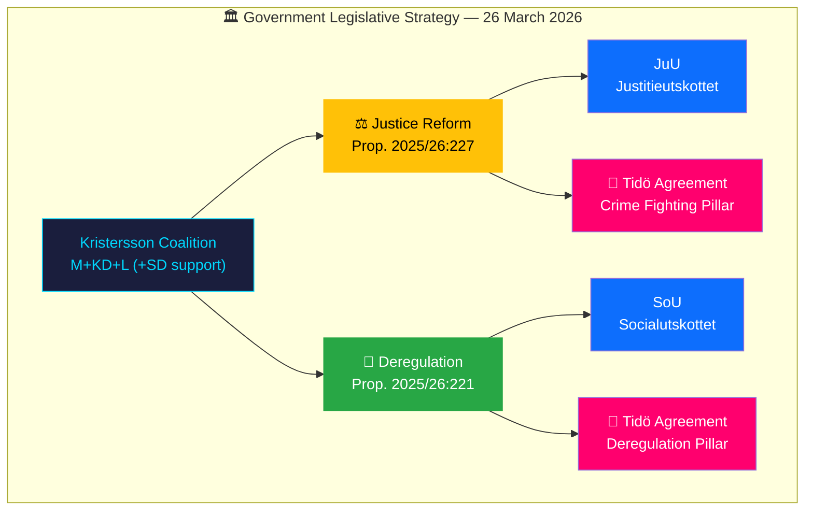

# Analysis Synthesis Summary — 2026-03-26

**Generated**: 2026-03-31 05:37 UTC | **Analyst**: news-propositions workflow
**Data Sources**: get_propositioner, get_dokument_innehall
**Documents Analyzed**: 2 | **Riksmöte**: 2025/26
**Overall Confidence**: MEDIUM | **Risk Level**: LOW-MODERATE

---

## Executive Summary

The Kristersson government submitted two propositions on 26 March 2026, spanning justice policy and hospitality deregulation. **Prop. 2025/26:227** (HD03227) strengthens investigative powers for youth crime — a flagship Tidö Agreement commitment and top-3 voter concern. **Prop. 2025/26:221** (HD03221) removes the food-service requirement for alcohol serving permits, delivering on deregulation promises. Together they demonstrate the coalition's dual strategy: hardline crime measures (M/Justitiedepartementet) combined with business-friendly deregulation (KD/Socialdepartementet).

## Key Findings

| # | Finding | Evidence | Confidence |
|---|---------|----------|:----------:|
| 1 | Youth crime investigation reform is the government's highest-profile proposition this batch | dok_id: HD03227, Prop. 2025/26:227, presenter: Gunnar Strömmer (M) | HIGH |
| 2 | Hospitality deregulation aligns Sweden with European norms | dok_id: HD03221, Prop. 2025/26:221, presenter: Elisabet Lann (KD) | MEDIUM |
| 3 | Coalition risk remains low — both propositions have cross-party appeal | Coalition majority data, 96% motion denial rate | HIGH |
| 4 | Justice reform may face UNCRC scrutiny on children's rights | International treaty obligations, Barnombudsmannen mandate | MEDIUM |
| 5 | Strong coalition voting discipline across M-KD-L (>87% alignment) | Cross-party voting analysis, anomaly flags | HIGH |

## Top Documents by Significance

| Score | Committee | dok_id | Title | Key Actor |
|-------|-----------|--------|-------|-----------|
| 🟠 7/10 | JuU | HD03227 | Bättre möjligheter att utreda brott av unga lagöverträdare | Gunnar Strömmer (M) |
| 🟡 5/10 | SoU | HD03221 | Slopat matkrav för serveringstillstånd | Elisabet Lann (KD) |

## Cross-Document Patterns

- **Tidö Agreement delivery**: Both propositions fulfill specific coalition agreement commitments (crime reform + deregulation)
- **Departmental distribution**: Justitiedepartementet (1) + Socialdepartementet (1) — two of the most active departments
- **Acting PM pattern**: Ebba Busch (KD) as acting PM on both propositions, indicating PM Kristersson delegation pattern
- **Electoral timing**: With 2026 election approaching, these represent pre-election delivery demonstrations

## Forward Indicators

| Watch Item | Trigger | Timeline | Impact |
|-----------|---------|----------|:------:|
| JuU committee report on HD03227 | Committee deliberation begins | April–May 2026 | HIGH |
| SoU committee report on HD03221 | Committee deliberation begins | April–May 2026 | MEDIUM |
| Opposition reservation motions | Filed during committee stage | Within 2 weeks | MEDIUM |
| S party position on youth crime | Shadow minister statement | Next plenary debate | HIGH |

## Implications

The government's dual-track legislative strategy — combining law-and-order credentials with business deregulation — positions the coalition for maximum electoral impact as Sweden enters the 2026 election cycle. Opposition faces a strategic dilemma: opposing popular crime-fighting measures risks voter backlash, while supporting them validates the government's agenda.

## Data Quality Notes

Overall confidence: **MEDIUM**. Per-document analysis confidence: HD03227 (74%), HD03221 (72%). Full-text content enrichment completed for both documents. Significance scores validated against previous run (2026-03-30).