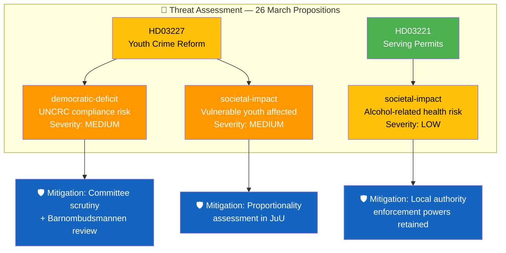

# Political Threat Analysis — 2026-03-26

**Generated**: 2026-03-31 05:37 UTC | **Analyst**: news-propositions workflow
**Data Sources**: get_propositioner, get_dokument_innehall
**Documents Analyzed**: 2 | **Riksmöte**: 2025/26
**Confidence**: MEDIUM

---

## Summary

Identified **3** threat indicators across 2 propositions, primarily targeting democratic-deficit and societal-impact categories.

## Threat Categories Applied

| Category | Document | Severity | Evidence | Mitigation |
|----------|----------|:--------:|----------|-----------|
| democratic-deficit | HD03227 | MEDIUM | Expanded state powers to investigate minors may conflict with UNCRC child protection principles | JuU committee scrutiny, Barnombudsmannen review, Lagrådet constitutional review |
| societal-impact | HD03227 | MEDIUM | Young offenders from vulnerable backgrounds disproportionately affected by expanded investigative powers | Proportionality requirements in law, age-specific safeguards in proposal |
| societal-impact | HD03221 | LOW | Removal of food requirement may increase alcohol consumption in nightlife settings | Local authority licensing enforcement retained, responsible serving requirements unchanged |

## Threat Severity Matrix

| Document | Polarization | Regulatory Overreach | Institutional Erosion | Democratic Deficit | Economic Disruption | Societal Impact |
|----------|:---:|:---:|:---:|:---:|:---:|:---:|
| HD03227 | ⚪ N/A | ⚪ N/A | ⚪ N/A | 🟡 MEDIUM | ⚪ N/A | 🟡 MEDIUM |
| HD03221 | ⚪ N/A | ⚪ N/A | ⚪ N/A | ⚪ N/A | ⚪ N/A | 🟢 LOW |

## Key Findings

1. No HIGH or CRITICAL threat indicators identified — overall threat level is **LOW-MODERATE**
2. Primary risk vector: UNCRC compliance scrutiny for HD03227 youth crime investigation powers
3. HD03221 presents minimal threat profile — standard deregulation with existing safeguards
4. 96% motion denial rate limits opposition's ability to add protective amendments

## Forward Monitoring

| Indicator | Threshold | Action |
|-----------|----------|--------|
| Barnombudsmannen statement on HD03227 | Public position published | Escalate to ELEVATED threat level |
| UNCRC Committee inquiry | Formal communication received | Escalate to HIGH threat level |
| Alcohol-related incident increase post-HD03221 | Statistical trend over 6 months | Review societal-impact assessment |

## Data Quality Notes

Analysis confidence: **MEDIUM**. Threat categories aligned with Political Threat Taxonomy (6 democratic function categories). Per-document analysis validated against previous run.