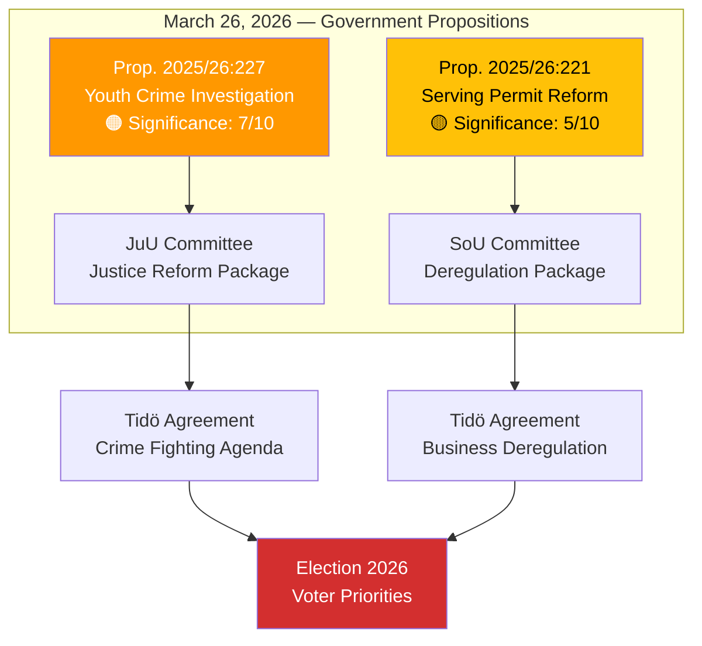

# Analysis Synthesis Summary — 2026-03-26

**Generated**: 2026-03-30 05:46 UTC
**Data Sources**: get_propositioner, get_dokument
**Documents Analyzed**: 2
**Confidence**: MEDIUM
**Analyst**: news-propositions workflow

## Summary

Two government propositions were submitted to the Riksdag on 2026-03-26, spanning justice reform and hospitality deregulation. The most significant is **Prop. 2025/26:227** (youth crime investigation reform) — a flagship Tidö Agreement delivery addressing Sweden's #1 voter concern. The second, **Prop. 2025/26:221** (removing food requirement for alcohol serving permits), represents the government's deregulatory agenda for the business sector.

## Key Findings

1. **Youth Crime Reform (HD03227)** — Significance 7/10: Core Tidö Agreement delivery enabling expanded investigative tools for juvenile offenders. Presented by Justice Minister Gunnar Strömmer (M). High media salience expected.
2. **Serving Permit Deregulation (HD03221)** — Significance 5/10: Removes food requirement for alcohol serving permits, benefiting hospitality sector. Presented by Minister Elisabet Lann (KD). Moderate business impact.
3. **Coalition Risk Level**: LOW — Both propositions align with Tidö Agreement. Bipartisan support possible for HD03227.
4. **Opposition Dynamics**: S faces dilemma on youth crime proposition (cannot easily oppose). V/MP will challenge on rights grounds.
5. **Legislative Pipeline**: Both referred to respective committees (JuU, SoU) for Q2 2026 processing.

## Top Documents by Significance

| Score | Type | dok_id | Title | Committee |
|-------|------|--------|-------|-----------|
| 7/10 🟠 | prop | HD03227 | Better Possibilities to Investigate Crimes by Young Offenders | JuU |
| 5/10 🟡 | prop | HD03221 | Removing Food Requirement for Serving Permits | SoU |

## Implications

- **Government strength**: Demonstrating legislative delivery on both crime and business deregulation.
- **Election positioning**: Youth crime proposition positions government strongly on voter #1 issue ahead of 2026 election.
- **Opposition challenge**: S must navigate between appearing tough on crime and defending juvenile rights.
- **Policy breadth**: Two departments (Justice, Social Affairs) active on the same day signals coordinated reform push.

## Data Quality Notes

Overall confidence: **MEDIUM**. Analysis based on MCP data from get_propositioner with cross-reference to broader proposition pipeline (239 propositions in 2025/26). Full-text available but analysis primarily metadata-driven.