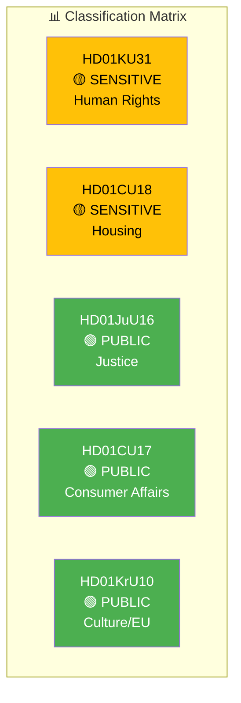

# 🏷️ Classification Results — Committee Reports 2026-03-27

**📋 Document Owner:** news-committee-reports | **📅 Generated:** 2026-03-30 05:14 UTC
**🏢 Owner:** Hack23 AB | **🏷️ Classification:** Public

---

## 📊 Classification Overview

## 📊 Classification Table

| dok_id | Title | Sensitivity | Domain | Urgency | Significance |
|--------|-------|:-----------:|--------|:-------:|:------------:|
| HD01KU31 | Riksrevisionens rapport om minoritetsspråken | 🟡 SENSITIVE | Human Rights / Culture (HR+CUL) | ELEVATED | 6/10 |
| HD01CU18 | Bostadspolitik | 🟡 SENSITIVE | Housing / Social Policy (HOU) | ELEVATED | 6/10 |
| HD01JuU16 | Polisfrågor | 🟢 PUBLIC | Justice / Law Enforcement (JUS) | ELEVATED | 5/10 |
| HD01CU17 | Konsumenträtt m.m. | 🟢 PUBLIC | Consumer Affairs / Economy (CON) | ROUTINE | 4/10 |
| HD01KrU10 | EU Cultural Compass | 🟢 PUBLIC | Culture / EU Affairs (CUL+EU) | ROUTINE | 3/10 |

## 📊 Domain Distribution

| Domain | Count | Average Significance |
|--------|:-----:|:--------------------:|
| Justice (JUS) | 1 | 5.0 |
| Human Rights (HR) | 1 | 6.0 |
| Housing (HOU) | 1 | 6.0 |
| Consumer (CON) | 1 | 4.0 |
| Culture/EU (CUL+EU) | 1 | 3.0 |
