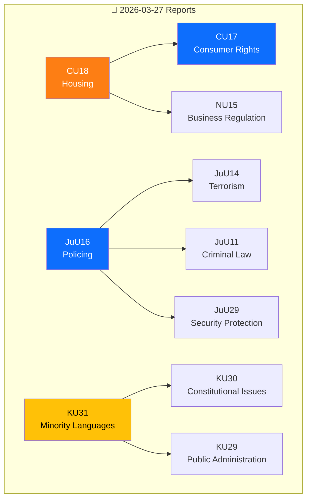

# 🔗 Cross-Reference Map — Committee Reports 2026-03-27

**📋 Document Owner:** news-committee-reports | **📅 Generated:** 2026-03-30 05:14 UTC
**🏢 Owner:** Hack23 AB | **🏷️ Classification:** Public

---

## 📊 Cross-Reference Network

## 📊 Cross-Reference Table

| Source | Target | Relationship |
|--------|--------|-------------|
| HD01CU18 | HD01CU17 | Same committee, same date — parallel processing |
| HD01CU18 | HD01NU15 | Business regulation impacts construction permits |
| HD01JuU16 | HD01JuU14 | Parallel justice committee reports |
| HD01JuU16 | HD01JuU11 | Criminal law framework for policing |
| HD01JuU16 | HD01JuU29 | Security protection legislation |
| HD01KU31 | HD01KU30 | Constitutional provisions on minorities |
| HD01KU31 | HD01KU29 | Public administration of minority services |
