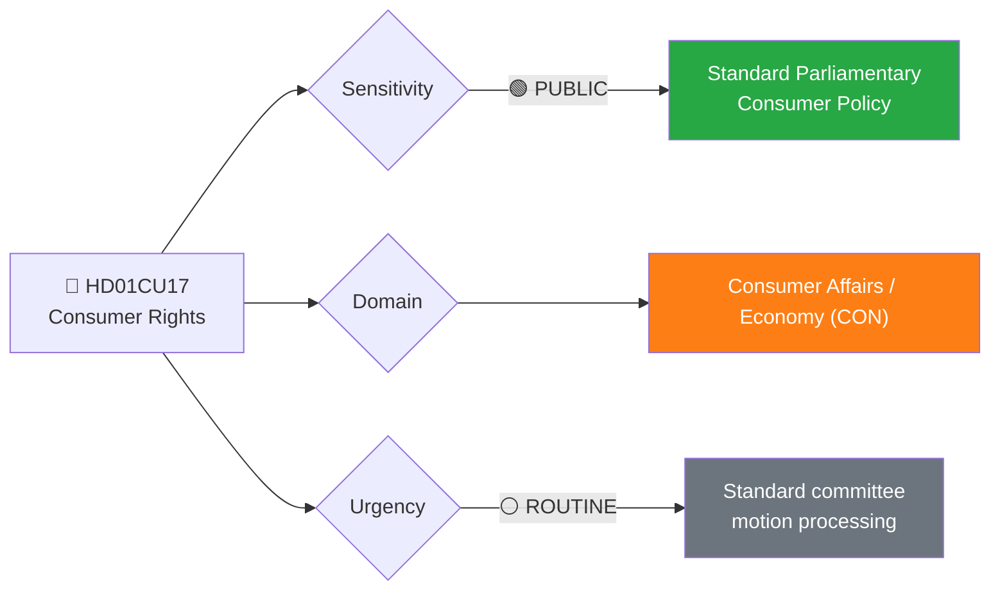
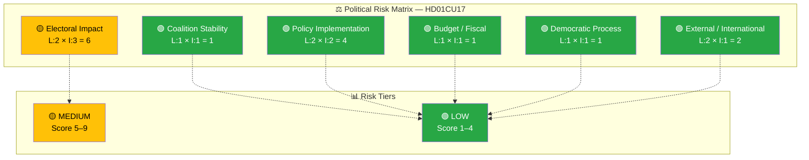

# 🔍 Per-File Political Intelligence Analysis: Consumer Rights

**📋 Document Owner:** news-committee-reports | **📄 Version:** 1.0 | **📅 Last Updated:** 2026-03-30 05:06 UTC
**🏢 Owner:** Hack23 AB | **🏷️ Classification:** Public

---

## 📋 Document Identity

| Field | Value |
|-------|-------|
| **Document ID** | `HD01CU17` |
| **Document Type** | `committeeReports` |
| **Title** | Konsumenträtt m.m. |
| **Date** | 2026-03-27 |
| **Riksmöte** | 2025/26 |
| **Source MCP Tool** | `get_betankanden` |
| **Analysis Timestamp** | 2026-03-30 05:06 UTC |
| **Analyst** | news-committee-reports |
| **Committee** | Civilutskottet (CU) |

---

## 🎯 Executive Summary

The Committee on Civil Affairs (CU) recommends rejection of **83 consumer rights motions** from the 2025 general motion period. The proposals span telemarketing regulation, child-targeted advertising restrictions, customer service accessibility, passenger rights, consumer credit oversight, debt management, consumer guidance, and sustainable consumption. The committee cites existing work and prior positions as grounds for rejection. Consumer protection is a cross-cutting policy area with broad public relevance — the high volume of rejected motions (83) across diverse topics reflects sustained parliamentary interest in strengthening consumer safeguards that the government coalition has opted not to pursue through new legislation this term. **[MEDIUM]**

---

## 📊 Political Classification

| Field | Assessment |
|-------|-----------|
| **Sensitivity Level** | PUBLIC |
| **Primary Domain** | Consumer Affairs / Economy (CON) |
| **Urgency** | ROUTINE — standard motion processing |
| **Significance Score** | 4/10 |
| **Confidence** | HIGH — summary with motion count and topic breakdown |

---

## 💪 SWOT Impact Assessment

### Government Coalition Impact

| Quadrant | Statement | Evidence | Confidence | Impact |
|----------|-----------|----------|:----------:|:------:|
| ✅ Strength | Consistent policy line — government avoids regulatory burden on businesses by rejecting consumer protection expansions | HD01CU17: "hänvisar bland annat till tidigare ställningstaganden" | H | M |
| ⚠️ Weakness | Rejection of proposals on child-targeted advertising and debt management may be criticized as prioritizing business interests over vulnerable consumers | HD01CU17: "reklam riktad till barn", "överskuldsättning" | M | M |
| 🚀 Opportunity | Can point to ongoing EU consumer protection harmonization as sufficient action | HD01CU17: "arbete inom de områden som förslagen gäller" | M | L |
| 🔴 Threat | Consumer advocacy groups may amplify specific rejected proposals (especially child advertising) in media campaigns | HD01CU17 | L | L |

### Opposition Impact

| Quadrant | Statement | Evidence | Confidence | Impact |
|----------|-----------|----------|:----------:|:------:|
| ✅ Strength | 83 rejected consumer proposals provide material for "government ignores consumer protection" narrative | HD01CU17: 83 rejected motions | H | M |
| ⚠️ Weakness | Consumer rights has lower voter salience than housing, policing, or healthcare — limits electoral leverage | HD01CU17 | M | M |
| 🚀 Opportunity | Specific topics like telemarketing abuse and debt traps resonate with voters — can be used for targeted messaging | HD01CU17: "telefonförsäljning", "konsumentkrediter" | M | M |
| 🔴 Threat | EU-level consumer protection directives may deliver reforms regardless, reducing opposition credit | HD01CU17, EU regulatory pipeline | L | L |

---

## ⚖️ Risk Assessment

| Risk Type | Likelihood (1–5) | Impact (1–5) | Score | Assessment |
|-----------|:-----------------:|:------------:|:-----:|------------|
| Coalition Stability | 1 | 1 | 1 | No friction — consumer rights is not a coalition dividing line |
| Policy Implementation | 2 | 2 | 4 | Low — existing consumer protection framework is functional; rejected proposals are enhancements |
| Budget / Fiscal | 1 | 1 | 1 | Minimal fiscal implications |
| Electoral Impact | 2 | 3 | 6 | Moderate — consumer issues resonate with specific demographics (seniors, families); telemarketing and debt topics have personal relevance |
| Democratic Process | 1 | 1 | 1 | Standard procedure followed |
| External / International | 2 | 1 | 2 | Low — EU consumer directives provide baseline protection regardless |

**Overall Risk Level:** 🟡 MEDIUM (marginal)
**Anomaly Flags:** None

---

## 👥 Stakeholder Impact Matrix

| Stakeholder | Impact Level | Key Assessment | Confidence |
|------------|:------------:|----------------|:----------:|
| 🏛️ Government | LOW | Standard motion rejection; minimal political risk from consumer policy area | H |
| ⚖️ Opposition | MEDIUM | Material for consumer protection advocacy; limited electoral leverage | M |
| 👥 Citizens | MEDIUM | Rejected proposals on telemarketing, child advertising, and debt management affect daily consumer experience | H |
| 💰 Economic | MEDIUM | Business sector benefits from avoided regulation; consumer credit and telemarketing industries particularly affected | M |
| 🌍 International | LOW | EU consumer protection harmonization provides baseline; limited international dimension | M |
| 📰 Media | LOW | Consumer rights has moderate media interest; specific stories (telemarketing scams, child advertising) may generate coverage | M |

---

## 🔮 Forward Indicators

| # | Indicator | Timeline | Trigger Condition | Watch Priority |
|---|-----------|----------|-------------------|:--------------:|
| 1 | EU consumer protection directive implementation affecting Swedish law | 6–18 months | Transposition deadlines for pending EU directives | 🟡 |
| 2 | Consumer ombudsman (KO) annual report highlighting areas of concern | 3–6 months | Report publication referencing rejected motion topics | 🟢 |
| 3 | Plenary vote on CU17 | 1–3 weeks | Vote scheduled in kammarens föredragningslista | 🟢 |

---

## 🔗 Cross-References

| Related Document | Relationship | dok_id |
|-----------------|-------------|--------|
| Bostadspolitik (CU18) | Parallel Civil Affairs committee report — same committee, same date | HD01CU18 |
| Regelförenkling för företag (NU15) | Related — business regulation impacts consumer protection delivery | HD01NU15 |

---

## 📊 Data Quality Assessment

| Metric | Value |
|--------|-------|
| **Source Completeness** | Full — summary with motion count and detailed topic areas |
| **Evidence Density** | 5 evidence points cited |
| **Temporal Currency** | Current (published 2026-03-27) |
| **Analytical Confidence** | HIGH |
