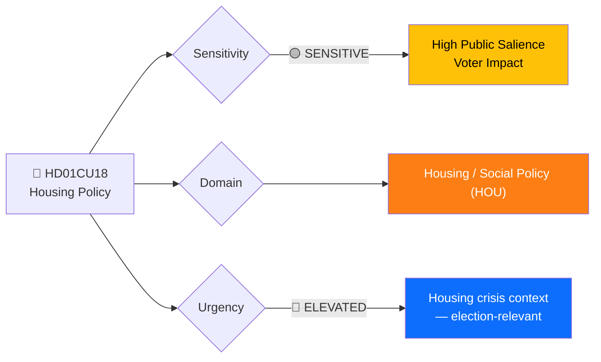
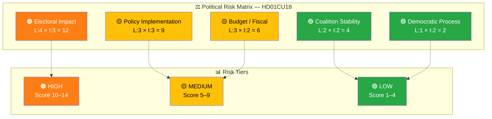

# 🔍 Per-File Political Intelligence Analysis: Housing Policy

**📋 Document Owner:** news-committee-reports | **📄 Version:** 1.0 | **📅 Last Updated:** 2026-03-30 05:04 UTC
**🏢 Owner:** Hack23 AB | **🏷️ Classification:** Public

---

## 📋 Document Identity

| Field | Value |
|-------|-------|
| **Document ID** | `HD01CU18` |
| **Document Type** | `committeeReports` |
| **Title** | Bostadspolitik |
| **Date** | 2026-03-27 |
| **Riksmöte** | 2025/26 |
| **Source MCP Tool** | `get_betankanden` |
| **Analysis Timestamp** | 2026-03-30 05:04 UTC |
| **Analyst** | news-committee-reports |
| **Committee** | Civilutskottet (CU) |

---

## 🎯 Executive Summary

The Committee on Civil Affairs (CU) recommends rejection of **131 housing policy motions** from the 2025 general motion period — one of the highest single-committee rejection volumes this riksmöte. The motions span critical areas: housing market interventions, construction financing, public housing companies (allmännyttan), anti-segregation measures, and circular economy in construction. The committee cites "already taken measures and ongoing work" as grounds for rejection. With Sweden's housing crisis as a persistent political pressure point — affecting young voters, immigrants, and urban populations disproportionately — this mass rejection signals the government's preference for existing policy trajectory over the structural reforms demanded by opposition parties. **[MEDIUM]**

---

## 📊 Political Classification

| Field | Assessment |
|-------|-----------|
| **Sensitivity Level** | SENSITIVE — housing crisis is a top voter concern |
| **Primary Domain** | Housing / Social Policy (HOU) |
| **Urgency** | ELEVATED — housing shortage affecting multiple demographics |
| **Significance Score** | 6/10 |
| **Confidence** | HIGH — clear summary with motion count and policy areas |

---

## 💪 SWOT Impact Assessment

### Government Coalition Impact

| Quadrant | Statement | Evidence | Confidence | Impact |
|----------|-----------|----------|:----------:|:------:|
| ✅ Strength | Government maintains policy consistency — rejection of 131 motions signals commitment to existing housing strategy rather than ad-hoc changes | HD01CU18: "hänvisar i första hand till redan vidtagna åtgärder och pågående arbete" | H | M |
| ⚠️ Weakness | Mass rejection (131 motions) risks being framed as government indifference to Sweden's housing crisis | HD01CU18: 131 rejected motions spanning housing market, construction, anti-segregation | H | H |
| 🚀 Opportunity | Can highlight ongoing reforms (e.g., planning process simplification, construction start-up subsidies) as evidence of active housing policy | HD01CU18: "redan vidtagna åtgärder" | M | M |
| 🔴 Threat | Housing shortage persists as top voter concern — opposition can campaign on "government rejected 131 housing solutions" narrative | HD01CU18: 131 motions including segregation and public housing proposals | H | H |

### Opposition Impact

| Quadrant | Statement | Evidence | Confidence | Impact |
|----------|-----------|----------|:----------:|:------:|
| ✅ Strength | 131 rejected motions provide extensive ammunition for housing crisis narrative — covers everything from public housing to circular economy | HD01CU18: breadth of rejected topics | H | H |
| ⚠️ Weakness | Sheer volume of motions (131) may dilute impact — opposition lacks a unified housing reform package to contrast with | HD01CU18 | M | M |
| 🚀 Opportunity | Can craft targeted campaign messaging around specific rejected proposals (e.g., anti-segregation measures) that resonate with key voter segments | HD01CU18: "åtgärder mot segregation och utanförskap" | H | H |
| 🔴 Threat | Government may announce targeted housing measures before election, neutralizing opposition criticism | HD01CU18, budget cycle | M | M |

---

## ⚖️ Risk Assessment

| Risk Type | Likelihood (1–5) | Impact (1–5) | Score | Assessment |
|-----------|:-----------------:|:------------:|:-----:|------------|
| Coalition Stability | 2 | 2 | 4 | Low — housing policy approach is consensus within M+KD+L coalition; SD may push for stricter anti-segregation measures |
| Policy Implementation | 3 | 3 | 9 | Significant — housing shortage persistence despite "ongoing work" undermines government credibility |
| Budget / Fiscal | 3 | 2 | 6 | Moderate — housing construction subsidies and public housing investment have meaningful fiscal implications |
| Electoral Impact | 4 | 3 | 12 | **HIGH** — housing is a top-3 voter concern; 131 rejected motions in election approach is politically risky |
| Democratic Process | 1 | 2 | 2 | Low — standard committee procedure; bulk motion rejection is procedurally normal |

**Overall Risk Level:** 🟠 HIGH (driven by electoral impact score of 12)
**Risk-to-SWOT:** Electoral Impact score 12 → added as SWOT Threat entry for government.

---

## 👥 Stakeholder Impact Matrix

| Stakeholder | Impact Level | Key Assessment | Confidence |
|------------|:------------:|----------------|:----------:|
| 🏛️ Government | HIGH | 131 rejected housing motions creates significant electoral vulnerability; must demonstrate housing policy results before 2026 election | H |
| ⚖️ Opposition | HIGH | Extensive campaign ammunition on housing crisis — can select specific rejected proposals for targeted messaging | H |
| 👥 Citizens | HIGH | Directly affects housing access, construction rates, and anti-segregation efforts — young voters and immigrants particularly impacted | H |
| 💰 Economic | HIGH | Housing market interventions, construction financing, and circular economy proposals all have significant economic implications for construction industry and real estate market | H |
| 🌍 International | LOW | Housing policy is primarily domestic; limited international dimension | L |
| 📰 Media | HIGH | Housing crisis is consistently newsworthy; "131 rejected housing proposals" is a strong headline | H |

---

## 🔮 Forward Indicators

| # | Indicator | Timeline | Trigger Condition | Watch Priority |
|---|-----------|----------|-------------------|:--------------:|
| 1 | Plenary debate on CU18 with opposition criticism of rejected motions | 1–3 weeks | Scheduled in kammarens föredragningslista; watch for party spokesperson statements | 🟠 |
| 2 | Government housing policy announcement or proposition | 1–6 months | Anticipatory measures before election season | 🟠 |
| 3 | Housing construction statistics (SCB) showing trends | Quarterly | SCB Bostadsbyggande data showing if government's approach is delivering results | 🟡 |
| 4 | Opposition alternative budget motions on housing | September 2026 | Budget motions including specific housing investment proposals citing CU18 rejections | 🟡 |

---

## 🔗 Cross-References

| Related Document | Relationship | dok_id |
|-----------------|-------------|--------|
| Konsumenträtt m.m. (CU17) | Parallel Civil Affairs committee report | HD01CU17 |
| Regelförenkling för företag (NU15) | Related — business regulation simplification may affect construction permits | HD01NU15 |

---

## 📊 Data Quality Assessment

| Metric | Value |
|--------|-------|
| **Source Completeness** | Full — summary with motion count, topic areas, and committee rationale |
| **Evidence Density** | 6 evidence points cited |
| **Temporal Currency** | Current (published 2026-03-27) |
| **Analytical Confidence** | HIGH |
