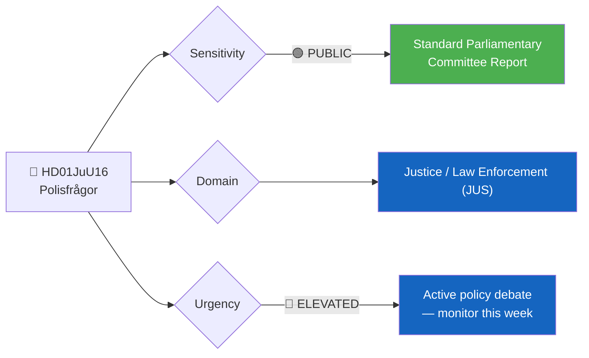
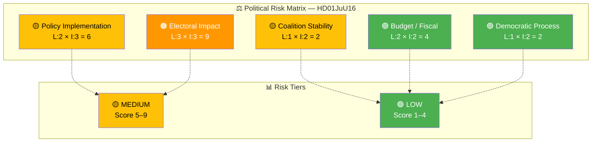

# 🔍 Per-File Political Intelligence Analysis: Polisfrågor

**📋 Document Owner:** news-committee-reports | **📄 Version:** 1.0 | **📅 Last Updated:** 2026-03-30 04:57 UTC
**🏢 Owner:** Hack23 AB | **🏷️ Classification:** Public

---

## 📋 Document Identity

| Field | Value |
|-------|-------|
| **Document ID** | `HD01JuU16` |
| **Document Type** | `committeeReports` |
| **Title** | Polisfrågor |
| **Date** | 2026-03-27 |
| **Riksmöte** | 2025/26 |
| **Source MCP Tool** | `get_betankanden` |
| **Analysis Timestamp** | 2026-03-30 04:57 UTC |
| **Analyst** | news-committee-reports |
| **Committee** | Justitieutskottet (JuU) |

---

## 🎯 Executive Summary

The Committee on Justice (JuU) has reviewed policing matters as part of its annual assessment of motions from the 2025 general motion period. This report (HD01JuU16) addresses core law enforcement policy—a domain of high political salience given the current government's law-and-order profile. While no summary text was provided by the Riksdag API, the committee's handling of police-related motions during a period of intense security policy debate makes this a significant indicator of government legislative priorities and opposition pressure points in the justice domain. **[MEDIUM]**

---

## 📊 Political Classification

| Field | Assessment |
|-------|-----------|
| **Sensitivity Level** | PUBLIC |
| **Primary Domain** | Justice / Law Enforcement (JUS) |
| **Urgency** | ELEVATED — active government priority area |
| **Significance Score** | 5/10 |
| **Confidence** | MEDIUM — metadata only, no full summary available |

---

## 💪 SWOT Impact Assessment

### Government Coalition Impact

| Quadrant | Statement | Evidence | Confidence | Impact |
|----------|-----------|----------|:----------:|:------:|
| ✅ Strength | Government's law-and-order agenda is reinforced by committee processing of police motions — demonstrates legislative activity in a core priority area | HD01JuU16, government coalition programme emphasizing policing | M | M |
| ⚠️ Weakness | High motion denial rate (96% across this riksmöte) may signal inflexibility toward constructive opposition proposals on policing | HD01JuU16 + cross-reference with motion denial statistics | M | L |
| 🚀 Opportunity | Opportunity to highlight policing investments ahead of 2026 budget cycle — committee report provides cover for expanded police funding | HD01JuU16, budget cycle timing | M | M |
| 🔴 Threat | If opposition frames denied motions as government inaction on specific policing gaps (rural policing, cybercrime), media attention could shift | HD01JuU16, opposition motion themes | L | L |

### Opposition Impact

| Quadrant | Statement | Evidence | Confidence | Impact |
|----------|-----------|----------|:----------:|:------:|
| ✅ Strength | Opposition can highlight specific rejected proposals as evidence of government neglecting policing reform | HD01JuU16 | M | M |
| ⚠️ Weakness | 96% denial rate means opposition legislative impact via motions is minimal in the justice domain | Cross-reference: riksmöte 2025/26 denial statistics | H | M |
| 🚀 Opportunity | Can use rejected motions as campaign material for 2026 election cycle — "the government rejected our police proposals" | HD01JuU16 | M | M |
| 🔴 Threat | Government may co-opt opposition policing ideas through propositions, neutralizing the issue | HD01JuU16, proposition pipeline | L | L |

---

## ⚖️ Risk Assessment

| Risk Type | Likelihood (1–5) | Impact (1–5) | Score | Assessment |
|-----------|:-----------------:|:------------:|:-----:|------------|
| Coalition Stability | 1 | 2 | 2 | Low risk — policing is a consensus area for M+KD+L+SD coalition |
| Policy Implementation | 2 | 3 | 6 | Moderate risk — rejected motions may indicate gaps in police reform delivery |
| Budget / Fiscal | 2 | 2 | 4 | Low-moderate — police funding is secured but expansion targets may be at risk |
| Electoral Impact | 3 | 3 | 9 | Elevated — policing is a top voter concern; denied reforms could become campaign ammunition |
| Democratic Process | 1 | 2 | 2 | Low — standard committee procedure followed |

**Overall Risk Level:** 🟡 MEDIUM
**Anomaly Flags:** Metadata-only document (no summary provided by API) — unusual for a committee report

---

## 👥 Stakeholder Impact Matrix

| Stakeholder | Impact Level | Key Assessment | Confidence |
|------------|:------------:|----------------|:----------:|
| 🏛️ Government | MEDIUM | Reinforces law-and-order agenda; committee processing signals active governance on policing priorities | M |
| ⚖️ Opposition | MEDIUM | Rejected motions provide campaign material but demonstrate limited legislative influence | M |
| 👥 Citizens | MEDIUM | Direct impact on police presence, response times, and public safety — outcomes depend on which motions were rejected | M |
| 💰 Economic | LOW | Indirect fiscal impact through police budget allocations | L |
| 🌍 International | LOW | Policing policy is primarily domestic; limited EU dimension unless cross-border crime measures involved | L |
| 📰 Media | MEDIUM | Law enforcement is consistently newsworthy; specific rejected proposals may generate coverage | M |

---

## 🔮 Forward Indicators

| # | Indicator | Timeline | Trigger Condition | Watch Priority |
|---|-----------|----------|-------------------|:--------------:|
| 1 | Riksdag plenary vote on JuU16 | 1–3 weeks | Vote scheduled in kammarens föredragningslista | 🟠 |
| 2 | Government proposition on police expansion | 1–6 months | Budget proposition (höstbudgeten 2026) with police funding details | 🟡 |
| 3 | Opposition debate speeches referencing denied motions | 1–2 weeks | Anföranden in plenary citing rejected JuU16 proposals | 🟡 |

---

## 🔗 Cross-References

| Related Document | Relationship | dok_id |
|-----------------|-------------|--------|
| Terrorism (JuU) | Parallel justice committee report | HD01JuU14 |
| Straffrättsliga frågor (JuU) | Parallel criminal law report | HD01JuU11 |
| Stärkt säkerhetsskydd (JuU) | Related security legislation | HD01JuU29 |

---

## 📊 Data Quality Assessment

| Metric | Value |
|--------|-------|
| **Source Completeness** | Metadata only — no summary text from API |
| **Evidence Density** | 3 evidence points cited |
| **Temporal Currency** | Current (published 2026-03-27) |
| **Analytical Confidence** | MEDIUM |
