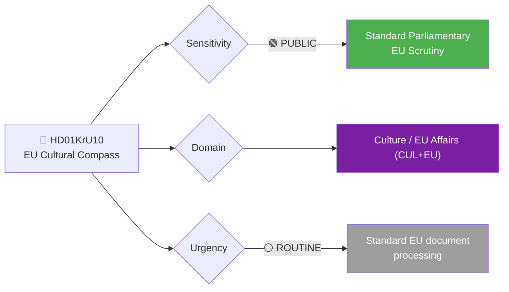
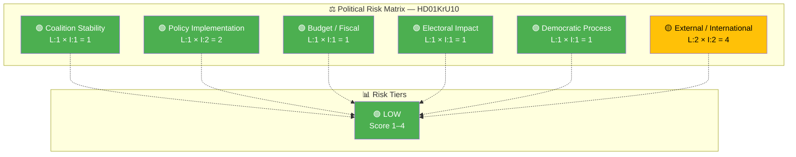

# 🔍 Per-File Political Intelligence Analysis: EU Cultural Compass

**📋 Document Owner:** news-committee-reports | **📄 Version:** 1.0 | **📅 Last Updated:** 2026-03-30 05:00 UTC
**🏢 Owner:** Hack23 AB | **🏷️ Classification:** Public

---

## 📋 Document Identity

| Field | Value |
|-------|-------|
| **Document ID** | `HD01KrU10` |
| **Document Type** | `committeeReports` |
| **Title** | Kommissionens meddelande om en kulturkompass för Europa |
| **Date** | 2026-03-27 |
| **Riksmöte** | 2025/26 |
| **Source MCP Tool** | `get_betankanden` |
| **Analysis Timestamp** | 2026-03-30 05:00 UTC |
| **Analyst** | news-committee-reports |
| **Committee** | Kulturutskottet (KrU) |

---

## 🎯 Executive Summary

The Culture Committee (KrU) has examined the European Commission's November 2025 communication on a "Cultural Compass for Europe" — a comprehensive EU strategy spanning cultural rights, support for artists, cultural heritage competitiveness, and international cultural partnerships. The committee's response reveals a nuanced Swedish position: welcoming EU-level cultural mapping and cross-border exchanges while firmly asserting national sovereignty over working conditions for cultural workers. The recommendation to file the statement (lägga till handlingarna) signals standard EU subsidiary handling, but the sovereignty emphasis on labour conditions is a notable political marker reflecting Sweden's consistent position on EU social policy encroachment. **[HIGH]**

---

## 📊 Political Classification

| Field | Assessment |
|-------|-----------|
| **Sensitivity Level** | PUBLIC |
| **Primary Domain** | Culture / EU Affairs (CUL+EU) |
| **Urgency** | ROUTINE — EU communication filing |
| **Significance Score** | 3/10 |
| **Confidence** | HIGH — full summary available with detailed committee position |

---

## 💪 SWOT Impact Assessment

### Government Coalition Impact

| Quadrant | Statement | Evidence | Confidence | Impact |
|----------|-----------|----------|:----------:|:------:|
| ✅ Strength | Committee endorses government's EU policy line — welcoming cultural cooperation while protecting national sovereignty on labour policy | HD01KrU10: "den nationella bestämmanderätten på området behöver respekteras" | H | M |
| ⚠️ Weakness | Filing the statement indicates limited Swedish ambition to shape EU cultural policy proactively | HD01KrU10: recommendation to file (lägga till handlingarna) | M | L |
| 🚀 Opportunity | Cultural heritage digitalization and cross-border exchange programmes offer opportunities for Swedish cultural exports | HD01KrU10: committee welcomes "digitalisering av kulturarv" | M | L |
| 🔴 Threat | Minimal — EU cultural policy has low domestic political friction | HD01KrU10 | L | L |

### Opposition Impact

| Quadrant | Statement | Evidence | Confidence | Impact |
|----------|-----------|----------|:----------:|:------:|
| ✅ Strength | Limited — no significant opposition leverage from an EU cultural communication | HD01KrU10 | M | L |
| ⚠️ Weakness | Opposition's inability to shape EU cultural agenda via committee process | HD01KrU10 | L | L |
| 🚀 Opportunity | Could advocate for stronger Swedish engagement in EU cultural funding for domestic arts sector | HD01KrU10: "finansieringsprogram som finns bör användas" | M | L |
| 🔴 Threat | Government's sovereignty framing on cultural worker conditions may constrain future Nordic cultural cooperation proposals | HD01KrU10 | L | L |

---

## ⚖️ Risk Assessment

| Risk Type | Likelihood (1–5) | Impact (1–5) | Score | Assessment |
|-----------|:-----------------:|:------------:|:-----:|------------|
| Coalition Stability | 1 | 1 | 1 | No coalition friction — EU cultural policy is consensus territory |
| Policy Implementation | 1 | 2 | 2 | Low — filing recommendation means no domestic implementation required |
| Budget / Fiscal | 1 | 1 | 1 | Minimal — existing EU funding programmes referenced, no new Swedish spending |
| Electoral Impact | 1 | 1 | 1 | Negligible voter interest in EU cultural communications |
| Democratic Process | 1 | 1 | 1 | Standard EU scrutiny procedure followed |
| External / International | 2 | 2 | 4 | Moderate — sovereignty assertion on artist working conditions may affect Nordic cultural cooperation agenda |

**Overall Risk Level:** 🟢 LOW
**Anomaly Flags:** None

---

## 🎭 Threat Analysis (STRIDE-Adapted)

| STRIDE Category | Applicable? | Threat Description | Severity (1–5) | Evidence |
|----------------|:-----------:|-------------------|:--------------:|----------|
| 🎭 Spoofing | N | — | — | — |
| 🔧 Tampering | N | — | — | — |
| 📝 Repudiation | N | — | — | — |
| 🔓 Info Disclosure | N | — | — | — |
| 🚫 Denial of Service | N | — | — | — |
| ⬆️ Elevation | N | — | — | — |

---

## 👥 Stakeholder Impact Matrix

| Stakeholder | Impact Level | Key Assessment | Confidence |
|------------|:------------:|----------------|:----------:|
| 🏛️ Government | LOW | Reinforces existing EU policy position; no policy changes required | H |
| ⚖️ Opposition | LOW | Limited leverage from EU cultural communication | M |
| 👥 Citizens | LOW | Indirect benefit through cultural heritage digitalization and cross-border cultural access | M |
| 💰 Economic | LOW | Cultural sector may benefit from EU funding programmes, but no direct domestic fiscal impact | M |
| 🌍 International | MEDIUM | Signals Sweden's position on EU cultural policy — sovereignty emphasis on labour conditions is relevant for EU social policy negotiations | H |
| 📰 Media | LOW | Low newsworthiness — EU cultural policy rarely generates domestic media coverage | H |

---

## 🔮 Forward Indicators

| # | Indicator | Timeline | Trigger Condition | Watch Priority |
|---|-----------|----------|-------------------|:--------------:|
| 1 | EU Council cultural ministers meeting addressing Cultural Compass implementation | 3–6 months | Swedish government position statement in Council | 🟢 |
| 2 | EU cultural funding programme applications from Swedish institutions | 6–12 months | Increased Swedish participation in Creative Europe programme | 🟢 |

---

## 🔗 Cross-References

| Related Document | Relationship | dok_id |
|-----------------|-------------|--------|
| None identified | — | — |

---

## 📊 Data Quality Assessment

| Metric | Value |
|--------|-------|
| **Source Completeness** | Full — detailed committee summary with 4 strategic directions analysed |
| **Evidence Density** | 5 evidence points cited |
| **Temporal Currency** | Current (published 2026-03-27) |
| **Analytical Confidence** | HIGH |
