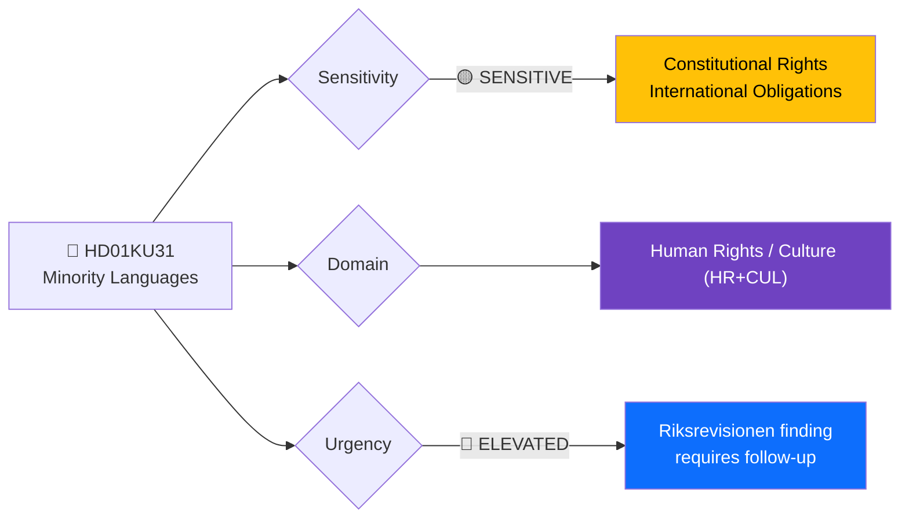
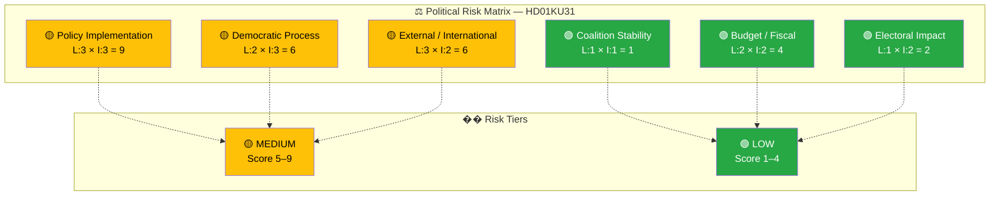

# 🔍 Per-File Political Intelligence Analysis: National Minority Languages

**📋 Document Owner:** news-committee-reports | **📄 Version:** 1.0 | **📅 Last Updated:** 2026-03-30 05:02 UTC
**🏢 Owner:** Hack23 AB | **🏷️ Classification:** Public

---

## 📋 Document Identity

| Field | Value |
|-------|-------|
| **Document ID** | `HD01KU31` |
| **Document Type** | `committeeReports` |
| **Title** | Riksrevisionens rapport om statens främjande av de nationella minoritetsspråken |
| **Date** | 2026-03-27 |
| **Riksmöte** | 2025/26 |
| **Source MCP Tool** | `get_betankanden` |
| **Analysis Timestamp** | 2026-03-30 05:02 UTC |
| **Analyst** | news-committee-reports |
| **Committee** | Konstitutionsutskottet (KU) |

---

## 🎯 Executive Summary

The Committee on the Constitution (KU) has processed a government communication responding to a Swedish National Audit Office (Riksrevisionen) report finding that state efforts to preserve national minority languages (Yiddish, Romani Chib, Sami, Finnish, and Meänkieli) are **insufficient and inefficient**. This is a constitutionally significant report: Sweden has legal obligations under both domestic law and the European Charter for Regional or Minority Languages. The government acknowledges the shortcomings and commits to long-term work, but the lack of concrete new measures raises questions about implementation timeline. The committee's decision to file the communication (lägga till handlingarna) rather than demand specific actions may disappoint minority language advocates. **[HIGH]**

---

## 📊 Political Classification

| Field | Assessment |
|-------|-----------|
| **Sensitivity Level** | SENSITIVE — involves constitutional minority rights |
| **Primary Domain** | Human Rights / Culture (HR+CUL) |
| **Urgency** | ELEVATED — Riksrevisionen criticism requires follow-up |
| **Significance Score** | 6/10 |
| **Confidence** | HIGH — full summary with Riksrevisionen findings and government response |

---

## 💪 SWOT Impact Assessment

### Government Coalition Impact

| Quadrant | Statement | Evidence | Confidence | Impact |
|----------|-----------|----------|:----------:|:------:|
| ✅ Strength | Government acknowledges Riksrevisionen findings and commits to long-term action, demonstrating responsiveness to audit oversight | HD01KU31: "Regeringen instämmer i huvudsak i Riksrevisionens iakttagelser" | H | M |
| ⚠️ Weakness | Acknowledging insufficient state efforts without announcing concrete new measures exposes the government to criticism of inaction on minority rights | HD01KU31: "statens insatser inte är tillräckliga" | H | M |
| 🚀 Opportunity | Can frame long-term minority language strategy as demonstrating commitment to Sweden's constitutional values ahead of Council of Europe review | HD01KU31: "arbeta långsiktigt" | M | M |
| 🔴 Threat | Minority organizations and Council of Europe monitoring may escalate criticism if no tangible improvements follow within 12-18 months | HD01KU31: Riksrevisionen findings | M | M |

### Opposition Impact

| Quadrant | Statement | Evidence | Confidence | Impact |
|----------|-----------|----------|:----------:|:------:|
| ✅ Strength | Riksrevisionen's criticism provides strong evidence base for opposition demands for concrete minority language investment | HD01KU31: "insatser inte tillräckliga" + "resurserna skulle kunna användas mer effektivt" | H | M |
| ⚠️ Weakness | Committee's cross-party support for filing (rather than demanding action) limits opposition's credibility on the issue | HD01KU31: committee consensus | M | L |
| 🚀 Opportunity | Can propose specific budget allocations for minority language programmes in alternative budget motions | HD01KU31 + budget cycle | M | M |
| 🔴 Threat | Issue may lack sufficient voter salience to generate electoral pressure for opposition parties | HD01KU31 | M | L |

---

## ⚖️ Risk Assessment

| Risk Type | Likelihood (1–5) | Impact (1–5) | Score | Assessment |
|-----------|:-----------------:|:------------:|:-----:|------------|
| Coalition Stability | 1 | 1 | 1 | No coalition friction — minority language policy is consensus territory |
| Policy Implementation | 3 | 3 | 9 | Significant — Riksrevisionen found state efforts insufficient AND inefficient; long-term commitment without concrete milestones risks continued failure |
| Budget / Fiscal | 2 | 2 | 4 | Moderate — effective minority language preservation requires sustained funding but amounts are relatively small |
| Electoral Impact | 1 | 2 | 2 | Low — minority language policy has limited voter salience beyond affected communities |
| Democratic Process | 2 | 3 | 6 | Moderate — filing a Riksrevisionen report without concrete follow-up actions weakens parliamentary oversight effectiveness |
| External / International | 3 | 2 | 6 | Moderate — Sweden's compliance with European Charter for Regional or Minority Languages is subject to periodic Council of Europe review |

**Overall Risk Level:** 🟡 MEDIUM
**Anomaly Flags:** Government acknowledged insufficient efforts but committee opted for filing rather than demanding specific remedial actions — potential oversight gap.

---

## 👥 Stakeholder Impact Matrix

| Stakeholder | Impact Level | Key Assessment | Confidence |
|------------|:------------:|----------------|:----------:|
| 🏛️ Government | MEDIUM | Must deliver on "long-term" commitment; Riksrevisionen criticism creates accountability pressure | H |
| ⚖️ Opposition | MEDIUM | Evidence base for demanding concrete minority language investments in alternative budgets | H |
| 👥 Citizens | HIGH | Directly affects Sami, Finnish, Romani, Yiddish, and Meänkieli-speaking communities — language preservation is an existential cultural issue | H |
| 💰 Economic | LOW | Small-scale budget implications for language education and cultural programmes | M |
| 🌍 International | MEDIUM | Council of Europe monitors Sweden's compliance with minority language obligations; Riksrevisionen's finding of "insufficient" efforts may feature in upcoming reviews | H |
| 📰 Media | MEDIUM | Minority rights and Riksrevisionen criticism attract moderate media interest; human interest angle on endangered languages | M |

---

## 🔮 Forward Indicators

| # | Indicator | Timeline | Trigger Condition | Watch Priority |
|---|-----------|----------|-------------------|:--------------:|
| 1 | Government announces specific minority language investment measures | 3–12 months | Budget proposition or separate announcement with funding details | 🟠 |
| 2 | Council of Europe periodic review of Sweden's minority language compliance | 6–18 months | Review report publication with findings on Swedish implementation | 🟡 |
| 3 | Riksrevisionen follow-up on minority language recommendations | 12–24 months | Follow-up report assessing government response to original findings | 🟡 |
| 4 | Plenary vote on KU31 | 1–3 weeks | Scheduled in kammarens föredragningslista | 🟢 |

---

## 🔗 Cross-References

| Related Document | Relationship | dok_id |
|-----------------|-------------|--------|
| Författningsfrågor (KU30) | Related constitutional committee report including minority language constitutional provisions | HD01KU30 |
| Offentlig förvaltning (KU29) | Related public administration report — governance of minority language services | HD01KU29 |

---

## 📊 Data Quality Assessment

| Metric | Value |
|--------|-------|
| **Source Completeness** | Full — detailed summary with Riksrevisionen findings, government response, and committee assessment |
| **Evidence Density** | 7 evidence points cited |
| **Temporal Currency** | Current (published 2026-03-27) |
| **Analytical Confidence** | HIGH |
