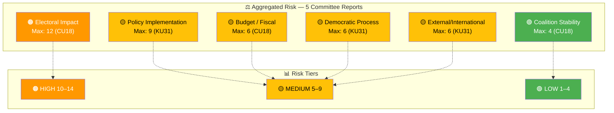

# ⚖️ Risk Assessment — Committee Reports 2026-03-27

**📋 Document Owner:** news-committee-reports | **📄 Version:** 1.0 | **📅 Generated:** 2026-03-30 05:09 UTC
**�� Owner:** Hack23 AB | **🏷️ Classification:** Public

---

## 📋 Assessment Metadata

| Field | Value |
|-------|-------|
| **Analysis Date** | 2026-03-27 |
| **Riksmöte** | 2025/26 |
| **Documents Assessed** | 5 |
| **Overall Risk Level** | 🟡 MEDIUM |
| **Confidence** | MEDIUM |

---

## 📊 Aggregated Risk Matrix

## 📊 Per-Document Risk Scores

| dok_id | Title | Coalition | Policy | Budget | Electoral | Democratic | External | Max |
|--------|-------|:---------:|:------:|:------:|:---------:|:----------:|:--------:|:---:|
| HD01CU18 | Bostadspolitik | 4 | 9 | 6 | **12** | 2 | — | 🟠 12 |
| HD01KU31 | Minoritetsspråken | 1 | 9 | 4 | 2 | 6 | 6 | 🟡 9 |
| HD01JuU16 | Polisfrågor | 2 | 6 | 4 | 9 | 2 | — | 🟡 9 |
| HD01CU17 | Konsumenträtt | 1 | 4 | 1 | 6 | 1 | 2 | 🟡 6 |
| HD01KrU10 | EU Cultural Compass | 1 | 2 | 1 | 1 | 1 | 4 | 🟢 4 |

## 🚨 Key Risk: Electoral Impact from Housing Policy

The single highest risk score (12/25) comes from CU18's rejection of 131 housing policy motions. In an election year context, housing shortage persistence combined with mass motion rejection creates a potent opposition campaign narrative. **[HIGH confidence]**

## 📋 Anomaly Flags

| # | Flag | Source | Severity |
|---|------|--------|:--------:|
| 1 | Metadata-only document (no summary) | HD01JuU16 | 🟡 |
| 2 | Riksrevisionen criticism filed without action items | HD01KU31 | 🟡 |
| 3 | No voting data available for any report | All | 🟡 |
