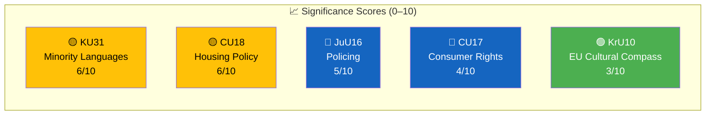

# 📈 Significance Scoring — Committee Reports 2026-03-27

**📋 Document Owner:** news-committee-reports | **📅 Generated:** 2026-03-30 05:12 UTC
**🏢 Owner:** Hack23 AB | **🏷️ Classification:** Public

---

## 📊 Scoring Overview

## 📊 Scoring Table

| Rank | dok_id | Title | Committee | Score | Urgency | Rationale |
|:----:|--------|-------|:---------:|:-----:|:-------:|-----------|
| 1 | HD01KU31 | Riksrevisionens rapport om minoritetsspråken | KU | 6/10 | ELEVATED | Constitutional rights, Riksrevisionen criticism, international obligations |
| 2 | HD01CU18 | Bostadspolitik | CU | 6/10 | ELEVATED | 131 rejected motions, housing crisis, electoral impact (risk score 12) |
| 3 | HD01JuU16 | Polisfrågor | JuU | 5/10 | ELEVATED | Core government priority area, law-and-order policy, metadata-only |
| 4 | HD01CU17 | Konsumenträtt m.m. | CU | 4/10 | ROUTINE | 83 rejected motions, consumer protection topics, moderate electoral relevance |
| 5 | HD01KrU10 | EU Cultural Compass | KrU | 3/10 | ROUTINE | EU communication filing, sovereignty positioning, low domestic impact |

**Average Significance:** 4.8/10 | **Median:** 5/10
