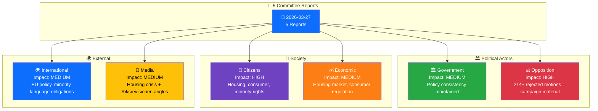

# 👥 Stakeholder Perspectives — Committee Reports 2026-03-27

**📋 Document Owner:** news-committee-reports | **📅 Generated:** 2026-03-30 05:13 UTC
**🏢 Owner:** Hack23 AB | **🏷️ Classification:** Public

---

## 📋 Stakeholder Metadata

| Field | Value |
|-------|-------|
| **Analysis Date** | 2026-03-27 |
| **Riksmöte** | 2025/26 |
| **Documents** | 5 committee reports |
| **Stakeholder Groups** | 6 (Government, Opposition, Citizens, Economic, International, Media) |
| **Confidence** | MEDIUM |

---

## 📊 Stakeholder Impact Overview

## 📊 Stakeholder Impact Matrix

| Stakeholder | Overall Impact | Key Concerns | Most Relevant Reports | Confidence |
|------------|:-------------:|--------------|----------------------|:----------:|
| 🏛️ Government | MEDIUM | Policy consistency vs. inflexibility perception; audit response adequacy | CU18 (housing), KU31 (minorities) | H |
| ⚖️ Opposition | HIGH | 214+ rejected motions provide campaign ammunition; Riksrevisionen evidence for oversight demands | CU18, CU17, KU31 | H |
| 👥 Citizens | HIGH | Housing access (131 rejected proposals), minority language preservation, consumer protection gaps | CU18, KU31, CU17 | H |
| 💰 Economic | MEDIUM | Housing construction financing, consumer regulation impact on business, circular economy proposals rejected | CU18, CU17 | M |
| 🌍 International | MEDIUM | EU cultural policy positioning, minority language treaty obligations | KrU10, KU31 | H |
| 📰 Media | MEDIUM | Housing crisis narrative, Riksrevisionen criticism, mass motion rejection pattern | CU18, KU31 | M |

## 🏛️ Government Perspective (Detailed)

**Assessment:** The government maintains policy consistency across 5 committee reports by deferring to existing measures and ongoing work. This is strategically sound for coalition stability but creates electoral risk on housing (CU18) and accountability concerns on minority languages (KU31).

**Key quotes from data:**
- CU18: "hänvisar i första hand till redan vidtagna åtgärder och pågående arbete"
- KU31: "Regeringen instämmer i huvudsak i Riksrevisionens iakttagelser"

## ⚖️ Opposition Perspective (Detailed)

**Assessment:** Opposition parties gain substantial ammunition from this day's committee reports. The combined rejection of 214+ motions (CU18 + CU17) demonstrates the structural limitation of the motion system under a majority government. The Riksrevisionen minority language finding (KU31) provides evidence-based grounds for demanding concrete government action.

**Strategic opportunity:** Focus campaign messaging on specific rejected proposals with high voter resonance: housing segregation measures (CU18), child advertising restrictions (CU17), and minority language investment (KU31).

## 👥 Citizens Perspective (Detailed)

**Assessment:** Citizens are the most broadly affected stakeholder group. Housing access (CU18) affects young voters and urban populations. Minority language preservation (KU31) directly impacts Sami, Finnish, Romani, Yiddish, and Meänkieli-speaking communities. Consumer protection gaps (CU17) affect daily life — telemarketing abuse, debt management, child advertising.

---

## 📊 Data Quality

| Metric | Value |
|--------|-------|
| **Evidence Density** | 15+ evidence points across 6 stakeholder groups |
| **Confidence** | MEDIUM |
| **Voting Data** | Not yet available |
