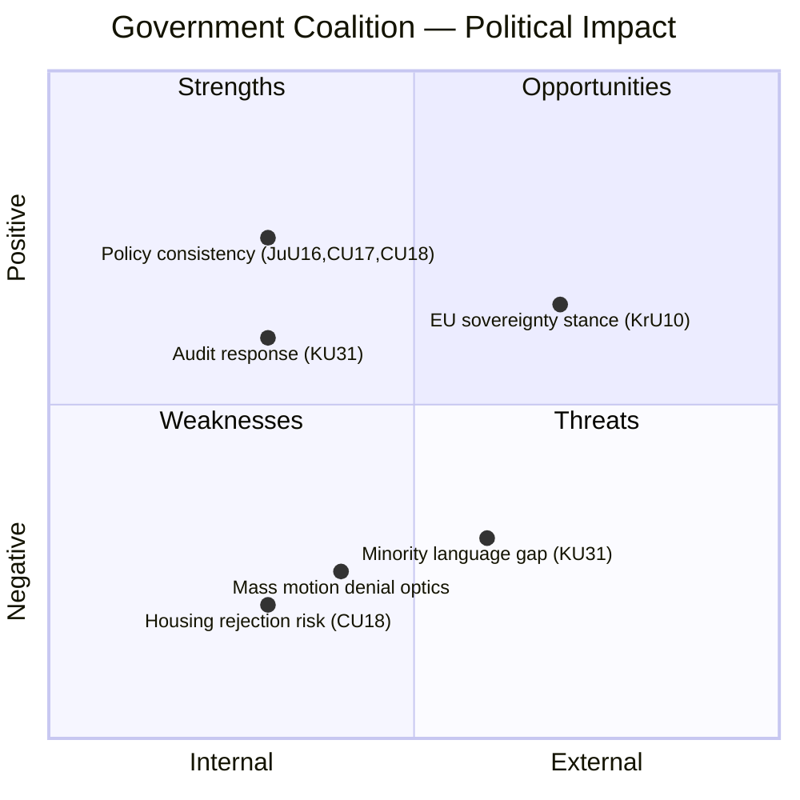

# 💪 SWOT Analysis — Committee Reports 2026-03-27

**📋 Document Owner:** news-committee-reports | **📄 Version:** 1.0 | **📅 Generated:** 2026-03-30 05:10 UTC
**🏢 Owner:** Hack23 AB | **🏷️ Classification:** Public

---

## 📋 SWOT Metadata

| Field | Value |
|-------|-------|
| **Analysis Date** | 2026-03-27 |
| **Riksmöte** | 2025/26 |
| **Documents** | 5 committee reports (JuU16, KrU10, KU31, CU18, CU17) |
| **Perspectives** | 5 stakeholder groups (Government, Opposition, Citizens, Economic, International) |
| **Confidence** | MEDIUM |

---

## 📊 SWOT Overview

---

## 🏛️ Government Coalition SWOT

### ✅ Strengths

| # | Statement | Evidence | Confidence | Impact |
|---|-----------|----------|:----------:|:------:|
| S1 | Demonstrates legislative consistency across justice, housing, and consumer domains — "already taken measures" narrative | HD01JuU16, HD01CU18, HD01CU17 | H | M |
| S2 | EU policy position coherent — welcoming cooperation while asserting sovereignty on labour/social policy | HD01KrU10: national competence emphasis | H | M |
| S3 | Responsive to audit oversight — acknowledged Riksrevisionen minority language findings | HD01KU31: "instämmer i huvudsak" | H | M |
| S4 | Law-and-order priority reinforced through policing committee review | HD01JuU16 | M | M |
| S5 | Coalition unity maintained — no internal dissent evident across 5 committee reports | All 5 reports | M | H |

### ⚠️ Weaknesses

| # | Statement | Evidence | Confidence | Impact |
|---|-----------|----------|:----------:|:------:|
| W1 | Acknowledged minority language efforts as "insufficient" but proposed no concrete new measures | HD01KU31: Riksrevisionen findings | H | M |
| W2 | 131 rejected housing motions in a housing crisis environment signals inflexibility | HD01CU18: motion rejection volume | H | H |
| W3 | 96% overall motion denial rate limits effective parliamentary dialogue with opposition | Cross-reference: riksmöte statistics | M | M |
| W4 | "Ongoing work" response pattern lacks specificity and measurable commitments | HD01CU18, HD01CU17, HD01JuU16 | H | M |
| W5 | Consumer protection deferred on child advertising and debt management — vulnerable populations affected | HD01CU17: rejected child advertising proposals | M | M |

### 🚀 Opportunities

| # | Statement | Evidence | Confidence | Impact |
|---|-----------|----------|:----------:|:------:|
| O1 | Can pre-empt opposition housing criticism with targeted policy announcements ahead of election | HD01CU18, budget cycle timing | M | H |
| O2 | EU cultural heritage digitalization offers Swedish cultural export opportunities | HD01KrU10: committee welcomes digitalization | M | L |
| O3 | Minority language strategy can be framed as commitment to constitutional values | HD01KU31: long-term commitment language | M | M |
| O4 | Policing investments highlight core electoral strength | HD01JuU16, budget proposition pipeline | M | M |
| O5 | Ongoing EU consumer harmonization delivers reforms without domestic legislative burden | HD01CU17, EU directives | M | L |

### 🔴 Threats

| # | Statement | Evidence | Confidence | Impact |
|---|-----------|----------|:----------:|:------:|
| T1 | "131 rejected housing proposals" becomes opposition campaign headline in election year | HD01CU18: rejection volume + housing crisis context | H | H |
| T2 | Council of Europe review may criticize Sweden's minority language compliance based on Riksrevisionen findings | HD01KU31: international obligations | M | M |
| T3 | Opposition crafts "government of rejection" narrative from combined 214+ denied motions | HD01CU18 + HD01CU17 | M | M |
| T4 | Media scrutiny of specific rejected proposals (child advertising, anti-segregation) could generate unfavorable coverage | HD01CU17, HD01CU18 | M | M |
| T5 | Policing gaps identified in rejected motions may surface during crime wave or security incident | HD01JuU16 | L | H |

---

## ⚖️ Opposition SWOT

### ✅ Strengths

| # | Statement | Evidence | Confidence |
|---|-----------|----------|:----------:|
| S1 | 214+ rejected motions across CU17/CU18 provide extensive election campaign material | HD01CU18, HD01CU17 | H |
| S2 | Riksrevisionen minority language criticism validates opposition oversight demands | HD01KU31 | H |
| S3 | Housing, consumer protection, and policing cover core voter concerns | All 5 reports | H |

### ⚠️ Weaknesses

| # | Statement | Evidence | Confidence |
|---|-----------|----------|:----------:|
| W1 | 96% motion denial rate demonstrates limited legislative influence | Cross-reference statistics | H |
| W2 | Volume of motions (214+) may indicate fragmented rather than focused opposition strategy | HD01CU18, HD01CU17 | M |
| W3 | Committee consensus on filing KU31 limits opposition credibility on minority rights | HD01KU31 | M |

---

## 📊 Data Quality

| Metric | Value |
|--------|-------|
| **Evidence Density** | 20+ evidence points across 5 stakeholder groups |
| **Temporal Currency** | Current |
| **Voting Data** | Not yet available |
| **Analytical Confidence** | MEDIUM |
