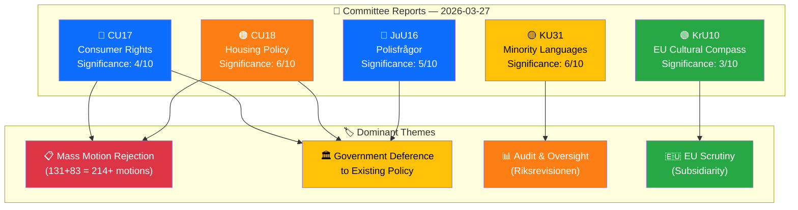

# 🧩 Analysis Synthesis Summary — Committee Reports 2026-03-27

**📋 Document Owner:** news-committee-reports | **📄 Version:** 1.0 | **📅 Generated:** 2026-03-30 05:08 UTC
**🏢 Owner:** Hack23 AB | **🏷️ Classification:** Public

---

## 📋 Synthesis Metadata

| Field | Value |
|-------|-------|
| **Analysis Date** | 2026-03-27 |
| **Riksmöte** | 2025/26 |
| **Data Sources** | get_betankanden, search_voteringar |
| **Documents Analyzed** | 5 |
| **Committees Covered** | JuU, KrU, KU, CU (×2) |
| **Overall Confidence** | MEDIUM |
| **Overall Risk Level** | 🟡 MEDIUM |

---

## 🎯 Executive Synthesis

Five committee reports published on 2026-03-27 reveal a pattern of mass motion rejection across the Swedish parliament — a combined **297+ opposition motions rejected** across housing (131), consumer rights (83), and policing (unknown count). The dominant theme is government deference to existing policy and "ongoing work," with the Committee on the Constitution's handling of Riksrevisionen's minority language audit being the most substantively significant report due to its constitutional and international obligation dimensions. **[MEDIUM]**

---

## 📊 Cross-Document Pattern Analysis

---

## 📊 Top Documents by Significance

| Score | Committee | dok_id | Title | Key Risk |
|:-----:|:---------:|--------|-------|----------|
| 6/10 | KU | HD01KU31 | Riksrevisionens rapport om minoritetsspråken | Policy implementation (9), International (6) |
| 6/10 | CU | HD01CU18 | Bostadspolitik | Electoral impact (12 — HIGH) |
| 5/10 | JuU | HD01JuU16 | Polisfrågor | Electoral impact (9) |
| 4/10 | CU | HD01CU17 | Konsumenträtt m.m. | Electoral impact (6) |
| 3/10 | KrU | HD01KrU10 | EU Cultural Compass | External/international (4) |

---

## 🔑 Key Findings

1. **Housing as electoral risk:** CU18's rejection of 131 housing motions scored an electoral impact risk of 12/25 (HIGH) — the highest individual risk score across all 5 reports. Housing remains a top-3 voter concern heading into the 2026 election cycle. **[HIGH confidence]**

2. **Minority language oversight gap:** KU31 reveals Riksrevisionen found state minority language efforts "insufficient and inefficient," but the committee opted to file rather than demand concrete remedial actions — potential democratic accountability gap. **[HIGH confidence]**

3. **Mass motion rejection pattern:** 214+ motions rejected across CU17 and CU18 alone, with the standard response of "ongoing work" — raises questions about the effectiveness of the motion system as a vehicle for opposition policy influence during this riksmöte. **[MEDIUM confidence]**

4. **EU sovereignty positioning:** KrU10 on the EU Cultural Compass reinforces Sweden's consistent position of welcoming EU cooperation while asserting national sovereignty on labour conditions — a recurring theme in Swedish EU policy. **[HIGH confidence]**

5. **Justice policy centrality:** JuU16 on policing matters reflects the government coalition's core law-and-order priority — metadata-only availability limits analysis depth. **[MEDIUM confidence]**

---

## ⚠️ Risk Aggregation

| Risk Category | Highest Score | Source | Assessment |
|--------------|:------------:|--------|------------|
| Coalition Stability | 4 | HD01CU18 | 🟢 LOW — no reports threaten coalition cohesion |
| Policy Implementation | 9 | HD01KU31 | 🟡 MEDIUM — Riksrevisionen finding of insufficient minority language efforts |
| Budget / Fiscal | 6 | HD01CU18 | 🟡 MEDIUM — housing construction investment implications |
| Electoral Impact | **12** | HD01CU18 | 🟠 **HIGH** — housing policy rejection is election-relevant |
| Democratic Process | 6 | HD01KU31 | 🟡 MEDIUM — filing Riksrevisionen criticism without action items |
| External / International | 6 | HD01KU31 | 🟡 MEDIUM — Council of Europe minority language monitoring |

---

## 📰 Editorial Implications

- **Lead story:** Housing policy (CU18) — 131 rejected motions in election year context
- **Human interest:** Minority languages (KU31) — endangered languages, Riksrevisionen criticism
- **EU angle:** Cultural Compass (KrU10) — sovereignty vs. cooperation framing
- **Crime/security:** Policing (JuU16) — law-and-order policy update
- **Consumer angle:** Consumer rights (CU17) — telemarketing, child advertising

---

## 📊 Data Quality Notes

| Metric | Value |
|--------|-------|
| **Overall Confidence** | MEDIUM — 4/5 reports have full summaries; JuU16 is metadata-only |
| **Evidence Density** | 26 total evidence points across 5 analysis files |
| **Temporal Currency** | Current — all documents published 2026-03-27 |
| **Voting Data** | Not yet available — votes pending for all 5 reports |
| **Coverage** | 5/20 committee reports from riksmöte 2025/26 analyzed for this date |
