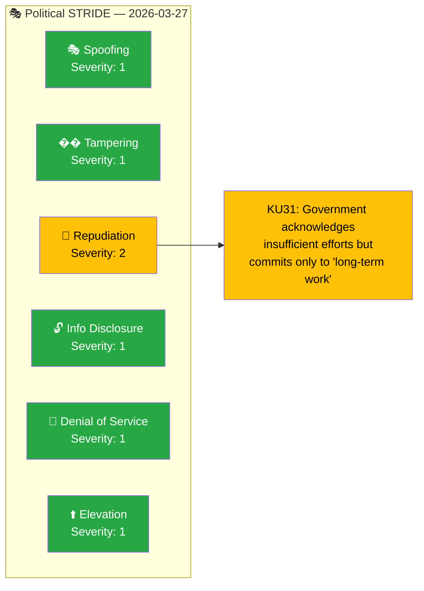

# 🎭 Threat Analysis — Committee Reports 2026-03-27

**📋 Document Owner:** news-committee-reports | **📄 Version:** 1.0 | **📅 Generated:** 2026-03-30 05:11 UTC
**🏢 Owner:** Hack23 AB | **🏷️ Classification:** Public

---

## 📋 Threat Metadata

| Field | Value |
|-------|-------|
| **Analysis Date** | 2026-03-27 |
| **Riksmöte** | 2025/26 |
| **Framework** | STRIDE-adapted for political context |
| **Documents** | 5 committee reports |
| **Overall Threat Level** | 🟢 LOW |
| **Confidence** | MEDIUM |

---

## 📊 STRIDE Political Threat Summary

## 📊 STRIDE Assessment Table

| Category | Applicable | Description | Severity (1–5) | Evidence |
|----------|:----------:|-------------|:--------------:|----------|
| 🎭 Spoofing | N | No misrepresentation detected | 1 | — |
| 🔧 Tampering | N | Standard committee procedures followed | 1 | — |
| 📝 Repudiation | Y | Government's vague "long-term" commitment to minority language improvement without measurable milestones enables future accountability evasion | 2 | HD01KU31 |
| 🔓 Info Disclosure | N | No intelligence compromise issues | 1 | — |
| 🚫 Denial of Service | N | No democratic obstruction patterns | 1 | — |
| ⬆️ Elevation | N | No executive overreach detected | 1 | — |

## 📋 Threat Detail: Repudiation (Severity 2)

The government's response to Riksrevisionen's minority language audit (HD01KU31) uses accountability-diffuse language: "angelägen om att arbeta långsiktigt" (eager to work long-term). Without specific milestones, budget allocations, or implementation timelines, this creates conditions for future accountability evasion — the government can claim continuous engagement while minority language communities see no measurable improvement. This is a minor democratic accountability concern, not a severe threat.

---

## 📊 Data Quality

| Metric | Value |
|--------|-------|
| **Overall Threat Level** | 🟢 LOW |
| **Confidence** | MEDIUM |
| **Anomaly Flags** | 1 (Repudiation concern in KU31) |
