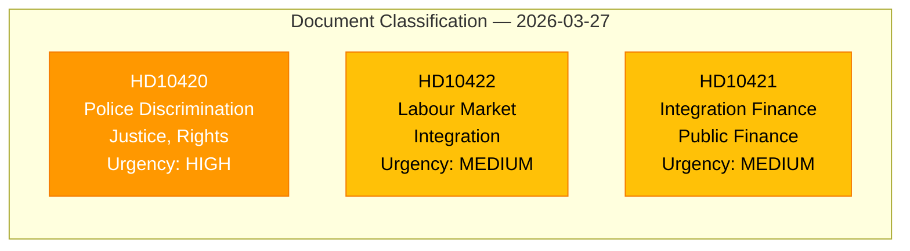

# 🏷️ Political Classification Results — 2026-03-27

## 📋 Classification Context

| Field | Value |
|-------|-------|
| **Classification ID** | `CLS-2026-03-27-001` |
| **Analysis Date** | `2026-03-30 07:30 UTC` |
| **Documents Classified** | 3 |
| **Produced By** | `news-interpellations` workflow |
| **Confidence** | `HIGH` |

---

## 📊 Classification Summary

| dok_id | Title | Type | Sensitivity | Domain | Urgency | Significance |
|--------|-------|------|:-----------:|--------|:-------:|:------------:|
| HD10420 | Polismyndighetens myndighetsutövning | Interpellation | `PUBLIC` | Justice, discrimination, human rights | `HIGH` | 7/10 |
| HD10422 | Regeringens arbetsmarknads- och integrationspolitik | Interpellation | `PUBLIC` | Labour market, integration | `MEDIUM` | 5/10 |
| HD10421 | Regeringens integrationspolitik | Interpellation | `PUBLIC` | Public finance, integration | `MEDIUM` | 5/10 |

## Key Findings

1. All 3 documents are interpellations (ip) — formal parliamentary oversight tools.
2. All filed by Social Democrats (S), targeting M and L ministers.
3. HD10420 classified highest urgency due to active DO lawsuit and rights violations.

## Data Quality Notes

Classification confidence: **HIGH**. Full-text available for all documents.
