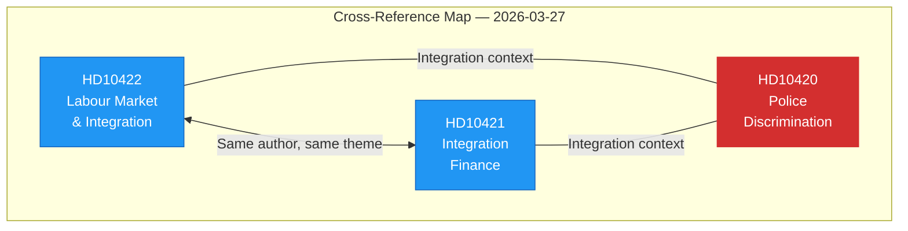

# 🔗 Cross-Document Reference Map — 2026-03-27

## 📋 Context

| Field | Value |
|-------|-------|
| **Map ID** | `XRF-2026-03-27-001` |
| **Analysis Date** | `2026-03-30 07:30 UTC` |
| **Documents Mapped** | 3 |
| **Produced By** | `news-interpellations` workflow |

---

## 📊 Cross-Reference Network

## Reference Table

| Source | Target | Relationship | Evidence | Confidence |
|--------|--------|-------------|----------|:----------:|
| HD10422 | HD10421 | Thematic overlap — integration policy | Same author (Redar), same day, overlapping text about 500K unemployed | `H` |
| HD10422 | HD10420 | Broader integration context | Both address integration failures from different angles (employment vs. rights) | `M` |
| HD10421 | HD10420 | Fiscal-rights nexus | Economic exclusion (HD10421) and institutional discrimination (HD10420) are linked | `M` |

## Key Findings

1. HD10422 and HD10421 share substantial text overlap — coordinated messaging strategy.
2. All three form a thematic cluster: integration failure manifests as unemployment (HD10422, HD10421) and institutional discrimination (HD10420).

## Data Quality Notes

Cross-reference confidence: **HIGH**. Full-text analysis confirmed textual overlap.
