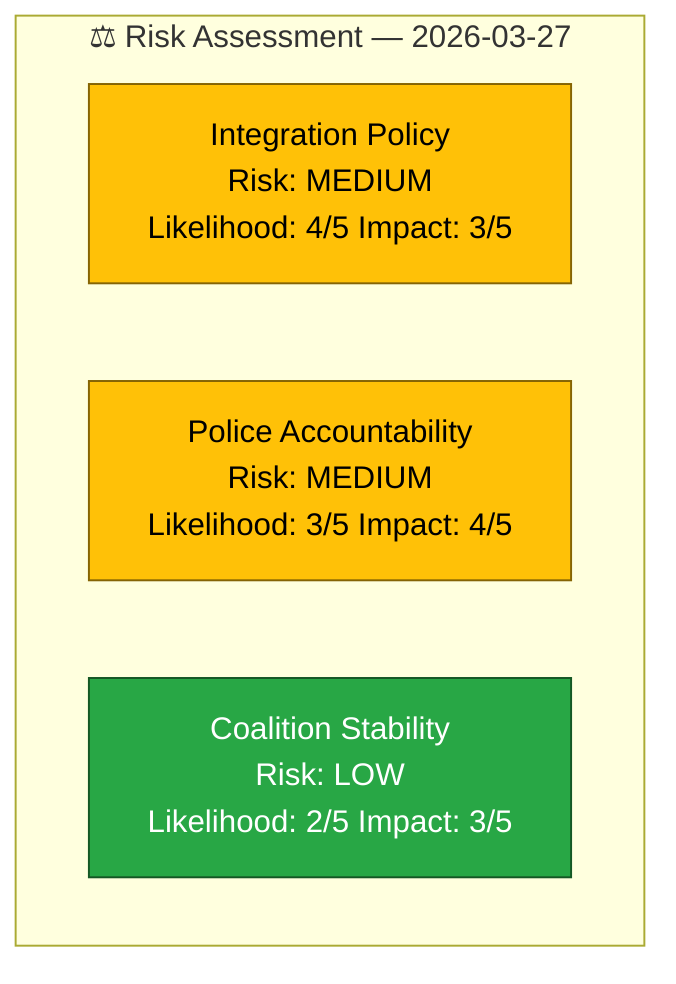

# ⚠️ Political Risk Assessment — 2026-03-27

## 📋 Risk Context

| Field | Value |
|-------|-------|
| **Risk ID** | `RSK-2026-03-27-001` |
| **Analysis Date** | `2026-03-30 07:30 UTC` |
| **Documents Analyzed** | 3 |
| **Produced By** | `news-interpellations` workflow |
| **Overall Risk Level** | `MEDIUM` |

---

## 📊 Risk Dashboard

## 🔢 Risk Matrix (5x5 Likelihood x Impact)

| Risk | Likelihood | Impact | Score | Level | Evidence |
|------|:----------:|:------:|:-----:|:-----:|----------|
| Government integration credibility erosion | 4 | 3 | 12 | `MEDIUM` | HD10422, HD10421 — SEK 4.3B returned, 500K+ unemployed |
| Police discrimination accountability | 3 | 4 | 12 | `MEDIUM` | HD10420 — DO lawsuit, murder case, discrimination law gap |
| Coalition stability from interpellation pressure | 2 | 3 | 6 | `LOW` | Coalition stability at 83/100, SD support intact |
| Election 2026 integration wedge issue | 4 | 4 | 16 | `HIGH` | HD10421 — 1-2% GDP cost, coordinated S strategy |

## Key Findings

1. **`[HIGH]`** Election 2026 risk: Integration becomes opposition campaign centrepiece with quantifiable fiscal metrics.
2. **`[MEDIUM]`** Police discrimination case creates reputational risk for Justice Ministry.
3. **`[LOW]`** Coalition stability unaffected — interpellations are oversight tools, not confidence motions.

## Implications

Risk profile is dominated by medium-term election dynamics. Short-term coalition risk remains low, but the coordination of 3 interpellations signals strategic opposition planning.

## Data Quality Notes

Risk assessment confidence: **HIGH**. Based on full-text content and CIA coalition metrics.
