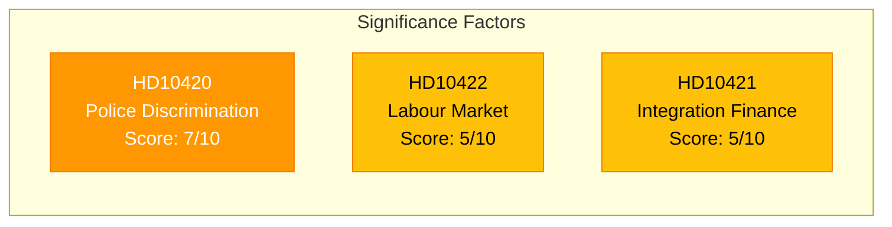

# 📈 Document Significance Scoring — 2026-03-27

## 📋 Scoring Context

| Field | Value |
|-------|-------|
| **Scoring ID** | `SIG-2026-03-27-001` |
| **Analysis Date** | `2026-03-30 07:30 UTC` |
| **Documents Scored** | 3 |
| **Produced By** | `news-interpellations` workflow |

---

## 📊 Significance Scores

| Score | Level | dok_id | Title | Author | Target Minister | Urgency |
|:-----:|:-----:|--------|-------|--------|-----------------|:-------:|
| 7/10 | `HIGH` | HD10420 | Polismyndighetens myndighetsutövning | Lawen Redar (S) | Gunnar Strömmer (M) | `HIGH` |
| 5/10 | `MEDIUM` | HD10422 | Regeringens arbetsmarknads- och integrationspolitik | Lawen Redar (S) | Johan Britz (L) | `MEDIUM` |
| 5/10 | `MEDIUM` | HD10421 | Regeringens integrationspolitik | Lawen Redar (S) | Elisabeth Svantesson (M) | `MEDIUM` |

## 📊 Scoring Factors

| Factor | HD10420 | HD10422 | HD10421 |
|--------|:-------:|:-------:|:-------:|
| Document type (interpellation) | +2 | +2 | +2 |
| Full-text available | +1 | +1 | +1 |
| Policy domain breadth | +2 (justice, rights, discrimination) | +1 (labour market) | +1 (fiscal) |
| Human dimension | +2 (murder case, DO lawsuit) | 0 | 0 |
| Quantitative evidence | 0 | +1 (SEK 4.3B) | +1 (1-2% GDP) |
| **Total** | **7/10** | **5/10** | **5/10** |

## Key Findings

1. **HD10420** scores highest — human tragedy combined with institutional failure and legal gap.
2. **HD10422 and HD10421** are complementary economic arguments targeting different ministers.
3. All three announced in Riksdag 2026-03-30 with response deadlines April 13-17.

## Data Quality Notes

Significance confidence: **HIGH**. Full-text scoring with cross-referenced timeline data.
