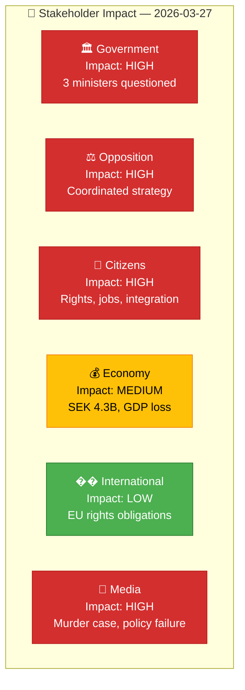

# 👥 Stakeholder Perspective Analysis — 2026-03-27

## 📋 Analysis Context

| Field | Value |
|-------|-------|
| **Analysis ID** | `STK-2026-03-27-001` |
| **Analysis Date** | `2026-03-30 07:30 UTC` |
| **Documents Analyzed** | 3 |
| **Lenses Applied** | 6 (Government, Opposition, Citizen, Economic, International, Media) |
| **Produced By** | `news-interpellations` workflow |

---

## 📊 Stakeholder Impact Matrix

## 🏛️ Government Perspective

| Metric | Value | Evidence | Confidence |
|--------|-------|----------|:----------:|
| Ministers questioned | 3 (Britz, Svantesson, Strommer) | HD10422, HD10421, HD10420 | `H` |
| Response deadline | April 13-17, 2026 | Document timelines | `H` |
| Policy domains challenged | Labour, Finance, Justice | All three interpellations | `H` |
| Coalition stability impact | Low (83/100 maintained) | CIA data | `H` |

## ⚖️ Opposition Perspective

| Metric | Value | Evidence | Confidence |
|--------|-------|----------|:----------:|
| Filing MP | Lawen Redar (S) — all 3 | HD10422, HD10421, HD10420 | `H` |
| Strategy type | Coordinated multi-minister pressure | Same day, same MP, 3 targets | `H` |
| Key argument | SEK 4.3B unused + 1-2% GDP loss | HD10422, HD10421 | `H` |
| Motion denial rate | 96% | CIA coalition data | `H` |

## 👥 Citizen Perspective

| Metric | Value | Evidence | Confidence |
|--------|-------|----------|:----------:|
| Affected population | 500,000+ unemployed foreign-born | HD10422, HD10421 | `H` |
| Rights violation | DO lawsuit for police discrimination | HD10420 | `H` |
| Child rights breach | Minor used as interpreter (Barnkonventionen) | HD10420 | `H` |
| Economic impact per person | SEK 340,000 fiscal gain if employed | HD10421 | `H` |

## 💰 Economic Perspective

| Metric | Value | Evidence | Confidence |
|--------|-------|----------|:----------:|
| Unused funds returned | SEK 4.3 billion | HD10422 | `H` |
| Annual GDP loss | 1-2% of GDP | HD10421 | `M` |
| Potential savings | SEK 54 billion/year (20% exclusion reduction) | HD10421 | `M` |

## 📰 Media Perspective

| Metric | Value | Evidence | Confidence |
|--------|-------|----------|:----------:|
| Newsworthiness — HD10420 | HIGH (murder case, DO lawsuit) | HD10420 full text | `H` |
| Newsworthiness — HD10422 | MEDIUM (SEK 4.3B waste) | HD10422 full text | `H` |
| Narrative frames | integration-failure, police-discrimination, fiscal-waste | All three | `H` |

## Key Findings

1. **4 of 6 stakeholder groups** rate impact as HIGH — government, opposition, citizens, media.
2. Police discrimination case (HD10420) has highest cross-stakeholder resonance.
3. Economic perspective provides quantifiable arguments for election debate framing.

## Data Quality Notes

Stakeholder confidence: **HIGH**. Full-text analysis across all 6 lenses.
