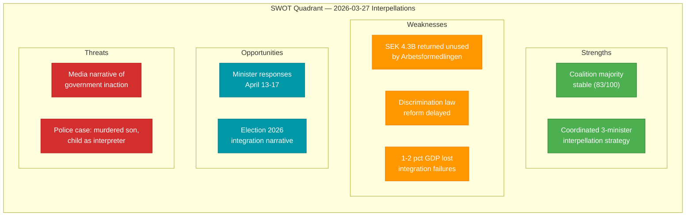

# 💼 Political SWOT Analysis — 2026-03-27

## 📋 SWOT Context

| Field | Value |
|-------|-------|
| **SWOT ID** | `SWT-2026-03-27-001` |
| **Analysis Date** | `2026-03-30 07:30 UTC` |
| **Analysis Scope** | Government coalition vs opposition on integration & justice |
| **Reference Period** | 2026-W13 |
| **Produced By** | `news-interpellations` workflow |
| **Primary MCP Sources** | `get_interpellationer`, `get_dokument_innehall` |
| **Validity Window** | Valid until 2026-04-17 (sista svarsdatum) |

---

## 🏛️ Government Coalition SWOT

### ✅ Strengths

| # | Strength Statement | Evidence (dok_id) | Confidence | Impact | Entry Date |
|---|-------------------|-------------------|:----------:|:------:|:----------:|
| S1 | Coalition maintains Riksdag majority through SD support agreement | CIA coalition data (stability 83/100) | `H` | `H` | 2026-03-27 |
| S2 | Multiple ministers involved shows government breadth across policy areas | HD10422, HD10421, HD10420 (3 ministers from M, L) | `H` | `M` | 2026-03-27 |

### ⚠️ Weaknesses

| # | Weakness Statement | Evidence (dok_id) | Confidence | Impact | Entry Date |
|---|-------------------|-------------------|:----------:|:------:|:----------:|
| W1 | Arbetsformedlingen returned SEK 4.3 billion while 500,000+ unemployed — resource utilization failure | HD10422 full text | `H` | `H` | 2026-03-27 |
| W2 | Delayed discrimination law reform — proposal remissbehandlad but not presented | HD10420 full text | `H` | `M` | 2026-03-27 |
| W3 | Integration policy inaction costing 1-2% GDP annually per Svenskt Naringsliv | HD10421 full text | `M` | `H` | 2026-03-27 |

### 🌟 Opportunities

| # | Opportunity Statement | Evidence (dok_id) | Confidence | Impact | Entry Date |
|---|----------------------|-------------------|:----------:|:------:|:----------:|
| O1 | Government can demonstrate policy progress through minister responses (due April 13-17) | HD10422, HD10421, HD10420 timeline | `H` | `M` | 2026-03-27 |
| O2 | Discrimination law reform could be fast-tracked as pre-election legislative win | HD10420 full text | `M` | `M` | 2026-03-27 |

### 🔴 Threats

| # | Threat Statement | Evidence (dok_id) | Confidence | Impact | Entry Date |
|---|-----------------|-------------------|:----------:|:------:|:----------:|
| T1 | Coordinated S interpellations create sustained media narrative of government inaction | HD10422, HD10421, HD10420 (all Lawen Redar) | `H` | `H` | 2026-03-27 |
| T2 | Police discrimination case has emotional resonance — murdered son, child used as interpreter | HD10420 full text | `H` | `H` | 2026-03-27 |
| T3 | Election 2026 vulnerability: SEK 54 billion waste narrative on integration | HD10421 full text | `M` | `H` | 2026-03-27 |

---

## ⚖️ Opposition SWOT (Social Democrats)

### ✅ Strengths

| # | Strength Statement | Evidence (dok_id) | Confidence | Impact | Entry Date |
|---|-------------------|-------------------|:----------:|:------:|:----------:|
| S1 | Coordinated interpellation offensive targeting 3 ministers simultaneously | HD10422, HD10421, HD10420 | `H` | `H` | 2026-03-27 |
| S2 | Quantifiable economic arguments — SEK 4.3B waste, 54B potential savings, 340K per person | HD10422, HD10421 | `H` | `H` | 2026-03-27 |
| S3 | Human rights case with DO lawsuit creates moral authority | HD10420 full text | `H` | `H` | 2026-03-27 |

### ⚠️ Weaknesses

| # | Weakness Statement | Evidence (dok_id) | Confidence | Impact | Entry Date |
|---|-------------------|-------------------|:----------:|:------:|:----------:|
| W1 | High motion denial rate (96%) limits legislative impact | CIA coalition data | `H` | `M` | 2026-03-27 |
| W2 | Integration challenges also existed under previous S-led governments | Historical context | `M` | `M` | 2026-03-27 |

### 🌟 Opportunities

| # | Opportunity Statement | Evidence (dok_id) | Confidence | Impact | Entry Date |
|---|----------------------|-------------------|:----------:|:------:|:----------:|
| O1 | Minister responses (or non-responses) create follow-up debate opportunities | HD10422, HD10421, HD10420 timeline | `H` | `M` | 2026-03-27 |
| O2 | Election 2026 campaign integration narrative building | All three interpellations | `H` | `H` | 2026-03-27 |

### 🔴 Threats

| # | Threat Statement | Evidence (dok_id) | Confidence | Impact | Entry Date |
|---|-----------------|-------------------|:----------:|:------:|:----------:|
| T1 | Government may deflect by citing S record on integration during their own tenure | Historical context | `M` | `M` | 2026-03-27 |

---

## 📊 SWOT Quadrant Mapping

## Key Findings

1. **`[HIGH]`** Government faces coordinated accountability pressure on integration — 3 interpellations from same MP targeting 3 ministers.
2. **`[HIGH]`** Police discrimination case (HD10420) is highest-impact due to human dimension and legal gap.
3. **`[MEDIUM]`** Integration failure costs are quantifiable — provides election campaign ammunition.

## Implications

SWOT analysis reveals government vulnerability on integration policy and police accountability. Social Democrats' coordinated strategy maximises media attention by targeting multiple ministers simultaneously.

## Data Quality Notes

SWOT confidence: **HIGH**. Full-text content available for all 3 interpellations.
