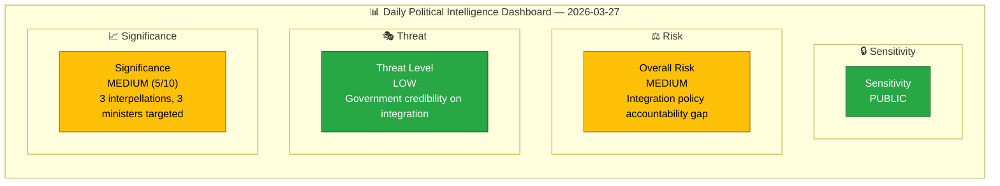
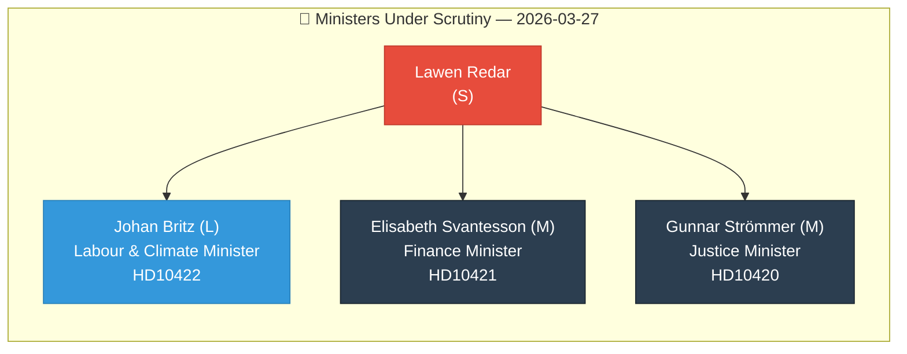

# 🧩 Political Intelligence Synthesis — 2026-03-27

## 📋 Synthesis Context

| Field | Value |
|-------|-------|
| **Synthesis ID** | `SYN-2026-03-27-001` |
| **Analysis Date** | `2026-03-30 07:30 UTC` |
| **Documents Analyzed** | 3 |
| **Analysis Period** | `2026-03-27 00:00–23:59 UTC` |
| **Produced By** | `news-interpellations` workflow |
| **Overall Confidence** | `HIGH` |
| **Primary MCP Sources** | `get_interpellationer`, `get_dokument_innehall` |

---

## 📊 Intelligence Dashboard

## 📋 Document Summary

| # | dok_id | Title | Author | Target Minister | Policy Domain | Significance |
|---|--------|-------|--------|-----------------|---------------|:------------:|
| 1 | HD10422 | Regeringens arbetsmarknads- och integrationspolitik | Lawen Redar (S) | Johan Britz (L) — Labour & Climate | Labour market, integration | `[MEDIUM]` 5/10 |
| 2 | HD10421 | Regeringens integrationspolitik | Lawen Redar (S) | Elisabeth Svantesson (M) — Finance | Public finance, integration | `[MEDIUM]` 5/10 |
| 3 | HD10420 | Polismyndighetens myndighetsutövning | Lawen Redar (S) | Gunnar Strömmer (M) — Justice | Justice, discrimination, human rights | `[HIGH]` 7/10 |

## 🔍 Key Findings

1. **`[HIGH]` Coordinated Opposition Offensive**: All 3 interpellations filed by same MP (Lawen Redar, S) on same day, targeting 3 different ministers — suggests coordinated Social Democrat strategy to pressure government on integration and rights.
2. **`[HIGH]` Police Discrimination Case (HD10420)**: DO (Discrimination Ombudsman) has sued Police — son found murdered after police failed to provide interpreter to Somali-background woman. Discrimination law gaps exposed.
3. **`[MEDIUM]` Fiscal Waste Evidence (HD10422)**: Arbetsförmedlingen returned SEK 4.3 billion to state while 500,000+ unemployed — concrete accountability metric.
4. **`[MEDIUM]` GDP Cost of Exclusion (HD10421)**: Sweden loses 1-2% GDP annually from integration failures; SEK 54 billion recoverable if exclusion reduced 20%.
5. **`[MEDIUM]` All interpellations announced in Riksdag today (2026-03-30)** — response deadlines April 13-17.

## 🏛️ Ministerial Accountability Matrix

## 📊 Thematic Analysis

### Theme 1: Integration & Labour Market (HD10422, HD10421)

| Metric | Value | Evidence | Confidence |
|--------|-------|----------|:----------:|
| Unused employment funds | SEK 4.3 billion returned | HD10422 full text | `H` |
| Unemployed foreign-born | 500,000+ persons | HD10422, HD10421 | `H` |
| Annual GDP loss from exclusion | 1-2% of GDP | HD10421, Svenskt Näringsliv | `M` |
| Per-person fiscal gain | SEK 340,000/year | HD10421 full text | `H` |
| Potential savings (20% reduction) | SEK 54 billion/year | HD10421, Svenskt Näringsliv estimate | `M` |

### Theme 2: Police Discrimination & Rights (HD10420)

| Metric | Value | Evidence | Confidence |
|--------|-------|----------|:----------:|
| DO lawsuit against Police | Active (filed 2026) | HD10420 full text | `H` |
| Interpreter failures | Multiple contacts, 1 interpreter session | HD10420 full text | `H` |
| Discrimination law coverage gap | Police not fully covered | HD10420 full text | `H` |
| Child rights violation | Barnkonventionen breach (minor used as interpreter) | HD10420 full text | `H` |

## 🔮 Forward Indicators

| Watch Item | Timeline | Probability | Impact |
|------------|----------|:-----------:|:------:|
| Minister responses to all 3 interpellations | 2026-04-13 to 2026-04-17 | `H` | `M` |
| Riksdag debate on interpellations | April 2026 (after Easter) | `H` | `M` |
| Discrimination law extension proposal | 2026 H1 (government has delayed) | `M` | `H` |
| Arbetsformedlingen budget accountability review | Budget proposition autumn 2026 | `M` | `M` |
| Election 2026 campaign — integration as wedge issue | September 2026 | `H` | `H` |

## Implications

The Social Democrats are executing a coordinated interpellation strategy targeting the government's integration record ahead of Election 2026. The police discrimination case (HD10420) has highest newsworthiness due to the tragic human dimension and concrete legal gaps. Integration policy interpellations (HD10422, HD10421) provide quantifiable economic arguments — SEK 4.3 billion unused, 1-2% GDP lost annually.

## Data Quality Notes

Overall confidence: **HIGH**. Full-text content available for all 3 interpellations. Cross-referenced with MCP document metadata and timeline data.
