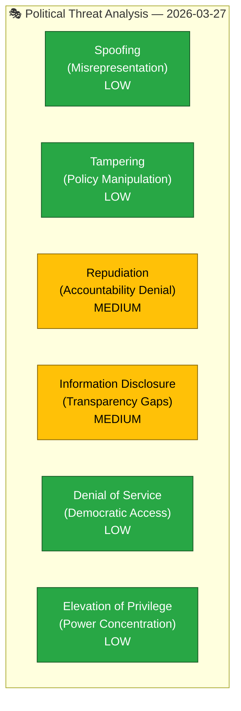

# 🔴 Political Threat Analysis — 2026-03-27

## 📋 Threat Context

| Field | Value |
|-------|-------|
| **Threat ID** | `THR-2026-03-27-001` |
| **Analysis Date** | `2026-03-30 07:30 UTC` |
| **Documents Analyzed** | 3 |
| **Produced By** | `news-interpellations` workflow |
| **Overall Threat Level** | `MEDIUM` |

---

## 📊 Threat Dashboard (STRIDE-Adapted)

## Detailed Threat Assessment

| STRIDE Category | Threat | Severity | Evidence | Confidence |
|----------------|--------|:--------:|----------|:----------:|
| Repudiation | Government may deflect accountability for Arbetsformedlingen's SEK 4.3B unused funds | `MEDIUM` | HD10422 — minister response due April 13 | `H` |
| Repudiation | Justice Minister may delay discrimination law reform further | `MEDIUM` | HD10420 — reform already delayed despite completed remiss | `H` |
| Information Disclosure | Gap in discrimination law means police misconduct not fully trackable | `MEDIUM` | HD10420 — DO identified legal coverage gap | `H` |
| Denial of Service | Interpreter access failure impeded victim's access to justice | `HIGH` | HD10420 — son found murdered on day 5 of failed police response | `H` |

## Key Findings

1. **`[HIGH]`** Police interpreter failure constitutes denial of access to justice (HD10420).
2. **`[MEDIUM]`** Accountability denial risk on integration spending — unclear where SEK 4.3B was redirected.
3. **`[MEDIUM]`** Discrimination law gap enables future institutional discrimination without recourse.

## Data Quality Notes

Threat analysis confidence: **HIGH**. Based on full-text interpellation content.
