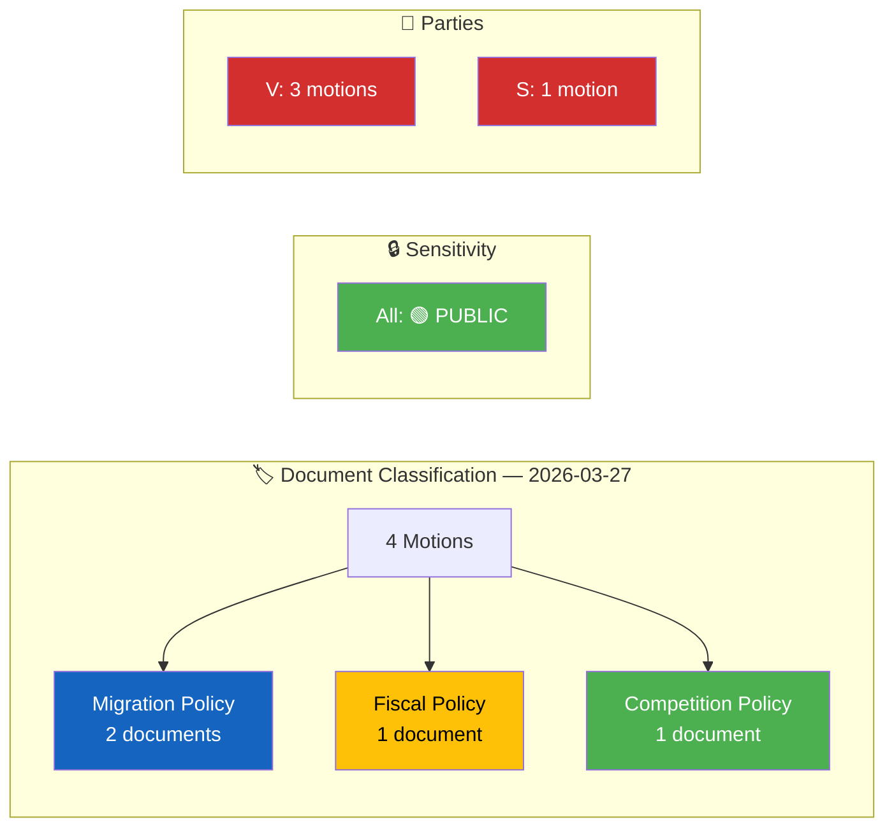

# Political Classification Results — 2026-03-27

## 📋 Classification Context

| Field | Value |
|-------|-------|
| **Classification ID** | `CLS-2026-03-27-MOT` |
| **Analysis Date** | `2026-03-30 06:41 UTC` |
| **Documents Classified** | 4 |
| **Produced By** | `news-motions` |
| **Confidence** | **MEDIUM** |

---

## 📊 Classification Overview

## Classification Table

| dok_id | Title | Type | Sensitivity | Significance | Domains | Committee | Confidence |
|--------|-------|------|:-----------:|:------------:|---------|-----------|:----------:|
| HD023993 | Cash payment functionality | Motion (Kommittémotion) | 🟢 PUBLIC | 🟡 4/10 | Fiscal policy, consumer protection | FiU | `M` (69%) |
| HD023990 | Citizenship requirements (S) | Motion (Kommittémotion) | 🟢 PUBLIC | 🟢 3/10 | Migration policy, constitutional rights | SfU | `M` (69%) |
| HD023991 | Citizenship requirements (V) | Motion (Kommittémotion) | 🟢 PUBLIC | 🟢 3/10 | Migration policy, human rights | SfU | `M` (69%) |
| HD023992 | Competition tools | Motion (Kommittémotion) | 🟢 PUBLIC | 🟢 3/10 | Trade & industry, market regulation | NU | `M` (69%) |

## Document Control

| Field | Value |
|-------|-------|
| **Classification** | PUBLIC |
| **Retention** | 12 months |
